# 域论 - 增强版

## 📚 概述

域论是抽象代数学的核心分支，研究具有除法运算的代数结构。
域的概念统一了数论、代数几何、伽罗瓦理论等众多数学领域，是现代代数学的基础理论之一。

## 🕰️ 历史发展脉络

### 早期发展 (1800-1900)

#### 数论背景

- **1801年**: 高斯《算术研究》研究二次域
  - 建立二次型理论
  - 研究二次域的结构
  - 为域论奠定数论基础
- **1847年**: 库默尔研究分圆域
  - 研究分圆域的性质
  - 引入理想数概念
  - 为域论提供数论背景
- **1871年**: 戴德金建立理想理论
  - 将理想数抽象为理想
  - 建立戴德金整环理论
  - 为域论奠定代数基础

#### 代数方程背景

- **1824年**: 阿贝尔证明五次方程不可解
  - 严格证明五次及以上方程不可用根式求解
  - 引入阿贝尔群概念
  - 为伽罗瓦理论奠定基础
- **1832年**: 伽罗瓦建立伽罗瓦理论
  - 建立域扩张与群之间的对应关系
  - 解决代数方程可解性问题
  - 为域论提供核心理论
- **1846年**: 刘维尔发表伽罗瓦论文
  - 整理并发表伽罗瓦的遗作
  - 使伽罗瓦理论广为人知
  - 为域论发展奠定基础

### 现代发展 (1900-1950)

#### 抽象域论

- **1910年**: 施泰尼茨建立域论基础
  - 首次给出域的抽象定义
  - 建立域论的公理化体系
  - 将域论从具体应用中抽象出来
- **1920年**: 阿廷发展伽罗瓦理论
  - 完善伽罗瓦理论
  - 建立阿廷L函数
  - 为域论提供现代工具
- **1930年**: 范德瓦尔登《现代代数》
  - 系统化域论理论
  - 建立现代代数学体系
  - 为域论教育奠定基础

#### 代数几何背景

- **1882年**: 诺特研究代数函数域
  - 研究代数函数域的结构
  - 引入代数几何的概念
  - 为域论提供几何背景
- **1890年**: 戴德金-韦伯理论
  - 建立代数函数域理论
  - 连接数论和几何
  - 为现代代数几何奠定基础
- **1920年**: 扎里斯基代数几何
  - 建立现代代数几何
  - 研究代数簇的结构
  - 为域论提供几何应用

### 当代发展 (1950-至今)

#### 代数数论

- **1950年代**: 类域论发展
  - 完善类域论理论
  - 建立阿贝尔扩张理论
  - 为域论提供数论应用
- **1960年代**: 朗兰兹纲领
  - 提出朗兰兹纲领
  - 连接数论和表示论
  - 为域论开辟新方向
- **1970年代**: 椭圆曲线理论
  - 发展椭圆曲线理论
  - 在数论中的应用
  - 为域论提供新工具

#### 代数几何

- **1960年代**: 格罗滕迪克概形理论
  - 建立概形理论
  - 革命性改变代数几何
  - 为域论提供几何框架
- **1970年代**: 德利涅上同调
  - 建立上同调理论
  - 证明韦伊猜想
  - 为域论提供拓扑工具
- **1980年代**: 莫德尔-朗兰兹纲领
  - 发展朗兰兹纲领
  - 连接几何和数论
  - 为域论开辟新领域

### 重要人物贡献

| 人物 | 时期 | 主要贡献 | 影响 |
|------|------|----------|------|
| 高斯 | 1801 | 二次域理论 | 为数论奠定基础 |
| 阿贝尔 | 1824 | 阿贝尔群，方程可解性 | 为伽罗瓦理论奠定基础 |
| 伽罗瓦 | 1832 | 伽罗瓦理论 | 革命性改变代数学 |
| 库默尔 | 1847 | 分圆域，理想数 | 为数论提供工具 |
| 戴德金 | 1871 | 理想理论 | 建立现代代数基础 |
| 施泰尼茨 | 1910 | 抽象域论 | 建立域论公理化体系 |
| 阿廷 | 1920 | 伽罗瓦理论，L函数 | 为域论提供现代工具 |
| 扎里斯基 | 1920 | 代数几何 | 现代代数几何基础 |
| 格罗滕迪克 | 1960s | 概形理论 | 革命性改变代数几何 |
| 朗兰兹 | 1960s | 朗兰兹纲领 | 菲尔兹奖工作 |
| 德利涅 | 1970s | 韦伊猜想 | 菲尔兹奖工作 |
| 威尔斯 | 1990s | 费马大定理 | 菲尔兹奖工作 |

### 重要历史事件时间线

```mermaid
timeline
    title 域论发展重要事件
    1801年 : 高斯《算术研究》
    1824年 : 阿贝尔证明五次方程不可解
    1832年 : 伽罗瓦建立伽罗瓦理论
    1847年 : 库默尔研究分圆域
    1910年 : 施泰尼茨建立抽象域论
    1920年 : 阿廷发展伽罗瓦理论
    1960年代 : 朗兰兹纲领
    1970年代 : 德利涅韦伊猜想
    1990年代 : 威尔斯费马大定理
```



### 理论发展脉络

#### 从具体到抽象的发展

**阶段1：具体数域**:

- 有理数域、实数域、复数域
- 二次域、分圆域
- 有限域、p进数域

**阶段2：代数函数域**:

- 一元代数函数域
- 多元代数函数域
- 形式幂级数域

**阶段3：抽象域论**:

- 域的公理化定义
- 域扩张理论
- 伽罗瓦理论

**阶段4：现代发展**:

- 类域论
- 朗兰兹纲领
- 代数几何

#### 从有限到无限的发展

**有限域理论**:

- 有限域的结构
- 有限域的构造
- 有限域的应用

**无限域理论**:

- 代数数域
- 函数域
- 局部域

**现代无限域**:

- 概形上的域
- 非交换域
- 量子域

#### 从局部到整体的发展

**局部域理论**:

- p进数域
- 局部类域论
- 局部朗兰兹纲领

**整体域理论**:

- 代数数域
- 函数域
- 整体类域论

**现代整体理论**:

- 朗兰兹纲领
- 几何朗兰兹纲领
- 量子几何朗兰兹纲领

## 🏗️ 核心概念

### 域的定义

```lean
-- Lean 4 形式化定义
structure Field where
  carrier : Type
  add : carrier → carrier → carrier
  mul : carrier → carrier → carrier
  zero : carrier
  one : carrier
  neg : carrier → carrier
  inv : carrier → carrier
  
  -- 加法群公理
  add_assoc : ∀ a b c, add (add a b) c = add a (add b c)
  add_comm : ∀ a b, add a b = add b a
  add_zero : ∀ a, add a zero = a
  add_neg : ∀ a, add a (neg a) = zero
  
  -- 乘法群公理（非零元素）
  mul_assoc : ∀ a b c, mul (mul a b) c = mul a (mul b c)
  mul_comm : ∀ a b, mul a b = mul b a
  mul_one : ∀ a, mul a one = a
  mul_inv : ∀ a, a ≠ zero → mul a (inv a) = one
  
  -- 分配律
  left_distrib : ∀ a b c, mul a (add b c) = add (mul a b) (mul a c)
  right_distrib : ∀ a b c, mul (add a b) c = add (mul a c) (mul b c)
  
  -- 零元性质
  zero_mul : ∀ a, mul zero a = zero
  mul_zero : ∀ a, mul a zero = zero
```

### 基本性质

#### 1. 加法群性质

- 结合律：$(a + b) + c = a + (b + c)$
- 交换律：$a + b = b + a$
- 零元：$a + 0 = 0 + a = a$
- 负元：$a + (-a) = (-a) + a = 0$

#### 2. 乘法群性质（非零元素）

- 结合律：$(a \cdot b) \cdot c = a \cdot (b \cdot c)$
- 交换律：$a \cdot b = b \cdot a$
- 单位元：$a \cdot 1 = 1 \cdot a = a$
- 逆元：$a \cdot a^{-1} = a^{-1} \cdot a = 1$（$a \neq 0$）

#### 3. 分配律

- 左分配律：$a \cdot (b + c) = a \cdot b + a \cdot c$
- 右分配律：$(a + b) \cdot c = a \cdot c + b \cdot c$

## 📊 可视化图表

### 域的结构图

```mermaid
graph TD
    A[域 F] --> B[加法群]
    A --> C[乘法群 F*]
    A --> D[分配律]
    
    B --> E[结合律]
    B --> F[交换律]
    B --> G[零元]
    B --> H[负元]
    
    C --> I[结合律]
    C --> J[交换律]
    C --> K[单位元]
    C --> L[逆元]
    
    D --> M[左分配律]
    D --> N[右分配律]
```



### 域的类型关系图

```mermaid
graph TD
    A[域] --> B[有限域]
    A --> C[无限域]
    A --> D[代数闭域]
    A --> E[完全域]
    
    B --> F[特征p域]
    B --> G[伽罗瓦域]
    
    C --> H[实数域]
    C --> I[复数域]
    C --> J[有理数域]
    
    D --> K[代数闭包]
    E --> L[完全闭包]
```



### 域扩张关系图

```mermaid
graph TD
    A[基域 F] --> B[代数扩张]
    A --> C[超越扩张]
    A --> D[有限扩张]
    A --> E[无限扩张]
    
    B --> F[单扩张]
    B --> G[正规扩张]
    B --> H[可分扩张]
    
    C --> I[纯超越扩张]
    C --> J[混合扩张]
    
    D --> K[伽罗瓦扩张]
    E --> L[无限伽罗瓦扩张]
```



## 🔍 实例表征

### 1. 数域实例

#### 有理数域 (ℚ, +, ×)

```haskell
-- Haskell 实现
data Rational = Rational {
    numerator :: Integer,
    denominator :: Integer
}

instance Field Rational where
  zero = Rational 0 1
  one = Rational 1 1
  neg (Rational n d) = Rational (-n) d
  inv (Rational n d) = if n == 0 then error "Division by zero" else Rational d n
  
  add (Rational n1 d1) (Rational n2 d2) = 
    Rational (n1 * d2 + n2 * d1) (d1 * d2)
  
  mul (Rational n1 d1) (Rational n2 d2) = 
    Rational (n1 * n2) (d1 * d2)
```

#### 实数域 (ℝ, +, ×)

```rust
// Rust 实现
#[derive(Debug, Clone, PartialEq)]
pub struct RealField {
    value: f64,
}

impl RealField {
    pub fn new(value: f64) -> Self {
        RealField { value }
    }
    
    pub fn add(&self, other: &RealField) -> RealField {
        RealField::new(self.value + other.value)
    }
    
    pub fn mul(&self, other: &RealField) -> RealField {
        RealField::new(self.value * other.value)
    }
    
    pub fn zero() -> RealField {
        RealField::new(0.0)
    }
    
    pub fn one() -> RealField {
        RealField::new(1.0)
    }
    
    pub fn neg(&self) -> RealField {
        RealField::new(-self.value)
    }
    
    pub fn inv(&self) -> Result<RealField, &'static str> {
        if self.value == 0.0 {
            Err("Division by zero")
        } else {
            Ok(RealField::new(1.0 / self.value))
        }
    }
}
```

#### 复数域 (ℂ, +, ×)

```lean
-- Lean 4 实现
structure ComplexField where
  real : ℝ
  imag : ℝ

def add (a b : ComplexField) : ComplexField :=
  ⟨a.real + b.real, a.imag + b.imag⟩

def mul (a b : ComplexField) : ComplexField :=
  ⟨a.real * b.real - a.imag * b.imag, a.real * b.imag + a.imag * b.real⟩

def zero : ComplexField := ⟨0, 0⟩

def one : ComplexField := ⟨1, 0⟩

def neg (a : ComplexField) : ComplexField :=
  ⟨-a.real, -a.imag⟩

def inv (a : ComplexField) : ComplexField :=
  let norm := a.real^2 + a.imag^2
  ⟨a.real / norm, -a.imag / norm⟩
```

### 2. 有限域实例

#### 有限域 GF(p)

```haskell
-- 有限域 GF(p)
newtype FiniteField p = FiniteField { value :: Integer }

instance (KnownNat p) => Field (FiniteField p) where
  zero = FiniteField 0
  one = FiniteField 1
  neg (FiniteField x) = FiniteField (mod (-x) p)
  inv (FiniteField x) = FiniteField (mod_inv x p)
  
  add (FiniteField x) (FiniteField y) = FiniteField (mod (x + y) p)
  mul (FiniteField x) (FiniteField y) = FiniteField (mod (x * y) p)

-- 模逆元计算
mod_inv :: Integer -> Integer -> Integer
mod_inv a p = extended_gcd a p
  where
    extended_gcd a b
      | b == 0 = a
      | otherwise = let (d, x, y) = extended_gcd b (a `mod` b)
                    in (d, y, x - (a `div` b) * y)
```

#### 有限域 GF(2ⁿ)

```rust
// 有限域 GF(2^8) 实现
pub struct GF256 {
    value: u8,
}

impl GF256 {
    pub fn new(value: u8) -> Self {
        GF256 { value }
    }
    
    pub fn add(&self, other: &GF256) -> GF256 {
        GF256::new(self.value ^ other.value)
    }
    
    pub fn mul(&self, other: &GF256) -> GF256 {
        let mut result = 0u8;
        let mut a = self.value;
        let mut b = other.value;
        
        for _ in 0..8 {
            if b & 1 != 0 {
                result ^= a;
            }
            let carry = a & 0x80;
            a <<= 1;
            if carry != 0 {
                a ^= 0x1b; // 不可约多项式 x^8 + x^4 + x^3 + x + 1
            }
            b >>= 1;
        }
        
        GF256::new(result)
    }
    
    pub fn inv(&self) -> GF256 {
        // 使用扩展欧几里得算法计算逆元
        let mut u = 1u8;
        let mut v = 0u8;
        let mut a = self.value;
        let mut b = 0x1b; // 不可约多项式
        
        while a != 0 {
            while a & 1 == 0 {
                a >>= 1;
                if u & 1 != 0 {
                    u ^= 0x1b;
                }
                u >>= 1;
            }
            while b & 1 == 0 {
                b >>= 1;
                if v & 1 != 0 {
                    v ^= 0x1b;
                }
                v >>= 1;
            }
            if a >= b {
                a -= b;
                u ^= v;
            } else {
                b -= a;
                v ^= u;
            }
        }
        
        GF256::new(v)
    }
}
```

### 3. 函数域实例

#### 有理函数域 F(x)

```haskell
-- 有理函数域
data RationalFunction = RationalFunction {
    numerator :: Polynomial,
    denominator :: Polynomial
}

instance Field RationalFunction where
  zero = RationalFunction (Polynomial []) (Polynomial [1])
  one = RationalFunction (Polynomial [1]) (Polynomial [1])
  
  add (RationalFunction n1 d1) (RationalFunction n2 d2) =
    RationalFunction (n1 * d2 + n2 * d1) (d1 * d2)
  
  mul (RationalFunction n1 d1) (RationalFunction n2 d2) =
    RationalFunction (n1 * n2) (d1 * d2)
  
  neg (RationalFunction n d) = RationalFunction (negate n) d
  inv (RationalFunction n d) = RationalFunction d n
```

## 🧠 思维过程表征

### 1. 域论问题解决流程

#### 步骤1：识别域结构

```text
问题 → 识别运算 → 验证域公理 → 确定域类型
```

#### 步骤2：分析域性质

```text
域结构 → 子域分析 → 扩张分析 → 伽罗瓦分析
```

#### 步骤3：应用域论工具

```text
域性质 → 伽罗瓦理论 → 类域论 → 朗兰兹纲领
```

### 2. 证明思维过程

#### 伽罗瓦理论证明

```text
1. 定义伽罗瓦群
2. 建立对应关系
3. 证明基本定理
4. 得出应用结论
```

#### 有限域构造证明

```text
1. 选择不可约多项式
2. 构造扩域
3. 验证域公理
4. 计算域元素
```

### 3. 概念理解步骤

#### 理解域的概念

```text
1. 加法群结构
2. 乘法群结构
3. 分配律联系
4. 具体实例验证
```

#### 理解域扩张概念

```text
1. 基域和扩域
2. 代数元素
3. 超越元素
4. 扩张次数
```

## 🌍 应用场景表征

### 1. 数论应用

#### 1.1 代数数论

- **代数数域**: 代数整数的域
  - 二次域：$\mathbb{Q}(\sqrt{d})$
  - 分圆域：$\mathbb{Q}(\zeta_n)$
  - 在费马大定理证明中的应用
- **类域论**: 阿贝尔扩张理论
  - 局部类域论
  - 整体类域论
  - 在数论中的应用
- **朗兰兹纲领**: 非阿贝尔扩张
  - 局部朗兰兹纲领
  - 整体朗兰兹纲领
  - 几何朗兰兹纲领

```lean
-- 二次域实现
structure QuadraticField where
  d : ℤ  -- 判别式
  elements : ℚ × ℚ

def add (a b : QuadraticField) : QuadraticField :=
  ⟨a.d, (a.elements.1 + b.elements.1, a.elements.2 + b.elements.2)⟩

def mul (a b : QuadraticField) : QuadraticField :=
  ⟨a.d, (a.elements.1 * b.elements.1 + a.d * a.elements.2 * b.elements.2,
         a.elements.1 * b.elements.2 + a.elements.2 * b.elements.1)⟩

def inv (a : QuadraticField) : QuadraticField :=
  let norm := a.elements.1 * a.elements.1 - a.d * a.elements.2 * a.elements.2
  ⟨a.d, (a.elements.1 / norm, -a.elements.2 / norm)⟩
```

#### 1.2 解析数论

- **L函数**: 域上的函数
  - 黎曼ζ函数
  - 狄利克雷L函数
  - 阿廷L函数
- **模形式**: 域上的形式
  - 椭圆模形式
  - 西格尔模形式
  - 在数论中的应用
- **椭圆曲线**: 域上的曲线
  - 椭圆曲线的有理点
  - 莫德尔-韦尔定理
  - 在费马大定理证明中的应用

### 2. 代数几何应用

#### 概形理论

```haskell
-- 概形上的域
data Scheme = Scheme {
    field :: Field,
    topology :: Topology,
    sheaf :: Sheaf
}

-- 仿射概形
data AffineScheme = AffineScheme {
    coordinate_field :: Field,
    spectrum :: Set (PrimeIdeal Field)
}

-- 射影概形
data ProjectiveScheme = ProjectiveScheme {
    homogeneous_field :: Field,
    projective_spectrum :: Set (HomogeneousIdeal Field)
}
```

#### 上同调理论

- **切赫上同调**: 域的上同调
  - 切赫复形
  - 切赫上同调群
  - 在代数几何中的应用
- **平展上同调**: 域的平展上同调
  - 平展拓扑
  - 平展上同调群
  - 在韦伊猜想中的应用
- **导出函子**: 域的导出理论
  - 导出范畴
  - 导出函子
  - 在同调代数中的应用

### 3. 密码学应用

#### 椭圆曲线密码学

```rust
// 椭圆曲线域
pub struct EllipticCurveField {
    curve: EllipticCurve,
    base_field: FiniteField,
}

impl EllipticCurveField {
    pub fn new(curve: EllipticCurve, base_field: FiniteField) -> Self {
        EllipticCurveField { curve, base_field }
    }
    
    pub fn add_points(&self, p1: &ECPoint, p2: &ECPoint) -> ECPoint {
        if p1.is_infinity() {
            return p2.clone();
        }
        if p2.is_infinity() {
            return p1.clone();
        }
        
        if p1.x == p2.x && p1.y != p2.y {
            return ECPoint::infinity();
        }
        
        let lambda = if p1.x == p2.x {
            // 切线斜率
            let numerator = (3 * p1.x * p1.x + self.curve.a) % self.base_field.p;
            let denominator = (2 * p1.y) % self.base_field.p;
            (numerator * mod_inverse(denominator, self.base_field.p)) % self.base_field.p
        } else {
            // 割线斜率
            let numerator = (p2.y + self.base_field.p - p1.y) % self.base_field.p;
            let denominator = (p2.x + self.base_field.p - p1.x) % self.base_field.p;
            (numerator * mod_inverse(denominator, self.base_field.p)) % self.base_field.p
        };
        
        let x3 = (lambda * lambda + 2 * self.base_field.p - p1.x - p2.x) % self.base_field.p;
        let y3 = (lambda * (p1.x + self.base_field.p - x3) + self.base_field.p - p1.y) % self.base_field.p;
        
        ECPoint::new(x3, y3)
    }
    
    pub fn scalar_multiply(&self, point: &ECPoint, scalar: u32) -> ECPoint {
        let mut result = ECPoint::infinity();
        let mut current = point.clone();
        let mut k = scalar;
        
        while k > 0 {
            if k & 1 == 1 {
                result = self.add_points(&result, &current);
            }
            current = self.add_points(&current, &current);
            k >>= 1;
        }
        
        result
    }
}
```

#### 有限域密码学

```python
# 有限域上的密码学
class FiniteFieldCrypto:
    def __init__(self, p, n=1):
        self.p = p
        self.n = n
        self.q = p ** n
        self.field = FiniteField(p, n)
    
    def diffie_hellman(self, g, a, b):
        """有限域上的Diffie-Hellman密钥交换"""
        A = pow(g, a, self.q)
        B = pow(g, b, self.q)
        shared_key_a = pow(B, a, self.q)
        shared_key_b = pow(A, b, self.q)
        return shared_key_a, shared_key_b
    
    def elgamal_encrypt(self, message, g, y, k):
        """ElGamal加密"""
        c1 = pow(g, k, self.q)
        c2 = (message * pow(y, k, self.q)) % self.q
        return c1, c2
    
    def elgamal_decrypt(self, c1, c2, x):
        """ElGamal解密"""
        s = pow(c1, x, self.q)
        s_inv = pow(s, -1, self.q)
        message = (c2 * s_inv) % self.q
        return message

# 使用示例
crypto = FiniteFieldCrypto(23)
g = 5  # 生成元
a = 6  # Alice的私钥
b = 15  # Bob的私钥

# Diffie-Hellman密钥交换
shared_key_a, shared_key_b = crypto.diffie_hellman(g, a, b)
print(f"共享密钥: {shared_key_a}")

# ElGamal加密
message = 12
y = pow(g, a, crypto.q)  # Alice的公钥
k = 3  # 随机数
c1, c2 = crypto.elgamal_encrypt(message, g, y, k)
decrypted = crypto.elgamal_decrypt(c1, c2, a)
print(f"原始消息: {message}")
print(f"加密后: ({c1}, {c2})")
print(f"解密后: {decrypted}")
```

### 4. 编码理论应用

#### 有限域编码

```haskell
-- 有限域上的编码
data FiniteFieldCode = FiniteFieldCode {
    field :: FiniteField,
    generator_matrix :: Matrix,
    parity_check_matrix :: Matrix
}

-- Reed-Solomon码
data ReedSolomonCode = ReedSolomonCode {
    field :: FiniteField,
    n :: Int,  -- 码长
    k :: Int,  -- 信息位长度
    generator_polynomial :: Polynomial
}

instance Code ReedSolomonCode where
    encode code message = 
        let message_poly = polynomialFromCoefficients message
            encoded_poly = message_poly * code.generator_polynomial
        in coefficientsFromPolynomial encoded_poly
    
    decode code received =
        let received_poly = polynomialFromCoefficients received
            syndrome = received_poly `mod` code.generator_polynomial
        in if syndrome == zero
           then Right (take (k code) received)
           else Left "需要错误纠正"
```

#### 代数几何码

```rust
// 代数几何码
pub struct AlgebraicGeometryCode {
    curve: AlgebraicCurve,
    base_field: FiniteField,
    rational_points: Vec<Point>,
    divisor: Divisor,
}

impl AlgebraicGeometryCode {
    pub fn new(curve: AlgebraicCurve, base_field: FiniteField, 
               rational_points: Vec<Point>, divisor: Divisor) -> Self {
        AlgebraicGeometryCode {
            curve,
            base_field,
            rational_points,
            divisor,
        }
    }
    
    pub fn encode(&self, message: &[u8]) -> Vec<u8> {
        // 构造有理函数
        let function = self.construct_function(message);
        
        // 在有理点上求值
        let mut codeword = Vec::new();
        for point in &self.rational_points {
            let value = function.evaluate_at(point);
            codeword.push(value);
        }
        
        codeword
    }
    
    pub fn decode(&self, received: &[u8]) -> Result<Vec<u8>, String> {
        // 使用代数几何解码算法
        let decoded_function = self.algebraic_geometric_decode(received)?;
        Ok(self.extract_message(&decoded_function))
    }
    
    fn construct_function(&self, message: &[u8]) -> RationalFunction {
        // 根据消息构造有理函数
        // 实现细节...
        RationalFunction::new()
    }
    
    fn algebraic_geometric_decode(&self, received: &[u8]) -> Result<RationalFunction, String> {
        // 代数几何解码算法
        // 实现细节...
        Ok(RationalFunction::new())
    }
    
    fn extract_message(&self, function: &RationalFunction) -> Vec<u8> {
        // 从有理函数中提取消息
        // 实现细节...
        Vec::new()
    }
}
```

### 5. 物理应用

#### 量子力学

- **量子场论**: 域上的量子场
  - 标量场
  - 旋量场
  - 规范场
- **规范理论**: 域上的规范理论
  - 电磁场
  - 弱相互作用
  - 强相互作用

```python
# 量子场论中的域
class QuantumField:
    def __init__(self, field_type, dimension):
        self.field_type = field_type  # 'scalar', 'spinor', 'vector'
        self.dimension = dimension
        self.components = {}
    
    def lagrangian_density(self, phi, d_phi):
        """拉格朗日密度"""
        if self.field_type == 'scalar':
            # 标量场：φ⁴理论
            return 0.5 * np.sum(d_phi**2) - 0.5 * self.mass**2 * phi**2 - self.lambda * phi**4
        elif self.field_type == 'spinor':
            # 旋量场：狄拉克理论
            return np.real(np.dot(phi.conj(), self.gamma_mu @ d_phi)) - self.mass * np.dot(phi.conj(), phi)
        else:
            raise ValueError("不支持的场类型")
    
    def euler_lagrange_equation(self, phi, d_phi, d2_phi):
        """欧拉-拉格朗日方程"""
        if self.field_type == 'scalar':
            return d2_phi - self.mass**2 * phi - 4 * self.lambda * phi**3
        elif self.field_type == 'spinor':
            return self.gamma_mu @ d_phi - self.mass * phi
        else:
            raise ValueError("不支持的场类型")

# 规范场
class GaugeField:
    def __init__(self, gauge_group, dimension):
        self.gauge_group = gauge_group  # 'U(1)', 'SU(2)', 'SU(3)'
        self.dimension = dimension
        self.connection = np.zeros((dimension, dimension), dtype=complex)
    
    def field_strength_tensor(self):
        """场强张量"""
        F_mu_nu = np.zeros((self.dimension, self.dimension, self.dimension, self.dimension), dtype=complex)
        
        for mu in range(self.dimension):
            for nu in range(self.dimension):
                if mu != nu:
                    F_mu_nu[mu, nu] = (self.derivative(self.connection[nu], mu) - 
                                       self.derivative(self.connection[mu], nu) + 
                                       self.commutator(self.connection[mu], self.connection[nu]))
        
        return F_mu_nu
    
    def yang_mills_lagrangian(self):
        """杨-米尔斯拉格朗日量"""
        F = self.field_strength_tensor()
        return -0.25 * np.real(np.trace(F @ F))
```

### 6. 实际应用案例

#### 案例1：有限域上的椭圆曲线密码学

```python
# 有限域上的椭圆曲线
class EllipticCurveOverFiniteField:
    def __init__(self, a, b, p):
        self.a = a
        self.b = b
        self.p = p
        self.field = FiniteField(p)
    
    def add_points(self, p1, p2):
        """椭圆曲线点加法"""
        if p1 == 'infinity':
            return p2
        if p2 == 'infinity':
            return p1
        
        x1, y1 = p1
        x2, y2 = p2
        
        if x1 == x2 and y1 != y2:
            return 'infinity'
        
        if x1 == x2:
            # 切线
            lambda_val = ((3 * x1**2 + self.a) * pow(2 * y1, -1, self.p)) % self.p
        else:
            # 割线
            lambda_val = ((y2 - y1) * pow(x2 - x1, -1, self.p)) % self.p
        
        x3 = (lambda_val**2 - x1 - x2) % self.p
        y3 = (lambda_val * (x1 - x3) - y1) % self.p
        
        return (x3, y3)
    
    def scalar_multiply(self, point, scalar):
        """标量乘法"""
        result = 'infinity'
        current = point
        
        while scalar > 0:
            if scalar & 1:
                result = self.add_points(result, current)
            current = self.add_points(current, current)
            scalar >>= 1
        
        return result

# ECDSA签名
class ECDSA:
    def __init__(self, curve, base_point, order):
        self.curve = curve
        self.base_point = base_point
        self.order = order
    
    def sign(self, message, private_key):
        """ECDSA签名"""
        import hashlib
        
        # 计算消息哈希
        hash_value = int(hashlib.sha256(message.encode()).hexdigest(), 16)
        
        while True:
            k = random.randint(1, self.order - 1)
            k_point = self.curve.scalar_multiply(self.base_point, k)
            
            if k_point == 'infinity':
                continue
            
            r = k_point[0] % self.order
            if r == 0:
                continue
            
            s = (pow(k, -1, self.order) * (hash_value + r * private_key)) % self.order
            if s == 0:
                continue
            
            return (r, s)
    
    def verify(self, message, signature, public_key):
        """ECDSA验证"""
        import hashlib
        
        r, s = signature
        if not (1 <= r < self.order and 1 <= s < self.order):
            return False
        
        hash_value = int(hashlib.sha256(message.encode()).hexdigest(), 16)
        w = pow(s, -1, self.order)
        u1 = (hash_value * w) % self.order
        u2 = (r * w) % self.order
        
        point1 = self.curve.scalar_multiply(self.base_point, u1)
        point2 = self.curve.scalar_multiply(public_key, u2)
        point = self.curve.add_points(point1, point2)
        
        if point == 'infinity':
            return False
        
        return point[0] % self.order == r
```

#### 案例2：有限域上的Reed-Solomon码

```haskell
-- Reed-Solomon码实现
data ReedSolomonCode = ReedSolomonCode {
    field :: FiniteField,
    n :: Int,  -- 码长
    k :: Int,  -- 信息位长度
    generator_polynomial :: Polynomial,
    primitive_element :: FiniteFieldElement
}

instance Code ReedSolomonCode where
    encode code message = 
        let message_poly = polynomialFromCoefficients message
            encoded_poly = message_poly * code.generator_polynomial
        in coefficientsFromPolynomial encoded_poly
    
    decode code received =
        let received_poly = polynomialFromCoefficients received
            syndrome = computeSyndrome code received_poly
        in if all (== 0) syndrome
           then Right (take (k code) received)
           else berlekampMasseyDecode code received

-- 伯利坎普-马西算法
berlekampMasseyDecode :: ReedSolomonCode -> [FiniteFieldElement] -> Either String [FiniteFieldElement]
berlekampMasseyDecode code received = 
    let syndrome = computeSyndrome code (polynomialFromCoefficients received)
        errorLocator = berlekampMassey syndrome
        errorPositions = findErrorPositions code errorLocator
        errorValues = findErrorValues code syndrome errorPositions
        corrected = correctErrors received errorPositions errorValues
    in Right (take (k code) corrected)
```

#### 案例3：代数数域上的类域论

```lean
-- 类域论实现
structure ClassFieldTheory where
  base_field : NumberField
  abelian_extension : Field
  galois_group : AbelianGroup
  artin_map : GaloisGroup → IdealClassGroup

def local_class_field_theory (K : LocalField) : ClassFieldTheory :=
  let abelian_extension := maximal_abelian_extension K
  let galois_group := galois_group abelian_extension K
  let artin_map := local_artin_map K
  ⟨K, abelian_extension, galois_group, artin_map⟩

def global_class_field_theory (K : NumberField) : ClassFieldTheory :=
  let abelian_extension := maximal_abelian_extension K
  let galois_group := galois_group abelian_extension K
  let artin_map := global_artin_map K
  ⟨K, abelian_extension, galois_group, artin_map⟩

-- 朗兰兹纲领
structure LanglandsProgram where
  base_field : NumberField
  galois_representation : GaloisRepresentation
  automorphic_representation : AutomorphicRepresentation
  langlands_correspondence : GaloisRepresentation ↔ AutomorphicRepresentation
```

## 🔗 知识关联网络

### 与其他数学分支的联系

#### 与群论的联系

- 域的乘法群
- 域的自同构群
- 伽罗瓦群

#### 与环论的联系

- 域是特殊的环
- 域的分式域
- 域的局部化

#### 与线性代数的联系

- 域上的向量空间
- 域上的线性变换
- 域上的矩阵

### 1理论发展脉络

#### 从具体到抽象

```text
数域 → 抽象域 → 函数域 → 概形
```

#### 从有限到无限

```text
有限域 → 无限域 → 拓扑域 → 函数域
```

#### 从交换到非交换

```text
交换域 → 非交换域 → 量子域 → 非交换几何
```

## 📈 现代发展前沿

### 1. 代数几何

- **概形理论**: 域的几何化
- **上同调理论**: 域的拓扑化
- **模空间**: 域的参数化

### 2. 数论几何

- **算术几何**: 域的算术性质
- **p进几何**: 域的p进理论
- **朗兰兹纲领**: 域的表示论

### 3. 非交换几何

- **量子群**: 非交换域结构
- **非交换几何**: 几何的非交换推广
- **算子代数**: 无限维域理论

### 4. 计算代数

- **符号计算**: 域上的算法
- **数值计算**: 域上的数值方法
- **密码学**: 域上的密码系统

## 🎯 学习路径建议

### 初学者路径

1. **基础概念**: 域的定义和基本性质
2. **重要例子**: 有理数域、实数域、复数域、有限域
3. **基本定理**: 伽罗瓦理论、类域论
4. **应用实例**: 数论、代数几何、密码学

### 进阶路径

1. **代数几何**: 域的几何化
2. **数论几何**: 域的算术化
3. **表示论**: 域的表示理论
4. **现代应用**: 密码学、物理应用

### 研究路径

1. **前沿理论**: 非交换几何、数论几何
2. **交叉应用**: 代数几何、表示论
3. **计算代数**: 算法和软件
4. **开放问题**: 未解决的域论问题

## 🌟 总结

域论作为现代代数学的核心，不仅提供了统一的代数结构，还在各个领域发挥着重要作用。从基础的数论研究到前沿的非交换几何，域论的发展展现了数学的深刻性和普适性。

通过多表征的学习方法，我们可以从不同角度理解域论：

- **历史角度**: 了解域论的发展历程
- **结构角度**: 掌握域的基本性质
- **应用角度**: 认识域论的实际价值
- **发展角度**: 关注域论的现代发展

域论将继续在数学和其他科学领域发挥重要作用，为人类认识世界提供强大的工具。

---

**相关文档**:

- [群论-增强版](01-群论-增强版.md)
- [环论-增强版](02-环论-增强版.md)
- [模论-增强版](04-模论-增强版.md)
- [李代数-增强版](05-李代数-增强版.md)
- [伽罗瓦理论-高级主题](../11-高级数学/伽罗瓦理论-高级主题.md)
- [代数几何-增强版](../04-几何学/05-代数几何-增强版.md)
