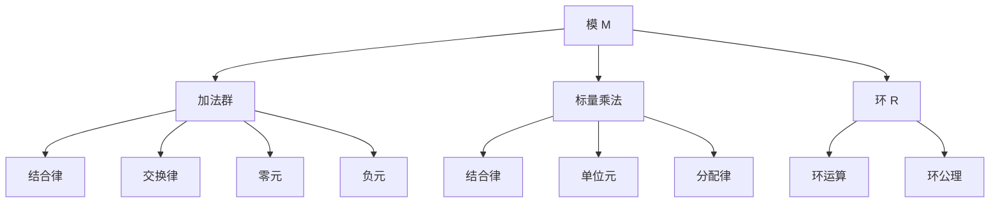
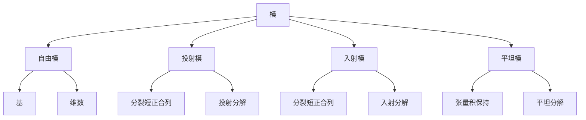
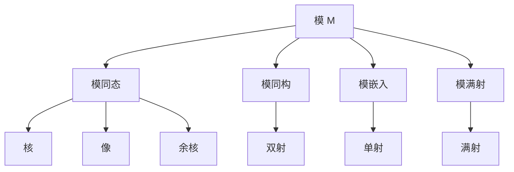

# 模论 - 增强版

## 📚 概述

模论是抽象代数学的重要分支，研究环上的代数结构。模的概念统一了线性代数、同调代数、表示论等众多数学领域，是现代代数学的基础理论之一。

## 🕰️ 历史发展脉络

### 早期发展 (1900-1950)

#### 线性代数背景

- **1900年**: 希尔伯特研究不变式理论
- **1920年**: 诺特建立抽象环论
- **1930年**: 范德瓦尔登《现代代数》

#### 同调代数背景

- **1945年**: 卡当-艾伦伯格建立同调代数
- **1950年**: 投射模和入射模理论
- **1955年**: 自由模和投射模

### 现代发展 (1950-1980)

#### 同调代数

- **1960年代**: 导出函子理论
- **1970年代**: 模型范畴理论
- **1980年代**: 三角范畴理论

#### 表示论

- **1950年代**: 群表示论
- **1960年代**: 李代数表示论
- **1970年代**: 代数群表示论

### 当代发展 (1980-至今)

#### 代数几何

- **1980年代**: 概形上的模
- **1990年代**: 凝聚层理论
- **2000年代**: 导出代数几何

#### 非交换代数

- **1990年代**: 非交换环上的模
- **2000年代**: 量子群模
- **2010年代**: 非交换几何

## 🏗️ 核心概念

### 模的定义

```lean
-- Lean 4 形式化定义
structure Module (R : Ring) (M : Type) where
  add : M → M → M
  zero : M
  neg : M → M
  smul : R.carrier → M → M
  
  -- 加法群公理
  add_assoc : ∀ a b c, add (add a b) c = add a (add b c)
  add_comm : ∀ a b, add a b = add b a
  add_zero : ∀ a, add a zero = a
  add_neg : ∀ a, add a (neg a) = zero
  
  -- 标量乘法公理
  smul_assoc : ∀ r s m, smul (R.mul r s) m = smul r (smul s m)
  smul_one : ∀ m, smul R.one m = m
  smul_add : ∀ r m n, smul r (add m n) = add (smul r m) (smul r n)
  add_smul : ∀ r s m, smul (R.add r s) m = add (smul r m) (smul s m)
```

### 基本性质

#### 1. 加法群性质

- 结合律：$(a + b) + c = a + (b + c)$
- 交换律：$a + b = b + a$
- 零元：$a + 0 = 0 + a = a$
- 负元：$a + (-a) = (-a) + a = 0$

#### 2. 标量乘法性质

- 结合律：$(r \cdot s) \cdot m = r \cdot (s \cdot m)$
- 单位元：$1 \cdot m = m$
- 分配律：$r \cdot (m + n) = r \cdot m + r \cdot n$
- 分配律：$(r + s) \cdot m = r \cdot m + s \cdot m$

## 📊 可视化图表

### 模的结构图



### 模的类型关系图



### 模同态关系图



## 🔍 实例表征

### 1. 向量空间实例

#### 向量空间 ℝⁿ

```haskell
-- Haskell 实现
data Vector n = Vector {
    components :: Vec n Double
}

instance Module Double (Vector n) where
  zero = Vector (replicate n 0)
  neg (Vector v) = Vector (map negate v)
  
  add (Vector v1) (Vector v2) = Vector (zipWith (+) v1 v2)
  smul r (Vector v) = Vector (map (r *) v)
```

#### 矩阵空间 Mₙ(ℝ)

```rust
// Rust 实现
#[derive(Debug, Clone)]
pub struct Matrix {
    data: Vec<Vec<f64>>,
    rows: usize,
    cols: usize,
}

impl Matrix {
    pub fn new(rows: usize, cols: usize) -> Self {
        Matrix {
            data: vec![vec![0.0; cols]; rows],
            rows,
            cols,
        }
    }
    
    pub fn add(&self, other: &Matrix) -> Matrix {
        let mut result = Matrix::new(self.rows, self.cols);
        for i in 0..self.rows {
            for j in 0..self.cols {
                result.data[i][j] = self.data[i][j] + other.data[i][j];
            }
        }
        result
    }
    
    pub fn scalar_mul(&self, scalar: f64) -> Matrix {
        let mut result = Matrix::new(self.rows, self.cols);
        for i in 0..self.rows {
            for j in 0..self.cols {
                result.data[i][j] = scalar * self.data[i][j];
            }
        }
        result
    }
}
```

### 2. 群环模实例

#### 群环 ℤ[G]

```lean
-- Lean 4 实现
structure GroupRing (G : Type) [Group G] where
  coefficients : G → ℤ

def add (a b : GroupRing G) : GroupRing G :=
  ⟨fun g => a.coefficients g + b.coefficients g⟩

def smul (r : ℤ) (a : GroupRing G) : GroupRing G :=
  ⟨fun g => r * a.coefficients g⟩

def zero : GroupRing G := ⟨fun g => 0⟩
```

### 3. 重要模类

#### 自由模

```haskell
-- 自由模 R^n
data FreeModule n = FreeModule {
    coefficients :: Vec n Integer
}

instance Module Integer (FreeModule n) where
  zero = FreeModule (replicate n 0)
  neg (FreeModule v) = FreeModule (map negate v)
  
  add (FreeModule v1) (FreeModule v2) = FreeModule (zipWith (+) v1 v2)
  smul r (FreeModule v) = FreeModule (map (r *) v)
```

#### 商模

```rust
// 商模 M/N
pub struct QuotientModule<M, N> {
    base_module: M,
    submodule: N,
}

impl<M, N> QuotientModule<M, N> {
    pub fn new(base_module: M, submodule: N) -> Self {
        QuotientModule {
            base_module,
            submodule,
        }
    }
    
    pub fn coset(&self, element: &M::Element) -> Coset<M::Element> {
        Coset::new(element.clone(), &self.submodule)
    }
}
```

## 🧠 思维过程表征

### 1. 模论问题解决流程

#### 步骤1：识别模结构

```text
问题 → 识别环和模 → 验证模公理 → 确定模类型
```

#### 步骤2：分析模性质

```text
模结构 → 子模分析 → 商模分析 → 同态分析
```

#### 步骤3：应用模论工具

```text
模性质 → 自由模 → 投射模 → 同调代数
```

### 2. 证明思维过程

#### 自由模性质证明

```text
1. 定义自由模
2. 构造基
3. 证明唯一性
4. 得出性质
```

#### 投射模性质证明

```text
1. 定义投射模
2. 构造分裂映射
3. 证明投射分解
4. 得出特征性质
```

### 3. 概念理解步骤

#### 理解模的概念

```text
1. 加法群结构
2. 标量乘法
3. 环作用
4. 具体实例验证
```

#### 理解子模概念

```text
1. 加法子群
2. 标量乘法封闭
3. 子模运算
4. 商模构造
```

## 🌍 应用场景表征

### 1. 线性代数应用

#### 向量空间理论

- **线性变换**: 模的自同态
- **特征值**: 模的特征
- **对角化**: 模的分解

#### 矩阵理论

- **矩阵环**: 模的环结构
- **线性映射**: 模的同态
- **相似变换**: 模的同构

### 2. 同调代数应用

#### 同调理论

```haskell
-- 链复形
data ChainComplex = ChainComplex {
    modules :: [Module],
    differentials :: [ModuleHomomorphism]
}

-- 同调群
data HomologyGroup = HomologyGroup {
    cycles :: Module,
    boundaries :: Module,
    homology :: QuotientModule
}
```

#### 导出函子

- **Ext函子**: 模的扩张
- **Tor函子**: 模的张量积
- **上同调**: 模的上同调

### 3. 表示论应用

#### 群表示论

```rust
// 群表示
pub struct GroupRepresentation<G, V> {
    group: G,
    vector_space: V,
    action: Box<dyn Fn(G::Element, V::Element) -> V::Element>,
}

impl<G, V> GroupRepresentation<G, V> {
    pub fn new(group: G, vector_space: V, action: Box<dyn Fn(G::Element, V::Element) -> V::Element>) -> Self {
        GroupRepresentation {
            group,
            vector_space,
            action,
        }
    }
    
    pub fn act(&self, g: G::Element, v: V::Element) -> V::Element {
        (self.action)(g, v)
    }
}
```

#### 李代数表示

- **李代数模**: 李代数的表示
- **包络代数**: 李代数的环
- **特征标**: 表示的特征

### 4. 代数几何应用

#### 概形理论

```haskell
-- 概形上的模
data SchemeModule = SchemeModule {
    scheme :: Scheme,
    module_sheaf :: Sheaf Module
}

-- 凝聚层
data CoherentSheaf = CoherentSheaf {
    scheme :: Scheme,
    local_modules :: Map OpenSet Module
}
```

#### 上同调理论

- **Čech上同调**: 模的上同调
- **导出函子**: 模的导出理论
- **局部化**: 模的局部性质

### 5. 计算机科学应用

#### 密码学应用

```rust
// 格密码学中的模
pub struct LatticeModule {
    basis: Matrix<f64>,
    dimension: usize,
    modulus: f64,
}

impl LatticeModule {
    pub fn new(basis: Matrix<f64>, modulus: f64) -> Self {
        LatticeModule {
            basis,
            dimension: basis.rows(),
            modulus,
        }
    }
    
    pub fn add_vectors(&self, v1: &Vector<f64>, v2: &Vector<f64>) -> Vector<f64> {
        let mut result = Vector::new(self.dimension);
        for i in 0..self.dimension {
            result[i] = (v1[i] + v2[i]) % self.modulus;
        }
        result
    }
    
    pub fn scalar_multiply(&self, scalar: f64, vector: &Vector<f64>) -> Vector<f64> {
        let mut result = Vector::new(self.dimension);
        for i in 0..self.dimension {
            result[i] = (scalar * vector[i]) % self.modulus;
        }
        result
    }
}
```

#### 编码理论

- **线性码**: 向量空间上的码
- **循环码**: 多项式环上的码
- **代数几何码**: 代数曲线上的码

### 6. 物理应用

#### 量子力学

- **希尔伯特空间**: 复数域上的模
- **算子代数**: 算子环上的模
- **量子场论**: 场论中的模

#### 规范理论

- **规范群**: 规范变换的模
- **纤维丛**: 丛上的模
- **拓扑量子场论**: 拓扑不变量

## 🔗 知识关联网络

### 与其他数学分支的联系

#### 与线性代数的联系

- 向量空间是域上的模
- 线性变换是模同态
- 特征值是模的特征

#### 与环论的联系

- 模是环上的代数结构
- 理想是环上的子模
- 商环是模的商

#### 与群论的联系

- 群表示是群环上的模
- 群同态是模同态
- 群的上同调是模的上同调

### 理论发展脉络

#### 从具体到抽象

```text
向量空间 → 抽象模 → 同调代数 → 范畴论
```

#### 从有限到无限

```text
有限维模 → 无限维模 → 拓扑模 → 函数模
```

#### 从交换到非交换

```text
交换环模 → 非交换环模 → 量子模 → 非交换几何
```

## 📈 现代发展前沿

### 1. 同调代数

- **导出范畴**: 模的导出理论
- **模型范畴**: 模的模型结构
- **稳定同伦论**: 模的稳定理论

### 2. 代数几何

- **概形理论**: 模的几何化
- **上同调理论**: 模的拓扑化
- **模空间**: 模的参数化

### 3. 表示论

- **李代数表示**: 李代数的模
- **代数群表示**: 代数群的模
- **量子群表示**: 量子群的模

### 4. 非交换代数

- **非交换环模**: 非交换环上的模
- **量子模**: 量子群上的模
- **非交换几何**: 几何的非交换推广

## 🎯 学习路径建议

### 初学者路径

1. **基础概念**: 模的定义和基本性质
2. **重要例子**: 向量空间、自由模、商模
3. **基本定理**: 自由模定理、投射模定理
4. **应用实例**: 线性代数、表示论

### 进阶路径

1. **同调代数**: 模的同调理论
2. **代数几何**: 模的几何化
3. **表示论**: 模的表示理论
4. **现代应用**: 密码学、物理应用

### 研究路径

1. **前沿理论**: 同调代数、代数几何
2. **交叉应用**: 表示论、非交换代数
3. **计算代数**: 算法和软件
4. **开放问题**: 未解决的模论问题

## 🌟 总结

模论作为现代代数学的基础，不仅提供了统一的代数结构，还在各个领域发挥着重要作用。从基础的线性代数到前沿的同调代数，模论的发展展现了数学的深刻性和普适性。

通过多表征的学习方法，我们可以从不同角度理解模论：

- **历史角度**: 了解模论的发展历程
- **结构角度**: 掌握模的基本性质
- **应用角度**: 认识模论的实际价值
- **发展角度**: 关注模论的现代发展

模论将继续在数学和其他科学领域发挥重要作用，为人类认识世界提供强大的工具。

---

**相关文档**:

- [群论-增强版](01-群论-增强版.md)
- [环论-增强版](02-环论-增强版.md)
- [域论-增强版](03-域论-增强版.md)
- [李代数-增强版](05-李代数-增强版.md)
- [同调代数-高级主题](../11-高级数学/同调代数-高级主题.md)
- [表示论-高级主题](../11-高级数学/表示论-高级主题.md)
