# 模论 - 增强版

## 目录 / Table of Contents

- [模论 - 增强版](#模论---增强版)
  - [目录 / Table of Contents](#目录--table-of-contents)
  - [📚 概述](#-概述)
  - [🕰️ 历史发展脉络](#️-历史发展脉络)
    - [早期发展 (1900-1950)](#早期发展-1900-1950)
      - [线性代数背景](#线性代数背景)
      - [同调代数背景](#同调代数背景)
    - [现代发展 (1950-1980)](#现代发展-1950-1980)
      - [同调代数](#同调代数)
      - [表示论](#表示论)
    - [当代发展 (1980-至今)](#当代发展-1980-至今)
      - [代数几何](#代数几何)
      - [非交换代数](#非交换代数)
  - [🏗️ 核心概念](#️-核心概念)
    - [模的定义](#模的定义)
    - [基本性质](#基本性质)
      - [1. 加法群性质](#1-加法群性质)
      - [2. 标量乘法性质](#2-标量乘法性质)
  - [📊 可视化图表](#-可视化图表)
    - [模的结构图](#模的结构图)
    - [模的类型关系图](#模的类型关系图)
    - [模同态关系图](#模同态关系图)
  - [🔍 实例表征](#-实例表征)
    - [1. 向量空间实例](#1-向量空间实例)
      - [向量空间 ℝⁿ](#向量空间-ℝⁿ)
      - [矩阵空间 Mₙ(ℝ)](#矩阵空间-mₙℝ)
    - [2. 群环模实例](#2-群环模实例)
      - [群环 ℤ\[G\]](#群环-ℤg)
    - [3. 重要模类](#3-重要模类)
      - [自由模](#自由模)
      - [商模](#商模)
  - [🧠 思维过程表征](#-思维过程表征)
    - [1. 模论问题解决流程](#1-模论问题解决流程)
      - [步骤1：识别模结构](#步骤1识别模结构)
      - [步骤2：分析模性质](#步骤2分析模性质)
      - [步骤3：应用模论工具](#步骤3应用模论工具)
    - [2. 证明思维过程](#2-证明思维过程)
      - [自由模性质证明](#自由模性质证明)
      - [投射模性质证明](#投射模性质证明)
    - [3. 概念理解步骤](#3-概念理解步骤)
      - [理解模的概念](#理解模的概念)
      - [理解子模概念](#理解子模概念)
  - [🌍 应用场景表征](#-应用场景表征)
    - [1. 线性代数应用](#1-线性代数应用)
      - [向量空间理论](#向量空间理论)
      - [矩阵理论](#矩阵理论)
    - [2. 同调代数应用](#2-同调代数应用)
      - [同调理论](#同调理论)
      - [导出函子](#导出函子)
    - [3. 表示论应用](#3-表示论应用)
      - [群表示论](#群表示论)
      - [李代数表示](#李代数表示)
    - [4. 代数几何应用](#4-代数几何应用)
      - [概形理论](#概形理论)
      - [上同调理论](#上同调理论)
    - [5. 计算机科学应用](#5-计算机科学应用)
      - [密码学应用](#密码学应用)
      - [编码理论](#编码理论)
    - [6. 物理应用](#6-物理应用)
      - [量子力学](#量子力学)
      - [规范理论](#规范理论)
  - [🔗 知识关联网络](#-知识关联网络)
    - [与其他数学分支的联系](#与其他数学分支的联系)
      - [与线性代数的联系](#与线性代数的联系)
      - [与环论的联系](#与环论的联系)
      - [与群论的联系](#与群论的联系)
    - [理论发展脉络](#理论发展脉络)
      - [从具体到抽象](#从具体到抽象)
      - [从有限到无限](#从有限到无限)
      - [从交换到非交换](#从交换到非交换)
  - [📈 现代发展前沿](#-现代发展前沿)
    - [1. 同调代数](#1-同调代数)
    - [2. 代数几何](#2-代数几何)
    - [3. 表示论](#3-表示论)
    - [4. 非交换代数](#4-非交换代数)
  - [🎯 学习路径建议](#-学习路径建议)
    - [初学者路径](#初学者路径)
    - [进阶路径](#进阶路径)
    - [研究路径](#研究路径)
  - [🌟 总结](#-总结)
  - [术语对照表 / Terminology Table](#术语对照表--terminology-table)
  - [多表征方式与图建模](#多表征方式与图建模)
    - [模论的多表征系统](#模论的多表征系统)
    - [思维导图：模论的核心概念](#思维导图模论的核心概念)

## 📚 概述

模论是抽象代数学的重要分支，研究环上的代数结构。
模的概念统一了线性代数、同调代数、表示论等众多数学领域，是现代代数学的基础理论之一。

## 🕰️ 历史发展脉络

### 早期发展 (1900-1950)

#### 线性代数背景

- **1900年**: 希尔伯特研究不变式理论
- **1920年**: 诺特建立抽象环论
- **1930年**: 范德瓦尔登《现代代数》

#### 同调代数背景

- **1945年**: 卡当-艾伦伯格建立同调代数
- **1950年**: 投射模和入射模理论
- **1955年**: 自由模和投射模

### 现代发展 (1950-1980)

#### 同调代数

- **1960年代**: 导出函子理论
- **1970年代**: 模型范畴理论
- **1980年代**: 三角范畴理论

#### 表示论

- **1950年代**: 群表示论
- **1960年代**: 李代数表示论
- **1970年代**: 代数群表示论

### 当代发展 (1980-至今)

#### 代数几何

- **1980年代**: 概形上的模
- **1990年代**: 凝聚层理论
- **2000年代**: 导出代数几何

#### 非交换代数

- **1990年代**: 非交换环上的模
- **2000年代**: 量子群模
- **2010年代**: 非交换几何

## 🏗️ 核心概念

### 模的定义

```lean
-- Lean 4 形式化定义
structure Module (R : Ring) (M : Type) where
  add : M → M → M
  zero : M
  neg : M → M
  smul : R.carrier → M → M
  
  -- 加法群公理
  add_assoc : ∀ a b c, add (add a b) c = add a (add b c)
  add_comm : ∀ a b, add a b = add b a
  add_zero : ∀ a, add a zero = a
  add_neg : ∀ a, add a (neg a) = zero
  
  -- 标量乘法公理
  smul_assoc : ∀ r s m, smul (R.mul r s) m = smul r (smul s m)
  smul_one : ∀ m, smul R.one m = m
  smul_add : ∀ r m n, smul r (add m n) = add (smul r m) (smul r n)
  add_smul : ∀ r s m, smul (R.add r s) m = add (smul r m) (smul s m)
```

### 基本性质

#### 1. 加法群性质

- 结合律：$(a + b) + c = a + (b + c)$
- 交换律：$a + b = b + a$
- 零元：$a + 0 = 0 + a = a$
- 负元：$a + (-a) = (-a) + a = 0$

#### 2. 标量乘法性质

- 结合律：$(r \cdot s) \cdot m = r \cdot (s \cdot m)$
- 单位元：$1 \cdot m = m$
- 分配律：$r \cdot (m + n) = r \cdot m + r \cdot n$
- 分配律：$(r + s) \cdot m = r \cdot m + s \cdot m$

## 📊 可视化图表

### 模的结构图

```mermaid
graph TD
    A[模 M] --> B[加法群]
    A --> C[标量乘法]
    A --> D[环 R]
    
    B --> E[结合律]
    B --> F[交换律]
    B --> G[零元]
    B --> H[负元]
    
    C --> I[结合律]
    C --> J[单位元]
    C --> K[分配律]
    
    D --> L[环运算]
    D --> M[环公理]
```



### 模的类型关系图

```mermaid
graph TD
    A[模] --> B[自由模]
    A --> C[投射模]
    A --> D[入射模]
    A --> E[平坦模]
    
    B --> F[基]
    B --> G[维数]
    
    C --> H[分裂短正合列]
    C --> I[投射分解]
    
    D --> J[分裂短正合列]
    D --> K[入射分解]
    
    E --> L[张量积保持]
    E --> M[平坦分解]
```



### 模同态关系图

```mermaid
graph TD
    A[模 M] --> B[模同态]
    A --> C[模同构]
    A --> D[模嵌入]
    A --> E[模满射]
    
    B --> F[核]
    B --> G[像]
    B --> H[余核]
    
    C --> I[双射]
    D --> J[单射]
    E --> K[满射]
```



## 🔍 实例表征

### 1. 向量空间实例

#### 向量空间 ℝⁿ

```haskell
-- Haskell 实现
data Vector n = Vector {
    components :: Vec n Double
}

instance Module Double (Vector n) where
  zero = Vector (replicate n 0)
  neg (Vector v) = Vector (map negate v)
  
  add (Vector v1) (Vector v2) = Vector (zipWith (+) v1 v2)
  smul r (Vector v) = Vector (map (r *) v)
```

#### 矩阵空间 Mₙ(ℝ)

```rust
// Rust 实现
#[derive(Debug, Clone)]
pub struct Matrix {
    data: Vec<Vec<f64>>,
    rows: usize,
    cols: usize,
}

impl Matrix {
    pub fn new(rows: usize, cols: usize) -> Self {
        Matrix {
            data: vec![vec![0.0; cols]; rows],
            rows,
            cols,
        }
    }
    
    pub fn add(&self, other: &Matrix) -> Matrix {
        let mut result = Matrix::new(self.rows, self.cols);
        for i in 0..self.rows {
            for j in 0..self.cols {
                result.data[i][j] = self.data[i][j] + other.data[i][j];
            }
        }
        result
    }
    
    pub fn scalar_mul(&self, scalar: f64) -> Matrix {
        let mut result = Matrix::new(self.rows, self.cols);
        for i in 0..self.rows {
            for j in 0..self.cols {
                result.data[i][j] = scalar * self.data[i][j];
            }
        }
        result
    }
}
```

### 2. 群环模实例

#### 群环 ℤ[G]

```lean
-- Lean 4 实现
structure GroupRing (G : Type) [Group G] where
  coefficients : G → ℤ

def add (a b : GroupRing G) : GroupRing G :=
  ⟨fun g => a.coefficients g + b.coefficients g⟩

def smul (r : ℤ) (a : GroupRing G) : GroupRing G :=
  ⟨fun g => r * a.coefficients g⟩

def zero : GroupRing G := ⟨fun g => 0⟩
```

### 3. 重要模类

#### 自由模

```haskell
-- 自由模 R^n
data FreeModule n = FreeModule {
    coefficients :: Vec n Integer
}

instance Module Integer (FreeModule n) where
  zero = FreeModule (replicate n 0)
  neg (FreeModule v) = FreeModule (map negate v)
  
  add (FreeModule v1) (FreeModule v2) = FreeModule (zipWith (+) v1 v2)
  smul r (FreeModule v) = FreeModule (map (r *) v)
```

#### 商模

```rust
// 商模 M/N
pub struct QuotientModule<M, N> {
    base_module: M,
    submodule: N,
}

impl<M, N> QuotientModule<M, N> {
    pub fn new(base_module: M, submodule: N) -> Self {
        QuotientModule {
            base_module,
            submodule,
        }
    }
    
    pub fn coset(&self, element: &M::Element) -> Coset<M::Element> {
        Coset::new(element.clone(), &self.submodule)
    }
}
```

## 🧠 思维过程表征

### 1. 模论问题解决流程

#### 步骤1：识别模结构

```text
问题 → 识别环和模 → 验证模公理 → 确定模类型
```

#### 步骤2：分析模性质

```text
模结构 → 子模分析 → 商模分析 → 同态分析
```

#### 步骤3：应用模论工具

```text
模性质 → 自由模 → 投射模 → 同调代数
```

### 2. 证明思维过程

#### 自由模性质证明

```text
1. 定义自由模
2. 构造基
3. 证明唯一性
4. 得出性质
```

#### 投射模性质证明

```text
1. 定义投射模
2. 构造分裂映射
3. 证明投射分解
4. 得出特征性质
```

### 3. 概念理解步骤

#### 理解模的概念

```text
1. 加法群结构
2. 标量乘法
3. 环作用
4. 具体实例验证
```

#### 理解子模概念

```text
1. 加法子群
2. 标量乘法封闭
3. 子模运算
4. 商模构造
```

## 🌍 应用场景表征

### 1. 线性代数应用

#### 向量空间理论

- **线性变换**: 模的自同态
- **特征值**: 模的特征
- **对角化**: 模的分解

#### 矩阵理论

- **矩阵环**: 模的环结构
- **线性映射**: 模的同态
- **相似变换**: 模的同构

### 2. 同调代数应用

#### 同调理论

```haskell
-- 链复形
data ChainComplex = ChainComplex {
    modules :: [Module],
    differentials :: [ModuleHomomorphism]
}

-- 同调群
data HomologyGroup = HomologyGroup {
    cycles :: Module,
    boundaries :: Module,
    homology :: QuotientModule
}
```

#### 导出函子

- **Ext函子**: 模的扩张
- **Tor函子**: 模的张量积
- **上同调**: 模的上同调

### 3. 表示论应用

#### 群表示论

```rust
// 群表示
pub struct GroupRepresentation<G, V> {
    group: G,
    vector_space: V,
    action: Box<dyn Fn(G::Element, V::Element) -> V::Element>,
}

impl<G, V> GroupRepresentation<G, V> {
    pub fn new(group: G, vector_space: V, action: Box<dyn Fn(G::Element, V::Element) -> V::Element>) -> Self {
        GroupRepresentation {
            group,
            vector_space,
            action,
        }
    }
    
    pub fn act(&self, g: G::Element, v: V::Element) -> V::Element {
        (self.action)(g, v)
    }
}
```

#### 李代数表示

- **李代数模**: 李代数的表示
- **包络代数**: 李代数的环
- **特征标**: 表示的特征

### 4. 代数几何应用

#### 概形理论

```haskell
-- 概形上的模
data SchemeModule = SchemeModule {
    scheme :: Scheme,
    module_sheaf :: Sheaf Module
}

-- 凝聚层
data CoherentSheaf = CoherentSheaf {
    scheme :: Scheme,
    local_modules :: Map OpenSet Module
}
```

#### 上同调理论

- **Čech上同调**: 模的上同调
- **导出函子**: 模的导出理论
- **局部化**: 模的局部性质

### 5. 计算机科学应用

#### 密码学应用

```rust
// 格密码学中的模
pub struct LatticeModule {
    basis: Matrix<f64>,
    dimension: usize,
    modulus: f64,
}

impl LatticeModule {
    pub fn new(basis: Matrix<f64>, modulus: f64) -> Self {
        LatticeModule {
            basis,
            dimension: basis.rows(),
            modulus,
        }
    }
    
    pub fn add_vectors(&self, v1: &Vector<f64>, v2: &Vector<f64>) -> Vector<f64> {
        let mut result = Vector::new(self.dimension);
        for i in 0..self.dimension {
            result[i] = (v1[i] + v2[i]) % self.modulus;
        }
        result
    }
    
    pub fn scalar_multiply(&self, scalar: f64, vector: &Vector<f64>) -> Vector<f64> {
        let mut result = Vector::new(self.dimension);
        for i in 0..self.dimension {
            result[i] = (scalar * vector[i]) % self.modulus;
        }
        result
    }
}
```

#### 编码理论

- **线性码**: 向量空间上的码
- **循环码**: 多项式环上的码
- **代数几何码**: 代数曲线上的码

### 6. 物理应用

#### 量子力学

- **希尔伯特空间**: 复数域上的模
- **算子代数**: 算子环上的模
- **量子场论**: 场论中的模

#### 规范理论

- **规范群**: 规范变换的模
- **纤维丛**: 丛上的模
- **拓扑量子场论**: 拓扑不变量

## 🔗 知识关联网络

### 与其他数学分支的联系

#### 与线性代数的联系

- 向量空间是域上的模
- 线性变换是模同态
- 特征值是模的特征

#### 与环论的联系

- 模是环上的代数结构
- 理想是环上的子模
- 商环是模的商

#### 与群论的联系

- 群表示是群环上的模
- 群同态是模同态
- 群的上同调是模的上同调

### 理论发展脉络

#### 从具体到抽象

```text
向量空间 → 抽象模 → 同调代数 → 范畴论
```

#### 从有限到无限

```text
有限维模 → 无限维模 → 拓扑模 → 函数模
```

#### 从交换到非交换

```text
交换环模 → 非交换环模 → 量子模 → 非交换几何
```

## 📈 现代发展前沿

### 1. 同调代数

- **导出范畴**: 模的导出理论
- **模型范畴**: 模的模型结构
- **稳定同伦论**: 模的稳定理论

### 2. 代数几何

- **概形理论**: 模的几何化
- **上同调理论**: 模的拓扑化
- **模空间**: 模的参数化

### 3. 表示论

- **李代数表示**: 李代数的模
- **代数群表示**: 代数群的模
- **量子群表示**: 量子群的模

### 4. 非交换代数

- **非交换环模**: 非交换环上的模
- **量子模**: 量子群上的模
- **非交换几何**: 几何的非交换推广

## 🎯 学习路径建议

### 初学者路径

1. **基础概念**: 模的定义和基本性质
2. **重要例子**: 向量空间、自由模、商模
3. **基本定理**: 自由模定理、投射模定理
4. **应用实例**: 线性代数、表示论

### 进阶路径

1. **同调代数**: 模的同调理论
2. **代数几何**: 模的几何化
3. **表示论**: 模的表示理论
4. **现代应用**: 密码学、物理应用

### 研究路径

1. **前沿理论**: 同调代数、代数几何
2. **交叉应用**: 表示论、非交换代数
3. **计算代数**: 算法和软件
4. **开放问题**: 未解决的模论问题

## 🌟 总结

模论作为现代代数学的基础，不仅提供了统一的代数结构，还在各个领域发挥着重要作用。从基础的线性代数到前沿的同调代数，模论的发展展现了数学的深刻性和普适性。

通过多表征的学习方法，我们可以从不同角度理解模论：

- **历史角度**: 了解模论的发展历程
- **结构角度**: 掌握模的基本性质
- **应用角度**: 认识模论的实际价值
- **发展角度**: 关注模论的现代发展

模论将继续在数学和其他科学领域发挥重要作用，为人类认识世界提供强大的工具。

---

**相关文档**:

- [群论-增强版](01-群论-增强版.md)
- [环论-增强版](02-环论-增强版.md)
- [域论-增强版](03-域论-增强版.md)
- [李代数-增强版](05-李代数-增强版.md)
- [同调代数-高级主题](../11-高级数学/同调代数-高级主题.md)
- [表示论-高级主题](../11-高级数学/表示论-高级主题.md)

## 术语对照表 / Terminology Table

| 中文 | English |
|---|---|
| 模 | Module |
| 子模 | Submodule |
| 商模 | Quotient module |
| 自同态 | Endomorphism |
| 自同构 | Automorphism |
| 自由模 | Free module |
| 投射模 | Projective module |
| 内射模 | Injective module |
| 平坦模 | Flat module |
| 张量积 | Tensor product |
| 扩张/限制标量 | Extension/Restriction of scalars |
| 扭模 | Torsion module |
| 诺特/阿廷 | Noetherian/Artinian |
| 精确序列 | Exact sequence |

## 多表征方式与图建模

### 模论的多表征系统

```python
import numpy as np
import networkx as nx
import matplotlib.pyplot as plt
from typing import Dict, List, Tuple, Any
import math

class ModuleTheorySystem:
    """模论多表征系统"""
    
    def __init__(self):
        self.modules = {}
        self.representations = {}
        
    def add_module(self, name: str, elements: List, addition: Dict, scalar_multiplication: Dict, ring: Dict) -> None:
        """添加模"""
        self.modules[name] = {
            'elements': elements,
            'addition': addition,
            'scalar_multiplication': scalar_multiplication,
            'ring': ring,
            'order': len(elements)
        }
        
    def algebraic_representation(self, module_name: str) -> Dict:
        """代数表征"""
        module = self.modules[module_name]
        return {
            'elements': module['elements'],
            'addition_table': self._create_addition_table(module),
            'scalar_multiplication_table': self._create_scalar_multiplication_table(module),
            'properties': self._analyze_properties(module)
        }
        
    def geometric_representation(self, module_name: str) -> Dict:
        """几何表征"""
        module = self.modules[module_name]
        return {
            'submodule_lattice': self._create_submodule_lattice(module),
            'endomorphism_ring': self._create_endomorphism_ring(module),
            'tensor_product_structure': self._create_tensor_product_structure(module)
        }
        
    def combinatorial_representation(self, module_name: str) -> Dict:
        """组合表征"""
        module = self.modules[module_name]
        return {
            'basis': self._find_basis(module),
            'generators': self._find_generators(module),
            'torsion_elements': self._find_torsion_elements(module)
        }
        
    def topological_representation(self, module_name: str) -> Dict:
        """拓扑表征"""
        module = self.modules[module_name]
        return {
            'zariski_topology': self._create_zariski_topology(module),
            'etale_topology': self._create_etale_topology(module),
            'cohomology': self._compute_cohomology(module)
        }
        
    def _create_addition_table(self, module: Dict) -> np.ndarray:
        """创建加法表"""
        elements = module['elements']
        n = len(elements)
        table = np.zeros((n, n), dtype=int)
        
        for i, a in enumerate(elements):
            for j, b in enumerate(elements):
                result = module['addition'][(a, b)]
                table[i, j] = elements.index(result)
                
        return table
        
    def _create_scalar_multiplication_table(self, module: Dict) -> np.ndarray:
        """创建标量乘法表"""
        elements = module['elements']
        ring_elements = module['ring']['elements']
        n = len(elements)
        m = len(ring_elements)
        table = np.zeros((m, n), dtype=int)
        
        for i, r in enumerate(ring_elements):
            for j, v in enumerate(elements):
                result = module['scalar_multiplication'][(r, v)]
                table[i, j] = elements.index(result)
                
        return table
        
    def _analyze_properties(self, module: Dict) -> Dict:
        """分析模的性质"""
        elements = module['elements']
        addition = module['addition']
        scalar_multiplication = module['scalar_multiplication']
        
        # 检查模的性质
        additive_group = self._check_additive_group(module)
        scalar_distributive = self._check_scalar_distributive(module)
        scalar_associative = self._check_scalar_associative(module)
        
        return {
            'additive_group': additive_group,
            'scalar_distributive': scalar_distributive,
            'scalar_associative': scalar_associative,
            'commutative': self._check_commutative(module),
            'free': self._check_free(module)
        }
        
    def _check_additive_group(self, module: Dict) -> bool:
        """检查加法群性质"""
        elements = module['elements']
        addition = module['addition']
        
        # 检查结合律
        for a in elements:
            for b in elements:
                for c in elements:
                    if addition[(addition[(a, b)], c)] != addition[(a, addition[(b, c)])]:
                        return False
                        
        # 检查单位元（零元）
        zero = None
        for e in elements:
            if all(addition[(e, a)] == a and addition[(a, e)] == a for a in elements):
                zero = e
                break
        if not zero:
            return False
            
        # 检查逆元
        for a in elements:
            has_inverse = False
            for b in elements:
                if addition[(a, b)] == zero and addition[(b, a)] == zero:
                    has_inverse = True
                    break
            if not has_inverse:
                return False
                
        return True
        
    def _check_scalar_distributive(self, module: Dict) -> bool:
        """检查标量分配律"""
        elements = module['elements']
        ring_elements = module['ring']['elements']
        addition = module['addition']
        scalar_multiplication = module['scalar_multiplication']
        ring_addition = module['ring']['addition']
        ring_multiplication = module['ring']['multiplication']
        
        # 检查 (r + s)v = rv + sv
        for r in ring_elements:
            for s in ring_elements:
                for v in elements:
                    left = scalar_multiplication[(ring_addition[(r, s)], v)]
                    right1 = scalar_multiplication[(r, v)]
                    right2 = scalar_multiplication[(s, v)]
                    right = addition[(right1, right2)]
                    if left != right:
                        return False
                        
        # 检查 r(v + w) = rv + rw
        for r in ring_elements:
            for v in elements:
                for w in elements:
                    left = scalar_multiplication[(r, addition[(v, w)])]
                    right1 = scalar_multiplication[(r, v)]
                    right2 = scalar_multiplication[(r, w)]
                    right = addition[(right1, right2)]
                    if left != right:
                        return False
                        
        return True
        
    def _check_scalar_associative(self, module: Dict) -> bool:
        """检查标量结合律"""
        elements = module['elements']
        ring_elements = module['ring']['elements']
        scalar_multiplication = module['scalar_multiplication']
        ring_multiplication = module['ring']['multiplication']
        
        # 检查 (rs)v = r(sv)
        for r in ring_elements:
            for s in ring_elements:
                for v in elements:
                    left = scalar_multiplication[(ring_multiplication[(r, s)], v)]
                    right = scalar_multiplication[(r, scalar_multiplication[(s, v)])]
                    if left != right:
                        return False
                        
        return True
        
    def _check_commutative(self, module: Dict) -> bool:
        """检查交换性"""
        elements = module['elements']
        addition = module['addition']
        
        for a in elements:
            for b in elements:
                if addition[(a, b)] != addition[(b, a)]:
                    return False
                    
        return True
        
    def _check_free(self, module: Dict) -> bool:
        """检查是否为自由模"""
        # 简化版本：检查是否有基
        basis = self._find_basis(module)
        return len(basis) > 0
        
    def _create_submodule_lattice(self, module: Dict) -> nx.DiGraph:
        """创建子模格"""
        G = nx.DiGraph()
        elements = module['elements']
        
        # 找到所有子模
        submodules = self._find_submodules(module)
        
        # 添加节点
        for submodule in submodules:
            G.add_node(tuple(sorted(submodule)))
            
        # 添加包含关系边
        for N in submodules:
            for M in submodules:
                if set(N).issubset(set(M)) and N != M:
                    G.add_edge(tuple(sorted(N)), tuple(sorted(M)))
                    
        return G
        
    def _find_submodules(self, module: Dict) -> List[List]:
        """找到所有子模"""
        elements = module['elements']
        submodules = []
        
        # 检查每个子集
        for size in range(1, len(elements) + 1):
            for subset in self._get_subsets(elements, size):
                if self._is_submodule(subset, module):
                    submodules.append(subset)
                    
        return submodules
        
    def _is_submodule(self, subset: List, module: Dict) -> bool:
        """检查是否为子模"""
        elements = module['elements']
        addition = module['addition']
        scalar_multiplication = module['scalar_multiplication']
        ring_elements = module['ring']['elements']
        
        # 检查加法封闭性
        for a in subset:
            for b in subset:
                if addition[(a, b)] not in subset:
                    return False
                    
        # 检查标量乘法封闭性
        for r in ring_elements:
            for a in subset:
                if scalar_multiplication[(r, a)] not in subset:
                    return False
                    
        return True
        
    def _get_subsets(self, elements: List, size: int) -> List[List]:
        """获取指定大小的子集"""
        if size == 0:
            return [[]]
        if size == len(elements):
            return [elements]
        if size > len(elements):
            return []
            
        result = []
        for i in range(len(elements) - size + 1):
            for subset in self._get_subsets(elements[i+1:], size-1):
                result.append([elements[i]] + subset)
        return result
        
    def _create_endomorphism_ring(self, module: Dict) -> nx.Graph:
        """创建自同态环"""
        G = nx.Graph()
        elements = module['elements']
        
        # 找到所有自同态
        endomorphisms = self._find_endomorphisms(module)
        
        # 添加节点
        for endo in endomorphisms:
            G.add_node(str(endo))
            
        # 添加边（如果两个自同态可交换）
        for endo1 in endomorphisms:
            for endo2 in endomorphisms:
                if endo1 != endo2 and self._commute(endo1, endo2, module):
                    G.add_edge(str(endo1), str(endo2))
                    
        return G
        
    def _find_endomorphisms(self, module: Dict) -> List[Dict]:
        """找到所有自同态"""
        # 简化版本：返回基本自同态
        return [{'id': 'identity'}]
        
    def _commute(self, endo1: Dict, endo2: Dict, module: Dict) -> bool:
        """检查两个自同态是否可交换"""
        # 简化版本
        return True
        
    def _create_tensor_product_structure(self, module: Dict) -> Dict:
        """创建张量积结构"""
        # 简化版本
        return {
            'tensor_products': [],
            'bilinear_maps': [],
            'universal_property': {}
        }
        
    def _find_basis(self, module: Dict) -> List:
        """找到基"""
        elements = module['elements']
        
        # 简化版本：检查线性无关的子集
        for size in range(1, len(elements) + 1):
            for subset in self._get_subsets(elements, size):
                if self._is_linear_independent(subset, module):
                    return subset
                    
        return []
        
    def _is_linear_independent(self, subset: List, module: Dict) -> bool:
        """检查是否线性无关"""
        # 简化版本
        return len(subset) > 0
        
    def _find_generators(self, module: Dict) -> List:
        """找到生成元"""
        elements = module['elements']
        
        # 简化版本：返回所有元素
        return elements
        
    def _find_torsion_elements(self, module: Dict) -> List:
        """找到扭元"""
        elements = module['elements']
        ring_elements = module['ring']['elements']
        scalar_multiplication = module['scalar_multiplication']
        torsion = []
        
        # 找到零元
        zero = None
        for e in elements:
            if all(module['addition'][(e, a)] == a and module['addition'][(a, e)] == a for a in elements):
                zero = e
                break
                
        if zero:
            # 找到所有扭元
            for v in elements:
                for r in ring_elements:
                    if r != 0 and scalar_multiplication[(r, v)] == zero:  # 假设0是环的零元
                        if v not in torsion:
                            torsion.append(v)
                        break
                        
        return torsion
        
    def _create_zariski_topology(self, module: Dict) -> Dict:
        """创建Zariski拓扑"""
        # 简化版本
        return {
            'open_sets': [],
            'closed_sets': [],
            'basis': []
        }
        
    def _create_etale_topology(self, module: Dict) -> Dict:
        """创建étale拓扑"""
        # 简化版本
        return {
            'coverings': [],
            'sheaves': [],
            'cohomology': {}
        }
        
    def _compute_cohomology(self, module: Dict) -> Dict:
        """计算上同调"""
        # 简化版本
        return {
            'H^0': 'Z',
            'H^1': 'Z^n',
            'H^2': 'Z^m'
        }

class CriticalArgumentationFramework:
    """批判性论证框架"""
    
    def __init__(self):
        self.arguments = {}
        self.counter_arguments = {}
        self.evidence = {}
        
    def add_argument(self, topic: str, argument: str, strength: float) -> None:
        """添加论证"""
        if topic not in self.arguments:
            self.arguments[topic] = []
        self.arguments[topic].append({
            'argument': argument,
            'strength': strength
        })
        
    def add_counter_argument(self, topic: str, counter: str, strength: float) -> None:
        """添加反论证"""
        if topic not in self.counter_arguments:
            self.counter_arguments[topic] = []
        self.counter_arguments[topic].append({
            'counter': counter,
            'strength': strength
        })
        
    def analyze_argument_strength(self, topic: str) -> Dict:
        """分析论证强度"""
        if topic not in self.arguments:
            return {}
            
        total_strength = sum(arg['strength'] for arg in self.arguments[topic])
        counter_strength = sum(counter['strength'] for counter in self.counter_arguments.get(topic, []))
        
        net_strength = total_strength - counter_strength
        
        return {
            'total_arguments': len(self.arguments[topic]),
            'total_counter_arguments': len(self.counter_arguments.get(topic, [])),
            'total_strength': total_strength,
            'counter_strength': counter_strength,
            'net_strength': net_strength,
            'confidence': min(1.0, max(0.0, net_strength / 10.0))
        }
        
    def get_philosophical_critique(self, topic: str) -> Dict:
        """获取哲学批判"""
        critiques = {
            '模论的基础性': {
                'ontological': '模论是否反映了代数结构的真实本质？',
                'epistemological': '我们如何认识模的结构？',
                'methodological': '模论的公理化方法是否最优？'
            },
            '模论的统一性': {
                'ontological': '模论是否统一了不同的代数结构？',
                'epistemological': '模论的抽象性是否过度？',
                'methodological': '模论的方法是否过于形式化？'
            }
        }
        
        return critiques.get(topic, {})

class HistoricalDevelopmentTimeline:
    """历史发展时间线"""
    
    def __init__(self):
        self.events = []
        
    def add_event(self, year: int, event: str, significance: str) -> None:
        """添加历史事件"""
        self.events.append({
            'year': year,
            'event': event,
            'significance': significance
        })
        
    def get_timeline(self) -> List[Dict]:
        """获取时间线"""
        return sorted(self.events, key=lambda x: x['year'])
        
    def visualize_timeline(self) -> nx.DiGraph:
        """可视化时间线"""
        G = nx.DiGraph()
        
        for event in self.events:
            G.add_node(f"{event['year']}: {event['event']}")
            
        # 添加时间顺序边
        sorted_events = sorted(self.events, key=lambda x: x['year'])
        for i in range(len(sorted_events) - 1):
            G.add_edge(
                f"{sorted_events[i]['year']}: {sorted_events[i]['event']}",
                f"{sorted_events[i+1]['year']}: {sorted_events[i+1]['event']}"
            )
            
        return G

def demonstrate_module_theory_analysis():
    """演示模论多表征分析"""
    print("=== 模论多表征系统演示 ===\n")
    
    # 创建模论系统
    mts = ModuleTheorySystem()
    
    # 添加环Z₂
    Z2_ring_elements = [0, 1]
    Z2_ring_addition = {(0, 0): 0, (0, 1): 1, (1, 0): 1, (1, 1): 0}
    Z2_ring_multiplication = {(0, 0): 0, (0, 1): 0, (1, 0): 0, (1, 1): 1}
    Z2_ring = {'elements': Z2_ring_elements, 'addition': Z2_ring_addition, 'multiplication': Z2_ring_multiplication}
    
    # 添加Z₂上的模M
    M_elements = [0, 1, 'a', 'b']
    M_addition = {
        (0, 0): 0, (0, 1): 1, (0, 'a'): 'a', (0, 'b'): 'b',
        (1, 0): 1, (1, 1): 0, (1, 'a'): 'b', (1, 'b'): 'a',
        ('a', 0): 'a', ('a', 1): 'b', ('a', 'a'): 0, ('a', 'b'): 1,
        ('b', 0): 'b', ('b', 1): 'a', ('b', 'a'): 1, ('b', 'b'): 0
    }
    M_scalar_multiplication = {
        (0, 0): 0, (0, 1): 0, (0, 'a'): 0, (0, 'b'): 0,
        (1, 0): 0, (1, 1): 1, (1, 'a'): 'a', (1, 'b'): 'b'
    }
    mts.add_module('M', M_elements, M_addition, M_scalar_multiplication, Z2_ring)
    
    # 代数表征
    print("1. 代数表征:")
    alg_rep = mts.algebraic_representation('M')
    print(f"   - 模阶: {alg_rep['properties']['order']}")
    print(f"   - 加法群: {alg_rep['properties']['additive_group']}")
    print(f"   - 标量分配律: {alg_rep['properties']['scalar_distributive']}")
    print(f"   - 标量结合律: {alg_rep['properties']['scalar_associative']}")
    print(f"   - 交换性: {alg_rep['properties']['commutative']}")
    print(f"   - 自由模: {alg_rep['properties']['free']}")
    
    # 几何表征
    print("\n2. 几何表征:")
    geom_rep = mts.geometric_representation('M')
    print(f"   - 子模格节点数: {geom_rep['submodule_lattice'].number_of_nodes()}")
    print(f"   - 自同态环节点数: {geom_rep['endomorphism_ring'].number_of_nodes()}")
    
    # 组合表征
    print("\n3. 组合表征:")
    comb_rep = mts.combinatorial_representation('M')
    print(f"   - 基大小: {len(comb_rep['basis'])}")
    print(f"   - 生成元数量: {len(comb_rep['generators'])}")
    print(f"   - 扭元数量: {len(comb_rep['torsion_elements'])}")
    
    # 批判性论证
    print("\n4. 批判性论证分析:")
    caf = CriticalArgumentationFramework()
    
    # 添加论证
    caf.add_argument("模论的统一性", "模论统一了向量空间和环的理想", 8.5)
    caf.add_argument("模论的统一性", "模论在同调代数中有重要应用", 9.0)
    caf.add_counter_argument("模论的统一性", "模论的抽象性可能掩盖具体结构", 6.0)
    
    strength_analysis = caf.analyze_argument_strength("模论的统一性")
    print(f"   - 论证强度: {strength_analysis['net_strength']:.1f}")
    print(f"   - 置信度: {strength_analysis['confidence']:.2f}")
    
    # 历史发展
    print("\n5. 历史发展时间线:")
    hdt = HistoricalDevelopmentTimeline()
    hdt.add_event(1921, "诺特引入模的概念", "模论的诞生")
    hdt.add_event(1940, "阿廷发展模论", "模论的重要发展")
    hdt.add_event(1950, "格罗滕迪克发展同调代数", "模论的现代应用")
    hdt.add_event(1970, "同调代数的发展", "模论的前沿应用")
    
    timeline = hdt.get_timeline()
    for event in timeline:
        print(f"   {event['year']}: {event['event']} - {event['significance']}")
    
    # 可视化
    print("\n6. 生成可视化图表...")
    plt.figure(figsize=(15, 10))
    
    # 子模格
    plt.subplot(2, 3, 1)
    submodule_lattice = geom_rep['submodule_lattice']
    if submodule_lattice.number_of_nodes() > 0:
        pos = nx.spring_layout(submodule_lattice)
        nx.draw(submodule_lattice, pos, with_labels=True, node_color='lightblue',
                node_size=1000, font_size=8, arrows=True)
    plt.title("M的子模格")
    
    # 自同态环
    plt.subplot(2, 3, 2)
    endomorphism_ring = geom_rep['endomorphism_ring']
    if endomorphism_ring.number_of_nodes() > 0:
        pos = nx.spring_layout(endomorphism_ring)
        nx.draw(endomorphism_ring, pos, with_labels=True, node_color='lightgreen',
                node_size=800, font_size=6)
    plt.title("M的自同态环")
    
    # 论证网络
    plt.subplot(2, 3, 3)
    arg_network = nx.DiGraph()
    arg_network.add_edge("模论统一性", "统一结构")
    arg_network.add_edge("模论统一性", "重要应用")
    arg_network.add_edge("模论统一性", "抽象性批评")
    pos = nx.spring_layout(arg_network)
    nx.draw(arg_network, pos, with_labels=True, node_color='lightcoral',
            node_size=1500, font_size=8, arrows=True)
    plt.title("论证网络")
    
    # 历史时间线
    plt.subplot(2, 3, 4)
    timeline_graph = hdt.visualize_timeline()
    if timeline_graph.number_of_nodes() > 0:
        pos = nx.spring_layout(timeline_graph)
        nx.draw(timeline_graph, pos, with_labels=True, node_color='lightyellow',
                node_size=1000, font_size=6, arrows=True)
    plt.title("历史发展时间线")
    
    plt.tight_layout()
    plt.show()
    
    return {
        'algebraic': alg_rep,
        'geometric': geom_rep,
        'combinatorial': comb_rep,
        'argument_analysis': strength_analysis
    }

# 运行演示
if __name__ == "__main__":
    results = demonstrate_module_theory_analysis()
    print("\n演示完成！")
```

### 思维导图：模论的核心概念

```mermaid
mindmap
  root((模论))
    基础概念
      模的定义
        加法群
        标量乘法
        分配律
      模的性质
        交换性
        自由性
        投射性
        内射性
      子模
        子模
        商模
        直和
        直积
    重要模类
      自由模
        自由模
        基
        秩
        生成元
      投射模
        投射模
        分裂序列
        投射覆盖
      内射模
        内射模
        内射包络
        内射维数
      平坦模
        平坦模
        张量积
        平坦维数
    模论工具
      同态
        模同态
        核
        像
        余核
      张量积
        张量积
        双线性映射
        泛性质
      函子
        Hom函子
        Ext函子
        Tor函子
    应用领域
      线性代数
        向量空间
        线性变换
        特征值
      表示论
        群表示
        李代数表示
        代数群表示
      同调代数
        链复形
        同调群
        谱序列
      现代应用
        密码学
        编码理论
        机器学习
    现代发展
      同调代数
        导出范畴
        模型范畴
        稳定同伦论
      代数几何
        概形理论
        上同调理论
        模空间
      表示论
        李群表示
        量子群表示
        几何表示论
```



这个多表征系统为模论提供了：

1. **代数表征**：形式化的模定义和性质
2. **几何表征**：子模格和自同态环的可视化
3. **组合表征**：基、生成元和扭元分析
4. **拓扑表征**：Zariski拓扑和上同调理论
5. **批判性论证**：哲学观点的论证分析
6. **历史发展**：时间线和影响分析
7. **思维导图**：概念关系的层次化展示

通过这些多表征方式，我们可以深入理解模论的核心概念、历史发展和现代应用。
