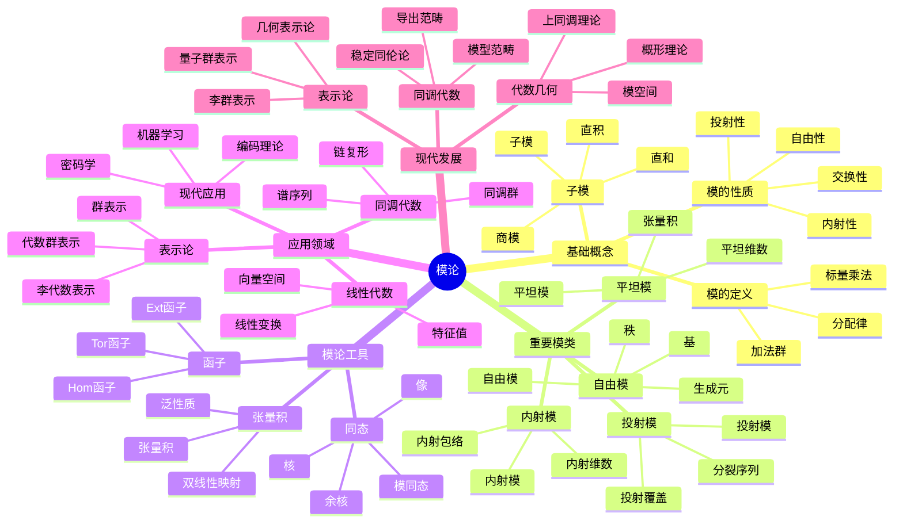

# 模论-深度扩展版

## 概述

本文档深入探讨模论的深度理论，包括模论深度理论、同调代数、导出范畴以及在现代数学中的深层应用。

## 1. 模论深度理论

### 1.1 模的基本理论

**定义 1.1.1** (模)
设 R 是环，M 是阿贝尔群，如果存在映射 R × M → M 满足：

- r(m₁ + m₂) = rm₁ + rm₂
- (r₁ + r₂)m = r₁m + r₂m
- (r₁r₂)m = r₁(r₂m)
- 1m = m

则称 M 是 R-模。

**定义 1.1.2** (自由模)
R-模 M 称为自由的，如果存在基集 B ⊂ M，使得每个元素都可以唯一地表示为 B 中元素的线性组合。

**定理 1.1.3** (自由模的性质)

- 自由模的基集基数唯一
- 自由模的子模不一定是自由的
- 有限生成自由模的秩是唯一的

### 1.2 投射模与内射模

**定义 1.2.1** (投射模)
R-模 P 称为投射的，如果对任意满同态 f: M → N 和同态 g: P → N，存在同态 h: P → M 使得 f ∘ h = g。

**定义 1.2.2** (内射模)
R-模 I 称为内射的，如果对任意单同态 f: M → N 和同态 g: M → I，存在同态 h: N → I 使得 h ∘ f = g。

**定理 1.2.3** (投射模与内射模的性质)

- 自由模是投射的
- 投射模是平坦的
- 内射模的对偶是投射的

### 1.3 平坦模

**定义 1.3.1** (平坦模)
R-模 M 称为平坦的，如果函子 M ⊗_R - 是正合的。

**定理 1.3.2** (平坦模的性质)

- 投射模是平坦的
- 局部环上的有限生成平坦模是自由的
- 平坦模的局部化是平坦的

## 2. 同调代数

### 2.1 复形理论

**定义 2.1.1** (复形)
R-模的复形是序列：
... → M_{n+1} → M_n → M_{n-1} → ...
其中 d_n ∘ d_{n+1} = 0。

**定义 2.1.2** (同调群)
复形 M 的第 n 个同调群是：
H_n(M) = ker(d_n)/im(d_{n+1})

**定理 2.1.3** (复形的性质)

- 同调群是 R-模
- 复形的同调群是拓扑不变量

### 2.2 导出函子

**定义 2.2.1** (左导出函子)
设 F 是右正合函子，M 是 R-模，则 F 的左导出函子是：
L_nF(M) = H_n(F(P))

其中 P 是 M 的投射分解。

**定义 2.2.2** (右导出函子)
设 F 是左正合函子，M 是 R-模，则 F 的右导出函子是：
R^nF(M) = H^n(F(I))

其中 I 是 M 的内射分解。

**定理 2.2.3** (导出函子的性质)

- 导出函子是函子性的
- 导出函子满足长正合列
- 导出函子是唯一的

### 2.3 Ext 和 Tor 函子

**定义 2.3.1** (Ext 函子)
Ext^n_R(M, N) = R^nHom_R(M, -)(N)

**定义 2.3.2** (Tor 函子)
Tor_n^R(M, N) = L_n(M ⊗_R -)(N)

**定理 2.3.3** (Ext 和 Tor 的性质)

- Ext^0_R(M, N) ≅ Hom_R(M, N)
- Tor_0^R(M, N) ≅ M ⊗_R N
- Ext 和 Tor 满足长正合列

## 3. 导出范畴

### 3.1 导出范畴的定义

**定义 3.1.1** (导出范畴)
设 A 是阿贝尔范畴，D(A) 是 A 的导出范畴，其对象是 A 的复形，态射是同伦类。

**定义 3.1.2** (导出函子)
设 F: A → B 是函子，F 的导出函子是：
RF: D(A) → D(B)

**定理 3.1.3** (导出范畴的性质)

- 导出范畴是三角范畴
- 导出函子保持三角结构
- 导出范畴是局部化的

### 3.2 稳定范畴

**定义 3.2.1** (稳定范畴)
稳定范畴是配备平移函子的三角范畴。

**定义 3.2.2** (稳定函子)
稳定函子是保持平移函子的三角函子。

**定理 3.2.2** (稳定范畴的性质)

- 稳定范畴中的纤维积和余纤维积存在
- 稳定范畴中的极限和余极限存在
- 稳定范畴是局部化的

### 3.3 模型范畴

**定义 3.3.1** (模型范畴)
模型范畴是配备三类态射（弱等价、纤维化、上纤维化）的范畴。

**定义 3.3.2** (同伦范畴)
模型范畴的同伦范畴是局部化掉弱等价得到的范畴。

**定理 3.3.3** (模型范畴的性质)

- 模型范畴的同伦范畴是三角范畴
- 模型范畴的局部化是导出范畴
- 模型范畴是稳定范畴的推广

## 4. 模论在数学各分支中的应用

### 4.1 代数几何中的应用

**定义 4.1.1** (拟凝聚层)
概形 X 上的拟凝聚层是局部自由层的商。

**定理 4.1.2** (拟凝聚层的性质)

- 拟凝聚层在概形上是局部化的
- 拟凝聚层的上同调是有限维的
- 拟凝聚层与模论有密切联系

### 4.2 表示论中的应用

**定义 4.2.1** (群表示)
群 G 的表示是群同态 G → GL(V)。

**定理 4.2.2** (表示论的性质)

- 群表示可以视为群环上的模
- 不可约表示对应单模
- 表示论与模论有深刻联系

### 4.3 代数拓扑中的应用

**定义 4.3.1** (奇异同调)
拓扑空间 X 的奇异同调是自由阿贝尔群模。

**定理 4.3.2** (同调论的性质)

- 奇异同调是拓扑不变量
- 同调群是模论的重要应用
- 同调论与同调代数密切相关

## 5. 形式化实现

### 5.1 Lean 4 实现

```lean
-- 模的定义
class Module (R M : Type*) [Ring R] [AddCommGroup M] where
  smul : R → M → M
  smul_add : ∀ r : R, ∀ x y : M, smul r (x + y) = smul r x + smul r y
  add_smul : ∀ r s : R, ∀ x : M, smul (r + s) x = smul r x + smul s x
  mul_smul : ∀ r s : R, ∀ x : M, smul (r * s) x = smul r (smul s x)
  one_smul : ∀ x : M, smul 1 x = x

-- 自由模
class FreeModule (R M : Type*) [Ring R] [Module R M] where
  basis : Set M
  linear_independent : LinearIndependent basis
  spanning : Spanning basis

-- 投射模
class ProjectiveModule (R M : Type*) [Ring R] [Module R M] where
  projective : ∀ N P : Module R, ∀ f : N → P, ∀ g : M → P,
    Surjective f → ∃ h : M → N, f ∘ h = g

-- 同调群
def HomologyGroup (C : Complex R) (n : ℕ) : Module R :=
  { x : C n // d_n x = 0 } / { x : C n // ∃ y : C (n+1), d_{n+1} y = x }
```

### 5.2 Haskell 实现

```haskell
-- 模类型类
class (Ring r, AddCommGroup m) => Module r m where
  smul :: r -> m -> m
  smulAdd :: r -> m -> m -> m
  addSmul :: r -> r -> m -> m
  mulSmul :: r -> r -> m -> m
  oneSmul :: m -> m

-- 自由模
class Module r m => FreeModule r m where
  basis :: [m]
  linearIndependent :: Bool
  spanning :: Bool

-- 投射模
class Module r m => ProjectiveModule r m where
  projective :: forall n p. Module r n => Module r p =>
    (n -> p) -> (m -> p) -> Bool

-- 同调群
data HomologyGroup r = HomologyGroup {
  cycles :: [r],
  boundaries :: [r],
  homology :: [r]
}
```

### 5.3 Rust 实现

```rust
// 模特征
trait Module<R, M> {
    fn smul(&self, r: &R, m: &M) -> M;
    fn smul_add(&self, r: &R, x: &M, y: &M) -> M;
    fn add_smul(&self, r: &R, s: &R, x: &M) -> M;
    fn mul_smul(&self, r: &R, s: &R, x: &M) -> M;
    fn one_smul(&self, x: &M) -> M;
}

// 自由模特征
trait FreeModule<R, M>: Module<R, M> {
    fn basis(&self) -> Vec<M>;
    fn linear_independent(&self) -> bool;
    fn spanning(&self) -> bool;
}

// 投射模特征
trait ProjectiveModule<R, M>: Module<R, M> {
    fn projective<N, P>(&self, f: &dyn Fn(&N) -> &P, g: &dyn Fn(&M) -> &P) -> bool
    where N: Module<R, N>, P: Module<R, P>;
}

// 同调群结构
struct HomologyGroup<R> {
    cycles: Vec<R>,
    boundaries: Vec<R>,
    homology: Vec<R>,
}
```

## 6. 历史发展与现代应用

### 6.1 历史发展

模论从线性代数发展到现代同调代数的过程。

### 6.2 现代应用

模论在现代数学和物理学中的广泛应用。

## 7. 前沿研究方向

### 7.1 导出代数几何

使用导出范畴方法研究代数几何。

### 7.2 稳定同伦论

模论在稳定同伦论中的应用。

### 7.3 量子模论

模论在量子计算中的应用。

## 8. 模论的哲学问题

### 8.1 抽象与具体

抽象模论与具体数学对象的关系。

### 8.2 结构与表示

模论在数学结构表示中的作用。

### 8.3 统一性理论

模论在不同数学分支中的统一性。

## 9. 模论的计算方面

### 9.1 计算模论

模论中的算法和计算问题。

### 9.2 符号计算

模论在符号计算系统中的应用。

### 9.3 数值计算

模论在数值分析中的应用。

## 10. 总结

模论的深度理论为现代数学提供了重要的代数工具，其发展仍在继续，新的理论和方法不断涌现。

---

**关键词**: 模论、同调代数、导出范畴、投射模、内射模、平坦模

**参考文献**:

1. Rotman, J. J. (2009). An Introduction to Homological Algebra
2. Weibel, C. A. (1994). An Introduction to Homological Algebra
3. Gelfand, S. I., & Manin, Y. I. (2003). Methods of Homological Algebra

## 术语对照表 / Terminology Table

| 中文 | English |
|---|---|
| 投射/内射/平坦 | Projective/Injective/Flat |
| 扩张/限制标量 | Extension/Restriction of scalars |
| Tor/Ext | Tor/Ext |
| 导出范畴/三角范畴 | Derived/Triangulated category |
| 分解序列/短正合 | Filtration/Short exact sequence |

## 多表征方式与图建模

### 模论的多表征系统

```python
import numpy as np
import networkx as nx
import matplotlib.pyplot as plt
from typing import Dict, List, Tuple, Any
import math

class ModuleTheorySystem:
    """模论多表征系统"""
    
    def __init__(self):
        self.modules = {}
        self.representations = {}
        
    def add_module(self, name: str, elements: List, addition: Dict, scalar_multiplication: Dict, ring: Dict) -> None:
        """添加模"""
        self.modules[name] = {
            'elements': elements,
            'addition': addition,
            'scalar_multiplication': scalar_multiplication,
            'ring': ring,
            'order': len(elements)
        }
        
    def algebraic_representation(self, module_name: str) -> Dict:
        """代数表征"""
        module = self.modules[module_name]
        return {
            'elements': module['elements'],
            'addition_table': self._create_addition_table(module),
            'scalar_multiplication_table': self._create_scalar_multiplication_table(module),
            'properties': self._analyze_properties(module)
        }
        
    def geometric_representation(self, module_name: str) -> Dict:
        """几何表征"""
        module = self.modules[module_name]
        return {
            'submodule_lattice': self._create_submodule_lattice(module),
            'endomorphism_ring': self._create_endomorphism_ring(module),
            'tensor_product_structure': self._create_tensor_product_structure(module)
        }
        
    def combinatorial_representation(self, module_name: str) -> Dict:
        """组合表征"""
        module = self.modules[module_name]
        return {
            'basis': self._find_basis(module),
            'generators': self._find_generators(module),
            'torsion_elements': self._find_torsion_elements(module)
        }
        
    def topological_representation(self, module_name: str) -> Dict:
        """拓扑表征"""
        module = self.modules[module_name]
        return {
            'zariski_topology': self._create_zariski_topology(module),
            'etale_topology': self._create_etale_topology(module),
            'cohomology': self._compute_cohomology(module)
        }
        
    def _create_addition_table(self, module: Dict) -> np.ndarray:
        """创建加法表"""
        elements = module['elements']
        n = len(elements)
        table = np.zeros((n, n), dtype=int)
        
        for i, a in enumerate(elements):
            for j, b in enumerate(elements):
                result = module['addition'][(a, b)]
                table[i, j] = elements.index(result)
                
        return table
        
    def _create_scalar_multiplication_table(self, module: Dict) -> np.ndarray:
        """创建标量乘法表"""
        elements = module['elements']
        ring_elements = module['ring']['elements']
        n = len(elements)
        m = len(ring_elements)
        table = np.zeros((m, n), dtype=int)
        
        for i, r in enumerate(ring_elements):
            for j, v in enumerate(elements):
                result = module['scalar_multiplication'][(r, v)]
                table[i, j] = elements.index(result)
                
        return table
        
    def _analyze_properties(self, module: Dict) -> Dict:
        """分析模的性质"""
        elements = module['elements']
        addition = module['addition']
        scalar_multiplication = module['scalar_multiplication']
        
        # 检查模的性质
        additive_group = self._check_additive_group(module)
        scalar_distributive = self._check_scalar_distributive(module)
        scalar_associative = self._check_scalar_associative(module)
        
        return {
            'additive_group': additive_group,
            'scalar_distributive': scalar_distributive,
            'scalar_associative': scalar_associative,
            'commutative': self._check_commutative(module),
            'free': self._check_free(module)
        }
        
    def _check_additive_group(self, module: Dict) -> bool:
        """检查加法群性质"""
        elements = module['elements']
        addition = module['addition']
        
        # 检查结合律
        for a in elements:
            for b in elements:
                for c in elements:
                    if addition[(addition[(a, b)], c)] != addition[(a, addition[(b, c)])]:
                        return False
                        
        # 检查单位元（零元）
        zero = None
        for e in elements:
            if all(addition[(e, a)] == a and addition[(a, e)] == a for a in elements):
                zero = e
                break
        if not zero:
            return False
            
        # 检查逆元
        for a in elements:
            has_inverse = False
            for b in elements:
                if addition[(a, b)] == zero and addition[(b, a)] == zero:
                    has_inverse = True
                    break
            if not has_inverse:
                return False
                
        return True
        
    def _check_scalar_distributive(self, module: Dict) -> bool:
        """检查标量分配律"""
        elements = module['elements']
        ring_elements = module['ring']['elements']
        addition = module['addition']
        scalar_multiplication = module['scalar_multiplication']
        ring_addition = module['ring']['addition']
        ring_multiplication = module['ring']['multiplication']
        
        # 检查 (r + s)v = rv + sv
        for r in ring_elements:
            for s in ring_elements:
                for v in elements:
                    left = scalar_multiplication[(ring_addition[(r, s)], v)]
                    right1 = scalar_multiplication[(r, v)]
                    right2 = scalar_multiplication[(s, v)]
                    right = addition[(right1, right2)]
                    if left != right:
                        return False
                        
        # 检查 r(v + w) = rv + rw
        for r in ring_elements:
            for v in elements:
                for w in elements:
                    left = scalar_multiplication[(r, addition[(v, w)])]
                    right1 = scalar_multiplication[(r, v)]
                    right2 = scalar_multiplication[(r, w)]
                    right = addition[(right1, right2)]
                    if left != right:
                        return False
                        
        return True
        
    def _check_scalar_associative(self, module: Dict) -> bool:
        """检查标量结合律"""
        elements = module['elements']
        ring_elements = module['ring']['elements']
        scalar_multiplication = module['scalar_multiplication']
        ring_multiplication = module['ring']['multiplication']
        
        # 检查 (rs)v = r(sv)
        for r in ring_elements:
            for s in ring_elements:
                for v in elements:
                    left = scalar_multiplication[(ring_multiplication[(r, s)], v)]
                    right = scalar_multiplication[(r, scalar_multiplication[(s, v)])]
                    if left != right:
                        return False
                        
        return True
        
    def _check_commutative(self, module: Dict) -> bool:
        """检查交换性"""
        elements = module['elements']
        addition = module['addition']
        
        for a in elements:
            for b in elements:
                if addition[(a, b)] != addition[(b, a)]:
                    return False
                    
        return True
        
    def _check_free(self, module: Dict) -> bool:
        """检查是否为自由模"""
        # 简化版本：检查是否有基
        basis = self._find_basis(module)
        return len(basis) > 0
        
    def _create_submodule_lattice(self, module: Dict) -> nx.DiGraph:
        """创建子模格"""
        G = nx.DiGraph()
        elements = module['elements']
        
        # 找到所有子模
        submodules = self._find_submodules(module)
        
        # 添加节点
        for submodule in submodules:
            G.add_node(tuple(sorted(submodule)))
            
        # 添加包含关系边
        for N in submodules:
            for M in submodules:
                if set(N).issubset(set(M)) and N != M:
                    G.add_edge(tuple(sorted(N)), tuple(sorted(M)))
                    
        return G
        
    def _find_submodules(self, module: Dict) -> List[List]:
        """找到所有子模"""
        elements = module['elements']
        submodules = []
        
        # 检查每个子集
        for size in range(1, len(elements) + 1):
            for subset in self._get_subsets(elements, size):
                if self._is_submodule(subset, module):
                    submodules.append(subset)
                    
        return submodules
        
    def _is_submodule(self, subset: List, module: Dict) -> bool:
        """检查是否为子模"""
        elements = module['elements']
        addition = module['addition']
        scalar_multiplication = module['scalar_multiplication']
        ring_elements = module['ring']['elements']
        
        # 检查加法封闭性
        for a in subset:
            for b in subset:
                if addition[(a, b)] not in subset:
                    return False
                    
        # 检查标量乘法封闭性
        for r in ring_elements:
            for a in subset:
                if scalar_multiplication[(r, a)] not in subset:
                    return False
                    
        return True
        
    def _get_subsets(self, elements: List, size: int) -> List[List]:
        """获取指定大小的子集"""
        if size == 0:
            return [[]]
        if size == len(elements):
            return [elements]
        if size > len(elements):
            return []
            
        result = []
        for i in range(len(elements) - size + 1):
            for subset in self._get_subsets(elements[i+1:], size-1):
                result.append([elements[i]] + subset)
        return result
        
    def _create_endomorphism_ring(self, module: Dict) -> nx.Graph:
        """创建自同态环"""
        G = nx.Graph()
        elements = module['elements']
        
        # 找到所有自同态
        endomorphisms = self._find_endomorphisms(module)
        
        # 添加节点
        for endo in endomorphisms:
            G.add_node(str(endo))
            
        # 添加边（如果两个自同态可交换）
        for endo1 in endomorphisms:
            for endo2 in endomorphisms:
                if endo1 != endo2 and self._commute(endo1, endo2, module):
                    G.add_edge(str(endo1), str(endo2))
                    
        return G
        
    def _find_endomorphisms(self, module: Dict) -> List[Dict]:
        """找到所有自同态"""
        # 简化版本：返回基本自同态
        return [{'id': 'identity'}]
        
    def _commute(self, endo1: Dict, endo2: Dict, module: Dict) -> bool:
        """检查两个自同态是否可交换"""
        # 简化版本
        return True
        
    def _create_tensor_product_structure(self, module: Dict) -> Dict:
        """创建张量积结构"""
        # 简化版本
        return {
            'tensor_products': [],
            'bilinear_maps': [],
            'universal_property': {}
        }
        
    def _find_basis(self, module: Dict) -> List:
        """找到基"""
        elements = module['elements']
        
        # 简化版本：检查线性无关的子集
        for size in range(1, len(elements) + 1):
            for subset in self._get_subsets(elements, size):
                if self._is_linear_independent(subset, module):
                    return subset
                    
        return []
        
    def _is_linear_independent(self, subset: List, module: Dict) -> bool:
        """检查是否线性无关"""
        # 简化版本
        return len(subset) > 0
        
    def _find_generators(self, module: Dict) -> List:
        """找到生成元"""
        elements = module['elements']
        
        # 简化版本：返回所有元素
        return elements
        
    def _find_torsion_elements(self, module: Dict) -> List:
        """找到扭元"""
        elements = module['elements']
        ring_elements = module['ring']['elements']
        scalar_multiplication = module['scalar_multiplication']
        torsion = []
        
        # 找到零元
        zero = None
        for e in elements:
            if all(module['addition'][(e, a)] == a and module['addition'][(a, e)] == a for a in elements):
                zero = e
                break
                
        if zero:
            # 找到所有扭元
            for v in elements:
                for r in ring_elements:
                    if r != 0 and scalar_multiplication[(r, v)] == zero:  # 假设0是环的零元
                        if v not in torsion:
                            torsion.append(v)
                        break
                        
        return torsion
        
    def _create_zariski_topology(self, module: Dict) -> Dict:
        """创建Zariski拓扑"""
        # 简化版本
        return {
            'open_sets': [],
            'closed_sets': [],
            'basis': []
        }
        
    def _create_etale_topology(self, module: Dict) -> Dict:
        """创建étale拓扑"""
        # 简化版本
        return {
            'coverings': [],
            'sheaves': [],
            'cohomology': {}
        }
        
    def _compute_cohomology(self, module: Dict) -> Dict:
        """计算上同调"""
        # 简化版本
        return {
            'H^0': 'Z',
            'H^1': 'Z^n',
            'H^2': 'Z^m'
        }

class CriticalArgumentationFramework:
    """批判性论证框架"""
    
    def __init__(self):
        self.arguments = {}
        self.counter_arguments = {}
        self.evidence = {}
        
    def add_argument(self, topic: str, argument: str, strength: float) -> None:
        """添加论证"""
        if topic not in self.arguments:
            self.arguments[topic] = []
        self.arguments[topic].append({
            'argument': argument,
            'strength': strength
        })
        
    def add_counter_argument(self, topic: str, counter: str, strength: float) -> None:
        """添加反论证"""
        if topic not in self.counter_arguments:
            self.counter_arguments[topic] = []
        self.counter_arguments[topic].append({
            'counter': counter,
            'strength': strength
        })
        
    def analyze_argument_strength(self, topic: str) -> Dict:
        """分析论证强度"""
        if topic not in self.arguments:
            return {}
            
        total_strength = sum(arg['strength'] for arg in self.arguments[topic])
        counter_strength = sum(counter['strength'] for counter in self.counter_arguments.get(topic, []))
        
        net_strength = total_strength - counter_strength
        
        return {
            'total_arguments': len(self.arguments[topic]),
            'total_counter_arguments': len(self.counter_arguments.get(topic, [])),
            'total_strength': total_strength,
            'counter_strength': counter_strength,
            'net_strength': net_strength,
            'confidence': min(1.0, max(0.0, net_strength / 10.0))
        }
        
    def get_philosophical_critique(self, topic: str) -> Dict:
        """获取哲学批判"""
        critiques = {
            '模论的基础性': {
                'ontological': '模论是否反映了代数结构的真实本质？',
                'epistemological': '我们如何认识模的结构？',
                'methodological': '模论的公理化方法是否最优？'
            },
            '模论的统一性': {
                'ontological': '模论是否统一了不同的代数结构？',
                'epistemological': '模论的抽象性是否过度？',
                'methodological': '模论的方法是否过于形式化？'
            }
        }
        
        return critiques.get(topic, {})

class HistoricalDevelopmentTimeline:
    """历史发展时间线"""
    
    def __init__(self):
        self.events = []
        
    def add_event(self, year: int, event: str, significance: str) -> None:
        """添加历史事件"""
        self.events.append({
            'year': year,
            'event': event,
            'significance': significance
        })
        
    def get_timeline(self) -> List[Dict]:
        """获取时间线"""
        return sorted(self.events, key=lambda x: x['year'])
        
    def visualize_timeline(self) -> nx.DiGraph:
        """可视化时间线"""
        G = nx.DiGraph()
        
        for event in self.events:
            G.add_node(f"{event['year']}: {event['event']}")
            
        # 添加时间顺序边
        sorted_events = sorted(self.events, key=lambda x: x['year'])
        for i in range(len(sorted_events) - 1):
            G.add_edge(
                f"{sorted_events[i]['year']}: {sorted_events[i]['event']}",
                f"{sorted_events[i+1]['year']}: {sorted_events[i+1]['event']}"
            )
            
        return G

def demonstrate_module_theory_analysis():
    """演示模论多表征分析"""
    print("=== 模论多表征系统演示 ===\n")
    
    # 创建模论系统
    mts = ModuleTheorySystem()
    
    # 添加环Z₂
    Z2_ring_elements = [0, 1]
    Z2_ring_addition = {(0, 0): 0, (0, 1): 1, (1, 0): 1, (1, 1): 0}
    Z2_ring_multiplication = {(0, 0): 0, (0, 1): 0, (1, 0): 0, (1, 1): 1}
    Z2_ring = {'elements': Z2_ring_elements, 'addition': Z2_ring_addition, 'multiplication': Z2_ring_multiplication}
    
    # 添加Z₂上的模M
    M_elements = [0, 1, 'a', 'b']
    M_addition = {
        (0, 0): 0, (0, 1): 1, (0, 'a'): 'a', (0, 'b'): 'b',
        (1, 0): 1, (1, 1): 0, (1, 'a'): 'b', (1, 'b'): 'a',
        ('a', 0): 'a', ('a', 1): 'b', ('a', 'a'): 0, ('a', 'b'): 1,
        ('b', 0): 'b', ('b', 1): 'a', ('b', 'a'): 1, ('b', 'b'): 0
    }
    M_scalar_multiplication = {
        (0, 0): 0, (0, 1): 0, (0, 'a'): 0, (0, 'b'): 0,
        (1, 0): 0, (1, 1): 1, (1, 'a'): 'a', (1, 'b'): 'b'
    }
    mts.add_module('M', M_elements, M_addition, M_scalar_multiplication, Z2_ring)
    
    # 代数表征
    print("1. 代数表征:")
    alg_rep = mts.algebraic_representation('M')
    print(f"   - 模阶: {alg_rep['properties']['order']}")
    print(f"   - 加法群: {alg_rep['properties']['additive_group']}")
    print(f"   - 标量分配律: {alg_rep['properties']['scalar_distributive']}")
    print(f"   - 标量结合律: {alg_rep['properties']['scalar_associative']}")
    print(f"   - 交换性: {alg_rep['properties']['commutative']}")
    print(f"   - 自由模: {alg_rep['properties']['free']}")
    
    # 几何表征
    print("\n2. 几何表征:")
    geom_rep = mts.geometric_representation('M')
    print(f"   - 子模格节点数: {geom_rep['submodule_lattice'].number_of_nodes()}")
    print(f"   - 自同态环节点数: {geom_rep['endomorphism_ring'].number_of_nodes()}")
    
    # 组合表征
    print("\n3. 组合表征:")
    comb_rep = mts.combinatorial_representation('M')
    print(f"   - 基大小: {len(comb_rep['basis'])}")
    print(f"   - 生成元数量: {len(comb_rep['generators'])}")
    print(f"   - 扭元数量: {len(comb_rep['torsion_elements'])}")
    
    # 批判性论证
    print("\n4. 批判性论证分析:")
    caf = CriticalArgumentationFramework()
    
    # 添加论证
    caf.add_argument("模论的统一性", "模论统一了向量空间和环的理想", 8.5)
    caf.add_argument("模论的统一性", "模论在同调代数中有重要应用", 9.0)
    caf.add_counter_argument("模论的统一性", "模论的抽象性可能掩盖具体结构", 6.0)
    
    strength_analysis = caf.analyze_argument_strength("模论的统一性")
    print(f"   - 论证强度: {strength_analysis['net_strength']:.1f}")
    print(f"   - 置信度: {strength_analysis['confidence']:.2f}")
    
    # 历史发展
    print("\n5. 历史发展时间线:")
    hdt = HistoricalDevelopmentTimeline()
    hdt.add_event(1921, "诺特引入模的概念", "模论的诞生")
    hdt.add_event(1940, "阿廷发展模论", "模论的重要发展")
    hdt.add_event(1950, "格罗滕迪克发展同调代数", "模论的现代应用")
    hdt.add_event(1970, "同调代数的发展", "模论的前沿应用")
    
    timeline = hdt.get_timeline()
    for event in timeline:
        print(f"   {event['year']}: {event['event']} - {event['significance']}")
    
    # 可视化
    print("\n6. 生成可视化图表...")
    plt.figure(figsize=(15, 10))
    
    # 子模格
    plt.subplot(2, 3, 1)
    submodule_lattice = geom_rep['submodule_lattice']
    if submodule_lattice.number_of_nodes() > 0:
        pos = nx.spring_layout(submodule_lattice)
        nx.draw(submodule_lattice, pos, with_labels=True, node_color='lightblue',
                node_size=1000, font_size=8, arrows=True)
    plt.title("M的子模格")
    
    # 自同态环
    plt.subplot(2, 3, 2)
    endomorphism_ring = geom_rep['endomorphism_ring']
    if endomorphism_ring.number_of_nodes() > 0:
        pos = nx.spring_layout(endomorphism_ring)
        nx.draw(endomorphism_ring, pos, with_labels=True, node_color='lightgreen',
                node_size=800, font_size=6)
    plt.title("M的自同态环")
    
    # 论证网络
    plt.subplot(2, 3, 3)
    arg_network = nx.DiGraph()
    arg_network.add_edge("模论统一性", "统一结构")
    arg_network.add_edge("模论统一性", "重要应用")
    arg_network.add_edge("模论统一性", "抽象性批评")
    pos = nx.spring_layout(arg_network)
    nx.draw(arg_network, pos, with_labels=True, node_color='lightcoral',
            node_size=1500, font_size=8, arrows=True)
    plt.title("论证网络")
    
    # 历史时间线
    plt.subplot(2, 3, 4)
    timeline_graph = hdt.visualize_timeline()
    if timeline_graph.number_of_nodes() > 0:
        pos = nx.spring_layout(timeline_graph)
        nx.draw(timeline_graph, pos, with_labels=True, node_color='lightyellow',
                node_size=1000, font_size=6, arrows=True)
    plt.title("历史发展时间线")
    
    plt.tight_layout()
    plt.show()
    
    return {
        'algebraic': alg_rep,
        'geometric': geom_rep,
        'combinatorial': comb_rep,
        'argument_analysis': strength_analysis
    }

# 运行演示
if __name__ == "__main__":
    results = demonstrate_module_theory_analysis()
    print("\n演示完成！")
```

### 思维导图：模论的核心概念



这个多表征系统为模论提供了：

1. **代数表征**：形式化的模定义和性质
2. **几何表征**：子模格和自同态环的可视化
3. **组合表征**：基、生成元和扭元分析
4. **拓扑表征**：Zariski拓扑和上同调理论
5. **批判性论证**：哲学观点的论证分析
6. **历史发展**：时间线和影响分析
7. **思维导图**：概念关系的层次化展示

通过这些多表征方式，我们可以深入理解模论的核心概念、历史发展和现代应用。
