# 李代数 - 增强版

## 📚 概述

李代数是抽象代数学的重要分支，研究具有李括号运算的代数结构。
李代数的概念统一了李群理论、微分几何、量子力学等众多数学和物理领域，是现代数学和物理学的基础理论之一。

## 🕰️ 历史发展脉络

### 早期发展 (1870-1920)

#### 李群背景

- **1873年**: 索菲斯·李开始研究连续群
- **1888年**: 李发表《变换群理论》
- **1890年**: 李研究无穷小变换

#### 微分几何背景

- **1894年**: 李研究微分方程
- **1900年**: 嘉当研究李群结构
- **1910年**: 外尔研究李群表示

### 现代发展 (1920-1960)

#### 抽象李代数

- **1920年**: 嘉当建立李代数理论
- **1930年**: 外尔研究李代数分类
- **1940年**: 基林研究李代数结构

#### 表示论发展

- **1925年**: 外尔-彼得定理
- **1930年**: 嘉当-外尔理论
- **1950年**: 哈瑞什-钱德拉理论

### 当代发展 (1960-至今)

#### 代数群论

- **1960年代**: 切瓦利群理论
- **1970年代**: 德利涅代数群
- **1980年代**: 朗兰兹纲领

#### 量子群论

- **1980年代**: 德林费尔德量子群
- **1990年代**: 量子包络代数
- **2000年代**: 量子几何

## 🏗️ 核心概念

### 李代数的定义

```lean
-- Lean 4 形式化定义
structure LieAlgebra where
  carrier : Type
  add : carrier → carrier → carrier
  bracket : carrier → carrier → carrier
  zero : carrier
  neg : carrier → carrier
  smul : ℝ → carrier → carrier
  
  -- 向量空间公理
  add_assoc : ∀ a b c, add (add a b) c = add a (add b c)
  add_comm : ∀ a b, add a b = add b a
  add_zero : ∀ a, add a zero = a
  add_neg : ∀ a, add a (neg a) = zero
  
  -- 李括号公理
  bracket_antisym : ∀ a b, bracket a b = neg (bracket b a)
  bracket_jacobi : ∀ a b c, bracket a (bracket b c) + bracket b (bracket c a) + bracket c (bracket a b) = zero
  bracket_bilinear : ∀ r s a b c, bracket (add (smul r a) (smul s b)) c = add (smul r (bracket a c)) (smul s (bracket b c))
```

### 基本性质

#### 1. 向量空间性质

- 结合律：$(a + b) + c = a + (b + c)$
- 交换律：$a + b = b + a$
- 零元：$a + 0 = 0 + a = a$
- 负元：$a + (-a) = (-a) + a = 0$

#### 2. 李括号性质

- 反对称性：$[a, b] = -[b, a]$
- 雅可比恒等式：$[a, [b, c]] + [b, [c, a]] + [c, [a, b]] = 0$
- 双线性：$[ra + sb, c] = r[a, c] + s[b, c]$

## 📊 可视化图表

### 李代数的结构图

```mermaid
graph TD
    A[李代数 g] --> B[向量空间]
    A --> C[李括号]
    A --> D[雅可比恒等式]
    
    B --> E[加法群]
    B --> F[标量乘法]
    
    C --> G[反对称性]
    C --> H[双线性]
    C --> I[雅可比恒等式]
```



### 李代数的类型关系图

```mermaid
graph TD
    A[李代数] --> B[有限维李代数]
    A --> C[无限维李代数]
    A --> D[可解李代数]
    A --> E[半单李代数]
    
    B --> F[简单李代数]
    B --> G[可解李代数]
    B --> H[幂零李代数]
    
    C --> I[李代数]
    C --> J[仿射李代数]
    C --> K[Kac-Moody代数]
    
    D --> L[可解性]
    E --> M[半单性]
```



### 根系关系图

```mermaid
graph TD
    A[李代数 g] --> B[嘉当子代数 h]
    B --> C[根系 Φ]
    C --> D[正根 Φ+]
    C --> E[负根 Φ-]
    
    D --> F[简单根]
    E --> G[负简单根]
    
    C --> H[外尔群 W]
    H --> I[反射]
    H --> J[生成元]
```



## 🔍 实例表征

### 1. 经典李代数实例

#### 一般线性李代数 gl(n, ℝ)

```haskell
-- Haskell 实现
data Matrix = Matrix {
    entries :: [[Double]]
}

instance LieAlgebra Matrix where
  zero = Matrix (replicate n (replicate n 0))
  neg (Matrix m) = Matrix (map (map negate) m)
  
  add (Matrix m1) (Matrix m2) = Matrix (zipWith (zipWith (+)) m1 m2)
  bracket (Matrix m1) (Matrix m2) = 
    let product1 = matrix_multiply m1 m2
        product2 = matrix_multiply m2 m1
    in Matrix (zipWith (zipWith (-)) product1 product2)
  
  smul r (Matrix m) = Matrix (map (map (r *)) m)
```

#### 特殊线性李代数 sl(n, ℝ)

```rust
// Rust 实现
#[derive(Debug, Clone)]
pub struct SpecialLinearAlgebra {
    dimension: usize,
}

impl SpecialLinearAlgebra {
    pub fn new(dimension: usize) -> Self {
        SpecialLinearAlgebra { dimension }
    }
    
    pub fn bracket(&self, a: &Matrix, b: &Matrix) -> Matrix {
        // [A, B] = AB - BA
        let ab = self.matrix_multiply(a, b);
        let ba = self.matrix_multiply(b, a);
        self.matrix_subtract(&ab, &ba)
    }
    
    pub fn trace(&self, matrix: &Matrix) -> f64 {
        let mut trace = 0.0;
        for i in 0..self.dimension {
            trace += matrix.data[i][i];
        }
        trace
    }
    
    pub fn is_traceless(&self, matrix: &Matrix) -> bool {
        self.trace(matrix) == 0.0
    }
}
```

#### 正交李代数 so(n, ℝ)

```lean
-- Lean 4 实现
structure OrthogonalAlgebra (n : ℕ) where
  matrix : Matrix ℝ n n
  antisymmetric : ∀ i j, matrix i j = -matrix j i

def bracket (a b : OrthogonalAlgebra n) : OrthogonalAlgebra n :=
  ⟨a.matrix * b.matrix - b.matrix * a.matrix, 
   by simp [antisymmetric_property]⟩

def add (a b : OrthogonalAlgebra n) : OrthogonalAlgebra n :=
  ⟨a.matrix + b.matrix, 
   by simp [antisymmetric_property]⟩
```

### 2. 重要李代数类

#### 海森堡李代数

```haskell
-- 海森堡李代数
data HeisenbergAlgebra = HeisenbergAlgebra {
    p :: Double,  -- 动量
    q :: Double,  -- 位置
    z :: Double   -- 中心元素
}

instance LieAlgebra HeisenbergAlgebra where
  zero = HeisenbergAlgebra 0 0 0
  neg (HeisenbergAlgebra p q z) = HeisenbergAlgebra (-p) (-q) (-z)
  
  add (HeisenbergAlgebra p1 q1 z1) (HeisenbergAlgebra p2 q2 z2) =
    HeisenbergAlgebra (p1 + p2) (q1 + q2) (z1 + z2)
  
  bracket (HeisenbergAlgebra p1 q1 z1) (HeisenbergAlgebra p2 q2 z2) =
    HeisenbergAlgebra 0 0 (p1 * q2 - p2 * q1)
```

#### 仿射李代数

```rust
// 仿射李代数
pub struct AffineLieAlgebra {
    base_algebra: Box<dyn LieAlgebra>,
    central_extension: f64,
    derivation: Box<dyn Fn(f64) -> f64>,
}

impl AffineLieAlgebra {
    pub fn new(base_algebra: Box<dyn LieAlgebra>, central_extension: f64) -> Self {
        AffineLieAlgebra {
            base_algebra,
            central_extension,
            derivation: Box::new(|x| x),
        }
    }
    
    pub fn bracket(&self, a: &AffineElement, b: &AffineElement) -> AffineElement {
        let base_bracket = self.base_algebra.bracket(&a.base, &b.base);
        let central_term = self.central_extension * a.derivation(&b.base);
        
        AffineElement {
            base: base_bracket,
            central: central_term,
        }
    }
}
```

### 3. 量子李代数实例

#### 量子包络代数

```haskell
-- 量子包络代数 U_q(g)
data QuantumEnvelopeAlgebra = QuantumEnvelopeAlgebra {
    base_algebra :: LieAlgebra,
    quantum_parameter :: Double
}

instance LieAlgebra QuantumEnvelopeAlgebra where
  bracket a b = 
    let q = quantum_parameter a
        classical_bracket = bracket (base_algebra a) (base_algebra b)
    in quantum_deformation q classical_bracket

-- 量子变形
quantum_deformation :: Double -> LieAlgebra -> LieAlgebra
quantum_deformation q algebra = 
  -- 实现量子变形
  algebra
```

## 🧠 思维过程表征

### 1. 李代数问题解决流程

#### 步骤1：识别李代数结构

```text
问题 → 识别李括号 → 验证李代数公理 → 确定李代数类型
```

#### 步骤2：分析李代数性质

```text
李代数结构 → 子代数分析 → 理想分析 → 表示分析
```

#### 步骤3：应用李代数工具

```text
李代数性质 → 嘉当分解 → 根系理论 → 表示论
```

### 2. 证明思维过程

#### 嘉当分解证明

```text
1. 定义嘉当子代数
2. 构造根系
3. 证明分解唯一性
4. 得出结构定理
```

#### 外尔群性质证明

```text
1. 定义反射
2. 构造生成元
3. 证明群结构
4. 得出群性质
```

### 3. 概念理解步骤

#### 理解李代数的概念

```text
1. 向量空间结构
2. 李括号运算
3. 雅可比恒等式
4. 具体实例验证
```

#### 理解根系概念

```text
1. 嘉当子代数
2. 权重空间
3. 根系性质
4. 根系分类
```

## 🌍 应用场景表征

### 1. 物理学应用

#### 量子力学

- **角动量**: 李代数表示
- **谐振子**: 海森堡代数
- **对称性**: 李群对称性

#### 粒子物理

- **规范理论**: 李代数规范群
- **标准模型**: SU(3)×SU(2)×U(1)
- **大统一理论**: 更大李代数

### 2. 微分几何应用

#### 李群理论

```haskell
-- 李群到李代数的对应
data LieGroup = LieGroup {
    manifold :: Manifold,
    group_operation :: GroupOperation
}

data LieAlgebra = LieAlgebra {
    tangent_space :: VectorSpace,
    bracket_operation :: BracketOperation
}

-- 指数映射
exponential_map :: LieAlgebra -> LieGroup
exponential_map algebra = 
  let tangent_vector = algebra.tangent_space
      one_parameter_subgroup = generate_subgroup tangent_vector
  in LieGroup { manifold = one_parameter_subgroup, group_operation = group_op }
```

#### 微分方程

- **对称性**: 李群对称性
- **不变性**: 李代数不变性
- **可积性**: 李代数可积性

### 3. 代数几何应用

#### 代数群理论

```rust
// 代数群
pub struct AlgebraicGroup {
    variety: AlgebraicVariety,
    group_operation: GroupOperation,
    lie_algebra: LieAlgebra,
}

impl AlgebraicGroup {
    pub fn new(variety: AlgebraicVariety, group_operation: GroupOperation) -> Self {
        let lie_algebra = Self::compute_lie_algebra(&variety, &group_operation);
        AlgebraicGroup {
            variety,
            group_operation,
            lie_algebra,
        }
    }
    
    fn compute_lie_algebra(variety: &AlgebraicVariety, group_op: &GroupOperation) -> LieAlgebra {
        // 计算李代数
        let tangent_space = variety.tangent_space_at_identity();
        let bracket = Self::compute_bracket(group_op);
        
        LieAlgebra::new(tangent_space, bracket)
    }
}
```

#### 表示论

- **代数群表示**: 李代数表示
- **特征标理论**: 李代数特征标
- **朗兰兹纲领**: 李代数朗兰兹

### 4. 计算机科学应用

#### 机器人学

```haskell
-- 机器人运动学中的李代数
data RobotJoint = RobotJoint {
    axis :: Vector3D,
    joint_type :: JointType
}

data LieAlgebraSE3 = LieAlgebraSE3 {
    rotation_part :: LieAlgebraSO3,
    translation_part :: Vector3D
}

-- 机器人运动学
robot_kinematics :: [RobotJoint] -> LieAlgebraSE3
robot_kinematics joints = 
  let screw_theory = map joint_to_screw joints
      product_of_exponentials = foldr multiply_exponentials identity screw_theory
  in product_of_exponentials
```

#### 计算机视觉

- **刚体运动**: SE(3)李代数
- **相机标定**: 李代数优化
- **SLAM**: 李代数滤波

### 5. 数学内部应用

#### 数论

- **朗兰兹纲领**: 李代数表示
- **自守形式**: 李代数自守形式
- **L函数**: 李代数L函数

#### 拓扑学

- **同伦论**: 李代数同伦
- **K理论**: 李代数K理论
- **指标理论**: 李代数指标

## 🔗 知识关联网络

### 与其他数学分支的联系

#### 与群论的联系

- 李群到李代数的对应
- 李代数的表示论
- 李代数的同调论

#### 与微分几何的联系

- 切空间李代数
- 李群上的微分形式
- 李代数上的几何结构

#### 与表示论的联系

- 李代数表示
- 特征标理论
- 朗兰兹纲领

### 理论发展脉络

#### 从具体到抽象

```text
李群 → 李代数 → 抽象李代数 → 量子李代数
```

#### 从有限到无限

```text
有限维李代数 → 无限维李代数 → 仿射李代数 → Kac-Moody代数
```

#### 从经典到量子

```text
经典李代数 → 量子李代数 → 量子群 → 非交换几何
```

## 📈 现代发展前沿

### 1. 量子群论

- **量子包络代数**: 李代数的量子化
- **量子群**: 非交换代数结构
- **量子几何**: 几何的量子化

### 2. 无限维李代数

- **仿射李代数**: 无限维结构
- **Kac-Moody代数**: 广义李代数
- **顶点算子代数**: 共形场论

### 3. 表示论

- **李代数表示**: 有限维和无限维
- **朗兰兹纲领**: 李代数朗兰兹
- **几何朗兰兹**: 几何表示论

### 4. 应用数学

- **机器人学**: 运动学和控制
- **计算机视觉**: 几何优化
- **信号处理**: 李群滤波

## 🎯 学习路径建议

### 初学者路径

1. **基础概念**: 李代数的定义和基本性质
2. **重要例子**: 一般线性李代数、特殊线性李代数、正交李代数
3. **基本定理**: 嘉当分解、根系理论
4. **应用实例**: 量子力学、微分几何

### 进阶路径

1. **表示论**: 李代数表示和特征标
2. **量子群**: 量子李代数理论
3. **代数几何**: 李代数与代数群
4. **现代应用**: 机器人学、计算机视觉

### 研究路径

1. **前沿理论**: 量子群、无限维李代数
2. **交叉应用**: 表示论、代数几何
3. **计算代数**: 算法和软件
4. **开放问题**: 未解决的李代数问题

## 🌟 总结

李代数作为现代数学和物理学的重要工具，不仅提供了统一的代数结构，还在各个领域发挥着重要作用。从基础的量子力学到前沿的量子群论，李代数的发展展现了数学的深刻性和普适性。

通过多表征的学习方法，我们可以从不同角度理解李代数：

- **历史角度**: 了解李代数的发展历程
- **结构角度**: 掌握李代数的基本性质
- **应用角度**: 认识李代数的实际价值
- **发展角度**: 关注李代数的现代发展

李代数将继续在数学、物理学和其他科学领域发挥重要作用，为人类认识世界提供强大的工具。

---

**相关文档**:

- [群论-增强版](01-群论-增强版.md)
- [环论-增强版](02-环论-增强版.md)
- [域论-增强版](03-域论-增强版.md)
- [模论-增强版](04-模论-增强版.md)
- [量子群论-高级主题](../11-高级数学/量子群论-高级主题.md)
- [表示论-高级主题](../11-高级数学/表示论-高级主题.md)

## 术语对照表 / Terminology Table

| 中文 | English |
|---|---|
| 李代数 | Lie algebra |
| 李群 | Lie group |
| 李括号 | Lie bracket |
| 反对称性 | Antisymmetry |
| 雅可比恒等式 | Jacobi identity |
| 表示 | Representation |
| 根系 | Root system |
| Cartan子代数 | Cartan subalgebra |
| 半单/单纯 | Semisimple/Simple |
| 基灵形式 | Killing form |
| 普适包络代数 | Universal enveloping algebra |
| 权与权系 | Weight and weight system |

## 多表征方式与图建模

### 李代数的多表征系统

```python
import numpy as np
import networkx as nx
import matplotlib.pyplot as plt
from typing import Dict, List, Tuple, Any
import math

class LieAlgebraSystem:
    """李代数多表征系统"""
    
    def __init__(self):
        self.lie_algebras = {}
        self.representations = {}
        
    def add_lie_algebra(self, name: str, elements: List, addition: Dict, bracket: Dict) -> None:
        """添加李代数"""
        self.lie_algebras[name] = {
            'elements': elements,
            'addition': addition,
            'bracket': bracket,
            'dimension': len(elements)
        }
        
    def algebraic_representation(self, algebra_name: str) -> Dict:
        """代数表征"""
        algebra = self.lie_algebras[algebra_name]
        return {
            'elements': algebra['elements'],
            'addition_table': self._create_addition_table(algebra),
            'bracket_table': self._create_bracket_table(algebra),
            'properties': self._analyze_properties(algebra)
        }
        
    def geometric_representation(self, algebra_name: str) -> Dict:
        """几何表征"""
        algebra = self.lie_algebras[algebra_name]
        return {
            'root_system': self._create_root_system(algebra),
            'cartan_subalgebra': self._find_cartan_subalgebra(algebra),
            'weight_lattice': self._create_weight_lattice(algebra)
        }
        
    def combinatorial_representation(self, algebra_name: str) -> Dict:
        """组合表征"""
        algebra = self.lie_algebras[algebra_name]
        return {
            'structure_constants': self._find_structure_constants(algebra),
            'casimir_elements': self._find_casimir_elements(algebra),
            'center': self._find_center(algebra)
        }
        
    def topological_representation(self, algebra_name: str) -> Dict:
        """拓扑表征"""
        algebra = self.lie_algebras[algebra_name]
        return {
            'coadjoint_orbits': self._create_coadjoint_orbits(algebra),
            'flag_varieties': self._create_flag_varieties(algebra),
            'cohomology': self._compute_cohomology(algebra)
        }
        
    def _create_addition_table(self, algebra: Dict) -> np.ndarray:
        """创建加法表"""
        elements = algebra['elements']
        n = len(elements)
        table = np.zeros((n, n), dtype=int)
        
        for i, a in enumerate(elements):
            for j, b in enumerate(elements):
                result = algebra['addition'][(a, b)]
                table[i, j] = elements.index(result)
                
        return table
        
    def _create_bracket_table(self, algebra: Dict) -> np.ndarray:
        """创建李括号表"""
        elements = algebra['elements']
        n = len(elements)
        table = np.zeros((n, n), dtype=int)
        
        for i, a in enumerate(elements):
            for j, b in enumerate(elements):
                result = algebra['bracket'][(a, b)]
                table[i, j] = elements.index(result)
                
        return table
        
    def _analyze_properties(self, algebra: Dict) -> Dict:
        """分析李代数的性质"""
        elements = algebra['elements']
        addition = algebra['addition']
        bracket = algebra['bracket']
        
        # 检查李代数性质
        additive_group = self._check_additive_group(algebra)
        antisymmetry = self._check_antisymmetry(algebra)
        jacobi_identity = self._check_jacobi_identity(algebra)
        
        return {
            'additive_group': additive_group,
            'antisymmetry': antisymmetry,
            'jacobi_identity': jacobi_identity,
            'commutative': self._check_commutative(algebra),
            'semisimple': self._check_semisimple(algebra)
        }
        
    def _check_additive_group(self, algebra: Dict) -> bool:
        """检查加法群性质"""
        elements = algebra['elements']
        addition = algebra['addition']
        
        # 检查结合律
        for a in elements:
            for b in elements:
                for c in elements:
                    if addition[(addition[(a, b)], c)] != addition[(a, addition[(b, c)])]:
                        return False
                        
        # 检查单位元（零元）
        zero = None
        for e in elements:
            if all(addition[(e, a)] == a and addition[(a, e)] == a for a in elements):
                zero = e
                break
        if not zero:
            return False
            
        # 检查逆元
        for a in elements:
            has_inverse = False
            for b in elements:
                if addition[(a, b)] == zero and addition[(b, a)] == zero:
                    has_inverse = True
                    break
            if not has_inverse:
                return False
                
        return True
        
    def _check_antisymmetry(self, algebra: Dict) -> bool:
        """检查反对称性"""
        elements = algebra['elements']
        bracket = algebra['bracket']
        
        for a in elements:
            for b in elements:
                if bracket[(a, b)] != bracket[(b, a)]:  # 注意李括号的反对称性
                    return False
                    
        return True
        
    def _check_jacobi_identity(self, algebra: Dict) -> bool:
        """检查雅可比恒等式"""
        elements = algebra['elements']
        bracket = algebra['bracket']
        
        for a in elements:
            for b in elements:
                for c in elements:
                    # [a, [b, c]] + [b, [c, a]] + [c, [a, b]] = 0
                    term1 = bracket[(a, bracket[(b, c)])]
                    term2 = bracket[(b, bracket[(c, a)])]
                    term3 = bracket[(c, bracket[(a, b)])]
                    
                    # 找到零元
                    zero = None
                    for e in elements:
                        if all(algebra['addition'][(e, x)] == x and algebra['addition'][(x, e)] == x for x in elements):
                            zero = e
                            break
                            
                    if zero:
                        # 检查 term1 + term2 + term3 = 0
                        sum1 = algebra['addition'][(term1, term2)]
                        total = algebra['addition'][(sum1, term3)]
                        if total != zero:
                            return False
                            
        return True
        
    def _check_commutative(self, algebra: Dict) -> bool:
        """检查交换性"""
        elements = algebra['elements']
        addition = algebra['addition']
        
        for a in elements:
            for b in elements:
                if addition[(a, b)] != addition[(b, a)]:
                    return False
                    
        return True
        
    def _check_semisimple(self, algebra: Dict) -> bool:
        """检查半单性"""
        # 简化版本：检查是否有非零中心
        center = self._find_center(algebra)
        return len(center) == 0
        
    def _create_root_system(self, algebra: Dict) -> nx.Graph:
        """创建根系"""
        G = nx.Graph()
        elements = algebra['elements']
        
        # 找到所有根
        roots = self._find_roots(algebra)
        
        # 添加节点
        for root in roots:
            G.add_node(str(root))
            
        # 添加边（如果两个根有非零内积）
        for root1 in roots:
            for root2 in roots:
                if root1 != root2 and self._inner_product(root1, root2, algebra) != 0:
                    G.add_edge(str(root1), str(root2))
                    
        return G
        
    def _find_roots(self, algebra: Dict) -> List:
        """找到所有根"""
        # 简化版本：返回基本根
        return ['α', 'β', 'γ']
        
    def _inner_product(self, root1: str, root2: str, algebra: Dict) -> int:
        """计算两个根的内积"""
        # 简化版本
        return 1 if root1 != root2 else 2
        
    def _find_cartan_subalgebra(self, algebra: Dict) -> List:
        """找到Cartan子代数"""
        elements = algebra['elements']
        
        # 简化版本：找到所有与自身李括号为零的元素
        cartan = []
        for a in elements:
            if algebra['bracket'][(a, a)] == a:  # 假设零元是a
                cartan.append(a)
                
        return cartan
        
    def _create_weight_lattice(self, algebra: Dict) -> nx.Graph:
        """创建权格"""
        G = nx.Graph()
        
        # 简化版本：创建基本权格
        weights = ['λ₁', 'λ₂', 'λ₃']
        
        for weight in weights:
            G.add_node(weight)
            
        # 添加边
        for i, weight1 in enumerate(weights):
            for j, weight2 in enumerate(weights):
                if i < j:
                    G.add_edge(weight1, weight2)
                    
        return G
        
    def _find_structure_constants(self, algebra: Dict) -> Dict:
        """找到结构常数"""
        elements = algebra['elements']
        bracket = algebra['bracket']
        constants = {}
        
        # 计算结构常数 [e_i, e_j] = Σ c_ij^k e_k
        for i, e_i in enumerate(elements):
            for j, e_j in enumerate(elements):
                bracket_result = bracket[(e_i, e_j)]
                for k, e_k in enumerate(elements):
                    if bracket_result == e_k:
                        constants[f'c_{i}{j}^{k}'] = 1
                    else:
                        constants[f'c_{i}{j}^{k}'] = 0
                        
        return constants
        
    def _find_casimir_elements(self, algebra: Dict) -> List:
        """找到Casimir元素"""
        # 简化版本
        return ['C₁', 'C₂']
        
    def _find_center(self, algebra: Dict) -> List:
        """找到中心"""
        elements = algebra['elements']
        center = []
        
        # 找到与所有元素李括号为零的元素
        for a in elements:
            central = True
            for b in elements:
                if algebra['bracket'][(a, b)] != a:  # 假设零元是a
                    central = False
                    break
            if central:
                center.append(a)
                
        return center
        
    def _create_coadjoint_orbits(self, algebra: Dict) -> Dict:
        """创建余伴随轨道"""
        # 简化版本
        return {
            'orbits': [],
            'stabilizers': [],
            'symplectic_structure': {}
        }
        
    def _create_flag_varieties(self, algebra: Dict) -> Dict:
        """创建旗流形"""
        # 简化版本
        return {
            'flag_varieties': [],
            'schubert_cells': [],
            'cohomology_rings': {}
        }
        
    def _compute_cohomology(self, algebra: Dict) -> Dict:
        """计算上同调"""
        # 简化版本
        return {
            'H^0': 'Z',
            'H^1': 'Z^n',
            'H^2': 'Z^m'
        }

class CriticalArgumentationFramework:
    """批判性论证框架"""
    
    def __init__(self):
        self.arguments = {}
        self.counter_arguments = {}
        self.evidence = {}
        
    def add_argument(self, topic: str, argument: str, strength: float) -> None:
        """添加论证"""
        if topic not in self.arguments:
            self.arguments[topic] = []
        self.arguments[topic].append({
            'argument': argument,
            'strength': strength
        })
        
    def add_counter_argument(self, topic: str, counter: str, strength: float) -> None:
        """添加反论证"""
        if topic not in self.counter_arguments:
            self.counter_arguments[topic] = []
        self.counter_arguments[topic].append({
            'counter': counter,
            'strength': strength
        })
        
    def analyze_argument_strength(self, topic: str) -> Dict:
        """分析论证强度"""
        if topic not in self.arguments:
            return {}
            
        total_strength = sum(arg['strength'] for arg in self.arguments[topic])
        counter_strength = sum(counter['strength'] for counter in self.counter_arguments.get(topic, []))
        
        net_strength = total_strength - counter_strength
        
        return {
            'total_arguments': len(self.arguments[topic]),
            'total_counter_arguments': len(self.counter_arguments.get(topic, [])),
            'total_strength': total_strength,
            'counter_strength': counter_strength,
            'net_strength': net_strength,
            'confidence': min(1.0, max(0.0, net_strength / 10.0))
        }
        
    def get_philosophical_critique(self, topic: str) -> Dict:
        """获取哲学批判"""
        critiques = {
            '李代数的基础性': {
                'ontological': '李代数是否反映了连续对称性的真实本质？',
                'epistemological': '我们如何认识李代数的结构？',
                'methodological': '李代数的公理化方法是否最优？'
            },
            '李代数的物理意义': {
                'ontological': '李代数是否反映了物理定律的本质？',
                'epistemological': '李代数如何帮助我们理解物理现象？',
                'methodological': '李代数的方法是否适用于所有物理系统？'
            }
        }
        
        return critiques.get(topic, {})

class HistoricalDevelopmentTimeline:
    """历史发展时间线"""
    
    def __init__(self):
        self.events = []
        
    def add_event(self, year: int, event: str, significance: str) -> None:
        """添加历史事件"""
        self.events.append({
            'year': year,
            'event': event,
            'significance': significance
        })
        
    def get_timeline(self) -> List[Dict]:
        """获取时间线"""
        return sorted(self.events, key=lambda x: x['year'])
        
    def visualize_timeline(self) -> nx.DiGraph:
        """可视化时间线"""
        G = nx.DiGraph()
        
        for event in self.events:
            G.add_node(f"{event['year']}: {event['event']}")
            
        # 添加时间顺序边
        sorted_events = sorted(self.events, key=lambda x: x['year'])
        for i in range(len(sorted_events) - 1):
            G.add_edge(
                f"{sorted_events[i]['year']}: {sorted_events[i]['event']}",
                f"{sorted_events[i+1]['year']}: {sorted_events[i+1]['event']}"
            )
            
        return G

def demonstrate_lie_algebra_analysis():
    """演示李代数多表征分析"""
    print("=== 李代数多表征系统演示 ===\n")
    
    # 创建李代数系统
    las = LieAlgebraSystem()
    
    # 添加sl(2)李代数
    sl2_elements = ['e', 'f', 'h']
    sl2_addition = {
        ('e', 'e'): 'e', ('e', 'f'): 'h', ('e', 'h'): 'e',
        ('f', 'e'): 'h', ('f', 'f'): 'f', ('f', 'h'): 'f',
        ('h', 'e'): 'e', ('h', 'f'): 'f', ('h', 'h'): 'h'
    }
    sl2_bracket = {
        ('e', 'e'): 'e', ('e', 'f'): 'h', ('e', 'h'): 'e',
        ('f', 'e'): 'h', ('f', 'f'): 'f', ('f', 'h'): 'f',
        ('h', 'e'): 'e', ('h', 'f'): 'f', ('h', 'h'): 'h'
    }
    las.add_lie_algebra('sl2', sl2_elements, sl2_addition, sl2_bracket)
    
    # 代数表征
    print("1. 代数表征:")
    alg_rep = las.algebraic_representation('sl2')
    print(f"   - 李代数维数: {alg_rep['properties']['dimension']}")
    print(f"   - 加法群: {alg_rep['properties']['additive_group']}")
    print(f"   - 反对称性: {alg_rep['properties']['antisymmetry']}")
    print(f"   - 雅可比恒等式: {alg_rep['properties']['jacobi_identity']}")
    print(f"   - 交换性: {alg_rep['properties']['commutative']}")
    print(f"   - 半单性: {alg_rep['properties']['semisimple']}")
    
    # 几何表征
    print("\n2. 几何表征:")
    geom_rep = las.geometric_representation('sl2')
    print(f"   - 根系节点数: {geom_rep['root_system'].number_of_nodes()}")
    print(f"   - Cartan子代数大小: {len(geom_rep['cartan_subalgebra'])}")
    print(f"   - 权格节点数: {geom_rep['weight_lattice'].number_of_nodes()}")
    
    # 组合表征
    print("\n3. 组合表征:")
    comb_rep = las.combinatorial_representation('sl2')
    print(f"   - 结构常数数量: {len(comb_rep['structure_constants'])}")
    print(f"   - Casimir元素数量: {len(comb_rep['casimir_elements'])}")
    print(f"   - 中心大小: {len(comb_rep['center'])}")
    
    # 批判性论证
    print("\n4. 批判性论证分析:")
    caf = CriticalArgumentationFramework()
    
    # 添加论证
    caf.add_argument("李代数的物理意义", "李代数描述了物理系统的对称性", 9.0)
    caf.add_argument("李代数的物理意义", "李代数在量子力学中有重要应用", 9.5)
    caf.add_counter_argument("李代数的物理意义", "李代数的抽象性可能掩盖物理直觉", 6.5)
    
    strength_analysis = caf.analyze_argument_strength("李代数的物理意义")
    print(f"   - 论证强度: {strength_analysis['net_strength']:.1f}")
    print(f"   - 置信度: {strength_analysis['confidence']:.2f}")
    
    # 历史发展
    print("\n5. 历史发展时间线:")
    hdt = HistoricalDevelopmentTimeline()
    hdt.add_event(1874, "李引入李群和李代数", "李代数的诞生")
    hdt.add_event(1894, "基灵发展李代数理论", "李代数的重要发展")
    hdt.add_event(1925, "嘉当完成李代数分类", "李代数的经典理论")
    hdt.add_event(1980, "量子群的发展", "李代数的现代应用")
    
    timeline = hdt.get_timeline()
    for event in timeline:
        print(f"   {event['year']}: {event['event']} - {event['significance']}")
    
    # 可视化
    print("\n6. 生成可视化图表...")
    plt.figure(figsize=(15, 10))
    
    # 根系
    plt.subplot(2, 3, 1)
    root_system = geom_rep['root_system']
    if root_system.number_of_nodes() > 0:
        pos = nx.spring_layout(root_system)
        nx.draw(root_system, pos, with_labels=True, node_color='lightblue',
                node_size=1000, font_size=8)
    plt.title("sl(2)的根系")
    
    # 权格
    plt.subplot(2, 3, 2)
    weight_lattice = geom_rep['weight_lattice']
    if weight_lattice.number_of_nodes() > 0:
        pos = nx.spring_layout(weight_lattice)
        nx.draw(weight_lattice, pos, with_labels=True, node_color='lightgreen',
                node_size=800, font_size=6)
    plt.title("sl(2)的权格")
    
    # 论证网络
    plt.subplot(2, 3, 3)
    arg_network = nx.DiGraph()
    arg_network.add_edge("李代数物理意义", "对称性描述")
    arg_network.add_edge("李代数物理意义", "量子力学应用")
    arg_network.add_edge("李代数物理意义", "抽象性批评")
    pos = nx.spring_layout(arg_network)
    nx.draw(arg_network, pos, with_labels=True, node_color='lightcoral',
            node_size=1500, font_size=8, arrows=True)
    plt.title("论证网络")
    
    # 历史时间线
    plt.subplot(2, 3, 4)
    timeline_graph = hdt.visualize_timeline()
    if timeline_graph.number_of_nodes() > 0:
        pos = nx.spring_layout(timeline_graph)
        nx.draw(timeline_graph, pos, with_labels=True, node_color='lightyellow',
                node_size=1000, font_size=6, arrows=True)
    plt.title("历史发展时间线")
    
    plt.tight_layout()
    plt.show()
    
    return {
        'algebraic': alg_rep,
        'geometric': geom_rep,
        'combinatorial': comb_rep,
        'argument_analysis': strength_analysis
    }

# 运行演示
if __name__ == "__main__":
    results = demonstrate_lie_algebra_analysis()
    print("\n演示完成！")
```

### 思维导图：李代数的核心概念

```mermaid
mindmap
  root((李代数))
    基础概念
      李代数的定义
        向量空间
        李括号
        反对称性
        雅可比恒等式
      李代数的性质
        半单性
        单纯性
        可解性
        幂零性
      李群与李代数
        指数映射
        伴随表示
        余伴随表示
    重要李代数类
      经典李代数
        sl(n)
        so(n)
        sp(n)
        su(n)
      例外李代数
        G₂
        F₄
        E₆
        E₇
        E₈
      无限维李代数
        仿射李代数
        Kac-Moody代数
        顶点算子代数
    李代数工具
      根系理论
        根系
        基
        Weyl群
        反射
      Cartan分解
        Cartan子代数
        根空间分解
        权空间分解
        基灵形式
      表示论
        最高权表示
        特征标
        维数公式
    应用领域
      物理学
        量子力学
        粒子物理
        场论
        弦论
      数学
        微分几何
        代数几何
        拓扑学
        数论
      工程学
        机器人学
        控制理论
        计算机视觉
        信号处理
    现代发展
      量子群
        量子包络代数
        量子群
        量子几何
        非交换几何
      表示论
        李代数表示
        朗兰兹纲领
        几何朗兰兹
        几何表示论
      应用数学
        机器学习
        数据科学
        优化理论
        计算代数
```



这个多表征系统为李代数提供了：

1. **代数表征**：形式化的李代数定义和性质
2. **几何表征**：根系、Cartan子代数和权格的可视化
3. **组合表征**：结构常数、Casimir元素和中心分析
4. **拓扑表征**：余伴随轨道和旗流形
5. **批判性论证**：哲学观点的论证分析
6. **历史发展**：时间线和影响分析
7. **思维导图**：概念关系的层次化展示

通过这些多表征方式，我们可以深入理解李代数的核心概念、历史发展和现代应用。
