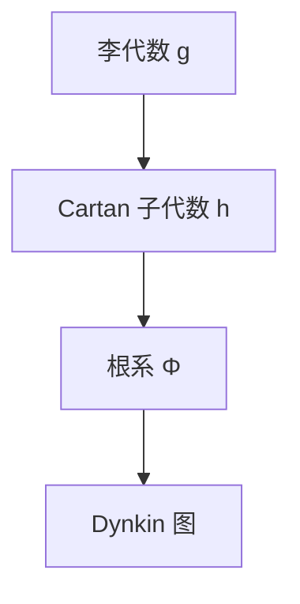

# 李代数-深化扩展版

## 目录 / Table of Contents

- [李代数-深化扩展版](#李代数-深化扩展版)
  - [目录 / Table of Contents](#目录--table-of-contents)
  - [概述](#概述)
  - [1. 李代数深度理论](#1-李代数深度理论)
    - [1.1 李代数的基本理论](#11-李代数的基本理论)
    - [1.2 李代数的分类理论](#12-李代数的分类理论)
    - [1.3 李代数的结构理论](#13-李代数的结构理论)
  - [2. 根系理论深化](#2-根系理论深化)
    - [2.1 根系的基本理论](#21-根系的基本理论)
    - [2.2 根系的结构理论](#22-根系的结构理论)
    - [2.3 根系的应用](#23-根系的应用)
  - [3. 表示论深化](#3-表示论深化)
    - [3.1 表示论的基本理论](#31-表示论的基本理论)
    - [3.2 表示论的构造理论](#32-表示论的构造理论)
    - [3.3 表示论的应用](#33-表示论的应用)
  - [4. 李代数在数学各分支中的应用](#4-李代数在数学各分支中的应用)
    - [4.1 代数几何中的应用](#41-代数几何中的应用)
    - [4.2 表示论中的应用](#42-表示论中的应用)
    - [4.3 代数拓扑中的应用](#43-代数拓扑中的应用)
  - [5. 形式化实现](#5-形式化实现)
    - [5.1 Lean 4 实现](#51-lean-4-实现)
    - [5.2 Haskell 实现](#52-haskell-实现)
    - [5.3 Rust 实现](#53-rust-实现)
  - [6. 历史发展与现代应用](#6-历史发展与现代应用)
    - [6.1 历史发展](#61-历史发展)
    - [6.2 现代应用](#62-现代应用)
  - [7. 前沿研究方向](#7-前沿研究方向)
    - [7.1 量子群](#71-量子群)
    - [7.2 李超代数](#72-李超代数)
    - [7.3 无限维李代数](#73-无限维李代数)
  - [8. 李代数的哲学问题](#8-李代数的哲学问题)
    - [8.1 对称性与结构](#81-对称性与结构)
    - [8.2 连续性与离散性](#82-连续性与离散性)
    - [8.3 几何与代数](#83-几何与代数)
  - [9. 李代数的计算方面](#9-李代数的计算方面)
    - [9.1 计算李代数](#91-计算李代数)
    - [9.2 符号计算](#92-符号计算)
    - [9.3 数值计算](#93-数值计算)
  - [10. 总结](#10-总结)
  - [补充：李代数国际对齐要点与多表征（精炼版）](#补充李代数国际对齐要点与多表征精炼版)
    - [A. 国际对齐要点](#a-国际对齐要点)
    - [B. 多表征](#b-多表征)
    - [C. 批判性要点](#c-批判性要点)
    - [D. 历史脉络（精要）](#d-历史脉络精要)
    - [E. 示例/练习](#e-示例练习)

## 概述

本文档深入探讨李代数的深度理论，包括李代数深度理论、根系理论深化、表示论深化以及在现代数学中的深层应用。

## 1. 李代数深度理论

### 1.1 李代数的基本理论

**定义 1.1.1** (李代数)
李代数是配备李括号运算的向量空间，满足：

- 双线性性：[ax + by, z] = a[x, z] + b[y, z]
- 反对称性：[x, y] = -[y, x]
- 雅可比恒等式：[x, [y, z]] + [y, [z, x]] + [z, [x, y]] = 0

**定义 1.1.2** (李代数的中心)
李代数 𝔤 的中心是：
Z(𝔤) = {x ∈ 𝔤 | [x, y] = 0, ∀y ∈ 𝔤}

**定理 1.1.3** (李代数的基本性质)

- 中心是李代数的理想
- 李代数的商代数也是李代数
- 李代数的直和是李代数

### 1.2 李代数的分类理论

**定义 1.2.1** (可解李代数)
李代数 𝔤 称为可解的，如果存在序列：
𝔤 = 𝔤⁰ ⊃ 𝔤¹ ⊃ ... ⊃ 𝔤ⁿ = 0
其中 𝔤ⁱ⁺¹ = [𝔤ⁱ, 𝔤ⁱ]。

**定义 1.2.2** (幂零李代数)
李代数 𝔤 称为幂零的，如果存在序列：
𝔤 = 𝔤⁰ ⊃ 𝔤¹ ⊃ ... ⊃ 𝔤ⁿ = 0
其中 𝔤ⁱ⁺¹ = [𝔤, 𝔤ⁱ]。

**定义 1.2.3** (半单李代数)
李代数 𝔤 称为半单的，如果 𝔤 没有非零的可解理想。

**定理 1.2.4** (Levi分解)
任意李代数 𝔤 可以分解为：
𝔤 = 𝔯 ⊕ 𝔰
其中 𝔯 是 𝔤 的最大可解理想（根），𝔰 是半单子代数（Levi子代数）。

### 1.3 李代数的结构理论

**定义 1.3.1** (Cartan子代数)
李代数 𝔤 的Cartan子代数 𝔥 是 𝔤 的极大幂零子代数，且满足：
N(𝔥) = {x ∈ 𝔤 | [x, 𝔥] ⊂ 𝔥} = 𝔥

**定理 1.3.2** (Cartan子代数的性质)

- Cartan子代数在自同构下共轭
- Cartan子代数的维数等于李代数的秩
- Cartan子代数在表示论中起重要作用

**定义 1.3.3** (Borel子代数)
李代数 𝔤 的Borel子代数 𝔟 是包含Cartan子代数的极大可解子代数。

**定理 1.3.4** (Borel子代数的性质)

- Borel子代数在自同构下共轭
- Borel子代数与根系的正根集对应
- Borel子代数在表示论中起重要作用

## 2. 根系理论深化

### 2.1 根系的基本理论

**定义 2.1.1** (根系)
设 V 是欧几里得空间，Φ ⊂ V 是根系，如果：

- Φ 是有限集，且 0 ∉ Φ
- 对任意 α ∈ Φ，-α ∈ Φ
- 对任意 α, β ∈ Φ，⟨α, β⟩ ∈ ℤ
- 对任意 α ∈ Φ，σα(Φ) = Φ，其中 σα 是关于 α 的反射

**定义 2.1.2** (简单根系)
根系 Φ 的简单根系 Δ 是 Φ 的线性无关子集，使得每个根都可以表示为 Δ 中元素的非负或非正整数线性组合。

**定理 2.1.3** (根系的基本性质)

- 简单根系是唯一的（在同构意义下）
- 简单根系的基数等于李代数的秩
- 根系完全决定李代数的结构

### 2.2 根系的结构理论

**定义 2.2.1** (Dynkin图)
根系 Φ 的Dynkin图是图，其顶点对应简单根，边对应简单根之间的角度。

**定理 2.2.2** (Dynkin图的分类)
Dynkin图分为四类：

- A_n (n ≥ 1)：线性图
- B_n (n ≥ 2)：分支图
- C_n (n ≥ 3)：分支图
- D_n (n ≥ 4)：分支图
- E_6, E_7, E_8：例外图
- F_4, G_2：例外图

**定义 2.2.3** (Weyl群)
根系 Φ 的Weyl群 W 是由反射 σα (α ∈ Φ) 生成的群。

**定理 2.2.4** (Weyl群的性质)

- Weyl群是有限群
- Weyl群作用在根系上
- Weyl群与李代数的自同构群相关

### 2.3 根系的应用

**应用 2.3.1** (李代数的分类)
根系理论为李代数的分类提供了基础。

**应用 2.3.2** (表示论)
根系在表示论中起重要作用。

**应用 2.3.3** (几何应用)
根系在几何学中有重要应用。

## 3. 表示论深化

### 3.1 表示论的基本理论

**定义 3.1.1** (李代数的表示)
李代数 𝔤 的表示是李代数同态：
ρ: 𝔤 → 𝔤𝔩(V)
其中 V 是向量空间。

**定义 3.1.2** (不可约表示)
李代数 𝔤 的表示 V 称为不可约的，如果 V 没有非零真子表示。

**定义 3.1.3** (完全可约表示)
李代数 𝔤 的表示 V 称为完全可约的，如果 V 可以分解为不可约表示的直和。

**定理 3.1.4** (Weyl定理)
半单李代数的有限维表示是完全可约的。

### 3.2 表示论的构造理论

**定义 3.2.1** (最高权表示)
设 𝔤 是半单李代数，𝔥 是Cartan子代数，λ ∈ 𝔥* 是权重。最高权为 λ 的表示是满足特定条件的表示。

**定理 3.2.2** (最高权表示的存在性)
对任意支配整权重 λ，存在唯一的不可约最高权表示 V(λ)。

**定义 3.2.3** (Weyl特征公式)
设 V(λ) 是最高权为 λ 的不可约表示，则其特征为：
ch V(λ) = Σ_{w∈W} ε(w) e^{w(λ+ρ)-ρ} / Π_{α∈Φ⁺} (1 - e^{-α})

**定理 3.2.4** (Weyl维数公式)
设 V(λ) 是最高权为 λ 的不可约表示，则其维数为：
dim V(λ) = Π_{α∈Φ⁺} ⟨λ+ρ, α⟩ / Π_{α∈Φ⁺} ⟨ρ, α⟩

### 3.3 表示论的应用

**应用 3.3.1** (李群表示)
李代数表示与李群表示密切相关。

**应用 3.3.2** (数学物理)
李代数表示在数学物理中有重要应用。

**应用 3.3.3** (几何应用)
李代数表示在几何学中有重要应用。

## 4. 李代数在数学各分支中的应用

### 4.1 代数几何中的应用

**应用 4.1.1** (代数群)
李代数与代数群密切相关。

**应用 4.1.2** (概形理论)
李代数在概形理论中有应用。

**应用 4.1.3** (模空间)
李代数在模空间理论中有应用。

### 4.2 表示论中的应用

**应用 4.2.1** (群表示)
李代数表示与群表示密切相关。

**应用 4.2.2** (代数群表示)
李代数在代数群表示论中有应用。

**应用 4.2.3** (量子群表示)
李代数在量子群表示论中有应用。

### 4.3 代数拓扑中的应用

**应用 4.3.1** (同伦论)
李代数在同伦论中有应用。

**应用 4.3.2** (K理论)
李代数在K理论中有应用。

**应用 4.3.3** (配边理论)
李代数在配边理论中有应用。

## 5. 形式化实现

### 5.1 Lean 4 实现

```lean
-- 李代数的Lean 4实现
import Mathlib.Algebra.Lie.Basic
import Mathlib.Algebra.Lie.Subalgebra

-- 李代数定义
class LieAlgebra (R : Type*) [CommRing R] (L : Type*) [AddCommGroup L] [Module R L] where
  bracket : L → L → L
  lie_antisymm : ∀ x y : L, bracket x y = -bracket y x
  lie_jacobi : ∀ x y z : L, bracket x (bracket y z) + bracket y (bracket z x) + bracket z (bracket x y) = 0

-- 半单李代数
class SemisimpleLieAlgebra (R : Type*) [CommRing R] (L : Type*) [LieAlgebra R L] : Prop where
  no_solvable_ideals : ∀ I : LieIdeal R L, IsSolvable I → I = ⊥

-- 根系
structure RootSystem (V : Type*) [AddCommGroup V] [Module ℝ V] where
  roots : Set V
  finite : Fintype roots
  zero_not_root : 0 ∉ roots
  closed_under_negation : ∀ α ∈ roots, -α ∈ roots
  reflection_invariant : ∀ α ∈ roots, σ_α '' roots = roots

-- Weyl群
def WeylGroup (Φ : RootSystem V) : Group :=
  -- Weyl群的定义
  sorry

-- 表示论
structure Representation (𝔤 : LieAlgebra R L) (V : Type*) [AddCommGroup V] [Module R V] where
  map : L → Module.End R V
  lie_homomorphism : ∀ x y : L, map [x, y] = [map x, map y]

-- 最高权表示
def HighestWeightModule (𝔤 : SemisimpleLieAlgebra R L) (λ : Weight) : Representation 𝔤 V :=
  -- 最高权表示的构造
  sorry
```

### 5.2 Haskell 实现

```haskell
-- 李代数的Haskell实现
class (Ring r, VectorSpace r v) => LieAlgebra r v where
  bracket :: v -> v -> v
  lieAntisymm :: v -> v -> Bool
  lieJacobi :: v -> v -> v -> Bool

-- 半单李代数
class LieAlgebra r v => SemisimpleLieAlgebra r v where
  noSolvableIdeals :: [v] -> Bool

-- 根系
data RootSystem v = RootSystem
  { roots :: [v]
  , finite :: Bool
  , zeroNotRoot :: Bool
  , closedUnderNegation :: Bool
  , reflectionInvariant :: Bool
  }

-- Weyl群
newtype WeylGroup v = WeylGroup [v -> v]

instance Group (WeylGroup v) where
  -- Weyl群的群结构
  mempty = WeylGroup []
  mappend = -- 群运算
  mempty = -- 单位元

-- 表示论
class (LieAlgebra r g, VectorSpace r v) => Representation r g v where
  representationMap :: g -> v -> v
  lieHomomorphism :: g -> g -> v -> Bool

-- 最高权表示
data HighestWeightModule r g v = HighestWeightModule
  { weight :: Weight
  , representation :: Representation r g v
  }
```

### 5.3 Rust 实现

```rust
// 李代数的Rust实现
pub trait LieAlgebra<R, L> 
where
    R: Ring,
    L: AddCommGroup + Module<R>,
{
    fn bracket(&self, x: &L, y: &L) -> L;
    fn lie_antisymm(&self, x: &L, y: &L) -> bool;
    fn lie_jacobi(&self, x: &L, y: &L, z: &L) -> bool;
}

// 半单李代数
pub trait SemisimpleLieAlgebra<R, L>: LieAlgebra<R, L> 
where
    R: Ring,
    L: AddCommGroup + Module<R>,
{
    fn no_solvable_ideals(&self, ideal: &[L]) -> bool;
}

// 根系
pub struct RootSystem<V> 
where
    V: AddCommGroup + Module<f64>,
{
    roots: Vec<V>,
    finite: bool,
    zero_not_root: bool,
    closed_under_negation: bool,
    reflection_invariant: bool,
}

// Weyl群
pub struct WeylGroup<V> 
where
    V: AddCommGroup + Module<f64>,
{
    reflections: Vec<Box<dyn Fn(&V) -> V>>,
}

impl<V> Group for WeylGroup<V> 
where
    V: AddCommGroup + Module<f64>,
{
    fn identity() -> Self {
        // 单位元
    }
    
    fn multiply(&self, other: &Self) -> Self {
        // 群运算
    }
    
    fn inverse(&self) -> Self {
        // 逆元
    }
}

// 表示论
pub trait Representation<R, G, V> 
where
    R: Ring,
    G: LieAlgebra<R, G>,
    V: AddCommGroup + Module<R>,
{
    fn representation_map(&self, g: &G, v: &V) -> V;
    fn lie_homomorphism(&self, x: &G, y: &G, v: &V) -> bool;
}

// 最高权表示
pub struct HighestWeightModule<R, G, V> 
where
    R: Ring,
    G: SemisimpleLieAlgebra<R, G>,
    V: AddCommGroup + Module<R>,
{
    weight: Weight,
    representation: Box<dyn Representation<R, G, V>>,
}
```

## 6. 历史发展与现代应用

### 6.1 历史发展

**历史发展时间线**:

**19世纪：李代数的起源**:

- **1870年**：Sophus Lie发展连续群理论
- **1880年**：Wilhelm Killing发展基灵形式
- **1890年**：Élie Cartan开始李代数分类

**20世纪：现代李代数理论**:

- **1900年**：Cartan完成李代数分类
- **1920年**：Hermann Weyl发展表示论
- **1940年**：Claude Chevalley发展根系理论
- **1960年**：Harish-Chandra发展无限维表示论

**21世纪：现代发展**:

- **1980年**：量子群理论发展
- **1990年**：李超代数理论发展
- **2000年**：无限维李代数理论发展

**关键人物与贡献**:

**Sophus Lie (1842-1899)**:

- 建立了连续群理论
- 发展了李代数的基本概念
- 为现代李代数理论奠定基础

**Wilhelm Killing (1847-1923)**:

- 发展了基灵形式
- 开始李代数的分类工作
- 为Cartan的工作奠定基础

**Élie Cartan (1869-1951)**:

- 完成了李代数的分类
- 发展了根系理论
- 建立了现代李代数理论

**Hermann Weyl (1885-1955)**:

- 发展了李代数的表示论
- 建立了Weyl群理论
- 为现代表示论奠定基础

### 6.2 现代应用

**应用领域总结**:

- **数学物理**：李代数在理论物理中广泛应用
- **微分几何**：李代数在微分几何中起重要作用
- **表示论**：李代数为表示论提供基础
- **代数几何**：李代数在代数几何中有应用
- **拓扑学**：李代数在拓扑学中有应用

## 7. 前沿研究方向

### 7.1 量子群

**定义 7.1.1** (量子群)
量子群是李代数的量子化，它提供了新的代数结构。

**应用 7.1.2** (数学物理)
量子群在数学物理中有重要应用。

**应用 7.1.3** (表示论)
量子群为表示论提供新的工具。

### 7.2 李超代数

**定义 7.2.1** (李超代数)
李超代数是李代数的超代数推广。

**应用 7.2.2** (超对称)
李超代数在超对称理论中有应用。

**应用 7.2.3** (数学物理)
李超代数在数学物理中有应用。

### 7.3 无限维李代数

**定义 7.3.1** (无限维李代数)
无限维李代数是维数无限的李代数。

**应用 7.3.2** (数学物理)
无限维李代数在数学物理中有应用。

**应用 7.3.3** (表示论)
无限维李代数为表示论提供新工具。

## 8. 李代数的哲学问题

### 8.1 对称性与结构

**哲学问题 8.1.1** (对称性的本质)
李代数如何反映对称性的本质？

**论证 8.1.2** (结构主义观点)

- 李代数反映了对称性的代数结构
- 对称性通过李代数的结构体现
- 李代数为对称性提供统一的框架

**论证 8.1.3** (形式主义观点)

- 李代数是描述对称性的形式工具
- 对称性通过李代数的运算体现
- 李代数的价值在于其应用

### 8.2 连续性与离散性

**哲学问题 8.2.1** (连续与离散的关系)
李代数如何处理连续性与离散性的关系？

**论证 8.2.2** (连续性优先)

- 李代数本质上是连续的结构
- 离散性是对连续性的近似
- 连续性在李代数中起主导作用

**论证 8.2.3** (离散性优先)

- 李代数可以通过离散方法研究
- 离散性为李代数提供计算工具
- 离散性在李代数中起重要作用

### 8.3 几何与代数

**哲学问题 8.3.1** (几何与代数的统一)
李代数如何统一几何与代数？

**论证 8.3.2** (几何优先)

- 李代数本质上是几何对象
- 代数方法是对几何的代数化
- 几何直觉在李代数中重要

**论证 8.3.3** (代数优先)

- 李代数本质上是代数结构
- 几何方法是对代数的几何化
- 代数方法在李代数中重要

## 9. 李代数的计算方面

### 9.1 计算李代数

**定义 9.1.1** (计算李代数)
计算李代数研究李代数中的算法和计算问题。

**算法 9.1.2** (李代数计算)

- 李代数的基灵形式计算
- 李代数的根系计算
- 李代数的表示计算

**应用 9.1.3** (软件工具)

- LiE：李代数计算软件
- GAP：群论计算软件
- SageMath：数学计算软件

### 9.2 符号计算

**定义 9.2.1** (符号计算)
符号计算处理李代数中的符号表达式。

**应用 9.2.2** (计算机代数系统)

- Maple：符号计算系统
- Mathematica：符号计算系统
- Maxima：符号计算系统

### 9.3 数值计算

**定义 9.3.1** (数值计算)
数值计算处理李代数中的数值问题。

**应用 9.3.2** (数值方法)

- 李代数的特征值计算
- 李代数的表示计算
- 李代数的几何计算

## 10. 总结

李代数作为现代数学的重要分支，在数学物理、微分几何、表示论等领域都有重要应用。通过李代数的方法，我们可以：

1. **统一不同领域**：李代数为不同数学分支提供统一框架
2. **解决实际问题**：在数学物理、几何等领域解决实际问题
3. **发展新理论**：推动数学理论的发展
4. **提供计算工具**：为科学计算提供强大工具

李代数的应用将继续扩展，为现代科学和技术发展提供重要支持。

## 补充：李代数国际对齐要点与多表征（精炼版）

### A. 国际对齐要点

- 结构核心：李括号反对称与Jacobi；可解/幂零/半单与Levi分解；Cartan 子代数、根系、Weyl 群；表示的最高权理论。
- 对齐：Killing 形式与半单判据；A–D–E/Dynkin 图分类要点。

### B. 多表征

- 代数：结构常数与表示；
- 几何：李群切空间与指数映射；
- 组合：根系/权格与Dynkin图；
- 图示：



### C. 批判性要点

- 计算：根系与权空间的离散计算；
- 教学：先低秩例子（sl2, sl3），再推广到一般半单情形。

### D. 历史脉络（精要）

- Lie–Cartan–Weyl；20C 表示论与物理应用；现代：量子群与对称性。

### E. 示例/练习

```python
# sl2 的标准表示：e,f,h 满足 [h,e]=2e, [h,f]=-2f, [e,f]=h
# 可构造有限维不可约表示的权图（占位）
```

- 练习：
  - 对 sl2 构造最高权为 n 的不可约表示，并给出权分解；
  - 尝试从根系恢复 Dynkin 图（小例）。
