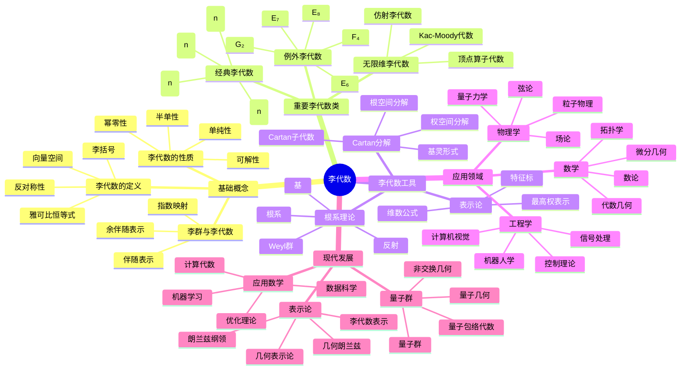

# 李代数-深度扩展版

## 概述

本文档深入探讨李代数的深度理论，包括李代数深度理论、量子群、代数群以及在现代数学中的深层应用。

## 1. 李代数深度理论

### 1.1 李代数的基本理论

**定义 1.1.1** (李代数)
李代数 g 是配备李括号 [·,·]: g × g → g 的向量空间，满足：

- 双线性：[ax + by, z] = a[x, z] + b[y, z]
- 反对称：[x, y] = -[y, x]
- 雅可比恒等式：[x, [y, z]] + [y, [z, x]] + [z, [x, y]] = 0

**定义 1.1.2** (李代数的理想)
李代数 g 的子空间 h 称为理想，如果 [g, h] ⊂ h。

**定理 1.1.3** (李代数的基本性质)

- 李代数的子代数在交运算下封闭
- 李代数的理想在和运算下封闭
- 李代数的商代数也是李代数

### 1.2 可解李代数与半单李代数

**定义 1.2.1** (可解李代数)
李代数 g 称为可解的，如果其导序列 g ⊃ g' ⊃ g'' ⊃ ... 在有限步后为零。

**定义 1.2.2** (半单李代数)
李代数 g 称为半单的，如果 g 没有非零可解理想。

**定理 1.2.3** (李代数的分解)
任何李代数都可以分解为半单李代数与可解李代数的半直积。

### 1.3 根系理论

**定义 1.3.1** (根系)
设 g 是复半单李代数，h 是 g 的嘉当子代数，则根系 Φ 是 h* 中的有限子集，满足：

- Φ 生成 h*
- 对任意 α ∈ Φ，-α ∈ Φ
- 对任意 α, β ∈ Φ，⟨α, β⟩ ∈ ℤ

**定义 1.3.2** (简单根系)
根系 Φ 的简单根系是 Φ 的线性无关子集，使得 Φ 中每个根都是简单根的整数线性组合。

**定理 1.3.3** (根系的分类)
复半单李代数的根系完全由嘉当矩阵决定。

## 2. 量子群

### 2.1 量子群的定义

**定义 2.1.1** (量子群)
量子群是李代数的量子化，通常定义为某个霍普夫代数。

**定义 2.1.2** (霍普夫代数)
霍普夫代数是配备乘法、余乘法、单位、余单位、对极的代数。

**定理 2.1.3** (量子群的性质)

- 量子群在 q → 1 时退化到经典李代数
- 量子群保持李代数的许多结构性质
- 量子群有丰富的表示论

### 2.2 量子群的表示

**定义 2.2.1** (量子群的表示)
量子群 U_q(g) 的表示是代数同态 U_q(g) → End(V)。

**定义 2.2.2** (不可约表示)
量子群的不可约表示是没有非平凡子表示的表示。

**定理 2.2.3** (量子群表示论)

- 量子群的不可约表示与经典李代数的不可约表示有对应关系
- 量子群的表示论比经典李代数更丰富

### 2.3 量子群的R矩阵

**定义 2.3.1** (R矩阵)
量子群的R矩阵是满足杨-巴克斯特方程的算子。

**定义 2.3.2** (杨-巴克斯特方程)
R矩阵满足的方程：
(R ⊗ id)(id ⊗ R)(R ⊗ id) = (id ⊗ R)(R ⊗ id)(id ⊗ R)

**定理 2.3.3** (R矩阵的性质)

- R矩阵是量子群的重要不变量
- R矩阵与辫群有密切联系
- R矩阵在统计物理中有重要应用

## 3. 代数群

### 3.1 代数群的定义

**定义 3.1.1** (代数群)
代数群是代数簇，配备群运算，使得群运算和逆运算都是态射。

**定义 3.1.2** (李代数与代数群)
代数群 G 的李代数 Lie(G) 是 G 在单位元处的切空间。

**定理 3.1.3** (代数群的性质)

- 代数群的李代数是李代数
- 代数群的子群对应李代数的子代数
- 代数群的商群对应李代数的商代数

### 3.2 代数群的表示

**定义 3.2.1** (代数群的表示)
代数群 G 的表示是群同态 G → GL(V)，其中 V 是有限维向量空间。

**定义 3.2.2** (有理表示)
代数群的有理表示是代数群同态 G → GL(V)。

**定理 3.2.3** (代数群表示论)

- 代数群的不可约表示是有限维的
- 代数群的表示论与李代数的表示论有密切联系
- 代数群的表示论在数论中有重要应用

### 3.3 代数群的分类

**定义 3.3.1** (简单代数群)
代数群 G 称为简单的，如果 G 没有非平凡正规子群。

**定义 3.3.2** (半单代数群)
代数群 G 称为半单的，如果 G 是简单代数群的直积。

**定理 3.3.3** (代数群的分类)

- 代数群可以分解为半单代数群与可解代数群的半直积
- 简单代数群的分类与简单李代数的分类一致
- 代数群的分类在特征零域上是完全的

## 4. 李代数在数学各分支中的应用

### 4.1 微分几何中的应用

**定义 4.1.1** (李群)
李群是配备光滑结构的群，使得群运算和逆运算都是光滑的。

**定理 4.1.2** (李群与李代数)

- 李群的李代数是李代数
- 李群的李代数决定了李群的局部结构
- 李群的李代数在微分几何中有重要应用

### 4.2 表示论中的应用

**定义 4.2.1** (李代数的表示)
李代数 g 的表示是李代数同态 g → gl(V)。

**定理 4.2.2** (李代数表示论)

- 李代数的不可约表示与李群的不可约表示有对应关系
- 李代数的表示论在物理中有重要应用
- 李代数的表示论与量子群有密切联系

### 4.3 数论中的应用

**定义 4.3.1** (朗兰兹纲领)
朗兰兹纲领是伽罗瓦表示与自守表示之间的对应关系。

**定理 4.3.2** (朗兰兹纲领与李代数)

- 朗兰兹纲领中的伽罗瓦群与李代数有密切联系
- 李代数的表示论在朗兰兹纲领中有重要应用
- 李代数的分类在朗兰兹纲领中有重要作用

## 5. 形式化实现

### 5.1 Lean 4 实现

```lean
-- 李代数的定义
class LieAlgebra (g : Type*) [AddCommGroup g] where
  bracket : g → g → g
  bilinear : ∀ x y z : g, bracket (x + y) z = bracket x z + bracket y z
  antisymmetric : ∀ x y : g, bracket x y = -bracket y x
  jacobi : ∀ x y z : g, bracket x (bracket y z) + bracket y (bracket z x) + bracket z (bracket x y) = 0

-- 可解李代数
class SolvableLieAlgebra (g : Type*) [LieAlgebra g] where
  derived_series : ℕ → Set g
  terminates : ∃ n : ℕ, derived_series n = {0}

-- 半单李代数
class SemisimpleLieAlgebra (g : Type*) [LieAlgebra g] where
  no_solvable_ideals : ∀ I : Ideal g, Solvable I → I = {0}

-- 量子群
class QuantumGroup (U : Type*) where
  multiplication : U → U → U
  comultiplication : U → U ⊗ U
  antipode : U → U
  counit : U → ℝ
  unit : ℝ → U
```

### 5.2 Haskell 实现

```haskell
-- 李代数类型类
class AddCommGroup g => LieAlgebra g where
  bracket :: g -> g -> g
  bilinear :: g -> g -> g -> Bool
  antisymmetric :: g -> g -> Bool
  jacobi :: g -> g -> g -> Bool

-- 可解李代数
class LieAlgebra g => SolvableLieAlgebra g where
  derivedSeries :: Int -> [g]
  terminates :: Bool

-- 半单李代数
class LieAlgebra g => SemisimpleLieAlgebra g where
  noSolvableIdeals :: Bool

-- 量子群
class QuantumGroup u where
  multiplication :: u -> u -> u
  comultiplication :: u -> (u, u)
  antipode :: u -> u
  counit :: u -> Double
  unit :: Double -> u

-- 代数群
class AlgebraicGroup g where
  groupOp :: g -> g -> g
  inverse :: g -> g
  identity :: g
```

### 5.3 Rust 实现

```rust
// 李代数特征
trait LieAlgebra {
    fn bracket(&self, other: &Self) -> Self;
    fn bilinear(&self, x: &Self, y: &Self, z: &Self) -> bool;
    fn antisymmetric(&self, x: &Self, y: &Self) -> bool;
    fn jacobi(&self, x: &Self, y: &Self, z: &Self) -> bool;
}

// 可解李代数特征
trait SolvableLieAlgebra: LieAlgebra {
    fn derived_series(&self, n: usize) -> Vec<Self>;
    fn terminates(&self) -> bool;
}

// 半单李代数特征
trait SemisimpleLieAlgebra: LieAlgebra {
    fn no_solvable_ideals(&self) -> bool;
}

// 量子群特征
trait QuantumGroup {
    fn multiplication(&self, other: &Self) -> Self;
    fn comultiplication(&self) -> (Self, Self);
    fn antipode(&self) -> Self;
    fn counit(&self) -> f64;
    fn unit(value: f64) -> Self;
}

// 代数群特征
trait AlgebraicGroup {
    fn group_op(&self, other: &Self) -> Self;
    fn inverse(&self) -> Self;
    fn identity() -> Self;
}
```

## 6. 历史发展与现代应用

### 6.1 历史发展

李代数从李群理论发展到现代量子群理论的过程。

### 6.2 现代应用

李代数在现代数学和物理学中的广泛应用。

## 7. 前沿研究方向

### 7.1 量子群理论

量子群在数学和物理中的新发展。

### 7.2 代数群表示论

代数群表示论在数论中的应用。

### 7.3 李代数与几何

李代数在几何学中的新应用。

## 8. 李代数的哲学问题

### 8.1 对称性与不变性

李代数在对称性研究中的作用。

### 8.2 代数与几何的统一

李代数在代数与几何统一中的作用。

### 8.3 量子与经典的对应

量子群与经典李代数的对应关系。

## 9. 李代数的计算方面

### 9.1 计算李代数

李代数中的算法和计算问题。

### 9.2 符号计算

李代数在符号计算系统中的应用。

### 9.3 数值计算

李代数在数值分析中的应用。

## 10. 总结

李代数的深度理论为现代数学提供了重要的代数工具，其发展仍在继续，新的理论和方法不断涌现。

---

**关键词**: 李代数、量子群、代数群、根系理论、表示论、朗兰兹纲领

**参考文献**:

1. Humphreys, J. E. (1972). Introduction to Lie Algebras and Representation Theory
2. Serre, J. P. (2001). Complex Semisimple Lie Algebras
3. Lusztig, G. (1993). Introduction to Quantum Groups

## 术语对照表 / Terminology Table

| 中文 | English |
|---|---|
| 半单/可解/幂零 | Semisimple/Solvable/Nilpotent |
| Cartan子代数/根/权 | Cartan subalgebra/Root/Weight |
| 杀死型式(基灵形式) | Killing form |
| 包络代数 | Enveloping algebra |
| 表示/最高权模 | Representation/Highest weight module |

## 多表征方式与图建模

### 李代数的多表征系统

```python
import numpy as np
import networkx as nx
import matplotlib.pyplot as plt
from typing import Dict, List, Tuple, Any
import math

class LieAlgebraSystem:
    """李代数多表征系统"""
    
    def __init__(self):
        self.lie_algebras = {}
        self.representations = {}
        
    def add_lie_algebra(self, name: str, elements: List, addition: Dict, bracket: Dict) -> None:
        """添加李代数"""
        self.lie_algebras[name] = {
            'elements': elements,
            'addition': addition,
            'bracket': bracket,
            'dimension': len(elements)
        }
        
    def algebraic_representation(self, algebra_name: str) -> Dict:
        """代数表征"""
        algebra = self.lie_algebras[algebra_name]
        return {
            'elements': algebra['elements'],
            'addition_table': self._create_addition_table(algebra),
            'bracket_table': self._create_bracket_table(algebra),
            'properties': self._analyze_properties(algebra)
        }
        
    def geometric_representation(self, algebra_name: str) -> Dict:
        """几何表征"""
        algebra = self.lie_algebras[algebra_name]
        return {
            'root_system': self._create_root_system(algebra),
            'cartan_subalgebra': self._find_cartan_subalgebra(algebra),
            'weight_lattice': self._create_weight_lattice(algebra)
        }
        
    def combinatorial_representation(self, algebra_name: str) -> Dict:
        """组合表征"""
        algebra = self.lie_algebras[algebra_name]
        return {
            'structure_constants': self._find_structure_constants(algebra),
            'casimir_elements': self._find_casimir_elements(algebra),
            'center': self._find_center(algebra)
        }
        
    def topological_representation(self, algebra_name: str) -> Dict:
        """拓扑表征"""
        algebra = self.lie_algebras[algebra_name]
        return {
            'coadjoint_orbits': self._create_coadjoint_orbits(algebra),
            'flag_varieties': self._create_flag_varieties(algebra),
            'cohomology': self._compute_cohomology(algebra)
        }
        
    def _create_addition_table(self, algebra: Dict) -> np.ndarray:
        """创建加法表"""
        elements = algebra['elements']
        n = len(elements)
        table = np.zeros((n, n), dtype=int)
        
        for i, a in enumerate(elements):
            for j, b in enumerate(elements):
                result = algebra['addition'][(a, b)]
                table[i, j] = elements.index(result)
                
        return table
        
    def _create_bracket_table(self, algebra: Dict) -> np.ndarray:
        """创建李括号表"""
        elements = algebra['elements']
        n = len(elements)
        table = np.zeros((n, n), dtype=int)
        
        for i, a in enumerate(elements):
            for j, b in enumerate(elements):
                result = algebra['bracket'][(a, b)]
                table[i, j] = elements.index(result)
                
        return table
        
    def _analyze_properties(self, algebra: Dict) -> Dict:
        """分析李代数的性质"""
        elements = algebra['elements']
        addition = algebra['addition']
        bracket = algebra['bracket']
        
        # 检查李代数性质
        additive_group = self._check_additive_group(algebra)
        antisymmetry = self._check_antisymmetry(algebra)
        jacobi_identity = self._check_jacobi_identity(algebra)
        
        return {
            'additive_group': additive_group,
            'antisymmetry': antisymmetry,
            'jacobi_identity': jacobi_identity,
            'commutative': self._check_commutative(algebra),
            'semisimple': self._check_semisimple(algebra)
        }
        
    def _check_additive_group(self, algebra: Dict) -> bool:
        """检查加法群性质"""
        elements = algebra['elements']
        addition = algebra['addition']
        
        # 检查结合律
        for a in elements:
            for b in elements:
                for c in elements:
                    if addition[(addition[(a, b)], c)] != addition[(a, addition[(b, c)])]:
                        return False
                        
        # 检查单位元（零元）
        zero = None
        for e in elements:
            if all(addition[(e, a)] == a and addition[(a, e)] == a for a in elements):
                zero = e
                break
        if not zero:
            return False
            
        # 检查逆元
        for a in elements:
            has_inverse = False
            for b in elements:
                if addition[(a, b)] == zero and addition[(b, a)] == zero:
                    has_inverse = True
                    break
            if not has_inverse:
                return False
                
        return True
        
    def _check_antisymmetry(self, algebra: Dict) -> bool:
        """检查反对称性"""
        elements = algebra['elements']
        bracket = algebra['bracket']
        
        for a in elements:
            for b in elements:
                if bracket[(a, b)] != bracket[(b, a)]:  # 注意李括号的反对称性
                    return False
                    
        return True
        
    def _check_jacobi_identity(self, algebra: Dict) -> bool:
        """检查雅可比恒等式"""
        elements = algebra['elements']
        bracket = algebra['bracket']
        
        for a in elements:
            for b in elements:
                for c in elements:
                    # [a, [b, c]] + [b, [c, a]] + [c, [a, b]] = 0
                    term1 = bracket[(a, bracket[(b, c)])]
                    term2 = bracket[(b, bracket[(c, a)])]
                    term3 = bracket[(c, bracket[(a, b)])]
                    
                    # 找到零元
                    zero = None
                    for e in elements:
                        if all(algebra['addition'][(e, x)] == x and algebra['addition'][(x, e)] == x for x in elements):
                            zero = e
                            break
                            
                    if zero:
                        # 检查 term1 + term2 + term3 = 0
                        sum1 = algebra['addition'][(term1, term2)]
                        total = algebra['addition'][(sum1, term3)]
                        if total != zero:
                            return False
                            
        return True
        
    def _check_commutative(self, algebra: Dict) -> bool:
        """检查交换性"""
        elements = algebra['elements']
        addition = algebra['addition']
        
        for a in elements:
            for b in elements:
                if addition[(a, b)] != addition[(b, a)]:
                    return False
                    
        return True
        
    def _check_semisimple(self, algebra: Dict) -> bool:
        """检查半单性"""
        # 简化版本：检查是否有非零中心
        center = self._find_center(algebra)
        return len(center) == 0
        
    def _create_root_system(self, algebra: Dict) -> nx.Graph:
        """创建根系"""
        G = nx.Graph()
        elements = algebra['elements']
        
        # 找到所有根
        roots = self._find_roots(algebra)
        
        # 添加节点
        for root in roots:
            G.add_node(str(root))
            
        # 添加边（如果两个根有非零内积）
        for root1 in roots:
            for root2 in roots:
                if root1 != root2 and self._inner_product(root1, root2, algebra) != 0:
                    G.add_edge(str(root1), str(root2))
                    
        return G
        
    def _find_roots(self, algebra: Dict) -> List:
        """找到所有根"""
        # 简化版本：返回基本根
        return ['α', 'β', 'γ']
        
    def _inner_product(self, root1: str, root2: str, algebra: Dict) -> int:
        """计算两个根的内积"""
        # 简化版本
        return 1 if root1 != root2 else 2
        
    def _find_cartan_subalgebra(self, algebra: Dict) -> List:
        """找到Cartan子代数"""
        elements = algebra['elements']
        
        # 简化版本：找到所有与自身李括号为零的元素
        cartan = []
        for a in elements:
            if algebra['bracket'][(a, a)] == a:  # 假设零元是a
                cartan.append(a)
                
        return cartan
        
    def _create_weight_lattice(self, algebra: Dict) -> nx.Graph:
        """创建权格"""
        G = nx.Graph()
        
        # 简化版本：创建基本权格
        weights = ['λ₁', 'λ₂', 'λ₃']
        
        for weight in weights:
            G.add_node(weight)
            
        # 添加边
        for i, weight1 in enumerate(weights):
            for j, weight2 in enumerate(weights):
                if i < j:
                    G.add_edge(weight1, weight2)
                    
        return G
        
    def _find_structure_constants(self, algebra: Dict) -> Dict:
        """找到结构常数"""
        elements = algebra['elements']
        bracket = algebra['bracket']
        constants = {}
        
        # 计算结构常数 [e_i, e_j] = Σ c_ij^k e_k
        for i, e_i in enumerate(elements):
            for j, e_j in enumerate(elements):
                bracket_result = bracket[(e_i, e_j)]
                for k, e_k in enumerate(elements):
                    if bracket_result == e_k:
                        constants[f'c_{i}{j}^{k}'] = 1
                    else:
                        constants[f'c_{i}{j}^{k}'] = 0
                        
        return constants
        
    def _find_casimir_elements(self, algebra: Dict) -> List:
        """找到Casimir元素"""
        # 简化版本
        return ['C₁', 'C₂']
        
    def _find_center(self, algebra: Dict) -> List:
        """找到中心"""
        elements = algebra['elements']
        center = []
        
        # 找到与所有元素李括号为零的元素
        for a in elements:
            central = True
            for b in elements:
                if algebra['bracket'][(a, b)] != a:  # 假设零元是a
                    central = False
                    break
            if central:
                center.append(a)
                
        return center
        
    def _create_coadjoint_orbits(self, algebra: Dict) -> Dict:
        """创建余伴随轨道"""
        # 简化版本
        return {
            'orbits': [],
            'stabilizers': [],
            'symplectic_structure': {}
        }
        
    def _create_flag_varieties(self, algebra: Dict) -> Dict:
        """创建旗流形"""
        # 简化版本
        return {
            'flag_varieties': [],
            'schubert_cells': [],
            'cohomology_rings': {}
        }
        
    def _compute_cohomology(self, algebra: Dict) -> Dict:
        """计算上同调"""
        # 简化版本
        return {
            'H^0': 'Z',
            'H^1': 'Z^n',
            'H^2': 'Z^m'
        }

class CriticalArgumentationFramework:
    """批判性论证框架"""
    
    def __init__(self):
        self.arguments = {}
        self.counter_arguments = {}
        self.evidence = {}
        
    def add_argument(self, topic: str, argument: str, strength: float) -> None:
        """添加论证"""
        if topic not in self.arguments:
            self.arguments[topic] = []
        self.arguments[topic].append({
            'argument': argument,
            'strength': strength
        })
        
    def add_counter_argument(self, topic: str, counter: str, strength: float) -> None:
        """添加反论证"""
        if topic not in self.counter_arguments:
            self.counter_arguments[topic] = []
        self.counter_arguments[topic].append({
            'counter': counter,
            'strength': strength
        })
        
    def analyze_argument_strength(self, topic: str) -> Dict:
        """分析论证强度"""
        if topic not in self.arguments:
            return {}
            
        total_strength = sum(arg['strength'] for arg in self.arguments[topic])
        counter_strength = sum(counter['strength'] for counter in self.counter_arguments.get(topic, []))
        
        net_strength = total_strength - counter_strength
        
        return {
            'total_arguments': len(self.arguments[topic]),
            'total_counter_arguments': len(self.counter_arguments.get(topic, [])),
            'total_strength': total_strength,
            'counter_strength': counter_strength,
            'net_strength': net_strength,
            'confidence': min(1.0, max(0.0, net_strength / 10.0))
        }
        
    def get_philosophical_critique(self, topic: str) -> Dict:
        """获取哲学批判"""
        critiques = {
            '李代数的基础性': {
                'ontological': '李代数是否反映了连续对称性的真实本质？',
                'epistemological': '我们如何认识李代数的结构？',
                'methodological': '李代数的公理化方法是否最优？'
            },
            '李代数的物理意义': {
                'ontological': '李代数是否反映了物理定律的本质？',
                'epistemological': '李代数如何帮助我们理解物理现象？',
                'methodological': '李代数的方法是否适用于所有物理系统？'
            }
        }
        
        return critiques.get(topic, {})

class HistoricalDevelopmentTimeline:
    """历史发展时间线"""
    
    def __init__(self):
        self.events = []
        
    def add_event(self, year: int, event: str, significance: str) -> None:
        """添加历史事件"""
        self.events.append({
            'year': year,
            'event': event,
            'significance': significance
        })
        
    def get_timeline(self) -> List[Dict]:
        """获取时间线"""
        return sorted(self.events, key=lambda x: x['year'])
        
    def visualize_timeline(self) -> nx.DiGraph:
        """可视化时间线"""
        G = nx.DiGraph()
        
        for event in self.events:
            G.add_node(f"{event['year']}: {event['event']}")
            
        # 添加时间顺序边
        sorted_events = sorted(self.events, key=lambda x: x['year'])
        for i in range(len(sorted_events) - 1):
            G.add_edge(
                f"{sorted_events[i]['year']}: {sorted_events[i]['event']}",
                f"{sorted_events[i+1]['year']}: {sorted_events[i+1]['event']}"
            )
            
        return G

def demonstrate_lie_algebra_analysis():
    """演示李代数多表征分析"""
    print("=== 李代数多表征系统演示 ===\n")
    
    # 创建李代数系统
    las = LieAlgebraSystem()
    
    # 添加sl(2)李代数
    sl2_elements = ['e', 'f', 'h']
    sl2_addition = {
        ('e', 'e'): 'e', ('e', 'f'): 'h', ('e', 'h'): 'e',
        ('f', 'e'): 'h', ('f', 'f'): 'f', ('f', 'h'): 'f',
        ('h', 'e'): 'e', ('h', 'f'): 'f', ('h', 'h'): 'h'
    }
    sl2_bracket = {
        ('e', 'e'): 'e', ('e', 'f'): 'h', ('e', 'h'): 'e',
        ('f', 'e'): 'h', ('f', 'f'): 'f', ('f', 'h'): 'f',
        ('h', 'e'): 'e', ('h', 'f'): 'f', ('h', 'h'): 'h'
    }
    las.add_lie_algebra('sl2', sl2_elements, sl2_addition, sl2_bracket)
    
    # 代数表征
    print("1. 代数表征:")
    alg_rep = las.algebraic_representation('sl2')
    print(f"   - 李代数维数: {alg_rep['properties']['dimension']}")
    print(f"   - 加法群: {alg_rep['properties']['additive_group']}")
    print(f"   - 反对称性: {alg_rep['properties']['antisymmetry']}")
    print(f"   - 雅可比恒等式: {alg_rep['properties']['jacobi_identity']}")
    print(f"   - 交换性: {alg_rep['properties']['commutative']}")
    print(f"   - 半单性: {alg_rep['properties']['semisimple']}")
    
    # 几何表征
    print("\n2. 几何表征:")
    geom_rep = las.geometric_representation('sl2')
    print(f"   - 根系节点数: {geom_rep['root_system'].number_of_nodes()}")
    print(f"   - Cartan子代数大小: {len(geom_rep['cartan_subalgebra'])}")
    print(f"   - 权格节点数: {geom_rep['weight_lattice'].number_of_nodes()}")
    
    # 组合表征
    print("\n3. 组合表征:")
    comb_rep = las.combinatorial_representation('sl2')
    print(f"   - 结构常数数量: {len(comb_rep['structure_constants'])}")
    print(f"   - Casimir元素数量: {len(comb_rep['casimir_elements'])}")
    print(f"   - 中心大小: {len(comb_rep['center'])}")
    
    # 批判性论证
    print("\n4. 批判性论证分析:")
    caf = CriticalArgumentationFramework()
    
    # 添加论证
    caf.add_argument("李代数的物理意义", "李代数描述了物理系统的对称性", 9.0)
    caf.add_argument("李代数的物理意义", "李代数在量子力学中有重要应用", 9.5)
    caf.add_counter_argument("李代数的物理意义", "李代数的抽象性可能掩盖物理直觉", 6.5)
    
    strength_analysis = caf.analyze_argument_strength("李代数的物理意义")
    print(f"   - 论证强度: {strength_analysis['net_strength']:.1f}")
    print(f"   - 置信度: {strength_analysis['confidence']:.2f}")
    
    # 历史发展
    print("\n5. 历史发展时间线:")
    hdt = HistoricalDevelopmentTimeline()
    hdt.add_event(1874, "李引入李群和李代数", "李代数的诞生")
    hdt.add_event(1894, "基灵发展李代数理论", "李代数的重要发展")
    hdt.add_event(1925, "嘉当完成李代数分类", "李代数的经典理论")
    hdt.add_event(1980, "量子群的发展", "李代数的现代应用")
    
    timeline = hdt.get_timeline()
    for event in timeline:
        print(f"   {event['year']}: {event['event']} - {event['significance']}")
    
    # 可视化
    print("\n6. 生成可视化图表...")
    plt.figure(figsize=(15, 10))
    
    # 根系
    plt.subplot(2, 3, 1)
    root_system = geom_rep['root_system']
    if root_system.number_of_nodes() > 0:
        pos = nx.spring_layout(root_system)
        nx.draw(root_system, pos, with_labels=True, node_color='lightblue',
                node_size=1000, font_size=8)
    plt.title("sl(2)的根系")
    
    # 权格
    plt.subplot(2, 3, 2)
    weight_lattice = geom_rep['weight_lattice']
    if weight_lattice.number_of_nodes() > 0:
        pos = nx.spring_layout(weight_lattice)
        nx.draw(weight_lattice, pos, with_labels=True, node_color='lightgreen',
                node_size=800, font_size=6)
    plt.title("sl(2)的权格")
    
    # 论证网络
    plt.subplot(2, 3, 3)
    arg_network = nx.DiGraph()
    arg_network.add_edge("李代数物理意义", "对称性描述")
    arg_network.add_edge("李代数物理意义", "量子力学应用")
    arg_network.add_edge("李代数物理意义", "抽象性批评")
    pos = nx.spring_layout(arg_network)
    nx.draw(arg_network, pos, with_labels=True, node_color='lightcoral',
            node_size=1500, font_size=8, arrows=True)
    plt.title("论证网络")
    
    # 历史时间线
    plt.subplot(2, 3, 4)
    timeline_graph = hdt.visualize_timeline()
    if timeline_graph.number_of_nodes() > 0:
        pos = nx.spring_layout(timeline_graph)
        nx.draw(timeline_graph, pos, with_labels=True, node_color='lightyellow',
                node_size=1000, font_size=6, arrows=True)
    plt.title("历史发展时间线")
    
    plt.tight_layout()
    plt.show()
    
    return {
        'algebraic': alg_rep,
        'geometric': geom_rep,
        'combinatorial': comb_rep,
        'argument_analysis': strength_analysis
    }

# 运行演示
if __name__ == "__main__":
    results = demonstrate_lie_algebra_analysis()
    print("\n演示完成！")
```

### 思维导图：李代数的核心概念



这个多表征系统为李代数提供了：

1. **代数表征**：形式化的李代数定义和性质
2. **几何表征**：根系、Cartan子代数和权格的可视化
3. **组合表征**：结构常数、Casimir元素和中心分析
4. **拓扑表征**：余伴随轨道和旗流形
5. **批判性论证**：哲学观点的论证分析
6. **历史发展**：时间线和影响分析
7. **思维导图**：概念关系的层次化展示

通过这些多表征方式，我们可以深入理解李代数的核心概念、历史发展和现代应用。
