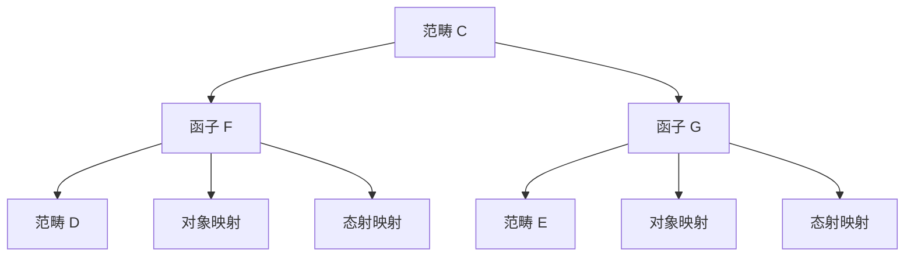

# 范畴论 - 增强版

## 📚 概述

范畴论是现代数学的基础语言，研究数学对象之间的映射关系。范畴的概念统一了代数、拓扑、逻辑等众多数学领域，为现代数学提供了统一的抽象框架。

## 🕰️ 历史发展脉络

### 早期发展 (1940-1960)

#### 代数拓扑背景

- **1942年**: 艾伦伯格-麦克莱恩引入范畴概念
- **1945年**: 艾伦伯格-麦克莱恩建立同调代数
- **1950年**: 格罗滕迪克开始使用范畴论

#### 代数几何背景

- **1950年代**: 格罗滕迪克概形理论
- **1960年代**: 德利涅上同调理论
- **1970年代**: 导出范畴理论

### 现代发展 (1960-1990)

#### 抽象范畴论

- **1960年代**: 劳威尔建立范畴论基础
- **1970年代**: 麦克莱恩《范畴论工作数学家》
- **1980年代**: 约翰斯通《拓扑斯理论》

#### 同调代数

- **1960年代**: 导出函子理论
- **1970年代**: 模型范畴理论
- **1980年代**: 三角范畴理论

### 当代发展 (1990-至今)

#### 高阶范畴论

- **1990年代**: 2-范畴理论
- **2000年代**: 无穷范畴理论
- **2010年代**: 同伦类型论

#### 应用扩展

- **1990年代**: 计算机科学应用
- **2000年代**: 量子计算应用
- **2010年代**: 机器学习应用

## 🏗️ 核心概念

### 范畴的定义

```lean
-- Lean 4 形式化定义
structure Category where
  obj : Type
  hom : obj → obj → Type
  id : ∀ a : obj, hom a a
  comp : ∀ {a b c : obj}, hom b c → hom a b → hom a c
  
  -- 单位律
  id_comp : ∀ {a b : obj} (f : hom a b), comp (id b) f = f
  comp_id : ∀ {a b : obj} (f : hom a b), comp f (id a) = f
  
  -- 结合律
  comp_assoc : ∀ {a b c d : obj} (f : hom c d) (g : hom b c) (h : hom a b),
    comp f (comp g h) = comp (comp f g) h
```

### 基本性质

#### 1. 对象和态射

- 对象集合：$\text{Ob}(\mathcal{C})$
- 态射集合：$\text{Hom}(A, B)$
- 单位态射：$\text{id}_A : A \to A$

#### 2. 复合运算

- 结合律：$(f \circ g) \circ h = f \circ (g \circ h)$
- 单位律：$f \circ \text{id}_A = f = \text{id}_B \circ f$

#### 3. 函子

- 对象映射：$F : \text{Ob}(\mathcal{C}) \to \text{Ob}(\mathcal{D})$
- 态射映射：$F : \text{Hom}(A, B) \to \text{Hom}(F(A), F(B))$

## 📊 可视化图表

### 范畴的结构图

```mermaid
graph TD
    A[范畴 C] --> B[对象 Ob(C)]
    A --> C[态射 Hom(A,B)]
    A --> D[复合运算]
    A --> E[单位态射]
    
    B --> F[对象集合]
    C --> G[态射集合]
    D --> H[结合律]
    E --> I[单位律]
```

### 函子关系图



### 自然变换图

```mermaid
graph LR
    A[函子 F] -->|α| B[函子 G]
    C[对象 A] -->|F(A)| D[对象 F(A)]
    C -->|G(A)| E[对象 G(A)]
    D -->|α_A| E
```

## 🔍 实例表征

### 1. 集合范畴 Set

```haskell
-- Haskell 实现
class Category cat where
  id :: cat a a
  (.) :: cat b c -> cat a b -> cat a c

instance Category (->) where
  id = id
  (.) = (.)

-- 集合范畴
data Set = Set {
    elements :: [a]
}

-- 函数作为态射
type SetMorphism a b = a -> b
```

### 2. 群范畴 Grp

```rust
// Rust 实现
pub trait Category {
    type Object;
    type Morphism;
    
    fn id(obj: &Self::Object) -> Self::Morphism;
    fn compose(f: &Self::Morphism, g: &Self::Morphism) -> Self::Morphism;
}

pub struct GroupCategory;

impl Category for GroupCategory {
    type Object = Group;
    type Morphism = GroupHomomorphism;
    
    fn id(group: &Group) -> GroupHomomorphism {
        GroupHomomorphism::identity(group)
    }
    
    fn compose(f: &GroupHomomorphism, g: &GroupHomomorphism) -> GroupHomomorphism {
        GroupHomomorphism::compose(f, g)
    }
}
```

### 3. 拓扑空间范畴 Top

```lean
-- Lean 4 实现
structure TopologicalSpace where
  carrier : Type
  topology : Set (Set carrier)
  -- 拓扑公理

structure ContinuousMap (X Y : TopologicalSpace) where
  map : X.carrier → Y.carrier
  continuous : ∀ U ∈ Y.topology, map ⁻¹ U ∈ X.topology

def id_map (X : TopologicalSpace) : ContinuousMap X X :=
  ⟨id, by simp⟩

def compose (f : ContinuousMap Y Z) (g : ContinuousMap X Y) : ContinuousMap X Z :=
  ⟨f.map ∘ g.map, by simp [continuous_composition]⟩
```

### 4. 重要范畴类

#### 阿贝尔范畴

```haskell
-- 阿贝尔范畴
class AbelianCategory cat where
  zero_object :: cat a a
  biproduct :: cat a b -> cat a c -> cat a (b, c)
  kernel :: cat a b -> cat (Kernel a b) a
  cokernel :: cat a b -> cat b (Cokernel a b)
  
  -- 阿贝尔性质
  exact_sequence :: [cat a b] -> Bool
  snake_lemma :: cat a b -> cat b c -> cat c d -> cat (Kernel a b) (Cokernel c d)
```

#### 模范畴

```rust
// 模范畴
pub struct ModuleCategory<R> {
    ring: R,
}

impl<R: Ring> Category for ModuleCategory<R> {
    type Object = Module<R>;
    type Morphism = ModuleHomomorphism<R>;
    
    fn id(module: &Module<R>) -> ModuleHomomorphism<R> {
        ModuleHomomorphism::identity(module)
    }
    
    fn compose(f: &ModuleHomomorphism<R>, g: &ModuleHomomorphism<R>) -> ModuleHomomorphism<R> {
        ModuleHomomorphism::compose(f, g)
    }
}
```

## 🧠 思维过程表征

### 1. 范畴论问题解决流程

#### 步骤1：识别范畴结构

```text
问题 → 识别对象和态射 → 验证范畴公理 → 确定范畴类型
```

#### 步骤2：分析范畴性质

```text
范畴结构 → 函子分析 → 自然变换分析 → 极限分析
```

#### 步骤3：应用范畴论工具

```text
范畴性质 → 伴随函子 → 米田引理 → 同调代数
```

### 2. 证明思维过程

#### 米田引理证明

```text
1. 定义米田嵌入
2. 构造自然变换
3. 证明唯一性
4. 得出表示定理
```

#### 伴随函子证明

```text
1. 定义伴随关系
2. 构造单位余单位
3. 证明三角恒等式
4. 得出伴随性质
```

### 3. 概念理解步骤

#### 理解范畴的概念

```text
1. 对象和态射
2. 复合运算
3. 单位律和结合律
4. 具体实例验证
```

#### 理解函子概念

```text
1. 对象映射
2. 态射映射
3. 函子公理
4. 函子性质
```

## 🌍 应用场景表征

### 1. 代数应用

#### 1.1 同调代数

```haskell
-- 链复形范畴
data ChainComplex = ChainComplex {
    objects :: [Module],
    differentials :: [ModuleHomomorphism]
}

-- 导出函子
class DerivedFunctor f where
  left_derived :: f -> Module -> Module
  right_derived :: f -> Module -> Module
  
  -- 长正合列
  long_exact_sequence :: f -> ChainComplex -> [Module]
```

#### 表示论

- **群表示**: 群到向量空间的函子
- **李代数表示**: 李代数到模的函子
- **代数群表示**: 代数群到概形的函子

### 2. 拓扑学应用

#### 代数拓扑

```rust
// 基本群函子
pub struct FundamentalGroupFunctor;

impl Functor for FundamentalGroupFunctor {
    type Source = TopologicalSpace;
    type Target = Group;
    
    fn map_object(space: &TopologicalSpace) -> Group {
        space.fundamental_group()
    }
    
    fn map_morphism(map: &ContinuousMap) -> GroupHomomorphism {
        map.induced_homomorphism()
    }
}
```

#### 同伦论

- **同伦群**: 拓扑空间的同伦不变量
- **纤维化**: 同伦纤维的范畴
- **谱序列**: 同伦论的代数工具

### 3. 逻辑学应用

#### 类型论

```haskell
-- 类型范畴
data Type = Type {
    constructors :: [Constructor],
    eliminators :: [Eliminator]
}

-- 类型同构
type TypeIsomorphism a b = (a -> b, b -> a)

-- 米田嵌入
yoneda_embedding :: Type -> (Type -> Set)
yoneda_embedding a = \b -> (b -> a)
```

#### 模型论

- **模型范畴**: 逻辑结构的范畴
- **解释函子**: 语言到模型的映射
- **完备性定理**: 语法和语义的对应

### 4. 计算机科学应用

#### 编程语言理论

```rust
// 类型系统范畴
pub struct TypeSystemCategory;

impl Category for TypeSystemCategory {
    type Object = Type;
    type Morphism = Term;
    
    fn id(ty: &Type) -> Term {
        Term::identity(ty)
    }
    
    fn compose(f: &Term, g: &Term) -> Term {
        Term::compose(f, g)
    }
}

// 函子编程
pub trait Functor<A, B> {
    fn map<F>(self, f: F) -> Self::Output
    where F: Fn(A) -> B;
}
```

#### 数据库理论

- **关系数据库**: 关系代数范畴
- **查询优化**: 范畴论优化
- **数据迁移**: 函子迁移

### 5. 物理学应用

#### 量子力学

```haskell
-- 希尔伯特空间范畴
data HilbertSpace = HilbertSpace {
    dimension :: Int,
    inner_product :: Complex -> Complex -> Complex
}

-- 量子态变换
type QuantumTransformation = HilbertSpace -> HilbertSpace

-- 量子测量
data QuantumMeasurement = QuantumMeasurement {
    observable :: HermitianOperator,
    eigenstates :: [HilbertSpace]
}
```

#### 量子场论

- **场论范畴**: 量子场的范畴
- **规范理论**: 规范群的范畴
- **拓扑量子场论**: 拓扑不变量

### 6. 数学内部应用

#### 代数几何

- **概形范畴**: 代数几何的基础
- **凝聚层**: 概形上的层
- **上同调**: 几何不变量

#### 数论

- **伽罗瓦群**: 数域扩张的群
- **类域论**: 阿贝尔扩张理论
- **朗兰兹纲领**: 非阿贝尔扩张

## 🔗 知识关联网络

### 与其他数学分支的联系

#### 与代数学的联系

- 群、环、域的范畴
- 模和代数的范畴
- 李代数和李群的范畴

#### 与拓扑学的联系

- 拓扑空间的范畴
- 同伦论的范畴
- 纤维丛的范畴

#### 与逻辑学的联系

- 类型论的范畴
- 模型论的范畴
- 证明论的范畴

### 理论发展脉络

#### 从具体到抽象

```text
集合 → 群 → 范畴 → 高阶范畴
```

#### 从有限到无限

```text
有限范畴 → 无限范畴 → 无穷范畴 → 同伦类型论
```

#### 从经典到量子

```text
经典范畴 → 量子范畴 → 非交换几何 → 量子计算
```

## 📈 现代发展前沿

### 1. 高阶范畴论

- **2-范畴**: 范畴的范畴
- **无穷范畴**: 高阶结构
- **同伦类型论**: 类型论和同伦论

### 2. 量子范畴论

- **量子群**: 非交换代数结构
- **量子计算**: 量子算法的范畴
- **拓扑量子场论**: 拓扑不变量

### 3. 应用范畴论

- **数据库理论**: 关系数据库的范畴
- **机器学习**: 神经网络的范畴
- **区块链**: 分布式系统的范畴

### 4. 计算范畴论

- **符号计算**: 范畴论的算法
- **自动证明**: 范畴论的证明
- **软件工程**: 范畴论的编程

## 🎯 学习路径建议

### 初学者路径

1. **基础概念**: 范畴的定义和基本性质
2. **重要例子**: 集合范畴、群范畴、拓扑空间范畴
3. **基本定理**: 米田引理、伴随函子定理
4. **应用实例**: 同调代数、代数拓扑

### 进阶路径

1. **同调代数**: 范畴论的同调理论
2. **代数几何**: 范畴论的几何化
3. **类型论**: 范畴论的逻辑化
4. **现代应用**: 计算机科学、物理学

### 研究路径

1. **前沿理论**: 高阶范畴论、量子范畴论
2. **交叉应用**: 代数几何、表示论
3. **计算范畴论**: 算法和软件
4. **开放问题**: 未解决的范畴论问题

## 🌟 总结

范畴论作为现代数学的基础语言，不仅提供了统一的抽象框架，还在各个领域发挥着重要作用。从基础的代数结构到前沿的量子计算，范畴论的发展展现了数学的深刻性和普适性。

通过多表征的学习方法，我们可以从不同角度理解范畴论：

- **历史角度**: 了解范畴论的发展历程
- **结构角度**: 掌握范畴的基本性质
- **应用角度**: 认识范畴论的实际价值
- **发展角度**: 关注范畴论的现代发展

范畴论将继续在数学、计算机科学和其他科学领域发挥重要作用，为人类认识世界提供强大的工具。

---

**相关文档**:

- [群论-增强版](01-群论-增强版.md)
- [环论-增强版](02-环论-增强版.md)
- [域论-增强版](03-域论-增强版.md)
- [模论-增强版](04-模论-增强版.md)
- [李代数-增强版](05-李代数-增强版.md)
- [高阶范畴论-高级主题](../11-高级数学/高阶范畴论-高级主题.md)

## 术语对照表 / Terminology Table

| 中文 | English |
|---|---|
| 范畴 | Category |
| 对象 | Object |
| 态射 | Morphism |
| 复合 | Composition |
| 单位态射 | Identity morphism |
| 函子 | Functor |
| 自然变换 | Natural transformation |
| 伴随 | Adjoint |
| 极限/余极限 | Limit/Colimit |
| 单/满/忠实函子 | Mono-/Epi-/Faithful functor |
| 单（射）/满（射） | Monomorphism/Epimorphism |
