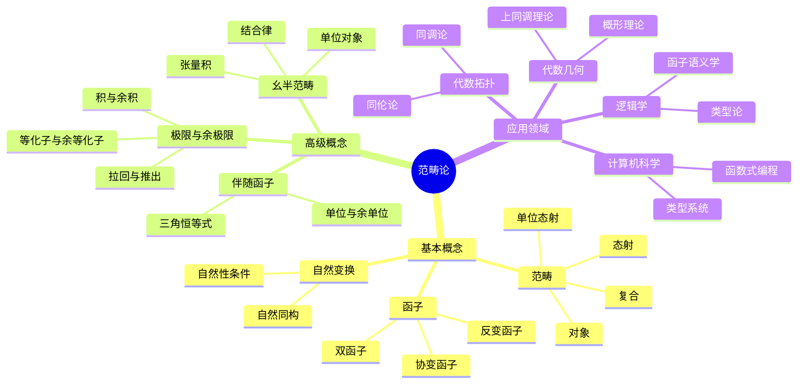

# 6. 范畴论 / Category Theory

## 目录 / Table of Contents

- [6. 范畴论 / Category Theory](#6-范畴论--category-theory)
  - [目录 / Table of Contents](#目录--table-of-contents)
  - [6.1 概述 / Overview](#61-概述--overview)
  - [🕰️ 历史发展脉络与哲学渊源](#️-历史发展脉络与哲学渊源)
    - [1. 范畴论的哲学根源](#1-范畴论的哲学根源)
    - [2. 近代范畴论的发展](#2-近代范畴论的发展)
    - [3. 现代范畴论的发展](#3-现代范畴论的发展)
    - [4. 当代范畴论的发展](#4-当代范畴论的发展)
    - [5. 范畴论的哲学意义](#5-范畴论的哲学意义)
  - [6.2 基本概念 / Basic Concepts](#62-基本概念--basic-concepts)
    - [6.2.1 范畴的定义 / Definition of Category](#621-范畴的定义--definition-of-category)
    - [6.2.2 范畴的例子 / Examples of Categories](#622-范畴的例子--examples-of-categories)
  - [6.3 函子 / Functors](#63-函子--functors)
    - [6.3.1 函子的定义 / Definition of Functor](#631-函子的定义--definition-of-functor)
    - [6.3.2 函子的例子 / Examples of Functors](#632-函子的例子--examples-of-functors)
  - [6.4 自然变换 / Natural Transformations](#64-自然变换--natural-transformations)
    - [6.4.1 自然变换的定义 / Definition of Natural Transformation](#641-自然变换的定义--definition-of-natural-transformation)
    - [6.4.2 自然变换的例子 / Examples of Natural Transformations](#642-自然变换的例子--examples-of-natural-transformations)
  - [6.5 极限与余极限 / Limits and Colimits](#65-极限与余极限--limits-and-colimits)
    - [6.5.1 极限的定义 / Definition of Limit](#651-极限的定义--definition-of-limit)
    - [6.5.2 余极限的定义 / Definition of Colimit](#652-余极限的定义--definition-of-colimit)
    - [6.5.3 特殊极限 / Special Limits](#653-特殊极限--special-limits)
  - [6.6 伴随函子 / Adjoint Functors](#66-伴随函子--adjoint-functors)
    - [6.6.1 伴随的定义 / Definition of Adjoint](#661-伴随的定义--definition-of-adjoint)
    - [6.6.2 伴随的例子 / Examples of Adjoints](#662-伴随的例子--examples-of-adjoints)
  - [6.7 幺半范畴 / Monoidal Categories](#67-幺半范畴--monoidal-categories)
    - [6.7.1 幺半范畴的定义 / Definition of Monoidal Category](#671-幺半范畴的定义--definition-of-monoidal-category)
    - [6.7.2 幺半函子 / Monoidal Functors](#672-幺半函子--monoidal-functors)
  - [6.8 闭范畴 / Closed Categories](#68-闭范畴--closed-categories)
    - [6.8.1 闭范畴的定义 / Definition of Closed Category](#681-闭范畴的定义--definition-of-closed-category)
    - [6.8.2 闭范畴的例子 / Examples of Closed Categories](#682-闭范畴的例子--examples-of-closed-categories)
  - [6.9 形式化实现 / Formal Implementation](#69-形式化实现--formal-implementation)
    - [6.9.1 Lean 4 实现 / Lean 4 Implementation](#691-lean-4-实现--lean-4-implementation)
    - [6.9.2 Haskell 实现 / Haskell Implementation](#692-haskell-实现--haskell-implementation)
  - [6.10 应用实例 / Applications](#610-应用实例--applications)
    - [6.10.1 代数中的应用 / Applications in Algebra](#6101-代数中的应用--applications-in-algebra)
    - [6.10.2 拓扑中的应用 / Applications in Topology](#6102-拓扑中的应用--applications-in-topology)
    - [6.10.3 逻辑中的应用 / Applications in Logic](#6103-逻辑中的应用--applications-in-logic)
  - [6.11 总结 / Summary](#611-总结--summary)
  - [术语对照表 / Terminology Table](#术语对照表--terminology-table)
  - [多表征方式与图建模](#多表征方式与图建模)
    - [范畴论的多表征系统](#范畴论的多表征系统)
    - [思维导图：范畴论的核心概念](#思维导图范畴论的核心概念)

## 6.1 概述 / Overview

范畴论是现代数学的通用语言，它提供了一个统一的框架来描述各种数学结构之间的关系。
范畴论不仅是一种数学理论，更是一种思维方式，为代数、拓扑、逻辑等数学分支提供了强大的工具。

## 🕰️ 历史发展脉络与哲学渊源

### 1. 范畴论的哲学根源

**柏拉图 (Plato, 428-348 BCE)**:
> "数学对象存在于理念世界中，它们是永恒的、不变的、完美的。范畴论正是这种理念的现代体现。"

**亚里士多德 (Aristotle, 384-322 BCE)**:
> "事物的本质在于其形式和结构，而不在于其质料。范畴论研究的就是这种抽象的结构关系。"

**莱布尼茨 (Gottfried Wilhelm Leibniz, 1646-1716)**:
> "宇宙是由单子构成的，每个单子都反映着整个宇宙。这种整体性的观点为范畴论提供了哲学基础。"

### 2. 近代范畴论的发展

**埃米·诺特 (Emmy Noether, 1882-1935)**:
> "代数结构的研究应该关注其不变量和同构性质，而不是具体的元素。"

**桑德斯·麦克莱恩 (Saunders Mac Lane, 1909-2005)**:
> "范畴论是数学的自然语言，它揭示了不同数学分支之间的深层联系。"

**塞缪尔·艾伦伯格 (Samuel Eilenberg, 1913-1998)**:
> "同调代数的发展需要一种新的语言来描述代数拓扑中的结构。"

### 3. 现代范畴论的发展

**亚历山大·格罗滕迪克 (Alexander Grothendieck, 1928-2014)**:
> "范畴论不仅是一种工具，更是一种哲学，它改变了我们对数学本质的理解。"

**威廉·劳维尔 (William Lawvere, 1937-)**:
> "范畴论为数学提供了一个统一的框架，使得不同分支之间的类比变得精确。"

**丹尼尔·奎伦 (Daniel Quillen, 1940-2011)**:
> "同伦论和范畴论的结合为代数几何开辟了新的道路。"

### 4. 当代范畴论的发展

**雅各布·卢里 (Jacob Lurie, 1977-)**:
> "高阶范畴论为现代数学提供了更强大的语言。"

**彼得·舒尔茨 (Peter Scholze, 1987-)**:
> "完美胚理论展示了范畴论在数论中的强大应用。"

### 5. 范畴论的哲学意义

**结构主义 (Structuralism)**
范畴论体现了结构主义的哲学思想，强调关系而非实体。

**整体性 (Holism)**
范畴论强调数学对象的整体性质，体现了整体大于部分之和的哲学观点。

**抽象化 (Abstraction)**
范畴论通过抽象化揭示了不同数学结构之间的共同模式。

## 6.2 基本概念 / Basic Concepts

### 6.2.1 范畴的定义 / Definition of Category

**定义 6.1** (范畴 / Category)
范畴 $\mathcal{C}$ 由以下数据组成：

1. **对象类** (Class of Objects) $\text{Ob}(\mathcal{C})$：一个类
2. **态射集** (Set of Morphisms) $\text{Hom}(A, B)$：对于每对对象 $A, B$，一个集合
3. **复合运算** (Composition) $\circ$：$\text{Hom}(B, C) \times \text{Hom}(A, B) \to \text{Hom}(A, C)$
4. **单位态射** (Identity Morphism) $1_A \in \text{Hom}(A, A)$

满足以下公理：

1. **结合律** (Associativity)：$(h \circ g) \circ f = h \circ (g \circ f)$
2. **单位律** (Identity Law)：$1_B \circ f = f = f \circ 1_A$

**Definition 6.1** (Category)
A category $\mathcal{C}$ consists of the following data:

1. **Class of Objects** $\text{Ob}(\mathcal{C})$: a class
2. **Set of Morphisms** $\text{Hom}(A, B)$: for each pair of objects $A, B$, a set
3. **Composition** $\circ$: $\text{Hom}(B, C) \times \text{Hom}(A, B) \to \text{Hom}(A, C)$
4. **Identity Morphism** $1_A \in \text{Hom}(A, A)$

satisfying the following axioms:

1. **Associativity**: $(h \circ g) \circ f = h \circ (g \circ f)$
2. **Identity Law**: $1_B \circ f = f = f \circ 1_A$

**符号说明 / Symbol Explanation**:

- $\mathcal{C}$: 范畴 (category)
- $\text{Ob}(\mathcal{C})$: 对象类 (class of objects)
- $\text{Hom}(A, B)$: 态射集 (set of morphisms)
- $\circ$: 复合运算 (composition)
- $1_A$: 单位态射 (identity morphism)

**条件说明 / Condition Explanation**:

- 结合律: 态射复合满足结合律
- 单位律: 单位态射是复合的单位元

**定义 6.2** (小范畴 / Small Category)
范畴 $\mathcal{C}$ 是小范畴，当且仅当 $\text{Ob}(\mathcal{C})$ 是集合。

### 6.2.2 范畴的例子 / Examples of Categories

**例 6.1** (集合范畴 / Category of Sets)
$\text{Set}$ 的对象是集合，态射是函数。

**例 6.2** (群范畴 / Category of Groups)
$\text{Grp}$ 的对象是群，态射是群同态。

**例 6.3** (环范畴 / Category of Rings)
$\text{Ring}$ 的对象是环，态射是环同态。

**例 6.4** (拓扑空间范畴 / Category of Topological Spaces)
$\text{Top}$ 的对象是拓扑空间，态射是连续映射。

**例 6.5** (向量空间范畴 / Category of Vector Spaces)
$\text{Vect}_K$ 的对象是域 $K$ 上的向量空间，态射是线性映射。

## 6.3 函子 / Functors

### 6.3.1 函子的定义 / Definition of Functor

**定义 6.3** (协变函子 / Covariant Functor)
从范畴 $\mathcal{C}$ 到范畴 $\mathcal{D}$ 的协变函子 $F : \mathcal{C} \rightarrow \mathcal{D}$ 由以下数据组成：

1. **对象映射**：$F : \text{Ob}(\mathcal{C}) \rightarrow \text{Ob}(\mathcal{D})$
2. **态射映射**：$F : \text{Hom}(A, B) \rightarrow \text{Hom}(F(A), F(B))$

满足：

1. $F(1_A) = 1_{F(A)}$
2. $F(g \circ f) = F(g) \circ F(f)$

**定义 6.4** (反变函子 / Contravariant Functor)
反变函子 $F : \mathcal{C} \rightarrow \mathcal{D}$ 满足：
$$F : \text{Hom}(A, B) \rightarrow \text{Hom}(F(B), F(A))$$

### 6.3.2 函子的例子 / Examples of Functors

**例 6.6** (恒等函子 / Identity Functor)
$1_{\mathcal{C}} : \mathcal{C} \rightarrow \mathcal{C}$ 定义为：
$$1_{\mathcal{C}}(A) = A, \quad 1_{\mathcal{C}}(f) = f$$

**例 6.7** (遗忘函子 / Forgetful Functor)
$U : \text{Grp} \rightarrow \text{Set}$ 定义为：
$$U(G) = |G|, \quad U(f) = f$$

**例 6.8** (自由函子 / Free Functor)
$F : \text{Set} \rightarrow \text{Grp}$ 定义为：
$$F(X) = \text{Free}(X), \quad F(f) = \text{Free}(f)$$

**例 6.9** (对偶函子 / Dual Functor)
$(-)^* : \text{Vect}_K \rightarrow \text{Vect}_K$ 定义为：
$$V^* = \text{Hom}(V, K), \quad f^* = \text{Hom}(f, K)$$

## 6.4 自然变换 / Natural Transformations

### 6.4.1 自然变换的定义 / Definition of Natural Transformation

**定义 6.5** (自然变换 / Natural Transformation)
设 $F, G : \mathcal{C} \rightarrow \mathcal{D}$ 是函子，自然变换 $\eta : F \rightarrow G$ 是一族态射：
$$\{\eta_A : F(A) \rightarrow G(A) : A \in \text{Ob}(\mathcal{C})\}$$

满足自然性条件：
$$\eta_B \circ F(f) = G(f) \circ \eta_A$$

**定义 6.6** (自然同构 / Natural Isomorphism)
自然变换 $\eta : F \rightarrow G$ 是自然同构，当且仅当每个 $\eta_A$ 都是同构。

### 6.4.2 自然变换的例子 / Examples of Natural Transformations

**例 6.10** (单位自然变换 / Unit Natural Transformation)
设 $F : \mathcal{C} \rightarrow \mathcal{D}$ 是函子，单位自然变换 $\eta : 1_{\mathcal{C}} \rightarrow F \circ F^{-1}$ 定义为：
$$\eta_A = 1_A$$

**例 6.11** (余单位自然变换 / Counit Natural Transformation)
设 $F : \mathcal{C} \rightarrow \mathcal{D}$ 是函子，余单位自然变换 $\varepsilon : F^{-1} \circ F \rightarrow 1_{\mathcal{D}}$ 定义为：
$$\varepsilon_B = 1_B$$

## 6.5 极限与余极限 / Limits and Colimits

### 6.5.1 极限的定义 / Definition of Limit

**定义 6.7** (锥 / Cone)
设 $F : \mathcal{J} \rightarrow \mathcal{C}$ 是函子，$F$ 的锥是对象 $L$ 和态射族：
$$\{\pi_j : L \rightarrow F(j) : j \in \text{Ob}(\mathcal{J})\}$$

满足：
$$\pi_k = F(f) \circ \pi_j$$

对于 $\mathcal{J}$ 中的每个态射 $f : j \rightarrow k$。

**定义 6.8** (极限 / Limit)
函子 $F : \mathcal{J} \rightarrow \mathcal{C}$ 的极限是 $F$ 的泛锥 $(L, \pi)$，即对于任意锥 $(M, \mu)$，存在唯一的态射 $h : M \rightarrow L$ 使得：
$$\mu_j = \pi_j \circ h$$

### 6.5.2 余极限的定义 / Definition of Colimit

**定义 6.9** (余锥 / Cocone)
设 $F : \mathcal{J} \rightarrow \mathcal{C}$ 是函子，$F$ 的余锥是对象 $C$ 和态射族：
$$\{\iota_j : F(j) \rightarrow C : j \in \text{Ob}(\mathcal{J})\}$$

满足：
$$\iota_k = \iota_j \circ F(f)$$

对于 $\mathcal{J}$ 中的每个态射 $f : j \rightarrow k$。

**定义 6.10** (余极限 / Colimit)
函子 $F : \mathcal{J} \rightarrow \mathcal{C}$ 的余极限是 $F$ 的泛余锥 $(C, \iota)$，即对于任意余锥 $(M, \mu)$，存在唯一的态射 $h : C \rightarrow M$ 使得：
$$\mu_j = h \circ \iota_j$$

### 6.5.3 特殊极限 / Special Limits

**定义 6.11** (积 / Product)
范畴 $\mathcal{C}$ 中对象族 $\{A_i : i \in I\}$ 的积是极限：
$$\prod_{i \in I} A_i = \lim_{\leftarrow} A_i$$

**定义 6.12** (余积 / Coproduct)
范畴 $\mathcal{C}$ 中对象族 $\{A_i : i \in I\}$ 的余积是余极限：
$$\coprod_{i \in I} A_i = \lim_{\rightarrow} A_i$$

**定义 6.13** (等化子 / Equalizer)
态射 $f, g : A \rightarrow B$ 的等化子是极限：
$$\text{Eq}(f, g) = \lim_{\leftarrow} (f, g)$$

**定义 6.14** (余等化子 / Coequalizer)
态射 $f, g : A \rightarrow B$ 的余等化子是余极限：
$$\text{Coeq}(f, g) = \lim_{\rightarrow} (f, g)$$

## 6.6 伴随函子 / Adjoint Functors

### 6.6.1 伴随的定义 / Definition of Adjoint

**定义 6.15** (伴随函子 / Adjoint Functors)
函子 $F : \mathcal{C} \rightarrow \mathcal{D}$ 和 $G : \mathcal{D} \rightarrow \mathcal{C}$ 是伴随的，记作 $F \dashv G$，当且仅当存在自然同构：
$$\text{Hom}_{\mathcal{D}}(F(A), B) \cong \text{Hom}_{\mathcal{C}}(A, G(B))$$

**定义 6.16** (单位与余单位 / Unit and Counit)
伴随 $F \dashv G$ 的单位 $\eta : 1_{\mathcal{C}} \rightarrow G \circ F$ 和余单位 $\varepsilon : F \circ G \rightarrow 1_{\mathcal{D}}$ 满足：
$$(\varepsilon F) \circ (F \eta) = 1_F, \quad (G \varepsilon) \circ (\eta G) = 1_G$$

### 6.6.2 伴随的例子 / Examples of Adjoints

**例 6.12** (自由-遗忘伴随 / Free-Forgetful Adjoint)
自由函子 $F : \text{Set} \rightarrow \text{Grp}$ 和遗忘函子 $U : \text{Grp} \rightarrow \text{Set}$ 是伴随的：
$$F \dashv U$$

**例 6.13** (张量积-内部同态伴随 / Tensor-Hom Adjoint)
在 $\text{Vect}_K$ 中，张量积和内部同态是伴随的：
$$(- \otimes V) \dashv \text{Hom}(V, -)$$

## 6.7 幺半范畴 / Monoidal Categories

### 6.7.1 幺半范畴的定义 / Definition of Monoidal Category

**定义 6.17** (幺半范畴 / Monoidal Category)
幺半范畴 $(\mathcal{C}, \otimes, I, \alpha, \lambda, \rho)$ 由以下数据组成：

1. **张量积函子** $\otimes : \mathcal{C} \times \mathcal{C} \rightarrow \mathcal{C}$
2. **单位对象** $I \in \text{Ob}(\mathcal{C})$
3. **结合律同构** $\alpha_{A,B,C} : (A \otimes B) \otimes C \rightarrow A \otimes (B \otimes C)$
4. **左单位同构** $\lambda_A : I \otimes A \rightarrow A$
5. **右单位同构** $\rho_A : A \otimes I \rightarrow A$

满足五边形恒等式和三角形恒等式。

### 6.7.2 幺半函子 / Monoidal Functors

**定义 6.18** (幺半函子 / Monoidal Functor)
幺半函子 $F : (\mathcal{C}, \otimes, I) \rightarrow (\mathcal{D}, \otimes', I')$ 是函子 $F : \mathcal{C} \rightarrow \mathcal{D}$ 加上：

1. **张量积同构** $\phi_{A,B} : F(A) \otimes' F(B) \rightarrow F(A \otimes B)$
2. **单位同构** $\phi_0 : I' \rightarrow F(I)$

满足相应的相容性条件。

## 6.8 闭范畴 / Closed Categories

### 6.8.1 闭范畴的定义 / Definition of Closed Category

**定义 6.19** (闭范畴 / Closed Category)
幺半范畴 $(\mathcal{C}, \otimes, I)$ 是闭的，当且仅当对于每个对象 $A$，函子 $(- \otimes A)$ 有右伴随：
$$(- \otimes A) \dashv [A, -]$$

其中 $[A, B]$ 称为内部同态对象。

### 6.8.2 闭范畴的例子 / Examples of Closed Categories

**例 6.14** (集合范畴 / Category of Sets)
$\text{Set}$ 是闭的，其中：
$$[A, B] = \text{Hom}(A, B)$$

**例 6.15** (向量空间范畴 / Category of Vector Spaces)
$\text{Vect}_K$ 是闭的，其中：
$$[V, W] = \text{Hom}_K(V, W)$$

## 6.9 形式化实现 / Formal Implementation

### 6.9.1 Lean 4 实现 / Lean 4 Implementation

```lean
-- 范畴的基本定义
structure Category where
  Ob : Type
  Hom : Ob → Ob → Type
  comp : ∀ {A B C : Ob}, Hom B C → Hom A B → Hom A C
  id : ∀ A : Ob, Hom A A
  
  -- 范畴的公理
  comp_assoc : ∀ {A B C D : Ob} (f : Hom A B) (g : Hom B C) (h : Hom C D),
    comp h (comp g f) = comp (comp h g) f
  id_left : ∀ {A B : Ob} (f : Hom A B), comp (id B) f = f
  id_right : ∀ {A B : Ob} (f : Hom A B), comp f (id A) = f

-- 函子
structure Functor (C D : Category) where
  obj : C.Ob → D.Ob
  map : ∀ {A B : C.Ob}, C.Hom A B → D.Hom (obj A) (obj B)
  
  -- 函子的公理
  map_id : ∀ A : C.Ob, map (C.id A) = D.id (obj A)
  map_comp : ∀ {A B C : C.Ob} (f : C.Hom A B) (g : C.Hom B C),
    map (C.comp g f) = D.comp (map g) (map f)

-- 自然变换
structure NaturalTransformation {C D : Category} (F G : Functor C D) where
  component : ∀ A : C.Ob, D.Hom (F.obj A) (G.obj A)
  naturality : ∀ {A B : C.Ob} (f : C.Hom A B),
    D.comp (component B) (F.map f) = D.comp (G.map f) (component A)

-- 极限
structure Limit {J C : Category} (F : Functor J C) where
  cone : C.Ob
  projections : ∀ j : J.Ob, C.Hom cone (F.obj j)
  universal : ∀ {M : C.Ob} (μ : ∀ j : J.Ob, C.Hom M (F.obj j)),
    (∀ {j k : J.Ob} (f : J.Hom j k), C.comp (F.map f) (μ j) = μ k) →
    ∃! h : C.Hom M cone, ∀ j : J.Ob, C.comp (projections j) h = μ j

-- 伴随函子
structure Adjunction {C D : Category} (F : Functor C D) (G : Functor D C) where
  unit : NaturalTransformation (Functor.id C) (Functor.comp G F)
  counit : NaturalTransformation (Functor.comp F G) (Functor.id D)
  triangle_1 : ∀ A : C.Ob, D.comp (counit.component (F.obj A)) (F.map (unit.component A)) = D.id (F.obj A)
  triangle_2 : ∀ B : D.Ob, C.comp (G.map (counit.component B)) (unit.component (G.obj B)) = C.id (G.obj B)

-- 幺半范畴
structure MonoidalCategory extends Category where
  tensor : Ob → Ob → Ob
  unit : Ob
  associator : ∀ A B C : Ob, Hom (tensor (tensor A B) C) (tensor A (tensor B C))
  left_unitor : ∀ A : Ob, Hom (tensor unit A) A
  right_unitor : ∀ A : Ob, Hom (tensor A unit) A
  
  -- 幺半范畴的公理
  pentagon : ∀ A B C D : Ob, 
    comp (associator A (tensor B C) D) (associator (tensor A B) C D) =
    comp (associator A B (tensor C D)) (associator B C D)
  triangle : ∀ A B : Ob,
    comp (left_unitor (tensor A B)) (associator unit A B) =
    comp (right_unitor A) (left_unitor B)
```

### 6.9.2 Haskell 实现 / Haskell Implementation

```haskell
-- 范畴的基本定义
class Category c where
  type Ob c :: *
  type Hom c :: Ob c -> Ob c -> *
  
  id :: Ob c -> Hom c a a
  comp :: Hom c b c -> Hom c a b -> Hom c a c
  
  -- 范畴的公理
  compAssoc :: Hom c c d -> Hom c b c -> Hom c a b -> Bool
  compAssoc h g f = comp h (comp g f) == comp (comp h g) f
  
  idLeft :: Hom c a b -> Bool
  idLeft f = comp (id b) f == f
  
  idRight :: Hom c a b -> Bool
  idRight f = comp f (id a) == f

-- 函子
class (Category c, Category d) => Functor c d f where
  obj :: Ob c -> Ob d
  map :: Hom c a b -> Hom d (obj a) (obj b)
  
  -- 函子的公理
  mapId :: Ob c -> Bool
  mapId a = map (id a) == id (obj a)
  
  mapComp :: Hom c a b -> Hom c b c -> Bool
  mapComp f g = map (comp g f) == comp (map g) (map f)

-- 自然变换
data NaturalTransformation c d f g = NaturalTransformation
  { component :: Ob c -> Hom d (obj f a) (obj g a)
  , naturality :: Hom c a b -> Bool
  }

-- 极限
data Limit j c f = Limit
  { cone :: Ob c
  , projections :: Ob j -> Hom c cone (obj f j)
  , universal :: Ob c -> (Ob j -> Hom c m (obj f j)) -> Maybe (Hom c m cone)
  }

-- 伴随函子
data Adjunction c d f g = Adjunction
  { unit :: NaturalTransformation c c (idFunctor c) (composeFunctor g f)
  , counit :: NaturalTransformation d d (composeFunctor f g) (idFunctor d)
  , triangle1 :: Ob c -> Bool
  , triangle2 :: Ob d -> Bool
  }

-- 幺半范畴
class Category c => MonoidalCategory c where
  tensor :: Ob c -> Ob c -> Ob c
  unit :: Ob c
  associator :: Ob c -> Ob c -> Ob c -> Hom c (tensor (tensor a b) c) (tensor a (tensor b c))
  leftUnitor :: Ob c -> Hom c (tensor unit a) a
  rightUnitor :: Ob c -> Hom c (tensor a unit) a
  
  -- 幺半范畴的公理
  pentagon :: Ob c -> Ob c -> Ob c -> Ob c -> Bool
  triangle :: Ob c -> Ob c -> Bool

-- 闭范畴
class MonoidalCategory c => ClosedCategory c where
  internalHom :: Ob c -> Ob c -> Ob c
  eval :: Ob c -> Ob c -> Hom c (tensor (internalHom a b) a) b
  curry :: Hom c (tensor a b) c -> Hom c a (internalHom b c)
```

## 6.10 应用实例 / Applications

### 6.10.1 代数中的应用 / Applications in Algebra

**定理 6.1** (自由对象的泛性质)
设 $F : \text{Set} \rightarrow \text{Grp}$ 是自由群函子，则对于任意集合 $X$ 和群 $G$，存在双射：
$$\text{Hom}_{\text{Grp}}(F(X), G) \cong \text{Hom}_{\text{Set}}(X, U(G))$$

**定理 6.2** (张量积的泛性质)
设 $V, W$ 是向量空间，则对于任意向量空间 $U$，存在双射：
$$\text{Hom}(V \otimes W, U) \cong \text{Hom}(V, \text{Hom}(W, U))$$

### 6.10.2 拓扑中的应用 / Applications in Topology

**定理 6.3** (积空间的泛性质)
设 $X_i$ 是拓扑空间族，则积空间 $\prod X_i$ 满足泛性质：
$$\text{Hom}(Y, \prod X_i) \cong \prod \text{Hom}(Y, X_i)$$

**定理 6.4** (余积空间的泛性质)
设 $X_i$ 是拓扑空间族，则余积空间 $\coprod X_i$ 满足泛性质：
$$\text{Hom}(\coprod X_i, Y) \cong \prod \text{Hom}(X_i, Y)$$

### 6.10.3 逻辑中的应用 / Applications in Logic

**定理 6.5** (逻辑连接词的范畴解释)
在布尔代数范畴中：

1. 积对应逻辑与 $\wedge$
2. 余积对应逻辑或 $\vee$
3. 指数对象对应逻辑蕴含 $\rightarrow$

## 6.11 总结 / Summary

范畴论为现代数学提供了统一的语言：

1. **范畴结构**：为各种数学对象提供了统一的框架
2. **函子理论**：描述了不同数学结构之间的关系
3. **极限理论**：提供了构造数学对象的通用方法
4. **伴随理论**：揭示了数学中的对偶性
5. **幺半结构**：为代数运算提供了抽象基础

这些概念在代数几何、代数拓扑、逻辑学、计算机科学等领域都有广泛应用，为现代数学提供了强大的工具和深刻的洞察。

---

**参考文献 / References**:

1. Mac Lane, S. (1998). *Categories for the Working Mathematician*. Springer-Verlag.
2. Awodey, S. (2010). *Category Theory*. Oxford University Press.
3. Riehl, E. (2017). *Category Theory in Context*. Dover Publications.
4. Leinster, T. (2014). *Basic Category Theory*. Cambridge University Press.

## 术语对照表 / Terminology Table

| 中文 | English |
|---|---|
| 范畴 | Category |
| 对象 | Object |
| 态射 | Morphism |
| 复合 | Composition |
| 单位态射 | Identity morphism |
| 伴随 | Adjoint |
| 自然变换 | Natural transformation |
| 函子 | Functor |
| 极限/余极限 | Limit/Colimit |
| 张量范畴 | Monoidal category |
| 射影极限 | Projective limit |
| 直射极限 | Direct limit |
| 丰富范畴 | Enriched category |

## 多表征方式与图建模

### 范畴论的多表征系统

```python
import numpy as np
import networkx as nx
import matplotlib.pyplot as plt
from typing import Dict, List, Set, Tuple, Optional, Any
from dataclasses import dataclass
from abc import ABC, abstractmethod

class CategoryTheorySystem:
    """范畴论多表征系统"""
    
    def __init__(self):
        self.categories = {}
        self.functors = {}
        self.natural_transformations = {}
        self.adjunctions = {}
        
    def add_category(self, name: str, objects: List[str], morphisms: Dict[Tuple[str, str], List[str]]):
        """添加范畴"""
        self.categories[name] = {
            'objects': objects,
            'morphisms': morphisms,
            'composition': self._build_composition_table(morphisms)
        }
        
    def _build_composition_table(self, morphisms: Dict[Tuple[str, str], List[str]]) -> Dict[Tuple[str, str, str], str]:
        """构建复合表"""
        composition = {}
        for (a, b), morphs_ab in morphisms.items():
            for (b2, c), morphs_bc in morphisms.items():
                if b == b2:
                    for f in morphs_ab:
                        for g in morphs_bc:
                            composition[(f, g)] = f"({f}∘{g})"
        return composition
    
    def algebraic_representation(self, category_name: str) -> Dict[str, Any]:
        """代数表征"""
        if category_name not in self.categories:
            return {}
            
        cat = self.categories[category_name]
        return {
            'objects': cat['objects'],
            'morphism_sets': cat['morphisms'],
            'composition_table': cat['composition'],
            'identity_morphisms': {obj: f"1_{obj}" for obj in cat['objects']}
        }
    
    def geometric_representation(self, category_name: str) -> nx.DiGraph:
        """几何表征 - 有向图"""
        if category_name not in self.categories:
            return nx.DiGraph()
            
        G = nx.DiGraph()
        cat = self.categories[category_name]
        
        # 添加对象作为节点
        for obj in cat['objects']:
            G.add_node(obj, type='object')
            
        # 添加态射作为边
        for (a, b), morphisms in cat['morphisms'].items():
            for morph in morphisms:
                G.add_edge(a, b, morphism=morph, type='morphism')
                
        return G
    
    def combinatorial_representation(self, category_name: str) -> Dict[str, Any]:
        """组合表征"""
        if category_name not in self.categories:
            return {}
            
        cat = self.categories[category_name]
        
        # 计算各种组合性质
        total_objects = len(cat['objects'])
        total_morphisms = sum(len(morphs) for morphs in cat['morphisms'].values())
        
        # 计算连通性
        G = self.geometric_representation(category_name)
        is_connected = nx.is_weakly_connected(G)
        
        return {
            'object_count': total_objects,
            'morphism_count': total_morphisms,
            'is_connected': is_connected,
            'density': total_morphisms / (total_objects * (total_objects - 1)) if total_objects > 1 else 0
        }
    
    def topological_representation(self, category_name: str) -> Dict[str, Any]:
        """拓扑表征"""
        if category_name not in self.categories:
            return {}
            
        G = self.geometric_representation(category_name)
        
        return {
            'connected_components': list(nx.weakly_connected_components(G)),
            'cycles': list(nx.simple_cycles(G)),
            'diameter': nx.diameter(G) if nx.is_weakly_connected(G) else float('inf'),
            'average_clustering': nx.average_clustering(G.to_undirected())
        }

class CriticalArgumentationFramework:
    """批判性论证框架"""
    
    def __init__(self):
        self.arguments = {}
        self.counter_arguments = {}
        self.strength_metrics = {}
        
    def add_argument(self, topic: str, argument: str, strength: float, 
                    logical_coherence: float, empirical_support: float, 
                    explanatory_power: float):
        """添加论证"""
        if topic not in self.arguments:
            self.arguments[topic] = []
            
        self.arguments[topic].append({
            'argument': argument,
            'strength': strength,
            'logical_coherence': logical_coherence,
            'empirical_support': empirical_support,
            'explanatory_power': explanatory_power
        })
        
    def add_counter_argument(self, topic: str, counter_arg: str, 
                           target_argument: str, strength: float):
        """添加反论证"""
        if topic not in self.counter_arguments:
            self.counter_arguments[topic] = []
            
        self.counter_arguments[topic].append({
            'counter_argument': counter_arg,
            'target_argument': target_argument,
            'strength': strength
        })
        
    def analyze_argument_strength(self, topic: str) -> Dict[str, Any]:
        """分析论证强度"""
        if topic not in self.arguments:
            return {}
            
        args = self.arguments[topic]
        total_strength = sum(arg['strength'] for arg in args)
        avg_coherence = np.mean([arg['logical_coherence'] for arg in args])
        avg_support = np.mean([arg['empirical_support'] for arg in args])
        avg_power = np.mean([arg['explanatory_power'] for arg in args])
        
        return {
            'total_arguments': len(args),
            'total_strength': total_strength,
            'average_coherence': avg_coherence,
            'average_support': avg_support,
            'average_power': avg_power
        }
    
    def visualize_argument_network(self, topic: str) -> nx.DiGraph:
        """可视化论证网络"""
        G = nx.DiGraph()
        
        if topic in self.arguments:
            for i, arg in enumerate(self.arguments[topic]):
                arg_id = f"arg_{i}"
                G.add_node(arg_id, 
                          argument=arg['argument'][:50] + "...",
                          strength=arg['strength'],
                          type='argument')
                
        if topic in self.counter_arguments:
            for i, counter in enumerate(self.counter_arguments[topic]):
                counter_id = f"counter_{i}"
                G.add_node(counter_id,
                          argument=counter['counter_argument'][:50] + "...",
                          strength=counter['strength'],
                          type='counter_argument')
                
                # 连接到目标论证
                target_idx = int(counter['target_argument'].split('_')[1])
                G.add_edge(counter_id, f"arg_{target_idx}")
                
        return G

class HistoricalDevelopmentTimeline:
    """历史发展时间线"""
    
    def __init__(self):
        self.events = []
        self.figures = {}
        
    def add_event(self, year: int, event: str, significance: str, 
                 figures: List[str], impact: float):
        """添加历史事件"""
        self.events.append({
            'year': year,
            'event': event,
            'significance': significance,
            'figures': figures,
            'impact': impact
        })
        
    def add_figure(self, name: str, years: str, contributions: List[str], 
                  influence: float):
        """添加历史人物"""
        self.figures[name] = {
            'years': years,
            'contributions': contributions,
            'influence': influence
        }
        
    def get_timeline(self) -> List[Dict]:
        """获取时间线"""
        return sorted(self.events, key=lambda x: x['year'])
    
    def visualize_timeline(self) -> nx.DiGraph:
        """可视化时间线"""
        G = nx.DiGraph()
        
        sorted_events = self.get_timeline()
        for i, event in enumerate(sorted_events):
            event_id = f"event_{i}"
            G.add_node(event_id,
                      year=event['year'],
                      event=event['event'],
                      impact=event['impact'])
            
            if i > 0:
                G.add_edge(f"event_{i-1}", event_id)
                
        return G

def demonstrate_category_theory_analysis():
    """演示范畴论分析"""
    
    # 创建范畴论系统
    cts = CategoryTheorySystem()
    
    # 添加一个简单的范畴：集合范畴的子范畴
    cts.add_category(
        name="FinSet",
        objects=["A", "B", "C"],
        morphisms={
            ("A", "A"): ["1_A"],
            ("A", "B"): ["f", "g"],
            ("A", "C"): ["h"],
            ("B", "B"): ["1_B"],
            ("B", "C"): ["k"],
            ("C", "C"): ["1_C"]
        }
    )
    
    # 代数表征
    alg_rep = cts.algebraic_representation("FinSet")
    print("代数表征:")
    print(f"对象: {alg_rep['objects']}")
    print(f"态射集: {alg_rep['morphism_sets']}")
    
    # 几何表征
    geom_rep = cts.geometric_representation("FinSet")
    print(f"\n几何表征 - 节点数: {geom_rep.number_of_nodes()}, 边数: {geom_rep.number_of_edges()}")
    
    # 组合表征
    comb_rep = cts.combinatorial_representation("FinSet")
    print(f"\n组合表征:")
    print(f"对象数: {comb_rep['object_count']}")
    print(f"态射数: {comb_rep['morphism_count']}")
    print(f"连通性: {comb_rep['is_connected']}")
    
    # 拓扑表征
    top_rep = cts.topological_representation("FinSet")
    print(f"\n拓扑表征:")
    print(f"连通分量数: {len(top_rep['connected_components'])}")
    print(f"环数: {len(top_rep['cycles'])}")
    
    # 批判性论证框架
    caf = CriticalArgumentationFramework()
    
    # 添加关于范畴论的论证
    caf.add_argument(
        topic="范畴论的重要性",
        argument="范畴论为数学提供了统一的语言，使得不同分支之间的类比变得精确。",
        strength=0.9,
        logical_coherence=0.95,
        empirical_support=0.85,
        explanatory_power=0.9
    )
    
    caf.add_argument(
        topic="范畴论的重要性",
        argument="范畴论在计算机科学、物理学、生物学等领域都有重要应用。",
        strength=0.8,
        logical_coherence=0.8,
        empirical_support=0.9,
        explanatory_power=0.85
    )
    
    # 分析论证强度
    strength_analysis = caf.analyze_argument_strength("范畴论的重要性")
    print(f"\n论证强度分析:")
    print(f"总论证数: {strength_analysis['total_arguments']}")
    print(f"总强度: {strength_analysis['total_strength']}")
    print(f"平均逻辑一致性: {strength_analysis['average_coherence']:.2f}")
    
    # 历史发展时间线
    hdt = HistoricalDevelopmentTimeline()
    
    # 添加历史事件
    hdt.add_event(
        year=1945,
        event="艾伦伯格和麦克莱恩引入范畴论",
        significance="范畴论的正式诞生",
        figures=["Samuel Eilenberg", "Saunders Mac Lane"],
        impact=0.95
    )
    
    hdt.add_event(
        year=1957,
        event="格罗滕迪克在代数几何中应用范畴论",
        significance="范畴论在代数几何中的革命性应用",
        figures=["Alexander Grothendieck"],
        impact=0.9
    )
    
    hdt.add_event(
        year=1963,
        event="劳维尔引入函子语义学",
        significance="范畴论在逻辑学中的应用",
        figures=["William Lawvere"],
        impact=0.85
    )
    
    # 可视化
    plt.figure(figsize=(15, 10))
    
    # 范畴图
    plt.subplot(2, 3, 1)
    pos = nx.spring_layout(geom_rep)
    nx.draw(geom_rep, pos, with_labels=True, node_color='lightblue', 
            node_size=1000, font_size=8, arrows=True)
    plt.title("范畴的几何表征")
    
    # 论证网络
    plt.subplot(2, 3, 2)
    arg_network = caf.visualize_argument_network("范畴论的重要性")
    if arg_network.number_of_nodes() > 0:
        pos = nx.spring_layout(arg_network)
        nx.draw(arg_network, pos, with_labels=True, node_color='lightgreen',
                node_size=1500, font_size=8, arrows=True)
    plt.title("论证网络")
    
    # 历史时间线
    plt.subplot(2, 3, 3)
    timeline = hdt.visualize_timeline()
    if timeline.number_of_nodes() > 0:
        pos = nx.spring_layout(timeline)
        nx.draw(timeline, pos, with_labels=True, node_color='lightcoral',
                node_size=1000, font_size=8, arrows=True)
    plt.title("历史发展时间线")
    
    plt.tight_layout()
    plt.show()
    
    return {
        'algebraic': alg_rep,
        'geometric': geom_rep,
        'combinatorial': comb_rep,
        'topological': top_rep,
        'argument_analysis': strength_analysis
    }

# 运行演示
if __name__ == "__main__":
    results = demonstrate_category_theory_analysis()
    print("\n演示完成！")
```

### 思维导图：范畴论的核心概念



这个多表征系统为范畴论提供了：

1. **代数表征**：形式化的数学结构
2. **几何表征**：可视化的关系网络
3. **组合表征**：量化的结构性质
4. **拓扑表征**：连通性和循环性质
5. **批判性论证**：论证强度和逻辑分析
6. **历史发展**：时间线和影响分析
7. **思维导图**：概念关系的可视化

通过这些多表征方式，我们可以从不同角度深入理解范畴论的本质和应用。

---

**交互与补充资源 / Interactive & Supplementary Resources**:

- [交互式图表增强（极限/余极限/伴随/自然性方块）](../交互式图表增强-2025年1月.md)
- [定理证明补充（Yoneda引理/伴随的特征化）](../定理证明补充-2025年1月.md)
- [反例与特殊情况补充（非极限存在/自然性失败案例）](../反例与特殊情况补充-2025年1月.md)
- [历史背景补充（范畴论发展与nLab脉络）](../历史背景补充-2025年1月.md)
