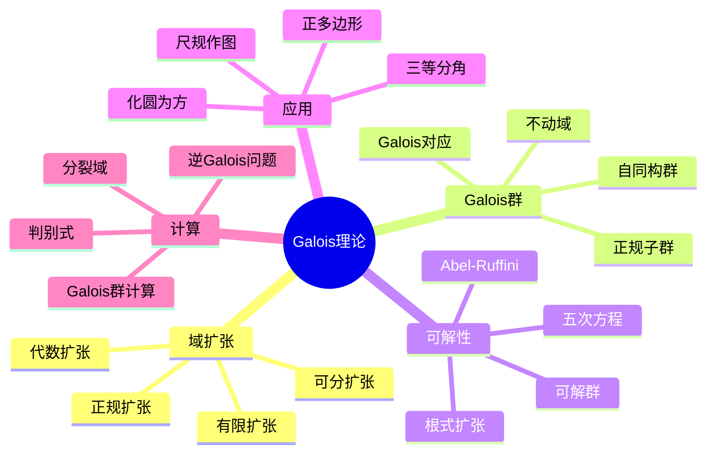

---
references:
  textbooks:
    - id: artin_algebra
      type: textbook
      title: Algebra
msc_primary: 08A99
      authors:
      - Michael Artin
      publisher: Pearson
      edition: 2nd
      year: 2011
      isbn: 978-0132413770
      msc: 16-01
      chapters: 
      url: ~
    - id: strang_la
      type: textbook
      title: Introduction to Linear Algebra
      authors:
      - Gilbert Strang
      publisher: Wellesley-Cambridge Press
      edition: 5th
      year: 2016
      isbn: 978-0980232776
      msc: 15-01
      chapters: 
      url: ~
    - id: dummit_foote_aa
      type: textbook
      title: Abstract Algebra
      authors:
      - David S. Dummit
      - Richard M. Foote
      publisher: Wiley
      edition: 3rd
      year: 2003
      isbn: 978-0471433347
      msc: 13-01
      chapters: 
      url: ~
  databases:
    - id: nlab
      type: database
      name: nLab
      entry_url: "https://ncatlab.org/nlab/show/{entry}"
      consulted_at: 2026-04-17
    - id: stacks_project
      type: database
      name: Stacks Project
      entry_url: "https://stacks.math.columbia.edu/tag/{tag}"
      consulted_at: 2026-04-17
    - id: zbmath
      type: database
      name: zbMATH Open
      entry_url: "https://zbmath.org/?q=an:{zb_id}"
      consulted_at: 2026-04-17
---
# Galois理论完全指南

## 1. 概念定义

### 1.1 核心概念

**Galois理论**建立了域扩张与群之间的深刻联系，将代数方程的可解性问题转化为群论问题。这是代数学中最美丽的理论之一，揭示了代数结构背后的对称性。

> **定义 1.1.1 (域扩张)**：设 $F \subset E$ 为域的包含关系，称 $E$ 为 $F$ 的**域扩张**，记作 $E/F$。扩张次数定义为 $[E:F] = \dim_F E$（作为 $F$-向量空间的维数）。

> **定义 1.1.2 (代数扩张)**：扩张 $E/F$ 称为**代数扩张**，若 $E$ 中每个元素都是 $F$ 上的代数元（即满足某个 $F$ 系数多项式）。

> **定义 1.1.3 (Galois群)**：设 $E/F$ 为域扩张，$E$ 的保持 $F$ 不动的自同构群称为**Galois群**：
> $$\text{Gal}(E/F) = \{\sigma \in \text{Aut}(E) : \sigma|_F = \text{id}_F\}$$

> **定义 1.1.4 (Galois扩张)**：代数扩张 $E/F$ 称为**Galois扩张**，若 $E^{\text{Gal}(E/F)} = F$，即 $F$ 恰为Galois群的不动域。

### 1.2 概念分类

```
Galois理论核心内容
├── 域扩张基础
│   ├── 单扩张与代数元
│   ├── 有限扩张与塔定理
│   ├── 代数闭包与分裂域
│   └── 正规扩张与可分扩张
├── Galois对应
│   ├── 子群↔子域
│   ├── 正规子群↔正规扩张
│   └── 合成列与可解性
├── 可解性理论
│   ├── 根式扩张
│   ├── 可解群
│   ├── Abel-Ruffini定理
│   └── 五次方程不可解
└── 经典应用
    ├── 三等分角不可能
    ├── 倍立方不可能
    ├── 化圆为方不可能
    └── 正多边形可作图性
```

---

## 2. 定理证明

### 2.1 塔定理（次数乘法公式）

> **定理 2.1.1 (塔定理)**：设 $F \subset K \subset E$ 为域塔，则
> $$[E:F] = [E:K][K:F]$$

**证明**：

设 $\{\alpha_i\}_{i=1}^m$ 为 $K$ 在 $F$ 上的基，$\{\beta_j\}_{j=1}^n$ 为 $E$ 在 $K$ 上的基。

**步骤1**：证明 $\{\alpha_i\beta_j\}$ 张成 $E$ 作为 $F$-向量空间。
对任意 $x \in E$，存在 $k_j \in K$ 使得 $x = \sum_j k_j\beta_j$。
对每个 $k_j$，存在 $f_{ij} \in F$ 使得 $k_j = \sum_i f_{ij}\alpha_i$。
因此
$$x = \sum_j\left(\sum_i f_{ij}\alpha_i\right)\beta_j = \sum_{i,j}f_{ij}(\alpha_i\beta_j)$$

**步骤2**：证明线性无关性。
设 $\sum_{i,j}f_{ij}\alpha_i\beta_j = 0$，则
$$\sum_j\left(\sum_i f_{ij}\alpha_i\right)\beta_j = 0$$
由 $\{\beta_j\}$ 在 $K$ 上线性无关，得 $\sum_i f_{ij}\alpha_i = 0$ 对所有 $j$。
再由 $\{\alpha_i\}$ 在 $F$ 上线性无关，得 $f_{ij} = 0$。 $\square$

### 2.2 Artin引理

> **定理 2.2.1 (Artin引理)**：设 $G$ 为域 $E$ 的自同构有限群，$F = E^G$ 为不动域，则 $[E:F] \leq |G|$。

**证明概要**：

设 $|G| = n$，$G = \{\sigma_1, \ldots, \sigma_n\}$。假设存在 $n+1$ 个 $F$-线性无关元 $u_1, \ldots, u_{n+1} \in E$。

考虑方程组（Dedekind无关性引理）：
$$\sum_{j=1}^{n+1}\sigma_i(u_j)x_j = 0, \quad i = 1, \ldots, n$$

有非零解 $(x_1, \ldots, x_{n+1})$。取使非零分量最少的解，不妨设 $x_{n+1} = 1$。

由 $
\sigma_k(\sum_j\sigma_i(u_j)x_j) = \sum_j\sigma_k\sigma_i(u_j)\sigma_k(x_j) = 0$，通过比较可证所有 $x_j \in F$，与 $u_j$ 的线性无关性矛盾。 $\square$

### 2.3 Galois对应基本定理

> **定理 2.3.1 (Galois对应)**：设 $E/F$ 为有限Galois扩张，$G = \text{Gal}(E/F)$，则
>
> 1. 存在反序双射（Galois对应）：
>    $$\{\text{子群 } H \leq G\} \longleftrightarrow \{\text{中间域 } F \subset K \subset E\}$$
>    由 $H \mapsto E^H$ 和 $K \mapsto \text{Gal}(E/K)$ 给出。
> 2. $[E:E^H] = |H|$，$[E^H:F] = [G:H]$。
> 3. $H \trianglelefteq G$ 当且仅当 $E^H/F$ 是Galois扩张，此时 $\text{Gal}(E^H/F) \cong G/H$。

**证明要点**：

**步骤1**：证 $H = \text{Gal}(E/E^H)$。由定义 $H \subset \text{Gal}(E/E^H)$，再由Artin引理：
$$|H| \geq [E:E^H] = |\text{Gal}(E/E^H)| \geq |H|$$

**步骤2**：证 $K = E^{\text{Gal}(E/K)}$。显然 $K \subset E^{\text{Gal}(E/K)}$，再由：
$$[E:K] = |\text{Gal}(E/K)| = [E:E^{\text{Gal}(E/K)}]$$

**步骤3**：正规子群对应正规扩张由定义直接验证。 $\square$

### 2.4 Abel-Ruffini定理

> **定理 2.4.1 (Abel-Ruffini)**：一般五次及以上代数方程没有根式解。

**证明概要**：

**步骤1**：设 $f(x) = x^n - t_1x^{n-1} + t_2x^{n-2} - \cdots + (-1)^n t_n$ 为一般 $n$ 次多项式，系数在 $F = k(t_1, \ldots, t_n)$ 上。

**步骤2**：$f$ 的分裂域 $E$ 满足 $\text{Gal}(E/F) \cong S_n$。

**步骤3**：方程有根式解当且仅当Galois群是可解群。

**步骤4**：$S_n$ 对 $n \geq 5$ 不可解，因为 $A_n$（交错群）是单群。 $\square$

---

## 3. 推导过程

### 3.1 分裂域的构造

设 $f(x) \in F[x]$，$\deg f = n$。

**构造算法**：

1. 取 $f$ 的不可约因子 $p_1$，构造 $F_1 = F[x]/(p_1)$，$f$ 在 $F_1$ 中有根 $\alpha_1$。
2. 在 $F_1[x]$ 中分解 $f(x) = (x-\alpha_1)g(x)$。
3. 对 $g(x)$ 重复上述过程，直至完全分裂。
4. 所得域 $E = F(\alpha_1, \ldots, \alpha_n)$ 即为分裂域。

**唯一性**：任意两个分裂域之间存在 $F$-同构。

### 3.2 可分扩张与判别式

> **定义**：代数元 $\alpha$ 在 $F$ 上**可分**，若其极小多项式无重根。

**判别式判据**：设 $f(x) = \prod_{i=1}^n(x-\alpha_i)$，则
$$\Delta = \prod_{i<j}(\alpha_i - \alpha_j)^2$$
$f$ 有重根当且仅当 $\Delta = 0$。

**完全判别式公式**（对 $f(x) = x^n + a_{n-1}x^{n-1} + \cdots + a_0$）：
$$\Delta = (-1)^{n(n-1)/2}\text{Res}(f, f')$$
其中Res表示结式（resultant）。

### 3.3 尺规作图与域扩张

**可作图数**：从 $\{0, 1\}$ 出发，经尺规作图可构造的复数。

**定理**：$z \in \mathbb{C}$ 可作图当且仅当存在域塔
$$\mathbb{Q} = F_0 \subset F_1 \subset \cdots \subset F_n \subset \mathbb{C}$$
使得 $z \in F_n$ 且 $[F_i:F_{i-1}] \in \{1, 2\}$。

**推论**：可作图数构成 $\mathbb{C}$ 的二次闭包。

---

## 4. 概念关系



### 4.1 Galois对应图示

```
                     E (整个域)
                     │
           ┌─────────┼─────────┐
           │         │         │
          K₁        K₂        K₃    (中间域)
           │         │         │
           ├────┬────┼────┬────┤
           │    │    │    │    │
          L₁   L₂   L₃   L₄   L₅  (更多中间域)
           │    │    │    │    │
           └────┴────┴────┴────┘
                     │
                     F (基域)

对应Galois群子群格：

                     {e}
                     │
           ┌─────────┼─────────┐
           │         │         │
          H₁        H₂        H₃
           │         │         │
           ├────┬────┼────┬────┤
           │    │    │    │    │
          J₁   J₂   J₃   J₄   J₅
           │    │    │    │    │
           └────┴────┴────┴────┘
                     │
                     G = Gal(E/F)
```

---

## 5. 应用实例

### 5.1 三等分角不可能性

**定理**：60°角不能用尺规三等分。

**证明**：

三等分60°等价于构造 $\cos 20°$。由三倍角公式：
$$\cos 60° = 4\cos^3 20° - 3\cos 20°$$
即 $\frac{1}{2} = 4x^3 - 3x$，或 $8x^3 - 6x - 1 = 0$。

令 $y = 2x$，得 $y^3 - 3y - 1 = 0$。

该多项式在 $\mathbb{Q}$ 上不可约（Eisenstein判别法对平移后）。设 $\alpha$ 为根，则 $[\mathbb{Q}(\alpha):\mathbb{Q}] = 3$。

若 $\alpha$ 可作图，则 $[\mathbb{Q}(\alpha):\mathbb{Q}]$ 应为2的幂，矛盾。 $\square$

### 5.2 倍立方不可能性

**定理**：不能用尺规作出体积为2的立方体的边长（即 $\sqrt[3]{2}$）。

**证明**：$[\mathbb{Q}(\sqrt[3]{2}):\mathbb{Q}] = 3$ 不是2的幂。 $\square$

### 5.3 化圆为方不可能性

**定理**：不能用尺规作出与给定圆等面积的正方形。

**证明**：等价于构造 $\sqrt{\pi}$。由于 $\pi$ 是超越数（Lindemann-Weierstrass定理），不可能在有限代数扩张中。 $\square$

### 5.4 正多边形可作图性

**定理 (Gauss)**：正 $n$ 边形可作图当且仅当
$$n = 2^k p_1 \cdots p_m$$
其中 $p_i$ 为互异Fermat素数（形如 $2^{2^r}+1$）。

**例子**：正17边形可作图（Gauss 1796年发现）。

### 5.5 具体Galois群计算

**例**：求 $f(x) = x^4 - 2$ 在 $\mathbb{Q}$ 上的Galois群。

**解**：

1. 根为 $\sqrt[4]{2}, i\sqrt[4]{2}, -\sqrt[4]{2}, -i\sqrt[4]{2}$。
2. 分裂域 $E = \mathbb{Q}(\sqrt[4]{2}, i)$。
3. $[E:\mathbb{Q}] = 8$，故 $|G| = 8$。
4. $G \cong D_4$（二面体群），由 $\sigma: \sqrt[4]{2} \mapsto i\sqrt[4]{2}$ 和 $\tau: i \mapsto -i$ 生成。

---

## 6. 参考文献与链接

### 6.1 经典教材

1. **Artin, E.** (1991). *Galois Theory* (2nd ed.). Dover.
2. **Stewart, I.** (2004). *Galois Theory* (3rd ed.). Chapman & Hall/CRC.
3. **Lang, S.** (2002). *Algebra* (Rev. 3rd ed.). Springer. (Chapter VI)
4. **Morandi, P.** (1996). *Field and Galois Theory*. Springer.
5. **Cox, D. A.** (2012). *Galois Theory* (2nd ed.). Wiley.

### 6.2 历史文献

1. **Edwards, H. M.** (1984). *Galois Theory*. Springer.（含Galois原著翻译）
2. **Tignol, J. P.** (2001). *Galois' Theory of Algebraic Equations*. World Scientific.

### 6.3 相关概念链接

| 概念 | 链接 |
|------|------|
| 群论基础 | [../01-基础数学/群论基础](../01-基础数学/群论基础.md) |
| 环论 | [../02-代数学/环论基础](../02-代数学/环论基础.md) |
| 域论 | [../02-代数学/域论基础](../02-代数学/域论基础.md) |
| 多项式理论 | [../01-基础数学/多项式理论](../01-基础数学/多项式理论.md) |
| 可解群 | [../02-代数学/可解群与幂零群](../02-代数学/可解群与幂零群.md) |
| 代数数论 | [../02-代数学/代数数论基础](../02-代数学/代数数论基础.md) |
| 表示论 | [../02-代数学/21-表示论入门到精通](../02-代数学/21-表示论入门到精通.md) |

### 6.4 进阶主题

```
Galois理论
    │
    ├──→ 无限Galois理论
    │       ├── Krull拓扑
    │       └── profinite群
    │
    ├──→ 微分Galois理论
    │       ├── 线性微分方程
    │       └── Picard-Vessiot扩张
    │
    ├──→ 逆Galois问题
    │       ├── 数域上的实现
    │       └── 有理函数域
    │
    └──→ 高维Galois理论
            └── 概形的étale基本群
```

---

## 附录：常用Galois群表

| 多项式 | Galois群 | 条件 |
|--------|----------|------|
| $x^n - a$ | 循环群或二面体群 | 视根式域结构 |
| $x^3 + px + q$ | $S_3$ 或 $A_3$ | 判别式是否为平方 |
| $x^4 + ax^2 + b$ | $D_4$, $V_4$, $C_4$, 或 $S_4$ | 视 resolvent cubic |
| 一般 $n$ 次 | $S_n$ | 一般情形 |
| 分圆多项式 $\Phi_n$ | $(\mathbb{Z}/n\mathbb{Z})^\times$ | 阿贝尔群 |

### 可解群判别

群 $G$ 可解 $\Leftrightarrow$ 存在正规列
$$G = G_0 \triangleright G_1 \triangleright \cdots \triangleright G_n = \{e\}$$
使得 $G_i/G_{i+1}$ 为阿贝尔群。

$S_n$ 可解当且仅当 $n \leq 4$。

---

*文档编号：20 | MSC2020分类：12F10 Galois理论 | 创建日期：2026年4月*
