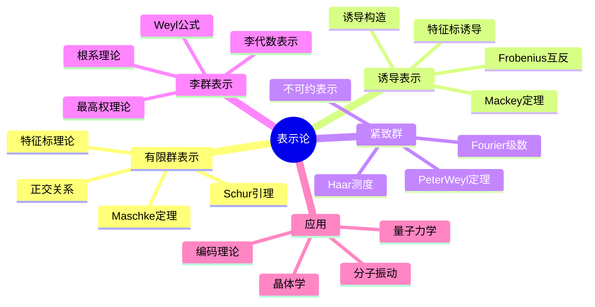

---
references:
  textbooks:
    - id: artin_algebra
      type: textbook
      title: Algebra
msc_primary: 08A99
      authors:
      - Michael Artin
      publisher: Pearson
      edition: 2nd
      year: 2011
      isbn: 978-0132413770
      msc: 16-01
      chapters: 
      url: ~
    - id: strang_la
      type: textbook
      title: Introduction to Linear Algebra
      authors:
      - Gilbert Strang
      publisher: Wellesley-Cambridge Press
      edition: 5th
      year: 2016
      isbn: 978-0980232776
      msc: 15-01
      chapters: 
      url: ~
    - id: dummit_foote_aa
      type: textbook
      title: Abstract Algebra
      authors:
      - David S. Dummit
      - Richard M. Foote
      publisher: Wiley
      edition: 3rd
      year: 2003
      isbn: 978-0471433347
      msc: 13-01
      chapters: 
      url: ~
  databases:
    - id: nlab
      type: database
      name: nLab
      entry_url: "https://ncatlab.org/nlab/show/{entry}"
      consulted_at: 2026-04-17
    - id: stacks_project
      type: database
      name: Stacks Project
      entry_url: "https://stacks.math.columbia.edu/tag/{tag}"
      consulted_at: 2026-04-17
    - id: zbmath
      type: database
      name: zbMATH Open
      entry_url: "https://zbmath.org/?q=an:{zb_id}"
      consulted_at: 2026-04-17
---
# 表示论入门到精通

## 1. 概念定义

### 1.1 核心概念

**表示论**研究抽象代数结构（群、代数、李代数等）在线性空间上的作用，将抽象的代数对象转化为具体的线性变换。这一转化使得抽象的代数问题可以用线性代数的工具来解决。

> **定义 1.1.1 (群表示)**：设 $G$ 为群，$V$ 为域 $\mathbb{F}$ 上的向量空间。**群表示**是群同态
> $$\rho: G \to \text{GL}(V)$$
> 其中 $\text{GL}(V)$ 是 $V$ 上的可逆线性变换群。称 $V$ 为**表示空间**，$\dim V$ 为表示的**维数**。

> **定义 1.1.2 (不变子空间)**：子空间 $W \subset V$ 称为**不变子空间**（或子表示），若对所有 $g \in G$ 有 $\rho(g)(W) \subset W$。

> **定义 1.1.3 (不可约表示)**：非零表示 $(\rho, V)$ 称为**不可约**（irreducible），若 $V$ 没有非平凡的不变子空间。

> **定义 1.1.4 (特征标)**：表示 $\rho: G \to \text{GL}(V)$ 的**特征标**定义为
> $$\chi_\rho(g) = \text{tr}(\rho(g))$$
> 是 $G$ 上的类函数（在共轭类上取常值）。

### 1.2 概念分类

```
表示论核心内容
├── 有限群表示论
│   ├── 复表示与Maschke定理
│   ├── 特征标理论
│   ├── 正交关系
│   └── Burnside定理
├── 诱导表示
│   ├── 诱导表示构造
│   ├── Frobenius互反性
│   └── Mackey定理
├── 连续群表示
│   ├── 拓扑群表示
│   ├── 紧致群表示
│   └── Peter-Weyl定理
├── 李群李代数表示
│   ├── 李代数表示
│   ├── 最高权理论
│   └── Weyl特征标公式
└── 应用方向
    ├── 分子振动分析
    ├── 量子力学对称性
    ├── 晶体学
    └── 编码理论
```

---

## 2. 定理证明

### 2.1 Maschke定理

> **定理 2.1.1 (Maschke)**：设 $G$ 为有限群，$\mathbb{F}$ 为特征不整除 $|G|$ 的域，则 $G$ 在 $\mathbb{F}$ 上的每个有限维表示都完全可约（即分解为不可约表示的直和）。

**证明**：

设 $W \subset V$ 为不变子空间，需证存在不变补空间 $W'$ 使得 $V = W \oplus W'$。

**步骤1**：取任意线性投影 $P: V \to W$（不要求 $G$-线性）。

**步骤2**：定义平均化算子
$$P^G(v) = \frac{1}{|G|}\sum_{g \in G}\rho(g)^{-1}P(\rho(g)v)$$

**步骤3**：验证 $P^G$ 是 $G$-线性投影到 $W$。
对任意 $h \in G$：
\begin{align}
P^G(\rho(h)v) &= \frac{1}{|G|}\sum_{g \in G}\rho(g)^{-1}P(\rho(g)\rho(h)v) \\
&= \frac{1}{|G|}\sum_{g \in G}\rho(h)\rho(gh)^{-1}P(\rho(gh)v) \\
&= \rho(h)P^G(v)
\end{align}

**步骤4**：$\ker P^G$ 为所求不变补空间。$\square$

### 2.2 Schur引理

> **定理 2.2.1 (Schur引理)**：设 $(\rho_1, V_1)$ 和 $(\rho_2, V_2)$ 为不可约表示，$T: V_1 \to V_2$ 为 intertwining 算子（即 $T\rho_1(g) = \rho_2(g)T$ 对所有 $g \in G$），则
>
> 1. 若 $V_1 \not\cong V_2$，则 $T = 0$。
> 2. 若 $V_1 = V_2$，则 $T = \lambda I$ 对某个 $\lambda \in \mathbb{F}$。

**证明**：

**第一部分**：$\ker T$ 是 $V_1$ 的不变子空间（若 $Tv = 0$，则 $T(\rho_1(g)v) = \rho_2(g)Tv = 0$）。由不可约性，$\ker T = 0$ 或 $V_1$。

同理 $\text{im}\,T$ 是 $V_2$ 的不变子空间，故 $\text{im}\,T = 0$ 或 $V_2$。

若 $T \neq 0$，则 $\ker T = 0$ 且 $\text{im}\,T = V_2$，即 $T$ 为同构。因此 $V_1 \cong V_2$。

**第二部分**：设 $\lambda$ 为 $T$ 的特征值（代数闭域），则 $T - \lambda I$ 有非零核，由第一部分知 $T - \lambda I = 0$。$\square$

### 2.3 特征标正交关系

> **定理 2.3.1 (第一正交关系)**：设 $\chi_i, \chi_j$ 为不可约复表示的特征标，则
> $$\frac{1}{|G|}\sum_{g \in G}\chi_i(g)\overline{\chi_j(g)} = \delta_{ij}$$

**证明**：

设 $V_i, V_j$ 为相应表示空间。对任意线性映射 $T: V_j \to V_i$，定义
$$T^G = \frac{1}{|G|}\sum_{g \in G}\rho_i(g)^{-1}T\rho_j(g)$$

由Schur引理：

- 若 $i \neq j$，则 $T^G = 0$。
- 若 $i = j$，则 $T^G = \frac{\text{tr}(T)}{\dim V_i}I$。

取矩阵元 $(T^G)_{kl}$ 并适当选取 $T$ 即得正交关系。$\square$

> **定理 2.3.2 (第二正交关系)**：设 $g, h \in G$，则
> $$\sum_{\chi \in \hat{G}}\chi(g)\overline{\chi(h)} = \begin{cases} |C_G(g)| & \text{若 } g \sim h \\ 0 & \text{否则} \end{cases}$$
> 其中 $\hat{G}$ 为不可约特征标集，$C_G(g)$ 为 $g$ 的中心化子。

### 2.4 Frobenius互反性

> **定理 2.4.1 (Frobenius互反)**：设 $H \leq G$，$\psi$ 为 $H$ 的表示，$\chi$ 为 $G$ 的表示，则
> $$\langle \text{Ind}_H^G \psi, \chi \rangle_G = \langle \psi, \text{Res}_H^G \chi \rangle_H$$

---

## 3. 推导过程

### 3.1 正则表示的分解

**左正则表示**：$L: G \to \text{GL}(\mathbb{C}[G])$，$(L(g)f)(h) = f(g^{-1}h)$。

**分解定理**：正则表示分解为
$$\mathbb{C}[G] \cong \bigoplus_{i=1}^k (\dim V_i)V_i$$
其中 $V_i$ 取遍所有互不等价的不可约表示。

**维数公式**：由比较维数得
$$|G| = \sum_{i=1}^k (\dim V_i)^2$$

### 3.2 特征标表的构造

特征标表是 $|G| \times |G|$ 矩阵（以共轭类为行/列索引），元素为特征标值。

**构造算法**：

1. 确定共轭类 $C_1, \ldots, C_k$ 及其大小。
2. 一维表示：$G/[G,G]$ 的特征标。
3. 高维表示：利用正交关系、诱导表示、特征标性质。
4. 验证：列正交性、维数平方和。

### 3.3 诱导表示的构造

设 $H \leq G$，$\rho: H \to \text{GL}(W)$。

**诱导表示空间**：
$$\text{Ind}_H^G W = \{f: G \to W : f(gh) = \rho(h)^{-1}f(g), \forall h \in H\}$$

或等价地
$$\text{Ind}_H^G W \cong \mathbb{C}[G] \otimes_{\mathbb{C}[H]} W$$

**诱导特征标公式 (Frobenius)**：
$$\chi_{\text{Ind}_H^G \rho}(g) = \frac{1}{|H|}\sum_{\substack{x \in G \\ x^{-1}gx \in H}}\chi_\rho(x^{-1}gx)$$

---

## 4. 概念关系



### 4.1 表示论知识网络

```
                     群作用
                        │
           +------------+------------+
           │                         │
       置换表示                线性表示
           │                         │
      正则表示                   一般表示
           │                         │
      分解理论 <----------------  Maschke定理
           │                         │
      不可约表示 <-------------- Schur引理
           │                         │
      +----+----+                    │
      │         │                    │
  特征标理论  张量运算           诱导/限制
      │         │                    │
  特征标表   对称/反对称         Frobenius互反
      │         │                    │
  Burnside   外代数           Mackey定理
  p^a q^b    表示环           投射表示
   定理                            │
                              Clifford理论
```

---

## 5. 应用实例

### 5.1 分子振动分析

**问题**：$H_2O$ 分子的振动模式分析。

**对称性**：$H_2O$ 具有 $C_{2v}$ 对称性（二重轴 + 两个镜面）。

**方法**：

1. 确定原子位移空间的表示（9维：3个原子 × 3坐标）。
2. 分解为平动、转动、振动子空间。
3. 利用特征标表将振动空间分解为不可约表示。

**结果**：3个振动模式：

- 对称伸缩：$A_1$ 对称性
- 反对称伸缩：$B_2$ 对称性
- 弯曲振动：$A_1$ 对称性

### 5.2 量子力学：角动量

**旋转群表示**：$SO(3)$ 的不可约表示对应于角动量量子数 $l = 0, 1, 2, \ldots$。

表示维数：$\dim V_l = 2l + 1$（对应磁量子数 $m = -l, \ldots, l$）。

**角动量算符**：
$$[J_i, J_j] = i\hbar\epsilon_{ijk}J_k$$

这与 $so(3)$ 李代数表示一一对应。

### 5.3 晶体学：空间群

**230个空间群**描述晶体的对称性，其表示决定：

- 能带结构的对称性
- 选择定则
- 相变理论

**Bloch定理**：周期势中电子波函数
$$\psi_{\mathbf{k}}(\mathbf{r} + \mathbf{R}) = e^{i\mathbf{k}\cdot\mathbf{R}}\psi_{\mathbf{k}}(\mathbf{r})$$
这是平移群的不可约表示。

### 5.4 对称群的特征标计算

**例**：$S_3$（3阶对称群）。

共轭类：$\{e\}$（1个），$(12)$（3个），$(123)$（2个）。

不可约表示：

- 平凡表示 $\chi_1$：$(1, 1, 1)$
- 符号表示 $\chi_2$：$(1, -1, 1)$
- 标准表示 $\chi_3$：$(2, 0, -1)$（2维）

验证正交关系：
$$\langle \chi_3, \chi_3 \rangle = \frac{1}{6}(1 \cdot 2^2 + 3 \cdot 0^2 + 2 \cdot (-1)^2) = 1$$

### 5.5 量子色动力学中的表示

$SU(3)$ 的表示分类（夸克的色对称性）：

- 基本表示 $\mathbf{3}$：夸克三色（红、绿、蓝）
- 反基本表示 $\bar{\mathbf{3}}$：反夸克
- 伴随表示 $\mathbf{8}$：胶子（无色的色单态）

**色禁闭**：物理态必须是色单态（$SU(3)$ 的平凡表示）。

---

## 6. 参考文献与链接

### 6.1 经典教材

1. **Serre, J. P.** (1977). *Linear Representations of Finite Groups*. Springer.
2. **Fulton, W., & Harris, J.** (1991). *Representation Theory: A First Course*. Springer.
3. **James, G., & Liebeck, M.** (2001). *Representations and Characters of Groups* (2nd ed.). Cambridge.
4. **Etingof, P., et al.** (2011). *Introduction to Representation Theory*. AMS.
5. **Knapp, A. W.** (2001). *Representation Theory of Semisimple Groups*. Princeton.

### 6.2 物理应用

1. **Cornwell, J. F.** (1997). *Group Theory in Physics* (3 vols.). Academic Press.
2. **Hamermesh, M.** (1989). *Group Theory and Its Application to Physical Problems*. Dover.
3. **Tinkham, M.** (2003). *Group Theory and Quantum Mechanics*. Dover.

### 6.3 相关概念链接

| 概念 | 链接 |
|------|------|
| 群论基础 | [../01-基础数学/群论基础](../01-基础数学/群论基础.md) |
| 线性代数 | [../01-基础数学/线性代数](../01-基础数学/线性代数.md) |
| 特征标理论 | [../02-代数学/特征标理论详解](../02-代数学/特征标理论详解.md) |
| 李代数 | [../02-代数学/李代数基础](../02-代数学/李代数基础.md) |
| Galois理论 | [../02-代数学/20-Galois理论完全指南](../02-代数学/20-Galois理论完全指南.md) |
| 量子力学 | [../08-数学物理/量子力学基础](../08-数学物理/量子力学基础.md) |
| 调和分析 | [../03-分析学/抽象调和分析](../03-分析学/抽象调和分析.md) |

### 6.4 进阶主题

```
表示论
    │
    ├──→ 模表示论
    │       ├── Brauer特征标
    │       └── 分解矩阵
    │
    ├──→ 同调方法
    │       ├── 群上同调
    │       └── Ext与Tor
    │
    ├──→ 代数群表示
    │       ├── 最高权理论
    │       └── Kazhdan-Lusztig理论
    │
    └──→ 几何表示论
            ├── D-模
            ├── 反常层
            └── Langlands纲领
```

---

## 附录：常用有限群特征标表

### $S_3$（3阶对称群）

| 共轭类 | $e$ | $(12)$ | $(123)$ |
|--------|-----|--------|---------|
| 大小 | 1 | 3 | 2 |
| $\chi_1$ (平凡) | 1 | 1 | 1 |
| $\chi_2$ (符号) | 1 | -1 | 1 |
| $\chi_3$ (标准) | 2 | 0 | -1 |

### $S_4$（4阶对称群）

| 共轭类 | $e$ | $(12)$ | $(12)(34)$ | $(123)$ | $(1234)$ |
|--------|-----|--------|------------|---------|----------|
| $\chi_1$ | 1 | 1 | 1 | 1 | 1 |
| $\chi_2$ | 1 | -1 | 1 | 1 | -1 |
| $\chi_3$ | 2 | 0 | 2 | -1 | 0 |
| $\chi_4$ | 3 | 1 | -1 | 0 | -1 |
| $\chi_5$ | 3 | -1 | -1 | 0 | 1 |

### $D_4$（8阶二面体群）

| 共轭类 | $e$ | $r^2$ | $r^{\pm 1}$ | $s$ | $rs$ |
|--------|-----|-------|-------------|-----|------|
| $\chi_1$ | 1 | 1 | 1 | 1 | 1 |
| $\chi_2$ | 1 | 1 | 1 | -1 | -1 |
| $\chi_3$ | 1 | 1 | -1 | 1 | -1 |
| $\chi_4$ | 1 | 1 | -1 | -1 | 1 |
| $\chi_5$ | 2 | -2 | 0 | 0 | 0 |

---

*文档编号：21 | MSC2020分类：@ 群表示论 | 创建日期：2026年4月*
