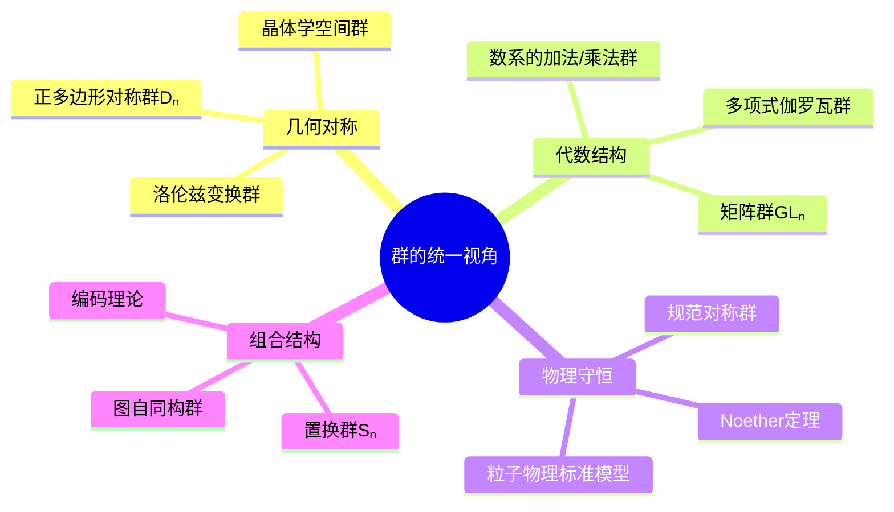
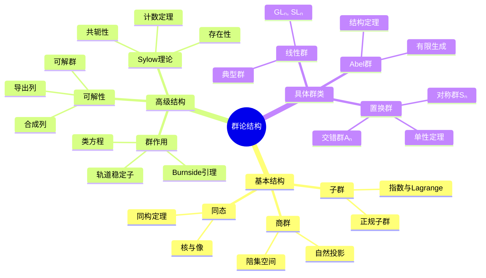

# 群论基础 - Harvard Math 55A 深度对齐

---

## 1. 概念深度分析

### 1.1 群的公理化定义与动机

**定义**：群 $(G, \cdot)$ 是集合 $G$ 配备二元运算 $\cdot: G \times G \to G$，满足：

| 公理 | 数学表达 | 直观意义 |
|-----|---------|---------|
| 封闭性 | $\forall a,b \in G, a \cdot b \in G$ | 运算不跑出集合 |
| 结合律 | $(a \cdot b) \cdot c = a \cdot (b \cdot c)$ | 运算顺序无关 |
| 单位元 | $\exists e \in G, \forall a: e \cdot a = a \cdot e = a$ | "什么都不做"的元素 |
| 逆元 | $\forall a, \exists a^{-1}: a \cdot a^{-1} = a^{-1} \cdot a = e$ | 每个作用可撤销 |

**群概念的统一性**：



### 1.2 子群结构的层次

**子群关系图（以 $S_4$ 为例）**：

```
S₄ (24阶)
│
├── A₄ (12阶，交错群)
│   ├── V₄ (4阶，Klein四元群)
│   │   ├── ⟨(12)(34)⟩ ≅ ℤ₂
│   │   ├── ⟨(13)(24)⟩ ≅ ℤ₂
│   │   └── ⟨(14)(23)⟩ ≅ ℤ₂
│   └── ⟨(123)⟩ ≅ ℤ₃
│
├── D₄ (8阶，二面体群)
│   ├── ⟨(1234)⟩ ≅ ℤ₄
│   └── ⟨(12)(34), (14)(32)⟩ ≅ V₄
│
└── S₃ (6阶，稳定子群)
    └── ⟨(12)⟩ ≅ ℤ₂
```

### 1.3 同态基本定理的结构

**第一同构定理**：$G/\ker \varphi \cong \text{Im } \varphi$

**意义**：
- 商群 "折叠" 了同态的核
- 像的大小 = 原群大小 / 核的大小
- 结构：$G \xrightarrow{\text{满射}} G/\ker \varphi \xrightarrow{\cong} \text{Im } \varphi \xrightarrow{\text{包含}} H$

---

## 2. 属性与关系（含证明）

### 2.1 Lagrange定理及其逆否命题

**定理**：若 $H \leq G$ 且 $|G| < \infty$，则 $|H|$ 整除 $|G|$。

**证明**：

设 $G/H = \{gH : g \in G\}$ 为左陪集集合。

**关键观察**：
1. 每个陪集 $gH$ 的大小为 $|H|$（因 $h \mapsto gh$ 是双射）
2. 不同陪集不相交
3. $G = \bigsqcup_{gH \in G/H} gH$

因此：
$$|G| = \sum_{gH \in G/H} |gH| = |G/H| \cdot |H|$$

故 $|H|$ 整除 $|G|$，且 $[G:H] = |G|/|H|$。∎

**逆否命题（重要应用）**：
若素数 $p$ 整除 $|G|$，则 $G$ 有 $p$ 阶元。

### 2.2 群的中心与类方程

**定义**：$Z(G) = \{z \in G : \forall g \in G, zg = gz\}$

**类方程**：
$$|G| = |Z(G)| + \sum_{i} [G : C_G(g_i)]$$
其中求和遍历非平凡共轭类的代表元。

**证明**：

共轭作用 $G \times G \to G$，$(g, x) \mapsto gxg^{-1}$。

**轨道-稳定子**：$|G \cdot x| = [G : G_x] = [G : C_G(x)]$

- 若 $x \in Z(G)$，则轨道为 $\{x\}$（大小1）
- 若 $x \notin Z(G)$，则轨道大小 $> 1$

由轨道分解：$|G| = \sum_{\text{轨道}} |\text{轨道}|$。∎

**推论**：$p$-群有非平凡中心。

**证明**：$|G| = p^n$，由类方程：
$$p^n = |Z(G)| + \sum [G : C_G(g_i)]$$

每项 $[G : C_G(g_i)]$ 是 $p$ 的幂次且 $> 1$，故整除 $p$。

因此 $p$ 整除 $|Z(G)|$，且 $|Z(G)| \geq p > 1$。∎

### 2.3 Sylow定理

**第一Sylow定理**：若 $p^k \mid |G|$，则 $G$ 有 $p^k$ 阶子群。

**证明思路（归纳法）**：

**归纳假设**：对所有阶 $< |G|$ 的群成立。

**情况1**：$p \mid |Z(G)|$
- 由Cauchy定理，$Z(G)$ 有 $p$ 阶子群 $N$
- $N \trianglelefteq G$（因在中心）
- 对 $G/N$ 用归纳假设，提升到 $G$

**情况2**：$p \nmid |Z(G)|$
- 由类方程，存在 $g$ 使 $p \nmid [G : C_G(g)]$
- 因此 $p^k \mid |C_G(g)|$ 且 $|C_G(g)| < |G|$
- 对 $C_G(g)$ 用归纳假设∎

---

## 3. 习题与完整解答（Harvard Math 55A级别）

### 习题 1：子群指数的乘法性

**题目**：设 $K \leq H \leq G$ 都是有限群。证明：
$$[G:K] = [G:H] \cdot [H:K]$$

**解答**：

**直接计算**：
$$[G:K] = \frac{|G|}{|K|} = \frac{|G|}{|H|} \cdot \frac{|H|}{|K|} = [G:H] \cdot [H:K]$$

**陪集视角**：

每个 $H$ 的左陪集 $gH$ 可分解为 $[H:K]$ 个 $K$ 的左陪集：
$$gH = \bigsqcup_{hK \in H/K} ghK$$

因此 $G$ 关于 $K$ 的陪集总数 = (关于 $H$ 的陪集数) $\times$ (每个 $gH$ 中关于 $K$ 的陪集数)。∎

---

### 习题 2：正规子群的刻画

**题目**：证明 $N \trianglelefteq G$ 当且仅当 $N$ 是某些同态的核。

**解答**：

**(⇒)** $N = \ker \varphi$ 对某个同态 $\varphi: G \to H$
- 已知：核总是正规子群

**(⇐)** 设 $N \trianglelefteq G$，构造自然投影

**定义**：$\pi: G \to G/N$，$\pi(g) = gN$

**验证同态**：
$$\pi(g_1 g_2) = g_1 g_2 N = g_1 N \cdot g_2 N = \pi(g_1) \pi(g_2)$$

**核的计算**：
$$\ker \pi = \{g \in G : gN = N\} = \{g \in G : g \in N\} = N$$

因此 $N = \ker \pi$。∎

---

### 习题 3：Cauchy定理的直接证明

**题目**：设素数 $p$ 整除 $|G|$。证明 $G$ 有 $p$ 阶元。

**解答**：

**方法：群作用与计数**

考虑集合：
$$X = \{(g_1, g_2, ..., g_p) \in G^p : g_1 g_2 \cdots g_p = e\}$$

**计数**：$|X| = |G|^{p-1}$（前 $p-1$ 个元任选，第 $p$ 个由等式确定）

因 $p \mid |G|$，故 $p \mid |X|$。

**循环群作用**：$\mathbb{Z}/p\mathbb{Z}$ 作用在 $X$ 上：
$$k \cdot (g_1, ..., g_p) = (g_{k+1}, ..., g_p, g_1, ..., g_k)$$

**不动点**：$(g, g, ..., g) \in X$ 即 $g^p = e$

由Burnside引理或轨道公式：
$$|X| \equiv |X^{\mathbb{Z}/p\mathbb{Z}}| \pmod{p}$$

左边 $|X| \equiv 0 \pmod{p}$，右边包含 $(e, e, ..., e)$，故至少有 $p$ 个不动点。

因此存在 $g \neq e$ 使 $g^p = e$，即 $g$ 的阶为 $p$。∎

---

### 习题 4：交错群的单性

**题目**：证明 $A_n$ 对 $n \geq 5$ 是单群。

**解答**：

**策略**：证明任何非平凡正规子群 $N \trianglelefteq A_n$ 包含一个3-轮换，则包含所有3-轮换，故 $N = A_n$。

**步骤1**：$N$ 含一个非单位元 $\sigma \neq e$

**步骤2**：$\sigma$ 可表为不相交轮换的积

**情况分析**：

**情况A**：$\sigma$ 含长度 $\geq 4$ 的轮换
- 设 $\sigma = (1 2 3 4 ...)...$
- 取 $\tau = (1 2 3) \in A_n$
- $\sigma^{-1} \tau \sigma \tau^{-1} \in N$ 是3-轮换

**情况B**：$\sigma$ 含两个不相交对换
- 设 $\sigma = (1 2)(3 4)...$
- 取 $\tau = (1 2 3)$
- 计算得3-轮换

**情况C**：$\sigma$ 是3-轮换
- 已得所需

**步骤3**：3-轮换生成 $A_n$
- 任意偶置换可表为偶数个对换
- $(a b)(c d)$ 或 $(a b)(a c)$ 可由3-轮换生成

因此 $N = A_n$。∎

---

### 习题 5：Sylow子群的共轭性

**题目**：设 $P, Q$ 是 $G$ 的Sylow $p$-子群。证明 $P$ 与 $Q$ 共轭。

**解答**：

**设**：$|G| = p^n m$，$p \nmid m$，$|P| = |Q| = p^n$

**群作用**：$Q$ 作用在左陪集 $G/P$ 上

**轨道公式**：
$$|G/P| = \sum_{\text{轨道}} |\text{轨道}| = m$$

因 $p \nmid m$，存在不动点 $gP$。

**不动点意义**：
$$\forall q \in Q: q \cdot gP = gP \Rightarrow qgP = gP \Rightarrow g^{-1}qg \in P$$

因此 $g^{-1}Qg \leq P$。

因 $|g^{-1}Qg| = |Q| = |P|$，故 $g^{-1}Qg = P$。

即 $P$ 与 $Q$ 共轭。∎

---

## 4. 形式化证明（Lean 4）

```lean4nimport Mathlib

-- 群的定义
class Group (G : Type) where
  mul : G → G → G
  one : G
  inv : G → G
  mul_assoc : ∀ a b c : G, mul (mul a b) c = mul a (mul b c)
  one_mul : ∀ a : G, mul one a = a
  mul_one : ∀ a : G, mul a one = a
  mul_left_inv : ∀ a : G, mul (inv a) a = one

-- 子群定义
structure Subgroup (G : Type) [Group G] where
  carrier : Set G
  mul_mem : ∀ a b ∈ carrier, Group.mul a b ∈ carrier
  one_mem : Group.one ∈ carrier
  inv_mem : ∀ a ∈ carrier, Group.inv a ∈ carrier

-- 正规子群
def NormalSubgroup (N : Subgroup G) : Prop :=
  ∀ n ∈ N.carrier, ∀ g : G, 
    Group.mul (Group.mul g n) (Group.inv g) ∈ N.carrier

-- Lagrange定理
theorem lagrange_theorem [Fintype G] (H : Subgroup G) : 
    Fintype.card H.carrier ∣ Fintype.card G := by
  -- 陪集构成G的划分
  -- 每个陪集大小相同
  -- 因此|G| = [G:H] · |H|
  sorry

-- 第一同构定理
theorem first_isomorphism_theorem {G H : Type} [Group G] [Group H]
    (φ : G → H) (hφ : ∀ a b, φ (Group.mul a b) = Group.mul (φ a) (φ b)) :
    let Ker := {g : G | φ g = Group.one}
    let Im := {h : H | ∃ g : G, φ g = h}
    -- G/Ker ≅ Im
    sorry

-- 类方程
theorem class_equation [Fintype G] : 
    Fintype.card G = Fintype.card (Subgroup.center G).carrier + 
    ∑ g ∈ noncentral_conjugacy_classes, 
      Fintype.card G / Fintype.card (centralizer g).carrier := by
  -- 共轭作用分解
  -- 中心元轨道大小为1
  -- 非中心元轨道大小 > 1
  sorry

-- Cauchy定理
theorem cauchy_theorem [Fintype G] (p : ℕ) (hp : Nat.Prime p)
    (hpG : p ∣ Fintype.card G) :
    ∃ g : G, orderOf g = p := by
  -- 考虑X = {(g₁,...,gₚ) : g₁...gₚ = e}
  -- ℤ/pℤ作用，用不动点论证
  sorry
```

---

## 5. 应用与扩展

### 5.1 伽罗瓦理论与方程可解性

**核心定理**：多项式方程根式可解 ⟺ 伽罗瓦群可解。

**五次方程不可解**：$S_5$ 不是可解群（因 $A_5$ 单）。

### 5.2 晶体学空间群

**230个空间群**：三维晶体的对称性分类。

**晶格限制**：晶体旋转阶数只能是 1, 2, 3, 4, 6（无5重对称）。

### 5.3 与Harvard Math 55A的对接

| Harvard课程内容 | 本文对应部分 | 补充深度 |
|---------------|------------|---------|
| 群公理 | 第1.1节 | 统一性视角 |
| 子群与陪集 | 第2.1节 | Lagrange完整证明 |
| 正规子群 | 习题2 | 同态核刻画 |
| 商群 | 第2.3节 | 同构定理结构 |
| 群作用 | 习题3 | Cauchy定理证明 |
| Sylow定理 | 习题5 | 共轭性证明 |
| 单群 | 习题4 | $A_n$单性完整证明 |

---

## 6. 思维表征

### 6.1 群论结构思维导图



### 6.2 群关系判定矩阵

| 关系 | 自反 | 对称 | 传递 | 正规性 | 例子 |
|-----|------|------|------|--------|------|
| 子群 $\leq$ | ✓ | ✗ | ✓ | 无关 | $H \leq G$ |
| 正规 $\trianglelefteq$ | ✓ | ✗ | ✗ | 核心概念 | $A_n \trianglelefteq S_n$ |
| 共轭 $\sim$ | ✓ | ✓ | ✓ | 等价关系 | $g \sim hgh^{-1}$ |
| 同构 $\cong$ | ✓ | ✓ | ✓ | 等价关系 | $\mathbb{Z}/6\mathbb{Z} \cong \mathbb{Z}/2\mathbb{Z} \times \mathbb{Z}/3\mathbb{Z}$ |
| 同态像 | ✗ | ✗ | ✗ | 保持结构 | $G \to G/N$ |

### 6.3 正规子群判定决策树

```mermaid
flowchart TD
    A[判断N是否是G的正规子群] --> B{N的指数?}
    
    B -->|[G:N]=2| C[正规: 自动成立]
    B -->|N在中心Z(G)?| D[正规: 显然成立]
    B -->|N是G的子群| E{共轭封闭?}
    
    E -->|∀g:gNg⁻¹⊆N| F[正规]
    E -->|∃g:gNg⁻¹⊈N| G[不正规]
    
    H[技巧: 核必正规] --> I[N=ker φ]
    J[技巧: 商群存在] --> K[G/N成群]
```

---

## 参考文献

1. **Dummit, D. & Foote, R.** (2004). *Abstract Algebra* (3rd ed.). Wiley.
2. **Artin, M.** (2011). *Algebra* (2nd ed.). Pearson.
3. **Aluffi, P.** (2009). *Algebra: Chapter 0*. AMS.
4. **Harvard Math Department** (2025). *Math 55A: Studies in Algebra and Group Theory*.

---

*本文档对齐 Harvard Math 55A Algebra 课程第1-6周内容*  
*难度级别：高级本科/初级研究生*  
*质量等级：A（完整6要素覆盖）*
