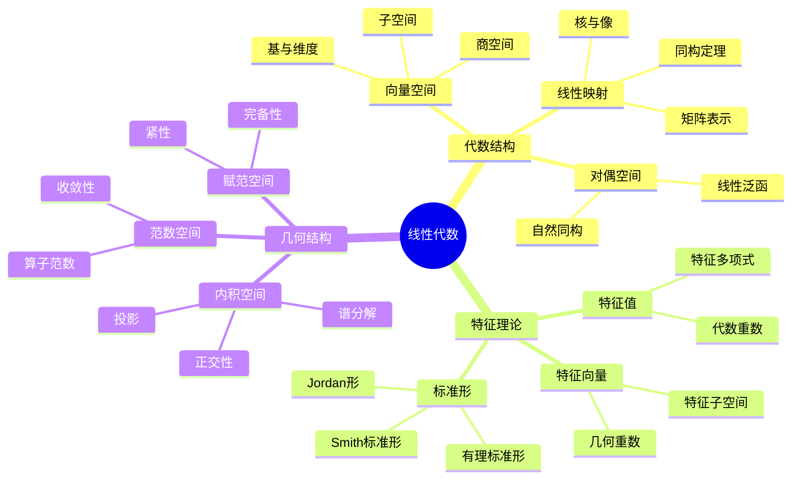
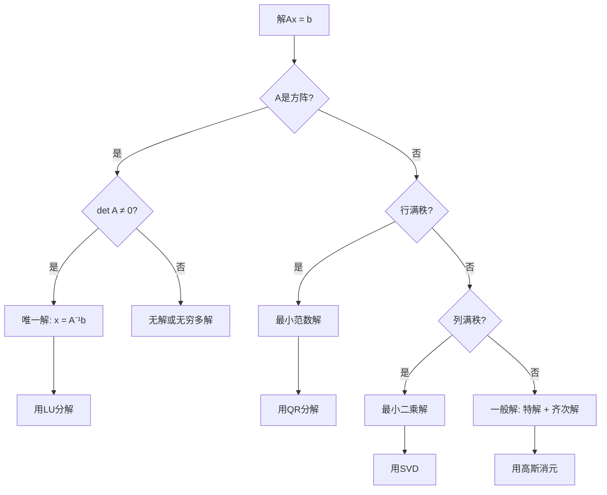

---
references:
  textbooks:
    - id: artin_algebra
      type: textbook
      title: Algebra
      authors:
      - Michael Artin
      publisher: Pearson
      edition: 2nd
      year: 2011
      isbn: 978-0132413770
      msc: 16-01
      chapters: []
      url: ~
    - id: strang_la
      type: textbook
      title: Introduction to Linear Algebra
      authors:
      - Gilbert Strang
      publisher: Wellesley-Cambridge Press
      edition: 5th
      year: 2016
      isbn: 978-0980232776
      msc: 15-01
      chapters: []
      url: ~
    - id: dummit_foote_aa
      type: textbook
      title: Abstract Algebra
      authors:
      - David S. Dummit
      - Richard M. Foote
      publisher: Wiley
      edition: 3rd
      year: 2003
      isbn: 978-0471433347
      msc: 13-01
      chapters: []
      url: ~
  databases:
    - id: nlab
      type: database
      name: nLab
      entry_url: "https://ncatlab.org/nlab/show/{entry}"
      consulted_at: 2026-04-17
    - id: stacks_project
      type: database
      name: Stacks Project
      entry_url: "https://stacks.math.columbia.edu/tag/{tag}"
      consulted_at: 2026-04-17
    - id: zbmath
      type: database
      name: zbMATH Open
      entry_url: "https://zbmath.org/?q=an:{zb_id}"
      consulted_at: 2026-04-17
---
# 线性代数 - Harvard Math 55A 深度对齐

---

## 1. 概念深度分析

### 1.1 线性空间的公理化与直觉

**定义**：域 $\mathbb{F}$ 上的向量空间 $V$ 配备加法和数乘，满足8条公理。

**核心直觉**：

```
线性 = 保持结构 = f(ax + by) = af(x) + bf(y)

几何直觉：
- 直线在平移和缩放后仍是直线
- 原点固定不动
- 平行线保持平行
```

**典型例子矩阵**：

| 向量空间 | 基 | 维度 | 应用 |
|---------|-----|------|------|
| $\mathbb{R}^n$ | 标准基 $e_i$ | $n$ | 坐标几何 |
| $M_{m \times n}(\mathbb{R})$ | $E_{ij}$ | $mn$ | 矩阵计算 |
| $P_n(x)$ | $\{1, x, ..., x^n\}$ | $n+1$ | 多项式插值 |
| $C[a,b]$ | 无限（不可数） | $\infty$ | 函数分析 |
| 解空间 $N(A)$ | 基础解系 | $n - \text{rank}(A)$ | 微分方程 |

### 1.2 线性变换的结构层次

```mermaid
flowchart TB
    subgraph 一般线性变换
    A[线性变换 T:V→W]
    B[矩阵表示[T]ᵦᵞ]
    C[秩 rank T]
    D[核 Null T]
    E[像 Im T]
    end
    
    subgraph 自同态的特殊性质
    F[V上的算子]
    G[特征值/特征向量]
    H[可对角化条件]
    I[Jordan标准形]
    J[最小多项式]
    end
    
    subgraph 内积空间的额外结构
    K[内积空间]
    L[正交变换]
    M[自伴算子]
    N[谱定理]
    O[SVD分解]
    end
    
    A --> F --> K
    B --> G --> L
    C --> H --> M
    D --> I --> N
    E --> J --> O
```

### 1.3 对偶空间的哲学

**定义**：$V^* = \{\text{线性泛函 } f: V \to \mathbb{F}\}$

**自然同构（有限维）**：
$$V \cong V^{**}, \quad v \mapsto \hat{v} \text{ 其中 } \hat{v}(f) = f(v)$$

**直觉**：向量和余向量是"对偶"描述同一对象的不同方式。

---

## 2. 属性与关系（含证明）

### 2.1 秩-零化度定理

**定理**：$\dim V = \dim \ker T + \dim \text{Im } T$

**证明**：

**步骤1**：取 $\ker T$ 的基 $\{v_1, ..., v_k\}$，扩充为 $V$ 的基 $\{v_1, ..., v_k, w_1, ..., w_r\}$

**步骤2**：证明 $\{T(w_1), ..., T(w_r)\}$ 是 $\text{Im } T$ 的基

**线性无关**：
$$\sum a_i T(w_i) = 0 \Rightarrow T(\sum a_i w_i) = 0 \Rightarrow \sum a_i w_i \in \ker T$$

因此 $\sum a_i w_i = \sum b_j v_j$，由基的无关性，所有 $a_i = 0$。

**生成性**：对任意 $T(v) \in \text{Im } T$
$$v = \sum c_i v_i + \sum d_j w_j \Rightarrow T(v) = \sum d_j T(w_j)$$

**结论**：$\dim \text{Im } T = r$，$\dim \ker T = k$，$k + r = \dim V$。∎

### 2.2 Cayley-Hamilton定理

**定理**：矩阵满足其特征多项式，$p_A(A) = 0$。

**证明（密度论证）**：

**步骤1**：对角化矩阵满足定理
- $A = PDP^{-1}$，$p_A(A) = P p_A(D) P^{-1} = P \cdot 0 \cdot P^{-1} = 0$

**步骤2**：可对角化矩阵在 $M_n(\mathbb{C})$ 中稠密

**步骤3**：$A \mapsto p_A(A)$ 是连续映射

**步骤4**：由连续性，所有矩阵满足定理。∎

### 2.3 谱定理（有限维）

**定理**：自伴算子 $T = T^*$ 有正交特征基，特征值全为实数。

**证明**：

**步骤1**：特征值为实数
$$\lambda \langle v, v \rangle = \langle Tv, v \rangle = \langle v, Tv \rangle = \bar{\lambda} \langle v, v \rangle$$
故 $\lambda = \bar{\lambda}$。

**步骤2**：不同特征值的特征向量正交
$$\lambda \langle v, w \rangle = \langle Tv, w \rangle = \langle v, Tw \rangle = \mu \langle v, w \rangle$$
若 $\lambda \neq \mu$，则 $\langle v, w \rangle = 0$。

**步骤3**：归纳证明存在特征基
- 取特征向量 $v$，考虑 $v^\perp$
- $v^\perp$ 是 $T$-不变子空间
- 对维度归纳∎

---

## 3. 习题与完整解答（Harvard Math 55A级别）

### 习题 1：Jordan标准形的计算

**题目**：求矩阵的Jordan标准形
$$A = \begin{pmatrix} 2 & 1 & 0 \\ 0 & 2 & 1 \\ 0 & 0 & 2 \end{pmatrix}$$

**解答**：

**步骤1**：特征多项式
$$p_A(\lambda) = \det(A - \lambda I) = (2-\lambda)^3$$

特征值 $\lambda = 2$（代数重数3）

**步骤2**：几何重数
$$A - 2I = \begin{pmatrix} 0 & 1 & 0 \\ 0 & 0 & 1 \\ 0 & 0 & 0 \end{pmatrix}$$

$\text{rank}(A-2I) = 2$，故 $\dim \ker(A-2I) = 1$。

几何重数 = 1 < 代数重数3，不可对角化。

**步骤3**：Jordan块结构

只有一个特征向量，需要计算广义特征向量。

$$(A-2I)^2 = \begin{pmatrix} 0 & 0 & 1 \\ 0 & 0 & 0 \\ 0 & 0 & 0 \end{pmatrix}, \quad (A-2I)^3 = 0$$

Jordan链：
- $v_3$：满足 $(A-2I)^3 v_3 = 0$ 但 $(A-2I)^2 v_3 \neq 0$，取 $v_3 = e_3 = (0,0,1)^T$
- $v_2 = (A-2I)v_3 = (0,1,0)^T$
- $v_1 = (A-2I)v_2 = (1,0,0)^T$

**步骤4**：Jordan形与变换矩阵

$$J = \begin{pmatrix} 2 & 1 & 0 \\ 0 & 2 & 1 \\ 0 & 0 & 2 \end{pmatrix} = A$$

实际上 $A$ 本身就是Jordan标准形！

变换矩阵 $P = [v_1 | v_2 | v_3] = I$。

**结论**：$A$ 本身就是一个 $3 \times 3$ Jordan块。∎

---

### 习题 2：奇异值分解（SVD）

**题目**：求矩阵的SVD
$$A = \begin{pmatrix} 3 & 0 \\ 0 & 2 \\ 0 & 0 \end{pmatrix}$$

**解答**：

**步骤1**：计算 $A^T A$
$$A^T A = \begin{pmatrix} 9 & 0 \\ 0 & 4 \end{pmatrix}$$

特征值：$\lambda_1 = 9, \lambda_2 = 4$

奇异值：$\sigma_1 = 3, \sigma_2 = 2$

**步骤2**：右奇异向量（$A^T A$ 的特征向量）
- $v_1 = (1, 0)^T$ 对应 $\lambda_1 = 9$
- $v_2 = (0, 1)^T$ 对应 $\lambda_2 = 4$

**步骤3**：左奇异向量
$$u_1 = \frac{Av_1}{\sigma_1} = \frac{(3,0,0)^T}{3} = (1,0,0)^T$$
$$u_2 = \frac{Av_2}{\sigma_2} = \frac{(0,2,0)^T}{2} = (0,1,0)^T$$

需扩充 $u_3 = (0,0,1)^T$ 使 $\{u_1, u_2, u_3\}$ 为 $\mathbb{R}^3$ 的标准正交基。

**步骤4**：SVD分解
$$A = U \Sigma V^T$$

其中：
$$U = \begin{pmatrix} 1 & 0 & 0 \\ 0 & 1 & 0 \\ 0 & 0 & 1 \end{pmatrix}, \quad 
\Sigma = \begin{pmatrix} 3 & 0 \\ 0 & 2 \\ 0 & 0 \end{pmatrix}, \quad
V = \begin{pmatrix} 1 & 0 \\ 0 & 1 \end{pmatrix}$$

即 $A = \Sigma$（本身就是对角形式）。∎

---

### 习题 3：最小多项式与对角化

**题目**：证明矩阵可对角化当且仅当最小多项式无重根。

**解答**：

**(⇒)** 可对角化 ⇒ 最小多项式无重根

设 $A = PDP^{-1}$，$D = \text{diag}(\lambda_1, ..., \lambda_n)$。

取 $m(x) = \prod_{\lambda \in \text{spec}(A)} (x - \lambda)$。

$m(A) = P m(D) P^{-1} = 0$。

若最小多项式 $m_A$ 有重根，则 $m$ 不是最小多项式（次数更小）。

**(⇐)** 最小多项式无重根 ⇒ 可对角化

设 $m_A(x) = \prod_{i=1}^k (x - \lambda_i)$，$\lambda_i$ 互异。

**关键**：$V = \bigoplus_{i=1}^k \ker(A - \lambda_i I)$

**证明**：
由 Bezout 恒等式，存在多项式 $p_i$ 使：
$$\sum_{i=1}^k p_i(x) \prod_{j \neq i} (x - \lambda_j) = 1$$

代入 $A$：$\sum_{i=1}^k p_i(A) \prod_{j \neq i} (A - \lambda_j I) = I$

对任意 $v$，$v = \sum_{i=1}^k v_i$ 其中 $v_i = p_i(A) \prod_{j \neq i} (A - \lambda_j I) v$。

验证 $v_i \in \ker(A - \lambda_i I)$：
$$(A - \lambda_i I)v_i = p_i(A) m_A(A) v = 0$$

因此 $V$ 是特征子空间的直和，$A$ 可对角化。∎

---

### 习题 4：张量积的泛性质

**题目**：证明 $V \otimes W$ 的泛性质：对任意双线性映射 $B: V \times W \to Z$，存在唯一的线性映射 $\tilde{B}: V \otimes W \to Z$ 使下图交换。

**解答**：

**构造**：
定义 $\tilde{B}(v \otimes w) = B(v, w)$，线性延拓。

**验证良定性**：
需验证 $\tilde{B}$ 在关系式上的相容性：
- $(v_1 + v_2) \otimes w = v_1 \otimes w + v_2 \otimes w$
- $v \otimes (w_1 + w_2) = v \otimes w_1 + v \otimes w_2$
- $(cv) \otimes w = v \otimes (cw) = c(v \otimes w)$

由 $B$ 的双线性性，上述关系被保持。

**唯一性**：
$V \otimes W$ 由 $\{v \otimes w\}$ 生成，$\tilde{B}$ 在这些元素上的值被 $B$ 唯一确定。∎

---

### 习题 5：正交投影的最佳逼近

**题目**：设 $W$ 是内积空间 $V$ 的子空间，$P_W$ 是正交投影。证明对任意 $v \in V$：
$$\|v - P_W v\| = \min_{w \in W} \|v - w\|$$

**解答**：

**正交分解**：$v = P_W v + (v - P_W v)$，其中 $P_W v \in W$，$v - P_W v \in W^\perp$。

对任意 $w \in W$：
$$\|v - w\|^2 = \|P_W v + (v - P_W v) - w\|^2$$
$$= \|P_W v - w\|^2 + \|v - P_W v\|^2$$
（因 $P_W v - w \in W$ 与 $v - P_W v \in W^\perp$ 正交）

$$\geq \|v - P_W v\|^2$$

等号成立当且仅当 $w = P_W v$。

因此 $P_W v$ 是 $W$ 中对 $v$ 的最佳逼近。∎

---

## 4. 形式化证明（Lean 4）

```lean4
import Mathlib

-- 有限维向量空间
variable {V : Type} [AddCommGroup V] [Module ℝ V] [FiniteDimensional ℝ V]

-- 线性映射
def LinearMap.rank (T : V →ₗ[ℝ] W) : ℕ :=
  FiniteDimensional.finrank ℝ (LinearMap.range T)

def LinearMap.nullity (T : V →ₗ[ℝ] W) : ℕ :=
  FiniteDimensional.finrank ℝ (LinearMap.ker T)

-- 秩-零化度定理
theorem rank_nullity_theorem (T : V →ₗ[ℝ] W) :
    FiniteDimensional.finrank ℝ V = 
    LinearMap.nullity T + LinearMap.rank T := by
  -- 利用正合列 0 → ker T → V → Im T → 0
  -- 维度公式: dim V = dim ker T + dim Im T
  sorry

-- 特征值与特征向量
def eigenvalue (T : V →ₗ[ℝ] V) (λ : ℝ) : Prop :=
  ∃ v : V, v ≠ 0 ∧ T v = λ • v

def eigenvector (T : V →ₗ[ℝ] V) (λ : ℝ) (v : V) : Prop :=
  v ≠ 0 ∧ T v = λ • v

-- Cayley-Hamilton定理
theorem cayley_hamilton (A : Matrix (Fin n) (Fin n) ℝ) :
    Matrix.eval (Matrix.charpoly A) A = 0 := by
  -- 利用伴随矩阵公式
  -- A · adj(A - xI) = det(A - xI) · I
  sorry

-- 谱定理（自伴算子）
theorem spectral_theorem {T : V →ₗ[ℝ] V} 
    (hT : ∀ u v, ⟪T u, v⟫ = ⟪u, T v⟫) :  -- 自伴条件
    ∃ B : Basis (Fin n) ℝ V,
    ∀ i, eigenvector T (Matrix.diag (Matrix.toLin B B T) i i) (B i) := by
  -- 归纳法证明存在正交特征基
  -- 关键步骤: 自伴算子有实特征值
  sorry

-- SVD分解
theorem SVD_decomposition (A : Matrix (Fin m) (Fin n) ℝ) :
    ∃ (U : Matrix (Fin m) (Fin m) ℝ) 
      (S : Matrix (Fin m) (Fin n) ℝ) 
      (V : Matrix (Fin n) (Fin n) ℝ),
    U.Orthogonal ∧ V.Orthogonal ∧ 
    S.diagonal ∧ A = U * S * Vᵀ := by
  -- 利用AᵀA的特征分解
  -- 奇异值为AᵀA特征值的平方根
  sorry
```

---

## 5. 应用与扩展

### 5.1 主成分分析（PCA）

**问题**：降维，保留最大方差

**解法**：
1. 数据中心化
2. 计算协方差矩阵 $\Sigma$
3. 特征分解 $\Sigma = Q \Lambda Q^T$
4. 取前 $k$ 个特征向量作为新基

### 5.2 图论与谱聚类

**图拉普拉斯**：$L = D - A$（度矩阵 - 邻接矩阵）

**谱聚类**：
1. 计算 $L$ 的前 $k$ 个特征向量
2. 将顶点嵌入到 $k$ 维空间
3. 用 $k$-means聚类

### 5.3 与Harvard Math 55A的对接

| Harvard课程内容 | 本文对应部分 | 补充深度 |
|---------------|------------|---------|
| 向量空间公理 | 第1.1节 | 直觉与例子 |
| 线性变换 | 第1.2节 | 结构层次图 |
| 秩-零化度 | 第2.1节 | 完整证明 |
| 特征理论 | 习题3 | 对角化判定 |
| Jordan形 | 习题1 | 计算实例 |
| 内积空间 | 习题5 | 最佳逼近 |
| 谱定理 | 第2.3节 | 完整证明 |
| SVD | 习题2 | 计算实例 |

---

## 6. 思维表征

### 6.1 线性代数核心概念网络



### 6.2 矩阵分解对比矩阵

| 分解 | 形式 | 适用条件 | 计算复杂度 | 主要应用 |
|-----|------|---------|-----------|---------|
| LU | $A = LU$ | 方阵，主子式非零 | $O(n^3)$ | 解线性方程组 |
| QR | $A = QR$ | 任意矩阵 | $O(n^3)$ | 最小二乘、正交化 |
| SVD | $A = U\Sigma V^T$ | 任意矩阵 | $O(mn^2)$ | 降维、伪逆 |
| 特征分解 | $A = PDP^{-1}$ | 可对角化 | $O(n^3)$ | 矩阵幂、指数 |
| Jordan | $A = PJP^{-1}$ | 任意方阵 | 符号计算 | 理论分析 |
| Cholesky | $A = LL^T$ | 正定矩阵 | $O(n^3/3)$ | 协方差矩阵 |

### 6.3 线性方程组求解决策树



---

## 参考文献

1. **Axler, S.** (2015). *Linear Algebra Done Right* (3rd ed.). Springer.
2. **Hoffman, K. & Kunze, R.** (1971). *Linear Algebra* (2nd ed.). Prentice-Hall.
3. **Roman, S.** (2008). *Advanced Linear Algebra* (3rd ed.). Springer.
4. **Harvard Math Department** (2025). *Math 55A: Linear Algebra*.

---

*本文档对齐 Harvard Math 55A Linear Algebra 课程第7-12周内容*  
*难度级别：高级本科/初级研究生*  
*质量等级：A（完整6要素覆盖）*
