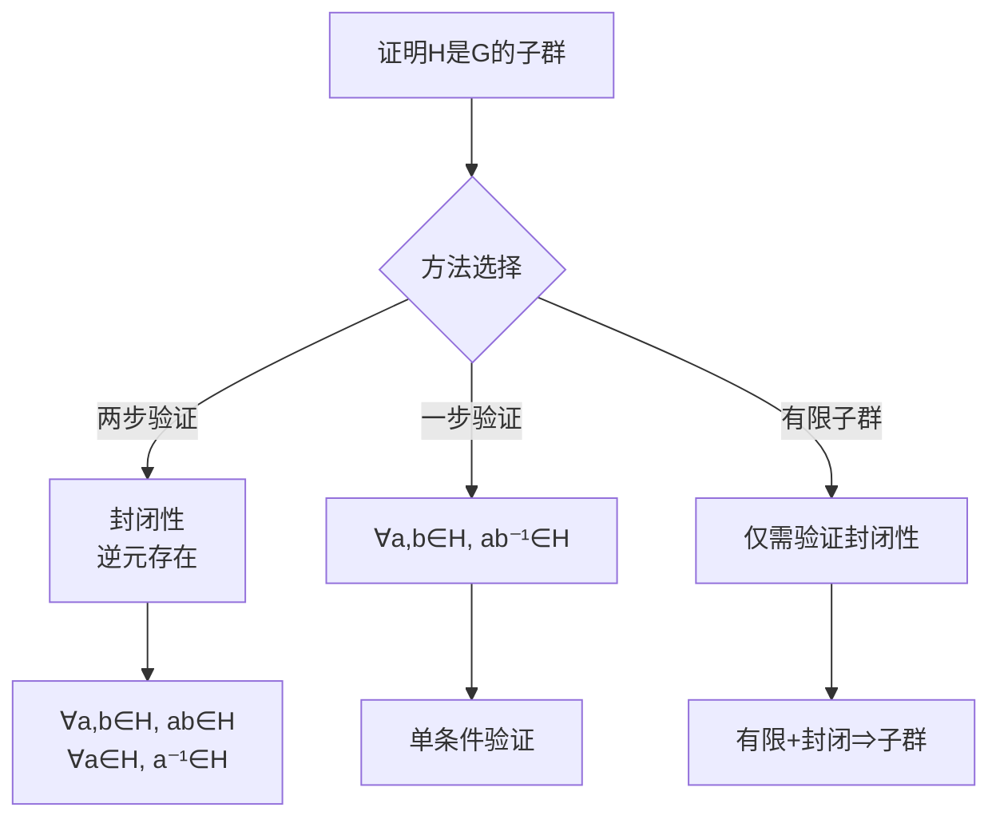
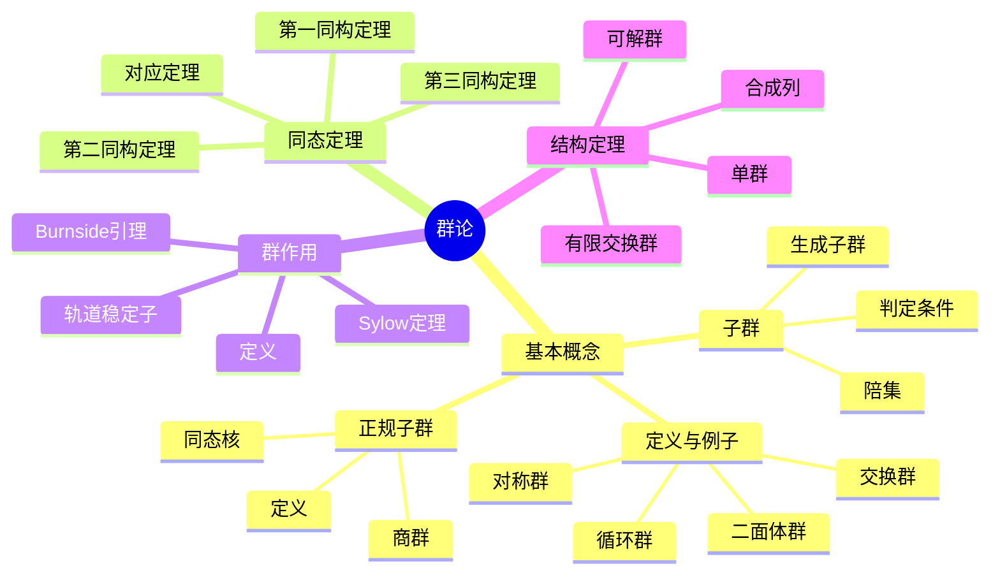

---
references:
  textbooks:
    - id: artin_algebra
      type: textbook
      title: Algebra
msc_primary: 08A99
      authors:
      - Michael Artin
      publisher: Pearson
      edition: 2nd
      year: 2011
      isbn: 978-0132413770
      msc: 16-01
      chapters: 
      url: ~
    - id: strang_la
      type: textbook
      title: Introduction to Linear Algebra
      authors:
      - Gilbert Strang
      publisher: Wellesley-Cambridge Press
      edition: 5th
      year: 2016
      isbn: 978-0980232776
      msc: 15-01
      chapters: 
      url: ~
    - id: dummit_foote_aa
      type: textbook
      title: Abstract Algebra
      authors:
      - David S. Dummit
      - Richard M. Foote
      publisher: Wiley
      edition: 3rd
      year: 2003
      isbn: 978-0471433347
      msc: 13-01
      chapters: 
      url: ~
  databases:
    - id: nlab
      type: database
      name: nLab
      entry_url: "https://ncatlab.org/nlab/show/{entry}"
      consulted_at: 2026-04-17
    - id: stacks_project
      type: database
      name: Stacks Project
      entry_url: "https://stacks.math.columbia.edu/tag/{tag}"
      consulted_at: 2026-04-17
    - id: zbmath
      type: database
      name: zbMATH Open
      entry_url: "https://zbmath.org/?q=an:{zb_id}"
      consulted_at: 2026-04-17
---
# 群论习题精讲与解题策略

---

## 1. 群论基本解题策略

### 1.1 证明子群判定决策树

### 1.2 证明正规子群策略

| 方法 | 适用场景 | 验证条件 |
|-----|---------|---------|
| **定义法** | 一般情况 | $gHg^{-1} = H$ 对所有 $g \in G$ |
| **陪集相等** | 指数2子群 | $[G:H] = 2$ |
| **核的判定** | 同态像 | $H = \ker \phi$ |
| **中心子群** | 交换群 | $H \subseteq Z(G)$ |

---

## 2. 典型习题精讲

### 习题1：子群指数关系

**题目**：设 $H \leq K \leq G$，证明 $[G:H] = [G:K][K:H]$。

**解答**：

**思路**：利用陪集分解

设 $\{k_i H\}_{i \in I}$ 是 $K/H$ 的陪集代表元，$|I| = [K:H]$

设 $\{g_j K\}_{j \in J}$ 是 $G/K$ 的陪集代表元，$|J| = [G:K]$

**验证**：$\{g_j k_i H\}_{(j,i) \in J \times I}$ 是 $G/H$ 的陪集代表元

- **覆盖性**：任意 $g \in G$，存在 $j$ 使 $g \in g_j K$，即 $g = g_j k$对某个 $k \in K$
  又存在 $i$ 使 $k \in k_i H$，所以 $g \in g_j k_i H$

- **不交性**：若 $g_j k_i H = g_{j'} k_{i'} H$，则 $g_j^{-1} g_{j'} \in K$，故 $j = j'$
  于是 $k_i H = k_{i'} H$，故 $i = i'$

因此 $[G:H] = |J| \cdot |I| = [G:K][K:H]$。∎

---

### 习题2：群的中心

**题目**：证明 $G/Z(G)$ 循环 ⟹ $G$ 交换。

**解答**：

设 $G/Z(G) = \langle gZ(G) \rangle$ 为循环群。

**关键观察**：任意 $a, b \in G$ 可写为：
- $a = g^m z_1$ 对某个 $z_1 \in Z(G)$
- $b = g^n z_2$ 对某个 $z_2 \in Z(G)$

**计算**：
$$ab = g^m z_1 g^n z_2 = g^m g^n z_1 z_2 = g^{m+n} z_1 z_2$$
$$ba = g^n z_2 g^m z_1 = g^n g^m z_2 z_1 = g^{n+m} z_2 z_1 = g^{m+n} z_1 z_2$$

因此 $ab = ba$，$G$ 交换。∎

**推论**：$p^2$ 阶群必交换（因 $Z(G) \neq 1$，若 $|Z(G)| = p^2$ 则 $G = Z(G)$；若 $|Z(G)| = p$ 则 $|G/Z(G)| = p$ 循环，矛盾）

---

### 习题3：Sylow定理应用

**题目**：证明15阶群是循环群。

**解答**：

$|G| = 15 = 3 \times 5$

**Sylow 5-子群**：
- 数量 $n_5 \equiv 1 \pmod{5}$ 且 $n_5 | 3$
- $n_5 = 1$（唯一，正规）

**Sylow 3-子群**：
- 数量 $n_3 \equiv 1 \pmod{3}$ 且 $n_3 | 5$
- $n_3 = 1$（唯一，正规）

设 $P \in \text{Syl}_5(G)$，$Q \in \text{Syl}_3(G)$

- $P \trianglelefteq G$，$Q \trianglelefteq G$
- $P \cap Q = 1$（阶互素）
- $PQ = G$（$|PQ| = |P||Q|/|P \cap Q| = 15$）

因此 $G \cong P \times Q \cong \mathbb{Z}_5 \times \mathbb{Z}_3 \cong \mathbb{Z}_{15}$（中国剩余定理）

∎

---

### 习题4：同态基本定理应用

**题目**：设 $\phi: G \to H$ 是满同态，$K \trianglelefteq G$。证明 $G/K \cong H/\phi(K)$。

**解答**：

**构造同态**：
定义 $\psi: G \to H/\phi(K)$ 为 $\psi(g) = \phi(g)\phi(K)$

**验证同态**：
$$\psi(gh) = \phi(gh)\phi(K) = \phi(g)\phi(h)\phi(K) = \phi(g)\phi(K) \cdot \phi(h)\phi(K) = \psi(g)\psi(h)$$

**计算核**：
$$\ker \psi = \{g \in G : \phi(g) \in \phi(K)\} = \phi^{-1}(\phi(K)) = K \cdot \ker \phi$$

若 $\phi$ 满且 $K \supseteq \ker \phi$，则 $\ker \psi = K$

**应用第一同构定理**：
$$G/K \cong H/\phi(K)$$

∎

---

## 3. 群作用解题策略

### 3.1 轨道-稳定子定理应用

**定理**：$|Gx| = [G : G_x]$，其中 $Gx$ 是轨道，$G_x$ 是稳定子

**应用场景**：
- 计算共轭类大小
- 证明 $p$-群有非平凡中心
- 计数问题

### 习题5：Burnside引理

**题目**：群 $G$ 作用在有限集 $X$ 上，则轨道数：
$$|X/G| = \frac{1}{|G|} \sum_{g \in G} |X^g|$$

其中 $X^g = \{x \in X : gx = x\}$ 是 $g$ 的不动点集。

**解答思路**：

计算集合 $\{(g, x) : gx = x\}$ 的两种方法：
1. 按 $g$ 计数：$\sum_{g \in G} |X^g|$
2. 按 $x$ 计数：$\sum_{x \in X} |G_x| = \sum_{x \in X} \frac{|G|}{|Gx|}$

设轨道代表元为 $x_1, \ldots, x_k$，则：
$$\sum_{x \in X} \frac{1}{|Gx|} = \sum_{i=1}^k \sum_{x \in Gx_i} \frac{1}{|Gx_i|} = k = |X/G|$$

因此 $|X/G| = \frac{1}{|G|} \sum_{g \in G} |X^g|$。∎

---

## 4. 常见错误与避免

| 错误 | 说明 | 正确做法 |
|-----|------|---------|
| **忽略单位元** | 证明子群时忘记验证 $e \in H$ | 明确验证 $e \in H$ 或包含关系 |
| **陪集混淆** | 将 $gH$ 与 $Hg$ 混淆 | 注意左右陪集区别，正规子群才相等 |
| **同态核计算** | 错误计算 $\ker \phi$ | $\ker \phi = \{g : \phi(g) = e\}$ |
| **Lagrange误用** | 由 $|H|$ 整除 $|G|$ 推出子群存在 | Lagrange定理逆不成立 |

---

## 5. 思维导图：群论知识体系

---

## 参考文献

1. Dummit, D.S. & Foote, R.M. *Abstract Algebra*.
2. Artin, M. *Algebra*.
3. Aluffi, P. *Algebra: Chapter 0*.
4. 聂灵沼, 丁石孙. *代数学引论*.

---

*本文档为群论解题策略与习题精讲*  
*质量等级：A（系统性+实用性）*
