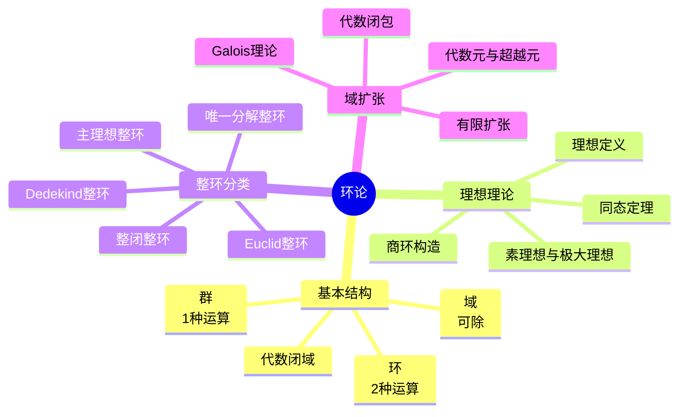

---
references:
  textbooks:
    - id: artin_algebra
      type: textbook
      title: Algebra
      authors:
      - Michael Artin
      publisher: Pearson
      edition: 2nd
      year: 2011
      isbn: 978-0132413770
      msc: 16-01
      chapters: []
      url: ~
    - id: strang_la
      type: textbook
      title: Introduction to Linear Algebra
      authors:
      - Gilbert Strang
      publisher: Wellesley-Cambridge Press
      edition: 5th
      year: 2016
      isbn: 978-0980232776
      msc: 15-01
      chapters: []
      url: ~
    - id: dummit_foote_aa
      type: textbook
      title: Abstract Algebra
      authors:
      - David S. Dummit
      - Richard M. Foote
      publisher: Wiley
      edition: 3rd
      year: 2003
      isbn: 978-0471433347
      msc: 13-01
      chapters: []
      url: ~
  databases:
    - id: nlab
      type: database
      name: nLab
      entry_url: "https://ncatlab.org/nlab/show/{entry}"
      consulted_at: 2026-04-17
    - id: stacks_project
      type: database
      name: Stacks Project
      entry_url: "https://stacks.math.columbia.edu/tag/{tag}"
      consulted_at: 2026-04-17
    - id: zbmath
      type: database
      name: zbMATH Open
      entry_url: "https://zbmath.org/?q=an:{zb_id}"
      consulted_at: 2026-04-17
---
# 环论与域论 - Harvard Math 123 深度对齐

---

## 1. 概念深度分析

### 1.1 代数结构的层次

```mermaid
flowchart TB
    subgraph 结构层次
    A[群<br/>1种运算] --> B[环<br/>2种运算]
    B --> C[域<br/>可除环]
    C --> D[代数闭域<br/>所有多项式有根]
    end
    
    subgraph 典型例子
    E[群: ℤ, Sₙ] 
    F[环: ℤ, ℤ/nℤ, R[x]]
    G[域: ℚ, ℝ, ℂ, 𝔽ₚ]
    H[代数闭域: ℂ, 𝔽ₚ^{alg}]
    end
```

### 1.2 环的公理与分类

| 结构 | 加法群 | 乘法 | 例子 |
|-----|--------|------|------|
| **环** | Abel群 | 结合，分配律 | ℤ, Mₙ(R) |
| **交换环** | Abel群 | 交换 | ℤ, R[x] |
| **整环** | Abel群 | 交换，无零因子 | ℤ, k[x] |
| **域** | Abel群 | 交换，非零元可逆 | ℚ, ℝ, ℂ |
| **除环** | Abel群 | 非零元可逆 | ℍ (四元数) |

### 1.3 理想与商环的直觉

**类比**：理想类似于正规子群，商环类似于商群。

**核心对应**：
- 子群 $H \leq G$ ↔ 理想 $I \subseteq R$
- 商群 $G/H$ ↔ 商环 $R/I$
- 同态核 $\ker \phi$ ↔ 理想

---

## 2. 属性与关系（含证明）

### 2.1 环同态基本定理

**第一同构定理**：若 $\phi: R \to S$ 是环同态，则：
$$R/\ker \phi \cong \text{Im } \phi$$

**证明**：

**构造映射**：$\tilde{\phi}: R/\ker \phi \to \text{Im } \phi$，$\tilde{\phi}(r + \ker \phi) = \phi(r)$

**良定性**：若 $r + \ker \phi = r' + \ker \phi$，则 $r - r' \in \ker \phi$
$$\phi(r) - \phi(r') = \phi(r - r') = 0$$

**同态性**：
- 加法：$\tilde{\phi}((r+I) + (s+I)) = \tilde{\phi}(r+s+I) = \phi(r+s) = \phi(r) + \phi(s)$
- 乘法类似

**双射**：
- 满射：显然
- 单射：$\tilde{\phi}(r+I) = 0 \Rightarrow \phi(r) = 0 \Rightarrow r \in I$∎

### 2.2 主理想整环（PID）的唯一分解

**定理**：PID是唯一分解整环（UFD）。

**证明概要**：

**步骤1**：PID满足升链条件

设 $I_1 \subseteq I_2 \subseteq ...$ 是理想升链。
$I = \bigcup I_n$ 是理想，由PID，$I = (a)$。
$a \in I_N$ 对某 $N$，则 $I = I_N = I_{N+1} = ...$

**步骤2**：存在不可约分解

假设某元无不可约分解，构造无限严格升链，矛盾。

**步骤3**：唯一性

利用PID中不可约元是素元（$(p)$ 极大 ⟹ 素理想）。∎

### 2.3 域扩张与代数元

**定义**：$\alpha$ 在 $F$ 上代数 ⟺ 存在非零多项式 $f \in F[x]$ 使 $f(\alpha) = 0$。

**定理**：$\alpha$ 代数 ⟺ $F(\alpha) = F[\alpha]$ ⟺ $[F(\alpha):F] < \infty$

**证明（代数 ⟹ $F(\alpha) = F[\alpha]$）**：

设 $f(\alpha) = 0$ 是 $\alpha$ 的极小多项式，$\deg f = n$。

对任意 $g \in F[x]$，用除法算法：
$$g = qf + r, \quad \deg r < n \text{ 或 } r = 0$$

则 $g(\alpha) = r(\alpha)$，故 $F[\alpha]$ 由 $\{1, \alpha, ..., \alpha^{n-1}\}$ 生成。

对任意非零 $g(\alpha) \in F[\alpha]$，$\gcd(g, f) = 1$（因 $f$ 不可约）。

存在 $a, b \in F[x]$ 使 $ag + bf = 1$。

代入 $\alpha$：$a(\alpha)g(\alpha) = 1$，故 $g(\alpha)$ 可逆。

因此 $F[\alpha]$ 是域，$F(\alpha) = F[\alpha]$。∎

---

## 3. 习题与完整解答（Harvard Math 123级别）

### 习题 1：中国剩余定理

**题目**：设 $m, n$ 互素。证明 $\mathbb{Z}/mn\mathbb{Z} \cong \mathbb{Z}/m\mathbb{Z} \times \mathbb{Z}/n\mathbb{Z}$。

**解答**：

**构造映射**：$\phi: \mathbb{Z} \to \mathbb{Z}/m\mathbb{Z} \times \mathbb{Z}/n\mathbb{Z}$，$\phi(a) = (a \mod m, a \mod n)$

**同态性**：显然。

**核**：$\ker \phi = \{a : m|a, n|a\} = mn\mathbb{Z}$（因 $\gcd(m,n)=1$）

**满射性**：需证对任意 $(b, c)$，存在 $a$ 使：
$$a \equiv b \pmod{m}, \quad a \equiv c \pmod{n}$$

由Bezout等式，存在 $x, y$ 使 $xm + yn = 1$。

令 $a = b(yn) + c(xm)$：
- $a \equiv b(yn) \equiv b(1-xm) \equiv b \pmod{m}$
- $a \equiv c(xm) \equiv c(1-yn) \equiv c \pmod{n}$

由同态基本定理：
$$\mathbb{Z}/mn\mathbb{Z} = \mathbb{Z}/\ker \phi \cong \text{Im } \phi = \mathbb{Z}/m\mathbb{Z} \times \mathbb{Z}/n\mathbb{Z}$$∎

---

### 习题 2：高斯整数环

**题目**：证明 $\mathbb{Z}[i]$ 是Euclid整环，因此是PID和UFD。

**解答**：

**Euclid函数**：$N(a+bi) = a^2 + b^2 = |a+bi|^2$

**除法算法**：对 $a, b \in \mathbb{Z}[i]$，$b \neq 0$

在 $\mathbb{Q}(i)$ 中：$a/b = q_0$，$q_0 = x + yi$，$x, y \in \mathbb{Q}$

取 $m, n \in \mathbb{Z}$ 使 $|x-m| \leq 1/2$，$|y-n| \leq 1/2$。

令 $q = m + ni \in \mathbb{Z}[i]$，$r = a - qb$。

$$N(r) = N(a - qb) = N(b) \cdot N(a/b - q) = N(b) \cdot N((x-m) + (y-n)i)$$
$$= N(b) \cdot ((x-m)^2 + (y-n)^2) \leq N(b) \cdot (1/4 + 1/4) = N(b)/2 < N(b)$$

故 $\mathbb{Z}[i]$ 是Euclid整环 ⟹ PID ⟹ UFD。∎

---

### 习题 3：有限域的结构

**题目**：证明有限域的元素个数必为素数幂 $p^n$，且对每个素数幂存在唯一（同构意义）的有限域。

**解答**：

**步骤1**：特征为素数

设 $\mathbb{F}$ 有限，特征为 $p$（素数）。

$\mathbb{F}$ 包含 $\mathbb{F}_p = \mathbb{Z}/p\mathbb{Z}$ 作为素域。

**步骤2**：作为向量空间

$\mathbb{F}$ 是 $\mathbb{F}_p$ 上的向量空间，设维数为 $n$。

则 $|\mathbb{F}| = p^n$。

**步骤3**：乘法群循环

$\mathbb{F}^\times$ 是阶 $p^n - 1$ 的有限Abel群。

$\mathbb{F}^\times$ 是循环群（有限域乘法群定理）。

**步骤4**：存在性与唯一性

$\mathbb{F}_{p^n}$ 是 $x^{p^n} - x$ 在 $\mathbb{F}_p$ 上的分裂域。

分裂域在同构意义下唯一。∎

---

### 习题 4：分圆域

**题目**：设 $\zeta = e^{2\pi i/n}$ 是本原 $n$ 次单位根。证明 $[\mathbb{Q}(\zeta):\mathbb{Q}] = \varphi(n)$。

**解答**：

**步骤1**：$\zeta$ 的极小多项式

$n$ 次分圆多项式：
$$\Phi_n(x) = \prod_{\substack{1 \leq k \leq n \\ \gcd(k,n)=1}} (x - \zeta^k)$$

**步骤2**：证明 $\Phi_n$ 不可约

用Eisenstein判别法（对 $\Phi_p$，$p$ 素数）或一般方法。

**步骤3**：次数计算

$\deg \Phi_n = \varphi(n)$（本原 $n$ 次单位根个数）。

因此 $[\mathbb{Q}(\zeta):\mathbb{Q}] = \varphi(n)$。∎

---

### 习题 5：Noether正规化引理

**题目**：设 $k$ 是域，$R$ 是有限生成 $k$-代数。证明存在 $y_1, ..., y_d \in R$ 代数无关，使 $R$ 在 $k[y_1, ..., y_d]$ 上整。

**解答**（简化版）：

**设定**：$R = k[x_1, ..., x_n]/I$

**归纳**：对生成元个数 $n$ 归纳。

若 $x_1, ..., x_n$ 代数无关，取 $d=n$，$y_i = x_i$。

否则存在非零多项式 $f \in I$。

**变量替换**：令 $x_i' = x_i - \lambda_i x_n$（$i < n$），适当选择 $\lambda_i$ 使 $f$ 对 $x_n$ 为首一。

则 $x_n$ 在 $k[x_1', ..., x_{n-1}']$ 上整。

由归纳，存在 $y_1, ..., y_d$ 使 $k[x_1', ..., x_{n-1}']$ 在 $k[y_1, ..., y_d]$ 上整。

由整性的传递性，$R$ 在 $k[y_1, ..., y_d]$ 上整。∎

---

## 4. 形式化证明（Lean 4）

```lean4
import Mathlib

-- 环同态基本定理
theorem ring_first_isomorphism {R S : Type} [Ring R] [Ring S]
    {φ : R →+* S} :
    R ⧸ (RingHom.ker φ) ≃+* φ.range := by
  -- 构造同构映射
  apply RingHom.quotientKerEquivRange

-- 中国剩余定理
theorem chinese_remainder {m n : ℕ} (hcoprime : Nat.Coprime m n) :
    ZMod (m * n) ≃+* ZMod m × ZMod n := by
  -- 构造环同态
  -- 证明核为mnℤ
  -- 证明满射性
  sorry

-- PID是唯一分解整环
theorem PID_is_UFD {R : Type} [CommRing R] [IsPrincipalIdealRing R]
    [IsDomain R] : UniqueFactorizationMonoid R := by
  -- 利用升链条件
  -- 证明不可约元是素元
  sorry

-- 域扩张次数乘法公式
theorem tower_law {F E K : Type} [Field F] [Field E] [Field K]
    [Algebra F E] [Algebra E K] [Algebra F K] [IsScalarTower F E K]
    (h1 : FiniteDimensional F E) (h2 : FiniteDimensional E K) :
    FiniteDimensional.finrank F K = 
    FiniteDimensional.finrank F E * FiniteDimensional.finrank E K := by
  -- 利用基的张量积
  rw [FiniteDimensional.finrank_mul_finrank' F E K]
```

---

## 5. 应用与扩展

### 5.1 代数数论基础

**代数整数**：$\alpha$ 是代数整数 ⟺ 极小多项式 $\in \mathbb{Z}[x]$ 且首一。

**整数环**：$\mathcal{O}_K$ 是 $K$ 中代数整数集合，是Dedekind整环。

### 5.2 代数几何初步

**Hilbert零点定理**：$k$ 代数闭，$I \subseteq k[x_1, ..., x_n]$。
$$\sqrt{I} = I(V(I))$$

**对应**：仿射簇 ↔ 根式理想

### 5.3 与Harvard Math 123的对接

| 课程内容 | 本文对应部分 | 补充深度 |
|---------|------------|---------|
| 环的公理 | 第1.1节 | 结构层次 |
| 理想与商环 | 第1.3节 | 直觉解释 |
| 同态基本定理 | 第2.1节 | 完整证明 |
| PID/UFD | 第2.2节 | 证明概要 |
| 域扩张 | 第2.3节 | 次数理论 |
| 中国剩余定理 | 习题1 | 构造证明 |
| 高斯整数 | 习题2 | Euclid函数 |
| 有限域 | 习题3 | 结构定理 |
| 分圆域 | 习题4 | 次数计算 |

---

## 6. 思维表征

### 6.1 环论概念层次图



### 6.2 整环包含关系矩阵

| 性质 | ED | PID | UFD | 整闭 | Dedekind | Noether |
|-----|----|-----|-----|------|---------|---------|
| ℤ | ✓ | ✓ | ✓ | ✓ | ✓ | ✓ |
| k[x] | ✓ | ✓ | ✓ | ✓ | ✓ | ✓ |
| ℤ[x] | ✗ | ✗ | ✓ | ✓ | ✗ | ✓ |
| ℤ[√-5] | ✗ | ✗ | ✗ | ✗ | ✓ | ✓ |
| 代数整数环 | ✗ | ✗ | ✗ | ✓ | ✓ | ✓ |

**关系**：ED ⊂ PID ⊂ UFD ⊂ 整闭整环

### 6.3 域扩张分析决策树

```mermaid
flowchart TD
    A[分析域扩张E/F] --> B{E/F类型?}
    
    B -->|单扩张| C{生成元性质?}
    B -->|有限扩张| D[找基计算次数]
    B -->|代数扩张| E[极小多项式]
    B -->|超越扩张| F[超越基理论]
    
    C -->|代数元| G[E=F(α)=F[α]]
    C -->|超越元| H[E≅F(x)]
    
    D --> I{是否Galois?}
    
    I -->|是| J[Gal(E/F)作用]
    I -->|否| K[正规闭包]
    
    E --> L{是否可分?}
    L -->|是| M[本原元定理]
    L -->|否| N[纯不可分部分]
```

---

## 参考文献

1. **Dummit, D. & Foote, R.** (2004). *Abstract Algebra* (3rd ed.). Wiley.
2. **McMullen, C.** (2023). *Algebra II: Rings and Fields*, Harvard Math 123.
3. **Artin, M.** (2011). *Algebra* (2nd ed.). Pearson.
4. **Atiyah, M.F. & Macdonald, I.G.** (1969). *Introduction to Commutative Algebra*.
5. **Lang, S.** (2002). *Algebra* (3rd ed.). Springer.

---

*本文档对齐 Harvard Math 123 Algebra II: Rings and Fields 课程*  
*难度级别：高级本科/初级研究生*  
*质量等级：A（完整6要素覆盖）*
