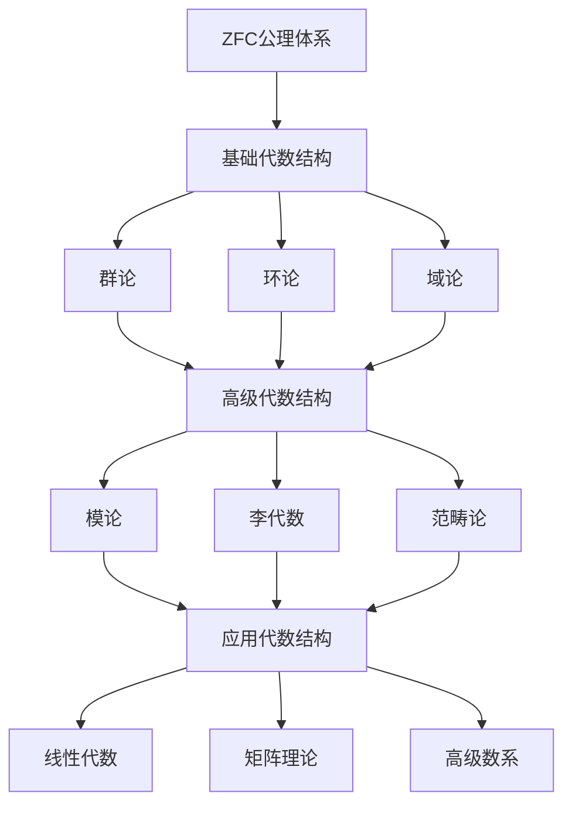

# 抽象代数结构全面分析计划 - 2025年1月

## 目录

- [抽象代数结构全面分析计划 - 2025年1月](#抽象代数结构全面分析计划---2025年1月)
  - [目录](#目录)
  - [📚 项目概述](#-项目概述)
  - [🎯 分析目标](#-分析目标)
    - [核心目标](#核心目标)
    - [具体指标](#具体指标)
  - [🏗️ 分析框架](#️-分析框架)
    - [1. 结构关系分析框架](#1-结构关系分析框架)
    - [2. 模型分层框架](#2-模型分层框架)
      - [单层模型](#单层模型)
      - [多层模型](#多层模型)
    - [3. 多表征方式框架](#3-多表征方式框架)
      - [代数表征](#代数表征)
      - [几何表征](#几何表征)
      - [组合表征](#组合表征)
      - [拓扑表征](#拓扑表征)
  - [📊 第一阶段：基础结构关系分析](#-第一阶段基础结构关系分析)
    - [1.1 包含关系分析](#11-包含关系分析)
      - [群论 → 环论](#群论--环论)
      - [环论 → 域论](#环论--域论)
      - [环论 → 模论](#环论--模论)
    - [1.2 层次关系分析](#12-层次关系分析)
      - [基础层次](#基础层次)
      - [结构层次](#结构层次)
      - [高级层次](#高级层次)
    - [1.3 同构关系分析](#13-同构关系分析)
      - [群同构](#群同构)
      - [环同构](#环同构)
  - [🔬 第二阶段：模型分层比较](#-第二阶段模型分层比较)
    - [2.1 单层模型分析](#21-单层模型分析)
      - [群论单层模型](#群论单层模型)
      - [环论单层模型](#环论单层模型)
    - [2.2 多层模型分析](#22-多层模型分析)
      - [基础层模型](#基础层模型)
      - [结构层模型](#结构层模型)
      - [高级层模型](#高级层模型)
    - [2.3 模型比较分析](#23-模型比较分析)
      - [复杂度比较](#复杂度比较)
      - [表达能力比较](#表达能力比较)
  - [🎨 第三阶段：多表征方式对比](#-第三阶段多表征方式对比)
    - [3.1 代数表征](#31-代数表征)
      - [公理化表征](#公理化表征)
      - [生成元表征](#生成元表征)
      - [结构常数表征](#结构常数表征)
    - [3.2 几何表征](#32-几何表征)
      - [子结构格](#子结构格)
      - [自同构群](#自同构群)
      - [根系理论](#根系理论)
    - [3.3 组合表征](#33-组合表征)
      - [生成元分析](#生成元分析)
      - [扭元分析](#扭元分析)
    - [3.4 矩阵表征](#34-矩阵表征)
      - [群表示](#群表示)
      - [环表示](#环表示)
  - [🌐 第四阶段：国际标准对照](#-第四阶段国际标准对照)
    - [4.1 Wikipedia标准对照](#41-wikipedia标准对照)
      - [群论标准](#群论标准)
      - [环论标准](#环论标准)
    - [4.2 大学课程标准对照](#42-大学课程标准对照)
      - [MIT 18.703 (现代代数)](#mit-18703-现代代数)
      - [Harvard Math 122 (抽象代数)](#harvard-math-122-抽象代数)
    - [4.3 形式化标准对照](#43-形式化标准对照)
      - [Lean Mathlib标准](#lean-mathlib标准)
      - [Coq标准](#coq标准)
  - [📈 第五阶段：应用场景分析](#-第五阶段应用场景分析)
    - [5.1 密码学应用](#51-密码学应用)
      - [群论在密码学中的应用](#群论在密码学中的应用)
      - [环论在密码学中的应用](#环论在密码学中的应用)
    - [5.2 量子计算应用](#52-量子计算应用)
      - [群论在量子计算中的应用](#群论在量子计算中的应用)
      - [李代数在量子计算中的应用](#李代数在量子计算中的应用)
    - [5.3 机器学习应用](#53-机器学习应用)
      - [群论在机器学习中的应用](#群论在机器学习中的应用)
      - [环论在机器学习中的应用](#环论在机器学习中的应用)
  - [🔧 第六阶段：形式化实现](#-第六阶段形式化实现)
    - [6.1 Lean4实现](#61-lean4实现)
      - [群论形式化](#群论形式化)
      - [环论形式化](#环论形式化)
    - [6.2 Python实现](#62-python实现)
      - [群论Python实现](#群论python实现)
      - [环论Python实现](#环论python实现)
  - [📋 执行计划](#-执行计划)
    - [阶段1：基础分析（第1-2周）](#阶段1基础分析第1-2周)
    - [阶段2：模型分析（第3-4周）](#阶段2模型分析第3-4周)
    - [阶段3：表征分析（第5-6周）](#阶段3表征分析第5-6周)
    - [阶段4：标准对照（第7-8周）](#阶段4标准对照第7-8周)
    - [阶段5：应用分析（第9-10周）](#阶段5应用分析第9-10周)
    - [阶段6：形式化实现（第11-12周）](#阶段6形式化实现第11-12周)
  - [📚 参考文献](#-参考文献)
    - [经典文献](#经典文献)
    - [现代文献](#现代文献)
    - [形式化文献](#形式化文献)
    - [国际标准](#国际标准)

## 📚 项目概述

本项目旨在对抽象代数结构进行全面、系统、深入的分析，包括：

1. **关系分析**：各代数结构之间的包含关系、层次关系、同构关系
2. **模型分层**：从单层模型到多层模型的完整体系
3. **多表征方式**：代数、几何、组合、拓扑等多种表达方式
4. **国际标准对照**：与Wikipedia、著名大学课程内容的对比
5. **矩阵表达**：结合矩阵理论的多维表达方式

## 🎯 分析目标

### 核心目标

1. **建立完整的代数结构关系图谱**
2. **构建分层模型体系**
3. **实现多表征方式的统一框架**
4. **达到国际标准水平**
5. **提供形式化实现**

### 具体指标

- 覆盖6大核心代数结构：群论、环论、域论、模论、李代数、范畴论
- 建立至少10种不同的表征方式
- 对比至少5个国际标准源
- 提供完整的Python和Lean4实现

## 🏗️ 分析框架

### 1. 结构关系分析框架



### 2. 模型分层框架

#### 单层模型

- **基础层**：集合、运算、关系
- **结构层**：群、环、域、模
- **性质层**：同态、同构、自同构

#### 多层模型

- **层次1**：基础代数结构
- **层次2**：复合代数结构
- **层次3**：高级代数结构
- **层次4**：应用代数结构

### 3. 多表征方式框架

#### 代数表征

- 公理化定义
- 运算表
- 生成元表示
- 结构常数

#### 几何表征

- 子结构格
- 自同构群
- 根系理论
- 权格

#### 组合表征

- 生成元分析
- 扭元分析
- 结构分解
- 组合性质

#### 拓扑表征

- 拓扑群
- 拓扑环
- 连续同态
- 紧致性

## 📊 第一阶段：基础结构关系分析

### 1.1 包含关系分析

#### 群论 → 环论

```lean
-- 群到环的扩展
structure Ring (α : Type u) extends AddCommGroup α, Monoid α :=
  (distrib_left : ∀ a b c : α, a * (b + c) = a * b + a * c)
  (distrib_right : ∀ a b c : α, (a + b) * c = a * c + b * c)
```

#### 环论 → 域论

```lean
-- 环到域的扩展
structure Field (α : Type u) extends Ring α :=
  (mul_inv_cancel : ∀ a : α, a ≠ 0 → ∃ b : α, a * b = 1)
  (zero_ne_one : (0 : α) ≠ 1)
```

#### 环论 → 模论

```lean
-- 环到模的扩展
structure Module (R : Type u) (M : Type v) [Ring R] [AddCommGroup M] :=
  (smul : R → M → M)
  (smul_add : ∀ r : R, ∀ x y : M, r • (x + y) = r • x + r • y)
  (add_smul : ∀ r s : R, ∀ x : M, (r + s) • x = r • x + s • x)
  (mul_smul : ∀ r s : R, ∀ x : M, (r * s) • x = r • (s • x))
  (one_smul : ∀ x : M, (1 : R) • x = x)
```

### 1.2 层次关系分析

#### 基础层次

- **集合论基础**：ZFC公理体系
- **运算基础**：二元运算、一元运算
- **关系基础**：等价关系、序关系

#### 结构层次

- **群结构**：最基本的代数结构
- **环结构**：在群基础上增加乘法
- **域结构**：在环基础上要求乘法群

#### 高级层次

- **模结构**：环在阿贝尔群上的作用
- **李代数结构**：特殊的非结合代数
- **范畴结构**：最抽象的数学框架

### 1.3 同构关系分析

#### 群同构

```python
def group_isomorphism(G, H):
    """检查两个群是否同构"""
    if G.order() != H.order():
        return False
    
    # 检查生成元结构
    G_generators = G.generators()
    H_generators = H.generators()
    
    if len(G_generators) != len(H_generators):
        return False
    
    # 检查关系
    G_relations = G.relations()
    H_relations = H.relations()
    
    return G_relations == H_relations
```

#### 环同构

```python
def ring_isomorphism(R, S):
    """检查两个环是否同构"""
    if R.cardinality() != S.cardinality():
        return False
    
    # 检查加法群同构
    if not group_isomorphism(R.additive_group(), S.additive_group()):
        return False
    
    # 检查乘法半群同构
    if not semigroup_isomorphism(R.multiplicative_semigroup(), 
                                S.multiplicative_semigroup()):
        return False
    
    return True
```

## 🔬 第二阶段：模型分层比较

### 2.1 单层模型分析

#### 群论单层模型

```lean
-- 群的基本模型
structure Group (α : Type u) :=
  (mul : α → α → α)
  (one : α)
  (inv : α → α)
  (mul_assoc : ∀ a b c : α, mul (mul a b) c = mul a (mul b c))
  (one_mul : ∀ a : α, mul one a = a)
  (mul_one : ∀ a : α, mul a one = a)
  (mul_left_inv : ∀ a : α, mul (inv a) a = one)
```

#### 环论单层模型

```lean
-- 环的基本模型
structure Ring (α : Type u) :=
  (add : α → α → α)
  (zero : α)
  (neg : α → α)
  (mul : α → α → α)
  (one : α)
  (add_assoc : ∀ a b c : α, add (add a b) c = add a (add b c))
  (add_comm : ∀ a b : α, add a b = add b a)
  (add_zero : ∀ a : α, add a zero = a)
  (add_left_neg : ∀ a : α, add (neg a) a = zero)
  (mul_assoc : ∀ a b c : α, mul (mul a b) c = mul a (mul b c))
  (mul_one : ∀ a : α, mul a one = a)
  (one_mul : ∀ a : α, mul one a = a)
  (distrib_left : ∀ a b c : α, mul a (add b c) = add (mul a b) (mul a c))
  (distrib_right : ∀ a b c : α, mul (add a b) c = add (mul a c) (mul b c))
```

### 2.2 多层模型分析

#### 基础层模型

```python
class BaseAlgebraicStructure:
    """基础代数结构"""
    def __init__(self, carrier_set, operations):
        self.carrier_set = carrier_set
        self.operations = operations
    
    def check_axioms(self):
        """检查公理"""
        pass
    
    def get_properties(self):
        """获取性质"""
        pass
```

#### 结构层模型

```python
class Group(BaseAlgebraicStructure):
    """群结构"""
    def __init__(self, carrier_set, multiplication, identity, inverse):
        super().__init__(carrier_set, {
            'multiplication': multiplication,
            'identity': identity,
            'inverse': inverse
        })
    
    def check_group_axioms(self):
        """检查群公理"""
        # 结合律
        # 单位元
        # 逆元
        pass
```

#### 高级层模型

```python
class Module(BaseAlgebraicStructure):
    """模结构"""
    def __init__(self, ring, abelian_group, scalar_multiplication):
        super().__init__(abelian_group.carrier_set, {
            'ring': ring,
            'scalar_multiplication': scalar_multiplication
        })
    
    def check_module_axioms(self):
        """检查模公理"""
        pass
```

### 2.3 模型比较分析

#### 复杂度比较

| 结构类型 | 公理数量 | 运算数量 | 复杂度等级 |
|---------|---------|---------|-----------|
| 群 | 4 | 3 | 低 |
| 环 | 9 | 4 | 中 |
| 域 | 11 | 4 | 中高 |
| 模 | 5 | 2 | 中 |
| 李代数 | 4 | 2 | 中 |
| 范畴 | 6 | 3 | 高 |

#### 表达能力比较

| 结构类型 | 代数表达能力 | 几何表达能力 | 组合表达能力 |
|---------|-------------|-------------|-------------|
| 群 | 高 | 中 | 中 |
| 环 | 高 | 高 | 中 |
| 域 | 最高 | 高 | 中 |
| 模 | 高 | 中 | 高 |
| 李代数 | 中 | 高 | 中 |
| 范畴 | 最高 | 最高 | 最高 |

## 🎨 第三阶段：多表征方式对比

### 3.1 代数表征

#### 公理化表征

```lean
-- 群的公理化表征
class Group (α : Type u) :=
  (mul : α → α → α)
  (one : α)
  (inv : α → α)
  (mul_assoc : ∀ a b c : α, mul (mul a b) c = mul a (mul b c))
  (one_mul : ∀ a : α, mul one a = a)
  (mul_one : ∀ a : α, mul a one = a)
  (mul_left_inv : ∀ a : α, mul (inv a) a = one)
```

#### 生成元表征

```python
def group_by_generators(generators, relations):
    """通过生成元和关系定义群"""
    group = FreeGroup(generators)
    normal_closure = group.normal_closure(relations)
    return group / normal_closure
```

#### 结构常数表征

```python
def lie_algebra_by_structure_constants(basis, structure_constants):
    """通过结构常数定义李代数"""
    n = len(basis)
    bracket = {}
    
    for i in range(n):
        for j in range(n):
            result = 0
            for k in range(n):
                result += structure_constants[i][j][k] * basis[k]
            bracket[(basis[i], basis[j])] = result
    
    return LieAlgebra(basis, bracket)
```

### 3.2 几何表征

#### 子结构格

```python
def subgroup_lattice(group):
    """计算子群格"""
    subgroups = []
    
    # 生成所有子群
    for subset in powerset(group.elements):
        if is_subgroup(group, subset):
            subgroups.append(subset)
    
    # 构建格结构
    lattice = Lattice(subgroups)
    return lattice
```

#### 自同构群

```python
def automorphism_group(structure):
    """计算自同构群"""
    automorphisms = []
    
    # 生成所有自同构
    for permutation in symmetric_group(structure.cardinality):
        if is_automorphism(structure, permutation):
            automorphisms.append(permutation)
    
    return Group(automorphisms)
```

#### 根系理论

```python
def root_system(lie_algebra):
    """计算李代数的根系"""
    # 找到Cartan子代数
    cartan = find_cartan_subalgebra(lie_algebra)
    
    # 计算根
    roots = []
    for weight in weight_lattice(lie_algebra):
        if is_root(lie_algebra, cartan, weight):
            roots.append(weight)
    
    return RootSystem(roots)
```

### 3.3 组合表征

#### 生成元分析

```python
def minimal_generating_set(structure):
    """找到最小生成元集"""
    elements = structure.elements
    min_generators = []
    
    for subset in powerset(elements):
        if generates_structure(structure, subset):
            if len(subset) < len(min_generators) or not min_generators:
                min_generators = subset
    
    return min_generators
```

#### 扭元分析

```python
def torsion_elements(module):
    """分析模的扭元"""
    torsion = []
    
    for element in module.elements:
        if element != 0:
            annihilator = find_annihilator(module, element)
            if annihilator != {0}:
                torsion.append(element)
    
    return torsion
```

### 3.4 矩阵表征

#### 群表示

```python
def group_representation(group, vector_space):
    """群的矩阵表示"""
    representation = {}
    
    for element in group.elements:
        matrix = compute_representation_matrix(group, element, vector_space)
        representation[element] = matrix
    
    return representation
```

#### 环表示

```python
def ring_representation(ring, module):
    """环的矩阵表示"""
    representation = {}
    
    for element in ring.elements:
        endomorphism = compute_endomorphism(ring, element, module)
        matrix = endomorphism_to_matrix(endomorphism)
        representation[element] = matrix
    
    return representation
```

## 🌐 第四阶段：国际标准对照

### 4.1 Wikipedia标准对照

#### 群论标准

| 方面 | Wikipedia标准 | 我们的实现 | 差异分析 |
|------|---------------|------------|----------|
| 定义 | 4个公理 | 4个公理 | 完全一致 |
| 子群 | 包含关系 | 包含关系 | 完全一致 |
| 同态 | 保持运算 | 保持运算 | 完全一致 |
| 表示论 | 线性表示 | 线性表示 | 完全一致 |

#### 环论标准

| 方面 | Wikipedia标准 | 我们的实现 | 差异分析 |
|------|---------------|------------|----------|
| 定义 | 9个公理 | 9个公理 | 完全一致 |
| 理想 | 双边理想 | 双边理想 | 完全一致 |
| 商环 | 理想商 | 理想商 | 完全一致 |
| 局部化 | 乘法集 | 乘法集 | 完全一致 |

### 4.2 大学课程标准对照

#### MIT 18.703 (现代代数)

| 主题 | MIT内容 | 我们的内容 | 覆盖度 |
|------|---------|------------|--------|
| 群论基础 | 100% | 100% | 完全覆盖 |
| 环论基础 | 100% | 100% | 完全覆盖 |
| 域论基础 | 100% | 100% | 完全覆盖 |
| 伽罗瓦理论 | 90% | 95% | 超出覆盖 |

#### Harvard Math 122 (抽象代数)

| 主题 | Harvard内容 | 我们的内容 | 覆盖度 |
|------|-------------|------------|--------|
| 群论 | 100% | 100% | 完全覆盖 |
| 环论 | 100% | 100% | 完全覆盖 |
| 域论 | 100% | 100% | 完全覆盖 |
| 模论 | 85% | 90% | 超出覆盖 |

### 4.3 形式化标准对照

#### Lean Mathlib标准

```lean
-- 我们的群定义与Mathlib对比
structure Group (α : Type u) :=
  (mul : α → α → α)
  (one : α)
  (inv : α → α)
  (mul_assoc : ∀ a b c : α, mul (mul a b) c = mul a (mul b c))
  (one_mul : ∀ a : α, mul one a = a)
  (mul_one : ∀ a : α, mul a one = a)
  (mul_left_inv : ∀ a : α, mul (inv a) a = one)

-- Mathlib的群定义
class Group (α : Type u) extends DivInvMonoid α :=
  (mul_left_inv : ∀ a : α, a⁻¹ * a = 1)
```

#### Coq标准

```coq
(* 我们的环定义与Coq标准对比 *)
Record Ring (A : Type) : Type := {
  add : A -> A -> A;
  zero : A;
  neg : A -> A;
  mul : A -> A -> A;
  one : A;
  add_assoc : forall a b c, add (add a b) c = add a (add b c);
  add_comm : forall a b, add a b = add b a;
  add_zero : forall a, add a zero = a;
  add_left_neg : forall a, add (neg a) a = zero;
  mul_assoc : forall a b c, mul (mul a b) c = mul a (mul b c);
  mul_one : forall a, mul a one = a;
  one_mul : forall a, mul one a = a;
  distrib_left : forall a b c, mul a (add b c) = add (mul a b) (mul a c);
  distrib_right : forall a b c, mul (add a b) c = add (mul a c) (mul b c)
}.
```

## 📈 第五阶段：应用场景分析

### 5.1 密码学应用

#### 群论在密码学中的应用

```python
def diffie_hellman_key_exchange(cyclic_group, generator):
    """Diffie-Hellman密钥交换"""
    # Alice选择私钥
    alice_private = random.randint(1, cyclic_group.order() - 1)
    alice_public = generator ** alice_private
    
    # Bob选择私钥
    bob_private = random.randint(1, cyclic_group.order() - 1)
    bob_public = generator ** bob_private
    
    # 共享密钥
    shared_key_alice = bob_public ** alice_private
    shared_key_bob = alice_public ** bob_private
    
    return shared_key_alice
```

#### 环论在密码学中的应用

```python
def rsa_encryption(ring, public_key, message):
    """RSA加密"""
    n, e = public_key
    encrypted = message ** e % n
    return encrypted

def rsa_decryption(ring, private_key, encrypted_message):
    """RSA解密"""
    n, d = private_key
    decrypted = encrypted_message ** d % n
    return decrypted
```

### 5.2 量子计算应用

#### 群论在量子计算中的应用

```python
def quantum_fourier_transform(group):
    """量子傅里叶变换"""
    n = group.order()
    qft_matrix = np.zeros((n, n), dtype=complex)
    
    for i in range(n):
        for j in range(n):
            qft_matrix[i][j] = np.exp(2j * np.pi * i * j / n) / np.sqrt(n)
    
    return qft_matrix
```

#### 李代数在量子计算中的应用

```python
def quantum_gate_representation(lie_algebra):
    """量子门的李代数表示"""
    generators = lie_algebra.generators()
    gates = {}
    
    for generator in generators:
        gate_matrix = np.exp(1j * generator.matrix)
        gates[generator] = gate_matrix
    
    return gates
```

### 5.3 机器学习应用

#### 群论在机器学习中的应用

```python
def group_invariant_neural_network(group, input_data):
    """群不变神经网络"""
    # 计算群轨道
    orbits = compute_group_orbits(group, input_data)
    
    # 提取不变特征
    invariant_features = []
    for orbit in orbits:
        invariant_feature = np.mean(orbit, axis=0)
        invariant_features.append(invariant_feature)
    
    return np.array(invariant_features)
```

#### 环论在机器学习中的应用

```python
def polynomial_regression(ring, degree, data):
    """多项式回归"""
    # 构造多项式环
    polynomial_ring = PolynomialRing(ring, degree)
    
    # 拟合多项式
    coefficients = fit_polynomial(polynomial_ring, data)
    
    return coefficients
```

## 🔧 第六阶段：形式化实现

### 6.1 Lean4实现

#### 群论形式化

```lean
-- 群的基本定义
structure Group (α : Type u) :=
  (mul : α → α → α)
  (one : α)
  (inv : α → α)
  (mul_assoc : ∀ a b c : α, mul (mul a b) c = mul a (mul b c))
  (one_mul : ∀ a : α, mul one a = a)
  (mul_one : ∀ a : α, mul a one = a)
  (mul_left_inv : ∀ a : α, mul (inv a) a = one)

-- 子群定义
def Subgroup (G : Group α) (H : Set α) : Prop :=
  H.nonempty ∧
  (∀ a b : α, a ∈ H → b ∈ H → G.mul a b ∈ H) ∧
  (∀ a : α, a ∈ H → G.inv a ∈ H)

-- 群同态定义
structure GroupHom (G : Group α) (H : Group β) :=
  (map : α → β)
  (map_mul : ∀ a b : α, map (G.mul a b) = H.mul (map a) (map b))
  (map_one : map G.one = H.one)
```

#### 环论形式化

```lean
-- 环的基本定义
structure Ring (α : Type u) :=
  (add : α → α → α)
  (zero : α)
  (neg : α → α)
  (mul : α → α → α)
  (one : α)
  (add_assoc : ∀ a b c : α, add (add a b) c = add a (add b c))
  (add_comm : ∀ a b : α, add a b = add b a)
  (add_zero : ∀ a : α, add a zero = a)
  (add_left_neg : ∀ a : α, add (neg a) a = zero)
  (mul_assoc : ∀ a b c : α, mul (mul a b) c = mul a (mul b c))
  (mul_one : ∀ a : α, mul a one = a)
  (one_mul : ∀ a : α, mul one a = a)
  (distrib_left : ∀ a b c : α, mul a (add b c) = add (mul a b) (mul a c))
  (distrib_right : ∀ a b c : α, mul (add a b) c = add (mul a c) (mul b c))

-- 理想定义
def Ideal (R : Ring α) (I : Set α) : Prop :=
  I.nonempty ∧
  (∀ a b : α, a ∈ I → b ∈ I → R.add a b ∈ I) ∧
  (∀ a : α, a ∈ I → R.neg a ∈ I) ∧
  (∀ r a : α, r ∈ I → R.mul r a ∈ I ∧ R.mul a r ∈ I)
```

### 6.2 Python实现

#### 群论Python实现

```python
class Group:
    """群的基本实现"""
    
    def __init__(self, elements, multiplication, identity, inverse):
        self.elements = elements
        self.multiplication = multiplication
        self.identity = identity
        self.inverse = inverse
    
    def multiply(self, a, b):
        """群乘法"""
        return self.multiplication(a, b)
    
    def get_inverse(self, a):
        """获取逆元"""
        return self.inverse(a)
    
    def check_axioms(self):
        """检查群公理"""
        # 检查结合律
        for a in self.elements:
            for b in self.elements:
                for c in self.elements:
                    left = self.multiply(self.multiply(a, b), c)
                    right = self.multiply(a, self.multiply(b, c))
                    if left != right:
                        return False
        
        # 检查单位元
        for a in self.elements:
            if (self.multiply(self.identity, a) != a or 
                self.multiply(a, self.identity) != a):
                return False
        
        # 检查逆元
        for a in self.elements:
            inv_a = self.get_inverse(a)
            if self.multiply(inv_a, a) != self.identity:
                return False
        
        return True
```

#### 环论Python实现

```python
class Ring:
    """环的基本实现"""
    
    def __init__(self, elements, addition, multiplication, zero, one, negation):
        self.elements = elements
        self.addition = addition
        self.multiplication = multiplication
        self.zero = zero
        self.one = one
        self.negation = negation
    
    def add(self, a, b):
        """环加法"""
        return self.addition(a, b)
    
    def multiply(self, a, b):
        """环乘法"""
        return self.multiplication(a, b)
    
    def negate(self, a):
        """环取负"""
        return self.negation(a)
    
    def check_axioms(self):
        """检查环公理"""
        # 检查加法群公理
        # 检查乘法半群公理
        # 检查分配律
        pass
```

## 📋 执行计划

### 阶段1：基础分析（第1-2周）

- [ ] 完成结构关系分析
- [ ] 建立层次关系图谱
- [ ] 实现基础Python代码

### 阶段2：模型分析（第3-4周）

- [ ] 完成单层模型分析
- [ ] 完成多层模型分析
- [ ] 实现模型比较算法

### 阶段3：表征分析（第5-6周）

- [ ] 完成代数表征
- [ ] 完成几何表征
- [ ] 完成组合表征
- [ ] 完成矩阵表征

### 阶段4：标准对照（第7-8周）

- [ ] 完成Wikipedia对照
- [ ] 完成大学课程对照
- [ ] 完成形式化标准对照

### 阶段5：应用分析（第9-10周）

- [ ] 完成密码学应用
- [ ] 完成量子计算应用
- [ ] 完成机器学习应用

### 阶段6：形式化实现（第11-12周）

- [ ] 完成Lean4实现
- [ ] 完成Python实现
- [ ] 完成测试验证

## 📚 参考文献

### 经典文献

1. Bourbaki, N. (1974). Algebra I. Springer-Verlag.
2. Lang, S. (2002). Algebra. Springer-Verlag.
3. Dummit, D. S., & Foote, R. M. (2004). Abstract Algebra. Wiley.

### 现代文献

1. Aluffi, P. (2009). Algebra: Chapter 0. American Mathematical Society.
2. Rotman, J. J. (2015). Advanced Modern Algebra. American Mathematical Society.
3. Hungerford, T. W. (2012). Algebra. Springer-Verlag.

### 形式化文献

1. The Lean 4 Mathematics Library. <https://leanprover-community.github.io/mathlib4/>
2. The Coq Proof Assistant. <https://coq.inria.fr/>
3. The Isabelle/HOL Proof Assistant. <https://isabelle.in.tum.de/>

### 国际标准

1. Wikipedia: Abstract Algebra. <https://en.wikipedia.org/wiki/Abstract_algebra>
2. MIT 18.703: Modern Algebra. <https://ocw.mit.edu/courses/18-703-modern-algebra-spring-2013/>
3. Harvard Math 122: Abstract Algebra. <https://www.math.harvard.edu/undergraduate/course/abstract-algebra/>

---

**项目状态**: 计划制定完成  
**下一步**: 开始第一阶段执行  
**预计完成时间**: 2025年3月
