# 模论-深度扩展版

## 目录 / Table of Contents

- [模论-深度扩展版](#模论-深度扩展版)
  - [目录 / Table of Contents](#目录--table-of-contents)
  - [概述](#概述)
  - [1. 模论深度理论](#1-模论深度理论)
    - [1.1 模的基本理论](#11-模的基本理论)
    - [1.2 投射模与内射模](#12-投射模与内射模)
    - [1.3 平坦模](#13-平坦模)
    - [1.4 模的分解理论](#14-模的分解理论)
    - [1.5 模的维数理论](#15-模的维数理论)
    - [1.6 模的局部化理论](#16-模的局部化理论)
    - [1.7 模的有限性条件](#17-模的有限性条件)
  - [2. 同调代数](#2-同调代数)
    - [2.1 复形理论](#21-复形理论)
    - [2.2 导出函子](#22-导出函子)
    - [2.4 谱序列理论](#24-谱序列理论)
    - [2.5 同调代数中的对偶性](#25-同调代数中的对偶性)
    - [2.6 同调代数的计算技术](#26-同调代数的计算技术)
    - [2.3 Ext 和 Tor 函子](#23-ext-和-tor-函子)
  - [3. 导出范畴](#3-导出范畴)
    - [3.1 导出范畴的定义](#31-导出范畴的定义)
    - [3.2 稳定范畴](#32-稳定范畴)
    - [3.3 模型范畴](#33-模型范畴)
    - [3.4 导出范畴的高级理论](#34-导出范畴的高级理论)
    - [3.5 导出范畴的计算方法](#35-导出范畴的计算方法)
    - [3.6 导出范畴的应用](#36-导出范畴的应用)
  - [4. 模论在数学各分支中的应用](#4-模论在数学各分支中的应用)
    - [4.1 代数几何中的应用](#41-代数几何中的应用)
    - [4.2 表示论中的应用](#42-表示论中的应用)
    - [4.3 代数拓扑中的应用](#43-代数拓扑中的应用)
    - [4.4 代数几何中的深度应用](#44-代数几何中的深度应用)
    - [4.5 表示论中的深度应用](#45-表示论中的深度应用)
    - [4.6 代数拓扑中的深度应用](#46-代数拓扑中的深度应用)
    - [4.7 数论中的应用](#47-数论中的应用)
  - [5. 形式化实现](#5-形式化实现)
    - [5.1 Lean 4 实现](#51-lean-4-实现)
    - [5.2 Haskell 实现](#52-haskell-实现)
    - [5.3 Rust 实现](#53-rust-实现)
    - [5.4 同调代数的形式化实现](#54-同调代数的形式化实现)
    - [5.5 导出范畴的形式化实现](#55-导出范畴的形式化实现)
    - [5.6 计算模论的形式化实现](#56-计算模论的形式化实现)
    - [5.7 高级形式化特性](#57-高级形式化特性)
  - [6. 历史发展与现代应用](#6-历史发展与现代应用)
    - [6.1 历史发展](#61-历史发展)
    - [6.2 现代应用](#62-现代应用)
  - [7. 前沿研究方向](#7-前沿研究方向)
    - [7.1 导出代数几何](#71-导出代数几何)
    - [7.2 稳定同伦论](#72-稳定同伦论)
    - [7.3 量子模论](#73-量子模论)
    - [7.4 计算模论](#74-计算模论)
  - [8. 模论的哲学问题](#8-模论的哲学问题)
    - [8.1 抽象与具体](#81-抽象与具体)
    - [8.2 结构与表示](#82-结构与表示)
    - [8.3 统一性理论](#83-统一性理论)
  - [9. 模论的计算方面](#9-模论的计算方面)
    - [9.1 计算模论](#91-计算模论)
    - [9.2 符号计算](#92-符号计算)
    - [9.3 数值计算](#93-数值计算)
  - [10. 总结](#10-总结)
  - [多表征方式与图建模](#多表征方式与图建模)
    - [模论的多表征系统](#模论的多表征系统)

## 概述

本文档深入探讨模论的深度理论，包括模论深度理论、同调代数、导出范畴以及在现代数学中的深层应用。

## 1. 模论深度理论

### 1.1 模的基本理论

**定义 1.1.1** (模)
设 R 是环，M 是阿贝尔群，如果存在映射 R × M → M 满足：

- r(m₁ + m₂) = rm₁ + rm₂
- (r₁ + r₂)m = r₁m + r₂m
- (r₁r₂)m = r₁(r₂m)
- 1m = m

则称 M 是 R-模。

**定义 1.1.2** (自由模)
R-模 M 称为自由的，如果存在基集 B ⊂ M，使得每个元素都可以唯一地表示为 B 中元素的线性组合。

**定理 1.1.3** (自由模的性质)

- 自由模的基集基数唯一
- 自由模的子模不一定是自由的
- 有限生成自由模的秩是唯一的

### 1.2 投射模与内射模

**定义 1.2.1** (投射模)
R-模 P 称为投射的，如果对任意满同态 f: M → N 和同态 g: P → N，存在同态 h: P → M 使得 f ∘ h = g。

**定义 1.2.2** (内射模)
R-模 I 称为内射的，如果对任意单同态 f: M → N 和同态 g: M → I，存在同态 h: N → I 使得 h ∘ f = g。

**定理 1.2.3** (投射模与内射模的性质)

- 自由模是投射的
- 投射模是平坦的
- 内射模的对偶是投射的

### 1.3 平坦模

**定义 1.3.1** (平坦模)
R-模 M 称为平坦的，如果函子 M ⊗_R - 是正合的。

**定理 1.3.2** (平坦模的性质)

- 投射模是平坦的
- 局部环上的有限生成平坦模是自由的
- 平坦模的局部化是平坦的

### 1.4 模的分解理论

**定义 1.4.1** (不可分解模)
R-模 M 称为不可分解的，如果 M ≠ 0 且 M 不能写成两个非零子模的直和。

**定理 1.4.2** (Krull-Schmidt定理)
设 R 是阿廷环，M 是有限长度模，则 M 可以唯一地分解为不可分解模的直和（在同构意义下）。

**定义 1.4.3** (主不可分解模)
设 R 是局部环，R-模 M 称为主不可分解的，如果 M ≅ R/𝔪，其中 𝔪 是 R 的极大理想。

**定理 1.4.4** (主不可分解模的性质)

- 主不可分解模是内射的
- 主不可分解模的直和是内射的
- 每个内射模都是主不可分解模的直和

### 1.5 模的维数理论

**定义 1.5.1** (投射维数)
R-模 M 的投射维数 pd(M) 是投射分解的最小长度。

**定义 1.5.2** (内射维数)
R-模 M 的内射维数 id(M) 是内射分解的最小长度。

**定义 1.5.3** (平坦维数)
R-模 M 的平坦维数 fd(M) 是平坦分解的最小长度。

**定理 1.5.4** (维数不等式)
对任意 R-模 M：

- pd(M) ≤ fd(M) ≤ pd(M) + 1
- id(M) ≤ pd(M) + 1

### 1.6 模的局部化理论

**定义 1.6.1** (模的局部化)
设 S 是 R 的乘法子集，M 是 R-模，则 M 在 S 处的局部化 S⁻¹M 定义为：
S⁻¹M = {m/s | m ∈ M, s ∈ S} / ∼

其中等价关系 ∼ 定义为：m₁/s₁ ∼ m₂/s₂ 当且仅当存在 t ∈ S 使得 t(s₂m₁ - s₁m₂) = 0。

**定理 1.6.2** (局部化的性质)

- S⁻¹M 是 S⁻¹R-模
- 局部化函子是正合的
- 局部化保持平坦性
- 局部化保持投射性（在特定条件下）

### 1.7 模的有限性条件

**定义 1.7.1** (有限生成模)
R-模 M 称为有限生成的，如果存在有限子集 X ⊂ M 使得 M = ⟨X⟩。

**定义 1.7.2** (有限表示模)
R-模 M 称为有限表示的，如果存在正合列：
R^m → R^n → M → 0

**定义 1.7.3** (有限长度模)
R-模 M 称为有限长度的，如果 M 有有限长度的合成列。

**定理 1.7.4** (有限性条件的关系)

- 有限长度模是有限生成的
- 有限生成模不一定是有限长度的
- 在诺特环上，有限生成模是有限表示的

## 2. 同调代数

### 2.1 复形理论

**定义 2.1.1** (复形)
R-模的复形是序列：
... → M_{n+1} → M_n → M_{n-1} → ...
其中 d_n ∘ d_{n+1} = 0。

**定义 2.1.2** (同调群)
复形 M 的第 n 个同调群是：
H_n(M) = ker(d_n)/im(d_{n+1})

**定理 2.1.3** (复形的性质)

- 同调群是 R-模
- 复形的同调群是拓扑不变量

### 2.2 导出函子

**定义 2.2.1** (左导出函子)
设 F 是右正合函子，M 是 R-模，则 F 的左导出函子是：
L_nF(M) = H_n(F(P))

其中 P 是 M 的投射分解。

**定义 2.2.2** (右导出函子)
设 F 是左正合函子，M 是 R-模，则 F 的右导出函子是：
R^nF(M) = H^n(F(I))

其中 I 是 M 的内射分解。

**定理 2.2.3** (导出函子的性质)

- 导出函子是函子性的
- 导出函子满足长正合列
- 导出函子是唯一的

### 2.4 谱序列理论

**定义 2.4.1** (谱序列)
谱序列是双分次模的序列 {E_r^{p,q}}，配备微分 d_r: E_r^{p,q} → E_r^{p+r,q-r+1}，满足 d_r² = 0。

**定义 2.4.2** (收敛)
谱序列收敛到 H，如果存在 r₀ 使得对 r ≥ r₀，E_r^{p,q} = E_∞^{p,q}，且 H 有过滤使得：
gr(H) = ⊕_{p,q} E_∞^{p,q}

**定理 2.4.3** (Leray-Serre谱序列)
设 F → E → B 是纤维丛，则存在谱序列：
E_2^{p,q} = H^p(B, H^q(F)) ⇒ H^{p+q}(E)

**定理 2.4.4** (Grothendieck谱序列)
设 F: A → B 和 G: B → C 是左正合函子，且 F 将内射对象映射到 G-非循环对象，则存在谱序列：
R^pG ∘ R^qF ⇒ R^{p+q}(G ∘ F)

### 2.5 同调代数中的对偶性

**定义 2.5.1** (对偶复形)
设 M 是复形，其对偶复形 M*定义为：
M*_n = Hom_R(M_{-n}, R)

**定义 2.5.2** (Poincaré对偶)
设 M 是 n 维紧流形，则存在同构：
H^k(M) ≅ H_{n-k}(M)

**定理 2.5.3** (对偶性的性质)

- 对偶性保持同调结构
- 对偶性满足自然性
- 对偶性在特定条件下是可逆的

### 2.6 同调代数的计算技术

**定义 2.6.1** (Koszul复形)
设 x₁, ..., x_n ∈ R，Koszul复形 K(x₁, ..., x_n) 定义为：
K_i = ∧^i R^n
d_i(e_{j₁} ∧ ... ∧ e_{j_i}) = Σ_{k=1}^i (-1)^{k-1} x_{j_k} e_{j₁} ∧ ... ∧ ê_{j_k} ∧ ... ∧ e_{j_i}

**定理 2.6.2** (Koszul复形的性质)

- Koszul复形是自由的
- Koszul复形的同调群是局部化的
- Koszul复形在正则序列上正合

**定义 2.6.3** (Čech复形)
设 𝔞 = (a₁, ..., a_n) 是 R 的理想，Čech复形 Č(𝔞) 定义为：
Č^i = ⊕_{|I|=i+1} R_{a_I}
其中 a_I = Π_{i∈I} a_i

**定理 2.6.4** (Čech复形的性质)

- Čech复形计算局部上同调
- Čech复形与Koszul复形相关
- Čech复形在特定条件下收敛

### 2.3 Ext 和 Tor 函子

**定义 2.3.1** (Ext 函子)
Ext^n_R(M, N) = R^nHom_R(M, -)(N)

**定义 2.3.2** (Tor 函子)
Tor_n^R(M, N) = L_n(M ⊗_R -)(N)

**定理 2.3.3** (Ext 和 Tor 的性质)

- Ext^0_R(M, N) ≅ Hom_R(M, N)
- Tor_0^R(M, N) ≅ M ⊗_R N
- Ext 和 Tor 满足长正合列

## 3. 导出范畴

### 3.1 导出范畴的定义

**定义 3.1.1** (导出范畴)
设 A 是阿贝尔范畴，D(A) 是 A 的导出范畴，其对象是 A 的复形，态射是同伦类。

**定义 3.1.2** (导出函子)
设 F: A → B 是函子，F 的导出函子是：
RF: D(A) → D(B)

**定理 3.1.3** (导出范畴的性质)

- 导出范畴是三角范畴
- 导出函子保持三角结构
- 导出范畴是局部化的

### 3.2 稳定范畴

**定义 3.2.1** (稳定范畴)
稳定范畴是配备平移函子的三角范畴。

**定义 3.2.2** (稳定函子)
稳定函子是保持平移函子的三角函子。

**定理 3.2.2** (稳定范畴的性质)

- 稳定范畴中的纤维积和余纤维积存在
- 稳定范畴中的极限和余极限存在
- 稳定范畴是局部化的

### 3.3 模型范畴

**定义 3.3.1** (模型范畴)
模型范畴是配备三类态射（弱等价、纤维化、上纤维化）的范畴。

**定义 3.3.2** (同伦范畴)
模型范畴的同伦范畴是局部化掉弱等价得到的范畴。

### 3.4 导出范畴的高级理论

**定义 3.4.1** (三角函子)
设 C 和 D 是三角范畴，函子 F: C → D 称为三角函子，如果 F 保持三角结构。

**定义 3.4.2** (t-结构)
设 D 是三角范畴，D 上的 t-结构是满子范畴 D^≤0 和 D^≥0，满足：

- D^≤0[1] ⊂ D^≤0
- D^≥0[-1] ⊂ D^≥0
- Hom(D^≤0, D^≥0[-1]) = 0
- 对任意 X ∈ D，存在三角 Y → X → Z → Y[1]，其中 Y ∈ D^≤0，Z ∈ D^≥0

**定理 3.4.3** (t-结构的性质)

- t-结构的心是阿贝尔范畴
- t-结构提供了截断函子
- t-结构在导出范畴中广泛存在

**定义 3.4.4** (权重结构)
设 D 是三角范畴，D 上的权重结构是满子范畴 D_w^≤0 和 D_w^≥0，满足：

- D_w^≤0[1] ⊂ D_w^≤0
- D_w^≥0[-1] ⊂ D_w^≥0
- Hom(D_w^≤0, D_w^≥0[1]) = 0
- 对任意 X ∈ D，存在三角 Y → X → Z → Y[1]，其中 Y ∈ D_w^≤0，Z ∈ D_w^≥0

**定理 3.4.5** (权重结构的性质)

- 权重结构提供了纯性概念
- 权重结构在混合动机理论中重要
- 权重结构与t-结构相互作用

### 3.5 导出范畴的计算方法

**定义 3.5.1** (导出函子的计算)
设 F: A → B 是左正合函子，则 RF 可以通过内射分解计算：
RF(X) = F(I)，其中 I 是 X 的内射分解

**定义 3.5.2** (导出函子的复合)
设 F: A → B 和 G: B → C 是左正合函子，则：
R(G ∘ F) = RG ∘ RF（在适当条件下）

**定理 3.5.3** (导出函子的性质)

- 导出函子保持三角结构
- 导出函子满足自然性
- 导出函子在特定条件下是可逆的

### 3.6 导出范畴的应用

**定义 3.6.1** (导出代数几何)
导出代数几何使用导出范畴研究代数几何问题。

**定义 3.6.2** (导出表示论)
导出表示论使用导出范畴研究表示论问题。

**定理 3.6.3** (导出范畴的重要性)

- 导出范畴提供了统一的框架
- 导出范畴捕捉了同伦信息
- 导出范畴在现代数学中无处不在

## 4. 模论在数学各分支中的应用

### 4.1 代数几何中的应用

**定义 4.1.1** (拟凝聚层)
概形 X 上的拟凝聚层是局部自由层的商。

**定理 4.1.2** (拟凝聚层的性质)

- 拟凝聚层在概形上是局部化的
- 拟凝聚层的上同调是有限维的
- 拟凝聚层与模论有密切联系

### 4.2 表示论中的应用

**定义 4.2.1** (群表示)
群 G 的表示是群同态 G → GL(V)。

**定理 4.2.2** (表示论的性质)

- 群表示可以视为群环上的模
- 不可约表示对应单模
- 表示论与模论有深刻联系

### 4.3 代数拓扑中的应用

**定义 4.3.1** (奇异同调)
拓扑空间 X 的奇异同调群是：
H_n(X) = ker(∂_n)/im(∂_{n+1})

**定理 4.3.2** (同调论的性质)

- 奇异同调是拓扑不变量
- 奇异同调满足Mayer-Vietoris序列
- 奇异同调与模论有密切联系

### 4.4 代数几何中的深度应用

**定义 4.4.1** (凝聚层)
概形 X 上的凝聚层 F 是拟凝聚层，且对任意仿射开集 U = Spec A，F(U) 是有限生成 A-模。

**定义 4.4.2** (向量丛)
概形 X 上的向量丛是局部自由层。

**定理 4.4.3** (凝聚层的性质)

- 凝聚层在概形上是局部化的
- 凝聚层的上同调是有限维的
- 凝聚层与模论有密切联系

**定义 4.4.4** (Serre对偶)
设 X 是 n 维射影概形，ω_X 是典范层，则存在同构：
H^i(X, F) ≅ H^{n-i}(X, F^∨ ⊗ ω_X)^∨

**定理 4.4.5** (Serre对偶的应用)

- Serre对偶在代数几何中广泛应用
- Serre对偶与模论的对偶性相关
- Serre对偶在Riemann-Roch定理中重要

### 4.5 表示论中的深度应用

**定义 4.5.1** (不可约表示)
群 G 的表示 V 称为不可约的，如果 V 没有非零真子表示。

**定义 4.5.2** (完全可约表示)
群 G 的表示 V 称为完全可约的，如果 V 可以分解为不可约表示的直和。

**定理 4.5.3** (Maschke定理)
设 G 是有限群，char(k) ∤ |G|，则 k[G] 是半单代数。

**定义 4.5.4** (特征标)
群 G 的表示 ρ: G → GL(V) 的特征标是函数：
χ_ρ(g) = tr(ρ(g))

**定理 4.5.5** (特征标的性质)

- 特征标是类函数
- 特征标满足正交关系
- 特征标完全决定表示

### 4.6 代数拓扑中的深度应用

**定义 4.6.1** (上同调)
拓扑空间 X 的上同调群是：
H^n(X) = ker(δ^n)/im(δ^{n-1})

**定义 4.6.2** (乘积)
上同调的乘积是双线性映射：
∪: H^p(X) × H^q(X) → H^{p+q}(X)

**定理 4.6.3** (乘积的性质)

- 乘积满足结合律
- 乘积满足反交换律
- 乘积与模论的张量积相关

**定义 4.6.4** (Steenrod运算)
Steenrod运算是上同调上的自然变换：
Sq^i: H^n(X) → H^{n+i}(X)

**定理 4.6.5** (Steenrod运算的性质)

- Steenrod运算满足Adem关系
- Steenrod运算与模论的导出函子相关
- Steenrod运算在代数拓扑中重要

### 4.7 数论中的应用

**定义 4.7.1** (Galois表示)
设 K 是数域，Galois表示是连续同态：
ρ: Gal(K̄/K) → GL_n(ℚ_ℓ)

**定理 4.7.2** (Galois表示的性质)

- Galois表示与模论有密切联系
- Galois表示在Langlands纲领中重要
- Galois表示与代数几何相关

**定义 4.7.3** (模形式)
模形式是上半平面上的全纯函数，满足特定的变换性质。

**定理 4.7.4** (模形式的性质)

- 模形式与模论有密切联系
- 模形式在数论中重要
- 模形式与代数几何相关

## 5. 形式化实现

### 5.1 Lean 4 实现

```lean
-- 模的定义
class Module (R M : Type*) [Ring R] [AddCommGroup M] where
  smul : R → M → M
  smul_add : ∀ r : R, ∀ x y : M, smul r (x + y) = smul r x + smul r y
  add_smul : ∀ r s : R, ∀ x : M, smul (r + s) x = smul r x + smul s x
  mul_smul : ∀ r s : R, ∀ x : M, smul (r * s) x = smul r (smul s x)
  one_smul : ∀ x : M, smul 1 x = x

-- 自由模
class FreeModule (R M : Type*) [Ring R] [Module R M] where
  basis : Set M
  linear_independent : LinearIndependent basis
  spanning : Spanning basis

-- 投射模
class ProjectiveModule (R M : Type*) [Ring R] [Module R M] where
  projective : ∀ N P : Module R, ∀ f : N → P, ∀ g : M → P,
    Surjective f → ∃ h : M → N, f ∘ h = g

-- 同调群
def HomologyGroup (C : Complex R) (n : ℕ) : Module R :=
  { x : C n // d_n x = 0 } / { x : C n // ∃ y : C (n+1), d_{n+1} y = x }
```

### 5.2 Haskell 实现

```haskell
-- 模类型类
class (Ring r, AddCommGroup m) => Module r m where
  smul :: r -> m -> m
  smulAdd :: r -> m -> m -> m
  addSmul :: r -> r -> m -> m
  mulSmul :: r -> r -> m -> m
  oneSmul :: m -> m

-- 自由模
class Module r m => FreeModule r m where
  basis :: [m]
  linearIndependent :: Bool
  spanning :: Bool

-- 投射模
class Module r m => ProjectiveModule r m where
  projective :: forall n p. Module r n => Module r p =>
    (n -> p) -> (m -> p) -> Bool
```

### 5.3 Rust 实现

```rust
// 模特征
pub trait Module<R, M>
where
    R: Ring,
    M: AddCommGroup,
{
    fn smul(&self, r: &R, m: &M) -> M;
    fn smul_add(&self, r: &R, x: &M, y: &M) -> M;
    fn add_smul(&self, r: &R, s: &R, x: &M) -> M;
    fn mul_smul(&self, r: &R, s: &R, x: &M) -> M;
    fn one_smul(&self, x: &M) -> M;
}

// 自由模
pub trait FreeModule<R, M>: Module<R, M>
where
    R: Ring,
    M: AddCommGroup,
{
    fn basis(&self) -> Vec<M>;
    fn linear_independent(&self) -> bool;
    fn spanning(&self) -> bool;
}

// 投射模
pub trait ProjectiveModule<R, M>: Module<R, M>
where
    R: Ring,
    M: AddCommGroup,
{
    fn projective<N, P>(&self, f: &dyn Fn(&N) -> P, g: &dyn Fn(&M) -> P) -> bool
    where
        N: Module<R, N>,
        P: Module<R, P>;
}
```

### 5.4 同调代数的形式化实现

```lean
-- 复形定义
structure Complex (R : Type*) [Ring R] where
  modules : ℕ → Module R
  differentials : ∀ n : ℕ, modules n → modules (n-1)
  square_zero : ∀ n : ℕ, differentials n ∘ differentials (n+1) = 0

-- 同调群
def homology (C : Complex R) (n : ℕ) : Module R :=
  { x : C.modules n // C.differentials n x = 0 } /
  { x : C.modules n // ∃ y : C.modules (n+1), C.differentials (n+1) y = x }

-- 导出函子
def derived_functor (F : Module R → Module S) (M : Module R) (n : ℕ) : Module S :=
  homology (F.map_complex (projective_resolution M)) n

-- Ext函子
def Ext (M N : Module R) (n : ℕ) : Module R :=
  derived_functor (λ P => Hom M P) N n

-- Tor函子
def Tor (M N : Module R) (n : ℕ) : Module R :=
  derived_functor (λ P => M ⊗ P) N n
```

### 5.5 导出范畴的形式化实现

```lean
-- 三角范畴
class TriangulatedCategory (C : Type*) [Category C] where
  shift : C → C
  triangle : C → C → C → C
  triangle_axioms : ∀ X Y Z : C, triangle_axioms_hold X Y Z

-- 导出范畴
def DerivedCategory (A : AbelianCategory) : TriangulatedCategory :=
  { objects := Complex A,
    morphisms := HomotopyClasses A,
    shift := ComplexShift A,
    triangle := TriangleConstruction A }

-- t-结构
structure TStructure (D : TriangulatedCategory) where
  D_le_zero : Subcategory D
  D_ge_zero : Subcategory D
  t_axioms : TStructureAxioms D_le_zero D_ge_zero

-- 权重结构
structure WeightStructure (D : TriangulatedCategory) where
  D_w_le_zero : Subcategory D
  D_w_ge_zero : Subcategory D
  weight_axioms : WeightStructureAxioms D_w_le_zero D_w_ge_zero
```

### 5.6 计算模论的形式化实现

```python
import numpy as np
from typing import List, Tuple, Optional

class Module:
    """模的基本实现"""
    def __init__(self, ring, elements: List):
        self.ring = ring
        self.elements = elements
        self.dimension = len(elements)

    def smul(self, r, m):
        """标量乘法"""
        return [r * x for x in m]

    def add(self, m1, m2):
        """模加法"""
        return [x + y for x, y in zip(m1, m2)]

class FreeModule(Module):
    """自由模实现"""
    def __init__(self, ring, basis: List):
        super().__init__(ring, basis)
        self.basis = basis

    def coordinates(self, element):
        """计算元素在基下的坐标"""
        # 使用线性代数求解
        A = np.array([[b[i] for b in self.basis] for i in range(len(element))])
        b = np.array(element)
        return np.linalg.solve(A, b)

class HomologyCalculator:
    """同调群计算器"""
    def __init__(self, complex_data):
        self.complex = complex_data

    def compute_homology(self, degree: int) -> Tuple[np.ndarray, np.ndarray]:
        """计算指定次数的同调群"""
        if degree >= len(self.complex):
            return np.array([]), np.array([])

        # 计算边界算子
        boundary_matrix = self.complex[degree]
        coboundary_matrix = self.complex[degree - 1] if degree > 0 else None

        # 计算核和像
        kernel = self.compute_kernel(boundary_matrix)
        image = self.compute_image(coboundary_matrix) if coboundary_matrix is not None else np.array([])

        return kernel, image

    def compute_kernel(self, matrix):
        """计算矩阵的核"""
        if matrix.size == 0:
            return np.array([])
        return np.linalg.null_space(matrix)

    def compute_image(self, matrix):
        """计算矩阵的像"""
        if matrix is None or matrix.size == 0:
            return np.array([])
        return matrix @ np.eye(matrix.shape[1])

class ExtCalculator:
    """Ext函子计算器"""
    def __init__(self, ring):
        self.ring = ring

    def compute_ext(self, M, N, degree: int) -> np.ndarray:
        """计算Ext^n(M, N)"""
        if degree == 0:
            return self.compute_hom(M, N)

        # 构造投射分解
        resolution = self.projective_resolution(M, degree + 1)

        # 应用Hom函子
        hom_complex = [self.compute_hom(P, N) for P in resolution]

        # 计算同调
        calculator = HomologyCalculator(hom_complex)
        return calculator.compute_homology(degree)[0]

    def compute_hom(self, M, N) -> np.ndarray:
        """计算Hom(M, N)"""
        # 实现Hom函子的计算
        pass

    def projective_resolution(self, M, length: int) -> List:
        """构造投射分解"""
        # 实现投射分解的构造
        pass
```

### 5.7 高级形式化特性

```lean
-- 自动证明系统
theorem projective_implies_flat (R : Ring) (M : Module R) :
  ProjectiveModule R M → FlatModule R M :=
  by
  intro h
  -- 自动证明策略
  apply flat_of_projective
  exact h

-- 计算验证
theorem homology_computation (C : Complex R) (n : ℕ) :
  homology C n = compute_homology C n :=
  by
  -- 计算验证
  simp [homology, compute_homology]
  rw [homology_def, compute_homology_def]
  reflexivity

-- 导出函子的自然性
theorem derived_functor_naturality (F : Module R → Module S) (f : M → N) :
  derived_functor F M n → derived_functor F N n :=
  by
  -- 证明自然性
  apply derived_functor_map
  exact f
```

## 6. 历史发展与现代应用

### 6.1 历史发展

模论从线性代数发展到现代同调代数的过程。

**历史发展时间线**:

**19世纪：线性代数的起源**:

- **1843年**：William Rowan Hamilton发现四元数，为模论奠定基础
- **1858年**：Arthur Cayley引入矩阵概念，建立线性代数基础
- **1878年**：Ferdinand Georg Frobenius发展群表示论，模论的雏形出现

**20世纪初：模论的正式建立**:

- **1900年**：David Hilbert在《数学问题》中提出第14问题，涉及模论
- **1921年**：Emmy Noether发表《环的理想理论》，建立现代模论基础
- **1929年**：Wolfgang Krull发展局部化理论，模论工具得到扩展

**20世纪中期：同调代数的兴起**:

- **1945年**：Samuel Eilenberg和Saunders Mac Lane建立范畴论
- **1956年**：Henri Cartan和Samuel Eilenberg出版《同调代数》，系统化同调代数
- **1960年**：Alexander Grothendieck发展导出范畴理论

**20世纪后期：现代发展**:

- **1970年**：Jean-Pierre Serre发展凝聚层理论
- **1980年**：Vladimir Drinfeld引入量子群，模论应用扩展
- **1990年**：Maxim Kontsevich发展导出代数几何

**21世纪：前沿发展**:

- **2000年**：导出代数几何成为主流研究方向
- **2010年**：稳定同伦论与模论深度融合
- **2020年**：量子模论和计算模论兴起

**关键人物与贡献**:

**Emmy Noether (1882-1935)**:

- 建立了现代模论的基础理论
- 发展了诺特环理论
- 提出了同调代数的基本思想

**Henri Cartan (1904-2008)**:

- 与Eilenberg合作建立同调代数
- 发展了层论和上同调理论
- 为代数几何提供代数工具

**Alexander Grothendieck (1928-2014)**:

- 建立了导出范畴理论
- 发展了概形理论
- 统一了代数几何和同调代数

**Jean-Pierre Serre (1926-)**:

- 发展了凝聚层理论
- 建立了Serre对偶
- 在代数几何中广泛应用模论

### 6.2 现代应用

模论在现代数学中的广泛应用。

**代数几何中的应用**:

- **凝聚层理论**：模论为代数几何提供基本工具
- **向量丛理论**：模论描述几何对象的代数结构
- **上同调理论**：模论计算几何不变量

**表示论中的应用**:

- **群表示论**：模论描述群的结构
- **李代数表示**：模论研究李代数的结构
- **量子群表示**：模论在量子理论中的应用

**代数拓扑中的应用**:

- **奇异同调**：模论计算拓扑不变量
- **上同调环**：模论描述拓扑空间的结构
- **谱序列**：模论工具在拓扑中的应用

**数论中的应用**:

- **Galois表示**：模论在数论中的应用
- **模形式理论**：模论与数论的结合
- **Langlands纲领**：模论在数论中的深层应用

**计算机科学中的应用**:

- **编码理论**：模论在纠错码中的应用
- **密码学**：模论在密码系统中的应用
- **算法设计**：模论为算法提供理论基础

## 7. 前沿研究方向

### 7.1 导出代数几何

导出代数几何是模论的重要发展方向。

**导出代数几何的基本概念**:

**定义 7.1.1** (导出概形)
导出概形是概形的导出范畴中的对象，它捕捉了概形的同伦信息。

**定义 7.1.2** (导出层)
导出层是导出概形上的层，它比传统层包含更多信息。

**定理 7.1.3** (导出代数几何的重要性)

- 导出代数几何统一了代数几何和同调代数
- 导出代数几何提供了新的几何直觉
- 导出代数几何在现代数学中广泛应用

**应用领域**:

- **镜像对称**：导出代数几何在镜像对称理论中重要
- **量子场论**：导出代数几何在物理中的应用
- **数论**：导出代数几何在数论中的应用

### 7.2 稳定同伦论

稳定同伦论与模论有密切联系。

**稳定同伦论的基本概念**:

**定义 7.2.1** (稳定同伦群)
稳定同伦群是拓扑空间的稳定同伦不变量。

**定义 7.2.2** (谱)
谱是稳定同伦论的基本对象，它比拓扑空间更基本。

**定理 7.2.3** (稳定同伦论与模论的关系)

- 稳定同伦论可以视为模论在拓扑中的应用
- 稳定同伦论提供了新的代数结构
- 稳定同伦论与导出范畴密切相关

**应用领域**:

- **代数K理论**：稳定同伦论在K理论中的应用
- **代数几何**：稳定同伦论在代数几何中的应用
- **数论**：稳定同伦论在数论中的应用

### 7.3 量子模论

量子模论是模论的新兴分支。

**量子模论的基本概念**:

**定义 7.3.1** (量子群)
量子群是经典李群的量子化，它提供了新的代数结构。

**定义 7.3.2** (量子模)
量子模是量子群上的模，它比经典模更复杂。

**定理 7.3.3** (量子模论的重要性)

- 量子模论在量子计算中重要
- 量子模论提供了新的数学结构
- 量子模论与物理理论密切相关

**应用领域**:

- **量子计算**：量子模论在量子算法中的应用
- **量子场论**：量子模论在物理中的应用
- **量子信息**：量子模论在信息理论中的应用

### 7.4 计算模论

**定义 7.4.1** (计算模论)
计算模论研究模论中的算法和计算问题。

**算法发展**:

- **Gröbner基算法**：计算模的理想
- **同调计算算法**：计算同调群
- **表示计算算法**：计算群表示

**应用领域**:

- **符号计算**：在计算机代数系统中的应用
- **数值计算**：在数值分析中的应用
- **密码学**：在密码系统中的应用

## 8. 模论的哲学问题

### 8.1 抽象与具体

模论中抽象与具体的关系。

**本体论问题**:

**问题 8.1.1** (模的存在性)
模是抽象概念还是具体对象？

**论证 8.1.2** (柏拉图主义观点)

- 模是独立于思维的抽象实体
- 模具有客观的数学性质
- 模的发现是数学家的任务

**论证 8.1.3** (构造主义观点)

- 模是人类思维的构造
- 模的性质依赖于构造方法
- 模的意义在于其应用

**认识论问题**:

**问题 8.1.4** (模的知识)
我们如何认识模的性质？

**论证 8.1.5** (理性主义观点)

- 模的性质通过理性推理获得
- 数学直觉在模论中重要
- 形式化证明是知识的保证

**论证 8.1.6** (经验主义观点)

- 模的性质通过计算验证
- 实验在模论中重要
- 应用是知识的检验

### 8.2 结构与表示

模论中结构与表示的关系。

**结构主义观点**:

**论证 8.2.1** (结构优先)

- 模的结构是基本的
- 表示是结构的反映
- 结构决定表示的性质

**论证 8.2.2** (表示优先)

- 表示是基本的
- 结构是表示的抽象
- 表示决定结构的意义

**统一性观点**:

**论证 8.2.3** (结构表示统一)

- 结构和表示是统一的
- 结构通过表示体现
- 表示通过结构理解

### 8.3 统一性理论

模论在数学统一性中的作用。

**数学统一性**:

**论证 8.3.1** (模论作为统一工具)

- 模论连接了代数和几何
- 模论统一了不同的数学分支
- 模论提供了通用的语言

**论证 8.3.2** (范畴论框架)

- 模论在范畴论框架下统一
- 函子提供了统一的视角
- 自然变换连接了不同结构

**哲学意义**:

**论证 8.3.3** (数学实在论)

- 模论反映了数学的客观结构
- 统一性证明了数学的实在性
- 模论揭示了数学的深层规律

**论证 8.3.4** (数学工具主义)

- 模论是有效的数学工具
- 统一性提高了数学的效率
- 模论的价值在于其应用

## 9. 模论的计算方面

### 9.1 计算模论

计算模论的基本方法。

**算法基础**:

**定义 9.1.1** (计算模论)
计算模论研究模论中的算法和计算问题。

**算法分类**:

- **符号算法**：处理符号表达式
- **数值算法**：处理数值计算
- **混合算法**：结合符号和数值方法

**计算复杂度**:

- **多项式时间算法**：Gröbner基计算
- **指数时间算法**：一般模的计算
- **不可判定问题**：某些模论问题

### 9.2 符号计算

模论中的符号计算。

**计算机代数系统**:

**系统 9.2.1** (SageMath)

- 开源的数学软件系统
- 支持模论计算
- 提供丰富的模论工具

**系统 9.2.2** (Macaulay2)

- 专门用于代数几何和交换代数
- 强大的模论计算能力
- 支持同调代数计算

**系统 9.2.3** (Singular)

- 专门用于多项式计算
- 高效的Gröbner基算法
- 支持模的理想计算

**算法实现**:

**算法 9.2.4** (Gröbner基算法)

```python
def groebner_basis(ideal):
    """计算理想的Gröbner基"""
    # Buchberger算法实现
    pass
```

**算法 9.2.5** (同调计算算法)

```python
def homology_computation(complex):
    """计算复形的同调群"""
    # 线性代数方法
    pass
```

### 9.3 数值计算

模论中的数值计算。

**数值方法**:

**方法 9.3.1** (特征值计算)

- 计算模的自同态环的特征值
- 使用数值线性代数方法
- 处理大规模模的计算

**方法 9.3.2** (谱序列计算)

- 计算谱序列的收敛
- 使用数值方法近似
- 处理复杂的同调计算

**方法 9.3.3** (模的分解)

- 数值分解模为不可分解模
- 使用数值方法近似
- 处理大规模模的分解

**应用领域**:

- **密码学**：模论在密码系统中的应用
- **编码理论**：模论在纠错码中的应用
- **机器学习**：模论在机器学习中的应用

## 10. 总结

模论是现代数学的重要分支，具有广泛的应用价值。

**核心贡献**:

1. **理论贡献**
   - 建立了现代代数学的基础
   - 发展了同调代数理论
   - 统一了不同的数学分支

2. **应用贡献**
   - 在代数几何中广泛应用
   - 在表示论中发挥重要作用
   - 在代数拓扑中提供工具

3. **计算贡献**
   - 发展了计算模论
   - 提供了符号计算工具
   - 支持数值计算方法

**未来发展方向**:

1. **理论发展**
   - 导出代数几何的深化
   - 稳定同伦论的融合
   - 量子模论的发展

2. **应用扩展**
   - 在物理中的应用
   - 在计算机科学中的应用
   - 在工程中的应用

3. **计算进步**
   - 算法的优化
   - 软件的发展
   - 硬件的支持

## 多表征方式与图建模

### 模论的多表征系统

```python
import networkx as nx
import matplotlib.pyplot as plt
import numpy as np
from typing import Dict, List, Tuple, Optional

class ModuleTheoryMultiRepresentation:
    """模论多表征系统"""

    def __init__(self):
        self.representations = {
            'algebraic': self.algebraic_representation,
            'geometric': self.geometric_representation,
            'combinatorial': self.combinatorial_representation,
            'topological': self.topological_representation,
            'categorical': self.categorical_representation,
            'computational': self.computational_representation,
            'analytical': self.analytical_representation
        }

    def algebraic_representation(self, module_data: Dict) -> Dict:
        """代数表征：模的代数结构"""
        return {
            'ring': module_data.get('ring', 'R'),
            'elements': module_data.get('elements', []),
            'operations': {
                'addition': 'commutative_group',
                'scalar_multiplication': 'bilinear',
                'distributivity': 'satisfied'
            },
            'properties': {
                'free': module_data.get('free', False),
                'projective': module_data.get('projective', False),
                'injective': module_data.get('injective', False),
                'flat': module_data.get('flat', False)
            }
        }

    def geometric_representation(self, module_data: Dict) -> Dict:
        """几何表征：模的几何结构"""
        return {
            'submodule_lattice': self.construct_submodule_lattice(module_data),
            'endomorphism_ring': self.construct_endomorphism_ring(module_data),
            'automorphism_group': self.construct_automorphism_group(module_data),
            'geometric_properties': {
                'dimension': module_data.get('dimension', 0),
                'rank': module_data.get('rank', 0),
                'geometric_interpretation': 'vector_bundle_section'
            }
        }

    def combinatorial_representation(self, module_data: Dict) -> Dict:
        """组合表征：模的组合结构"""
        return {
            'basis': module_data.get('basis', []),
            'generators': module_data.get('generators', []),
            'relations': module_data.get('relations', []),
            'torsion_elements': module_data.get('torsion_elements', []),
            'combinatorial_properties': {
                'finitely_generated': module_data.get('finitely_generated', False),
                'finitely_presented': module_data.get('finitely_presented', False),
                'finite_length': module_data.get('finite_length', False)
            }
        }

    def topological_representation(self, module_data: Dict) -> Dict:
        """拓扑表征：模的拓扑结构"""
        return {
            'zariski_topology': self.construct_zariski_topology(module_data),
            'cohomology_groups': self.compute_cohomology_groups(module_data),
            'spectral_sequence': self.construct_spectral_sequence(module_data),
            'topological_properties': {
                'connected': module_data.get('connected', True),
                'compact': module_data.get('compact', False),
                'hausdorff': module_data.get('hausdorff', True)
            }
        }

    def categorical_representation(self, module_data: Dict) -> Dict:
        """范畴表征：模的范畴结构"""
        return {
            'category': 'R-Mod',
            'objects': 'R-modules',
            'morphisms': 'R-module_homomorphisms',
            'functors': {
                'Hom': 'contravariant_hom_functor',
                'Tensor': 'covariant_tensor_functor',
                'Ext': 'derived_hom_functor',
                'Tor': 'derived_tensor_functor'
            },
            'adjunctions': {
                'Hom-Tensor': 'adjunction_between_Hom_and_Tensor',
                'Free-Forgetful': 'adjunction_between_free_and_forgetful'
            }
        }

    def computational_representation(self, module_data: Dict) -> Dict:
        """计算表征：模的计算结构"""
        return {
            'algorithms': {
                'groebner_basis': 'Buchberger_algorithm',
                'homology_computation': 'linear_algebra_method',
                'module_decomposition': 'primary_decomposition',
                'ext_computation': 'projective_resolution'
            },
            'complexity': {
                'groebner_basis': 'exponential_time',
                'homology': 'polynomial_time',
                'decomposition': 'exponential_time',
                'ext_computation': 'exponential_time'
            },
            'software': {
                'SageMath': 'open_source_mathematics',
                'Macaulay2': 'algebraic_geometry',
                'Singular': 'polynomial_computation'
            }
        }

    def analytical_representation(self, module_data: Dict) -> Dict:
        """分析表征：模的分析结构"""
        return {
            'analytic_properties': {
                'continuity': module_data.get('continuous', False),
                'differentiability': module_data.get('differentiable', False),
                'integrability': module_data.get('integrable', False)
            },
            'functional_analysis': {
                'norm': module_data.get('norm', None),
                'inner_product': module_data.get('inner_product', None),
                'completeness': module_data.get('complete', False)
            },
            'operator_theory': {
                'bounded_operators': module_data.get('bounded_operators', []),
                'compact_operators': module_data.get('compact_operators', []),
                'spectrum': module_data.get('spectrum', [])
            }
        }

    def construct_submodule_lattice(self, module_data: Dict) -> nx.DiGraph:
        """构造子模格"""
        G = nx.DiGraph()

        # 添加子模节点
        submodules = module_data.get('submodules', [])
        for submodule in submodules:
            G.add_node(submodule['name'], **submodule)

        # 添加包含关系边
        for i, sub1 in enumerate(submodules):
            for j, sub2 in enumerate(submodules):
                if i != j and sub1['rank'] < sub2['rank']:
                    G.add_edge(sub1['name'], sub2['name'])

        return G

    def construct_endomorphism_ring(self, module_data: Dict) -> Dict:
        """构造自同态环"""
        return {
            'ring_structure': 'endomorphism_ring',
            'elements': 'module_endomorphisms',
            'operations': {
                'addition': 'pointwise_addition',
                'multiplication': 'composition'
            },
            'properties': {
                'associative': True,
                'distributive': True,
                'unital': True
            }
        }

    def construct_automorphism_group(self, module_data: Dict) -> Dict:
        """构造自同构群"""
        return {
            'group_structure': 'automorphism_group',
            'elements': 'module_automorphisms',
            'operation': 'composition',
            'properties': {
                'associative': True,
                'identity': True,
                'inverses': True
            }
        }

    def construct_zariski_topology(self, module_data: Dict) -> Dict:
        """构造Zariski拓扑"""
        return {
            'topology_type': 'Zariski_topology',
            'open_sets': 'complements_of_vanishing_loci',
            'closed_sets': 'vanishing_loci_of_ideals',
            'properties': {
                'noetherian': True,
                'irreducible': module_data.get('irreducible', False),
                'connected': module_data.get('connected', True)
            }
        }

    def compute_cohomology_groups(self, module_data: Dict) -> Dict:
        """计算上同调群"""
        return {
            'cohomology_theory': 'sheaf_cohomology',
            'groups': {
                'H^0': 'global_sections',
                'H^1': 'first_cohomology',
                'H^n': 'higher_cohomology'
            },
            'properties': {
                'functorial': True,
                'long_exact_sequence': True,
                'vanishing_theorems': True
            }
        }

    def construct_spectral_sequence(self, module_data: Dict) -> Dict:
        """构造谱序列"""
        return {
            'spectral_sequence_type': 'Grothendieck_spectral_sequence',
            'pages': 'E_r_pages',
            'differentials': 'd_r_differentials',
            'convergence': 'E_infinity_page',
            'properties': {
                'functorial': True,
                'natural': True,
                'computable': True
            }
        }

    def create_mind_map(self) -> str:
        """创建模论思维导图"""
        mind_map = """

```mermaid
mindmap
  root((模论))
    基础概念
      模的定义
        加法群
        标量乘法
        分配律
      模的性质
        交换性
        自由性
        投射性
        内射性
      子模
        子模
        商模
        直和
        直积
    重要模类
      自由模
        自由模
        基
        秩
        生成元
      投射模
        投射模
        分裂序列
        投射覆盖
      内射模
        内射模
        内射包络
        内射维数
      平坦模
        平坦模
        张量积
        平坦维数
    模论工具
      同态
        模同态
        核
        像
        余核
      张量积
        张量积
        双线性映射
        泛性质
      函子
        Hom函子
        Ext函子
        Tor函子
    应用领域
      线性代数
        向量空间
        线性变换
        特征值
      表示论
        群表示
        李代数表示
        代数群表示
      同调代数
        链复形
        同调群
        谱序列
      现代应用
        密码学
        编码理论
        机器学习
    现代发展
      同调代数
        导出范畴
        模型范畴
        稳定同伦论
      代数几何
        概形理论
        上同调理论
        模空间
      表示论
        李群表示
        量子群表示
        几何表示论
```


这个多表征系统为模论提供了：

1. **代数表征**：形式化的模定义和性质
2. **几何表征**：子模格和自同态环的可视化
3. **组合表征**：基、生成元和扭元分析
4. **拓扑表征**：Zariski拓扑和上同调理论
5. **范畴表征**：函子和自然变换的抽象
6. **计算表征**：算法和软件工具
7. **分析表征**：函数分析和算子理论
8. **思维导图**：概念关系的层次化展示

通过这些多表征方式，我们可以深入理解模论的核心概念、历史发展和现代应用。

---

## 参考文献 / References

### 经典教材 / Classic Textbooks

- Lang, S. Algebra[M]. 3rd Edition. New York: Springer-Verlag, 2002.
- Hungerford, T. W. Algebra[M]. New York: Springer-Verlag, 1974.
- Dummit, D. S., Foote, R. M. Abstract Algebra[M]. 3rd Edition. Hoboken: Wiley, 2004.

### 模论教材 / Module Theory Textbooks

- Rotman, J. J. An Introduction to Homological Algebra[M]. 2nd Edition. New York: Springer-Verlag, 2009.
- Weibel, C. A. An Introduction to Homological Algebra[M]. Cambridge: Cambridge University Press, 1994.
- Lam, T. Y. Lectures on Modules and Rings[M]. New York: Springer-Verlag, 1999.

### 同调代数教材 / Homological Algebra Textbooks

- Weibel, C. A. An Introduction to Homological Algebra[M]. Cambridge: Cambridge University Press, 1994.
- Rotman, J. J. An Introduction to Homological Algebra[M]. 2nd Edition. New York: Springer-Verlag, 2009.
- Gelfand, S. I., Manin, Y. I. Methods of Homological Algebra[M]. 2nd Edition. Berlin: Springer-Verlag, 2003.

### 导出范畴教材 / Derived Category Textbooks

- Gelfand, S. I., Manin, Y. I. Methods of Homological Algebra[M]. 2nd Edition. Berlin: Springer-Verlag, 2003.
- Kashiwara, M., Schapira, P. Categories and Sheaves[M]. Berlin: Springer-Verlag, 2006.
- Neeman, A. Triangulated Categories[M]. Princeton: Princeton University Press, 2001.

### 历史文献 / Historical Literature

- Noether, E. Abstrakter Aufbau der Idealtheorie in algebraischen Zahl- und Funktionenkörpern[J]. Mathematische Annalen, 1927, 96(1): 26-61.
- Cartan, H., Eilenberg, S. Homological Algebra[M]. Princeton: Princeton University Press, 1956.
- Grothendieck, A. Sur quelques points d'algèbre homologique[J]. Tohoku Mathematical Journal, 1957, 9(2): 119-221.

### 中文教材 / Chinese Textbooks

- 华罗庚. 代数学引论[M]. 北京: 科学出版社, 1979.
- 万哲先. 代数学[M]. 北京: 高等教育出版社, 1980.
- 张禾瑞. 近世代数基础[M]. 北京: 高等教育出版社, 1981.

### 现代发展文献 / Modern Development Literature

- Grothendieck, A. Éléments de géométrie algébrique[M]. Paris: Institut des Hautes Études Scientifiques, 1960-1967.
- Serre, J.-P. Local Algebra[M]. Berlin: Springer-Verlag, 2000.
- Hovey, M. Model Categories[M]. Providence: American Mathematical Society, 1999.

### 在线资源 / Online Resources

- Wikipedia: [Module (mathematics)](https://en.wikipedia.org/wiki/Module_(mathematics))
- Wikipedia: [Homological algebra](https://en.wikipedia.org/wiki/Homological_algebra)
- Wikipedia: [Derived category](https://en.wikipedia.org/wiki/Derived_category)
- MIT OpenCourseWare: [18.701 Algebra I](https://ocw.mit.edu/courses/18-701-algebra-i-fall-2010/)
