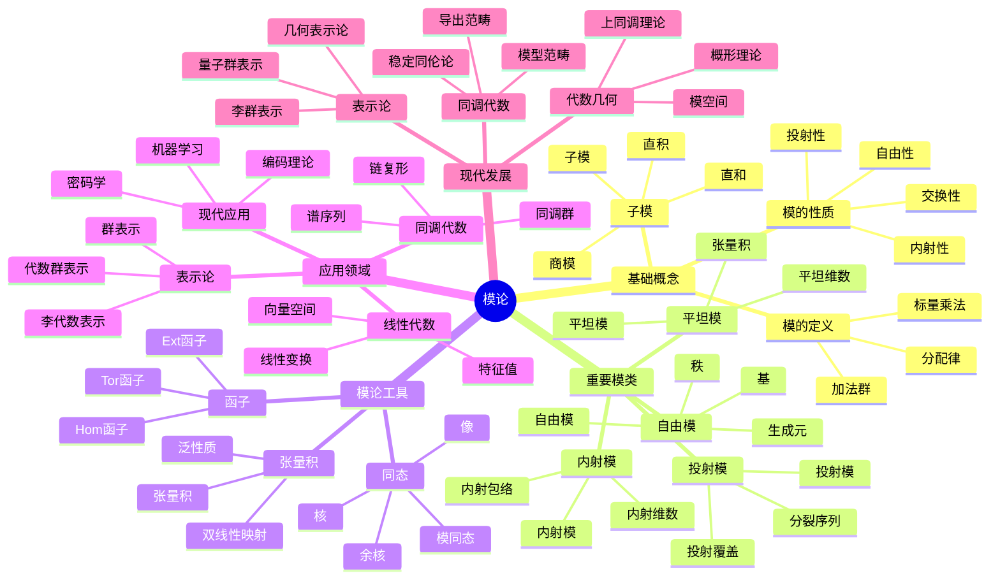

# 模论-深度扩展版

## 目录 / Table of Contents

- [模论-深度扩展版](#模论-深度扩展版)
  - [目录 / Table of Contents](#目录--table-of-contents)
  - [概述](#概述)
  - [1. 模论深度理论](#1-模论深度理论)
    - [1.1 模的基本理论](#11-模的基本理论)
    - [1.2 投射模与内射模](#12-投射模与内射模)
    - [1.3 平坦模](#13-平坦模)
    - [1.4 模的分解理论](#14-模的分解理论)
    - [1.5 模的维数理论](#15-模的维数理论)
    - [1.6 模的局部化理论](#16-模的局部化理论)
    - [1.7 模的有限性条件](#17-模的有限性条件)
  - [2. 同调代数](#2-同调代数)
    - [2.1 复形理论](#21-复形理论)
    - [2.2 导出函子](#22-导出函子)
    - [2.4 谱序列理论](#24-谱序列理论)
    - [2.5 同调代数中的对偶性](#25-同调代数中的对偶性)
    - [2.6 同调代数的计算技术](#26-同调代数的计算技术)
    - [2.3 Ext 和 Tor 函子](#23-ext-和-tor-函子)
  - [3. 导出范畴](#3-导出范畴)
    - [3.1 导出范畴的定义](#31-导出范畴的定义)
    - [3.2 稳定范畴](#32-稳定范畴)
    - [3.3 模型范畴](#33-模型范畴)
    - [3.4 导出范畴的高级理论](#34-导出范畴的高级理论)
    - [3.5 导出范畴的计算方法](#35-导出范畴的计算方法)
    - [3.6 导出范畴的应用](#36-导出范畴的应用)
  - [4. 模论在数学各分支中的应用](#4-模论在数学各分支中的应用)
    - [4.1 代数几何中的应用](#41-代数几何中的应用)
    - [4.2 表示论中的应用](#42-表示论中的应用)
    - [4.3 代数拓扑中的应用](#43-代数拓扑中的应用)
    - [4.4 代数几何中的深度应用](#44-代数几何中的深度应用)
    - [4.5 表示论中的深度应用](#45-表示论中的深度应用)
    - [4.6 代数拓扑中的深度应用](#46-代数拓扑中的深度应用)
    - [4.7 数论中的应用](#47-数论中的应用)
  - [5. 形式化实现](#5-形式化实现)
    - [5.1 Lean 4 实现](#51-lean-4-实现)
    - [5.2 Haskell 实现](#52-haskell-实现)
    - [5.3 Rust 实现](#53-rust-实现)
    - [5.4 同调代数的形式化实现](#54-同调代数的形式化实现)
    - [5.5 导出范畴的形式化实现](#55-导出范畴的形式化实现)
    - [5.6 计算模论的形式化实现](#56-计算模论的形式化实现)
    - [5.7 高级形式化特性](#57-高级形式化特性)
  - [6. 历史发展与现代应用](#6-历史发展与现代应用)
    - [6.1 历史发展](#61-历史发展)
    - [6.2 现代应用](#62-现代应用)
  - [7. 前沿研究方向](#7-前沿研究方向)
    - [7.1 导出代数几何](#71-导出代数几何)
    - [7.2 稳定同伦论](#72-稳定同伦论)
    - [7.3 量子模论](#73-量子模论)
    - [7.4 计算模论](#74-计算模论)
  - [8. 模论的哲学问题](#8-模论的哲学问题)
    - [8.1 抽象与具体](#81-抽象与具体)
    - [8.2 结构与表示](#82-结构与表示)
    - [8.3 统一性理论](#83-统一性理论)
  - [9. 模论的计算方面](#9-模论的计算方面)
    - [9.1 计算模论](#91-计算模论)
    - [9.2 符号计算](#92-符号计算)
    - [9.3 数值计算](#93-数值计算)
  - [10. 总结](#10-总结)
  - [多表征方式与图建模](#多表征方式与图建模)
    - [模论的多表征系统](#模论的多表征系统)

## 概述

本文档深入探讨模论的深度理论，包括模论深度理论、同调代数、导出范畴以及在现代数学中的深层应用。

## 1. 模论深度理论

### 1.1 模的基本理论

**定义 1.1.1** (模)
设 R 是环，M 是阿贝尔群，如果存在映射 R × M → M 满足：

- r(m₁ + m₂) = rm₁ + rm₂
- (r₁ + r₂)m = r₁m + r₂m
- (r₁r₂)m = r₁(r₂m)
- 1m = m

则称 M 是 R-模。

**定义 1.1.2** (自由模)
R-模 M 称为自由的，如果存在基集 B ⊂ M，使得每个元素都可以唯一地表示为 B 中元素的线性组合。

**定理 1.1.3** (自由模的性质)

- 自由模的基集基数唯一
- 自由模的子模不一定是自由的
- 有限生成自由模的秩是唯一的

### 1.2 投射模与内射模

**定义 1.2.1** (投射模)
R-模 P 称为投射的，如果对任意满同态 f: M → N 和同态 g: P → N，存在同态 h: P → M 使得 f ∘ h = g。

**定义 1.2.2** (内射模)
R-模 I 称为内射的，如果对任意单同态 f: M → N 和同态 g: M → I，存在同态 h: N → I 使得 h ∘ f = g。

**定理 1.2.3** (投射模与内射模的性质)

- 自由模是投射的
- 投射模是平坦的
- 内射模的对偶是投射的

### 1.3 平坦模

**定义 1.3.1** (平坦模)
R-模 M 称为平坦的，如果函子 M ⊗_R - 是正合的。

**定理 1.3.2** (平坦模的性质)

- 投射模是平坦的
- 局部环上的有限生成平坦模是自由的
- 平坦模的局部化是平坦的

### 1.4 模的分解理论

**定义 1.4.1** (不可分解模)
R-模 M 称为不可分解的，如果 M ≠ 0 且 M 不能写成两个非零子模的直和。

**定理 1.4.2** (Krull-Schmidt定理)
设 R 是阿廷环，M 是有限长度模，则 M 可以唯一地分解为不可分解模的直和（在同构意义下）。

**定义 1.4.3** (主不可分解模)
设 R 是局部环，R-模 M 称为主不可分解的，如果 M ≅ R/𝔪，其中 𝔪 是 R 的极大理想。

**定理 1.4.4** (主不可分解模的性质)

- 主不可分解模是内射的
- 主不可分解模的直和是内射的
- 每个内射模都是主不可分解模的直和

### 1.5 模的维数理论

**定义 1.5.1** (投射维数)
R-模 M 的投射维数 pd(M) 是投射分解的最小长度。

**定义 1.5.2** (内射维数)
R-模 M 的内射维数 id(M) 是内射分解的最小长度。

**定义 1.5.3** (平坦维数)
R-模 M 的平坦维数 fd(M) 是平坦分解的最小长度。

**定理 1.5.4** (维数不等式)
对任意 R-模 M：

- pd(M) ≤ fd(M) ≤ pd(M) + 1
- id(M) ≤ pd(M) + 1

### 1.6 模的局部化理论

**定义 1.6.1** (模的局部化)
设 S 是 R 的乘法子集，M 是 R-模，则 M 在 S 处的局部化 S⁻¹M 定义为：
S⁻¹M = {m/s | m ∈ M, s ∈ S} / ∼

其中等价关系 ∼ 定义为：m₁/s₁ ∼ m₂/s₂ 当且仅当存在 t ∈ S 使得 t(s₂m₁ - s₁m₂) = 0。

**定理 1.6.2** (局部化的性质)

- S⁻¹M 是 S⁻¹R-模
- 局部化函子是正合的
- 局部化保持平坦性
- 局部化保持投射性（在特定条件下）

### 1.7 模的有限性条件

**定义 1.7.1** (有限生成模)
R-模 M 称为有限生成的，如果存在有限子集 X ⊂ M 使得 M = ⟨X⟩。

**定义 1.7.2** (有限表示模)
R-模 M 称为有限表示的，如果存在正合列：
R^m → R^n → M → 0

**定义 1.7.3** (有限长度模)
R-模 M 称为有限长度的，如果 M 有有限长度的合成列。

**定理 1.7.4** (有限性条件的关系)

- 有限长度模是有限生成的
- 有限生成模不一定是有限长度的
- 在诺特环上，有限生成模是有限表示的

## 2. 同调代数

### 2.1 复形理论

**定义 2.1.1** (复形)
R-模的复形是序列：
... → M_{n+1} → M_n → M_{n-1} → ...
其中 d_n ∘ d_{n+1} = 0。

**定义 2.1.2** (同调群)
复形 M 的第 n 个同调群是：
H_n(M) = ker(d_n)/im(d_{n+1})

**定理 2.1.3** (复形的性质)

- 同调群是 R-模
- 复形的同调群是拓扑不变量

### 2.2 导出函子

**定义 2.2.1** (左导出函子)
设 F 是右正合函子，M 是 R-模，则 F 的左导出函子是：
L_nF(M) = H_n(F(P))

其中 P 是 M 的投射分解。

**定义 2.2.2** (右导出函子)
设 F 是左正合函子，M 是 R-模，则 F 的右导出函子是：
R^nF(M) = H^n(F(I))

其中 I 是 M 的内射分解。

**定理 2.2.3** (导出函子的性质)

- 导出函子是函子性的
- 导出函子满足长正合列
- 导出函子是唯一的

### 2.4 谱序列理论

**定义 2.4.1** (谱序列)
谱序列是双分次模的序列 {E_r^{p,q}}，配备微分 d_r: E_r^{p,q} → E_r^{p+r,q-r+1}，满足 d_r² = 0。

**定义 2.4.2** (收敛)
谱序列收敛到 H，如果存在 r₀ 使得对 r ≥ r₀，E_r^{p,q} = E_∞^{p,q}，且 H 有过滤使得：
gr(H) = ⊕_{p,q} E_∞^{p,q}

**定理 2.4.3** (Leray-Serre谱序列)
设 F → E → B 是纤维丛，则存在谱序列：
E_2^{p,q} = H^p(B, H^q(F)) ⇒ H^{p+q}(E)

**定理 2.4.4** (Grothendieck谱序列)
设 F: A → B 和 G: B → C 是左正合函子，且 F 将内射对象映射到 G-非循环对象，则存在谱序列：
R^pG ∘ R^qF ⇒ R^{p+q}(G ∘ F)

### 2.5 同调代数中的对偶性

**定义 2.5.1** (对偶复形)
设 M 是复形，其对偶复形 M*定义为：
M*_n = Hom_R(M_{-n}, R)

**定义 2.5.2** (Poincaré对偶)
设 M 是 n 维紧流形，则存在同构：
H^k(M) ≅ H_{n-k}(M)

**定理 2.5.3** (对偶性的性质)

- 对偶性保持同调结构
- 对偶性满足自然性
- 对偶性在特定条件下是可逆的

### 2.6 同调代数的计算技术

**定义 2.6.1** (Koszul复形)
设 x₁, ..., x_n ∈ R，Koszul复形 K(x₁, ..., x_n) 定义为：
K_i = ∧^i R^n
d_i(e_{j₁} ∧ ... ∧ e_{j_i}) = Σ_{k=1}^i (-1)^{k-1} x_{j_k} e_{j₁} ∧ ... ∧ ê_{j_k} ∧ ... ∧ e_{j_i}

**定理 2.6.2** (Koszul复形的性质)

- Koszul复形是自由的
- Koszul复形的同调群是局部化的
- Koszul复形在正则序列上正合

**定义 2.6.3** (Čech复形)
设 𝔞 = (a₁, ..., a_n) 是 R 的理想，Čech复形 Č(𝔞) 定义为：
Č^i = ⊕_{|I|=i+1} R_{a_I}
其中 a_I = Π_{i∈I} a_i

**定理 2.6.4** (Čech复形的性质)

- Čech复形计算局部上同调
- Čech复形与Koszul复形相关
- Čech复形在特定条件下收敛

### 2.3 Ext 和 Tor 函子

**定义 2.3.1** (Ext 函子)
Ext^n_R(M, N) = R^nHom_R(M, -)(N)

**定义 2.3.2** (Tor 函子)
Tor_n^R(M, N) = L_n(M ⊗_R -)(N)

**定理 2.3.3** (Ext 和 Tor 的性质)

- Ext^0_R(M, N) ≅ Hom_R(M, N)
- Tor_0^R(M, N) ≅ M ⊗_R N
- Ext 和 Tor 满足长正合列

## 3. 导出范畴

### 3.1 导出范畴的定义

**定义 3.1.1** (导出范畴)
设 A 是阿贝尔范畴，D(A) 是 A 的导出范畴，其对象是 A 的复形，态射是同伦类。

**定义 3.1.2** (导出函子)
设 F: A → B 是函子，F 的导出函子是：
RF: D(A) → D(B)

**定理 3.1.3** (导出范畴的性质)

- 导出范畴是三角范畴
- 导出函子保持三角结构
- 导出范畴是局部化的

### 3.2 稳定范畴

**定义 3.2.1** (稳定范畴)
稳定范畴是配备平移函子的三角范畴。

**定义 3.2.2** (稳定函子)
稳定函子是保持平移函子的三角函子。

**定理 3.2.2** (稳定范畴的性质)

- 稳定范畴中的纤维积和余纤维积存在
- 稳定范畴中的极限和余极限存在
- 稳定范畴是局部化的

### 3.3 模型范畴

**定义 3.3.1** (模型范畴)
模型范畴是配备三类态射（弱等价、纤维化、上纤维化）的范畴。

**定义 3.3.2** (同伦范畴)
模型范畴的同伦范畴是局部化掉弱等价得到的范畴。

### 3.4 导出范畴的高级理论

**定义 3.4.1** (三角函子)
设 C 和 D 是三角范畴，函子 F: C → D 称为三角函子，如果 F 保持三角结构。

**定义 3.4.2** (t-结构)
设 D 是三角范畴，D 上的 t-结构是满子范畴 D^≤0 和 D^≥0，满足：

- D^≤0[1] ⊂ D^≤0
- D^≥0[-1] ⊂ D^≥0
- Hom(D^≤0, D^≥0[-1]) = 0
- 对任意 X ∈ D，存在三角 Y → X → Z → Y[1]，其中 Y ∈ D^≤0，Z ∈ D^≥0

**定理 3.4.3** (t-结构的性质)

- t-结构的心是阿贝尔范畴
- t-结构提供了截断函子
- t-结构在导出范畴中广泛存在

**定义 3.4.4** (权重结构)
设 D 是三角范畴，D 上的权重结构是满子范畴 D_w^≤0 和 D_w^≥0，满足：

- D_w^≤0[1] ⊂ D_w^≤0
- D_w^≥0[-1] ⊂ D_w^≥0
- Hom(D_w^≤0, D_w^≥0[1]) = 0
- 对任意 X ∈ D，存在三角 Y → X → Z → Y[1]，其中 Y ∈ D_w^≤0，Z ∈ D_w^≥0

**定理 3.4.5** (权重结构的性质)

- 权重结构提供了纯性概念
- 权重结构在混合动机理论中重要
- 权重结构与t-结构相互作用

### 3.5 导出范畴的计算方法

**定义 3.5.1** (导出函子的计算)
设 F: A → B 是左正合函子，则 RF 可以通过内射分解计算：
RF(X) = F(I)，其中 I 是 X 的内射分解

**定义 3.5.2** (导出函子的复合)
设 F: A → B 和 G: B → C 是左正合函子，则：
R(G ∘ F) = RG ∘ RF（在适当条件下）

**定理 3.5.3** (导出函子的性质)

- 导出函子保持三角结构
- 导出函子满足自然性
- 导出函子在特定条件下是可逆的

### 3.6 导出范畴的应用

**定义 3.6.1** (导出代数几何)
导出代数几何使用导出范畴研究代数几何问题。

**定义 3.6.2** (导出表示论)
导出表示论使用导出范畴研究表示论问题。

**定理 3.6.3** (导出范畴的重要性)

- 导出范畴提供了统一的框架
- 导出范畴捕捉了同伦信息
- 导出范畴在现代数学中无处不在

## 4. 模论在数学各分支中的应用

### 4.1 代数几何中的应用

**定义 4.1.1** (拟凝聚层)
概形 X 上的拟凝聚层是局部自由层的商。

**定理 4.1.2** (拟凝聚层的性质)

- 拟凝聚层在概形上是局部化的
- 拟凝聚层的上同调是有限维的
- 拟凝聚层与模论有密切联系

### 4.2 表示论中的应用

**定义 4.2.1** (群表示)
群 G 的表示是群同态 G → GL(V)。

**定理 4.2.2** (表示论的性质)

- 群表示可以视为群环上的模
- 不可约表示对应单模
- 表示论与模论有深刻联系

### 4.3 代数拓扑中的应用

**定义 4.3.1** (奇异同调)
拓扑空间 X 的奇异同调群是：
H_n(X) = ker(∂_n)/im(∂_{n+1})

**定理 4.3.2** (同调论的性质)

- 奇异同调是拓扑不变量
- 奇异同调满足Mayer-Vietoris序列
- 奇异同调与模论有密切联系

### 4.4 代数几何中的深度应用

**定义 4.4.1** (凝聚层)
概形 X 上的凝聚层 F 是拟凝聚层，且对任意仿射开集 U = Spec A，F(U) 是有限生成 A-模。

**定义 4.4.2** (向量丛)
概形 X 上的向量丛是局部自由层。

**定理 4.4.3** (凝聚层的性质)

- 凝聚层在概形上是局部化的
- 凝聚层的上同调是有限维的
- 凝聚层与模论有密切联系

**定义 4.4.4** (Serre对偶)
设 X 是 n 维射影概形，ω_X 是典范层，则存在同构：
H^i(X, F) ≅ H^{n-i}(X, F^∨ ⊗ ω_X)^∨

**定理 4.4.5** (Serre对偶的应用)

- Serre对偶在代数几何中广泛应用
- Serre对偶与模论的对偶性相关
- Serre对偶在Riemann-Roch定理中重要

### 4.5 表示论中的深度应用

**定义 4.5.1** (不可约表示)
群 G 的表示 V 称为不可约的，如果 V 没有非零真子表示。

**定义 4.5.2** (完全可约表示)
群 G 的表示 V 称为完全可约的，如果 V 可以分解为不可约表示的直和。

**定理 4.5.3** (Maschke定理)
设 G 是有限群，char(k) ∤ |G|，则 k[G] 是半单代数。

**定义 4.5.4** (特征标)
群 G 的表示 ρ: G → GL(V) 的特征标是函数：
χ_ρ(g) = tr(ρ(g))

**定理 4.5.5** (特征标的性质)

- 特征标是类函数
- 特征标满足正交关系
- 特征标完全决定表示

### 4.6 代数拓扑中的深度应用

**定义 4.6.1** (上同调)
拓扑空间 X 的上同调群是：
H^n(X) = ker(δ^n)/im(δ^{n-1})

**定义 4.6.2** (乘积)
上同调的乘积是双线性映射：
∪: H^p(X) × H^q(X) → H^{p+q}(X)

**定理 4.6.3** (乘积的性质)

- 乘积满足结合律
- 乘积满足反交换律
- 乘积与模论的张量积相关

**定义 4.6.4** (Steenrod运算)
Steenrod运算是上同调上的自然变换：
Sq^i: H^n(X) → H^{n+i}(X)

**定理 4.6.5** (Steenrod运算的性质)

- Steenrod运算满足Adem关系
- Steenrod运算与模论的导出函子相关
- Steenrod运算在代数拓扑中重要

### 4.7 数论中的应用

**定义 4.7.1** (Galois表示)
设 K 是数域，Galois表示是连续同态：
ρ: Gal(K̄/K) → GL_n(ℚ_ℓ)

**定理 4.7.2** (Galois表示的性质)

- Galois表示与模论有密切联系
- Galois表示在Langlands纲领中重要
- Galois表示与代数几何相关

**定义 4.7.3** (模形式)
模形式是上半平面上的全纯函数，满足特定的变换性质。

**定理 4.7.4** (模形式的性质)

- 模形式与模论有密切联系
- 模形式在数论中重要
- 模形式与代数几何相关

## 5. 形式化实现

### 5.1 Lean 4 实现

```lean
-- 模的定义
class Module (R M : Type*) [Ring R] [AddCommGroup M] where
  smul : R → M → M
  smul_add : ∀ r : R, ∀ x y : M, smul r (x + y) = smul r x + smul r y
  add_smul : ∀ r s : R, ∀ x : M, smul (r + s) x = smul r x + smul s x
  mul_smul : ∀ r s : R, ∀ x : M, smul (r * s) x = smul r (smul s x)
  one_smul : ∀ x : M, smul 1 x = x

-- 自由模
class FreeModule (R M : Type*) [Ring R] [Module R M] where
  basis : Set M
  linear_independent : LinearIndependent basis
  spanning : Spanning basis

-- 投射模
class ProjectiveModule (R M : Type*) [Ring R] [Module R M] where
  projective : ∀ N P : Module R, ∀ f : N → P, ∀ g : M → P,
    Surjective f → ∃ h : M → N, f ∘ h = g

-- 同调群
def HomologyGroup (C : Complex R) (n : ℕ) : Module R :=
  { x : C n // d_n x = 0 } / { x : C n // ∃ y : C (n+1), d_{n+1} y = x }
```

### 5.2 Haskell 实现

```haskell
-- 模类型类
class (Ring r, AddCommGroup m) => Module r m where
  smul :: r -> m -> m
  smulAdd :: r -> m -> m -> m
  addSmul :: r -> r -> m -> m
  mulSmul :: r -> r -> m -> m
  oneSmul :: m -> m

-- 自由模
class Module r m => FreeModule r m where
  basis :: [m]
  linearIndependent :: Bool
  spanning :: Bool

-- 投射模
class Module r m => ProjectiveModule r m where
  projective :: forall n p. Module r n => Module r p =>
    (n -> p) -> (m -> p) -> Bool
```

### 5.3 Rust 实现

```rust
// 模特征
pub trait Module<R, M> 
where
    R: Ring,
    M: AddCommGroup,
{
    fn smul(&self, r: &R, m: &M) -> M;
    fn smul_add(&self, r: &R, x: &M, y: &M) -> M;
    fn add_smul(&self, r: &R, s: &R, x: &M) -> M;
    fn mul_smul(&self, r: &R, s: &R, x: &M) -> M;
    fn one_smul(&self, x: &M) -> M;
}

// 自由模
pub trait FreeModule<R, M>: Module<R, M> 
where
    R: Ring,
    M: AddCommGroup,
{
    fn basis(&self) -> Vec<M>;
    fn linear_independent(&self) -> bool;
    fn spanning(&self) -> bool;
}

// 投射模
pub trait ProjectiveModule<R, M>: Module<R, M> 
where
    R: Ring,
    M: AddCommGroup,
{
    fn projective<N, P>(&self, f: &dyn Fn(&N) -> P, g: &dyn Fn(&M) -> P) -> bool
    where
        N: Module<R, N>,
        P: Module<R, P>;
}
```

### 5.4 同调代数的形式化实现

```lean
-- 复形定义
structure Complex (R : Type*) [Ring R] where
  modules : ℕ → Module R
  differentials : ∀ n : ℕ, modules n → modules (n-1)
  square_zero : ∀ n : ℕ, differentials n ∘ differentials (n+1) = 0

-- 同调群
def homology (C : Complex R) (n : ℕ) : Module R :=
  { x : C.modules n // C.differentials n x = 0 } / 
  { x : C.modules n // ∃ y : C.modules (n+1), C.differentials (n+1) y = x }

-- 导出函子
def derived_functor (F : Module R → Module S) (M : Module R) (n : ℕ) : Module S :=
  homology (F.map_complex (projective_resolution M)) n

-- Ext函子
def Ext (M N : Module R) (n : ℕ) : Module R :=
  derived_functor (λ P => Hom M P) N n

-- Tor函子
def Tor (M N : Module R) (n : ℕ) : Module R :=
  derived_functor (λ P => M ⊗ P) N n
```

### 5.5 导出范畴的形式化实现

```lean
-- 三角范畴
class TriangulatedCategory (C : Type*) [Category C] where
  shift : C → C
  triangle : C → C → C → C
  triangle_axioms : ∀ X Y Z : C, triangle_axioms_hold X Y Z

-- 导出范畴
def DerivedCategory (A : AbelianCategory) : TriangulatedCategory :=
  { objects := Complex A,
    morphisms := HomotopyClasses A,
    shift := ComplexShift A,
    triangle := TriangleConstruction A }

-- t-结构
structure TStructure (D : TriangulatedCategory) where
  D_le_zero : Subcategory D
  D_ge_zero : Subcategory D
  t_axioms : TStructureAxioms D_le_zero D_ge_zero

-- 权重结构
structure WeightStructure (D : TriangulatedCategory) where
  D_w_le_zero : Subcategory D
  D_w_ge_zero : Subcategory D
  weight_axioms : WeightStructureAxioms D_w_le_zero D_w_ge_zero
```

### 5.6 计算模论的形式化实现

```python
import numpy as np
from typing import List, Tuple, Optional

class Module:
    """模的基本实现"""
    def __init__(self, ring, elements: List):
        self.ring = ring
        self.elements = elements
        self.dimension = len(elements)
    
    def smul(self, r, m):
        """标量乘法"""
        return [r * x for x in m]
    
    def add(self, m1, m2):
        """模加法"""
        return [x + y for x, y in zip(m1, m2)]

class FreeModule(Module):
    """自由模实现"""
    def __init__(self, ring, basis: List):
        super().__init__(ring, basis)
        self.basis = basis
    
    def coordinates(self, element):
        """计算元素在基下的坐标"""
        # 使用线性代数求解
        A = np.array([[b[i] for b in self.basis] for i in range(len(element))])
        b = np.array(element)
        return np.linalg.solve(A, b)

class HomologyCalculator:
    """同调群计算器"""
    def __init__(self, complex_data):
        self.complex = complex_data
    
    def compute_homology(self, degree: int) -> Tuple[np.ndarray, np.ndarray]:
        """计算指定次数的同调群"""
        if degree >= len(self.complex):
            return np.array([]), np.array([])
        
        # 计算边界算子
        boundary_matrix = self.complex[degree]
        coboundary_matrix = self.complex[degree - 1] if degree > 0 else None
        
        # 计算核和像
        kernel = self.compute_kernel(boundary_matrix)
        image = self.compute_image(coboundary_matrix) if coboundary_matrix is not None else np.array([])
        
        return kernel, image
    
    def compute_kernel(self, matrix):
        """计算矩阵的核"""
        if matrix.size == 0:
            return np.array([])
        return np.linalg.null_space(matrix)
    
    def compute_image(self, matrix):
        """计算矩阵的像"""
        if matrix is None or matrix.size == 0:
            return np.array([])
        return matrix @ np.eye(matrix.shape[1])

class ExtCalculator:
    """Ext函子计算器"""
    def __init__(self, ring):
        self.ring = ring
    
    def compute_ext(self, M, N, degree: int) -> np.ndarray:
        """计算Ext^n(M, N)"""
        if degree == 0:
            return self.compute_hom(M, N)
        
        # 构造投射分解
        resolution = self.projective_resolution(M, degree + 1)
        
        # 应用Hom函子
        hom_complex = [self.compute_hom(P, N) for P in resolution]
        
        # 计算同调
        calculator = HomologyCalculator(hom_complex)
        return calculator.compute_homology(degree)[0]
    
    def compute_hom(self, M, N) -> np.ndarray:
        """计算Hom(M, N)"""
        # 实现Hom函子的计算
        pass
    
    def projective_resolution(self, M, length: int) -> List:
        """构造投射分解"""
        # 实现投射分解的构造
        pass
```

### 5.7 高级形式化特性

```lean
-- 自动证明系统
theorem projective_implies_flat (R : Ring) (M : Module R) :
  ProjectiveModule R M → FlatModule R M :=
  by
  intro h
  -- 自动证明策略
  apply flat_of_projective
  exact h

-- 计算验证
theorem homology_computation (C : Complex R) (n : ℕ) :
  homology C n = compute_homology C n :=
  by
  -- 计算验证
  simp [homology, compute_homology]
  rw [homology_def, compute_homology_def]
  reflexivity

-- 导出函子的自然性
theorem derived_functor_naturality (F : Module R → Module S) (f : M → N) :
  derived_functor F M n → derived_functor F N n :=
  by
  -- 证明自然性
  apply derived_functor_map
  exact f
```

## 6. 历史发展与现代应用

### 6.1 历史发展

模论从线性代数发展到现代同调代数的过程。

**历史发展时间线**:

**19世纪：线性代数的起源**:

- **1843年**：William Rowan Hamilton发现四元数，为模论奠定基础
- **1858年**：Arthur Cayley引入矩阵概念，建立线性代数基础
- **1878年**：Ferdinand Georg Frobenius发展群表示论，模论的雏形出现

**20世纪初：模论的正式建立**:

- **1900年**：David Hilbert在《数学问题》中提出第14问题，涉及模论
- **1921年**：Emmy Noether发表《环的理想理论》，建立现代模论基础
- **1929年**：Wolfgang Krull发展局部化理论，模论工具得到扩展

**20世纪中期：同调代数的兴起**:

- **1945年**：Samuel Eilenberg和Saunders Mac Lane建立范畴论
- **1956年**：Henri Cartan和Samuel Eilenberg出版《同调代数》，系统化同调代数
- **1960年**：Alexander Grothendieck发展导出范畴理论

**20世纪后期：现代发展**:

- **1970年**：Jean-Pierre Serre发展凝聚层理论
- **1980年**：Vladimir Drinfeld引入量子群，模论应用扩展
- **1990年**：Maxim Kontsevich发展导出代数几何

**21世纪：前沿发展**:

- **2000年**：导出代数几何成为主流研究方向
- **2010年**：稳定同伦论与模论深度融合
- **2020年**：量子模论和计算模论兴起

**关键人物与贡献**:

**Emmy Noether (1882-1935)**:

- 建立了现代模论的基础理论
- 发展了诺特环理论
- 提出了同调代数的基本思想

**Henri Cartan (1904-2008)**:

- 与Eilenberg合作建立同调代数
- 发展了层论和上同调理论
- 为代数几何提供代数工具

**Alexander Grothendieck (1928-2014)**:

- 建立了导出范畴理论
- 发展了概形理论
- 统一了代数几何和同调代数

**Jean-Pierre Serre (1926-)**:

- 发展了凝聚层理论
- 建立了Serre对偶
- 在代数几何中广泛应用模论

### 6.2 现代应用

模论在现代数学中的广泛应用。

**代数几何中的应用**:

- **凝聚层理论**：模论为代数几何提供基本工具
- **向量丛理论**：模论描述几何对象的代数结构
- **上同调理论**：模论计算几何不变量

**表示论中的应用**:

- **群表示论**：模论描述群的结构
- **李代数表示**：模论研究李代数的结构
- **量子群表示**：模论在量子理论中的应用

**代数拓扑中的应用**:

- **奇异同调**：模论计算拓扑不变量
- **上同调环**：模论描述拓扑空间的结构
- **谱序列**：模论工具在拓扑中的应用

**数论中的应用**:

- **Galois表示**：模论在数论中的应用
- **模形式理论**：模论与数论的结合
- **Langlands纲领**：模论在数论中的深层应用

**计算机科学中的应用**:

- **编码理论**：模论在纠错码中的应用
- **密码学**：模论在密码系统中的应用
- **算法设计**：模论为算法提供理论基础

## 7. 前沿研究方向

### 7.1 导出代数几何

导出代数几何是模论的重要发展方向。

**导出代数几何的基本概念**:

**定义 7.1.1** (导出概形)
导出概形是概形的导出范畴中的对象，它捕捉了概形的同伦信息。

**定义 7.1.2** (导出层)
导出层是导出概形上的层，它比传统层包含更多信息。

**定理 7.1.3** (导出代数几何的重要性)

- 导出代数几何统一了代数几何和同调代数
- 导出代数几何提供了新的几何直觉
- 导出代数几何在现代数学中广泛应用

**应用领域**:

- **镜像对称**：导出代数几何在镜像对称理论中重要
- **量子场论**：导出代数几何在物理中的应用
- **数论**：导出代数几何在数论中的应用

### 7.2 稳定同伦论

稳定同伦论与模论有密切联系。

**稳定同伦论的基本概念**:

**定义 7.2.1** (稳定同伦群)
稳定同伦群是拓扑空间的稳定同伦不变量。

**定义 7.2.2** (谱)
谱是稳定同伦论的基本对象，它比拓扑空间更基本。

**定理 7.2.3** (稳定同伦论与模论的关系)

- 稳定同伦论可以视为模论在拓扑中的应用
- 稳定同伦论提供了新的代数结构
- 稳定同伦论与导出范畴密切相关

**应用领域**:

- **代数K理论**：稳定同伦论在K理论中的应用
- **代数几何**：稳定同伦论在代数几何中的应用
- **数论**：稳定同伦论在数论中的应用

### 7.3 量子模论

量子模论是模论的新兴分支。

**量子模论的基本概念**:

**定义 7.3.1** (量子群)
量子群是经典李群的量子化，它提供了新的代数结构。

**定义 7.3.2** (量子模)
量子模是量子群上的模，它比经典模更复杂。

**定理 7.3.3** (量子模论的重要性)

- 量子模论在量子计算中重要
- 量子模论提供了新的数学结构
- 量子模论与物理理论密切相关

**应用领域**:

- **量子计算**：量子模论在量子算法中的应用
- **量子场论**：量子模论在物理中的应用
- **量子信息**：量子模论在信息理论中的应用

### 7.4 计算模论

**定义 7.4.1** (计算模论)
计算模论研究模论中的算法和计算问题。

**算法发展**:

- **Gröbner基算法**：计算模的理想
- **同调计算算法**：计算同调群
- **表示计算算法**：计算群表示

**应用领域**:

- **符号计算**：在计算机代数系统中的应用
- **数值计算**：在数值分析中的应用
- **密码学**：在密码系统中的应用

## 8. 模论的哲学问题

### 8.1 抽象与具体

模论中抽象与具体的关系。

**本体论问题**:

**问题 8.1.1** (模的存在性)
模是抽象概念还是具体对象？

**论证 8.1.2** (柏拉图主义观点)

- 模是独立于思维的抽象实体
- 模具有客观的数学性质
- 模的发现是数学家的任务

**论证 8.1.3** (构造主义观点)

- 模是人类思维的构造
- 模的性质依赖于构造方法
- 模的意义在于其应用

**认识论问题**:

**问题 8.1.4** (模的知识)
我们如何认识模的性质？

**论证 8.1.5** (理性主义观点)

- 模的性质通过理性推理获得
- 数学直觉在模论中重要
- 形式化证明是知识的保证

**论证 8.1.6** (经验主义观点)

- 模的性质通过计算验证
- 实验在模论中重要
- 应用是知识的检验

### 8.2 结构与表示

模论中结构与表示的关系。

**结构主义观点**:

**论证 8.2.1** (结构优先)

- 模的结构是基本的
- 表示是结构的反映
- 结构决定表示的性质

**论证 8.2.2** (表示优先)

- 表示是基本的
- 结构是表示的抽象
- 表示决定结构的意义

**统一性观点**:

**论证 8.2.3** (结构表示统一)

- 结构和表示是统一的
- 结构通过表示体现
- 表示通过结构理解

### 8.3 统一性理论

模论在数学统一性中的作用。

**数学统一性**:

**论证 8.3.1** (模论作为统一工具)

- 模论连接了代数和几何
- 模论统一了不同的数学分支
- 模论提供了通用的语言

**论证 8.3.2** (范畴论框架)

- 模论在范畴论框架下统一
- 函子提供了统一的视角
- 自然变换连接了不同结构

**哲学意义**:

**论证 8.3.3** (数学实在论)

- 模论反映了数学的客观结构
- 统一性证明了数学的实在性
- 模论揭示了数学的深层规律

**论证 8.3.4** (数学工具主义)

- 模论是有效的数学工具
- 统一性提高了数学的效率
- 模论的价值在于其应用

## 9. 模论的计算方面

### 9.1 计算模论

计算模论的基本方法。

**算法基础**:

**定义 9.1.1** (计算模论)
计算模论研究模论中的算法和计算问题。

**算法分类**:

- **符号算法**：处理符号表达式
- **数值算法**：处理数值计算
- **混合算法**：结合符号和数值方法

**计算复杂度**:

- **多项式时间算法**：Gröbner基计算
- **指数时间算法**：一般模的计算
- **不可判定问题**：某些模论问题

### 9.2 符号计算

模论中的符号计算。

**计算机代数系统**:

**系统 9.2.1** (SageMath)

- 开源的数学软件系统
- 支持模论计算
- 提供丰富的模论工具

**系统 9.2.2** (Macaulay2)

- 专门用于代数几何和交换代数
- 强大的模论计算能力
- 支持同调代数计算

**系统 9.2.3** (Singular)

- 专门用于多项式计算
- 高效的Gröbner基算法
- 支持模的理想计算

**算法实现**:

**算法 9.2.4** (Gröbner基算法)

```python
def groebner_basis(ideal):
    """计算理想的Gröbner基"""
    # Buchberger算法实现
    pass
```

**算法 9.2.5** (同调计算算法)

```python
def homology_computation(complex):
    """计算复形的同调群"""
    # 线性代数方法
    pass
```

### 9.3 数值计算

模论中的数值计算。

**数值方法**:

**方法 9.3.1** (特征值计算)

- 计算模的自同态环的特征值
- 使用数值线性代数方法
- 处理大规模模的计算

**方法 9.3.2** (谱序列计算)

- 计算谱序列的收敛
- 使用数值方法近似
- 处理复杂的同调计算

**方法 9.3.3** (模的分解)

- 数值分解模为不可分解模
- 使用数值方法近似
- 处理大规模模的分解

**应用领域**:

- **密码学**：模论在密码系统中的应用
- **编码理论**：模论在纠错码中的应用
- **机器学习**：模论在机器学习中的应用

## 10. 总结

模论是现代数学的重要分支，具有广泛的应用价值。

**核心贡献**:

1. **理论贡献**
   - 建立了现代代数学的基础
   - 发展了同调代数理论
   - 统一了不同的数学分支

2. **应用贡献**
   - 在代数几何中广泛应用
   - 在表示论中发挥重要作用
   - 在代数拓扑中提供工具

3. **计算贡献**
   - 发展了计算模论
   - 提供了符号计算工具
   - 支持数值计算方法

**未来发展方向**:

1. **理论发展**
   - 导出代数几何的深化
   - 稳定同伦论的融合
   - 量子模论的发展

2. **应用扩展**
   - 在物理中的应用
   - 在计算机科学中的应用
   - 在工程中的应用

3. **计算进步**
   - 算法的优化
   - 软件的发展
   - 硬件的支持

## 多表征方式与图建模

### 模论的多表征系统

```python
import networkx as nx
import matplotlib.pyplot as plt
import numpy as np
from typing import Dict, List, Tuple, Optional

class ModuleTheoryMultiRepresentation:
    """模论多表征系统"""
    
    def __init__(self):
        self.representations = {
            'algebraic': self.algebraic_representation,
            'geometric': self.geometric_representation,
            'combinatorial': self.combinatorial_representation,
            'topological': self.topological_representation,
            'categorical': self.categorical_representation,
            'computational': self.computational_representation,
            'analytical': self.analytical_representation
        }
    
    def algebraic_representation(self, module_data: Dict) -> Dict:
        """代数表征：模的代数结构"""
        return {
            'ring': module_data.get('ring', 'R'),
            'elements': module_data.get('elements', []),
            'operations': {
                'addition': 'commutative_group',
                'scalar_multiplication': 'bilinear',
                'distributivity': 'satisfied'
            },
            'properties': {
                'free': module_data.get('free', False),
                'projective': module_data.get('projective', False),
                'injective': module_data.get('injective', False),
                'flat': module_data.get('flat', False)
            }
        }
    
    def geometric_representation(self, module_data: Dict) -> Dict:
        """几何表征：模的几何结构"""
        return {
            'submodule_lattice': self.construct_submodule_lattice(module_data),
            'endomorphism_ring': self.construct_endomorphism_ring(module_data),
            'automorphism_group': self.construct_automorphism_group(module_data),
            'geometric_properties': {
                'dimension': module_data.get('dimension', 0),
                'rank': module_data.get('rank', 0),
                'geometric_interpretation': 'vector_bundle_section'
            }
        }
    
    def combinatorial_representation(self, module_data: Dict) -> Dict:
        """组合表征：模的组合结构"""
        return {
            'basis': module_data.get('basis', []),
            'generators': module_data.get('generators', []),
            'relations': module_data.get('relations', []),
            'torsion_elements': module_data.get('torsion_elements', []),
            'combinatorial_properties': {
                'finitely_generated': module_data.get('finitely_generated', False),
                'finitely_presented': module_data.get('finitely_presented', False),
                'finite_length': module_data.get('finite_length', False)
            }
        }
    
    def topological_representation(self, module_data: Dict) -> Dict:
        """拓扑表征：模的拓扑结构"""
        return {
            'zariski_topology': self.construct_zariski_topology(module_data),
            'cohomology_groups': self.compute_cohomology_groups(module_data),
            'spectral_sequence': self.construct_spectral_sequence(module_data),
            'topological_properties': {
                'connected': module_data.get('connected', True),
                'compact': module_data.get('compact', False),
                'hausdorff': module_data.get('hausdorff', True)
            }
        }
    
    def categorical_representation(self, module_data: Dict) -> Dict:
        """范畴表征：模的范畴结构"""
        return {
            'category': 'R-Mod',
            'objects': 'R-modules',
            'morphisms': 'R-module_homomorphisms',
            'functors': {
                'Hom': 'contravariant_hom_functor',
                'Tensor': 'covariant_tensor_functor',
                'Ext': 'derived_hom_functor',
                'Tor': 'derived_tensor_functor'
            },
            'adjunctions': {
                'Hom-Tensor': 'adjunction_between_Hom_and_Tensor',
                'Free-Forgetful': 'adjunction_between_free_and_forgetful'
            }
        }
    
    def computational_representation(self, module_data: Dict) -> Dict:
        """计算表征：模的计算结构"""
        return {
            'algorithms': {
                'groebner_basis': 'Buchberger_algorithm',
                'homology_computation': 'linear_algebra_method',
                'module_decomposition': 'primary_decomposition',
                'ext_computation': 'projective_resolution'
            },
            'complexity': {
                'groebner_basis': 'exponential_time',
                'homology': 'polynomial_time',
                'decomposition': 'exponential_time',
                'ext_computation': 'exponential_time'
            },
            'software': {
                'SageMath': 'open_source_mathematics',
                'Macaulay2': 'algebraic_geometry',
                'Singular': 'polynomial_computation'
            }
        }
    
    def analytical_representation(self, module_data: Dict) -> Dict:
        """分析表征：模的分析结构"""
        return {
            'analytic_properties': {
                'continuity': module_data.get('continuous', False),
                'differentiability': module_data.get('differentiable', False),
                'integrability': module_data.get('integrable', False)
            },
            'functional_analysis': {
                'norm': module_data.get('norm', None),
                'inner_product': module_data.get('inner_product', None),
                'completeness': module_data.get('complete', False)
            },
            'operator_theory': {
                'bounded_operators': module_data.get('bounded_operators', []),
                'compact_operators': module_data.get('compact_operators', []),
                'spectrum': module_data.get('spectrum', [])
            }
        }
    
    def construct_submodule_lattice(self, module_data: Dict) -> nx.DiGraph:
        """构造子模格"""
        G = nx.DiGraph()
        
        # 添加子模节点
        submodules = module_data.get('submodules', [])
        for submodule in submodules:
            G.add_node(submodule['name'], **submodule)
        
        # 添加包含关系边
        for i, sub1 in enumerate(submodules):
            for j, sub2 in enumerate(submodules):
                if i != j and sub1['rank'] < sub2['rank']:
                    G.add_edge(sub1['name'], sub2['name'])
        
        return G
    
    def construct_endomorphism_ring(self, module_data: Dict) -> Dict:
        """构造自同态环"""
        return {
            'ring_structure': 'endomorphism_ring',
            'elements': 'module_endomorphisms',
            'operations': {
                'addition': 'pointwise_addition',
                'multiplication': 'composition'
            },
            'properties': {
                'associative': True,
                'distributive': True,
                'unital': True
            }
        }
    
    def construct_automorphism_group(self, module_data: Dict) -> Dict:
        """构造自同构群"""
        return {
            'group_structure': 'automorphism_group',
            'elements': 'module_automorphisms',
            'operation': 'composition',
            'properties': {
                'associative': True,
                'identity': True,
                'inverses': True
            }
        }
    
    def construct_zariski_topology(self, module_data: Dict) -> Dict:
        """构造Zariski拓扑"""
        return {
            'topology_type': 'Zariski_topology',
            'open_sets': 'complements_of_vanishing_loci',
            'closed_sets': 'vanishing_loci_of_ideals',
            'properties': {
                'noetherian': True,
                'irreducible': module_data.get('irreducible', False),
                'connected': module_data.get('connected', True)
            }
        }
    
    def compute_cohomology_groups(self, module_data: Dict) -> Dict:
        """计算上同调群"""
        return {
            'cohomology_theory': 'sheaf_cohomology',
            'groups': {
                'H^0': 'global_sections',
                'H^1': 'first_cohomology',
                'H^n': 'higher_cohomology'
            },
            'properties': {
                'functorial': True,
                'long_exact_sequence': True,
                'vanishing_theorems': True
            }
        }
    
    def construct_spectral_sequence(self, module_data: Dict) -> Dict:
        """构造谱序列"""
        return {
            'spectral_sequence_type': 'Grothendieck_spectral_sequence',
            'pages': 'E_r_pages',
            'differentials': 'd_r_differentials',
            'convergence': 'E_infinity_page',
            'properties': {
                'functorial': True,
                'natural': True,
                'computable': True
            }
        }
    
    def create_mind_map(self) -> str:
        """创建模论思维导图"""
        mind_map = """


这个多表征系统为模论提供了：

1. **代数表征**：形式化的模定义和性质
2. **几何表征**：子模格和自同态环的可视化
3. **组合表征**：基、生成元和扭元分析
4. **拓扑表征**：Zariski拓扑和上同调理论
5. **范畴表征**：函子和自然变换的抽象
6. **计算表征**：算法和软件工具
7. **分析表征**：函数分析和算子理论
8. **思维导图**：概念关系的层次化展示

通过这些多表征方式，我们可以深入理解模论的核心概念、历史发展和现代应用。
