# 范畴论 - 增强版

## 目录 / Table of Contents

- [范畴论 - 增强版](#范畴论---增强版)
  - [目录 / Table of Contents](#目录--table-of-contents)
  - [📚 概述](#-概述)
  - [🕰️ 历史发展脉络](#️-历史发展脉络)
    - [早期发展 (1940-1960)](#早期发展-1940-1960)
      - [代数拓扑背景](#代数拓扑背景)
      - [代数几何背景](#代数几何背景)
    - [现代发展 (1960-1990)](#现代发展-1960-1990)
      - [抽象范畴论](#抽象范畴论)
      - [同调代数](#同调代数)
    - [当代发展 (1990-至今)](#当代发展-1990-至今)
      - [高阶范畴论](#高阶范畴论)
      - [应用扩展](#应用扩展)
  - [🏗️ 核心概念](#️-核心概念)
    - [范畴的定义](#范畴的定义)
    - [基本性质](#基本性质)
      - [1. 对象和态射](#1-对象和态射)
      - [2. 复合运算](#2-复合运算)
      - [3. 函子](#3-函子)
  - [📊 可视化图表](#-可视化图表)
    - [范畴的结构图](#范畴的结构图)
    - [函子关系图](#函子关系图)
    - [自然变换图](#自然变换图)
  - [🔍 实例表征](#-实例表征)
    - [1. 集合范畴 Set](#1-集合范畴-set)
    - [2. 群范畴 Grp](#2-群范畴-grp)
    - [3. 拓扑空间范畴 Top](#3-拓扑空间范畴-top)
    - [4. 重要范畴类](#4-重要范畴类)
      - [阿贝尔范畴](#阿贝尔范畴)
      - [模范畴](#模范畴)
  - [🧠 思维过程表征](#-思维过程表征)
    - [1. 范畴论问题解决流程](#1-范畴论问题解决流程)
      - [步骤1：识别范畴结构](#步骤1识别范畴结构)
      - [步骤2：分析范畴性质](#步骤2分析范畴性质)
      - [步骤3：应用范畴论工具](#步骤3应用范畴论工具)
    - [2. 证明思维过程](#2-证明思维过程)
      - [米田引理证明](#米田引理证明)
      - [伴随函子证明](#伴随函子证明)
    - [3. 概念理解步骤](#3-概念理解步骤)
      - [理解范畴的概念](#理解范畴的概念)
      - [理解函子概念](#理解函子概念)
  - [🌍 应用场景表征](#-应用场景表征)
    - [1. 代数应用](#1-代数应用)
      - [1.1 同调代数](#11-同调代数)
      - [表示论](#表示论)
    - [2. 拓扑学应用](#2-拓扑学应用)
      - [代数拓扑](#代数拓扑)
      - [同伦论](#同伦论)
    - [3. 逻辑学应用](#3-逻辑学应用)
      - [类型论](#类型论)
      - [模型论](#模型论)
    - [4. 计算机科学应用](#4-计算机科学应用)
      - [编程语言理论](#编程语言理论)
      - [数据库理论](#数据库理论)
    - [5. 物理学应用](#5-物理学应用)
      - [量子力学](#量子力学)
      - [量子场论](#量子场论)
    - [6. 数学内部应用](#6-数学内部应用)
      - [代数几何](#代数几何)
      - [数论](#数论)
  - [🔗 知识关联网络](#-知识关联网络)
    - [与其他数学分支的联系](#与其他数学分支的联系)
      - [与代数学的联系](#与代数学的联系)
      - [与拓扑学的联系](#与拓扑学的联系)
      - [与逻辑学的联系](#与逻辑学的联系)
    - [理论发展脉络](#理论发展脉络)
      - [从具体到抽象](#从具体到抽象)
      - [从有限到无限](#从有限到无限)
      - [从经典到量子](#从经典到量子)
  - [📈 现代发展前沿](#-现代发展前沿)
    - [1. 高阶范畴论](#1-高阶范畴论)
    - [2. 量子范畴论](#2-量子范畴论)
    - [3. 应用范畴论](#3-应用范畴论)
    - [4. 计算范畴论](#4-计算范畴论)
  - [🎯 学习路径建议](#-学习路径建议)
    - [初学者路径](#初学者路径)
    - [进阶路径](#进阶路径)
    - [研究路径](#研究路径)
  - [🌟 总结](#-总结)
  - [术语对照表 / Terminology Table](#术语对照表--terminology-table)
  - [多表征方式与图建模](#多表征方式与图建模)
    - [范畴论的多表征系统](#范畴论的多表征系统)
    - [思维导图：范畴论的核心概念](#思维导图范畴论的核心概念)

## 📚 概述

范畴论是现代数学的基础语言，研究数学对象之间的映射关系。
范畴的概念统一了代数、拓扑、逻辑等众多数学领域，为现代数学提供了统一的抽象框架。

## 🕰️ 历史发展脉络

### 早期发展 (1940-1960)

#### 代数拓扑背景

- **1942年**: 艾伦伯格-麦克莱恩引入范畴概念
- **1945年**: 艾伦伯格-麦克莱恩建立同调代数
- **1950年**: 格罗滕迪克开始使用范畴论

#### 代数几何背景

- **1950年代**: 格罗滕迪克概形理论
- **1960年代**: 德利涅上同调理论
- **1970年代**: 导出范畴理论

### 现代发展 (1960-1990)

#### 抽象范畴论

- **1960年代**: 劳威尔建立范畴论基础
- **1970年代**: 麦克莱恩《范畴论工作数学家》
- **1980年代**: 约翰斯通《拓扑斯理论》

#### 同调代数

- **1960年代**: 导出函子理论
- **1970年代**: 模型范畴理论
- **1980年代**: 三角范畴理论

### 当代发展 (1990-至今)

#### 高阶范畴论

- **1990年代**: 2-范畴理论
- **2000年代**: 无穷范畴理论
- **2010年代**: 同伦类型论

#### 应用扩展

- **1990年代**: 计算机科学应用
- **2000年代**: 量子计算应用
- **2010年代**: 机器学习应用

## 🏗️ 核心概念

### 范畴的定义

```lean
-- Lean 4 形式化定义
structure Category where
  obj : Type
  hom : obj → obj → Type
  id : ∀ a : obj, hom a a
  comp : ∀ {a b c : obj}, hom b c → hom a b → hom a c

  -- 单位律
  id_comp : ∀ {a b : obj} (f : hom a b), comp (id b) f = f
  comp_id : ∀ {a b : obj} (f : hom a b), comp f (id a) = f

  -- 结合律
  comp_assoc : ∀ {a b c d : obj} (f : hom c d) (g : hom b c) (h : hom a b),
    comp f (comp g h) = comp (comp f g) h
```

### 基本性质

#### 1. 对象和态射

- 对象集合：$\text{Ob}(\mathcal{C})$
- 态射集合：$\text{Hom}(A, B)$
- 单位态射：$\text{id}_A : A \to A$

#### 2. 复合运算

- 结合律：$(f \circ g) \circ h = f \circ (g \circ h)$
- 单位律：$f \circ \text{id}_A = f = \text{id}_B \circ f$

#### 3. 函子

- 对象映射：$F : \text{Ob}(\mathcal{C}) \to \text{Ob}(\mathcal{D})$
- 态射映射：$F : \text{Hom}(A, B) \to \text{Hom}(F(A), F(B))$

## 📊 可视化图表

### 范畴的结构图

```mermaid
graph TD
    A[范畴 C] --> B[对象 Ob(C)]
    A --> C[态射 Hom(A,B)]
    A --> D[复合运算]
    A --> E[单位态射]

    B --> F[对象集合]
    C --> G[态射集合]
    D --> H[结合律]
    E --> I[单位律]
```

### 函子关系图

```mermaid
graph TD
    A[范畴 C] --> B[函子 F]
    A --> C[函子 G]
    B --> D[范畴 D]
    C --> E[范畴 E]

    B --> F[对象映射]
    B --> G[态射映射]
    C --> H[对象映射]
    C --> I[态射映射]
```



### 自然变换图

```mermaid
graph LR
    A[函子 F] -->|α| B[函子 G]
    C[对象 A] -->|F(A)| D[对象 F(A)]
    C -->|G(A)| E[对象 G(A)]
    D -->|α_A| E
```

## 🔍 实例表征

### 1. 集合范畴 Set

```haskell
-- Haskell 实现
class Category cat where
  id :: cat a a
  (.) :: cat b c -> cat a b -> cat a c

instance Category (->) where
  id = id
  (.) = (.)

-- 集合范畴
data Set = Set {
    elements :: [a]
}

-- 函数作为态射
type SetMorphism a b = a -> b
```

### 2. 群范畴 Grp

```rust
// Rust 实现
pub trait Category {
    type Object;
    type Morphism;

    fn id(obj: &Self::Object) -> Self::Morphism;
    fn compose(f: &Self::Morphism, g: &Self::Morphism) -> Self::Morphism;
}

pub struct GroupCategory;

impl Category for GroupCategory {
    type Object = Group;
    type Morphism = GroupHomomorphism;

    fn id(group: &Group) -> GroupHomomorphism {
        GroupHomomorphism::identity(group)
    }

    fn compose(f: &GroupHomomorphism, g: &GroupHomomorphism) -> GroupHomomorphism {
        GroupHomomorphism::compose(f, g)
    }
}
```

### 3. 拓扑空间范畴 Top

```lean
-- Lean 4 实现
structure TopologicalSpace where
  carrier : Type
  topology : Set (Set carrier)
  -- 拓扑公理

structure ContinuousMap (X Y : TopologicalSpace) where
  map : X.carrier → Y.carrier
  continuous : ∀ U ∈ Y.topology, map ⁻¹ U ∈ X.topology

def id_map (X : TopologicalSpace) : ContinuousMap X X :=
  ⟨id, by simp⟩

def compose (f : ContinuousMap Y Z) (g : ContinuousMap X Y) : ContinuousMap X Z :=
  ⟨f.map ∘ g.map, by simp [continuous_composition]⟩
```

### 4. 重要范畴类

#### 阿贝尔范畴

```haskell
-- 阿贝尔范畴
class AbelianCategory cat where
  zero_object :: cat a a
  biproduct :: cat a b -> cat a c -> cat a (b, c)
  kernel :: cat a b -> cat (Kernel a b) a
  cokernel :: cat a b -> cat b (Cokernel a b)

  -- 阿贝尔性质
  exact_sequence :: [cat a b] -> Bool
  snake_lemma :: cat a b -> cat b c -> cat c d -> cat (Kernel a b) (Cokernel c d)
```

#### 模范畴

```rust
// 模范畴
pub struct ModuleCategory<R> {
    ring: R,
}

impl<R: Ring> Category for ModuleCategory<R> {
    type Object = Module<R>;
    type Morphism = ModuleHomomorphism<R>;

    fn id(module: &Module<R>) -> ModuleHomomorphism<R> {
        ModuleHomomorphism::identity(module)
    }

    fn compose(f: &ModuleHomomorphism<R>, g: &ModuleHomomorphism<R>) -> ModuleHomomorphism<R> {
        ModuleHomomorphism::compose(f, g)
    }
}
```

## 🧠 思维过程表征

### 1. 范畴论问题解决流程

#### 步骤1：识别范畴结构

```text
问题 → 识别对象和态射 → 验证范畴公理 → 确定范畴类型
```

#### 步骤2：分析范畴性质

```text
范畴结构 → 函子分析 → 自然变换分析 → 极限分析
```

#### 步骤3：应用范畴论工具

```text
范畴性质 → 伴随函子 → 米田引理 → 同调代数
```

### 2. 证明思维过程

#### 米田引理证明

```text
1. 定义米田嵌入
2. 构造自然变换
3. 证明唯一性
4. 得出表示定理
```

#### 伴随函子证明

```text
1. 定义伴随关系
2. 构造单位余单位
3. 证明三角恒等式
4. 得出伴随性质
```

### 3. 概念理解步骤

#### 理解范畴的概念

```text
1. 对象和态射
2. 复合运算
3. 单位律和结合律
4. 具体实例验证
```

#### 理解函子概念

```text
1. 对象映射
2. 态射映射
3. 函子公理
4. 函子性质
```

## 🌍 应用场景表征

### 1. 代数应用

#### 1.1 同调代数

```haskell
-- 链复形范畴
data ChainComplex = ChainComplex {
    objects :: [Module],
    differentials :: [ModuleHomomorphism]
}

-- 导出函子
class DerivedFunctor f where
  left_derived :: f -> Module -> Module
  right_derived :: f -> Module -> Module

  -- 长正合列
  long_exact_sequence :: f -> ChainComplex -> [Module]
```

#### 表示论

- **群表示**: 群到向量空间的函子
- **李代数表示**: 李代数到模的函子
- **代数群表示**: 代数群到概形的函子

### 2. 拓扑学应用

#### 代数拓扑

```rust
// 基本群函子
pub struct FundamentalGroupFunctor;

impl Functor for FundamentalGroupFunctor {
    type Source = TopologicalSpace;
    type Target = Group;

    fn map_object(space: &TopologicalSpace) -> Group {
        space.fundamental_group()
    }

    fn map_morphism(map: &ContinuousMap) -> GroupHomomorphism {
        map.induced_homomorphism()
    }
}
```

#### 同伦论

- **同伦群**: 拓扑空间的同伦不变量
- **纤维化**: 同伦纤维的范畴
- **谱序列**: 同伦论的代数工具

### 3. 逻辑学应用

#### 类型论

```haskell
-- 类型范畴
data Type = Type {
    constructors :: [Constructor],
    eliminators :: [Eliminator]
}

-- 类型同构
type TypeIsomorphism a b = (a -> b, b -> a)

-- 米田嵌入
yoneda_embedding :: Type -> (Type -> Set)
yoneda_embedding a = \b -> (b -> a)
```

#### 模型论

- **模型范畴**: 逻辑结构的范畴
- **解释函子**: 语言到模型的映射
- **完备性定理**: 语法和语义的对应

### 4. 计算机科学应用

#### 编程语言理论

```rust
// 类型系统范畴
pub struct TypeSystemCategory;

impl Category for TypeSystemCategory {
    type Object = Type;
    type Morphism = Term;

    fn id(ty: &Type) -> Term {
        Term::identity(ty)
    }

    fn compose(f: &Term, g: &Term) -> Term {
        Term::compose(f, g)
    }
}

// 函子编程
pub trait Functor<A, B> {
    fn map<F>(self, f: F) -> Self::Output
    where F: Fn(A) -> B;
}
```

#### 数据库理论

- **关系数据库**: 关系代数范畴
- **查询优化**: 范畴论优化
- **数据迁移**: 函子迁移

### 5. 物理学应用

#### 量子力学

```haskell
-- 希尔伯特空间范畴
data HilbertSpace = HilbertSpace {
    dimension :: Int,
    inner_product :: Complex -> Complex -> Complex
}

-- 量子态变换
type QuantumTransformation = HilbertSpace -> HilbertSpace

-- 量子测量
data QuantumMeasurement = QuantumMeasurement {
    observable :: HermitianOperator,
    eigenstates :: [HilbertSpace]
}
```

#### 量子场论

- **场论范畴**: 量子场的范畴
- **规范理论**: 规范群的范畴
- **拓扑量子场论**: 拓扑不变量

### 6. 数学内部应用

#### 代数几何

- **概形范畴**: 代数几何的基础
- **凝聚层**: 概形上的层
- **上同调**: 几何不变量

#### 数论

- **伽罗瓦群**: 数域扩张的群
- **类域论**: 阿贝尔扩张理论
- **朗兰兹纲领**: 非阿贝尔扩张

## 🔗 知识关联网络

### 与其他数学分支的联系

#### 与代数学的联系

- 群、环、域的范畴
- 模和代数的范畴
- 李代数和李群的范畴

#### 与拓扑学的联系

- 拓扑空间的范畴
- 同伦论的范畴
- 纤维丛的范畴

#### 与逻辑学的联系

- 类型论的范畴
- 模型论的范畴
- 证明论的范畴

### 理论发展脉络

#### 从具体到抽象

```text
集合 → 群 → 范畴 → 高阶范畴
```

#### 从有限到无限

```text
有限范畴 → 无限范畴 → 无穷范畴 → 同伦类型论
```

#### 从经典到量子

```text
经典范畴 → 量子范畴 → 非交换几何 → 量子计算
```

## 📈 现代发展前沿

### 1. 高阶范畴论

- **2-范畴**: 范畴的范畴
- **无穷范畴**: 高阶结构
- **同伦类型论**: 类型论和同伦论

### 2. 量子范畴论

- **量子群**: 非交换代数结构
- **量子计算**: 量子算法的范畴
- **拓扑量子场论**: 拓扑不变量

### 3. 应用范畴论

- **数据库理论**: 关系数据库的范畴
- **机器学习**: 神经网络的范畴
- **区块链**: 分布式系统的范畴

### 4. 计算范畴论

- **符号计算**: 范畴论的算法
- **自动证明**: 范畴论的证明
- **软件工程**: 范畴论的编程

## 🎯 学习路径建议

### 初学者路径

1. **基础概念**: 范畴的定义和基本性质
2. **重要例子**: 集合范畴、群范畴、拓扑空间范畴
3. **基本定理**: 米田引理、伴随函子定理
4. **应用实例**: 同调代数、代数拓扑

### 进阶路径

1. **同调代数**: 范畴论的同调理论
2. **代数几何**: 范畴论的几何化
3. **类型论**: 范畴论的逻辑化
4. **现代应用**: 计算机科学、物理学

### 研究路径

1. **前沿理论**: 高阶范畴论、量子范畴论
2. **交叉应用**: 代数几何、表示论
3. **计算范畴论**: 算法和软件
4. **开放问题**: 未解决的范畴论问题

## 🌟 总结

范畴论作为现代数学的基础语言，不仅提供了统一的抽象框架，还在各个领域发挥着重要作用。从基础的代数结构到前沿的量子计算，范畴论的发展展现了数学的深刻性和普适性。

通过多表征的学习方法，我们可以从不同角度理解范畴论：

- **历史角度**: 了解范畴论的发展历程
- **结构角度**: 掌握范畴的基本性质
- **应用角度**: 认识范畴论的实际价值
- **发展角度**: 关注范畴论的现代发展

范畴论将继续在数学、计算机科学和其他科学领域发挥重要作用，为人类认识世界提供强大的工具。

---

**相关文档**:

- [群论-增强版](../群论/01-群论-增强版.md)
- [环论-增强版](../环论/02-环论-增强版.md)
- [域论-增强版](03-域论-增强版.md)
- [模论-增强版](../模论/04-模论-增强版.md)
- [李代数-增强版](../李代数/05-李代数-增强版.md)
- [高阶范畴论-高级主题](../11-高级数学/高阶范畴论-高级主题.md)

## 术语对照表 / Terminology Table

| 中文 | English |
|---|---|
| 范畴 | Category |
| 对象 | Object |
| 态射 | Morphism |
| 复合 | Composition |
| 单位态射 | Identity morphism |
| 函子 | Functor |
| 自然变换 | Natural transformation |
| 伴随 | Adjoint |
| 极限/余极限 | Limit/Colimit |
| 单/满/忠实函子 | Mono-/Epi-/Faithful functor |
| 单（射）/满（射） | Monomorphism/Epimorphism |

## 多表征方式与图建模

### 范畴论的多表征系统

```python
import numpy as np
import networkx as nx
import matplotlib.pyplot as plt
from typing import Dict, List, Tuple, Any
import math

class CategoryTheorySystem:
    """范畴论多表征系统"""

    def __init__(self):
        self.categories = {}
        self.representations = {}

    def add_category(self, name: str, objects: List, morphisms: Dict, composition: Dict) -> None:
        """添加范畴"""
        self.categories[name] = {
            'objects': objects,
            'morphisms': morphisms,
            'composition': composition,
            'size': len(objects)
        }

    def algebraic_representation(self, category_name: str) -> Dict:
        """代数表征"""
        category = self.categories[category_name]
        return {
            'objects': category['objects'],
            'morphism_sets': self._create_morphism_sets(category),
            'composition_table': self._create_composition_table(category),
            'properties': self._analyze_properties(category)
        }

    def geometric_representation(self, category_name: str) -> Dict:
        """几何表征"""
        category = self.categories[category_name]
        return {
            'object_graph': self._create_object_graph(category),
            'morphism_diagram': self._create_morphism_diagram(category),
            'commutative_diagrams': self._find_commutative_diagrams(category)
        }

    def combinatorial_representation(self, category_name: str) -> Dict:
        """组合表征"""
        category = self.categories[category_name]
        return {
            'morphism_count': self._count_morphisms(category),
            'isomorphisms': self._find_isomorphisms(category),
            'endomorphisms': self._find_endomorphisms(category)
        }

    def topological_representation(self, category_name: str) -> Dict:
        """拓扑表征"""
        category = self.categories[category_name]
        return {
            'nerve': self._create_nerve(category),
            'classifying_space': self._create_classifying_space(category),
            'cohomology': self._compute_cohomology(category)
        }

    def _create_morphism_sets(self, category: Dict) -> Dict:
        """创建态射集合"""
        objects = category['objects']
        morphisms = category['morphisms']

        morphism_sets = {}
        for obj1 in objects:
            for obj2 in objects:
                key = f"Hom({obj1}, {obj2})"
                morphism_sets[key] = []
                for morphism, (source, target) in morphisms.items():
                    if source == obj1 and target == obj2:
                        morphism_sets[key].append(morphism)

        return morphism_sets

    def _create_composition_table(self, category: Dict) -> np.ndarray:
        """创建复合表"""
        objects = category['objects']
        composition = category['composition']

        # 创建所有态射的列表
        all_morphisms = list(category['morphisms'].keys())
        n = len(all_morphisms)
        table = np.zeros((n, n), dtype=int)

        for i, f in enumerate(all_morphisms):
            for j, g in enumerate(all_morphisms):
                if (f, g) in composition:
                    result = composition[(f, g)]
                    if result in all_morphisms:
                        table[i, j] = all_morphisms.index(result)

        return table

    def _analyze_properties(self, category: Dict) -> Dict:
        """分析范畴的性质"""
        objects = category['objects']
        morphisms = category['morphisms']
        composition = category['composition']

        # 检查范畴性质
        associativity = self._check_associativity(category)
        identity = self._check_identity(category)

        return {
            'associativity': associativity,
            'identity': identity,
            'small': len(objects) < 1000,  # 简化版本
            'finite': len(objects) < float('inf')
        }

    def _check_associativity(self, category: Dict) -> bool:
        """检查结合律"""
        composition = category['composition']

        # 检查所有可能的复合
        for f in composition:
            for g in composition:
                for h in composition:
                    if (f, g) in composition and (g, h) in composition:
                        fg = composition[(f, g)]
                        gh = composition[(g, h)]

                        if (fg, h) in composition and (f, gh) in composition:
                            if composition[(fg, h)] != composition[(f, gh)]:
                                return False

        return True

    def _check_identity(self, category: Dict) -> bool:
        """检查单位态射"""
        objects = category['objects']
        morphisms = category['morphisms']
        composition = category['composition']

        # 检查每个对象是否有单位态射
        for obj in objects:
            has_identity = False
            for morphism, (source, target) in morphisms.items():
                if source == obj and target == obj:
                    # 检查是否为单位态射
                    is_identity = True
                    for other_morphism, (other_source, other_target) in morphisms.items():
                        if other_source == obj:
                            if (morphism, other_morphism) in composition:
                                if composition[(morphism, other_morphism)] != other_morphism:
                                    is_identity = False
                                    break
                        if other_target == obj:
                            if (other_morphism, morphism) in composition:
                                if composition[(other_morphism, morphism)] != other_morphism:
                                    is_identity = False
                                    break
                    if is_identity:
                        has_identity = True
                        break
            if not has_identity:
                return False

        return True

    def _create_object_graph(self, category: Dict) -> nx.Graph:
        """创建对象图"""
        G = nx.Graph()
        objects = category['objects']
        morphisms = category['morphisms']

        # 添加节点
        for obj in objects:
            G.add_node(obj)

        # 添加边（如果两个对象之间有态射）
        for obj1 in objects:
            for obj2 in objects:
                if obj1 != obj2:
                    has_morphism = False
                    for morphism, (source, target) in morphisms.items():
                        if source == obj1 and target == obj2:
                            has_morphism = True
                            break
                    if has_morphism:
                        G.add_edge(obj1, obj2)

        return G

    def _create_morphism_diagram(self, category: Dict) -> nx.DiGraph:
        """创建态射图"""
        G = nx.DiGraph()
        morphisms = category['morphisms']

        # 添加节点（对象）
        objects = set()
        for source, target in morphisms.values():
            objects.add(source)
            objects.add(target)

        for obj in objects:
            G.add_node(obj)

        # 添加边（态射）
        for morphism, (source, target) in morphisms.items():
            G.add_edge(source, target, label=morphism)

        return G

    def _find_commutative_diagrams(self, category: Dict) -> List[nx.DiGraph]:
        """找到交换图"""
        diagrams = []
        objects = category['objects']
        morphisms = category['morphisms']
        composition = category['composition']

        # 寻找三角形交换图
        for obj1 in objects:
            for obj2 in objects:
                for obj3 in objects:
                    if obj1 != obj2 and obj2 != obj3 and obj1 != obj3:
                        # 寻找从obj1到obj2的态射
                        f = None
                        for morphism, (source, target) in morphisms.items():
                            if source == obj1 and target == obj2:
                                f = morphism
                                break

                        # 寻找从obj2到obj3的态射
                        g = None
                        for morphism, (source, target) in morphisms.items():
                            if source == obj2 and target == obj3:
                                g = morphism
                                break

                        # 寻找从obj1到obj3的态射
                        h = None
                        for morphism, (source, target) in morphisms.items():
                            if source == obj1 and target == obj3:
                                h = morphism
                                break

                        # 检查是否交换
                        if f and g and h:
                            if (f, g) in composition and composition[(f, g)] == h:
                                # 创建交换图
                                diagram = nx.DiGraph()
                                diagram.add_node(obj1)
                                diagram.add_node(obj2)
                                diagram.add_node(obj3)
                                diagram.add_edge(obj1, obj2, label=f)
                                diagram.add_edge(obj2, obj3, label=g)
                                diagram.add_edge(obj1, obj3, label=h)
                                diagrams.append(diagram)

        return diagrams

    def _count_morphisms(self, category: Dict) -> Dict:
        """计算态射数量"""
        objects = category['objects']
        morphisms = category['morphisms']

        counts = {}
        for obj1 in objects:
            for obj2 in objects:
                key = f"|Hom({obj1}, {obj2})|"
                count = 0
                for morphism, (source, target) in morphisms.items():
                    if source == obj1 and target == obj2:
                        count += 1
                counts[key] = count

        return counts

    def _find_isomorphisms(self, category: Dict) -> List:
        """找到同构"""
        objects = category['objects']
        morphisms = category['morphisms']
        composition = category['composition']
        isomorphisms = []

        for obj1 in objects:
            for obj2 in objects:
                if obj1 != obj2:
                    # 寻找从obj1到obj2的态射
                    f = None
                    for morphism, (source, target) in morphisms.items():
                        if source == obj1 and target == obj2:
                            f = morphism
                            break

                    # 寻找从obj2到obj1的态射
                    g = None
                    for morphism, (source, target) in morphisms.items():
                        if source == obj2 and target == obj1:
                            g = morphism
                            break

                    # 检查是否为同构
                    if f and g:
                        # 检查 fg = id_B 和 gf = id_A
                        if (f, g) in composition and (g, f) in composition:
                            # 简化版本：假设存在单位态射
                            isomorphisms.append((f, g))

        return isomorphisms

    def _find_endomorphisms(self, category: Dict) -> Dict:
        """找到自同态"""
        objects = category['objects']
        morphisms = category['morphisms']
        endomorphisms = {}

        for obj in objects:
            endomorphisms[obj] = []
            for morphism, (source, target) in morphisms.items():
                if source == obj and target == obj:
                    endomorphisms[obj].append(morphism)

        return endomorphisms

    def _create_nerve(self, category: Dict) -> nx.Graph:
        """创建神经"""
        G = nx.Graph()
        objects = category['objects']
        morphisms = category['morphisms']

        # 添加0-单形（对象）
        for obj in objects:
            G.add_node(f"0-{obj}")

        # 添加1-单形（态射）
        for morphism, (source, target) in morphisms.items():
            G.add_node(f"1-{morphism}")
            G.add_edge(f"0-{source}", f"1-{morphism}")
            G.add_edge(f"1-{morphism}", f"0-{target}")

        return G

    def _create_classifying_space(self, category: Dict) -> Dict:
        """创建分类空间"""
        # 简化版本
        return {
            'simplicial_complex': [],
            'homotopy_groups': {},
            'cohomology_rings': {}
        }

    def _compute_cohomology(self, category: Dict) -> Dict:
        """计算上同调"""
        # 简化版本
        return {
            'H^0': 'Z',
            'H^1': 'Z^n',
            'H^2': 'Z^m'
        }

class CriticalArgumentationFramework:
    """批判性论证框架"""

    def __init__(self):
        self.arguments = {}
        self.counter_arguments = {}
        self.evidence = {}

    def add_argument(self, topic: str, argument: str, strength: float) -> None:
        """添加论证"""
        if topic not in self.arguments:
            self.arguments[topic] = []
        self.arguments[topic].append({
            'argument': argument,
            'strength': strength
        })

    def add_counter_argument(self, topic: str, counter: str, strength: float) -> None:
        """添加反论证"""
        if topic not in self.counter_arguments:
            self.counter_arguments[topic] = []
        self.counter_arguments[topic].append({
            'counter': counter,
            'strength': strength
        })

    def analyze_argument_strength(self, topic: str) -> Dict:
        """分析论证强度"""
        if topic not in self.arguments:
            return {}

        total_strength = sum(arg['strength'] for arg in self.arguments[topic])
        counter_strength = sum(counter['strength'] for counter in self.counter_arguments.get(topic, []))

        net_strength = total_strength - counter_strength

        return {
            'total_arguments': len(self.arguments[topic]),
            'total_counter_arguments': len(self.counter_arguments.get(topic, [])),
            'total_strength': total_strength,
            'counter_strength': counter_strength,
            'net_strength': net_strength,
            'confidence': min(1.0, max(0.0, net_strength / 10.0))
        }

    def get_philosophical_critique(self, topic: str) -> Dict:
        """获取哲学批判"""
        critiques = {
            '范畴论的基础性': {
                'ontological': '范畴论是否反映了数学结构的真实本质？',
                'epistemological': '我们如何认识范畴的结构？',
                'methodological': '范畴论的公理化方法是否最优？'
            },
            '范畴论的统一性': {
                'ontological': '范畴论是否统一了所有数学分支？',
                'epistemological': '范畴论的抽象性是否过度？',
                'methodological': '范畴论的方法是否过于形式化？'
            }
        }

        return critiques.get(topic, {})

class HistoricalDevelopmentTimeline:
    """历史发展时间线"""

    def __init__(self):
        self.events = []

    def add_event(self, year: int, event: str, significance: str) -> None:
        """添加历史事件"""
        self.events.append({
            'year': year,
            'event': event,
            'significance': significance
        })

    def get_timeline(self) -> List[Dict]:
        """获取时间线"""
        return sorted(self.events, key=lambda x: x['year'])

    def visualize_timeline(self) -> nx.DiGraph:
        """可视化时间线"""
        G = nx.DiGraph()

        for event in self.events:
            G.add_node(f"{event['year']}: {event['event']}")

        # 添加时间顺序边
        sorted_events = sorted(self.events, key=lambda x: x['year'])
        for i in range(len(sorted_events) - 1):
            G.add_edge(
                f"{sorted_events[i]['year']}: {sorted_events[i]['event']}",
                f"{sorted_events[i+1]['year']}: {sorted_events[i+1]['event']}"
            )

        return G

def demonstrate_category_theory_analysis():
    """演示范畴论多表征分析"""
    print("=== 范畴论多表征系统演示 ===\n")

    # 创建范畴论系统
    cts = CategoryTheorySystem()

    # 添加简单范畴C
    C_objects = ['A', 'B', 'C']
    C_morphisms = {
        'id_A': ('A', 'A'),
        'id_B': ('B', 'B'),
        'id_C': ('C', 'C'),
        'f': ('A', 'B'),
        'g': ('B', 'C'),
        'h': ('A', 'C')
    }
    C_composition = {
        ('id_A', 'f'): 'f',
        ('f', 'id_B'): 'f',
        ('id_B', 'g'): 'g',
        ('g', 'id_C'): 'g',
        ('f', 'g'): 'h',
        ('id_A', 'h'): 'h',
        ('h', 'id_C'): 'h'
    }
    cts.add_category('C', C_objects, C_morphisms, C_composition)

    # 代数表征
    print("1. 代数表征:")
    alg_rep = cts.algebraic_representation('C')
    print(f"   - 范畴大小: {alg_rep['properties']['size']}")
    print(f"   - 结合律: {alg_rep['properties']['associativity']}")
    print(f"   - 单位态射: {alg_rep['properties']['identity']}")
    print(f"   - 小范畴: {alg_rep['properties']['small']}")
    print(f"   - 有限范畴: {alg_rep['properties']['finite']}")

    # 几何表征
    print("\n2. 几何表征:")
    geom_rep = cts.geometric_representation('C')
    print(f"   - 对象图节点数: {geom_rep['object_graph'].number_of_nodes()}")
    print(f"   - 对象图边数: {geom_rep['object_graph'].number_of_edges()}")
    print(f"   - 态射图节点数: {geom_rep['morphism_diagram'].number_of_nodes()}")
    print(f"   - 交换图数量: {len(geom_rep['commutative_diagrams'])}")

    # 组合表征
    print("\n3. 组合表征:")
    comb_rep = cts.combinatorial_representation('C')
    print(f"   - 态射计数: {comb_rep['morphism_count']}")
    print(f"   - 同构数量: {len(comb_rep['isomorphisms'])}")
    print(f"   - 自同态: {comb_rep['endomorphisms']}")

    # 批判性论证
    print("\n4. 批判性论证分析:")
    caf = CriticalArgumentationFramework()

    # 添加论证
    caf.add_argument("范畴论的统一性", "范畴论为数学提供了统一的语言", 9.0)
    caf.add_argument("范畴论的统一性", "范畴论在计算机科学中有重要应用", 8.5)
    caf.add_counter_argument("范畴论的统一性", "范畴论的抽象性可能掩盖具体结构", 6.0)

    strength_analysis = caf.analyze_argument_strength("范畴论的统一性")
    print(f"   - 论证强度: {strength_analysis['net_strength']:.1f}")
    print(f"   - 置信度: {strength_analysis['confidence']:.2f}")

    # 历史发展
    print("\n5. 历史发展时间线:")
    hdt = HistoricalDevelopmentTimeline()
    hdt.add_event(1945, "艾伦伯格和麦克莱恩引入范畴论", "范畴论的诞生")
    hdt.add_event(1958, "格罗滕迪克发展代数几何", "范畴论的重要应用")
    hdt.add_event(1970, "劳维尔发展拓扑斯理论", "范畴论的逻辑化")
    hdt.add_event(2000, "高阶范畴论的发展", "范畴论的现代发展")

    timeline = hdt.get_timeline()
    for event in timeline:
        print(f"   {event['year']}: {event['event']} - {event['significance']}")

    # 可视化
    print("\n6. 生成可视化图表...")
    plt.figure(figsize=(15, 10))

    # 对象图
    plt.subplot(2, 3, 1)
    object_graph = geom_rep['object_graph']
    if object_graph.number_of_nodes() > 0:
        pos = nx.spring_layout(object_graph)
        nx.draw(object_graph, pos, with_labels=True, node_color='lightblue',
                node_size=1000, font_size=8)
    plt.title("范畴C的对象图")

    # 态射图
    plt.subplot(2, 3, 2)
    morphism_diagram = geom_rep['morphism_diagram']
    if morphism_diagram.number_of_nodes() > 0:
        pos = nx.spring_layout(morphism_diagram)
        nx.draw(morphism_diagram, pos, with_labels=True, node_color='lightgreen',
                node_size=800, font_size=6, arrows=True)
    plt.title("范畴C的态射图")

    # 神经
    plt.subplot(2, 3, 3)
    nerve = cts._create_nerve(cts.categories['C'])
    if nerve.number_of_nodes() > 0:
        pos = nx.spring_layout(nerve)
        nx.draw(nerve, pos, with_labels=True, node_color='lightcoral',
                node_size=600, font_size=6)
    plt.title("范畴C的神经")

    # 论证网络
    plt.subplot(2, 3, 4)
    arg_network = nx.DiGraph()
    arg_network.add_edge("范畴论统一性", "统一语言")
    arg_network.add_edge("范畴论统一性", "计算机应用")
    arg_network.add_edge("范畴论统一性", "抽象性批评")
    pos = nx.spring_layout(arg_network)
    nx.draw(arg_network, pos, with_labels=True, node_color='lightyellow',
            node_size=1500, font_size=8, arrows=True)
    plt.title("论证网络")

    # 历史时间线
    plt.subplot(2, 3, 5)
    timeline_graph = hdt.visualize_timeline()
    if timeline_graph.number_of_nodes() > 0:
        pos = nx.spring_layout(timeline_graph)
        nx.draw(timeline_graph, pos, with_labels=True, node_color='lightgray',
                node_size=1000, font_size=6, arrows=True)
    plt.title("历史发展时间线")

    plt.tight_layout()
    plt.show()

    return {
        'algebraic': alg_rep,
        'geometric': geom_rep,
        'combinatorial': comb_rep,
        'argument_analysis': strength_analysis
    }

# 运行演示
if __name__ == "__main__":
    results = demonstrate_category_theory_analysis()
    print("\n演示完成！")
```

### 思维导图：范畴论的核心概念

```mermaid
mindmap
  root((范畴论))
    基础概念
      范畴的定义
        对象
        态射
        复合
        单位态射
      范畴的性质
        结合律
        单位律
        小范畴
        局部小范畴
      函子
        协变函子
        反变函子
        忠实函子
        满函子
    重要范畴类
      集合范畴
        Set
        有限集
        可数集
      代数范畴
        Grp
        Ring
        Mod
        Vect
      拓扑范畴
        Top
        Man
        Diff
      逻辑范畴
        Bool
        Heyting
        Topos
    范畴论工具
      自然变换
        自然变换
        自然同构
        自然等价
      极限理论
        极限
        余极限
        积
        余积
      伴随理论
        左伴随
        右伴随
        伴随函子定理
        米田引理
    应用领域
      代数
        同调代数
        表示论
        代数几何
        同伦代数
      拓扑
        代数拓扑
        同伦论
        微分拓扑
        几何拓扑
      逻辑
        类型论
        模型论
        证明论
        计算理论
      计算机科学
        函数式编程
        数据库理论
        机器学习
        量子计算
    现代发展
      高阶范畴论
        2-范畴
        无穷范畴
        同伦类型论
        高阶拓扑斯
      量子范畴论
        量子群
        量子计算
        拓扑量子场论
        非交换几何
      应用范畴论
        数据库理论
        机器学习
        区块链
        分布式系统
```



这个多表征系统为范畴论提供了：

1. **代数表征**：形式化的范畴定义和性质
2. **几何表征**：对象图、态射图和交换图的可视化
3. **组合表征**：态射计数、同构和自同态分析
4. **拓扑表征**：神经和分类空间
5. **批判性论证**：哲学观点的论证分析
6. **历史发展**：时间线和影响分析
7. **思维导图**：概念关系的层次化展示

通过这些多表征方式，我们可以深入理解范畴论的核心概念、历史发展和现代应用。
