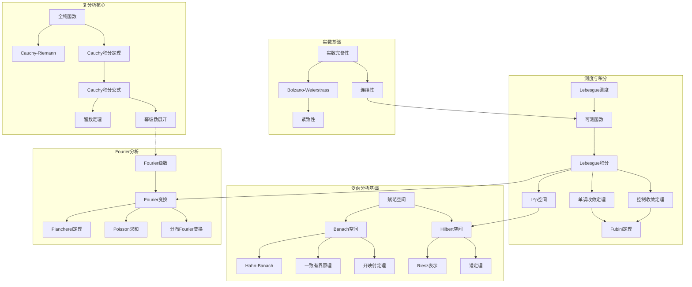
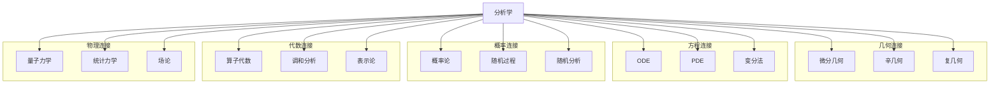
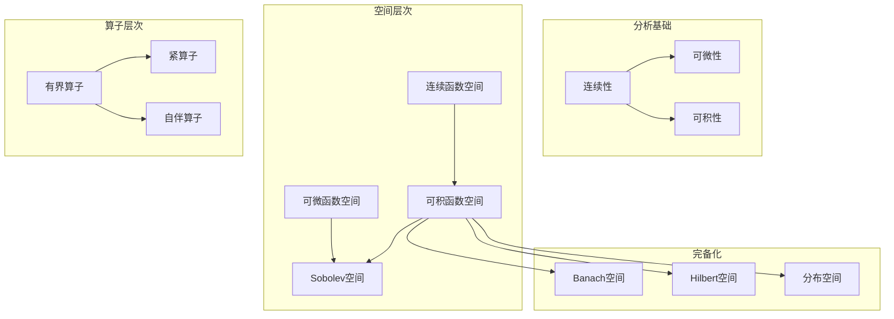

# 分析学思维导图

> 分析学研究极限、连续、微分、积分等概念，从实分析到泛函分析，构建了现代数学分析的完整框架。

---

## 🧠 核心概念层级关系

```mermaid
mindmap
  root((分析学))
    实分析
      实数理论
        Dedekind分割
        确界原理
        区间套定理
        紧性
      测度论
        Lebesgue测度
        可测集
        可测函数
        积分理论
        Fubini定理
        Radon-Nikodym定理
      收敛理论
        点态收敛
        一致收敛
        依测度收敛
        L^p收敛
        弱收敛
      微分理论
        微分与导数
        有界变差函数
        绝对连续函数
        微积分基本定理
      函数空间
        L^p空间
        Sobolev空间
        BV空间
    复分析
      全纯函数
        Cauchy-Riemann方程
        幂级数展开
        解析延拓
      积分理论
        Cauchy积分定理
        Cauchy积分公式
        留数定理
      级数展开
        Taylor级数
        Laurent级数
        孤立奇点分类
      共形映射
        分式线性变换
        Riemann映射定理
        Schwarz引理
      整函数与亚纯函数
        Picard定理
        Weierstrass分解
        Mittag-Leffler分解
      Riemann曲面
        定义与例子
        单值化定理
        代数函数
    泛函分析
      Banach空间
        范数与完备性
        例子：C(K), L^p, l^p
        有界线性算子
        Hahn-Banach定理
        一致有界原理
        开映射定理
        闭图像定理
      Hilbert空间
        内积结构
        正交分解
        正交基
        Riesz表示定理
        伴随算子
        自伴算子
        谱理论
      算子理论
        紧算子
        Fredholm理论
        谱分解
        无界算子
        自伴扩张
      分布理论
        试验函数
        分布定义
        分布运算
        Sobolev空间
        微局部分析
    傅里叶分析
      Fourier级数
        L^2理论
        点态收敛
        求和法
      Fourier变换
        L^1理论
        L^2理论
        分布上的Fourier变换
        Poisson求和公式
      调和函数
        均值性质
        最大值原理
        Poisson积分
        Dirichlet问题
      Hardy空间
        H^p空间
        边界值
        内-外分解
      奇异积分
        Hilbert变换
        Calderón-Zygmund理论
      极大函数
        Hardy-Littlewood极大函数
        点态收敛
    微分几何分析
      流形上的分析
        向量丛
        联络
        曲率
      Hodge理论
        Laplace算子
        调和形式
        Hodge分解
      几何测度论
        Hausdorff测度
        可求长集
        极小子流形
    变分法
      经典变分
        Euler-Lagrange方程
        等周问题
        测地线
      直接方法
        下半连续性
        紧性
        极小化序列
      Gamma收敛
      最优控制
    渐近分析
      渐近展开
        Stirling公式
        Laplace方法
        最速下降法
      微分方程渐近解
        WKB近似
        匹配渐近展开
```

---

## 🔗 定理依赖关系图



---

## 📍 重要示例分布

### 实分析经典示例
| 示例 | 概念 | 重要性 | 位置 |
|-----|------|-------|------|
| Cantor集 | 零测不可数集 | ⭐⭐⭐⭐⭐ | 测度论 |
| Dirichlet函数 | 处处不连续 | ⭐⭐⭐⭐ | 可测函数 |
| Weierstrass函数 | 处处连续处处不可微 | ⭐⭐⭐⭐⭐ | 微分理论 |
| Fat Cantor集 | 正测无处稠密集 | ⭐⭐⭐⭐ | 测度论 |
| Hilbert曲线 | 空间填充曲线 | ⭐⭐⭐⭐ | 连续映射 |

### 复分析经典示例
| 示例 | 概念 | 重要性 | 位置 |
|-----|------|-------|------|
| exp(z) | 整函数 | ⭐⭐⭐⭐⭐ | 全纯函数 |
| Gamma函数 | 亚纯函数 | ⭐⭐⭐⭐⭐ | 特殊函数 |
| Riemann ζ函数 | 解析延拓 | ⭐⭐⭐⭐⭐ | 解析延拓 |
| 单位圆盘→上半平面 | 共形映射 | ⭐⭐⭐⭐ | 共形映射 |
| e^(-1/z²) | 本质奇点 | ⭐⭐⭐⭐ | 奇点分类 |

### 泛函分析经典示例
| 示例 | 概念 | 重要性 | 位置 |
|-----|------|-------|------|
| l^p空间 | Banach空间例子 | ⭐⭐⭐⭐⭐ | Banach空间 |
| L^2(R) | Hilbert空间例子 | ⭐⭐⭐⭐⭐ | Hilbert空间 |
| Fourier变换 | 酉算子 | ⭐⭐⭐⭐⭐ | 算子理论 |
| 平移算子 | 谱分析 | ⭐⭐⭐⭐ | 谱理论 |
| Dirac δ函数 | 分布 | ⭐⭐⭐⭐⭐ | 分布理论 |

### Fourier分析示例
| 示例 | 概念 | 重要性 | 位置 |
|-----|------|-------|------|
| 方波的Fourier级数 | 收敛性 | ⭐⭐⭐⭐ | Fourier级数 |
| Gauss函数的Fourier变换 | 特征函数 | ⭐⭐⭐⭐ | Fourier变换 |
| Poisson核 | 调和函数 | ⭐⭐⭐⭐ | 调和分析 |
| Hilbert变换 | 奇异积分 | ⭐⭐⭐⭐ | 奇异积分 |

---

## 🔄 与其他分支的连接点



**具体连接说明：**

| 分支 | 连接概念 | 连接深度 |
|-----|---------|---------|
| 微分几何 | 流形上的分析、Hodge理论 | ⭐⭐⭐⭐⭐ |
| PDE | Sobolev空间、正则性理论 | ⭐⭐⭐⭐⭐ |
| 概率论 | 测度论、随机分析 | ⭐⭐⭐⭐⭐ |
| 泛函分析 | 算子代数、谱理论 | ⭐⭐⭐⭐⭐ |
| 调和分析 | Fourier分析、群表示 | ⭐⭐⭐⭐⭐ |
| 复几何 | 多复变、Kähler几何 | ⭐⭐⭐⭐ |
| 量子力学 | Hilbert空间、算子理论 | ⭐⭐⭐⭐⭐ |
| 数论 | ζ函数、模形式 | ⭐⭐⭐⭐ |

---

## 📊 学习难度梯度标记

```mermaid
graph LR
    subgraph 分析I ⭐⭐⭐
        A1[微积分基础]
        A2[实数理论]
        A3[级数理论]
    end
    
    subgraph 分析II ⭐⭐⭐⭐
        B1[测度论]
        B2[Lebesgue积分]
        B3[复分析基础]
    end
    
    subgraph 分析III ⭐⭐⭐⭐⭐
        C1[泛函分析]
        C2[Fourier分析]
        C3[概率论基础]
    end
    
    subgraph 高级分析 ⭐⭐⭐⭐⭐⭐
        D1[调和分析]
        D2[微局部分析]
        D3[几何测度论]
    end
```

### 详细难度分级

| 主题 | 入门 | 基础 | 进阶 | 高级 | 专家 |
|-----|------|------|------|------|------|
| 实分析 | 实数完备性 | Lebesgue积分 | L^p空间 | Sobolev空间 | 几何测度论 |
| 复分析 | 全纯函数 | Cauchy理论 | 共形映射 | Riemann曲面 | 多复变 |
| 泛函分析 | 赋范空间 | Banach空间 | Hilbert空间 | 谱理论 | 算子代数 |
| Fourier分析 | Fourier级数 | Fourier变换 | 分布论 | 奇异积分 | 微局部分析 |
| 变分法 | Euler-Lagrange | 直接方法 | Gamma收敛 | 最优控制 | 几何变分 |

---

## 🎯 学习路径推荐

### 经典分析路径
```
微积分 → 实分析（测度论）→ 复分析 → 泛函分析 → 调和分析
```

### 概率分析路径
```
实分析 → 测度论 → 概率论 → 随机过程 → 随机分析
```

### PDE分析路径
```
实分析 → 泛函分析 → Sobolev空间 → 椭圆PDE → 抛物/双曲PDE
```

### 几何分析路径
```
微积分 → 微分几何 → 流形上的分析 → 几何测度论 → 极小曲面
```

---

## 📚 核心定理清单

### 实分析核心定理
1. **单调收敛定理**：单调递增可测函数列的积分与极限可交换
2. **控制收敛定理**：控制条件下积分与极限可交换
3. **Fubini定理**：乘积空间积分的累次计算
4. **Radon-Nikodym定理**：绝对连续测度的密度存在性
5. **微积分基本定理（Lebesgue版本）**：绝对连续函数与不定积分

### 复分析核心定理
1. **Cauchy积分定理**：全纯函数沿闭曲线积分为零
2. **Cauchy积分公式**：全纯函数由边界值确定
3. **留数定理**：围道积分与留数的关系
4. **最大模原理**：全纯函数的模在边界取最大
5. **Riemann映射定理**：单连通区域与单位圆盘的共形等价

### 泛函分析核心定理
1. **Hahn-Banach定理**：范数的延拓与分离
2. **一致有界原理**：逐点有界推出一致有界
3. **开映射定理**：满射开映射
4. **闭图像定理**：闭图像与连续性
5. **Riesz表示定理**：Hilbert空间上线性泛函的内积表示
6. **谱定理**：正规算子的对角化

### Fourier分析核心定理
1. **Plancherel定理**：Fourier变换的等距性
2. **Poisson求和公式**：周期化与采样
3. **Hausdorff-Young不等式**：Fourier变换的L^p估计
4. **Carleson定理**：Fourier级数的几乎处处收敛

---

## 🔍 概念关系图谱



---

> 💡 **学习建议**：分析学的核心是极限过程的严格处理。建议从经典微积分出发，逐步过渡到测度论框架。注意"收敛"的各种模式（点态、一致、依测度、L^p等）的区别与联系。复分析中的几何直观与实分析中的测度论证同样重要。
