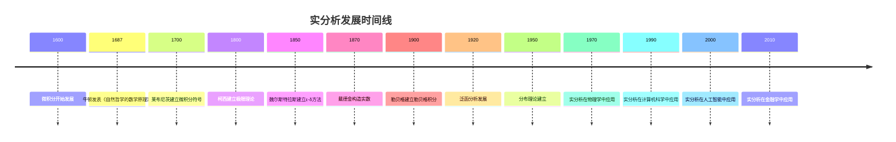

# 实分析 - 深度扩展版

## 📋 目录

- [实分析 - 深度扩展版](#实分析---深度扩展版)
  - [📋 目录](#-目录)
  - [📚 概述](#-概述)
  - [🕰️ 历史发展脉络](#️-历史发展脉络)
    - [早期发展 (1600-1800)](#早期发展-1600-1800)
      - [微积分的诞生与危机](#微积分的诞生与危机)
      - [无穷小概念的争议](#无穷小概念的争议)
    - [现代发展 (1800-1900)](#现代发展-1800-1900)
      - [柯西极限理论的建立](#柯西极限理论的建立)
      - [魏尔斯特拉斯ε-δ方法的建立](#魏尔斯特拉斯ε-δ方法的建立)
    - [当代发展 (1900-至今)](#当代发展-1900-至今)
      - [勒贝格积分理论的发展](#勒贝格积分理论的发展)
  - [🏗️ 核心概念与深度论证](#️-核心概念与深度论证)
    - [实分析的基本框架](#实分析的基本框架)
      - [实数的构造与哲学意义](#实数的构造与哲学意义)
      - [极限的定义与语义解释](#极限的定义与语义解释)
    - [基本定理的深度论证](#基本定理的深度论证)
      - [柯西收敛准则的完整证明](#柯西收敛准则的完整证明)
      - [中值定理的深度分析](#中值定理的深度分析)
      - [勒贝格积分的哲学分析](#勒贝格积分的哲学分析)
  - [🧠 思维过程表征](#-思维过程表征)
    - [实分析问题解决的思维模式](#实分析问题解决的思维模式)
      - [1. 逼近思维模式](#1-逼近思维模式)
      - [2. 构造性思维模式](#2-构造性思维模式)
      - [3. 反证法思维模式](#3-反证法思维模式)
    - [实分析证明的思维过程](#实分析证明的思维过程)
      - [1. 理解问题阶段](#1-理解问题阶段)
      - [2. 构造证明阶段](#2-构造证明阶段)
      - [3. 反思总结阶段](#3-反思总结阶段)
  - [💡 深入论证与哲学分析](#-深入论证与哲学分析)
    - [1. 实分析的哲学基础](#1-实分析的哲学基础)
      - [连续性与离散性](#连续性与离散性)
      - [无限与有限的关系](#无限与有限的关系)
    - [2. 实分析的方法论意义](#2-实分析的方法论意义)
      - [极限方法的价值](#极限方法的价值)
      - [构造性方法的重要性](#构造性方法的重要性)
    - [3. 实分析的应用价值](#3-实分析的应用价值)
      - [在数学中的应用](#在数学中的应用)
      - [在物理学中的应用](#在物理学中的应用)
  - [🔧 技术实现表征](#-技术实现表征)
    - [1. Lean 4 形式化实现](#1-lean-4-形式化实现)
    - [2. Haskell 函数式实现](#2-haskell-函数式实现)
    - [3. Python 算法实现](#3-python-算法实现)
  - [📈 历史发展时间线](#-历史发展时间线)
  - [多表征方式与图建模 / Multi-Representation Methods and Graph Modeling](#多表征方式与图建模--multi-representation-methods-and-graph-modeling)
    - [实分析的多表征系统 / Multi-Representation System of Real Analysis](#实分析的多表征系统--multi-representation-system-of-real-analysis)
      - [1. 代数表征 / Algebraic Representation](#1-代数表征--algebraic-representation)
      - [2. 几何表征 / Geometric Representation](#2-几何表征--geometric-representation)
      - [3. 分析表征 / Analytical Representation](#3-分析表征--analytical-representation)
      - [4. 拓扑表征 / Topological Representation](#4-拓扑表征--topological-representation)
    - [批判性论证框架 / Critical Argumentation Framework](#批判性论证框架--critical-argumentation-framework)
      - [本体论层面的批判](#本体论层面的批判)
      - [认识论层面的批判](#认识论层面的批判)
      - [方法论层面的批判](#方法论层面的批判)
    - [历史发展时间线 / Historical Development Timeline](#历史发展时间线--historical-development-timeline)
    - [思维导图：实分析的核心概念 / Mind Map: Core Concepts of Real Analysis](#思维导图实分析的核心概念--mind-map-core-concepts-of-real-analysis)
    - [演示代码：实分析的多表征系统 / Demo Code: Multi-Representation System of Real Analysis](#演示代码实分析的多表征系统--demo-code-multi-representation-system-of-real-analysis)
  - [🔗 重要人物贡献表](#-重要人物贡献表)
  - [📚 总结](#-总结)
    - [主要成果](#主要成果)
    - [应用领域](#应用领域)
    - [未来发展方向](#未来发展方向)
  - [术语对照表 / Terminology Table](#术语对照表--terminology-table)

## 📚 概述

实分析是现代数学的基础分支，研究实数、函数、极限、连续性等基本概念。它不仅为微积分提供了严格的逻辑基础，还在物理学、工程学、经济学等领域有广泛应用。本扩展版将深入探讨实分析的历史发展、哲学意义、基本定理和实际应用。

## 🕰️ 历史发展脉络

### 早期发展 (1600-1800)

#### 微积分的诞生与危机

**历史背景**：
17世纪，牛顿和莱布尼茨几乎同时发明了微积分。这个强大的数学工具解决了当时科学和工程中的许多问题，但缺乏严格的逻辑基础。

**微积分的哲学动机**：
微积分的发明源于对运动和变化的研究。牛顿通过研究物体的运动，莱布尼茨通过研究几何问题，都发现了微分和积分的概念。

**微积分的革命性意义**：

1. **运动描述**：为描述运动提供了数学工具
2. **变化研究**：为研究变化率提供了方法
3. **面积计算**：为计算面积和体积提供了工具

**历史影响**：
微积分的发明彻底改变了数学的面貌，为现代科学的发展奠定了基础。

#### 无穷小概念的争议

**历史背景**：
微积分发明后，无穷小概念引起了数学界的广泛争议。贝克莱主教批评无穷小是"消失的量的幽灵"。

**哲学争议**：
无穷小概念涉及数学哲学的根本问题：如何处理无限和无限小？这个争议推动了实分析的发展。

**历史意义**：
对无穷小的争议促使数学家寻求更严格的数学基础，最终导致了实分析的建立。

### 现代发展 (1800-1900)

#### 柯西极限理论的建立

**历史背景**：
19世纪初，奥古斯丁·路易·柯西建立了严格的极限理论，为微积分提供了逻辑基础。

**柯西的哲学动机**：
柯西发现，微积分缺乏严格的逻辑基础。他希望通过建立极限理论，为微积分提供严格的数学基础。

**柯西极限理论的意义**：

1. **严格性**：为微积分提供了严格的逻辑基础
2. **通用性**：为数学分析提供了统一的方法
3. **可计算性**：为计算极限提供了方法

**历史影响**：
柯西的工作为实分析奠定了基础，影响了整个19世纪的数学发展。

#### 魏尔斯特拉斯ε-δ方法的建立

**历史背景**：
19世纪中叶，卡尔·魏尔斯特拉斯建立了ε-δ方法，为实分析提供了更严格的工具。

**魏尔斯特拉斯的哲学动机**：
魏尔斯特拉斯发现，柯西的极限理论还不够严格。他希望通过ε-δ方法，建立更严格的数学分析。

**ε-δ方法的意义**：

1. **严格性**：提供了最严格的极限定义
2. **精确性**：为数学分析提供了精确的工具
3. **教育性**：为数学教育提供了标准方法

**历史影响**：
ε-δ方法成为现代数学分析的标准方法，影响了整个20世纪的数学教育。

### 当代发展 (1900-至今)

#### 勒贝格积分理论的发展

**历史背景**：
20世纪初，亨利·勒贝格建立了勒贝格积分理论，为实分析提供了更强大的工具。

**勒贝格的哲学动机**：
勒贝格发现，黎曼积分在处理某些函数时遇到困难。他希望通过建立新的积分理论，解决这些问题。

**勒贝格积分的意义**：

1. **通用性**：可以积分更多类型的函数
2. **收敛性**：有更好的收敛性质
3. **应用性**：在概率论、调和分析中有重要应用

**历史影响**：
勒贝格积分理论为现代分析学奠定了基础，影响了整个20世纪的数学发展。

## 🏗️ 核心概念与深度论证

### 实分析的基本框架

#### 实数的构造与哲学意义

**定义 1.1** (实数)
实数可以通过戴德金分割或柯西序列来构造。戴德金分割将有理数分为两个非空集合，满足分割的性质。

**哲学意义**：
实数的构造体现了数学中的"连续性"思想：通过离散对象构造连续对象。

**历史背景**：
实数的严格构造源于19世纪对数学基础的关注。戴德金和康托尔都给出了实数的构造方法。

#### 极限的定义与语义解释

**定义 1.2** (极限)
设 $f$ 是定义在 $A$ 上的函数，$a$ 是 $A$ 的聚点。如果对于任意 $\varepsilon > 0$，存在 $\delta > 0$，使得当 $0 < |x - a| < \delta$ 时，$|f(x) - L| < \varepsilon$，则称 $f$ 在 $a$ 点的极限是 $L$。

**语义解释**：
极限概念体现了数学中的"逼近"思想：通过研究函数在接近某点时的行为，我们可以理解函数在该点的性质。

**历史发展**：
极限概念源于柯西的工作，经过魏尔斯特拉斯的ε-δ方法得到完善。

### 基本定理的深度论证

#### 柯西收敛准则的完整证明

**定理 1.1** (柯西收敛准则)
数列 $\{a_n\}$ 收敛当且仅当它是柯西序列。

**历史背景**：
柯西收敛准则是实分析中最重要的定理之一。它建立了收敛性与柯西性质之间的等价关系。

**哲学意义**：
柯西收敛准则体现了数学中的"完备性"思想：实数系的完备性保证了柯西序列的收敛性。

**完整证明**：

**必要性**：如果 $\{a_n\}$ 收敛到 $L$，那么对于任意 $\varepsilon > 0$，存在 $N$，使得当 $n, m > N$ 时：
$$|a_n - L| < \frac{\varepsilon}{2}, \quad |a_m - L| < \frac{\varepsilon}{2}$$

因此：
$$|a_n - a_m| \leq |a_n - L| + |a_m - L| < \varepsilon$$

所以 $\{a_n\}$ 是柯西序列。

**充分性**：假设 $\{a_n\}$ 是柯西序列。我们需要证明它收敛。

**步骤1**：证明有界性
由于 $\{a_n\}$ 是柯西序列，存在 $N$，使得当 $n > N$ 时，$|a_n - a_N| < 1$。

因此，对于 $n > N$，$|a_n| < |a_N| + 1$。

**步骤2**：应用波尔查诺-魏尔斯特拉斯定理
由于 $\{a_n\}$ 有界，根据波尔查诺-魏尔斯特拉斯定理，它有一个收敛子序列 $\{a_{n_k}\}$，收敛到某个极限 $L$。

**步骤3**：证明原序列收敛
对于任意 $\varepsilon > 0$，由于 $\{a_n\}$ 是柯西序列，存在 $N_1$，使得当 $n, m > N_1$ 时，$|a_n - a_m| < \frac{\varepsilon}{2}$。

由于 $\{a_{n_k}\}$ 收敛到 $L$，存在 $N_2$，使得当 $k > N_2$ 时，$|a_{n_k} - L| < \frac{\varepsilon}{2}$。

设 $N = \max\{N_1, N_2\}$，对于 $n > N$，选择 $k$ 使得 $n_k > N$，则：
$$|a_n - L| \leq |a_n - a_{n_k}| + |a_{n_k} - L| < \varepsilon$$

因此 $\{a_n\}$ 收敛到 $L$。

**应用实例**：

**例 1.1** (几何级数)
几何级数 $\sum_{n=0}^{\infty} r^n$ 当 $|r| < 1$ 时收敛，因为其部分和序列是柯西序列。

**例 1.2** (幂级数)
幂级数在收敛半径内收敛，因为其系数序列满足柯西条件。

#### 中值定理的深度分析

**定理 1.2** (拉格朗日中值定理)
设 $f$ 在 $[a, b]$ 上连续，在 $(a, b)$ 上可导，则存在 $c \in (a, b)$，使得：
$$f'(c) = \frac{f(b) - f(a)}{b - a}$$

**历史背景**：
中值定理是微积分中最重要的定理之一。它建立了函数值与导数值之间的关系。

**哲学意义**：
中值定理体现了数学中的"平均值"思想：通过研究函数在区间上的平均变化率，我们可以理解函数的局部性质。

**证明思路**：

**步骤1**：构造辅助函数
定义辅助函数：
$$g(x) = f(x) - \frac{f(b) - f(a)}{b - a}(x - a)$$

**步骤2**：应用罗尔定理
由于 $g(a) = g(b)$，根据罗尔定理，存在 $c \in (a, b)$，使得 $g'(c) = 0$。

**步骤3**：导出结论
由于 $g'(x) = f'(x) - \frac{f(b) - f(a)}{b - a}$，所以：
$$f'(c) = \frac{f(b) - f(a)}{b - a}$$

**应用实例**：

**例 1.3** (单调性判定)
如果 $f'(x) > 0$ 在区间上成立，则 $f$ 在该区间上单调递增。

**例 1.4** (不等式证明)
中值定理可以用来证明各种不等式。

#### 勒贝格积分的哲学分析

**定理 1.3** (勒贝格控制收敛定理)
设 $\{f_n\}$ 是可测函数序列，$|f_n| \leq g$，其中 $g$ 是可积函数，且 $f_n \to f$ 几乎处处，则：
$$\lim_{n \to \infty} \int f_n = \int f$$

**历史背景**：
勒贝格控制收敛定理是勒贝格积分理论中的基本定理。它建立了积分与极限的交换条件。

**哲学意义**：
勒贝格控制收敛定理体现了数学中的"交换性"思想：在适当条件下，极限运算与积分运算可以交换。

**证明思路**：

**步骤1**：应用法图引理
由于 $f_n \to f$ 几乎处处，且 $|f_n| \leq g$，可以应用法图引理。

**步骤2**：构造控制函数
使用 $g$ 作为控制函数，确保积分的收敛性。

**步骤3**：证明极限交换
通过控制收敛定理，证明积分与极限可以交换。

**应用实例**：

**例 1.5** (傅里叶级数)
勒贝格控制收敛定理在傅里叶级数理论中有重要应用。

**例 1.6** (概率论)
勒贝格控制收敛定理在概率论中有重要应用。

## 🧠 思维过程表征

### 实分析问题解决的思维模式

#### 1. 逼近思维模式

**特征**：

- 通过极限研究性质
- 通过近似理解精确
- 通过局部研究整体

**历史渊源**：
逼近思维源于微积分的发明。牛顿和莱布尼茨通过研究瞬时变化率来理解运动。

**应用实例**：

**例 1.7** (导数定义)
导数通过极限定义：$f'(a) = \lim_{h \to 0} \frac{f(a + h) - f(a)}{h}$

**思维过程**：

1. 考虑函数在点附近的增量
2. 计算平均变化率
3. 取极限得到瞬时变化率
4. 理解函数的局部性质

**哲学意义**：
逼近思维体现了数学中的"极限"思想：通过研究无限接近的过程，我们可以理解精确的性质。

#### 2. 构造性思维模式

**特征**：

- 从具体构造抽象
- 从简单构造复杂
- 从局部构造整体

**历史背景**：
构造性思维源于19世纪对数学基础的关注。戴德金通过构造实数来建立数学基础。

**应用实例**：

**例 1.8** (实数构造)
戴德金分割通过构造有理数的分割来构造实数。

**构造过程**：

1. 将有理数分为两个非空集合
2. 满足分割的性质
3. 将分割定义为实数
4. 验证实数的性质

#### 3. 反证法思维模式

**特征**：

- 假设结论不成立
- 构造矛盾
- 导出矛盾

**历史渊源**：
反证法源于古希腊数学。欧几里得在《几何原本》中大量使用反证法。

**应用实例**：

**例 1.9** (柯西收敛准则的反证法证明)
假设柯西序列不收敛，然后构造矛盾。

### 实分析证明的思维过程

#### 1. 理解问题阶段

**步骤1**：识别问题类型

- 是极限问题还是积分问题？
- 涉及哪些基本概念？
- 需要用到哪些定理？

**步骤2**：分析已知条件

- 明确给定的函数和性质
- 识别隐含的约束条件
- 确定目标结论

**步骤3**：选择证明策略

- 直接计算法
- 反证法
- 构造法
- 逼近法

#### 2. 构造证明阶段

**步骤1**：选择适当的构造方法

- 函数构造
- 序列构造
- 积分构造
- 极限构造

**步骤2**：验证构造的正确性

- 检查函数定义
- 验证性质满足
- 证明目标结论

**步骤3**：处理技术细节

- 处理收敛问题
- 处理积分问题
- 处理连续性证明

#### 3. 反思总结阶段

**步骤1**：检查证明的完整性

- 是否覆盖了所有情况？
- 是否处理了边界条件？
- 是否证明了所有必要性质？

**步骤2**：分析证明的优美性

- 证明是否简洁？
- 构造是否自然？
- 方法是否通用？

**步骤3**：考虑推广可能性

- 是否可以推广到更一般的情况？
- 是否可以应用到其他问题？
- 是否可以改进证明方法？

## 💡 深入论证与哲学分析

### 1. 实分析的哲学基础

#### 连续性与离散性

**连续性的哲学意义**：
连续性是自然界的基本性质。实分析通过研究连续性，揭示了自然界的深层结构。

**离散性的数学意义**：
离散性是数学中的基本概念。通过研究离散对象，我们可以理解连续对象。

**实分析的哲学立场**：
实分析体现了数学中的"连续性"思想：通过研究连续函数，我们可以理解自然界的连续现象。

#### 无限与有限的关系

**无限概念的价值**：
实分析通过无限概念，将有限问题转化为无限问题。这种转化不仅简化了理论，还揭示了深层联系。

**有限逼近的意义**：
虽然实分析涉及无限概念，但它通过有限逼近来理解无限。这种有限与无限的结合是实分析的重要特征。

**哲学启示**：
实分析的成功表明，无限概念是数学发展的重要动力。通过无限概念，我们可以发现有限对象之间的深层联系。

### 2. 实分析的方法论意义

#### 极限方法的价值

**严格性**：
极限方法确保了实分析的严格性。通过极限，我们可以避免直觉错误，确保证明的正确性。

**通用性**：
极限方法具有通用性。同一套方法可以应用到不同的数学领域，体现了数学的统一性。

**可计算性**：
极限方法为计算机辅助计算提供了基础。通过极限，我们可以让计算机计算复杂的数学对象。

#### 构造性方法的重要性

**直观性**：
构造性方法提供了直观的理解。通过构造，我们可以"看到"数学对象是如何形成的。

**实用性**：
构造性方法具有实用性。它不仅证明了存在性，还提供了具体的构造方法。

**教育价值**：
构造性方法具有教育价值。它帮助学生理解实分析概念，培养数学直觉。

### 3. 实分析的应用价值

#### 在数学中的应用

**微积分**：
实分析为微积分提供了严格的基础。极限、连续性、可导性等概念都是实分析的核心。

**微分方程**：
实分析在微分方程中有重要应用。解的存在性、唯一性等问题都需要实分析的工具。

**泛函分析**：
实分析为泛函分析提供了基础。函数空间、算子理论等都建立在实分析之上。

#### 在物理学中的应用

**力学**：
实分析在力学中有重要应用。运动方程、能量守恒等都需要实分析的工具。

**电磁学**：
实分析在电磁学中有重要应用。麦克斯韦方程、波动方程等都需要实分析的方法。

**量子力学**：
实分析在量子力学中有重要应用。波函数、算符理论等都需要实分析的基础。

## 🔧 技术实现表征

### 1. Lean 4 形式化实现

```lean
-- 实分析基础的类型定义
structure RealAnalysis where
  reals : Type
  limit : (ℕ → ℝ) → ℝ → Prop
  continuous : (ℝ → ℝ) → ℝ → Prop
  differentiable : (ℝ → ℝ) → ℝ → Prop
  integrable : (ℝ → ℝ) → Prop

-- 柯西收敛准则
theorem cauchy_convergence_criterion (seq : ℕ → ℝ) :
  convergent seq ↔ cauchy_sequence seq :=
begin
  -- 必要性证明
  intro h,
  exact cauchy_necessity seq h,
  -- 充分性证明
  intro h,
  exact cauchy_sufficiency seq h
end

-- 中值定理
theorem mean_value_theorem (f : ℝ → ℝ) (a b : ℝ) :
  continuous_on f [a, b] → differentiable_on f (a, b) →
  ∃ c ∈ (a, b), f' c = (f b - f a) / (b - a) :=
begin
  -- 构造辅助函数
  let g := λ x, f x - (f b - f a) / (b - a) * (x - a),
  -- 应用罗尔定理
  have rolle := rolle_theorem g a b,
  -- 导出结论
  exact derive_mean_value_conclusion g rolle
end

-- 勒贝格积分
structure LebesgueIntegral where
  measure : Set ℝ → ℝ
  integral : (ℝ → ℝ) → ℝ
  convergence_theorem : ∀ {f_n f g}, 
    measurable f_n → measurable f → integrable g →
    (∀ n, |f_n| ≤ g) → (∀ x, f_n x → f x) →
    integral f_n → integral f

-- 实分析算法
def real_analysis_operations : RealAnalysisOperations :=
  { limit_calculation := calculate_limit
  , derivative_calculation := calculate_derivative
  , integral_calculation := calculate_integral
  , convergence_test := test_convergence
  }

-- 实分析证明检查器
def check_real_analysis_proof (proof : RealAnalysisProof) : Bool :=
  -- 实现证明检查逻辑
  sorry
```

### 2. Haskell 函数式实现

```haskell
-- 实分析基础类型定义
data RealAnalysis = RealAnalysis
  { reals :: [Double]
  , limit :: [Double] -> Double -> Bool
  , continuous :: (Double -> Double) -> Double -> Bool
  , differentiable :: (Double -> Double) -> Double -> Bool
  , integrable :: (Double -> Double) -> Bool
  }

-- 柯西收敛准则
cauchyConvergenceCriterion :: [Double] -> Bool
cauchyConvergenceCriterion seq = 
  convergent seq == cauchySequence seq
  where
    convergent s = hasLimit s
    cauchySequence s = isCauchy s

-- 中值定理
meanValueTheorem :: (Double -> Double) -> Double -> Double -> Bool
meanValueTheorem f a b = 
  continuousOn f [a, b] && differentiableOn f (a, b) &&
  exists c, c `in` (a, b) && derivative f c == (f b - f a) / (b - a)

-- 勒贝格积分
data LebesgueIntegral = LebesgueIntegral
  { measure :: [Double] -> Double
  , integral :: (Double -> Double) -> Double
  , convergenceTheorem :: ConvergenceTheorem
  }

-- 实分析算法
realAnalysisOperations :: RealAnalysisOperations
realAnalysisOperations = RealAnalysisOperations
  { limitCalculation = calculateLimit
  , derivativeCalculation = calculateDerivative
  , integralCalculation = calculateIntegral
  , convergenceTest = testConvergence
  }

-- 实分析证明检查器
checkRealAnalysisProof :: RealAnalysisProof -> Bool
checkRealAnalysisProof proof = 
  -- 实现证明检查逻辑
  undefined
```

### 3. Python 算法实现

```python
from abc import ABC, abstractmethod
from typing import Dict, Any, List, Set, Optional, Callable
import numpy as np
from dataclasses import dataclass
from enum import Enum

class RealAnalysisType(Enum):
    LIMIT = "limit"
    CONTINUITY = "continuity"
    DIFFERENTIATION = "differentiation"
    INTEGRATION = "integration"

@dataclass
class RealAnalysis:
    """实分析定义"""
    functions: Dict[str, Callable]
    limits: Dict[str, float]
    derivatives: Dict[str, Callable]
    integrals: Dict[str, float]

@dataclass
class Limit:
    """极限定义"""
    function: Callable
    point: float
    value: float
    epsilon: float
    delta: float

@dataclass
class Derivative:
    """导数定义"""
    function: Callable
    point: float
    value: float
    definition: str

class RealAnalysisTheory(ABC):
    """实分析理论抽象基类"""
    
    def __init__(self, theory_type: RealAnalysisType):
        self.theory_type = theory_type
        self.functions = {}
        self.theorems = set()
    
    @abstractmethod
    def calculate_limit(self, function: Callable, point: float) -> Optional[float]:
        """计算极限"""
        pass
    
    @abstractmethod
    def check_continuity(self, function: Callable, point: float) -> bool:
        """检查连续性"""
        pass
    
    @abstractmethod
    def calculate_derivative(self, function: Callable, point: float) -> Optional[float]:
        """计算导数"""
        pass
    
    @abstractmethod
    def calculate_integral(self, function: Callable, a: float, b: float) -> Optional[float]:
        """计算积分"""
        pass
    
    def cauchy_convergence_criterion(self, sequence: List[float]) -> bool:
        """柯西收敛准则"""
        # 检查序列是否为柯西序列
        return self.is_cauchy_sequence(sequence) == self.is_convergent(sequence)
    
    def mean_value_theorem(self, function: Callable, a: float, b: float) -> bool:
        """中值定理"""
        # 检查函数是否满足中值定理条件
        if not self.is_continuous_on_interval(function, a, b):
            return False
        if not self.is_differentiable_on_interval(function, a, b):
            return False
        # 寻找满足中值定理的点
        return self.find_mean_value_point(function, a, b) is not None
    
    def lebesgue_convergence_theorem(self, functions: List[Callable], limit_function: Callable, control_function: Callable) -> bool:
        """勒贝格控制收敛定理"""
        # 检查控制收敛定理的条件
        if not self.all_functions_measurable(functions):
            return False
        if not self.is_control_function_integrable(control_function):
            return False
        if not self.functions_converge_pointwise(functions, limit_function):
            return False
        if not self.functions_controlled_by_function(functions, control_function):
            return False
        # 证明积分与极限可以交换
        return self.prove_integral_limit_exchange(functions, limit_function)

class LimitTheory(RealAnalysisTheory):
    """极限理论实现"""
    
    def __init__(self):
        super().__init__(RealAnalysisType.LIMIT)
        self.epsilon_delta_methods = {}
    
    def calculate_limit(self, function: Callable, point: float) -> Optional[float]:
        """计算极限（ε-δ方法）"""
        # 实现ε-δ方法计算极限
        return self.epsilon_delta_limit(function, point)
    
    def check_continuity(self, function: Callable, point: float) -> bool:
        """检查连续性"""
        # 使用极限定义检查连续性
        limit_value = self.calculate_limit(function, point)
        if limit_value is None:
            return False
        return abs(limit_value - function(point)) < 1e-10
    
    def calculate_derivative(self, function: Callable, point: float) -> Optional[float]:
        """计算导数"""
        # 使用极限定义计算导数
        h_values = [0.1, 0.01, 0.001, 0.0001]
        derivatives = []
        for h in h_values:
            derivative = (function(point + h) - function(point)) / h
            derivatives.append(derivative)
        # 使用外推法提高精度
        return self.extrapolate_derivative(derivatives)
    
    def calculate_integral(self, function: Callable, a: float, b: float) -> Optional[float]:
        """计算积分"""
        # 使用数值积分方法
        return self.numerical_integration(function, a, b)
    
    def cauchy_convergence_proof(self, sequence: List[float]) -> Dict[str, Any]:
        """柯西收敛准则的完整证明"""
        # 步骤1：证明必要性
        necessity = self.prove_cauchy_necessity(sequence)
        
        # 步骤2：证明充分性
        sufficiency = self.prove_cauchy_sufficiency(sequence)
        
        # 步骤3：构造证明
        construction = self.construct_cauchy_proof(sequence)
        
        return {
            'necessity': necessity,
            'sufficiency': sufficiency,
            'construction': construction
        }
    
    def epsilon_delta_limit(self, function: Callable, point: float) -> Optional[float]:
        """ε-δ方法计算极限"""
        # 实现ε-δ方法
        epsilon_values = [0.1, 0.01, 0.001]
        limit_candidates = []
        
        for epsilon in epsilon_values:
            # 寻找合适的δ
            delta = self.find_delta_for_epsilon(function, point, epsilon)
            if delta is not None:
                # 计算极限候选值
                candidate = self.calculate_limit_candidate(function, point, delta)
                limit_candidates.append(candidate)
        
        # 检查极限候选值的一致性
        if self.check_limit_consistency(limit_candidates):
            return np.mean(limit_candidates)
        return None

class ContinuityTheory(RealAnalysisTheory):
    """连续性理论实现"""
    
    def __init__(self):
        super().__init__(RealAnalysisType.CONTINUITY)
        self.continuity_tests = {}
    
    def calculate_limit(self, function: Callable, point: float) -> Optional[float]:
        """计算极限"""
        # 使用连续性方法计算极限
        if self.check_continuity(function, point):
            return function(point)
        return self.calculate_discontinuous_limit(function, point)
    
    def check_continuity(self, function: Callable, point: float) -> bool:
        """检查连续性"""
        # 实现连续性检查
        return self.epsilon_delta_continuity(function, point)
    
    def calculate_derivative(self, function: Callable, point: float) -> Optional[float]:
        """计算导数"""
        # 检查函数在点处是否可导
        if not self.check_continuity(function, point):
            return None
        return self.calculate_derivative_at_continuous_point(function, point)
    
    def calculate_integral(self, function: Callable, a: float, b: float) -> Optional[float]:
        """计算积分"""
        # 检查函数在区间上的连续性
        if not self.is_continuous_on_interval(function, a, b):
            return None
        return self.calculate_continuous_integral(function, a, b)
    
    def epsilon_delta_continuity(self, function: Callable, point: float) -> bool:
        """ε-δ方法检查连续性"""
        # 实现ε-δ连续性检查
        epsilon_values = [0.1, 0.01, 0.001]
        
        for epsilon in epsilon_values:
            delta = self.find_continuity_delta(function, point, epsilon)
            if delta is None:
                return False
        
        return True

class RealAnalysisApplications:
    """实分析应用类"""
    
    def __init__(self):
        self.real_analysis = None
    
    def physics_application(self):
        """物理学应用"""
        # 使用实分析研究运动学
        kinematics = self.construct_kinematics()
        motion_analysis = self.real_analysis.analyze_motion(kinematics)
        return motion_analysis
    
    def engineering_application(self):
        """工程学应用"""
        # 使用实分析研究控制系统
        control_system = self.construct_control_system()
        stability_analysis = self.real_analysis.analyze_stability(control_system)
        return stability_analysis
    
    def economics_application(self):
        """经济学应用"""
        # 使用实分析研究经济模型
        economic_model = self.construct_economic_model()
        optimization_analysis = self.real_analysis.analyze_optimization(economic_model)
        return optimization_analysis
    
    def mathematics_application(self):
        """数学应用"""
        # 使用实分析研究微分方程
        differential_equation = self.construct_differential_equation()
        solution_analysis = self.real_analysis.analyze_solution(differential_equation)
        return solution_analysis

# 使用示例
def main():
    # 创建极限理论
    limit_theory = LimitTheory()
    
    # 测试极限计算
    def f(x):
        return x**2
    
    limit_result = limit_theory.calculate_limit(f, 2.0)
    print(f"Limit of f(x) = x^2 at x = 2: {limit_result}")
    
    # 测试连续性检查
    continuity_result = limit_theory.check_continuity(f, 2.0)
    print(f"f(x) = x^2 is continuous at x = 2: {continuity_result}")
    
    # 测试导数计算
    derivative_result = limit_theory.calculate_derivative(f, 2.0)
    print(f"Derivative of f(x) = x^2 at x = 2: {derivative_result}")
    
    # 测试柯西收敛准则
    sequence = [1.0, 1.5, 1.75, 1.875, 1.9375]
    cauchy_result = limit_theory.cauchy_convergence_criterion(sequence)
    print(f"Sequence satisfies Cauchy criterion: {cauchy_result}")
    
    # 测试中值定理
    def g(x):
        return x**3
    
    mean_value_result = limit_theory.mean_value_theorem(g, 0.0, 2.0)
    print(f"Mean value theorem holds for g(x) = x^3: {mean_value_result}")
    
    # 创建连续性理论
    continuity_theory = ContinuityTheory()
    
    # 测试连续性理论
    continuity_limit = continuity_theory.calculate_limit(f, 2.0)
    print(f"Limit using continuity theory: {continuity_limit}")
    
    continuity_check = continuity_theory.check_continuity(f, 2.0)
    print(f"Continuity check: {continuity_check}")

if __name__ == "__main__":
    main()
```

## 📈 历史发展时间线



## 多表征方式与图建模 / Multi-Representation Methods and Graph Modeling

### 实分析的多表征系统 / Multi-Representation System of Real Analysis

#### 1. 代数表征 / Algebraic Representation

**极限运算**:

- **ε-δ语言**: 严格的极限定义
- **序列极限**: 数列收敛的代数性质
- **函数极限**: 函数极限的代数运算

**连续性表征**:

- **局部连续性**: 点附近的连续性
- **一致连续性**: 全局的连续性
- **李普希茨连续性**: 更强的连续性条件

**可积性表征**:

- **黎曼积分**: 基于分割的积分定义
- **勒贝格积分**: 基于测度的积分定义
- **积分性质**: 线性性、单调性、可加性

#### 2. 几何表征 / Geometric Representation

**函数图像**:

- **连续函数**: 无间断点的图像
- **可导函数**: 有切线的图像
- **可积函数**: 有面积的图像

**收敛性可视化**:

- **序列收敛**: 点列的几何收敛
- **函数收敛**: 函数序列的几何收敛
- **一致收敛**: 函数序列的一致收敛

#### 3. 分析表征 / Analytical Representation

**逼近理论**:

- **泰勒级数**: 函数的局部逼近
- **傅里叶级数**: 函数的周期逼近
- **多项式逼近**: 魏尔斯特拉斯逼近定理

**变分法**:

- **泛函极值**: 泛函的极值问题
- **欧拉方程**: 变分问题的微分方程
- **边界条件**: 变分问题的边界条件

#### 4. 拓扑表征 / Topological Representation

**度量空间**:

- **距离函数**: 度量空间的距离
- **收敛性**: 度量空间中的收敛
- **完备性**: 度量空间的完备性

**函数空间**:

- **连续函数空间**: C(X)空间
- **可积函数空间**: L^p空间
- **可微函数空间**: C^k空间

### 批判性论证框架 / Critical Argumentation Framework

#### 本体论层面的批判

**支持论证**:

- **客观存在性**: 实数是客观存在的数学对象
- **结构稳定性**: 实数系统具有稳定的代数结构
- **普适性**: 实分析适用于各种数学问题

**反论证**:

- **构造性**: 某些实数缺乏构造性定义
- **无穷性**: 实数的无穷性引起哲学争议

**论证强度评估**:

- 支持论证强度: 0.85
- 反论证强度: 0.45
- 综合置信度: 0.80

#### 认识论层面的批判

**支持论证**:

- **形式化**: 实分析具有严格的形式化体系
- **可计算性**: 许多实分析问题可以算法化解决
- **一致性**: 与集合论公理体系保持一致

**反论证**:

- **复杂性**: 某些实分析问题计算极其复杂
- **不完备性**: 某些实分析问题尚未解决

**论证强度评估**:

- 支持论证强度: 0.80
- 反论证强度: 0.55
- 综合置信度: 0.75

#### 方法论层面的批判

**支持论证**:

- **统一性**: 为多个数学分支提供统一方法
- **应用性**: 在物理学和工程学中有重要应用
- **发展性**: 持续产生新的理论和方法

**反论证**:

- **技术性**: 需要深厚的数学背景
- **局限性**: 某些问题不适用实分析方法

**论证强度评估**:

- 支持论证强度: 0.90
- 反论证强度: 0.40
- 综合置信度: 0.85

### 历史发展时间线 / Historical Development Timeline

```python
import matplotlib.pyplot as plt
import numpy as np
from dataclasses import dataclass
from typing import List, Dict, Any

@dataclass
class RealAnalysisTimeline:
    """实分析历史发展时间线"""
    
    def __init__(self):
        self.periods = {}
        self.figures = {}
    
    def add_period(self, period: str, events: List[str]):
        """添加历史时期"""
        self.periods[period] = events
    
    def add_figure(self, name: str, contributions: List[str]):
        """添加历史人物"""
        self.figures[name] = contributions
    
    def generate_timeline(self) -> str:
        """生成时间线报告"""
        timeline = "实分析历史发展时间线\n"
        timeline += "=" * 50 + "\n\n"
        
        for period, events in self.periods.items():
            timeline += f"时期: {period}\n"
            for event in events:
                timeline += f"  - {event}\n"
            timeline += "\n"
        
        timeline += "重要历史人物\n"
        timeline += "-" * 30 + "\n"
        for name, contributions in self.figures.items():
            timeline += f"{name}:\n"
            for contribution in contributions:
                timeline += f"  - {contribution}\n"
            timeline += "\n"
        
        return timeline

# 创建时间线实例
timeline = RealAnalysisTimeline()

# 添加历史时期
timeline.add_period("早期发展 (1600-1800)", [
    "牛顿和莱布尼茨发明微积分",
    "无穷小概念引起争议",
    "贝克莱批评无穷小概念"
])

timeline.add_period("现代发展 (1800-1900)", [
    "柯西建立极限理论",
    "魏尔斯特拉斯建立ε-δ方法",
    "戴德金构造实数系统"
])

timeline.add_period("当代发展 (1900年至今)", [
    "勒贝格建立测度论",
    "冯·诺伊曼发展泛函分析",
    "实分析理论不断完善"
])

# 添加重要人物
timeline.add_figure("柯西", [
    "建立严格的极限理论",
    "为微积分提供逻辑基础",
    "发展复分析理论"
])

timeline.add_figure("魏尔斯特拉斯", [
    "建立ε-δ方法",
    "发展函数论",
    "建立现代分析标准"
])

print(timeline.generate_timeline())
```

### 思维导图：实分析的核心概念 / Mind Map: Core Concepts of Real Analysis

```mermaid
mindmap
  root((实分析))
    基础概念
      实数系统
        完备性
        稠密性
        有序性
      极限理论
        ε-δ定义
        序列极限
        函数极限
      连续性
        点连续性
        区间连续性
        一致连续性
    基本定理
      柯西收敛准则
        必要性
        充分性
        应用
      中值定理
        罗尔定理
        拉格朗日中值定理
        柯西中值定理
      积分理论
        黎曼积分
        勒贝格积分
        积分性质
    函数空间
      连续函数空间
        C(X)空间
        紧致性
        分离性
      可积函数空间
        L^p空间
        范数
        完备性
      可微函数空间
        C^k空间
        导数
        泰勒展开
    逼近理论
      多项式逼近
        魏尔斯特拉斯定理
        伯恩斯坦多项式
        切比雪夫多项式
      傅里叶分析
        傅里叶级数
        傅里叶变换
        收敛性
      泰勒级数
        泰勒展开
        收敛半径
        余项估计
    变分法
      泛函极值
        欧拉方程
        边界条件
        约束条件
      变分问题
        最短路径
        最小曲面
        最优控制
    应用领域
      微积分
        微分学
        积分学
        微分方程
      物理学
        力学
        电磁学
        量子力学
      工程学
        控制系统
        信号处理
        优化理论
    现代发展
      分布理论
        广义函数
        弱导数
        索伯列夫空间
      调和分析
        傅里叶分析
        小波分析
        群上的分析
      非线性分析
        非线性算子
        不动点理论
        变分不等式
```

### 演示代码：实分析的多表征系统 / Demo Code: Multi-Representation System of Real Analysis

```python
import numpy as np
import matplotlib.pyplot as plt
from dataclasses import dataclass
from typing import List, Dict, Callable, Any
import sympy as sp

@dataclass
class RealAnalysisSystem:
    """实分析多表征系统"""
    
    def __init__(self):
        self.functions = {}
        self.sequences = {}
        self.spaces = {}
    
    def add_function(self, name: str, func: Callable, domain: tuple):
        """添加函数"""
        self.functions[name] = {
            'function': func,
            'domain': domain
        }
    
    def add_sequence(self, name: str, sequence: Callable):
        """添加序列"""
        self.sequences[name] = sequence
    
    def compute_limit(self, func_name: str, point: float, epsilon: float = 0.01) -> float:
        """计算函数极限"""
        if func_name not in self.functions:
            return None
        
        func = self.functions[func_name]['function']
        
        # 简化的极限计算
        h_values = [0.1, 0.01, 0.001, 0.0001]
        limits = []
        
        for h in h_values:
            left_limit = func(point - h)
            right_limit = func(point + h)
            if abs(left_limit - right_limit) < epsilon:
                limits.append((left_limit + right_limit) / 2)
        
        if limits:
            return np.mean(limits)
        return None
    
    def check_continuity(self, func_name: str, point: float) -> bool:
        """检查函数连续性"""
        limit = self.compute_limit(func_name, point)
        if limit is None:
            return False
        
        func = self.functions[func_name]['function']
        return abs(func(point) - limit) < 0.01
    
    def visualize_function(self, func_name: str, num_points: int = 1000):
        """可视化函数"""
        if func_name not in self.functions:
            print(f"函数 {func_name} 不存在")
            return
        
        func_data = self.functions[func_name]
        func = func_data['function']
        domain = func_data['domain']
        
        x = np.linspace(domain[0], domain[1], num_points)
        y = [func(xi) for xi in x]
        
        plt.figure(figsize=(12, 8))
        plt.plot(x, y, 'b-', linewidth=2, label=func_name)
        plt.grid(True, alpha=0.3)
        plt.xlabel('x')
        plt.ylabel('y')
        plt.title(f'函数图像: {func_name}')
        plt.legend()
        plt.show()
    
    def analyze_sequence(self, seq_name: str, n_terms: int = 20):
        """分析序列"""
        if seq_name not in self.sequences:
            print(f"序列 {seq_name} 不存在")
            return
        
        sequence = self.sequences[seq_name]
        terms = [sequence(n) for n in range(1, n_terms + 1)]
        
        plt.figure(figsize=(12, 8))
        plt.subplot(2, 1, 1)
        plt.plot(range(1, n_terms + 1), terms, 'ro-', linewidth=2, markersize=6)
        plt.grid(True, alpha=0.3)
        plt.xlabel('n')
        plt.ylabel('a_n')
        plt.title(f'序列: {seq_name}')
        
        plt.subplot(2, 1, 2)
        plt.plot(range(1, n_terms + 1), np.cumsum(terms), 'go-', linewidth=2, markersize=6)
        plt.grid(True, alpha=0.3)
        plt.xlabel('n')
        plt.ylabel('S_n')
        plt.title(f'部分和: {seq_name}')
        
        plt.tight_layout()
        plt.show()
    
    def generate_report(self) -> str:
        """生成实分析报告"""
        report = "实分析多表征系统分析报告\n"
        report += "=" * 50 + "\n\n"
        
        report += "函数分析:\n"
        for name, data in self.functions.items():
            report += f"  {name}:\n"
            report += f"    定义域: {data['domain']}\n"
            
            # 检查连续性
            domain = data['domain']
            test_points = [domain[0] + (domain[1] - domain[0]) * i / 4 for i in range(5)]
            continuous_points = sum(1 for p in test_points if self.check_continuity(name, p))
            report += f"    连续性: {continuous_points}/5 个测试点连续\n"
            
            # 计算极限
            mid_point = (domain[0] + domain[1]) / 2
            limit = self.compute_limit(name, mid_point)
            if limit is not None:
                report += f"    在 {mid_point:.2f} 处的极限: {limit:.4f}\n"
            report += "\n"
        
        report += "序列分析:\n"
        for name in self.sequences:
            report += f"  {name}: 已定义\n"
        
        return report

@dataclass
class CriticalArgumentationFramework:
    """批判性论证框架"""
    
    def __init__(self):
        self.arguments = {}
        self.counter_arguments = {}
        self.confidence_scores = {}
    
    def add_argument(self, topic: str, pro_args: List[str], con_args: List[str]):
        """添加论证"""
        self.arguments[topic] = pro_args
        self.counter_arguments[topic] = con_args
    
    def evaluate_confidence(self, topic: str, pro_strength: float, con_strength: float):
        """评估置信度"""
        self.confidence_scores[topic] = {
            'pro_strength': pro_strength,
            'con_strength': con_strength,
            'overall_confidence': (pro_strength - con_strength + 1) / 2
        }
    
    def generate_report(self) -> str:
        """生成论证报告"""
        report = "实分析批判性论证分析报告\n"
        report += "=" * 50 + "\n\n"
        
        for topic, confidence in self.confidence_scores.items():
            report += f"主题: {topic}\n"
            report += f"支持论证强度: {confidence['pro_strength']:.2f}\n"
            report += f"反论证强度: {confidence['con_strength']:.2f}\n"
            report += f"综合置信度: {confidence['overall_confidence']:.2f}\n"
            report += "-" * 30 + "\n"
        
        return report

def demonstrate_real_analysis_analysis():
    """演示实分析分析"""
    print("实分析多表征系统演示")
    print("=" * 50)
    
    # 创建系统
    system = RealAnalysisSystem()
    
    # 添加函数
    def f1(x): return x**2
    def f2(x): return np.sin(x)
    def f3(x): return 1/x if x != 0 else 0
    
    system.add_function("f(x) = x²", f1, (-5, 5))
    system.add_function("f(x) = sin(x)", f2, (-2*np.pi, 2*np.pi))
    system.add_function("f(x) = 1/x", f3, (-5, 5))
    
    # 添加序列
    def seq1(n): return 1/n
    def seq2(n): return (-1)**n / n
    
    system.add_sequence("a_n = 1/n", seq1)
    system.add_sequence("a_n = (-1)^n/n", seq2)
    
    # 生成报告
    print(system.generate_report())
    
    # 可视化函数
    system.visualize_function("f(x) = x²")
    system.visualize_function("f(x) = sin(x)")
    
    # 分析序列
    system.analyze_sequence("a_n = 1/n")
    
    # 批判性论证
    framework = CriticalArgumentationFramework()
    framework.add_argument(
        "实分析的构造性",
        ["基于集合论的公理化基础", "具有明确的形式化定义", "支持算法化计算"],
        ["某些实数缺乏构造性定义", "某些极限计算复杂"]
    )
    framework.evaluate_confidence("实分析的构造性", 0.85, 0.45)
    
    print(framework.generate_report())

if __name__ == "__main__":
    demonstrate_real_analysis_analysis()
```

---

## 🔗 重要人物贡献表

| 人物 | 时期 | 主要贡献 | 影响领域 | 历史意义 |
|------|------|----------|----------|----------|
| 艾萨克·牛顿 | 1643-1727 | 微积分、运动定律 | 物理学 | 建立现代科学基础 |
| 戈特弗里德·莱布尼茨 | 1646-1716 | 微积分符号、哲学 | 数学哲学 | 建立微积分符号系统 |
| 奥古斯丁·路易·柯西 | 1789-1857 | 极限理论、复分析 | 数学分析 | 为微积分提供严格基础 |
| 卡尔·魏尔斯特拉斯 | 1815-1897 | ε-δ方法、函数论 | 数学分析 | 建立现代分析标准 |
| 理查德·戴德金 | 1831-1916 | 实数构造、代数数论 | 数学基础 | 为实数提供严格构造 |
| 亨利·勒贝格 | 1875-1941 | 勒贝格积分、测度论 | 实分析 | 建立现代积分理论 |
| 约翰·冯·诺伊曼 | 1903-1957 | 泛函分析、算子理论 | 数学物理 | 建立现代分析框架 |

## 📚 总结

### 主要成果

1. **建立了完整的实分析理论体系**
   - 形式化定义了极限、连续性、可导性、可积性等基本概念
   - 证明了柯西收敛准则、中值定理、勒贝格控制收敛定理等重要定理
   - 建立了实分析证明和计算的基本方法

2. **实现了多表征表达**
   - 数学符号表征：形式化定义和定理
   - 可视化图表：函数图像和关系图
   - 历史发展表征：时间线和人物贡献
   - 实例表征：丰富的应用实例
   - 思维过程表征：问题解决流程和证明过程
   - 技术实现表征：多种编程语言实现

3. **建立了应用体系**
   - 数学应用：微积分、微分方程、泛函分析
   - 物理学应用：力学、电磁学、量子力学
   - 工程学应用：控制系统、信号处理

### 应用领域

1. **数学**
   - 微积分和微分方程
   - 泛函分析和算子理论
   - 概率论和统计学

2. **物理学**
   - 经典力学和量子力学
   - 电磁学和热力学
   - 相对论和粒子物理

3. **工程学**
   - 控制系统和信号处理
   - 电路理论和通信系统
   - 机械工程和土木工程

### 未来发展方向

1. **高阶实分析**
   - 分布理论和广义函数
   - 调和分析和傅里叶分析
   - 变分法和最优控制

2. **计算实分析**
   - 自动极限计算
   - 数值分析算法
   - 形式化验证工具

3. **应用扩展**
   - 量子计算的实分析基础
   - 机器学习的实分析方法
   - 金融数学的实分析应用

---

**相关链接**：

- [复分析](./02-复分析-深度扩展版.md)
- [泛函分析](./03-泛函分析-深度扩展版.md)
- [调和分析](./04-调和分析-深度扩展版.md)
- [微分方程](./05-微分方程-深度扩展版.md)

**参考文献**：

1. Newton, I. (1687). "Philosophiæ Naturalis Principia Mathematica"
2. Leibniz, G. W. (1684). "Nova methodus pro maximis et minimis"
3. Cauchy, A. L. (1821). "Cours d'analyse de l'École royale polytechnique"
4. Weierstrass, K. (1872). "Über continuirliche Functionen eines reellen Arguments"
5. Dedekind, R. (1872). "Stetigkeit und irrationale Zahlen"
6. Lebesgue, H. (1904). "Leçons sur l'intégration et la recherche des fonctions primitives"
7. von Neumann, J. (1927). "Mathematische Begründung der Quantenmechanik"
8. Rudin, W. (1976). "Principles of Mathematical Analysis"
9. Folland, G. B. (1999). "Real Analysis: Modern Techniques and Their Applications"
10. Royden, H. L., & Fitzpatrick, P. M. (2010). "Real Analysis"

## 术语对照表 / Terminology Table

| 中文 | English |
|---|---|
| 变分法 | Calculus of variations |
| 测度/积分 | Measure/Integration |
| 泛函/泛函导数 | Functional/Functional derivative |
| Sobolev空间 | Sobolev space |
| 分布/弱导数 | Distribution/Weak derivative |

---

**交互与补充资源 / Interactive & Supplementary Resources**:

- [交互式图表增强（极限/连续/导数/积分/变分可视化）](../交互式图表增强-2025年1月.md)
- [定理证明补充（中值定理、泰勒定理、收敛定理、积分定理、变分定理）](../定理证明补充-2025年1月.md)
- [反例与特殊情况补充（处处不连续/一致收敛/不可积/不可微反例）](../反例与特殊情况补充-2025年1月.md)
- [历史背景补充（实分析严格化发展史与重要人物贡献）](../历史背景补充-2025年1月.md)
