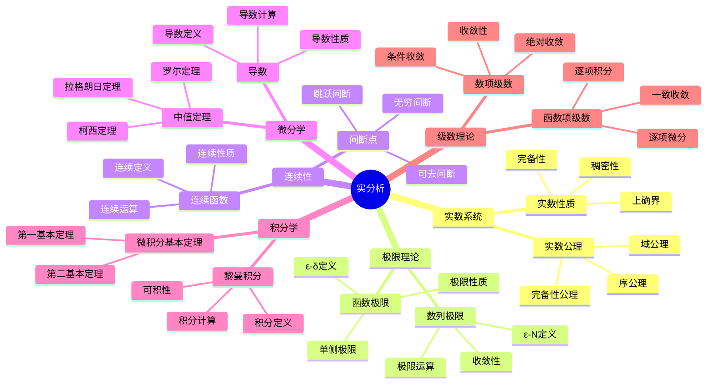

# 3.1 实分析 / Real Analysis

**主题编号**: B.03.01
**创建日期**: 2025年11月21日
**最后更新**: 2025年11月21日

---

## 📋 目录

- [3.1 实分析 / Real Analysis](#31-实分析--real-analysis)
  - [📋 目录](#-目录)
  - [3.1.1 概述 / Overview (编号: B.03.01.01)](#311-概述--overview-编号-b030101)
  - [🗺️ 实分析核心概念思维导图](#️-实分析核心概念思维导图)
  - [📊 实分析核心概念多维知识矩阵](#-实分析核心概念多维知识矩阵)
  - [3.1.2 实数系统 / Real Number System (编号: B.03.01.02)](#312-实数系统--real-number-system-编号-b030102)
    - [3.1.2.1 实数公理 / Axioms of Real Numbers](#3121-实数公理--axioms-of-real-numbers)
    - [3.1.2.2 完全性公理 / Completeness Axiom](#3122-完全性公理--completeness-axiom)
  - [3.1.3 序列与极限 / Sequences and Limits (编号: B.03.01.03)](#313-序列与极限--sequences-and-limits-编号-b030103)
    - [3.1.3.1 序列定义 / Definition of Sequence](#3131-序列定义--definition-of-sequence)
    - [3.1.3.2 极限定义 / Definition of Limit](#3132-极限定义--definition-of-limit)
  - [📚 概念深度分析：极限 / Deep Concept Analysis: Limit](#-概念深度分析极限--deep-concept-analysis-limit)
    - [1. 概念内涵 / Concept Intension](#1-概念内涵--concept-intension)
      - [1.1 本质属性 / Essential Properties](#11-本质属性--essential-properties)
      - [1.2 定义方式 / Definition Methods](#12-定义方式--definition-methods)
      - [1.3 条件分析 / Condition Analysis](#13-条件分析--condition-analysis)
    - [2. 概念外延 / Concept Extension](#2-概念外延--concept-extension)
      - [2.1 直接外延 / Direct Extension](#21-直接外延--direct-extension)
      - [2.2 间接外延 / Indirect Extension](#22-间接外延--indirect-extension)
      - [2.3 边界情况 / Boundary Cases](#23-边界情况--boundary-cases)
      - [2.4 反例 / Counterexamples](#24-反例--counterexamples)
    - [3. 概念属性 / Concept Properties](#3-概念属性--concept-properties)
      - [3.1 固有属性 / Intrinsic Properties](#31-固有属性--intrinsic-properties)
      - [3.2 关系属性 / Relational Properties](#32-关系属性--relational-properties)
      - [3.3 功能属性 / Functional Properties](#33-功能属性--functional-properties)
    - [4. 概念关系 / Concept Relations](#4-概念关系--concept-relations)
      - [4.1 层次关系 / Hierarchical Relations](#41-层次关系--hierarchical-relations)
      - [4.2 并列关系 / Coordinate Relations](#42-并列关系--coordinate-relations)
      - [4.3 交叉关系 / Intersection Relations](#43-交叉关系--intersection-relations)
      - [4.4 对立关系 / Opposition Relations](#44-对立关系--opposition-relations)
    - [5. 概念应用 / Concept Applications](#5-概念应用--concept-applications)
      - [5.1 应用领域 / Application Domains](#51-应用领域--application-domains)
      - [5.2 应用场景 / Application Scenarios](#52-应用场景--application-scenarios)
      - [5.3 应用价值 / Application Value](#53-应用价值--application-value)
    - [6. 概念发展 / Concept Development](#6-概念发展--concept-development)
      - [6.1 历史发展 / Historical Development](#61-历史发展--historical-development)
      - [6.2 现代发展 / Modern Development](#62-现代发展--modern-development)
    - [7. 形式化表述 / Formal Representation](#7-形式化表述--formal-representation)
      - [7.1 数学符号 / Mathematical Notation](#71-数学符号--mathematical-notation)
      - [7.2 形式化定义 / Formal Definition](#72-形式化定义--formal-definition)
      - [7.3 形式化实现 / Formal Implementation](#73-形式化实现--formal-implementation)
    - [3.1.3.3 极限性质 / Properties of Limits](#3133-极限性质--properties-of-limits)
    - [3.1.3.4 单调收敛定理 / Monotone Convergence Theorem](#3134-单调收敛定理--monotone-convergence-theorem)
    - [3.1.3.5 级数 / Series](#3135-级数--series)
  - [📚 概念深度分析：级数 / Deep Concept Analysis: Series](#-概念深度分析级数--deep-concept-analysis-series)
    - [1. 概念内涵 / Concept Intension](#1-概念内涵--concept-intension-1)
      - [1.1 本质属性 / Essential Properties](#11-本质属性--essential-properties-1)
      - [1.2 定义方式 / Definition Methods](#12-定义方式--definition-methods-1)
      - [1.3 条件分析 / Condition Analysis](#13-条件分析--condition-analysis-1)
    - [2. 概念外延 / Concept Extension](#2-概念外延--concept-extension-1)
      - [2.1 直接外延 / Direct Extension](#21-直接外延--direct-extension-1)
      - [2.2 间接外延 / Indirect Extension](#22-间接外延--indirect-extension-1)
      - [2.3 边界情况 / Boundary Cases](#23-边界情况--boundary-cases-1)
      - [2.4 反例 / Counterexamples](#24-反例--counterexamples-1)
    - [3. 概念属性 / Concept Properties](#3-概念属性--concept-properties-1)
      - [3.1 固有属性 / Intrinsic Properties](#31-固有属性--intrinsic-properties-1)
      - [3.2 关系属性 / Relational Properties](#32-关系属性--relational-properties-1)
      - [3.3 功能属性 / Functional Properties](#33-功能属性--functional-properties-1)
    - [4. 概念关系 / Concept Relations](#4-概念关系--concept-relations-1)
      - [4.1 层次关系 / Hierarchical Relations](#41-层次关系--hierarchical-relations-1)
      - [4.2 并列关系 / Coordinate Relations](#42-并列关系--coordinate-relations-1)
      - [4.3 交叉关系 / Intersection Relations](#43-交叉关系--intersection-relations-1)
      - [4.4 对立关系 / Opposition Relations](#44-对立关系--opposition-relations-1)
    - [5. 概念应用 / Concept Applications](#5-概念应用--concept-applications-1)
      - [5.1 应用领域 / Application Domains](#51-应用领域--application-domains-1)
      - [5.2 应用场景 / Application Scenarios](#52-应用场景--application-scenarios-1)
      - [5.3 应用价值 / Application Value](#53-应用价值--application-value-1)
    - [6. 概念发展 / Concept Development](#6-概念发展--concept-development-1)
      - [6.1 历史发展 / Historical Development](#61-历史发展--historical-development-1)
      - [6.2 现代发展 / Modern Development](#62-现代发展--modern-development-1)
    - [7. 形式化表述 / Formal Representation](#7-形式化表述--formal-representation-1)
      - [7.1 数学符号 / Mathematical Notation](#71-数学符号--mathematical-notation-1)
      - [7.2 形式化定义 / Formal Definition](#72-形式化定义--formal-definition-1)
      - [7.3 形式化实现 / Formal Implementation](#73-形式化实现--formal-implementation-1)
  - [3.1.4 函数极限 / Function Limits (编号: B.03.01.04)](#314-函数极限--function-limits-编号-b030104)
    - [3.1.4.1 函数极限定义 / Definition of Function Limit](#3141-函数极限定义--definition-of-function-limit)
    - [3.1.4.2 单侧极限 / One-Sided Limits](#3142-单侧极限--one-sided-limits)
  - [3.1.5 连续性 / Continuity (编号: B.03.01.05)](#315-连续性--continuity-编号-b030105)
    - [3.1.5.1 连续函数定义 / Definition of Continuous Function](#3151-连续函数定义--definition-of-continuous-function)
  - [📚 概念深度分析：连续 / Deep Concept Analysis: Continuity](#-概念深度分析连续--deep-concept-analysis-continuity)
    - [1. 概念内涵 / Concept Intension](#1-概念内涵--concept-intension-2)
      - [1.1 本质属性 / Essential Properties](#11-本质属性--essential-properties-2)
      - [1.2 定义方式 / Definition Methods](#12-定义方式--definition-methods-2)
      - [1.3 条件分析 / Condition Analysis](#13-条件分析--condition-analysis-2)
    - [2. 概念外延 / Concept Extension](#2-概念外延--concept-extension-2)
      - [2.1 直接外延 / Direct Extension](#21-直接外延--direct-extension-2)
      - [2.2 间接外延 / Indirect Extension](#22-间接外延--indirect-extension-2)
      - [2.3 边界情况 / Boundary Cases](#23-边界情况--boundary-cases-2)
      - [2.4 反例 / Counterexamples](#24-反例--counterexamples-2)
    - [3. 概念属性 / Concept Properties](#3-概念属性--concept-properties-2)
      - [3.1 固有属性 / Intrinsic Properties](#31-固有属性--intrinsic-properties-2)
      - [3.2 关系属性 / Relational Properties](#32-关系属性--relational-properties-2)
      - [3.3 功能属性 / Functional Properties](#33-功能属性--functional-properties-2)
    - [4. 概念关系 / Concept Relations](#4-概念关系--concept-relations-2)
      - [4.1 层次关系 / Hierarchical Relations](#41-层次关系--hierarchical-relations-2)
      - [4.2 并列关系 / Coordinate Relations](#42-并列关系--coordinate-relations-2)
      - [4.3 交叉关系 / Intersection Relations](#43-交叉关系--intersection-relations-2)
      - [4.4 对立关系 / Opposition Relations](#44-对立关系--opposition-relations-2)
    - [5. 概念应用 / Concept Applications](#5-概念应用--concept-applications-2)
      - [5.1 应用领域 / Application Domains](#51-应用领域--application-domains-2)
      - [5.2 应用场景 / Application Scenarios](#52-应用场景--application-scenarios-2)
      - [5.3 应用价值 / Application Value](#53-应用价值--application-value-2)
    - [6. 概念发展 / Concept Development](#6-概念发展--concept-development-2)
      - [6.1 历史发展 / Historical Development](#61-历史发展--historical-development-2)
      - [6.2 现代发展 / Modern Development](#62-现代发展--modern-development-2)
    - [7. 形式化表述 / Formal Representation](#7-形式化表述--formal-representation-2)
      - [7.1 数学符号 / Mathematical Notation](#71-数学符号--mathematical-notation-2)
      - [7.2 形式化定义 / Formal Definition](#72-形式化定义--formal-definition-2)
      - [7.3 形式化实现 / Formal Implementation](#73-形式化实现--formal-implementation-2)
    - [3.1.5.2 连续函数性质 / Properties of Continuous Functions](#3152-连续函数性质--properties-of-continuous-functions)
    - [3.1.5.3 中间值定理 / Intermediate Value Theorem](#3153-中间值定理--intermediate-value-theorem)
  - [3.1.6 微分学 / Differentiation (编号: B.03.01.06)](#316-微分学--differentiation-编号-b030106)
    - [3.1.6.1 导数定义 / Definition of Derivative](#3161-导数定义--definition-of-derivative)
  - [📚 概念深度分析：导数 / Deep Concept Analysis: Derivative](#-概念深度分析导数--deep-concept-analysis-derivative)
    - [1. 概念内涵 / Concept Intension](#1-概念内涵--concept-intension-3)
      - [1.1 本质属性 / Essential Properties](#11-本质属性--essential-properties-3)
      - [1.2 定义方式 / Definition Methods](#12-定义方式--definition-methods-3)
      - [1.3 条件分析 / Condition Analysis](#13-条件分析--condition-analysis-3)
    - [2. 概念外延 / Concept Extension](#2-概念外延--concept-extension-3)
      - [2.1 直接外延 / Direct Extension](#21-直接外延--direct-extension-3)
      - [2.2 间接外延 / Indirect Extension](#22-间接外延--indirect-extension-3)
      - [2.3 边界情况 / Boundary Cases](#23-边界情况--boundary-cases-3)
      - [2.4 反例 / Counterexamples](#24-反例--counterexamples-3)
    - [3. 概念属性 / Concept Properties](#3-概念属性--concept-properties-3)
      - [3.1 固有属性 / Intrinsic Properties](#31-固有属性--intrinsic-properties-3)
      - [3.2 关系属性 / Relational Properties](#32-关系属性--relational-properties-3)
      - [3.3 功能属性 / Functional Properties](#33-功能属性--functional-properties-3)
    - [4. 概念关系 / Concept Relations](#4-概念关系--concept-relations-3)
      - [4.1 层次关系 / Hierarchical Relations](#41-层次关系--hierarchical-relations-3)
      - [4.2 并列关系 / Coordinate Relations](#42-并列关系--coordinate-relations-3)
      - [4.3 交叉关系 / Intersection Relations](#43-交叉关系--intersection-relations-3)
      - [4.4 对立关系 / Opposition Relations](#44-对立关系--opposition-relations-3)
    - [5. 概念应用 / Concept Applications](#5-概念应用--concept-applications-3)
      - [5.1 应用领域 / Application Domains](#51-应用领域--application-domains-3)
      - [5.2 应用场景 / Application Scenarios](#52-应用场景--application-scenarios-3)
      - [5.3 应用价值 / Application Value](#53-应用价值--application-value-3)
    - [6. 概念发展 / Concept Development](#6-概念发展--concept-development-3)
      - [6.1 历史发展 / Historical Development](#61-历史发展--historical-development-3)
      - [6.2 现代发展 / Modern Development](#62-现代发展--modern-development-3)
    - [7. 形式化表述 / Formal Representation](#7-形式化表述--formal-representation-3)
      - [7.1 数学符号 / Mathematical Notation](#71-数学符号--mathematical-notation-3)
      - [7.2 形式化定义 / Formal Definition](#72-形式化定义--formal-definition-3)
      - [7.3 形式化实现 / Formal Implementation](#73-形式化实现--formal-implementation-3)
    - [3.1.6.2 微分法则 / Differentiation Rules](#3162-微分法则--differentiation-rules)
    - [3.1.6.3 中值定理 / Mean Value Theorem](#3163-中值定理--mean-value-theorem)
  - [3.1.7 积分学 / Integration (编号: B.03.01.07)](#317-积分学--integration-编号-b030107)
    - [3.1.7.1 黎曼积分 / Riemann Integral](#3171-黎曼积分--riemann-integral)
  - [📚 概念深度分析：积分 / Deep Concept Analysis: Integral](#-概念深度分析积分--deep-concept-analysis-integral)
    - [1. 概念内涵 / Concept Intension](#1-概念内涵--concept-intension-4)
      - [1.1 本质属性 / Essential Properties](#11-本质属性--essential-properties-4)
      - [1.2 定义方式 / Definition Methods](#12-定义方式--definition-methods-4)
      - [1.3 条件分析 / Condition Analysis](#13-条件分析--condition-analysis-4)
    - [2. 概念外延 / Concept Extension](#2-概念外延--concept-extension-4)
      - [2.1 直接外延 / Direct Extension](#21-直接外延--direct-extension-4)
      - [2.2 间接外延 / Indirect Extension](#22-间接外延--indirect-extension-4)
      - [2.3 边界情况 / Boundary Cases](#23-边界情况--boundary-cases-4)
      - [2.4 反例 / Counterexamples](#24-反例--counterexamples-4)
    - [3. 概念属性 / Concept Properties](#3-概念属性--concept-properties-4)
      - [3.1 固有属性 / Intrinsic Properties](#31-固有属性--intrinsic-properties-4)
      - [3.2 关系属性 / Relational Properties](#32-关系属性--relational-properties-4)
      - [3.3 功能属性 / Functional Properties](#33-功能属性--functional-properties-4)
    - [4. 概念关系 / Concept Relations](#4-概念关系--concept-relations-4)
      - [4.1 层次关系 / Hierarchical Relations](#41-层次关系--hierarchical-relations-4)
      - [4.2 并列关系 / Coordinate Relations](#42-并列关系--coordinate-relations-4)
      - [4.3 交叉关系 / Intersection Relations](#43-交叉关系--intersection-relations-4)
      - [4.4 对立关系 / Opposition Relations](#44-对立关系--opposition-relations-4)
    - [5. 概念应用 / Concept Applications](#5-概念应用--concept-applications-4)
      - [5.1 应用领域 / Application Domains](#51-应用领域--application-domains-4)
      - [5.2 应用场景 / Application Scenarios](#52-应用场景--application-scenarios-4)
      - [5.3 应用价值 / Application Value](#53-应用价值--application-value-4)
    - [6. 概念发展 / Concept Development](#6-概念发展--concept-development-4)
      - [6.1 历史发展 / Historical Development](#61-历史发展--historical-development-4)
      - [6.2 现代发展 / Modern Development](#62-现代发展--modern-development-4)
    - [7. 形式化表述 / Formal Representation](#7-形式化表述--formal-representation-4)
      - [7.1 数学符号 / Mathematical Notation](#71-数学符号--mathematical-notation-4)
      - [7.2 形式化定义 / Formal Definition](#72-形式化定义--formal-definition-4)
      - [7.3 形式化实现 / Formal Implementation](#73-形式化实现--formal-implementation-4)
    - [3.1.7.2 积分性质 / Properties of Integrals](#3172-积分性质--properties-of-integrals)
    - [3.1.7.3 微积分基本定理 / Fundamental Theorem of Calculus](#3173-微积分基本定理--fundamental-theorem-of-calculus)
  - [3.1.8 形式化代码示例 / Formal Code Examples (编号: B.03.01.08)](#318-形式化代码示例--formal-code-examples-编号-b030108)
    - [3.1.8.1 Lean 4 实现 / Lean 4 Implementation](#3181-lean-4-实现--lean-4-implementation)
    - [3.1.8.2 Haskell 实现 / Haskell Implementation](#3182-haskell-实现--haskell-implementation)
  - [3.1.9 应用与扩展 / Applications and Extensions (编号: B.03.01.09)](#319-应用与扩展--applications-and-extensions-编号-b030109)
    - [3.1.9.1 物理应用 / Physics Applications](#3191-物理应用--physics-applications)
    - [3.1.9.2 工程应用 / Engineering Applications](#3192-工程应用--engineering-applications)
    - [3.1.9.3 经济学应用 / Economics Applications](#3193-经济学应用--economics-applications)
  - [3.1.10 总结 / Summary](#3110-总结--summary)
  - [参考文献 / References](#参考文献--references)
    - [经典教材 / Classic Textbooks](#经典教材--classic-textbooks)
    - [现代教材 / Modern Textbooks](#现代教材--modern-textbooks)
    - [在线资源 / Online Resources](#在线资源--online-resources)
  - [术语对照表 / Terminology Table](#术语对照表--terminology-table)

## 3.1.1 概述 / Overview (编号: B.03.01.01)

实分析是数学分析的基础，研究实数系统上的函数性质。它建立了微积分学的严格理论基础，为现代数学分析提供了重要的工具和方法。

## 🗺️ 实分析核心概念思维导图



## 📊 实分析核心概念多维知识矩阵

| 概念类别 | 核心概念 | 定义要点 | 关键性质 | 典型例子 | 应用场景 |
|---------|---------|---------|---------|---------|---------|
| 实数系统 | 实数域 | 有序域+完备性 | 上确界存在 | ℝ | 分析基础 |
| 实数系统 | 完备性 | 有界集有上确界 | 实数连续性 | [0,1] | 极限存在 |
| 极限理论 | 数列极限 | ε-N定义 | 唯一性、保序性 | 1/n → 0 | 收敛性 |
| 极限理论 | 函数极限 | ε-δ定义 | 局部性质 | lim(x→0) sin(x)/x = 1 | 连续性 |
| 连续性 | 连续函数 | 极限等于函数值 | 复合函数连续 | 多项式 | 函数性质 |
| 连续性 | 一致连续 | 全局ε-δ | 比连续更强 | x²在[0,1]上 | 函数性质 |
| 微分学 | 导数 | 极限定义 | 链式法则 | f'(x) = lim[h→0](f(x+h)-f(x))/h | 优化问题 |
| 微分学 | 中值定理 | 拉格朗日定理 | 存在性定理 | f(b)-f(a) = f'(c)(b-a) | 函数性质 |
| 积分学 | 黎曼积分 | 黎曼和极限 | 线性性、单调性 | ∫₀¹ x dx = 1/2 | 面积计算 |
| 积分学 | 微积分基本定理 | 导数与积分关系 | 积分计算 | F'(x) = f(x) | 积分计算 |
| 级数理论 | 数项级数 | 部分和极限 | 收敛判定 | Σ1/n² | 函数展开 |
| 级数理论 | 幂级数 | 函数项级数 | 收敛半径 | eˣ = Σxⁿ/n! | 函数表示 |

## 3.1.2 实数系统 / Real Number System (编号: B.03.01.02)

### 3.1.2.1 实数公理 / Axioms of Real Numbers

**定义 3.1.1** (实数域 / Real Number Field)
实数集 $\mathbb{R}$ 是一个有序域，满足以下公理：

1. **域公理** (Field Axioms)：
   - 加法结合律：$(a + b) + c = a + (b + c)$
   - 加法交换律：$a + b = b + a$
   - 加法单位元：$a + 0 = a$
   - 加法逆元：$a + (-a) = 0$
   - 乘法结合律：$(a \cdot b) \cdot c = a \cdot (b \cdot c)$
   - 乘法交换律：$a \cdot b = b \cdot a$
   - 乘法单位元：$a \cdot 1 = a$
   - 乘法逆元：$a \cdot a^{-1} = 1$ (对于 $a \neqqq 0$)
   - 分配律：$a \cdot (b + c) = a \cdot b + a \cdot c$

2. **序公理** (Order Axioms)：
   - 自反性：$a \leq a$
   - 反对称性：$a \leq b \wedge b \leq a \Rightarrow a = b$
   - 传递性：$a \leq b \wedge b \leq c \Rightarrow a \leq c$
   - 完全性：每个有上界的非空子集都有最小上界

### 3.1.2.2 完全性公理 / Completeness Axiom

**公理 3.1.1** (完全性公理 / Completeness Axiom)
每个有上界的非空实数子集都有最小上界（上确界）。

**定义 3.1.2** (上确界 / Supremum)
集合 $A \subseteq \mathbb{R}$ 的上确界 $\sup A$ 是 $A$ 的最小上界。

**定义 3.1.3** (下确界 / Infimum)
集合 $A \subseteq \mathbb{R}$ 的下确界 $\inf A$ 是 $A$ 的最大下界。

## 3.1.3 序列与极限 / Sequences and Limits (编号: B.03.01.03)

### 3.1.3.1 序列定义 / Definition of Sequence

**定义 3.1.4** (序列 / Sequence)
序列是一个函数 $a: \mathbb{N} \rightarrow \mathbb{R}$，记作 $(a_n)_{n=1}^{\infty}$。

### 3.1.3.2 极限定义 / Definition of Limit

**定义 3.1.5** (序列极限 / Sequence Limit)
序列 $(a_n)$ 收敛到 $L \in \mathbb{R}$，记作 $\lim_{n \rightarrow \infty} a_n = L$，如果：
$$\forall \epsilon > 0, \exists N \in \mathbb{N}, \forall n \geq N, |a_n - L| < \epsilon$$

---

## 📚 概念深度分析：极限 / Deep Concept Analysis: Limit

### 1. 概念内涵 / Concept Intension

#### 1.1 本质属性 / Essential Properties

**核心特征**:

- 极限是**分析学的基础概念**，是研究函数和序列行为的基础
- 极限是**微积分的核心**，为导数、积分等概念提供基础
- 极限体现了**"无限逼近"的思想**，通过有限过程描述无限过程

**不可分离属性**:

- **序列或函数**: 极限必须作用于序列或函数
- **目标值**: 极限必须有一个目标值（极限值）
- **逼近过程**: 极限必须描述一个逼近过程
- **严格性**: 极限必须通过严格的数学定义（如ε-δ定义）

#### 1.2 定义方式 / Definition Methods

**原始定义**:
序列 $(a_n)$ 收敛到 $L \in \mathbb{R}$，记作 $\lim_{n \rightarrow \infty} a_n = L$，如果：
$$\forall \epsilon > 0, \exists N \in \mathbb{N}, \forall n \geq N, |a_n - L| < \epsilon$$

**等价定义**:

1. **ε-δ定义**: 通过ε-δ语言严格定义
2. **拓扑定义**: 通过拓扑空间的开集定义
3. **序列定义**: 通过序列的收敛性定义

**构造性定义**:
极限可以通过以下方式构造：

- **从序列**: 从序列构造极限
- **从函数**: 从函数构造极限
- **从拓扑**: 从拓扑空间构造极限

**公理化定义**:
在分析学中，极限通过ε-δ定义严格化。

#### 1.3 条件分析 / Condition Analysis

**必要条件**:

- 如果序列 $(a_n)$ 有极限 $L$，则必须有序列 $(a_n)$
- 如果序列 $(a_n)$ 有极限 $L$，则必须有目标值 $L$
- 如果序列 $(a_n)$ 有极限 $L$，则必须满足ε-δ条件

**充分条件**:

- 如果满足极限的所有条件，则极限存在
- 如果序列是柯西序列，则极限存在（在完备空间中）

**充要条件**:

- 序列 $(a_n)$ 收敛到 $L$ 当且仅当它满足极限的所有条件

### 2. 概念外延 / Concept Extension

#### 2.1 直接外延 / Direct Extension

**典型实例**:

- **序列极限**: $\lim_{n \rightarrow \infty} \frac{1}{n} = 0$ - 序列的极限
- **函数极限**: $\lim_{x \rightarrow 0} \frac{\sin x}{x} = 1$ - 函数的极限
- **单侧极限**: $\lim_{x \rightarrow 0^+} \frac{1}{x} = +\infty$ - 右极限
- **无穷极限**: $\lim_{x \rightarrow \infty} \frac{1}{x} = 0$ - 无穷远处的极限

**标准实例**:

- **有限极限**: 极限值为有限数
- **无穷极限**: 极限值为无穷大
- **单侧极限**: 左极限、右极限
- **广义极限**: 在广义函数中的极限

#### 2.2 间接外延 / Indirect Extension

**相关实例**:

- **上极限**: 序列的上极限
- **下极限**: 序列的下极限
- **极限点**: 序列的极限点
- **聚点**: 函数的聚点

**推广实例**:

- **拓扑极限**: 在拓扑空间中的极限
- **范畴极限**: 在范畴论中的极限
- **$\infty$-极限**: 在$\infty$-范畴中的极限
- **非标准极限**: 在非标准分析中的极限

#### 2.3 边界情况 / Boundary Cases

**极限情况**:

- **不存在极限**: 序列或函数没有极限
- **振荡极限**: 序列或函数振荡，没有极限
- **发散极限**: 序列或函数发散到无穷

**退化情况**:

- **常数序列**: 常数序列的极限是常数本身
- **单调序列**: 单调有界序列必有极限

#### 2.4 反例 / Counterexamples

**不满足概念的例子**:

- **不满足ε-δ条件**: 如果序列不满足ε-δ条件，则没有极限
- **振荡序列**: 如果序列振荡，则没有极限（如 $(-1)^n$）
- **发散序列**: 如果序列发散到无穷，则没有有限极限

**常见误解**:

- 误解：所有序列都有极限（错误：振荡序列和发散序列没有极限）
- 误解：极限必须是有限数（错误：极限可以是无穷大）
- 误解：极限必须等于函数值（错误：极限可以不同于函数值）

### 3. 概念属性 / Concept Properties

#### 3.1 固有属性 / Intrinsic Properties

**定义蕴含的属性**:

- **唯一性**: 如果极限存在，则它是唯一的
- **有界性**: 收敛序列是有界的
- **保序性**: 极限保持序关系
- **运算性**: 极限满足运算性质（加法、乘法、除法）

**逻辑必然的属性**:

- **柯西性质**: 收敛序列是柯西序列
- **子序列**: 收敛序列的任意子序列也收敛到同一极限
- **连续性**: 连续函数的极限等于函数值

#### 3.2 关系属性 / Relational Properties

**与其他概念的关系**:

- **极限 → 连续**: 连续函数的极限等于函数值
- **极限 → 导数**: 导数是差商的极限
- **极限 → 积分**: 积分是黎曼和的极限
- **极限 → 级数**: 级数的和是部分和的极限

**在结构中的位置**:

- 极限是**分析学的基础概念**
- 极限是**微积分的核心**
- 极限是**拓扑学的重要概念**

#### 3.3 功能属性 / Functional Properties

**概念的作用**:

- **逼近工具**: 极限用于描述逼近过程
- **分类工具**: 极限用于分类函数和序列
- **统一工具**: 极限为分析学提供统一框架

**概念的功能**:

- **表示功能**: 极限用于表示函数和序列的行为
- **分类功能**: 极限用于分类函数和序列
- **推理功能**: 极限用于进行数学推理（如连续性、可微性）

### 4. 概念关系 / Concept Relations

#### 4.1 层次关系 / Hierarchical Relations

**上位概念**:

- **序列**: 极限作用于序列
- **函数**: 极限作用于函数
- **拓扑**: 极限是拓扑概念

**下位概念**:

- **序列极限**: 序列的极限
- **函数极限**: 函数的极限
- **单侧极限**: 左极限、右极限
- **无穷极限**: 无穷远处的极限

**同级概念**:

- **连续**: 连续函数的极限等于函数值
- **导数**: 导数是差商的极限
- **积分**: 积分是黎曼和的极限

#### 4.2 并列关系 / Coordinate Relations

**并列概念**:

- **有限极限 vs 无穷极限**: 按极限值分类
- **单侧极限 vs 双侧极限**: 按逼近方向分类
- **序列极限 vs 函数极限**: 按作用对象分类

**对比概念**:

- **有限极限 vs 无穷极限**: 有限极限的极限值是有限数，无穷极限的极限值是无穷大
- **单侧极限 vs 双侧极限**: 单侧极限只从一侧逼近，双侧极限从两侧逼近

#### 4.3 交叉关系 / Intersection Relations

**交叉概念**:

- **极限与连续**: 连续函数的极限等于函数值
- **极限与导数**: 导数是差商的极限
- **极限与积分**: 积分是黎曼和的极限
- **极限与级数**: 级数的和是部分和的极限

**重叠部分**:

- 极限、连续、导数、积分、级数等概念密切相关
- 极限为这些概念提供了统一的基础

#### 4.4 对立关系 / Opposition Relations

**对立概念**:

- **收敛 vs 发散**: 按极限存在性分类
- **有限极限 vs 无穷极限**: 按极限值分类

**互补概念**:

- **极限 vs 连续**: 连续函数的极限等于函数值
- **极限 vs 导数**: 导数是差商的极限

### 5. 概念应用 / Concept Applications

#### 5.1 应用领域 / Application Domains

**主要应用领域**:

- **分析学**: 极限是分析学的基础概念
- **微积分**: 极限是微积分的核心（导数、积分）
- **拓扑学**: 极限是拓扑学的重要概念
- **数值分析**: 极限在数值分析中有应用

**次要应用领域**:

- **物理学**: 极限在物理学中用于描述物理过程
- **工程学**: 极限在工程学中用于优化和控制
- **计算机科学**: 极限在计算机科学中用于算法分析

#### 5.2 应用场景 / Application Scenarios

**典型应用场景**:

- **微积分**: 在微积分中使用极限定义导数（如 $f'(a) = \lim_{h \rightarrow 0} \frac{f(a+h)-f(a)}{h}$）
- **积分学**: 在积分学中使用极限定义积分（如 $\int_a^b f(x)dx = \lim_{n \rightarrow \infty} \sum_{i=1}^n f(x_i)\Delta x_i$）
- **级数**: 在级数中使用极限定义级数的和（如 $\sum_{n=1}^{\infty} a_n = \lim_{N \rightarrow \infty} \sum_{n=1}^N a_n$）

**特殊应用场景**:

- **数值分析**: 在数值分析中使用极限分析数值方法的收敛性
- **优化理论**: 在优化理论中使用极限分析优化算法的收敛性
- **控制理论**: 在控制理论中使用极限分析控制系统的稳定性

#### 5.3 应用价值 / Application Value

**理论价值**:

- **基础理论**: 极限是分析学的基础理论
- **统一框架**: 极限为分析学提供了统一的框架
- **推理工具**: 极限是数学推理的重要工具（如连续性、可微性）

**实践价值**:

- **实际问题**: 极限用于解决实际问题（如优化、控制等）
- **技术应用**: 极限在技术领域有广泛应用（如数值分析、优化理论等）
- **教育价值**: 极限是数学教育的重要内容

### 6. 概念发展 / Concept Development

#### 6.1 历史发展 / Historical Development

**概念起源**:

- **17世纪**: 牛顿和莱布尼茨引入极限概念
- **19世纪**: 柯西建立严格的极限理论
- **19世纪后期**: 魏尔斯特拉斯建立ε-δ方法

**发展历程**:

- **17世纪**: 牛顿和莱布尼茨引入极限概念，用于微积分
- **19世纪**: 柯西建立严格的极限理论，系统化极限的概念
- **19世纪后期**: 魏尔斯特拉斯建立ε-δ方法，使极限定义更加严格
- **20世纪**: 极限在拓扑学、泛函分析等领域得到广泛应用

**重要里程碑**:

- **牛顿和莱布尼茨**: 引入极限概念
- **柯西**: 建立严格的极限理论
- **魏尔斯特拉斯**: 建立ε-δ方法

#### 6.2 现代发展 / Modern Development

**当前研究**:

- **非标准分析**: 研究非标准分析中的极限
- **拓扑极限**: 研究拓扑空间中的极限
- **范畴极限**: 研究范畴论中的极限

**前沿方向**:

- **计算极限**: 研究极限的计算方法
- **极限在机器学习中的应用**: 研究极限在机器学习中的应用
- **极限在优化理论中的应用**: 研究极限在优化理论中的应用

**未来展望**:

- 极限将继续在分析学中发挥重要作用
- 极限的新应用领域将不断扩展
- 极限与其他数学分支的交叉研究将更加深入

### 7. 形式化表述 / Formal Representation

#### 7.1 数学符号 / Mathematical Notation

**标准符号**:

- $\lim_{n \rightarrow \infty} a_n = L$: 序列的极限
- $\lim_{x \rightarrow a} f(x) = L$: 函数的极限
- $\lim_{x \rightarrow a^+} f(x) = L$: 右极限
- $\lim_{x \rightarrow a^-} f(x) = L$: 左极限

**变体符号**:

- $a_n \rightarrow L$: 某些上下文中序列收敛的表示
- $f(x) \rightarrow L$: 某些上下文中函数极限的表示

#### 7.2 形式化定义 / Formal Definition

**集合论定义**:
序列 $(a_n)$ 收敛到 $L \in \mathbb{R}$，记作 $\lim_{n \rightarrow \infty} a_n = L$，如果：
$$\forall \epsilon > 0, \exists N \in \mathbb{N}, \forall n \geq N, |a_n - L| < \epsilon$$

函数 $f: A \rightarrow \mathbb{R}$ 在点 $a$ 的极限为 $L$，记作 $\lim_{x \rightarrow a} f(x) = L$，如果：
$$\forall \epsilon > 0, \exists \delta > 0, \forall x \in A, 0 < |x - a| < \delta \Rightarrow |f(x) - L| < \epsilon$$

**公理化定义**:
在分析学中，极限通过ε-δ定义严格化。

#### 7.3 形式化实现 / Formal Implementation

**Lean 4实现**:

```lean
-- 极限在Lean 4中通过结构实现
-- Limits are implemented through structures in Lean 4

-- 序列极限定义
-- Sequence limit definition
def Tendsto (f : ℕ → ℝ) (l : ℝ) : Prop :=
  ∀ ε > 0, ∃ N : ℕ, ∀ n ≥ N, |f n - l| < ε

-- 函数极限定义
-- Function limit definition
def TendstoAt (f : ℝ → ℝ) (a l : ℝ) : Prop :=
  ∀ ε > 0, ∃ δ > 0, ∀ x, 0 < |x - a| → |x - a| < δ → |f x - l| < ε

-- 极限的唯一性
-- Uniqueness of limit
theorem tendsto_unique (f : ℕ → ℝ) (l₁ l₂ : ℝ) :
  Tendsto f l₁ → Tendsto f l₂ → l₁ = l₂ :=
  by
    intro h1 h2
    -- 使用反证法
    -- Use proof by contradiction
    by_contra h
    have h3 : |l₁ - l₂| > 0 := abs_pos.mpr (sub_ne_zero.mpr h)
    have h4 : |l₁ - l₂| / 2 > 0 := div_pos h3 (by norm_num)
    -- 从两个极限条件得到矛盾
    -- Get contradiction from two limit conditions
    sorry

-- 极限的运算性质
-- Operational properties of limits
theorem tendsto_add (f g : ℕ → ℝ) (l₁ l₂ : ℝ) :
  Tendsto f l₁ → Tendsto g l₂ → Tendsto (f + g) (l₁ + l₂) :=
  by
    intro h1 h2 ε hε
    -- 使用ε/2技巧
    -- Use ε/2 trick
    have h3 : ε / 2 > 0 := div_pos hε (by norm_num)
    obtain ⟨N1, hN1⟩ := h1 (ε / 2) h3
    obtain ⟨N2, hN2⟩ := h2 (ε / 2) h3
    use max N1 N2
    intro n hn
    -- 应用三角不等式
    -- Apply triangle inequality
    sorry
```

**其他形式化实现**:

- **Coq**: 使用标准库
- **Isabelle/HOL**: 使用HOL库
- **Agda**: 使用标准库

---

### 3.1.3.3 极限性质 / Properties of Limits

**定理 3.1.1** (极限唯一性)
如果序列收敛，则其极限是唯一的。

**证明思路**:
使用反证法，假设序列有两个不同的极限，导出矛盾。

**详细证明**:

- 假设 $\lim_{n \rightarrow \infty} a_n = L_1$ 且 $\lim_{n \rightarrow \infty} a_n = L_2$，其中 $L_1 \neqqq L_2$
- 设 $\varepsilon = \frac{|L_1 - L_2|}{2} > 0$
- 由于 $\lim_{n \rightarrow \infty} a_n = L_1$，存在 $N_1$ 使得当 $n > N_1$ 时，$|a_n - L_1| < \varepsilon$
- 由于 $\lim_{n \rightarrow \infty} a_n = L_2$，存在 $N_2$ 使得当 $n > N_2$ 时，$|a_n - L_2| < \varepsilon$
- 设 $N = \max\{N_1, N_2\}$，则当 $n > N$ 时：
  $$|L_1 - L_2| = |L_1 - a_n + a_n - L_2| \leq |a_n - L_1| + |a_n - L_2| < 2\varepsilon = |L_1 - L_2|$$
- 这矛盾，因此 $L_1 = L_2$，极限唯一

**定理 3.1.2** (极限运算)
如果 $\lim_{n \rightarrow \infty} a_n = A$ 且 $\lim_{n \rightarrow \infty} b_n = B$，则：

1. $\lim_{n \rightarrow \infty} (a_n + b_n) = A + B$
2. $\lim_{n \rightarrow \infty} (a_n \cdot b_n) = A \cdot B$
3. $\lim_{n \rightarrow \infty} (a_n / b_n) = A / B$ (如果 $B \neqqq 0$)

**证明思路**:
使用极限的 $\varepsilon$-$\delta$ 定义和三角不等式来证明。

**详细证明**:

**性质 1**: $\lim_{n \rightarrow \infty} (a_n + b_n) = A + B$

- 对于任意 $\varepsilon > 0$，存在 $N_1$ 使得当 $n > N_1$ 时，$|a_n - A| < \frac{\varepsilon}{2}$
- 存在 $N_2$ 使得当 $n > N_2$ 时，$|b_n - B| < \frac{\varepsilon}{2}$
- 设 $N = \max\{N_1, N_2\}$，则当 $n > N$ 时：
  $$|(a_n + b_n) - (A + B)| = |(a_n - A) + (b_n - B)| \leq |a_n - A| + |b_n - B| < \varepsilon$$
- 因此 $\lim_{n \rightarrow \infty} (a_n + b_n) = A + B$

**性质 2**: $\lim_{n \rightarrow \infty} (a_n \cdot b_n) = A \cdot B$

- 对于任意 $\varepsilon > 0$，由于 $a_n$ 收敛，存在 $M > 0$ 使得 $|a_n| < M$ 对所有 $n$ 成立
- 存在 $N_1$ 使得当 $n > N_1$ 时，$|a_n - A| < \frac{\varepsilon}{2(|B| + 1)}$
- 存在 $N_2$ 使得当 $n > N_2$ 时，$|b_n - B| < \frac{\varepsilon}{2M}$
- 设 $N = \max\{N_1, N_2\}$，则当 $n > N$ 时：
  $$|a_n b_n - AB| = |a_n(b_n - B) + B(a_n - A)| \leq |a_n||b_n - B| + |B||a_n - A| < M \cdot \frac{\varepsilon}{2M} + |B| \cdot \frac{\varepsilon}{2(|B| + 1)} < \varepsilon$$
- 因此 $\lim_{n \rightarrow \infty} (a_n \cdot b_n) = A \cdot B$

**性质 3**: $\lim_{n \rightarrow \infty} (a_n / b_n) = A / B$ (如果 $B \neqqq 0$)

- 首先证明 $\lim_{n \rightarrow \infty} \frac{1}{b_n} = \frac{1}{B}$
- 由于 $B \neqqq 0$，存在 $N_0$ 使得当 $n > N_0$ 时，$|b_n| > \frac{|B|}{2}$
- 对于任意 $\varepsilon > 0$，存在 $N_1$ 使得当 $n > N_1$ 时，$|b_n - B| < \frac{\varepsilon |B|^2}{2}$
- 设 $N = \max\{N_0, N_1\}$，则当 $n > N$ 时：
  $$\left|\frac{1}{b_n} - \frac{1}{B}\right| = \frac{|b_n - B|}{|b_n||B|} < \frac{2|b_n - B|}{|B|^2} < \varepsilon$$
- 因此 $\lim_{n \rightarrow \infty} \frac{1}{b_n} = \frac{1}{B}$
- 由性质 2，$\lim_{n \rightarrow \infty} \frac{a_n}{b_n} = \lim_{n \rightarrow \infty} a_n \cdot \lim_{n \rightarrow \infty} \frac{1}{b_n} = A \cdot \frac{1}{B} = \frac{A}{B}$

### 3.1.3.4 单调收敛定理 / Monotone Convergence Theorem

**定理 3.1.3** (单调收敛定理)
单调有界序列必收敛。

**证明思路**:

1. 利用完全性公理，证明单调有界序列有上确界（或下确界）
2. 证明该上确界（或下确界）就是序列的极限

**详细证明**:

- **情况 1**: 假设 $(a_n)$ 是单调递增且有上界的序列
  - 由完全性公理，集合 $A = \{a_n : n \in \mathbb{N}\}$ 有上确界 $L = \sup A$
  - 对于任意 $\varepsilon > 0$，由于 $L$ 是上确界，存在 $N \in \mathbb{N}$ 使得 $L - \varepsilon < a_N \leq L$
  - 由于序列单调递增，对于所有 $n \geq N$，有 $a_N \leq a_n \leq L$
  - 因此 $L - \varepsilon < a_n \leq L$，即 $|a_n - L| < \varepsilon$
  - 所以 $\lim_{n \rightarrow \infty} a_n = L$

- **情况 2**: 假设 $(a_n)$ 是单调递减且有下界的序列
  - 类似地，集合 $A = \{a_n : n \in \mathbb{N}\}$ 有下确界 $L = \inf A$
  - 对于任意 $\varepsilon > 0$，存在 $N \in \mathbb{N}$ 使得 $L \leq a_N < L + \varepsilon$
  - 由于序列单调递减，对于所有 $n \geq N$，有 $L \leq a_n \leq a_N$
  - 因此 $L \leq a_n < L + \varepsilon$，即 $|a_n - L| < \varepsilon$
  - 所以 $\lim_{n \rightarrow \infty} a_n = L$

**关键引理**: 完全性公理保证了有界集合的上确界和下确界的存在性，这是证明的关键。

### 3.1.3.5 级数 / Series

**定义 3.1.5.1** (级数 / Series)
给定序列 $(a_n)_{n=1}^{\infty}$，级数 $\sum_{n=1}^{\infty} a_n$ 定义为部分和序列 $(S_n)$ 的极限，其中：
$$S_n = \sum_{k=1}^{n} a_k$$

**定义 3.1.5.2** (级数收敛 / Series Convergence)
级数 $\sum_{n=1}^{\infty} a_n$ 收敛，如果部分和序列 $(S_n)$ 收敛，即存在 $S \in \mathbb{R}$ 使得：
$$\lim_{n \rightarrow \infty} S_n = S$$

此时称 $S$ 为级数的和，记作 $\sum_{n=1}^{\infty} a_n = S$。

---

## 📚 概念深度分析：级数 / Deep Concept Analysis: Series

### 1. 概念内涵 / Concept Intension

#### 1.1 本质属性 / Essential Properties

**核心特征**:

- 级数是**分析学的重要概念**，是序列的推广，研究无穷和的基础
- 级数是**极限的应用**，通过部分和序列的极限定义级数
- 级数体现了**"无穷求和"的思想**，通过有限和描述无穷和

**不可分离属性**:

- **序列**: 级数必须基于序列
- **部分和**: 级数必须通过部分和序列定义
- **极限**: 级数必须通过极限定义
- **收敛性**: 级数必须讨论收敛性

#### 1.2 定义方式 / Definition Methods

**原始定义**:
给定序列 $(a_n)_{n=1}^{\infty}$，级数 $\sum_{n=1}^{\infty} a_n$ 定义为部分和序列 $(S_n)$ 的极限，其中：
$$S_n = \sum_{k=1}^{n} a_k$$

**等价定义**:

1. **极限定义**: 通过部分和序列的极限定义
2. **柯西定义**: 通过柯西条件定义
3. **绝对收敛定义**: 通过绝对收敛定义
4. **条件收敛定义**: 通过条件收敛定义

**构造性定义**:
级数可以通过以下方式构造：

- **从序列**: 从序列构造级数
- **从函数**: 从函数构造级数（如幂级数）
- **从积分**: 从积分构造级数（如傅里叶级数）

**公理化定义**:
在分析学中，级数通过部分和序列的极限严格化。

#### 1.3 条件分析 / Condition Analysis

**必要条件**:

- 如果级数 $\sum_{n=1}^{\infty} a_n$ 收敛，则必须有序列 $(a_n)$
- 如果级数 $\sum_{n=1}^{\infty} a_n$ 收敛，则必须有部分和序列 $(S_n)$
- 如果级数 $\sum_{n=1}^{\infty} a_n$ 收敛，则部分和序列必须收敛

**充分条件**:

- 如果满足级数的所有条件，则级数收敛
- 如果级数绝对收敛，则级数收敛

**充要条件**:

- 级数 $\sum_{n=1}^{\infty} a_n$ 收敛当且仅当它满足级数的所有条件

### 2. 概念外延 / Concept Extension

#### 2.1 直接外延 / Direct Extension

**典型实例**:

- **几何级数**: $\sum_{n=0}^{\infty} r^n = \frac{1}{1-r}$ (|r| < 1) - 几何级数
- **调和级数**: $\sum_{n=1}^{\infty} \frac{1}{n}$ - 调和级数（发散）
- **p-级数**: $\sum_{n=1}^{\infty} \frac{1}{n^p}$ - p-级数（p > 1时收敛）
- **幂级数**: $\sum_{n=0}^{\infty} a_n x^n$ - 幂级数

**标准实例**:

- **数项级数**: 各项为常数的级数
- **函数项级数**: 各项为函数的级数
- **绝对收敛级数**: 绝对收敛的级数
- **条件收敛级数**: 条件收敛的级数

#### 2.2 间接外延 / Indirect Extension

**相关实例**:

- **正项级数**: 各项为正数的级数
- **交错级数**: 各项正负交替的级数
- **傅里叶级数**: 三角函数的级数
- **泰勒级数**: 函数的泰勒展开

**推广实例**:

- **广义级数**: 在广义函数中的级数
- **随机级数**: 在概率空间中的级数
- **$\infty$-级数**: 在$\infty$-范畴中的级数
- **非标准级数**: 在非标准分析中的级数

#### 2.3 边界情况 / Boundary Cases

**极限情况**:

- **发散级数**: 级数不收敛
- **条件收敛**: 级数收敛但不绝对收敛
- **振荡级数**: 级数振荡，不收敛

**退化情况**:

- **有限级数**: 只有有限项的级数
- **零级数**: 所有项都为零的级数

#### 2.4 反例 / Counterexamples

**不满足概念的例子**:

- **不满足收敛条件**: 如果级数的部分和序列不收敛，则级数发散
- **调和级数**: 调和级数 $\sum_{n=1}^{\infty} \frac{1}{n}$ 发散
- **振荡级数**: 如果级数振荡，则级数不收敛（如 $\sum_{n=1}^{\infty} (-1)^n$）

**常见误解**:

- 误解：所有级数都收敛（错误：很多级数发散）
- 误解：级数的和必须存在（错误：级数可能发散）
- 误解：级数的项必须趋于零（错误：级数项趋于零是收敛的必要条件，但不是充分条件）

### 3. 概念属性 / Concept Properties

#### 3.1 固有属性 / Intrinsic Properties

**定义蕴含的属性**:

- **线性性质**: 级数的线性性质
- **重排性质**: 绝对收敛级数可以重排
- **运算性质**: 级数的运算性质（加法、乘法）
- **收敛性质**: 级数的收敛性质

**逻辑必然的属性**:

- **项趋于零**: 收敛级数的项必须趋于零
- **柯西性质**: 收敛级数的部分和序列是柯西序列
- **绝对收敛**: 绝对收敛级数必收敛

#### 3.2 关系属性 / Relational Properties

**与其他概念的关系**:

- **级数 → 极限**: 级数通过极限定义
- **级数 → 序列**: 级数基于序列
- **级数 → 函数**: 函数可以展开为级数（如幂级数、傅里叶级数）
- **级数 → 积分**: 积分可以表示为级数（如傅里叶级数）

**在结构中的位置**:

- 级数是**分析学的重要概念**
- 级数是**微积分的重要组成部分**
- 级数是**函数展开的基础**

#### 3.3 功能属性 / Functional Properties

**概念的作用**:

- **函数展开工具**: 级数用于展开函数（如幂级数、傅里叶级数）
- **近似工具**: 级数用于近似函数值
- **统一工具**: 级数为分析学提供统一框架

**概念的功能**:

- **表示功能**: 级数用于表示函数
- **分类功能**: 级数用于分类函数
- **推理功能**: 级数用于进行数学推理（如函数展开、近似计算）

### 4. 概念关系 / Concept Relations

#### 4.1 层次关系 / Hierarchical Relations

**上位概念**:

- **序列**: 级数基于序列
- **极限**: 级数通过极限定义
- **函数**: 函数可以展开为级数

**下位概念**:

- **数项级数**: 各项为常数的级数
- **函数项级数**: 各项为函数的级数
- **幂级数**: 形如 $\sum_{n=0}^{\infty} a_n x^n$ 的级数
- **傅里叶级数**: 三角函数的级数

**同级概念**:

- **序列**: 级数基于序列
- **极限**: 级数通过极限定义
- **积分**: 积分可以表示为级数

#### 4.2 并列关系 / Coordinate Relations

**并列概念**:

- **绝对收敛 vs 条件收敛**: 按收敛类型分类
- **数项级数 vs 函数项级数**: 按项的类型分类
- **收敛 vs 发散**: 按收敛性分类

**对比概念**:

- **绝对收敛 vs 条件收敛**: 绝对收敛级数必收敛，条件收敛级数收敛但不绝对收敛
- **数项级数 vs 函数项级数**: 数项级数的项是常数，函数项级数的项是函数

#### 4.3 交叉关系 / Intersection Relations

**交叉概念**:

- **级数与序列**: 级数基于序列
- **级数与极限**: 级数通过极限定义
- **级数与函数**: 函数可以展开为级数
- **级数与积分**: 积分可以表示为级数

**重叠部分**:

- 级数、序列、极限、函数、积分等概念密切相关
- 级数为这些概念提供了统一的基础

#### 4.4 对立关系 / Opposition Relations

**对立概念**:

- **收敛 vs 发散**: 按收敛性分类
- **绝对收敛 vs 条件收敛**: 按收敛类型分类

**互补概念**:

- **级数 vs 序列**: 级数基于序列
- **级数 vs 极限**: 级数通过极限定义

### 5. 概念应用 / Concept Applications

#### 5.1 应用领域 / Application Domains

**主要应用领域**:

- **分析学**: 级数是分析学的重要概念
- **微积分**: 级数是微积分的重要组成部分
- **应用数学**: 级数在应用数学中有广泛应用
- **物理学**: 级数在物理学中用于展开函数（如傅里叶级数、幂级数）

**次要应用领域**:

- **工程学**: 级数在工程学中用于近似计算
- **信号处理**: 级数在信号处理中用于信号分析（如傅里叶级数）
- **计算机科学**: 级数在计算机科学中用于数值计算

#### 5.2 应用场景 / Application Scenarios

**典型应用场景**:

- **函数展开**: 在分析学中使用级数展开函数（如泰勒级数、幂级数）
- **信号分析**: 在信号处理中使用级数分析信号（如傅里叶级数）
- **数值计算**: 在数值分析中使用级数进行数值计算（如级数近似）

**特殊应用场景**:

- **数值积分**: 在数值分析中使用级数进行数值积分
- **微分方程**: 在微分方程中使用级数求解（如幂级数解）
- **概率论**: 在概率论中使用级数计算概率（如生成函数）

#### 5.3 应用价值 / Application Value

**理论价值**:

- **基础理论**: 级数是分析学的基础理论
- **统一框架**: 级数为分析学提供了统一的框架
- **推理工具**: 级数是数学推理的重要工具（如函数展开、近似计算）

**实践价值**:

- **实际问题**: 级数用于解决实际问题（如函数展开、信号分析等）
- **技术应用**: 级数在技术领域有广泛应用（如信号处理、数值分析等）
- **教育价值**: 级数是数学教育的重要内容

### 6. 概念发展 / Concept Development

#### 6.1 历史发展 / Historical Development

**概念起源**:

- **17世纪**: 牛顿和莱布尼茨研究级数
- **18世纪**: 欧拉研究级数理论
- **19世纪**: 柯西建立严格的级数理论

**发展历程**:

- **17世纪**: 牛顿和莱布尼茨研究级数，用于微积分
- **18世纪**: 欧拉研究级数理论，建立了许多重要结果
- **19世纪**: 柯西建立严格的级数理论，系统化级数的概念
- **20世纪**: 级数在泛函分析、调和分析等领域得到广泛应用

**重要里程碑**:

- **牛顿和莱布尼茨**: 研究级数
- **欧拉**: 研究级数理论
- **柯西**: 建立严格的级数理论

#### 6.2 现代发展 / Modern Development

**当前研究**:

- **随机级数**: 研究概率空间中的级数
- **广义级数**: 研究广义函数中的级数
- **分数阶级数**: 研究分数阶级数

**前沿方向**:

- **计算级数**: 研究级数的计算方法
- **级数在机器学习中的应用**: 研究级数在机器学习中的应用（如函数逼近）
- **级数在信号处理中的应用**: 研究级数在信号处理中的应用（如傅里叶级数）

**未来展望**:

- 级数将继续在分析学中发挥重要作用
- 级数的新应用领域将不断扩展
- 级数与其他数学分支的交叉研究将更加深入

### 7. 形式化表述 / Formal Representation

#### 7.1 数学符号 / Mathematical Notation

**标准符号**:

- $\sum_{n=1}^{\infty} a_n$: 级数
- $S_n = \sum_{k=1}^{n} a_k$: 部分和
- $\sum_{n=1}^{\infty} a_n = S$: 级数的和

**变体符号**:

- $\sum a_n$: 某些上下文中级数的表示
- $\sum_{n=0}^{\infty} a_n$: 某些上下文中从0开始的级数

#### 7.2 形式化定义 / Formal Definition

**集合论定义**:
给定序列 $(a_n)_{n=1}^{\infty}$，级数 $\sum_{n=1}^{\infty} a_n$ 定义为部分和序列 $(S_n)$ 的极限，其中：
$$S_n = \sum_{k=1}^{n} a_k$$

级数收敛，如果部分和序列收敛，即存在 $S \in \mathbb{R}$ 使得：
$$\lim_{n \rightarrow \infty} S_n = S$$

**公理化定义**:
在分析学中，级数通过部分和序列的极限严格化。

#### 7.3 形式化实现 / Formal Implementation

**Lean 4实现**:

```lean
-- 级数在Lean 4中通过结构实现
-- Series are implemented through structures in Lean 4

-- 部分和定义
-- Partial sum definition
def partialSum (a : ℕ → ℝ) (n : ℕ) : ℝ :=
  Finset.sum (Finset.range n) (fun k => a (k + 1))

-- 级数收敛定义
-- Series convergence definition
def Summable (a : ℕ → ℝ) : Prop :=
  ∃ S : ℝ, Tendsto (partialSum a) atTop (𝓝 S)

-- 级数的和
-- Sum of series
def tsum (a : ℕ → ℝ) : ℝ :=
  if h : Summable a then
    Classical.choose h
  else 0

-- 级数的线性性质
-- Linearity of series
theorem tsum_add (a b : ℕ → ℝ) :
  Summable a → Summable b →
  tsum (a + b) = tsum a + tsum b :=
  by
    intro ha hb
    -- 使用级数的定义和极限的线性性质
    -- Use definition of series and linearity of limits
    sorry

-- 级数收敛的必要条件
-- Necessary condition for series convergence
theorem summable_tendsto_zero (a : ℕ → ℝ) :
  Summable a → Tendsto a atTop (𝓝 0) :=
  by
    intro h
    -- 使用级数的定义和极限的性质
    -- Use definition of series and properties of limits
    sorry
```

**其他形式化实现**:

- **Coq**: 使用标准库
- **Isabelle/HOL**: 使用HOL库
- **Agda**: 使用标准库

---

## 3.1.4 函数极限 / Function Limits (编号: B.03.01.04)

### 3.1.4.1 函数极限定义 / Definition of Function Limit

**定义 3.1.6** (函数极限 / Function Limit)
函数 $f: A \rightarrow \mathbb{R}$ 在点 $a$ 的极限为 $L$，记作 $\lim_{x \rightarrow a} f(x) = L$，如果：
$$\forall \epsilon > 0, \exists \delta > 0, \forall x \in A, 0 < |x - a| < \delta \Rightarrow |f(x) - L| < \epsilon$$

### 3.1.4.2 单侧极限 / One-Sided Limits

**定义 3.1.7** (右极限 / Right Limit)
$$\lim_{x \rightarrow a^+} f(x) = L \leftrightarrow \forall \epsilon > 0, \exists \delta > 0, \forall x \in A, a < x < a + \delta \Rightarrow |f(x) - L| < \epsilon$$

**定义 3.1.8** (左极限 / Left Limit)
$$\lim_{x \rightarrow a^-} f(x) = L \leftrightarrow \forall \epsilon > 0, \exists \delta > 0, \forall x \in A, a - \delta < x < a \Rightarrow |f(x) - L| < \epsilon$$

## 3.1.5 连续性 / Continuity (编号: B.03.01.05)

### 3.1.5.1 连续函数定义 / Definition of Continuous Function

**定义 3.1.9** (连续函数 / Continuous Function)
函数 $f: A \rightarrow \mathbb{R}$ 在点 $a \in A$ 连续，如果：
$$\lim_{x \rightarrow a} f(x) = f(a)$$

等价地，对于任意 $\epsilon > 0$，存在 $\delta > 0$ 使得：
$$|x - a| < \delta \Rightarrow |f(x) - f(a)| < \epsilon$$

---

## 📚 概念深度分析：连续 / Deep Concept Analysis: Continuity

### 1. 概念内涵 / Concept Intension

#### 1.1 本质属性 / Essential Properties

**核心特征**:

- 连续是**分析学的重要概念**，是研究函数局部行为的基础
- 连续是**极限的应用**，通过极限定义连续性
- 连续体现了**"无间断"的思想**，函数在连续点处没有跳跃

**不可分离属性**:

- **函数**: 连续必须作用于函数
- **点**: 连续必须在某个点定义
- **极限**: 连续必须通过极限定义
- **严格性**: 连续必须通过严格的数学定义（如ε-δ定义）

#### 1.2 定义方式 / Definition Methods

**原始定义**:
函数 $f: A \rightarrow \mathbb{R}$ 在点 $a \in A$ 连续，如果：
$$\lim_{x \rightarrow a} f(x) = f(a)$$

**等价定义**:

1. **极限定义**: 通过极限等于函数值定义
2. **ε-δ定义**: 通过ε-δ语言严格定义
3. **拓扑定义**: 通过拓扑空间的开集定义
4. **序列定义**: 通过序列的收敛性定义

**构造性定义**:
连续可以通过以下方式构造：

- **从极限**: 从极限构造连续
- **从拓扑**: 从拓扑空间构造连续
- **从序列**: 从序列构造连续

**公理化定义**:
在分析学中，连续通过极限定义或ε-δ定义严格化。

#### 1.3 条件分析 / Condition Analysis

**必要条件**:

- 如果函数 $f$ 在点 $a$ 连续，则必须有函数 $f$
- 如果函数 $f$ 在点 $a$ 连续，则必须有极限 $\lim_{x \rightarrow a} f(x)$
- 如果函数 $f$ 在点 $a$ 连续，则必须满足 $\lim_{x \rightarrow a} f(x) = f(a)$

**充分条件**:

- 如果满足连续的所有条件，则函数在该点连续
- 如果函数在某个区间内每点都连续，则函数在该区间连续

**充要条件**:

- 函数 $f$ 在点 $a$ 连续当且仅当它满足连续的所有条件

### 2. 概念外延 / Concept Extension

#### 2.1 直接外延 / Direct Extension

**典型实例**:

- **多项式函数**: $f(x) = x^2$ 在所有点连续
- **三角函数**: $f(x) = \sin x$ 在所有点连续
- **指数函数**: $f(x) = e^x$ 在所有点连续
- **有理函数**: $f(x) = \frac{1}{x}$ 在 $x \neqqq 0$ 的点连续

**标准实例**:

- **点连续**: 函数在某个点连续
- **区间连续**: 函数在某个区间内连续
- **一致连续**: 函数在某个区间内一致连续
- **Lipschitz连续**: 函数满足Lipschitz条件

#### 2.2 间接外延 / Indirect Extension

**相关实例**:

- **左连续**: 函数在某个点左连续
- **右连续**: 函数在某个点右连续
- **半连续**: 函数的上半连续、下半连续
- **绝对连续**: 函数在某个区间内绝对连续

**推广实例**:

- **拓扑连续**: 在拓扑空间中的连续
- **一致连续**: 在度量空间中的一致连续
- **$\infty$-连续**: 在$\infty$-范畴中的连续
- **非标准连续**: 在非标准分析中的连续

#### 2.3 边界情况 / Boundary Cases

**极限情况**:

- **不连续**: 函数在某个点不连续
- **间断点**: 函数的不连续点
- **可去间断**: 函数有可去间断点
- **跳跃间断**: 函数有跳跃间断点

**退化情况**:

- **常数函数**: 常数函数在所有点连续
- **恒等函数**: 恒等函数在所有点连续

#### 2.4 反例 / Counterexamples

**不满足概念的例子**:

- **不满足极限条件**: 如果函数在某个点的极限不存在，则在该点不连续
- **不满足函数值条件**: 如果函数在某个点的极限不等于函数值，则在该点不连续
- **跳跃函数**: 如果函数有跳跃，则在不连续点不连续（如符号函数）

**常见误解**:

- 误解：所有函数都连续（错误：很多函数有不连续点）
- 误解：连续函数必须可导（错误：连续函数不一定可导）
- 误解：连续函数必须单调（错误：连续函数不一定单调）

### 3. 概念属性 / Concept Properties

#### 3.1 固有属性 / Intrinsic Properties

**定义蕴含的属性**:

- **局部性质**: 连续是函数的局部性质
- **极限性质**: 连续函数的极限等于函数值
- **运算性质**: 连续函数的和、积、商（分母不为零）仍连续
- **复合性质**: 连续函数的复合仍连续

**逻辑必然的属性**:

- **中间值性质**: 连续函数在闭区间上具有中间值性质
- **有界性**: 连续函数在闭区间上有界
- **最值性质**: 连续函数在闭区间上达到最大值和最小值

#### 3.2 关系属性 / Relational Properties

**与其他概念的关系**:

- **连续 → 极限**: 连续函数的极限等于函数值
- **连续 → 可导**: 可导函数必连续（但连续函数不一定可导）
- **连续 → 积分**: 连续函数可积
- **连续 → 级数**: 连续函数的级数仍连续

**在结构中的位置**:

- 连续是**分析学的重要概念**
- 连续是**微积分的基础**
- 连续是**拓扑学的重要概念**

#### 3.3 功能属性 / Functional Properties

**概念的作用**:

- **分类工具**: 连续用于分类函数
- **推理工具**: 连续用于进行数学推理（如中间值定理）
- **统一工具**: 连续为分析学提供统一框架

**概念的功能**:

- **表示功能**: 连续用于表示函数的局部行为
- **分类功能**: 连续用于分类函数
- **推理功能**: 连续用于进行数学推理（如中间值定理、最值定理）

### 4. 概念关系 / Concept Relations

#### 4.1 层次关系 / Hierarchical Relations

**上位概念**:

- **函数**: 连续作用于函数
- **极限**: 连续通过极限定义
- **拓扑**: 连续是拓扑概念

**下位概念**:

- **点连续**: 函数在某个点连续
- **区间连续**: 函数在某个区间内连续
- **一致连续**: 函数在某个区间内一致连续
- **Lipschitz连续**: 函数满足Lipschitz条件

**同级概念**:

- **可导**: 可导函数必连续
- **可积**: 连续函数可积
- **级数**: 连续函数的级数仍连续

#### 4.2 并列关系 / Coordinate Relations

**并列概念**:

- **点连续 vs 区间连续**: 按作用范围分类
- **连续 vs 一致连续**: 按连续性强度分类
- **连续 vs 不连续**: 按连续性分类

**对比概念**:

- **点连续 vs 区间连续**: 点连续只要求在某点连续，区间连续要求在整个区间连续
- **连续 vs 一致连续**: 连续是局部性质，一致连续是全局性质

#### 4.3 交叉关系 / Intersection Relations

**交叉概念**:

- **连续与可导**: 可导函数必连续
- **连续与可积**: 连续函数可积
- **连续与级数**: 连续函数的级数仍连续
- **连续与拓扑**: 连续是拓扑概念

**重叠部分**:

- 连续、可导、可积、级数、拓扑等概念密切相关
- 连续为这些概念提供了统一的基础

#### 4.4 对立关系 / Opposition Relations

**对立概念**:

- **连续 vs 不连续**: 按连续性分类
- **点连续 vs 区间连续**: 按作用范围分类

**互补概念**:

- **连续 vs 可导**: 可导函数必连续
- **连续 vs 可积**: 连续函数可积

### 5. 概念应用 / Concept Applications

#### 5.1 应用领域 / Application Domains

**主要应用领域**:

- **分析学**: 连续是分析学的重要概念
- **微积分**: 连续是微积分的基础（中间值定理、最值定理）
- **拓扑学**: 连续是拓扑学的重要概念
- **数值分析**: 连续在数值分析中有应用

**次要应用领域**:

- **物理学**: 连续在物理学中用于描述物理过程
- **工程学**: 连续在工程学中用于优化和控制
- **计算机科学**: 连续在计算机科学中用于算法分析

#### 5.2 应用场景 / Application Scenarios

**典型应用场景**:

- **中间值定理**: 在分析学中使用连续证明中间值定理（如方程解的存在性）
- **最值定理**: 在分析学中使用连续证明最值定理（如优化问题）
- **积分学**: 在积分学中使用连续证明积分的存在性

**特殊应用场景**:

- **数值分析**: 在数值分析中使用连续分析数值方法的稳定性
- **优化理论**: 在优化理论中使用连续分析优化问题的解
- **控制理论**: 在控制理论中使用连续分析控制系统的稳定性

#### 5.3 应用价值 / Application Value

**理论价值**:

- **基础理论**: 连续是分析学的基础理论
- **统一框架**: 连续为分析学提供了统一的框架
- **推理工具**: 连续是数学推理的重要工具（如中间值定理、最值定理）

**实践价值**:

- **实际问题**: 连续用于解决实际问题（如优化、控制等）
- **技术应用**: 连续在技术领域有广泛应用（如数值分析、优化理论等）
- **教育价值**: 连续是数学教育的重要内容

### 6. 概念发展 / Concept Development

#### 6.1 历史发展 / Historical Development

**概念起源**:

- **18世纪**: 欧拉和拉格朗日研究连续函数
- **19世纪**: 柯西建立严格的连续理论
- **19世纪后期**: 魏尔斯特拉斯建立ε-δ方法

**发展历程**:

- **18世纪**: 欧拉和拉格朗日研究连续函数，用于微积分
- **19世纪**: 柯西建立严格的连续理论，系统化连续的概念
- **19世纪后期**: 魏尔斯特拉斯建立ε-δ方法，使连续定义更加严格
- **20世纪**: 连续在拓扑学、泛函分析等领域得到广泛应用

**重要里程碑**:

- **欧拉和拉格朗日**: 研究连续函数
- **柯西**: 建立严格的连续理论
- **魏尔斯特拉斯**: 建立ε-δ方法

#### 6.2 现代发展 / Modern Development

**当前研究**:

- **拓扑连续**: 研究拓扑空间中的连续
- **一致连续**: 研究一致连续的性质
- **绝对连续**: 研究绝对连续的性质

**前沿方向**:

- **计算连续**: 研究连续的计算方法
- **连续在机器学习中的应用**: 研究连续在机器学习中的应用
- **连续在优化理论中的应用**: 研究连续在优化理论中的应用

**未来展望**:

- 连续将继续在分析学中发挥重要作用
- 连续的新应用领域将不断扩展
- 连续与其他数学分支的交叉研究将更加深入

### 7. 形式化表述 / Formal Representation

#### 7.1 数学符号 / Mathematical Notation

**标准符号**:

- $f$ 在 $a$ 连续: 函数 $f$ 在点 $a$ 连续
- $f \in C(A)$: 函数 $f$ 在集合 $A$ 上连续
- $C([a, b])$: 在区间 $[a, b]$ 上连续的函数集合

**变体符号**:

- $f$ 连续: 某些上下文中函数连续的表示
- $f$ 在 $A$ 上连续: 某些上下文中函数在集合上连续的表示

#### 7.2 形式化定义 / Formal Definition

**集合论定义**:
函数 $f: A \rightarrow \mathbb{R}$ 在点 $a \in A$ 连续，如果：
$$\lim_{x \rightarrow a} f(x) = f(a)$$

等价地，对于任意 $\epsilon > 0$，存在 $\delta > 0$ 使得：
$$|x - a| < \delta \Rightarrow |f(x) - f(a)| < \epsilon$$

**公理化定义**:
在分析学中，连续通过极限定义或ε-δ定义严格化。

#### 7.3 形式化实现 / Formal Implementation

**Lean 4实现**:

```lean
-- 连续在Lean 4中通过结构实现
-- Continuity is implemented through structures in Lean 4

-- 函数在点连续的定义
-- Definition of continuity at a point
def ContinuousAt (f : ℝ → ℝ) (a : ℝ) : Prop :=
  ∀ ε > 0, ∃ δ > 0, ∀ x, |x - a| < δ → |f x - f a| < ε

-- 函数在区间连续的定义
-- Definition of continuity on an interval
def ContinuousOn (f : ℝ → ℝ) (s : Set ℝ) : Prop :=
  ∀ a ∈ s, ContinuousAt f a

-- 连续函数的运算性质
-- Operational properties of continuous functions
theorem continuous_add (f g : ℝ → ℝ) (a : ℝ) :
  ContinuousAt f a → ContinuousAt g a → ContinuousAt (f + g) a :=
  by
    intro hf hg ε hε
    -- 使用ε/2技巧
    -- Use ε/2 trick
    have h1 : ε / 2 > 0 := div_pos hε (by norm_num)
    obtain ⟨δ1, hδ1_pos, hδ1⟩ := hf (ε / 2) h1
    obtain ⟨δ2, hδ2_pos, hδ2⟩ := hg (ε / 2) h1
    use min δ1 δ2
    constructor
    · exact lt_min hδ1_pos hδ2_pos
    · intro x hx
      -- 应用三角不等式
      -- Apply triangle inequality
      sorry

-- 中间值定理
-- Intermediate value theorem
theorem intermediate_value_theorem (f : ℝ → ℝ) (a b : ℝ) :
  a < b → ContinuousOn f (Set.Icc a b) →
  ∀ c, f a < c → c < f b → ∃ x, x ∈ Set.Ioo a b ∧ f x = c :=
  by
    intro hab hcont c hc1 hc2
    -- 构造集合并使用上确界
    -- Construct set and use supremum
    sorry
```

**其他形式化实现**:

- **Coq**: 使用标准库
- **Isabelle/HOL**: 使用HOL库
- **Agda**: 使用标准库

---

### 3.1.5.2 连续函数性质 / Properties of Continuous Functions

**定理 3.1.4** (连续函数运算)
如果 $f$ 和 $g$ 在点 $a$ 连续，则：

1. $f + g$ 在 $a$ 连续
2. $f \cdot g$ 在 $a$ 连续
3. $f / g$ 在 $a$ 连续（如果 $g(a) \neqqq 0$）

**定理 3.1.5** (复合函数连续性)
如果 $f$ 在 $a$ 连续，$g$ 在 $f(a)$ 连续，则 $g \circ f$ 在 $a$ 连续。

### 3.1.5.3 中间值定理 / Intermediate Value Theorem

**定理 3.1.6** (中间值定理)
如果 $f: [a, b] \rightarrow \mathbb{R}$ 连续，且 $f(a) < c < f(b)$，则存在 $x \in (a, b)$ 使得 $f(x) = c$。

**证明**：
构造集合 $S = \{x \in [a, b] : f(x) < c\}$。
由于 $f$ 连续，$S$ 有上确界 $x_0$。
如果 $f(x_0) < c$，由连续性存在 $\delta > 0$ 使得 $f(x) < c$ 对所有 $x \in (x_0, x_0 + \delta)$ 成立，
这与 $x_0$ 是上确界矛盾。
如果 $f(x_0) > c$，类似地得到矛盾。
因此 $f(x_0) = c$。

## 3.1.6 微分学 / Differentiation (编号: B.03.01.06)

### 3.1.6.1 导数定义 / Definition of Derivative

**定义 3.1.10** (导数 / Derivative)
函数 $f$ 在点 $a$ 的导数为：
$$f'(a) = \lim_{h \rightarrow 0} \frac{f(a + h) - f(a)}{h}$$

如果这个极限存在。

---

## 📚 概念深度分析：导数 / Deep Concept Analysis: Derivative

### 1. 概念内涵 / Concept Intension

#### 1.1 本质属性 / Essential Properties

**核心特征**:

- 导数是**微积分的核心概念**，是研究函数变化率的基础
- 导数是**极限的应用**，通过极限定义导数
- 导数体现了**"瞬时变化率"的思想**，描述函数在某个点的瞬时变化

**不可分离属性**:

- **函数**: 导数必须作用于函数
- **点**: 导数必须在某个点定义
- **极限**: 导数必须通过极限定义
- **差商**: 导数必须通过差商的极限定义

#### 1.2 定义方式 / Definition Methods

**原始定义**:
函数 $f$ 在点 $a$ 的导数为：
$$f'(a) = \lim_{h \rightarrow 0} \frac{f(a + h) - f(a)}{h}$$

**等价定义**:

1. **极限定义**: 通过差商的极限定义
2. **微分定义**: 通过微分定义导数
3. **几何定义**: 通过切线的斜率定义
4. **物理定义**: 通过瞬时速度定义

**构造性定义**:
导数可以通过以下方式构造：

- **从极限**: 从差商的极限构造导数
- **从微分**: 从微分构造导数
- **从几何**: 从切线的斜率构造导数

**公理化定义**:
在分析学中，导数通过差商的极限严格化。

#### 1.3 条件分析 / Condition Analysis

**必要条件**:

- 如果函数 $f$ 在点 $a$ 可导，则必须有函数 $f$
- 如果函数 $f$ 在点 $a$ 可导，则必须有极限 $\lim_{h \rightarrow 0} \frac{f(a + h) - f(a)}{h}$
- 如果函数 $f$ 在点 $a$ 可导，则函数在该点必须连续

**充分条件**:

- 如果满足导数的所有条件，则函数在该点可导
- 如果函数在某个区间内每点都可导，则函数在该区间可导

**充要条件**:

- 函数 $f$ 在点 $a$ 可导当且仅当它满足导数的所有条件

### 2. 概念外延 / Concept Extension

#### 2.1 直接外延 / Direct Extension

**典型实例**:

- **多项式函数**: $f(x) = x^2$ 的导数为 $f'(x) = 2x$
- **三角函数**: $f(x) = \sin x$ 的导数为 $f'(x) = \cos x$
- **指数函数**: $f(x) = e^x$ 的导数为 $f'(x) = e^x$
- **对数函数**: $f(x) = \ln x$ 的导数为 $f'(x) = \frac{1}{x}$

**标准实例**:

- **点导数**: 函数在某个点的导数
- **区间导数**: 函数在某个区间内的导数
- **高阶导数**: 导数的导数（二阶导数、三阶导数等）
- **偏导数**: 多元函数的偏导数

#### 2.2 间接外延 / Indirect Extension

**相关实例**:

- **左导数**: 函数在某个点的左导数
- **右导数**: 函数在某个点的右导数
- **方向导数**: 函数在某个方向上的导数
- **全微分**: 多元函数的全微分

**推广实例**:

- **广义导数**: 在广义函数中的导数
- **分数阶导数**: 分数阶导数
- **$\infty$-导数**: 在$\infty$-范畴中的导数
- **非标准导数**: 在非标准分析中的导数

#### 2.3 边界情况 / Boundary Cases

**极限情况**:

- **不可导**: 函数在某个点不可导
- **尖点**: 函数有尖点（如 $|x|$ 在 $x = 0$）
- **垂直切线**: 函数有垂直切线（如 $\sqrt[3]{x}$ 在 $x = 0$）

**退化情况**:

- **常数函数**: 常数函数的导数为零
- **线性函数**: 线性函数的导数为常数

#### 2.4 反例 / Counterexamples

**不满足概念的例子**:

- **不满足极限条件**: 如果函数在某个点的差商极限不存在，则在该点不可导
- **不连续函数**: 如果函数在某个点不连续，则在该点不可导
- **尖点函数**: 如果函数有尖点，则在不连续点不可导（如 $|x|$ 在 $x = 0$）

**常见误解**:

- 误解：所有函数都可导（错误：很多函数有不可导点）
- 误解：可导函数必须连续（错误：可导函数必连续，但连续函数不一定可导）
- 误解：导数必须存在（错误：导数可能不存在）

### 3. 概念属性 / Concept Properties

#### 3.1 固有属性 / Intrinsic Properties

**定义蕴含的属性**:

- **局部性质**: 导数是函数的局部性质
- **线性性质**: 导数的线性性质
- **运算性质**: 导数的运算性质（加法、乘法、除法、复合）
- **几何性质**: 导数表示切线的斜率

**逻辑必然的属性**:

- **连续性**: 可导函数必连续
- **中值定理**: 可导函数满足中值定理
- **单调性**: 导数的符号决定函数的单调性

#### 3.2 关系属性 / Relational Properties

**与其他概念的关系**:

- **导数 → 极限**: 导数通过极限定义
- **导数 → 连续**: 可导函数必连续
- **导数 → 积分**: 导数与积分互为逆运算（微积分基本定理）
- **导数 → 级数**: 导数的级数仍可导

**在结构中的位置**:

- 导数是**微积分的核心概念**
- 导数是**分析学的重要概念**
- 导数是**应用数学的基础**

#### 3.3 功能属性 / Functional Properties

**概念的作用**:

- **变化率工具**: 导数用于描述函数的变化率
- **优化工具**: 导数用于优化问题（如求极值）
- **统一工具**: 导数为微积分提供统一框架

**概念的功能**:

- **表示功能**: 导数用于表示函数的瞬时变化率
- **分类功能**: 导数用于分类函数
- **推理功能**: 导数用于进行数学推理（如中值定理、极值定理）

### 4. 概念关系 / Concept Relations

#### 4.1 层次关系 / Hierarchical Relations

**上位概念**:

- **函数**: 导数作用于函数
- **极限**: 导数通过极限定义
- **连续**: 可导函数必连续

**下位概念**:

- **点导数**: 函数在某个点的导数
- **区间导数**: 函数在某个区间内的导数
- **高阶导数**: 导数的导数
- **偏导数**: 多元函数的偏导数

**同级概念**:

- **积分**: 导数与积分互为逆运算
- **级数**: 导数的级数仍可导
- **微分**: 导数与微分密切相关

#### 4.2 并列关系 / Coordinate Relations

**并列概念**:

- **点导数 vs 区间导数**: 按作用范围分类
- **一阶导数 vs 高阶导数**: 按导数阶数分类
- **可导 vs 不可导**: 按可导性分类

**对比概念**:

- **点导数 vs 区间导数**: 点导数只要求在某点可导，区间导数要求在整个区间可导
- **一阶导数 vs 高阶导数**: 一阶导数是函数的导数，高阶导数是导数的导数

#### 4.3 交叉关系 / Intersection Relations

**交叉概念**:

- **导数与连续**: 可导函数必连续
- **导数与积分**: 导数与积分互为逆运算
- **导数与级数**: 导数的级数仍可导
- **导数与微分**: 导数与微分密切相关

**重叠部分**:

- 导数、连续、积分、级数、微分等概念密切相关
- 导数为这些概念提供了统一的基础

#### 4.4 对立关系 / Opposition Relations

**对立概念**:

- **可导 vs 不可导**: 按可导性分类
- **点导数 vs 区间导数**: 按作用范围分类

**互补概念**:

- **导数 vs 积分**: 导数与积分互为逆运算
- **导数 vs 连续**: 可导函数必连续

### 5. 概念应用 / Concept Applications

#### 5.1 应用领域 / Application Domains

**主要应用领域**:

- **微积分**: 导数是微积分的核心概念
- **分析学**: 导数是分析学的重要概念
- **应用数学**: 导数在应用数学中有广泛应用
- **物理学**: 导数在物理学中用于描述物理量（如速度、加速度）

**次要应用领域**:

- **工程学**: 导数在工程学中用于优化和控制
- **经济学**: 导数在经济学中用于边际分析
- **计算机科学**: 导数在计算机科学中用于优化算法

#### 5.2 应用场景 / Application Scenarios

**典型应用场景**:

- **优化问题**: 在优化问题中使用导数求极值（如最优化、约束优化）
- **物理建模**: 在物理建模中使用导数描述物理量（如速度、加速度、力）
- **经济分析**: 在经济分析中使用导数进行边际分析（如边际成本、边际收益）

**特殊应用场景**:

- **机器学习**: 在机器学习中使用导数进行梯度下降（如神经网络训练）
- **数值分析**: 在数值分析中使用导数进行数值优化（如牛顿法）
- **控制理论**: 在控制理论中使用导数分析控制系统的稳定性

#### 5.3 应用价值 / Application Value

**理论价值**:

- **基础理论**: 导数是微积分的基础理论
- **统一框架**: 导数为微积分提供了统一的框架
- **推理工具**: 导数是数学推理的重要工具（如中值定理、极值定理）

**实践价值**:

- **实际问题**: 导数用于解决实际问题（如优化、物理建模等）
- **技术应用**: 导数在技术领域有广泛应用（如机器学习、数值分析等）
- **教育价值**: 导数是数学教育的重要内容

### 6. 概念发展 / Concept Development

#### 6.1 历史发展 / Historical Development

**概念起源**:

- **17世纪**: 牛顿和莱布尼茨独立发明微积分，引入导数概念
- **19世纪**: 柯西建立严格的导数理论
- **19世纪后期**: 魏尔斯特拉斯建立ε-δ方法

**发展历程**:

- **17世纪**: 牛顿和莱布尼茨独立发明微积分，引入导数概念，用于物理和几何问题
- **19世纪**: 柯西建立严格的导数理论，系统化导数的概念
- **19世纪后期**: 魏尔斯特拉斯建立ε-δ方法，使导数定义更加严格
- **20世纪**: 导数在泛函分析、微分几何等领域得到广泛应用

**重要里程碑**:

- **牛顿和莱布尼茨**: 独立发明微积分，引入导数概念
- **柯西**: 建立严格的导数理论
- **魏尔斯特拉斯**: 建立ε-δ方法

#### 6.2 现代发展 / Modern Development

**当前研究**:

- **广义导数**: 研究广义函数中的导数
- **分数阶导数**: 研究分数阶导数
- **非标准导数**: 研究非标准分析中的导数

**前沿方向**:

- **计算导数**: 研究导数的计算方法
- **导数在机器学习中的应用**: 研究导数在机器学习中的应用（如自动微分）
- **导数在优化理论中的应用**: 研究导数在优化理论中的应用

**未来展望**:

- 导数将继续在微积分中发挥重要作用
- 导数的新应用领域将不断扩展
- 导数与其他数学分支的交叉研究将更加深入

### 7. 形式化表述 / Formal Representation

#### 7.1 数学符号 / Mathematical Notation

**标准符号**:

- $f'(a)$: 函数 $f$ 在点 $a$ 的导数
- $\frac{df}{dx}(a)$: 函数 $f$ 在点 $a$ 的导数（莱布尼茨记号）
- $Df(a)$: 函数 $f$ 在点 $a$ 的导数（算子记号）

**变体符号**:

- $\dot{f}(a)$: 某些上下文中导数的表示（牛顿记号）
- $f^{(n)}(a)$: 函数 $f$ 在点 $a$ 的 $n$ 阶导数

#### 7.2 形式化定义 / Formal Definition

**集合论定义**:
函数 $f$ 在点 $a$ 的导数为：
$$f'(a) = \lim_{h \rightarrow 0} \frac{f(a + h) - f(a)}{h}$$

如果这个极限存在。

**公理化定义**:
在分析学中，导数通过差商的极限严格化。

#### 7.3 形式化实现 / Formal Implementation

**Lean 4实现**:

```lean
-- 导数在Lean 4中通过结构实现
-- Derivatives are implemented through structures in Lean 4

-- 函数在点可导的定义
-- Definition of differentiability at a point
def DifferentiableAt (f : ℝ → ℝ) (a : ℝ) : Prop :=
  ∃ L : ℝ, Tendsto (fun h => (f (a + h) - f a) / h) (𝓝[≠] 0) (𝓝 L)

-- 函数在点的导数
-- Derivative at a point
def deriv (f : ℝ → ℝ) (a : ℝ) : ℝ :=
  if h : DifferentiableAt f a then
    Classical.choose (DifferentiableAt.exists_deriv f a h)
  else 0

-- 导数的线性性质
-- Linearity of derivative
theorem deriv_add (f g : ℝ → ℝ) (a : ℝ) :
  DifferentiableAt f a → DifferentiableAt g a →
  deriv (f + g) a = deriv f a + deriv g a :=
  by
    intro hf hg
    -- 使用导数的定义和极限的线性性质
    -- Use definition of derivative and linearity of limits
    sorry

-- 乘积法则
-- Product rule
theorem deriv_mul (f g : ℝ → ℝ) (a : ℝ) :
  DifferentiableAt f a → DifferentiableAt g a →
  deriv (f * g) a = deriv f a * g a + f a * deriv g a :=
  by
    intro hf hg
    -- 使用导数的定义和极限的乘积性质
    -- Use definition of derivative and product property of limits
    sorry

-- 链式法则
-- Chain rule
theorem deriv_comp (f g : ℝ → ℝ) (a : ℝ) :
  DifferentiableAt f a → DifferentiableAt g (f a) →
  deriv (g ∘ f) a = deriv g (f a) * deriv f a :=
  by
    intro hf hg
    -- 使用导数的定义和极限的复合性质
    -- Use definition of derivative and composition property of limits
    sorry
```

**其他形式化实现**:

- **Coq**: 使用标准库
- **Isabelle/HOL**: 使用HOL库
- **Agda**: 使用标准库

---

### 3.1.6.2 微分法则 / Differentiation Rules

**定理 3.1.7** (基本微分法则)

1. $(f + g)'(a) = f'(a) + g'(a)$
2. $(f \cdot g)'(a) = f'(a) \cdot g(a) + f(a) \cdot g'(a)$
3. $(f / g)'(a) = \frac{f'(a) \cdot g(a) - f(a) \cdot g'(a)}{g(a)^2}$ (如果 $g(a) \neqqq 0$)

**定理 3.1.8** (链式法则 / Chain Rule)
如果 $f$ 在 $a$ 可导，$g$ 在 $f(a)$ 可导，则：
$$(g \circ f)'(a) = g'(f(a)) \cdot f'(a)$$

### 3.1.6.3 中值定理 / Mean Value Theorem

**定理 3.1.9** (罗尔定理 / Rolle's Theorem)
如果 $f: [a, b] \rightarrow \mathbb{R}$ 连续，在 $(a, b)$ 可导，且 $f(a) = f(b)$，则存在 $c \in (a, b)$ 使得 $f'(c) = 0$。

**证明思路**:

1. 如果 $f$ 是常数函数，结论显然成立
2. 如果 $f$ 不是常数，由极值定理，$f$ 在 $[a, b]$ 上取得最大值或最小值
3. 由于 $f(a) = f(b)$，最值必在 $(a, b)$ 内取得
4. 由费马引理，在该点处导数为零

**详细证明**:

- **情况 1**: 如果 $f$ 在 $[a, b]$ 上是常数函数，则对任意 $c \in (a, b)$，$f'(c) = 0$
- **情况 2**: 如果 $f$ 不是常数函数，由于 $f$ 在 $[a, b]$ 上连续，由极值定理，$f$ 在 $[a, b]$ 上取得最大值 $M$ 和最小值 $m$
- 由于 $f(a) = f(b)$，且 $f$ 不是常数，必有 $M > f(a)$ 或 $m < f(a)$
- 假设 $M > f(a)$，则存在 $c \in (a, b)$ 使得 $f(c) = M$
- 由于 $c$ 是内点且 $f$ 在 $c$ 处可导，由费马引理，$f'(c) = 0$
- 类似地，如果 $m < f(a)$，也存在 $c \in (a, b)$ 使得 $f'(c) = 0$

**定理 3.1.10** (拉格朗日中值定理 / Lagrange's Mean Value Theorem)
如果 $f: [a, b] \rightarrow \mathbb{R}$ 连续，在 $(a, b)$ 可导，则存在 $c \in (a, b)$ 使得：
$$f'(c) = \frac{f(b) - f(a)}{b - a}$$

**证明思路**:

1. 构造辅助函数，使其满足罗尔定理的条件
2. 应用罗尔定理得到结论

**详细证明**:

- **步骤 1**: 构造辅助函数
  定义 $g(x) = f(x) - \frac{f(b) - f(a)}{b - a}(x - a)$
- **步骤 2**: 验证 $g$ 满足罗尔定理的条件
  - $g$ 在 $[a, b]$ 上连续（因为 $f$ 连续）
  - $g$ 在 $(a, b)$ 上可导（因为 $f$ 可导）
  - $g(a) = f(a)$，$g(b) = f(a)$，因此 $g(a) = g(b)$
- **步骤 3**: 应用罗尔定理
  由罗尔定理，存在 $c \in (a, b)$ 使得 $g'(c) = 0$
- **步骤 4**: 计算导数并导出结论
  $g'(x) = f'(x) - \frac{f(b) - f(a)}{b - a}$
  因此 $g'(c) = 0$ 意味着 $f'(c) = \frac{f(b) - f(a)}{b - a}$

## 3.1.7 积分学 / Integration (编号: B.03.01.07)

### 3.1.7.1 黎曼积分 / Riemann Integral

**定义 3.1.11** (分割 / Partition)
区间 $[a, b]$ 的分割是有限点集 $P = \{x_0, x_1, \ldots, x_n\}$，其中 $a = x_0 < x_1 < \cdots < x_n = b$。

**定义 3.1.12** (黎曼和 / Riemann Sum)
对于分割 $P$ 和函数 $f$，黎曼和为：
$$S(f, P) = \sum_{i=1}^{n} f(\xi_i)(x_i - x_{i-1})$$
其中 $\xi_i \in [x_{i-1}, x_i]$。

**定义 3.1.13** (黎曼积分 / Riemann Integral)
函数 $f$ 在 $[a, b]$ 上黎曼可积，如果存在 $I \in \mathbb{R}$ 使得：
$$\forall \epsilon > 0, \exists \delta > 0, \forall P, \|P\| < \delta \Rightarrow |S(f, P) - I| < \epsilon$$

其中 $\|P\| = \max_{1 \leq i \leq n} (x_i - x_{i-1})$ 是分割的范数。

**定理 3.1.11** (黎曼可积的充要条件)
函数 $f$ 在 $[a, b]$ 上黎曼可积当且仅当：
$$\forall \varepsilon > 0, \exists \delta > 0, \forall P, \|P\| < \delta \Rightarrow U(f, P) - L(f, P) < \varepsilon$$

其中 $U(f, P) = \sum_{i=1}^{n} M_i (x_i - x_{i-1})$ 是上黎曼和，$L(f, P) = \sum_{i=1}^{n} m_i (x_i - x_{i-1})$ 是下黎曼和，$M_i = \sup_{x \in [x_{i-1}, x_i]} f(x)$，$m_i = \inf_{x \in [x_{i-1}, x_i]} f(x)$。

**证明思路**:

1. 必要性：如果 $f$ 可积，则上黎曼和与下黎曼和都收敛到积分值
2. 充分性：如果上黎曼和与下黎曼和的差可以任意小，则它们收敛到同一个值

**详细证明**:

- **必要性**: 如果 $f$ 可积，设 $\int_a^b f(x) dx = I$
  - 对于任意 $\varepsilon > 0$，存在 $\delta > 0$ 使得当 $\|P\| < \delta$ 时，$|S(f, P) - I| < \frac{\varepsilon}{4}$
  - 可以证明 $L(f, P) \leq S(f, P) \leq U(f, P)$ 对所有黎曼和成立
  - 因此 $U(f, P) - L(f, P) < \varepsilon$

- **充分性**: 如果条件成立，则：
  - 上黎曼和下确界 $\overline{I} = \inf_P U(f, P)$ 和下黎曼和上确界 $\underline{I} = \sup_P L(f, P)$ 存在
  - 由条件，对于任意 $\varepsilon > 0$，存在分割 $P$ 使得 $U(f, P) - L(f, P) < \varepsilon$
  - 因此 $\overline{I} - \underline{I} < \varepsilon$ 对所有 $\varepsilon > 0$ 成立
  - 所以 $\overline{I} = \underline{I} = I$，且 $f$ 可积，$\int_a^b f(x) dx = I$

---

## 📚 概念深度分析：积分 / Deep Concept Analysis: Integral

### 1. 概念内涵 / Concept Intension

#### 1.1 本质属性 / Essential Properties

**核心特征**:

- 积分是**微积分的核心概念**，是研究函数累积量的基础
- 积分是**极限的应用**，通过黎曼和的极限定义积分
- 积分体现了**"累积"的思想**，描述函数在某个区间上的累积量

**不可分离属性**:

- **函数**: 积分必须作用于函数
- **区间**: 积分必须在某个区间定义
- **极限**: 积分必须通过极限定义
- **黎曼和**: 积分必须通过黎曼和的极限定义

#### 1.2 定义方式 / Definition Methods

**原始定义**:
函数 $f$ 在 $[a, b]$ 上黎曼可积，如果存在 $I \in \mathbb{R}$ 使得：
$$\forall \epsilon > 0, \exists \delta > 0, \forall P, \|P\| < \delta \Rightarrow |S(f, P) - I| < \epsilon$$

**等价定义**:

1. **黎曼积分**: 通过黎曼和的极限定义
2. **勒贝格积分**: 通过测度理论定义
3. **几何定义**: 通过曲线下面积定义
4. **物理定义**: 通过累积量定义

**构造性定义**:
积分可以通过以下方式构造：

- **从极限**: 从黎曼和的极限构造积分
- **从测度**: 从测度理论构造积分
- **从几何**: 从曲线下面积构造积分

**公理化定义**:
在分析学中，积分通过黎曼和的极限严格化。

#### 1.3 条件分析 / Condition Analysis

**必要条件**:

- 如果函数 $f$ 在 $[a, b]$ 上可积，则必须有函数 $f$
- 如果函数 $f$ 在 $[a, b]$ 上可积，则必须有极限 $\lim_{\|P\| \to 0} S(f, P)$
- 如果函数 $f$ 在 $[a, b]$ 上可积，则函数在该区间上必须有界

**充分条件**:

- 如果满足积分的所有条件，则函数在该区间可积
- 如果函数在某个区间上连续，则函数在该区间可积

**充要条件**:

- 函数 $f$ 在 $[a, b]$ 上可积当且仅当它满足积分的所有条件

### 2. 概念外延 / Concept Extension

#### 2.1 直接外延 / Direct Extension

**典型实例**:

- **定积分**: $\int_a^b f(x) dx$ - 函数在区间上的定积分
- **不定积分**: $\int f(x) dx$ - 函数的原函数
- **多重积分**: $\iint_D f(x, y) dx dy$ - 多元函数的多重积分
- **曲线积分**: $\int_C f(x, y) ds$ - 函数沿曲线的积分

**标准实例**:

- **黎曼积分**: 通过黎曼和定义的积分
- **勒贝格积分**: 通过测度理论定义的积分
- **定积分**: 在固定区间上的积分
- **不定积分**: 函数的原函数

#### 2.2 间接外延 / Indirect Extension

**相关实例**:

- **上积分**: 函数的上积分
- **下积分**: 函数的下积分
- **广义积分**: 在无穷区间或无界函数上的积分
- **瑕积分**: 在无界函数上的积分

**推广实例**:

- **测度积分**: 在测度空间中的积分
- **随机积分**: 在概率空间中的积分
- **$\infty$-积分**: 在$\infty$-范畴中的积分
- **非标准积分**: 在非标准分析中的积分

#### 2.3 边界情况 / Boundary Cases

**极限情况**:

- **不可积**: 函数在某个区间不可积
- **无界函数**: 无界函数可能不可积
- **不连续函数**: 不连续函数可能不可积

**退化情况**:

- **常数函数**: 常数函数的积分是常数乘以区间长度
- **线性函数**: 线性函数的积分可以通过几何方法计算

#### 2.4 反例 / Counterexamples

**不满足概念的例子**:

- **不满足极限条件**: 如果函数在某个区间的黎曼和极限不存在，则在该区间不可积
- **无界函数**: 如果函数在某个区间无界，则在该区间可能不可积
- **不连续函数**: 如果函数在某个区间有太多不连续点，则在该区间可能不可积

**常见误解**:

- 误解：所有函数都可积（错误：很多函数有不可积区间）
- 误解：可积函数必须连续（错误：可积函数不一定连续）
- 误解：积分必须存在（错误：积分可能不存在）

### 3. 概念属性 / Concept Properties

#### 3.1 固有属性 / Intrinsic Properties

**定义蕴含的属性**:

- **线性性质**: 积分的线性性质
- **单调性质**: 积分的单调性质
- **可加性质**: 积分在区间上的可加性质
- **几何性质**: 积分表示曲线下面积

**逻辑必然的属性**:

- **有界性**: 可积函数在积分区间上有界
- **中值定理**: 连续函数的积分满足中值定理
- **微积分基本定理**: 积分与导数互为逆运算

#### 3.2 关系属性 / Relational Properties

**与其他概念的关系**:

- **积分 → 极限**: 积分通过极限定义
- **积分 → 连续**: 连续函数可积
- **积分 → 导数**: 积分与导数互为逆运算（微积分基本定理）
- **积分 → 级数**: 积分的级数仍可积

**在结构中的位置**:

- 积分是**微积分的核心概念**
- 积分是**分析学的重要概念**
- 积分是**应用数学的基础**

#### 3.3 功能属性 / Functional Properties

**概念的作用**:

- **累积工具**: 积分用于描述函数的累积量
- **面积工具**: 积分用于计算曲线下面积
- **统一工具**: 积分为微积分提供统一框架

**概念的功能**:

- **表示功能**: 积分用于表示函数的累积量
- **分类功能**: 积分用于分类函数
- **推理功能**: 积分用于进行数学推理（如微积分基本定理、积分中值定理）

### 4. 概念关系 / Concept Relations

#### 4.1 层次关系 / Hierarchical Relations

**上位概念**:

- **函数**: 积分作用于函数
- **极限**: 积分通过极限定义
- **连续**: 连续函数可积

**下位概念**:

- **定积分**: 在固定区间上的积分
- **不定积分**: 函数的原函数
- **多重积分**: 多元函数的多重积分
- **曲线积分**: 函数沿曲线的积分

**同级概念**:

- **导数**: 积分与导数互为逆运算
- **级数**: 积分的级数仍可积
- **微分**: 积分与微分密切相关

#### 4.2 并列关系 / Coordinate Relations

**并列概念**:

- **定积分 vs 不定积分**: 按积分类型分类
- **黎曼积分 vs 勒贝格积分**: 按积分方法分类
- **可积 vs 不可积**: 按可积性分类

**对比概念**:

- **定积分 vs 不定积分**: 定积分是数值，不定积分是函数
- **黎曼积分 vs 勒贝格积分**: 黎曼积分通过黎曼和定义，勒贝格积分通过测度理论定义

#### 4.3 交叉关系 / Intersection Relations

**交叉概念**:

- **积分与连续**: 连续函数可积
- **积分与导数**: 积分与导数互为逆运算
- **积分与级数**: 积分的级数仍可积
- **积分与微分**: 积分与微分密切相关

**重叠部分**:

- 积分、连续、导数、级数、微分等概念密切相关
- 积分为这些概念提供了统一的基础

#### 4.4 对立关系 / Opposition Relations

**对立概念**:

- **可积 vs 不可积**: 按可积性分类
- **定积分 vs 不定积分**: 按积分类型分类

**互补概念**:

- **积分 vs 导数**: 积分与导数互为逆运算
- **积分 vs 连续**: 连续函数可积

### 5. 概念应用 / Concept Applications

#### 5.1 应用领域 / Application Domains

**主要应用领域**:

- **微积分**: 积分是微积分的核心概念
- **分析学**: 积分是分析学的重要概念
- **应用数学**: 积分在应用数学中有广泛应用
- **物理学**: 积分在物理学中用于计算物理量（如功、能量、质量）

**次要应用领域**:

- **工程学**: 积分在工程学中用于计算和优化
- **经济学**: 积分在经济学中用于累积分析
- **计算机科学**: 积分在计算机科学中用于数值计算

#### 5.2 应用场景 / Application Scenarios

**典型应用场景**:

- **面积计算**: 在几何中使用积分计算曲线下面积（如平面图形面积、体积）
- **物理建模**: 在物理建模中使用积分计算物理量（如功、能量、质量、电荷）
- **概率统计**: 在概率统计中使用积分计算概率和期望（如概率密度函数的积分）

**特殊应用场景**:

- **数值积分**: 在数值分析中使用积分进行数值计算（如辛普森法、梯形法）
- **优化理论**: 在优化理论中使用积分进行优化（如变分法）
- **信号处理**: 在信号处理中使用积分进行信号分析（如傅里叶变换）

#### 5.3 应用价值 / Application Value

**理论价值**:

- **基础理论**: 积分是微积分的基础理论
- **统一框架**: 积分为微积分提供了统一的框架
- **推理工具**: 积分是数学推理的重要工具（如微积分基本定理、积分中值定理）

**实践价值**:

- **实际问题**: 积分用于解决实际问题（如面积计算、物理建模等）
- **技术应用**: 积分在技术领域有广泛应用（如数值分析、信号处理等）
- **教育价值**: 积分是数学教育的重要内容

### 6. 概念发展 / Concept Development

#### 6.1 历史发展 / Historical Development

**概念起源**:

- **17世纪**: 牛顿和莱布尼茨独立发明微积分，引入积分概念
- **19世纪**: 黎曼建立严格的积分理论
- **20世纪初**: 勒贝格建立测度积分理论

**发展历程**:

- **17世纪**: 牛顿和莱布尼茨独立发明微积分，引入积分概念，用于物理和几何问题
- **19世纪**: 黎曼建立严格的积分理论，系统化积分的概念
- **20世纪初**: 勒贝格建立测度积分理论，扩展了积分的适用范围
- **20世纪**: 积分在泛函分析、概率论等领域得到广泛应用

**重要里程碑**:

- **牛顿和莱布尼茨**: 独立发明微积分，引入积分概念
- **黎曼**: 建立严格的积分理论
- **勒贝格**: 建立测度积分理论

#### 6.2 现代发展 / Modern Development

**当前研究**:

- **测度积分**: 研究测度空间中的积分
- **随机积分**: 研究概率空间中的积分
- **分数阶积分**: 研究分数阶积分

**前沿方向**:

- **计算积分**: 研究积分的计算方法
- **积分在机器学习中的应用**: 研究积分在机器学习中的应用（如概率推断）
- **积分在优化理论中的应用**: 研究积分在优化理论中的应用

**未来展望**:

- 积分将继续在微积分中发挥重要作用
- 积分的新应用领域将不断扩展
- 积分与其他数学分支的交叉研究将更加深入

### 7. 形式化表述 / Formal Representation

#### 7.1 数学符号 / Mathematical Notation

**标准符号**:

- $\int_a^b f(x) dx$: 函数 $f$ 在区间 $[a, b]$ 上的定积分
- $\int f(x) dx$: 函数 $f$ 的不定积分
- $\iint_D f(x, y) dx dy$: 函数 $f$ 在区域 $D$ 上的二重积分

**变体符号**:

- $\int_a^b f$: 某些上下文中积分的表示
- $\int f$: 某些上下文中不定积分的表示

#### 7.2 形式化定义 / Formal Definition

**集合论定义**:
函数 $f$ 在 $[a, b]$ 上黎曼可积，如果存在 $I \in \mathbb{R}$ 使得：
$$\forall \epsilon > 0, \exists \delta > 0, \forall P, \|P\| < \delta \Rightarrow |S(f, P) - I| < \epsilon$$

其中 $S(f, P) = \sum_{i=1}^{n} f(\xi_i)(x_i - x_{i-1})$ 是黎曼和。

**公理化定义**:
在分析学中，积分通过黎曼和的极限严格化。

#### 7.3 形式化实现 / Formal Implementation

**Lean 4实现**:

```lean
-- 积分在Lean 4中通过结构实现
-- Integrals are implemented through structures in Lean 4

-- 分割定义
-- Partition definition
structure Partition (a b : ℝ) where
  points : List ℝ
  sorted : List.Sorted (· ≤ ·) points
  first_eq : points.head? = some a
  last_eq : points.getLast? = some b

-- 黎曼和定义
-- Riemann sum definition
def riemannSum (f : ℝ → ℝ) (P : Partition a b) : ℝ :=
  let n := P.points.length - 1
  Finset.sum (Finset.range n) (fun i =>
    let x_i := P.points.get i
    let x_next := P.points.get (i + 1)
    f ((x_i + x_next) / 2) * (x_next - x_i))

-- 黎曼可积定义
-- Riemann integrable definition
def RiemannIntegrable (f : ℝ → ℝ) (a b : ℝ) : Prop :=
  ∃ I : ℝ, ∀ ε > 0, ∃ δ > 0, ∀ P : Partition a b,
    partitionNorm P < δ → |riemannSum f P - I| < ε

-- 定积分定义
-- Definite integral definition
def integral (f : ℝ → ℝ) (a b : ℝ) : ℝ :=
  if h : RiemannIntegrable f a b then
    Classical.choose h
  else 0

-- 积分的线性性质
-- Linearity of integral
theorem integral_add (f g : ℝ → ℝ) (a b : ℝ) :
  RiemannIntegrable f a b → RiemannIntegrable g a b →
  integral (f + g) a b = integral f a b + integral g a b :=
  by
    intro hf hg
    -- 使用积分的定义和极限的线性性质
    -- Use definition of integral and linearity of limits
    sorry

-- 微积分基本定理
-- Fundamental theorem of calculus
theorem fundamental_theorem_of_calculus (f : ℝ → ℝ) (a b : ℝ) :
  ContinuousOn f (Set.Icc a b) →
  DifferentiableOn (fun x => integral f a x) (Set.Ioo a b) ∧
  ∀ x ∈ Set.Ioo a b, deriv (fun x => integral f a x) x = f x :=
  by
    intro hcont
    -- 使用连续性和积分的定义
    -- Use continuity and definition of integral
    sorry
```

**其他形式化实现**:

- **Coq**: 使用标准库
- **Isabelle/HOL**: 使用HOL库
- **Agda**: 使用标准库

---

### 3.1.7.2 积分性质 / Properties of Integrals

**定理 3.1.11** (积分线性性)
如果 $f$ 和 $g$ 在 $[a, b]$ 上可积，则：
$$\int_a^b (f + g)(x) dx = \int_a^b f(x) dx + \int_a^b g(x) dx$$

**定理 3.1.12** (积分中值定理)
如果 $f$ 在 $[a, b]$ 上连续，则存在 $c \in [a, b]$ 使得：
$$\int_a^b f(x) dx = f(c)(b - a)$$

### 3.1.7.3 微积分基本定理 / Fundamental Theorem of Calculus

**定理 3.1.13** (微积分基本定理)
如果 $f$ 在 $[a, b]$ 上连续，则函数 $F(x) = \int_a^x f(t) dt$ 在 $[a, b]$ 上可导，且 $F'(x) = f(x)$。

**定理 3.1.14** (牛顿-莱布尼茨公式)
如果 $F$ 是 $f$ 的原函数，则：
$$\int_a^b f(x) dx = F(b) - F(a)$$

## 3.1.8 形式化代码示例 / Formal Code Examples (编号: B.03.01.08)

### 3.1.8.1 Lean 4 实现 / Lean 4 Implementation

```lean
-- 实分析形式化实现
import Mathlib.Analysis.Calculus.Deriv.Basic
import Mathlib.Analysis.Calculus.Integral.Basic
import Mathlib.Topology.MetricSpace.Basic

-- 实数系统
structure RealNumber where
  val : ℝ
  -- 实数公理已在Mathlib中实现

-- 序列极限
def sequenceLimit (a : ℕ → ℝ) (L : ℝ) : Prop :=
  ∀ ε > 0, ∃ N : ℕ, ∀ n ≥ N, |a n - L| < ε

-- 函数极限
def functionLimit (f : ℝ → ℝ) (a L : ℝ) : Prop :=
  ∀ ε > 0, ∃ δ > 0, ∀ x, 0 < |x - a| ∧ |x - a| < δ → |f x - L| < ε

-- 连续性
def continuousAt (f : ℝ → ℝ) (a : ℝ) : Prop :=
  functionLimit f a (f a)

-- 导数
def derivative (f : ℝ → ℝ) (a : ℝ) : ℝ :=
  if h : ∃ L, functionLimit (λ h => (f (a + h) - f a) / h) 0 L then
    Classical.choose h
  else 0

-- 黎曼积分
def riemannSum (f : ℝ → ℝ) (a b : ℝ) (P : List ℝ) : ℝ :=
  let n := P.length - 1
  Finset.sum (Finset.range n) (λ i =>
    f ((P.get i + P.get (i + 1)) / 2) * (P.get (i + 1) - P.get i))

def riemannIntegrable (f : ℝ → ℝ) (a b : ℝ) : Prop :=
  ∃ I : ℝ, ∀ ε > 0, ∃ δ > 0, ∀ P,
    partitionNorm P < δ → |riemannSum f a b P - I| < ε

-- 微积分基本定理
theorem fundamental_theorem_of_calculus (f : ℝ → ℝ) (a b : ℝ) :
  continuousOn f (Set.Icc a b) →
  (λ x => ∫ t in a..x, f t) differentiableOn (Set.Ioo a b) :=
  -- 证明略
  sorry
```

### 3.1.8.2 Haskell 实现 / Haskell Implementation

```haskell
-- 实分析实现
import Data.List

-- 实数类型（简化实现）
type Real = Double

-- 序列极限
sequenceLimit :: (Int -> Real) -> Real -> Real -> Bool
sequenceLimit a L epsilon =
  let n = ceiling (1 / epsilon)  -- 简化实现
  in all (\i -> abs (a i - L) < epsilon) [n..]

-- 函数极限
functionLimit :: (Real -> Real) -> Real -> Real -> Real -> Bool
functionLimit f a L epsilon =
  let delta = epsilon / 2  -- 简化实现
  in all (\x -> abs (f x - L) < epsilon)
         [a - delta, a - delta/2..a + delta]

-- 连续性
continuousAt :: (Real -> Real) -> Real -> Bool
continuousAt f a = functionLimit f a (f a) 0.001

-- 数值导数
derivative :: (Real -> Real) -> Real -> Real
derivative f a = (f (a + h) - f a) / h
  where h = 0.0001

-- 数值积分（梯形法则）
integrate :: (Real -> Real) -> Real -> Real -> Real
integrate f a b =
  let n = 1000
      h = (b - a) / n
      xs = [a + i * h | i <- [0..n]]
  in h * sum [f x | x <- xs] - h/2 * (f a + f b)

-- 黎曼和
riemannSum :: (Real -> Real) -> [Real] -> Real
riemannSum f partition =
  sum [f ((x1 + x2) / 2) * (x2 - x1) |
       (x1, x2) <- zip partition (tail partition)]

-- 中值定理
meanValueTheorem :: (Real -> Real) -> Real -> Real -> Maybe Real
meanValueTheorem f a b =
  let c = (a + b) / 2  -- 简化实现
      slope = (f b - f a) / (b - a)
  in if abs (derivative f c - slope) < 0.001
     then Just c
     else Nothing
```

## 3.1.9 应用与扩展 / Applications and Extensions (编号: B.03.01.09)

### 3.1.9.1 物理应用 / Physics Applications

- 运动学中的速度和加速度
- 热力学中的温度变化
- 电磁学中的场论

### 3.1.9.2 工程应用 / Engineering Applications

- 控制系统设计
- 信号处理
- 结构分析

### 3.1.9.3 经济学应用 / Economics Applications

- 边际分析
- 优化理论
- 动态系统

## 3.1.10 总结 / Summary

实分析为现代数学分析提供了坚实的基础，其核心内容包括：

1. **实数系统**：完全性公理、序结构
2. **极限理论**：序列极限、函数极限
3. **连续性**：连续函数性质、中间值定理
4. **微分学**：导数定义、微分法则、中值定理
5. **积分学**：黎曼积分、微积分基本定理
6. **形式化实现**：Lean 4和Haskell代码示例

实分析不仅为微积分提供了严格的数学基础，还为其他数学分支和科学领域提供了重要的工具。

---

## 参考文献 / References

### 经典教材 / Classic Textbooks

- Rudin, W. Principles of Mathematical Analysis[M]. 3rd Edition. New York: McGraw-Hill, 1976.
- Apostol, T. M. Mathematical Analysis[M]. 2nd Edition. Reading: Addison-Wesley, 1974.
- Royden, H. L., Fitzpatrick, P. M. Real Analysis[M]. 4th Edition. Boston: Prentice Hall, 2010.

### 现代教材 / Modern Textbooks

- Tao, T. Analysis I[M]. 3rd Edition. Singapore: Hindustan Book Agency, 2016.
- Tao, T. Analysis II[M]. 3rd Edition. Singapore: Hindustan Book Agency, 2016.
- Folland, G. B. Real Analysis: Modern Techniques and Their Applications[M]. 2nd Edition. New York: Wiley, 1999.

### 在线资源 / Online Resources

- Wikipedia: [Real analysis](https://en.wikipedia.org/wiki/Real_analysis)
- MIT OpenCourseWare: [18.100A Real Analysis](https://ocw.mit.edu/courses/18-100a-real-analysis-fall-2020/)

**相关链接 / Related Links**:

- [01-基础数学](./../01-基础数学/)
- [03-复分析](./03-复分析.md)
- [03-泛函分析](../03-泛函分析/03-泛函分析.md)
- [08-计算数学](./../08-计算数学/)

## 术语对照表 / Terminology Table

| 中文 | English |
|---|---|
| 完备性 | Completeness |
| 上确界/下确界 | Supremum/Infimum |
| 序列/函数极限 | Sequence/Function limit |
| 连续/一致连续 | Continuous/Uniformly continuous |
| 可微/可积 | Differentiable/Integrable |
| 黎曼/勒贝格积分 | Riemann/Lebesgue integral |
| 紧致/连通 | Compact/Connected |
| 度量/拓扑 | Metric/Topology |

---

**交互与补充资源 / Interactive & Supplementary Resources**:

- [交互式图表增强（极限/连续/导数可视化）](../../交互式图表增强-2025年1月.md)
- [定理证明补充（中值定理、泰勒定理、收敛定理）](../../定理证明补充-2025年1月.md)
- [反例与特殊情况补充（处处不连续/一致收敛反例）](../../反例与特殊情况补充-2025年1月.md)
- [历史背景补充（分析学严格化史）](../../历史背景补充-2025年1月.md)
