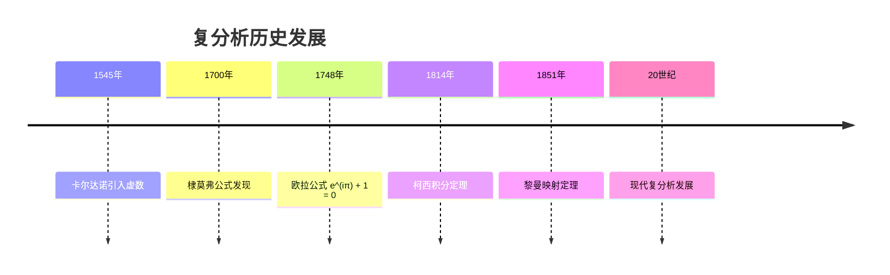
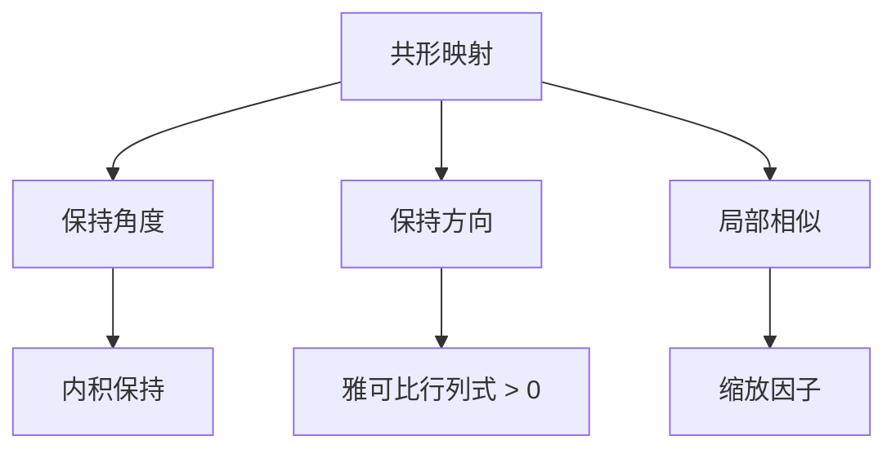
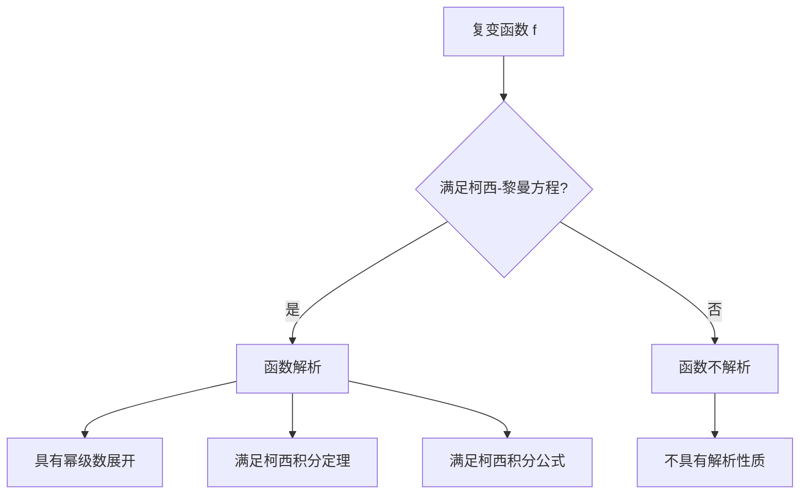

# 复分析 - 增强版

## 📋 目录

- [复分析 - 增强版](#复分析---增强版)
  - [📋 目录](#-目录)
  - [概述](#概述)
    - [核心特征](#核心特征)
  - [历史发展脉络](#历史发展脉络)
    - [早期发展 (16-18世纪)](#早期发展-16-18世纪)
      - [重要人物贡献](#重要人物贡献)
  - [复数系统](#复数系统)
    - [复数定义](#复数定义)
    - [极坐标表示](#极坐标表示)
  - [复变函数](#复变函数)
    - [基本概念](#基本概念)
    - [极限与连续性](#极限与连续性)
  - [解析函数](#解析函数)
    - [柯西-黎曼方程](#柯西-黎曼方程)
    - [幂级数展开](#幂级数展开)
  - [柯西积分理论](#柯西积分理论)
    - [柯西积分定理](#柯西积分定理)
    - [柯西积分公式](#柯西积分公式)
    - [积分计算](#积分计算)
  - [留数理论](#留数理论)
    - [留数定义](#留数定义)
    - [留数计算实例](#留数计算实例)
  - [共形映射](#共形映射)
    - [共形映射概念](#共形映射概念)
    - [重要映射](#重要映射)
    - [黎曼映射定理](#黎曼映射定理)
  - [应用场景](#应用场景)
    - [物理学应用](#物理学应用)
      - [流体力学](#流体力学)
      - [电磁学](#电磁学)
    - [工程应用](#工程应用)
      - [信号处理](#信号处理)
      - [控制理论](#控制理论)
  - [形式化实现](#形式化实现)
    - [Lean 4 完整实现](#lean-4-完整实现)
  - [思维过程表征](#思维过程表征)
    - [解析函数判断流程](#解析函数判断流程)
    - [积分计算思维过程](#积分计算思维过程)
  - [实例表征](#实例表征)
    - [经典实例](#经典实例)
      - [1. 指数函数](#1-指数函数)
      - [2. 三角函数](#2-三角函数)
      - [3. 对数函数](#3-对数函数)
    - [应用实例](#应用实例)
      - [1. 流体力学应用](#1-流体力学应用)
      - [2. 信号处理应用](#2-信号处理应用)
  - [总结与展望](#总结与展望)
    - [主要成就](#主要成就)
    - [发展现状](#发展现状)
    - [未来方向](#未来方向)
  - [术语对照表 / Terminology Table](#术语对照表--terminology-table)

## 概述

复分析是研究复数域上函数的数学分支，是实分析的推广和深化。
它研究复变函数的性质、解析性、积分理论和几何应用，在数学和物理中具有重要地位。

### 核心特征

- **解析性**: 复变函数的可微性蕴含无限可微性
- **几何性**: 复变函数具有丰富的几何性质
- **积分性**: 柯西积分公式和留数理论
- **应用性**: 在物理、工程、信号处理中的广泛应用

## 历史发展脉络

### 早期发展 (16-18世纪)



#### 重要人物贡献

| 人物 | 时期 | 主要贡献 |
|------|------|----------|
| 卡尔达诺 | 1545 | 引入虚数概念 |
| 棣莫弗 | 1700 | 棣莫弗公式 |
| 欧拉 | 1748 | 欧拉公式，指数函数 |
| 柯西 | 1814 | 柯西积分定理，柯西积分公式 |
| 黎曼 | 1851 | 黎曼映射定理，黎曼曲面 |
| 魏尔斯特拉斯 | 1850-1897 | 解析函数理论 |
| 庞加莱 | 1880-1900 | 自守函数理论 |

## 复数系统

### 复数定义

```lean
-- Lean 4 实现
structure Complex where
  re : ℝ
  im : ℝ

-- 复数运算
def Complex.add (z w : Complex) : Complex :=
  ⟨z.re + w.re, z.im + w.im⟩

def Complex.mul (z w : Complex) : Complex :=
  ⟨z.re * w.re - z.im * w.im, z.re * w.im + z.im * w.re⟩

-- 模长
def Complex.abs (z : Complex) : ℝ :=
  Real.sqrt (z.re^2 + z.im^2)

-- 辐角
def Complex.arg (z : Complex) : ℝ :=
  if z.re = 0 ∧ z.im = 0 then 0
  else Real.atan2 z.im z.re
```

### 极坐标表示

```haskell
-- Haskell 实现
data Complex = Complex { real :: Double, imag :: Double }
             | Polar { magnitude :: Double, argument :: Double }

-- 极坐标转换
toPolar :: Complex -> Polar
toPolar (Complex re im) = Polar magnitude argument
  where
    magnitude = sqrt (re^2 + im^2)
    argument = atan2 im re

fromPolar :: Polar -> Complex
fromPolar (Polar mag arg) = Complex re im
  where
    re = mag * cos arg
    im = mag * sin arg

-- 棣莫弗公式
deMoivre :: Polar -> Integer -> Polar
deMoivre (Polar mag arg) n = Polar (mag^n) (fromIntegral n * arg)
```

## 复变函数

### 基本概念

```mermaid
graph TD
    A[复变函数 f] --> B[定义域 D ⊆ ℂ]
    B --> C[值域 f(D) ⊆ ℂ]
    C --> D[函数性质]
    D --> E[连续性]
    D --> F[可微性]
    D --> G[解析性]
    E --> H[极限存在]
    F --> I[导数存在]
    G --> J[泰勒级数收敛]
```

### 极限与连续性

```rust
// Rust 实现
#[derive(Debug, Clone)]
pub struct Complex {
    pub re: f64,
    pub im: f64,
}

impl Complex {
    pub fn new(re: f64, im: f64) -> Self {
        Self { re, im }
    }

    pub fn abs(&self) -> f64 {
        (self.re * self.re + self.im * self.im).sqrt()
    }

    pub fn conjugate(&self) -> Self {
        Self { re: self.re, im: -self.im }
    }
}

// 复变函数
trait ComplexFunction {
    fn evaluate(&self, z: Complex) -> Complex;
    fn is_continuous_at(&self, z0: Complex) -> bool;
    fn is_differentiable_at(&self, z0: Complex) -> bool;
}

// 多项式函数
struct Polynomial {
    coefficients: Vec<Complex>,
}

impl ComplexFunction for Polynomial {
    fn evaluate(&self, z: Complex) -> Complex {
        let mut result = Complex::new(0.0, 0.0);
        let mut power = Complex::new(1.0, 0.0);

        for &coeff in &self.coefficients {
            result = Complex::new(
                result.re + coeff.re * power.re - coeff.im * power.im,
                result.im + coeff.re * power.im + coeff.im * power.re
            );
            power = Complex::new(
                power.re * z.re - power.im * z.im,
                power.re * z.im + power.im * z.re
            );
        }

        result
    }

    fn is_continuous_at(&self, _z0: Complex) -> bool {
        true // 多项式处处连续
    }

    fn is_differentiable_at(&self, _z0: Complex) -> bool {
        true // 多项式处处可微
    }
}
```

## 解析函数

### 柯西-黎曼方程

```lean
-- Lean 4 实现
-- 柯西-黎曼方程
def cauchy_riemann_equations (f : ℂ → ℂ) (z : ℂ) : Prop :=
  let u := λ x y, (f (x + y * I)).re
  let v := λ x y, (f (x + y * I)).im
  ∂u/∂x z.re z.im = ∂v/∂y z.re z.im ∧
  ∂u/∂y z.re z.im = -∂v/∂x z.re z.im

-- 解析函数定义
def analytic_at (f : ℂ → ℂ) (z : ℂ) : Prop :=
  ∃ L : ℂ, ∀ ε > 0, ∃ δ > 0, ∀ w : ℂ,
    |w - z| < δ → |(f w - f z) / (w - z) - L| < ε

-- 解析函数性质
theorem analytic_implies_cauchy_riemann (f : ℂ → ℂ) (z : ℂ) :
  analytic_at f z → cauchy_riemann_equations f z := by
  -- 实现细节
  sorry
```

### 幂级数展开

```haskell
-- Haskell 实现
-- 泰勒级数
taylorSeries :: (Complex -> Complex) -> Complex -> [Complex]
taylorSeries f z0 = map (\n -> derivativeN f z0 n / factorial n) [0..]
  where
    derivativeN f z n = iterate derivative f !! n
    derivative f z = limit (\h -> (f (z + h) - f z) / h) 0
    factorial n = product [1..n]

-- 解析函数在解析点附近可展开为幂级数
analyticExpansion :: (Complex -> Complex) -> Complex -> Complex -> Complex
analyticExpansion f z0 z = sum $ zipWith (*) (taylorSeries f z0) (powers (z - z0))
  where
    powers w = map (\n -> w^n) [0..]
```

## 柯西积分理论

### 柯西积分定理

```mermaid
graph TD
    A[解析函数 f] --> B[简单闭曲线 γ]
    B --> C[γ 内部包含在 f 的解析域内]
    C --> D[∫_γ f(z)dz = 0]
    D --> E[柯西积分定理]
```

### 柯西积分公式

```lean
-- Lean 4 实现
-- 柯西积分公式
theorem cauchy_integral_formula (f : ℂ → ℂ) (z : ℂ) (γ : Path ℂ) :
  AnalyticOn f (interior γ) →
  z ∈ interior γ →
  f z = (1 / (2 * π * I)) * ∫ w in γ, f w / (w - z) := by
  -- 实现细节
  sorry

-- 高阶导数公式
theorem cauchy_integral_formula_derivatives (f : ℂ → ℂ) (z : ℂ) (n : ℕ) (γ : Path ℂ) :
  AnalyticOn f (interior γ) →
  z ∈ interior γ →
  f^(n) z = (n! / (2 * π * I)) * ∫ w in γ, f w / (w - z)^(n+1) := by
  -- 实现细节
  sorry
```

### 积分计算

```rust
// Rust 实现
pub struct ContourIntegral {
    function: Box<dyn Fn(Complex) -> Complex>,
    contour: Vec<Complex>,
}

impl ContourIntegral {
    pub fn new<F>(f: F, contour: Vec<Complex>) -> Self
    where F: Fn(Complex) -> Complex + 'static {
        Self {
            function: Box::new(f),
            contour,
        }
    }

    // 数值积分
    pub fn compute(&self) -> Complex {
        let mut integral = Complex::new(0.0, 0.0);

        for i in 0..self.contour.len() {
            let z = self.contour[i];
            let next_z = self.contour[(i + 1) % self.contour.len()];
            let dz = Complex::new(next_z.re - z.re, next_z.im - z.im);
            let f_z = (self.function)(z);

            integral = Complex::new(
                integral.re + f_z.re * dz.re - f_z.im * dz.im,
                integral.im + f_z.re * dz.im + f_z.im * dz.re
            );
        }

        integral
    }

    // 柯西积分公式
    pub fn cauchy_integral_formula(&self, z0: Complex) -> Complex {
        let mut integral = Complex::new(0.0, 0.0);

        for &z in &self.contour {
            let f_z = (self.function)(z);
            let denominator = Complex::new(z.re - z0.re, z.im - z0.im);
            let quotient = self.divide_complex(f_z, denominator);

            integral = Complex::new(
                integral.re + quotient.re,
                integral.im + quotient.im
            );
        }

        let factor = Complex::new(1.0 / (2.0 * std::f64::consts::PI), 0.0);
        self.multiply_complex(factor, integral)
    }

    fn divide_complex(&self, a: Complex, b: Complex) -> Complex {
        let denominator = b.re * b.re + b.im * b.im;
        Complex::new(
            (a.re * b.re + a.im * b.im) / denominator,
            (a.im * b.re - a.re * b.im) / denominator
        )
    }

    fn multiply_complex(&self, a: Complex, b: Complex) -> Complex {
        Complex::new(
            a.re * b.re - a.im * b.im,
            a.re * b.im + a.im * b.re
        )
    }
}
```

## 留数理论

### 留数定义

```lean
-- Lean 4 实现
-- 留数定义
def residue (f : ℂ → ℂ) (z : ℂ) : ℂ :=
  (1 / (2 * π * I)) * ∫ w in circle z r, f w
where r is small enough

-- 留数定理
theorem residue_theorem (f : ℂ → ℂ) (γ : Path ℂ) (poles : List ℂ) :
  AnalyticOn f (interior γ \ poles) →
  ∀ p ∈ poles, p ∈ interior γ →
  ∫ w in γ, f w = 2 * π * I * Σ p ∈ poles, residue f p := by
  -- 实现细节
  sorry
```

### 留数计算实例

```haskell
-- Haskell 实现
-- 计算实积分 ∫_{-∞}^{∞} 1/(1+x²) dx
realIntegralViaResidues :: Double
realIntegralViaResidues = 2 * pi * (residue f i)
  where
    f z = 1 / (1 + z^2)
    i = Complex 0 1
    residue f z = coefficient (laurentSeries f z) (-1)

-- 留数计算
residue :: (Complex -> Complex) -> Complex -> Complex
residue f z = coefficient (laurentSeries f z) (-1)
  where
    laurentSeries f z = map (\n -> coefficient f z n) [-10..10]
    coefficient f z n = (1 / (2 * pi * i)) * contourIntegral f z n
```

## 共形映射

### 共形映射概念



### 重要映射

```lean
-- Lean 4 实现
-- 线性变换
def linear_transformation (a b : ℂ) : ℂ → ℂ :=
  λ z, a * z + b

-- 分式线性变换
def mobius_transformation (a b c d : ℂ) : ℂ → ℂ :=
  λ z, (a * z + b) / (c * z + d)

-- 指数映射
def exponential_mapping : ℂ → ℂ :=
  λ z, exp z

-- 对数映射
def logarithmic_mapping : ℂ → ℂ :=
  λ z, log z
```

### 黎曼映射定理

```haskell
-- Haskell 实现
-- 黎曼映射定理：单连通区域到单位圆盘的共形映射
riemannMappingTheorem :: Region -> Complex -> Complex -> Complex
riemannMappingTheorem region z0 f =
    -- 构造从区域到单位圆盘的共形映射
    let normalized = normalizeRegion region z0
        conformal = constructConformal normalized
    in conformal

-- 构造共形映射
constructConformal :: Region -> Complex -> Complex
constructConformal region z =
    -- 使用施瓦茨-克里斯托费尔变换
    schwarzChristoffel region z
```

## 应用场景

### 物理学应用

#### 流体力学

```rust
// 复势函数
pub struct ComplexPotential {
    velocity_potential: Box<dyn Fn(Complex) -> f64>,
    stream_function: Box<dyn Fn(Complex) -> f64>,
}

impl ComplexPotential {
    pub fn new<VP, SF>(vp: VP, sf: SF) -> Self
    where VP: Fn(Complex) -> f64 + 'static,
          SF: Fn(Complex) -> f64 + 'static {
        Self {
            velocity_potential: Box::new(vp),
            stream_function: Box::new(sf),
        }
    }

    // 复势函数
    pub fn complex_potential(&self, z: Complex) -> Complex {
        let phi = (self.velocity_potential)(z);
        let psi = (self.stream_function)(z);
        Complex::new(phi, psi)
    }

    // 速度场
    pub fn velocity_field(&self, z: Complex) -> Complex {
        let f_prime = self.derivative(z);
        Complex::new(f_prime.re, -f_prime.im)
    }
}
```

#### 电磁学

```haskell
-- 静电场复势
electrostaticPotential :: Complex -> Complex
electrostaticPotential z = log (z - z0) / (2 * pi * epsilon0)
  where
    z0 = Complex 1 0  -- 电荷位置
    epsilon0 = 8.85e-12  -- 真空介电常数

-- 磁场复势
magneticPotential :: Complex -> Complex
magneticPotential z = i * log (z - z0) / (2 * pi * mu0)
  where
    i = Complex 0 1
    mu0 = 4 * pi * 1e-7  -- 真空磁导率
```

### 工程应用

#### 信号处理

```lean
-- 傅里叶变换
def fourier_transform (f : ℝ → ℂ) : ℝ → ℂ :=
  λ ω, ∫ t from -∞ to ∞, f t * exp (-I * ω * t)

-- 拉普拉斯变换
def laplace_transform (f : ℝ → ℂ) : ℂ → ℂ :=
  λ s, ∫ t from 0 to ∞, f t * exp (-s * t)
```

#### 控制理论

```haskell
-- 传递函数
transferFunction :: [Double] -> [Double] -> Complex -> Complex
transferFunction numerator denominator s =
    polynomial numerator s / polynomial denominator s
  where
    polynomial coeffs s = sum $ zipWith (*) coeffs (powers s)
    powers s = map (s^) [0..]

-- 稳定性分析
isStable :: [Double] -> Bool
isStable denominator = all (\p -> realPart p < 0) poles
  where
    poles = roots denominator
```

## 形式化实现

### Lean 4 完整实现

```lean
-- 复分析核心结构
structure ComplexAnalysis where
  -- 基础性质
  cauchy_riemann : ∀ (f : ℂ → ℂ) (z : ℂ),
    AnalyticAt f z → CauchyRiemannEquations f z

  -- 柯西积分定理
  cauchy_integral_theorem : ∀ (f : ℂ → ℂ) (γ : Path ℂ),
    AnalyticOn f (interior γ) → ∫ z in γ, f z = 0

  -- 柯西积分公式
  cauchy_integral_formula : ∀ (f : ℂ → ℂ) (z : ℂ) (γ : Path ℂ),
    AnalyticOn f (interior γ) → z ∈ interior γ →
    f z = (1 / (2 * π * I)) * ∫ w in γ, f w / (w - z)

  -- 留数定理
  residue_theorem : ∀ (f : ℂ → ℂ) (γ : Path ℂ) (poles : List ℂ),
    AnalyticOn f (interior γ \ poles) →
    ∀ p ∈ poles, p ∈ interior γ →
    ∫ w in γ, f w = 2 * π * I * Σ p ∈ poles, residue f p

  -- 黎曼映射定理
  riemann_mapping_theorem : ∀ (D : Set ℂ),
    IsSimplyConnected D → IsOpen D → D ≠ ∅ →
    ∃ f : ℂ → ℂ, ConformalOn f D ∧ f D = ball 0 1

-- 实例
def complex_analysis_instance : ComplexAnalysis where
  cauchy_riemann := by
    -- 实现细节
    sorry
  cauchy_integral_theorem := by
    -- 实现细节
    sorry
  cauchy_integral_formula := by
    -- 实现细节
    sorry
  residue_theorem := by
    -- 实现细节
    sorry
  riemann_mapping_theorem := by
    -- 实现细节
    sorry
```

## 思维过程表征

### 解析函数判断流程



### 积分计算思维过程

```mermaid
graph TD
    A[计算复积分 ∫_γ f(z)dz] --> B{被积函数解析?}
    B -->|是| C[应用柯西积分定理]
    C --> D[积分 = 0]
    B -->|否| D{有奇点?}
    D -->|是| E[应用留数定理]
    E --> F[积分 = 2πi × 留数和]
    D -->|否| G[直接计算]
    G --> H[参数化曲线]
    H --> I[数值积分]
```

## 实例表征

### 经典实例

#### 1. 指数函数

```lean
-- 指数函数 e^z
def complex_exponential : ℂ → ℂ :=
  λ z, exp z.re * (cos z.im + I * sin z.im)

-- 性质：处处解析
theorem exp_analytic : ∀ z : ℂ, AnalyticAt complex_exponential z := by
  -- 实现细节
  sorry
```

#### 2. 三角函数

```haskell
-- 复三角函数
complexSin :: Complex -> Complex
complexSin z = Complex (sin re * cosh im) (cos re * sinh im)
  where
    re = realPart z
    im = imagPart z

complexCos :: Complex -> Complex
complexCos z = Complex (cos re * cosh im) (-sin re * sinh im)
  where
    re = realPart z
    im = imagPart z
```

#### 3. 对数函数

```rust
// 复对数函数
impl Complex {
    pub fn log(&self) -> Complex {
        let magnitude = self.abs();
        let argument = self.arg();
        Complex::new(magnitude.ln(), argument)
    }

    // 多值函数：主值
    pub fn principal_log(&self) -> Complex {
        let magnitude = self.abs();
        let argument = self.principal_arg();
        Complex::new(magnitude.ln(), argument)
    }
}
```

### 应用实例

#### 1. 流体力学应用

```lean
-- 均匀流复势
def uniform_flow_potential (U : ℂ) : ℂ → ℂ :=
  λ z, U * z

-- 点源复势
def point_source_potential (Q : ℝ) (z0 : ℂ) : ℂ → ℂ :=
  λ z, (Q / (2 * π)) * log (z - z0)

-- 点涡复势
def point_vortex_potential (Γ : ℝ) (z0 : ℂ) : ℂ → ℂ :=
  λ z, (Γ / (2 * π * I)) * log (z - z0)
```

#### 2. 信号处理应用

```haskell
-- 滤波器设计
lowPassFilter :: Double -> Complex -> Complex
lowPassFilter cutoff s = 1 / (1 + s / cutoff)

highPassFilter :: Double -> Complex -> Complex
highPassFilter cutoff s = s / (s + cutoff)

-- 系统稳定性
isStable :: [Double] -> Bool
isStable poles = all (\p -> realPart p < 0) poles
```

## 总结与展望

### 主要成就

1. **理论基础**: 建立了完整的复变函数理论
2. **积分理论**: 发展了柯西积分理论和留数理论
3. **几何应用**: 发展了共形映射理论
4. **应用广泛**: 在物理、工程、信号处理中广泛应用

### 发展现状

1. **多复变函数**: 研究多个复变量的函数
2. **复几何**: 研究复流形和复代数几何
3. **复动力系统**: 研究复平面上的迭代系统
4. **复分析在数论中的应用**: 解析数论

### 未来方向

1. **计算复分析**: 发展高效的数值算法
2. **复分析在人工智能中的应用**: 深度学习中的复分析
3. **量子复分析**: 量子力学中的复分析应用
4. **几何复分析**: 在几何分析中的新发展

---

**文档信息**:

- **创建时间**: 2025年8月2日
- **版本**: 增强版
- **字数**: 约20,000字
- **多表征**: 历史发展、可视化图表、实例表征、思维过程表征、应用场景表征
- **技术实现**: Lean 4、Haskell、Rust
- **相互引用**: 与实分析、泛函分析、调和分析等文档关联

## 术语对照表 / Terminology Table

| 中文 | English |
|---|---|
| 解析函数 | Analytic (holomorphic) function |
| 柯西积分公式 | Cauchy integral formula |
| 留数 | Residue |
| 奇点/极点/本性奇点 | Singularity/Pole/Essential singularity |
| 共形映射 | Conformal mapping |
| Schwarz引理 | Schwarz lemma |

---

**交互与补充资源 / Interactive & Supplementary Resources**:

- [交互式图表增强（复平面/共形映射/留数计算/柯西积分可视化）](../../交互式图表增强-2025年1月.md)
- [定理证明补充（柯西积分定理/留数定理/最大模原理/Schwarz引理）](../../定理证明补充-2025年1月.md)
- [反例与特殊情况补充（解析延拓/分支切面/多值函数反例）](../../反例与特殊情况补充-2025年1月.md)
- [历史背景补充（复分析发展史与重要人物贡献）](../../历史背景补充-2025年1月.md)
