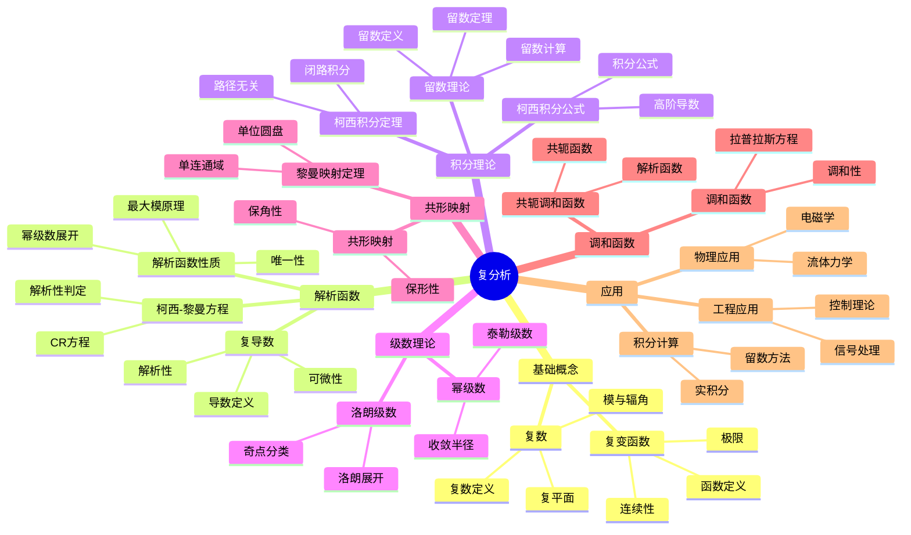

# 2. 复分析 / Complex Analysis

**主题编号**: B.03.02
**创建日期**: 2025年11月21日
**最后更新**: 2025年11月21日

---

## 📋 目录

- [2. 复分析 / Complex Analysis](#2-复分析--complex-analysis)
  - [📋 目录](#-目录)
  - [2.1 概述 / Overview (编号: B.03.02.01)](#21-概述--overview-编号-b030201)
  - [🗺️ 复分析核心概念思维导图](#️-复分析核心概念思维导图)
  - [📊 复分析核心概念多维知识矩阵](#-复分析核心概念多维知识矩阵)
  - [2.2 复变函数 / Complex Functions (编号: B.03.02.02)](#22-复变函数--complex-functions-编号-b030202)
    - [2.2.1 复数的基本概念 / Basic Concepts of Complex Numbers](#221-复数的基本概念--basic-concepts-of-complex-numbers)
    - [2.2.2 复变函数的定义 / Definition of Complex Function](#222-复变函数的定义--definition-of-complex-function)
    - [2.2.3 连续性 / Continuity](#223-连续性--continuity)
  - [2.3 解析函数 / Analytic Functions (编号: B.03.02.03)](#23-解析函数--analytic-functions-编号-b030203)
    - [2.3.1 复导数的定义 / Definition of Complex Derivative](#231-复导数的定义--definition-of-complex-derivative)
    - [2.3.2 柯西-黎曼方程 / Cauchy-Riemann Equations](#232-柯西-黎曼方程--cauchy-riemann-equations)
    - [2.3.3 解析函数的性质 / Properties of Analytic Functions](#233-解析函数的性质--properties-of-analytic-functions)
  - [2.4 柯西积分理论 / Cauchy Integral Theory (编号: B.03.02.04)](#24-柯西积分理论--cauchy-integral-theory-编号-b030204)
    - [2.4.1 柯西积分定理 / Cauchy Integral Theorem](#241-柯西积分定理--cauchy-integral-theorem)
    - [2.4.2 高阶导数公式 / Higher Derivative Formula](#242-高阶导数公式--higher-derivative-formula)
    - [2.4.3 刘维尔定理 / Liouville's Theorem](#243-刘维尔定理--liouvilles-theorem)
  - [2.5 留数理论 / Residue Theory (编号: B.03.02.05)](#25-留数理论--residue-theory-编号-b030205)
    - [2.5.1 留数的定义 / Definition of Residue](#251-留数的定义--definition-of-residue)
    - [2.5.2 留数定理 / Residue Theorem](#252-留数定理--residue-theorem)
    - [2.5.3 留数的计算 / Computation of Residues](#253-留数的计算--computation-of-residues)
  - [2.6 共形映射 / Conformal Mappings (编号: B.03.02.06)](#26-共形映射--conformal-mappings-编号-b030206)
    - [2.6.1 共形映射的定义 / Definition of Conformal Mapping](#261-共形映射的定义--definition-of-conformal-mapping)
    - [2.6.2 重要的共形映射 / Important Conformal Mappings](#262-重要的共形映射--important-conformal-mappings)
    - [2.6.3 黎曼映射定理 / Riemann Mapping Theorem](#263-黎曼映射定理--riemann-mapping-theorem)
  - [2.7 调和函数 / Harmonic Functions (编号: B.03.02.07)](#27-调和函数--harmonic-functions-编号-b030207)
    - [2.7.1 调和函数的定义 / Definition of Harmonic Function](#271-调和函数的定义--definition-of-harmonic-function)
    - [2.7.2 调和函数的性质 / Properties of Harmonic Functions](#272-调和函数的性质--properties-of-harmonic-functions)
  - [2.8 形式化实现 / Formal Implementation (编号: B.03.02.08)](#28-形式化实现--formal-implementation-编号-b030208)
    - [2.8.1 Lean 4 实现 / Lean 4 Implementation](#281-lean-4-实现--lean-4-implementation)
    - [2.8.2 Haskell 实现 / Haskell Implementation](#282-haskell-实现--haskell-implementation)
  - [2.9 应用实例 / Applications (编号: B.03.02.09)](#29-应用实例--applications-编号-b030209)
    - [2.9.1 积分计算 / Integral Computation](#291-积分计算--integral-computation)
    - [2.9.2 调和函数 / Harmonic Functions](#292-调和函数--harmonic-functions)
    - [2.9.3 共形映射 / Conformal Mappings](#293-共形映射--conformal-mappings)
  - [2.10 总结 / Summary](#210-总结--summary)
  - [参考文献 / References](#参考文献--references)
    - [经典教材 / Classic Textbooks](#经典教材--classic-textbooks)
    - [复分析教材 / Complex Analysis Textbooks](#复分析教材--complex-analysis-textbooks)
    - [高级复分析教材 / Advanced Complex Analysis Textbooks](#高级复分析教材--advanced-complex-analysis-textbooks)
    - [历史文献 / Historical Literature](#历史文献--historical-literature)
    - [中文教材 / Chinese Textbooks](#中文教材--chinese-textbooks)
    - [现代发展文献 / Modern Development Literature](#现代发展文献--modern-development-literature)
    - [在线资源 / Online Resources](#在线资源--online-resources)
  - [术语对照表 / Terminology Table](#术语对照表--terminology-table)

## 2.1 概述 / Overview (编号: B.03.02.01)

复分析是研究复变函数的数学分支，它将实分析的概念推广到复数域。复分析在数学物理、工程学、信号处理等领域有重要应用。复分析的核心是解析函数理论，包括柯西积分定理、留数理论等重要结果。

## 🗺️ 复分析核心概念思维导图



## 📊 复分析核心概念多维知识矩阵

| 概念类别 | 核心概念 | 定义要点 | 关键性质 | 典型例子 | 应用场景 |
|---------|---------|---------|---------|---------|---------|
| 基础概念 | 复数 | 实部+虚部 | 代数闭包 | z = x+iy | 数学基础 |
| 基础概念 | 复平面 | 复数几何表示 | 一一对应 | ℂ ≅ ℝ² | 几何直观 |
| 基础概念 | 复变函数 | ℂ→ℂ映射 | 实部虚部 | f(z) = z² | 函数研究 |
| 解析函数 | 复导数 | 极限定义 | 解析性 | f'(z) | 函数性质 |
| 解析函数 | 解析函数 | 复可微 | 幂级数展开 | e^z, sin(z) | 核心概念 |
| 解析函数 | 柯西-黎曼方程 | 实虚部关系 | 解析性判定 | u_x=v_y | 解析判定 |
| 积分理论 | 柯西积分定理 | 路径无关 | 解析函数 | ∫_γ f(z)dz=0 | 积分计算 |
| 积分理论 | 柯西积分公式 | 积分表示 | 解析函数 | f(a)=1/(2πi)∫ f(z)/(z-a)dz | 函数表示 |
| 积分理论 | 留数定理 | 留数和 | 积分计算 | ∫ f(z)dz = 2πiΣRes | 积分计算 |
| 级数理论 | 幂级数 | 解析函数展开 | 收敛半径 | e^z = Σzⁿ/n! | 函数表示 |
| 级数理论 | 洛朗级数 | 奇点展开 | 奇点分类 | 1/z的展开 | 奇点研究 |
| 共形映射 | 共形映射 | 保角映射 | 解析性 | 分式线性变换 | 几何应用 |
| 共形映射 | 黎曼映射定理 | 单连通域 | 单位圆盘 | 任意单连通域 | 几何应用 |
| 调和函数 | 调和函数 | 拉普拉斯方程 | 解析函数实部 | u(x,y) | 物理应用 |
| 应用 | 积分计算 | 留数方法 | 实积分 | ∫₀^∞ dx/(1+x²) | 实际应用 |

## 2.2 复变函数 / Complex Functions (编号: B.03.02.02)

### 2.2.1 复数的基本概念 / Basic Concepts of Complex Numbers

**定义 2.1** (复数 / Complex Number)
复数 $z$ 可以表示为：
$$z = x + iy$$
其中 $x, y \in \mathbb{R}$，$i$ 是虚数单位，满足 $i^2 = -1$。

**定义 2.2** (复数的模 / Modulus)
复数 $z = x + iy$ 的模定义为：
$$|z| = \sqrt{x^2 + y^2}$$

**定义 2.3** (复数的辐角 / Argument)
复数 $z = x + iy$ 的辐角定义为：
$$\arg(z) = \arctan\left(\frac{y}{x}\right)$$

### 2.2.2 复变函数的定义 / Definition of Complex Function

**定义 2.4** (复变函数 / Complex Function)
复变函数是从复数域到复数域的映射：
$$f : \mathbb{C} \rightarrow \mathbb{C}$$

**定义 2.5** (函数的极限 / Limit of Function)
设 $f$ 是复变函数，$z_0 \in \mathbb{C}$，如果对于任意 $\varepsilon > 0$，存在 $\delta > 0$ 使得：
$$0 < |z - z_0| < \delta \Rightarrow |f(z) - L| < \varepsilon$$

则称 $f(z)$ 在 $z_0$ 处的极限为 $L$，记作：
$$\lim_{z \rightarrow z_0} f(z) = L$$

### 2.2.3 连续性 / Continuity

**定义 2.6** (连续性 / Continuity)
复变函数 $f$ 在点 $z_0$ 连续，当且仅当：
$$\lim_{z \rightarrow z_0} f(z) = f(z_0)$$

**定理 2.1** (连续函数的性质)

1. 连续函数的和、差、积、商（分母不为零）是连续的
2. 连续函数的复合是连续的
3. 连续函数在有界闭集上达到最大值和最小值

## 2.3 解析函数 / Analytic Functions (编号: B.03.02.03)

### 2.3.1 复导数的定义 / Definition of Complex Derivative

**定义 2.7** (复导数 / Complex Derivative)
复变函数 $f$ 在点 $z_0$ 可导，当且仅当极限：
$$f'(z_0) = \lim_{h \rightarrow 0} \frac{f(z_0 + h) - f(z_0)}{h}$$

存在且有限。

**定义 2.8** (解析函数 / Analytic Function)
复变函数 $f$ 在点 $z_0$ 解析，当且仅当 $f$ 在 $z_0$ 的某个邻域内可导。

### 2.3.2 柯西-黎曼方程 / Cauchy-Riemann Equations

**定理 2.2** (柯西-黎曼方程 / Cauchy-Riemann Equations)
设 $f(z) = u(x, y) + iv(x, y)$ 在点 $z_0 = x_0 + iy_0$ 可导，则：
$$\frac{\partial u}{\partial x} = \frac{\partial v}{\partial y}, \quad \frac{\partial u}{\partial y} = -\frac{\partial v}{\partial x}$$

在点 $(x_0, y_0)$ 成立。

**定理 2.3** (柯西-黎曼方程的充分条件)
如果 $u$ 和 $v$ 在点 $(x_0, y_0)$ 连续可微，且满足柯西-黎曼方程，则 $f$ 在 $z_0 = x_0 + iy_0$ 可导。

### 2.3.3 解析函数的性质 / Properties of Analytic Functions

**定理 2.4** (解析函数的性质)

1. 解析函数的和、差、积、商（分母不为零）是解析的
2. 解析函数的复合是解析的
3. 解析函数的导数也是解析的

**定理 2.5** (解析函数的幂级数展开)
如果 $f$ 在点 $z_0$ 解析，则 $f$ 在 $z_0$ 的某个邻域内可以展开为幂级数：
$$f(z) = \sum_{n=0}^{\infty} a_n (z - z_0)^n$$

## 2.4 柯西积分理论 / Cauchy Integral Theory (编号: B.03.02.04)

### 2.4.1 柯西积分定理 / Cauchy Integral Theorem

**定理 2.6** (柯西积分定理 / Cauchy Integral Theorem)
设 $f$ 是单连通区域 $D$ 内的解析函数，$\gamma$ 是 $D$ 内的简单闭曲线，则：
$$\oint_{\gamma} f(z) dz = 0$$

**证明思路**:

1. 利用格林定理将复积分转化为实积分
2. 应用柯西-黎曼方程
3. 利用单连通性和解析性

**详细证明**:

- **步骤 1**: 将复积分写为实积分形式
  设 $f(z) = u(x, y) + iv(x, y)$，$dz = dx + idy$，则：
  $$\oint_{\gamma} f(z) dz = \oint_{\gamma} (u + iv)(dx + idy) = \oint_{\gamma} (udx - vdy) + i\oint_{\gamma} (vdx + udy)$$
- **步骤 2**: 应用格林定理
  由格林定理，对于单连通区域 $D$ 内的闭曲线 $\gamma$：
  $$\oint_{\gamma} (udx - vdy) = \iint_D \left(-\frac{\partial v}{\partial x} - \frac{\partial u}{\partial y}\right) dxdy$$
  $$\oint_{\gamma} (vdx + udy) = \iint_D \left(\frac{\partial u}{\partial x} - \frac{\partial v}{\partial y}\right) dxdy$$
- **步骤 3**: 应用柯西-黎曼方程
  由于 $f$ 在 $D$ 内解析，满足柯西-黎曼方程：
  $$\frac{\partial u}{\partial x} = \frac{\partial v}{\partial y}, \quad \frac{\partial u}{\partial y} = -\frac{\partial v}{\partial x}$$
- **步骤 4**: 导出结论
  将柯西-黎曼方程代入格林定理的结果，得到：
  $$\oint_{\gamma} (udx - vdy) = 0, \quad \oint_{\gamma} (vdx + udy) = 0$$
  因此 $\oint_{\gamma} f(z) dz = 0$

**定理 2.7** (柯西积分公式 / Cauchy Integral Formula)
设 $f$ 是单连通区域 $D$ 内的解析函数，$\gamma$ 是 $D$ 内的简单闭曲线，$z_0$ 是 $\gamma$ 内部的点，则：
$$f(z_0) = \frac{1}{2\pi i} \oint_{\gamma} \frac{f(z)}{z - z_0} dz$$

**证明思路**:

1. 构造辅助函数，应用柯西积分定理
2. 利用解析函数的连续性
3. 计算单位圆上的积分

**详细证明**:

- **步骤 1**: 构造辅助函数
  定义 $g(z) = \frac{f(z) - f(z_0)}{z - z_0}$，当 $z \neq z_0$ 时
  由于 $f$ 在 $z_0$ 解析，$g(z)$ 在 $z_0$ 的某个邻域内解析
- **步骤 2**: 应用柯西积分定理
  对于充分小的 $\varepsilon > 0$，设 $C_\varepsilon$ 是以 $z_0$ 为圆心、$\varepsilon$ 为半径的圆
  由柯西积分定理：
  $$\oint_{\gamma} \frac{f(z)}{z - z_0} dz = \oint_{C_\varepsilon} \frac{f(z)}{z - z_0} dz$$
- **步骤 3**: 计算圆周积分
  在 $C_\varepsilon$ 上，$z = z_0 + \varepsilon e^{i\theta}$，$dz = i\varepsilon e^{i\theta} d\theta$
  因此：
  $$\oint_{C_\varepsilon} \frac{f(z)}{z - z_0} dz = \int_0^{2\pi} \frac{f(z_0 + \varepsilon e^{i\theta})}{\varepsilon e^{i\theta}} \cdot i\varepsilon e^{i\theta} d\theta = i\int_0^{2\pi} f(z_0 + \varepsilon e^{i\theta}) d\theta$$
- **步骤 4**: 取极限
  当 $\varepsilon \to 0$ 时，由 $f$ 的连续性：
  $$\lim_{\varepsilon \to 0} i\int_0^{2\pi} f(z_0 + \varepsilon e^{i\theta}) d\theta = i\int_0^{2\pi} f(z_0) d\theta = 2\pi i f(z_0)$$
- **步骤 5**: 导出结论
  因此 $f(z_0) = \frac{1}{2\pi i} \oint_{\gamma} \frac{f(z)}{z - z_0} dz$

### 2.4.2 高阶导数公式 / Higher Derivative Formula

**定理 2.8** (高阶导数公式)
设 $f$ 是单连通区域 $D$ 内的解析函数，$\gamma$ 是 $D$ 内的简单闭曲线，$z_0$ 是 $\gamma$ 内部的点，则：
$$f^{(n)}(z_0) = \frac{n!}{2\pi i} \oint_{\gamma} \frac{f(z)}{(z - z_0)^{n+1}} dz$$

### 2.4.3 刘维尔定理 / Liouville's Theorem

**定理 2.9** (刘维尔定理 / Liouville's Theorem)
如果 $f$ 是整函数（在整个复平面上解析）且有界，则 $f$ 是常数。

**证明思路**:

1. 利用柯西积分公式和解析函数的性质
2. 证明导数恒为零
3. 导出函数为常数

**详细证明**:

- **步骤 1**: 应用柯西积分公式
  设 $f$ 有界，即存在 $M > 0$ 使得 $|f(z)| \leq M$ 对所有 $z \in \mathbb{C}$ 成立
  对于任意 $z_0 \in \mathbb{C}$ 和 $R > 0$，由柯西积分公式：
  $$f'(z_0) = \frac{1}{2\pi i} \oint_{|z-z_0|=R} \frac{f(z)}{(z - z_0)^2} dz$$
- **步骤 2**: 估计导数
  在圆周 $|z - z_0| = R$ 上，$|z - z_0| = R$，因此：
  $$|f'(z_0)| = \left|\frac{1}{2\pi i} \oint_{|z-z_0|=R} \frac{f(z)}{(z - z_0)^2} dz\right| \leq \frac{1}{2\pi} \cdot \frac{M}{R^2} \cdot 2\pi R = \frac{M}{R}$$
- **步骤 3**: 取极限
  由于 $R$ 可以任意大，令 $R \to \infty$，得到 $|f'(z_0)| = 0$
  因此 $f'(z_0) = 0$ 对所有 $z_0 \in \mathbb{C}$ 成立
- **步骤 4**: 导出结论
  由于 $f'$ 恒为零，$f$ 是常数

**推论 2.1** (代数基本定理 / Fundamental Theorem of Algebra)
每个非常数的复系数多项式都有至少一个复根。

**证明思路**:

使用反证法和刘维尔定理。

**详细证明**:

- 假设非常数多项式 $p(z)$ 没有复根，则 $f(z) = \frac{1}{p(z)}$ 是整函数
- 由于 $p(z)$ 非常数，当 $|z| \to \infty$ 时，$|p(z)| \to \infty$，因此 $|f(z)| \to 0$
- 因此 $f$ 有界，由刘维尔定理，$f$ 是常数
- 这与 $p$ 非常数矛盾，因此 $p$ 至少有一个复根

## 2.5 留数理论 / Residue Theory (编号: B.03.02.05)

### 2.5.1 留数的定义 / Definition of Residue

**定义 2.9** (孤立奇点 / Isolated Singularity)
点 $z_0$ 是函数 $f$ 的孤立奇点，当且仅当 $f$ 在 $z_0$ 的某个去心邻域内解析。

**定义 2.10** (留数 / Residue)
设 $z_0$ 是函数 $f$ 的孤立奇点，$f$ 在 $z_0$ 的洛朗展开为：
$$f(z) = \sum_{n=-\infty}^{\infty} a_n (z - z_0)^n$$

则 $a_{-1}$ 称为 $f$ 在 $z_0$ 的留数，记作 $\text{Res}(f, z_0)$。

### 2.5.2 留数定理 / Residue Theorem

**定理 2.10** (留数定理 / Residue Theorem)
设 $f$ 在简单闭曲线 $\gamma$ 内部除有限个孤立奇点 $z_1, z_2, \ldots, z_n$ 外解析，则：
$$\oint_{\gamma} f(z) dz = 2\pi i \sum_{k=1}^{n} \text{Res}(f, z_k)$$

**证明思路**:

1. 在每个奇点周围构造小圆
2. 应用柯西积分定理
3. 利用留数的定义

**详细证明**:

- **步骤 1**: 构造辅助曲线
  对于每个奇点 $z_k$，选择充分小的半径 $r_k$，使得以 $z_k$ 为圆心、$r_k$ 为半径的圆 $C_k$ 互不相交，且都在 $\gamma$ 内部
- **步骤 2**: 应用柯西积分定理
  设 $D$ 是由 $\gamma$ 和所有 $C_k$ 围成的区域，$f$ 在 $D$ 内解析
  由柯西积分定理的推广形式：
  $$\oint_{\gamma} f(z) dz = \sum_{k=1}^{n} \oint_{C_k} f(z) dz$$
- **步骤 3**: 计算每个奇点处的积分
  对于每个 $z_k$，$f$ 在 $z_k$ 的洛朗展开为：
  $$f(z) = \sum_{n=-\infty}^{\infty} a_n^{(k)} (z - z_k)^n$$
  其中 $a_{-1}^{(k)} = \text{Res}(f, z_k)$
- **步骤 4**: 逐项积分
  在 $C_k$ 上，$z = z_k + r_k e^{i\theta}$，$dz = ir_k e^{i\theta} d\theta$
  逐项积分得到：
  $$\oint_{C_k} f(z) dz = \sum_{n=-\infty}^{\infty} a_n^{(k)} \oint_{C_k} (z - z_k)^n dz$$
  当 $n \neq -1$ 时，$\oint_{C_k} (z - z_k)^n dz = 0$
  当 $n = -1$ 时，$\oint_{C_k} \frac{1}{z - z_k} dz = 2\pi i$
- **步骤 5**: 导出结论
  因此 $\oint_{C_k} f(z) dz = 2\pi i \cdot a_{-1}^{(k)} = 2\pi i \cdot \text{Res}(f, z_k)$
  所以 $\oint_{\gamma} f(z) dz = 2\pi i \sum_{k=1}^{n} \text{Res}(f, z_k)$

### 2.5.3 留数的计算 / Computation of Residues

**定理 2.11** (极点处的留数)
如果 $z_0$ 是 $f$ 的 $m$ 阶极点，则：
$$\text{Res}(f, z_0) = \frac{1}{(m-1)!} \lim_{z \rightarrow z_0} \frac{d^{m-1}}{dz^{m-1}} [(z - z_0)^m f(z)]$$

**定理 2.12** (本性奇点处的留数)
如果 $z_0$ 是 $f$ 的本性奇点，则留数可以通过洛朗展开直接计算。

## 2.6 共形映射 / Conformal Mappings (编号: B.03.02.06)

### 2.6.1 共形映射的定义 / Definition of Conformal Mapping

**定义 2.11** (共形映射 / Conformal Mapping)
解析函数 $f$ 在点 $z_0$ 处是共形的，当且仅当 $f'(z_0) \neq 0$。

**定义 2.12** (保角映射 / Angle-Preserving Mapping)
映射 $f$ 是保角的，当且仅当 $f$ 保持角度不变。

### 2.6.2 重要的共形映射 / Important Conformal Mappings

**例 2.1** (线性变换 / Linear Transformation)
$$f(z) = az + b$$
其中 $a, b \in \mathbb{C}$，$a \neq 0$。

**例 2.2** (反演变换 / Inversion)
$$f(z) = \frac{1}{z}$$

**例 2.3** (幂函数 / Power Function)
$$f(z) = z^n$$
其中 $n$ 是正整数。

**例 2.4** (指数函数 / Exponential Function)
$$f(z) = e^z$$

**例 2.5** (对数函数 / Logarithmic Function)
$$f(z) = \ln z$$

### 2.6.3 黎曼映射定理 / Riemann Mapping Theorem

**定理 2.13** (黎曼映射定理 / Riemann Mapping Theorem)
设 $D$ 是复平面上的单连通开集，且 $D \neq \mathbb{C}$，则存在从 $D$ 到单位圆盘的共形双射。

**证明思路**:

1. 构造满足条件的函数族
2. 证明存在性（使用紧性论证）
3. 证明唯一性（在规范化条件下）

**详细证明**:

- **步骤 1**: 规范化条件
  固定 $z_0 \in D$，要求 $f(z_0) = 0$ 且 $f'(z_0) > 0$
  这样的规范化条件保证了唯一性
- **步骤 2**: 构造函数族
  考虑所有满足以下条件的单叶解析函数 $f: D \to \mathbb{D}$（单位圆盘）：
  - $f(z_0) = 0$
  - $f'(z_0) > 0$
  - $f(D) \subset \mathbb{D}$
- **步骤 3**: 证明函数族非空
  由于 $D \neq \mathbb{C}$，存在 $a \notin D$
  函数 $g(z) = \sqrt{z - a}$ 在 $D$ 上单值（因为 $D$ 单连通）
  通过适当的线性变换，可以构造满足条件的函数
- **步骤 4**: 最大化导数
  设 $M = \sup\{f'(z_0) : f \text{ 满足条件}\}$
  可以证明 $M < \infty$ 且存在函数 $f_0$ 使得 $f_0'(z_0) = M$
- **步骤 5**: 证明 $f_0$ 是满射
  如果 $f_0(D) \neq \mathbb{D}$，存在 $w_0 \in \mathbb{D} \setminus f_0(D)$
  可以构造新的函数 $g$ 使得 $g'(z_0) > f_0'(z_0)$，这与 $f_0$ 的最大性矛盾
  因此 $f_0(D) = \mathbb{D}$，$f_0$ 是共形双射

## 2.7 调和函数 / Harmonic Functions (编号: B.03.02.07)

### 2.7.1 调和函数的定义 / Definition of Harmonic Function

**定义 2.13** (调和函数 / Harmonic Function)
实值函数 $u(x, y)$ 是调和的，当且仅当：
$$\frac{\partial^2 u}{\partial x^2} + \frac{\partial^2 u}{\partial y^2} = 0$$

**定理 2.14** (调和函数与解析函数的关系)
如果 $f = u + iv$ 是解析函数，则 $u$ 和 $v$ 都是调和函数。

### 2.7.2 调和函数的性质 / Properties of Harmonic Functions

**定理 2.15** (平均值性质 / Mean Value Property)
如果 $u$ 是调和函数，则对于任意圆盘 $D$，$u$ 在圆心处的值等于 $u$ 在圆周上的平均值。

**定理 2.16** (最大值原理 / Maximum Principle)
如果 $u$ 是有界区域 $D$ 内的调和函数，则 $u$ 的最大值在 $D$ 的边界上达到。

## 2.8 形式化实现 / Formal Implementation (编号: B.03.02.08)

### 2.8.1 Lean 4 实现 / Lean 4 Implementation

```lean
-- 复数的基本定义
structure Complex where
  re : ℝ
  im : ℝ

-- 复数的运算
def Complex.add (z w : Complex) : Complex :=
  ⟨z.re + w.re, z.im + w.im⟩

def Complex.mul (z w : Complex) : Complex :=
  ⟨z.re * w.re - z.im * w.im, z.re * w.im + z.im * w.re⟩

def Complex.norm (z : Complex) : ℝ :=
  Real.sqrt (z.re^2 + z.im^2)

-- 复变函数
def ComplexFunction := Complex → Complex

-- 复导数
def complex_derivative (f : ComplexFunction) (z : Complex) : Complex :=
  -- 这里需要实现极限计算
  sorry

-- 解析函数
class AnalyticFunction (f : ComplexFunction) where
  differentiable : ∀ z, ∃ f' : Complex, complex_derivative f z = f'

-- 柯西-黎曼方程
def cauchy_riemann_equations (f : ComplexFunction) (z : Complex) : Prop :=
  let u := λ x y => (f ⟨x, y⟩).re
  let v := λ x y => (f ⟨x, y⟩).im
  ∂u/∂x z.re z.im = ∂v/∂y z.re z.im ∧
  ∂u/∂y z.re z.im = -∂v/∂x z.re z.im

-- 留数
def residue (f : ComplexFunction) (z : Complex) : Complex :=
  -- 通过洛朗展开计算留数
  sorry

-- 柯西积分定理
theorem cauchy_integral_theorem (f : ComplexFunction) [AnalyticFunction f]
  (γ : Path Complex) (hγ : γ.is_simple_closed) :
  ∮ f(z) dz = 0 :=
  sorry

-- 柯西积分公式
theorem cauchy_integral_formula (f : ComplexFunction) [AnalyticFunction f]
  (γ : Path Complex) (z₀ : Complex) (h : z₀ ∈ interior γ) :
  f z₀ = (1 / (2 * π * i)) * ∮ f(z) / (z - z₀) dz :=
  sorry
```

### 2.8.2 Haskell 实现 / Haskell Implementation

```haskell
-- 复数的基本定义
data Complex = Complex { re :: Double, im :: Double } deriving (Eq, Show)

-- 复数的运算
instance Num Complex where
  (+) (Complex a b) (Complex c d) = Complex (a + c) (b + d)
  (*) (Complex a b) (Complex c d) = Complex (a*c - b*d) (a*d + b*c)
  abs z = Complex (magnitude z) 0
  signum z = Complex (cos (phase z)) (sin (phase z))
  fromInteger n = Complex (fromInteger n) 0
  negate (Complex a b) = Complex (-a) (-b)

-- 复数的模和辐角
magnitude :: Complex -> Double
magnitude (Complex a b) = sqrt (a*a + b*b)

phase :: Complex -> Double
phase (Complex a b) = atan2 b a

-- 复变函数
type ComplexFunction = Complex -> Complex

-- 复导数（数值方法）
complexDerivative :: ComplexFunction -> Complex -> Complex
complexDerivative f z =
  let h = 1e-10 :: Double
      dz = Complex h 0
  in (f (z + dz) - f z) / dz

-- 解析函数
class AnalyticFunction f where
  isAnalytic :: f -> Complex -> Bool
  derivative :: f -> Complex -> Complex

-- 柯西-黎曼方程
cauchyRiemann :: ComplexFunction -> Complex -> Bool
cauchyRiemann f z =
  let u x y = re (f (Complex x y))
      v x y = im (f (Complex x y))
      -- 这里需要数值微分
      ux = partialDerivative u 0 z
      uy = partialDerivative u 1 z
      vx = partialDerivative v 0 z
      vy = partialDerivative v 1 z
  in abs (ux - vy) < 1e-10 && abs (uy + vx) < 1e-10

-- 留数计算
residue :: ComplexFunction -> Complex -> Complex
residue f z =
  let r = 0.1 :: Double
      circle = [z + Complex (r * cos t) (r * sin t) | t <- [0, 0.1..2*pi]]
      integral = sum [f z' / (z' - z) | z' <- circle] / fromIntegral (length circle)
  in integral * Complex 0 (2 * pi)

-- 柯西积分定理
cauchyIntegralTheorem :: ComplexFunction -> [Complex] -> Complex
cauchyIntegralTheorem f path =
  let segments = zip path (tail path ++ [head path])
      lineIntegral = sum [f z * (z' - z) | (z, z') <- segments]
  in lineIntegral

-- 柯西积分公式
cauchyIntegralFormula :: ComplexFunction -> Complex -> [Complex] -> Complex
cauchyIntegralFormula f z₀ path =
  let integrand z = f z / (z - z₀)
      integral = cauchyIntegralTheorem integrand path
  in integral / (Complex 0 (2 * pi))
```

## 2.9 应用实例 / Applications (编号: B.03.02.09)

### 2.9.1 积分计算 / Integral Computation

**例 2.6** (有理函数积分)
计算积分：
$$\int_{-\infty}^{\infty} \frac{1}{1 + x^4} dx$$

**解**：
考虑函数 $f(z) = \frac{1}{1 + z^4}$，它在复平面上有四个极点：
$$z_k = e^{i\pi(2k+1)/4}, \quad k = 0, 1, 2, 3$$

在上半平面的极点是 $z_0 = e^{i\pi/4}$ 和 $z_1 = e^{i3\pi/4}$。

计算留数：
$$\text{Res}(f, z_0) = \frac{1}{4z_0^3} = \frac{1}{4} e^{-i3\pi/4}$$
$$\text{Res}(f, z_1) = \frac{1}{4z_1^3} = \frac{1}{4} e^{-i9\pi/4}$$

由留数定理：
$$\int_{-\infty}^{\infty} \frac{1}{1 + x^4} dx = 2\pi i \left(\text{Res}(f, z_0) + \text{Res}(f, z_1)\right) = \frac{\pi}{\sqrt{2}}$$

### 2.9.2 调和函数 / Harmonic Functions

**例 2.7** (拉普拉斯方程)
求解拉普拉斯方程：
$$\frac{\partial^2 u}{\partial x^2} + \frac{\partial^2 u}{\partial y^2} = 0$$

在单位圆盘 $D = \{z : |z| < 1\}$ 上，边界条件：
$$u(e^{i\theta}) = \cos\theta$$

**解**：
使用解析函数 $f(z) = z$，其实部 $u(x, y) = x$ 是调和函数，满足边界条件。

### 2.9.3 共形映射 / Conformal Mappings

**例 2.8** (上半平面到单位圆盘的映射)
构造从上半平面 $\{z : \text{Im}(z) > 0\}$ 到单位圆盘 $\{w : |w| < 1\}$ 的共形映射。

**解**：
使用分式线性变换：
$$w = \frac{z - i}{z + i}$$

这个映射将上半平面映射到单位圆盘，将实轴映射到单位圆周。

## 2.10 总结 / Summary

复分析为现代数学提供了重要的工具：

1. **解析函数理论**：为函数论提供了基础
2. **柯西积分理论**：为积分计算提供了强大工具
3. **留数理论**：为复杂积分的计算提供了方法
4. **共形映射**：为几何变换提供了理论
5. **调和函数**：为偏微分方程提供了解

这些概念在数学物理、工程学、信号处理等领域都有广泛应用，为现代数学提供了重要的工具和语言。

---

## 参考文献 / References

### 经典教材 / Classic Textbooks

- Ahlfors, L. V. Complex Analysis[M]. 3rd Edition. New York: McGraw-Hill, 1979.
- Conway, J. B. Functions of One Complex Variable[M]. 2nd Edition. New York: Springer-Verlag, 1978.
- Rudin, W. Real and Complex Analysis[M]. 3rd Edition. New York: McGraw-Hill, 1987.

### 复分析教材 / Complex Analysis Textbooks

- Stein, E. M., Shakarchi, R. Complex Analysis[M]. Princeton: Princeton University Press, 2003.
- Lang, S. Complex Analysis[M]. 4th Edition. New York: Springer-Verlag, 1999.
- Remmert, R. Theory of Complex Functions[M]. New York: Springer-Verlag, 1991.

### 高级复分析教材 / Advanced Complex Analysis Textbooks

- Hormander, L. An Introduction to Complex Analysis in Several Variables[M]. 3rd Edition. Princeton: Princeton University Press, 1990.
- Forster, O. Lectures on Riemann Surfaces[M]. New York: Springer-Verlag, 1981.
- Ahlfors, L. V., Sario, L. Riemann Surfaces[M]. Princeton: Princeton University Press, 1960.

### 历史文献 / Historical Literature

- Cauchy, A.-L. Mémoire sur les intégrales définies[J]. Mémoires de l'Académie des sciences, 1814, 1: 319-506.
- Riemann, B. Grundlagen für eine allgemeine Theorie der Functionen einer veränderlichen complexen Grösse[J]. Göttingen: Dieterich, 1851.
- Weierstrass, K. Zur Theorie der eindeutigen analytischen Functionen[J]. Mathematische Annalen, 1876, 11(1): 1-60.

### 中文教材 / Chinese Textbooks

- 钟玉泉. 复变函数论[M]. 第3版. 北京: 高等教育出版社, 2004.
- 余家荣. 复变函数[M]. 第4版. 北京: 高等教育出版社, 2007.
- 方企勤. 复变函数教程[M]. 北京: 北京大学出版社, 1996.

### 现代发展文献 / Modern Development Literature

- Fornaess, J. E. Dynamics in Several Complex Variables[M]. Providence: American Mathematical Society, 1996.
- Demailly, J.-P. Complex Analytic and Differential Geometry[M]. Grenoble: Institut Fourier, 2012.

### 在线资源 / Online Resources

- Wikipedia: [Complex analysis](https://en.wikipedia.org/wiki/Complex_analysis)
- Wikipedia: [Cauchy's integral theorem](https://en.wikipedia.org/wiki/Cauchy%27s_integral_theorem)
- MIT OpenCourseWare: [18.04 Complex Variables](https://ocw.mit.edu/courses/18-04-complex-variables-with-applications-fall-1999/)

## 术语对照表 / Terminology Table

| 中文 | English |
|---|---|
| 解析函数 | Analytic (holomorphic) function |
| 柯西积分公式 | Cauchy integral formula |
| 留数 | Residue |
| 奇点/极点 | Singularity/Pole |
| 共形映射 | Conformal mapping |
| 调和函数 | Harmonic function |
| 分式线性变换 | Möbius (fractional linear) transformation |

---

**交互与补充资源 / Interactive & Supplementary Resources**:

- [交互式图表增强（复平面/共形映射/留数计算）](../../交互式图表增强-2025年1月.md)
- [定理证明补充（柯西积分定理/留数定理）](../../定理证明补充-2025年1月.md)
- [反例与特殊情况补充（解析延拓/分支切面等）](../../反例与特殊情况补充-2025年1月.md)
- [历史背景补充（复分析发展）](../../历史背景补充-2025年1月.md)
