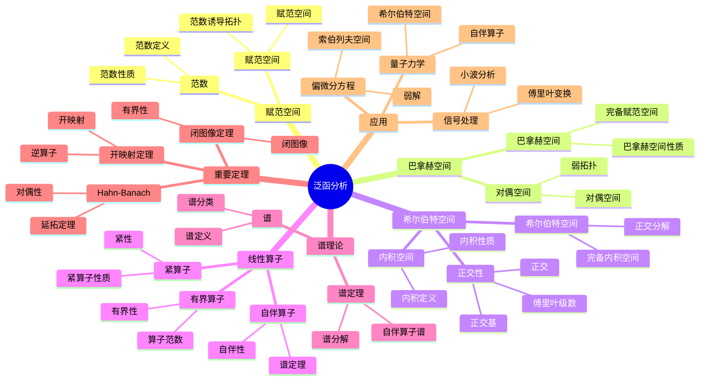

# 3. 泛函分析 / Functional Analysis

**主题编号**: B.03.03
**创建日期**: 2025年11月21日
**最后更新**: 2025年11月21日

---

## 📋 目录

- [3. 泛函分析 / Functional Analysis](#3-泛函分析--functional-analysis)
  - [📋 目录](#-目录)
  - [3.1 概述 / Overview](#31-概述--overview)
  - [3.2 赋范空间 / Normed Spaces](#32-赋范空间--normed-spaces)
    - [3.2.1 范数的定义 / Definition of Norm](#321-范数的定义--definition-of-norm)
    - [3.2.2 重要的赋范空间 / Important Normed Spaces](#322-重要的赋范空间--important-normed-spaces)
    - [3.2.3 完备性 / Completeness](#323-完备性--completeness)
  - [3.3 巴拿赫空间 / Banach Spaces](#33-巴拿赫空间--banach-spaces)
    - [3.3.1 巴拿赫空间的定义 / Definition of Banach Space](#331-巴拿赫空间的定义--definition-of-banach-space)
    - [3.3.2 重要的巴拿赫空间 / Important Banach Spaces](#332-重要的巴拿赫空间--important-banach-spaces)
    - [3.3.3 对偶空间 / Dual Space](#333-对偶空间--dual-space)
  - [3.4 希尔伯特空间 / Hilbert Spaces](#34-希尔伯特空间--hilbert-spaces)
    - [3.4.1 内积空间 / Inner Product Spaces](#341-内积空间--inner-product-spaces)
    - [3.4.2 希尔伯特空间的定义 / Definition of Hilbert Space](#342-希尔伯特空间的定义--definition-of-hilbert-space)
    - [3.4.3 重要的希尔伯特空间 / Important Hilbert Spaces](#343-重要的希尔伯特空间--important-hilbert-spaces)
    - [3.4.4 正交性 / Orthogonality](#344-正交性--orthogonality)
  - [3.5 线性算子 / Linear Operators](#35-线性算子--linear-operators)
    - [3.5.1 算子的定义 / Definition of Operator](#351-算子的定义--definition-of-operator)
    - [3.5.2 算子空间 / Operator Spaces](#352-算子空间--operator-spaces)
    - [3.5.3 紧算子 / Compact Operators](#353-紧算子--compact-operators)
  - [3.6 谱理论 / Spectral Theory](#36-谱理论--spectral-theory)
    - [3.6.1 谱的定义 / Definition of Spectrum](#361-谱的定义--definition-of-spectrum)
    - [3.6.2 自伴算子 / Self-Adjoint Operators](#362-自伴算子--self-adjoint-operators)
    - [3.6.3 酉算子 / Unitary Operators](#363-酉算子--unitary-operators)
    - [3.6.4 谱定理 / Spectral Theorem](#364-谱定理--spectral-theorem)
    - [3.6.5 Hahn-Banach定理 / Hahn-Banach Theorem](#365-hahn-banach定理--hahn-banach-theorem)
    - [3.6.6 开映射定理 / Open Mapping Theorem](#366-开映射定理--open-mapping-theorem)
    - [3.6.7 闭图像定理 / Closed Graph Theorem](#367-闭图像定理--closed-graph-theorem)
  - [3.7 弱拓扑 / Weak Topology](#37-弱拓扑--weak-topology)
    - [3.7.1 弱收敛 / Weak Convergence](#371-弱收敛--weak-convergence)
    - [3.7.2 弱紧性 / Weak Compactness](#372-弱紧性--weak-compactness)
  - [3.8 形式化实现 / Formal Implementation](#38-形式化实现--formal-implementation)
    - [3.8.1 Lean 4 实现 / Lean 4 Implementation](#381-lean-4-实现--lean-4-implementation)
    - [3.8.2 Haskell 实现 / Haskell Implementation](#382-haskell-实现--haskell-implementation)
  - [3.9 应用实例 / Applications](#39-应用实例--applications)
    - [3.9.1 量子力学 / Quantum Mechanics](#391-量子力学--quantum-mechanics)
    - [3.9.2 偏微分方程 / Partial Differential Equations](#392-偏微分方程--partial-differential-equations)
    - [3.9.3 信号处理 / Signal Processing](#393-信号处理--signal-processing)
  - [3.10 总结 / Summary](#310-总结--summary)
  - [参考文献 / References](#参考文献--references)
    - [经典教材 / Classic Textbooks](#经典教材--classic-textbooks)
    - [泛函分析教材 / Functional Analysis Textbooks](#泛函分析教材--functional-analysis-textbooks)
    - [高级泛函分析教材 / Advanced Functional Analysis Textbooks](#高级泛函分析教材--advanced-functional-analysis-textbooks)
    - [历史文献 / Historical Literature](#历史文献--historical-literature)
    - [中文教材 / Chinese Textbooks](#中文教材--chinese-textbooks)
    - [现代发展文献 / Modern Development Literature](#现代发展文献--modern-development-literature)
    - [在线资源 / Online Resources](#在线资源--online-resources)
  - [术语对照表 / Terminology Table](#术语对照表--terminology-table)

## 3.1 概述 / Overview (编号: B.03.03.01)

泛函分析是研究无限维向量空间上的分析学的数学分支，它将有限维线性代数的概念推广到无限维空间。
泛函分析在量子力学、偏微分方程、信号处理等领域有重要应用。
泛函分析的核心是研究巴拿赫空间、希尔伯特空间和线性算子。

## 🗺️ 泛函分析核心概念思维导图



## 📊 泛函分析核心概念多维知识矩阵

| 概念类别 | 核心概念 | 定义要点 | 关键性质 | 典型例子 | 应用场景 |
|---------|---------|---------|---------|---------|---------|
| 赋范空间 | 范数 | 向量长度 | 正定齐次三角不等式 | \|x\| | 分析基础 |
| 赋范空间 | 赋范空间 | 装备范数的空间 | 度量拓扑 | (X,\|\|·\|\|) | 分析基础 |
| 巴拿赫空间 | 巴拿赫空间 | 完备赋范空间 | 闭图像定理 | L^p, C[0,1] | 分析学 |
| 巴拿赫空间 | 对偶空间 | 有界线性泛函 | 对偶性 | X* | 对偶理论 |
| 希尔伯特空间 | 内积空间 | 内积定义 | 正交性 | (·,·) | 几何结构 |
| 希尔伯特空间 | 希尔伯特空间 | 完备内积空间 | 正交分解 | L^2, ℓ^2 | 分析学 |
| 希尔伯特空间 | 正交性 | 内积为零 | 正交基 | 正交系统 | 函数展开 |
| 线性算子 | 有界算子 | 有界线性映射 | 算子范数 | T: X→Y | 算子理论 |
| 线性算子 | 紧算子 | 紧性 | 有限秩逼近 | 紧算子 | 算子理论 |
| 线性算子 | 自伴算子 | 自伴性 | 谱定理 | 自伴算子 | 量子力学 |
| 谱理论 | 谱 | 算子特征值 | 谱分类 | σ(T) | 算子研究 |
| 谱理论 | 谱定理 | 自伴算子分解 | 谱分解 | 谱定理 | 量子力学 |
| 重要定理 | Hahn-Banach | 延拓定理 | 对偶性 | 延拓定理 | 对偶理论 |
| 重要定理 | 开映射定理 | 开映射 | 逆算子 | 开映射 | 算子理论 |
| 应用 | 量子力学 | 希尔伯特空间 | 自伴算子 | 量子态 | 物理 |
| 应用 | 偏微分方程 | 索伯列夫空间 | 弱解 | PDE | 数学物理 |

## 3.2 赋范空间 / Normed Spaces (编号: B.03.03.02)

### 3.2.1 范数的定义 / Definition of Norm

**定义 3.1** (范数 / Norm)
设 $X$ 是域 $\mathbb{K}$（$\mathbb{R}$ 或 $\mathbb{C}$）上的向量空间，映射 $\|\cdot\| : X \rightarrow \mathbb{R}$ 是范数，当且仅当：

1. **正定性**：$\|x\| \geq 0$，且 $\|x\| = 0$ 当且仅当 $x = 0$
2. **齐次性**：$\|\alpha x\| = |\alpha| \|x\|$
3. **三角不等式**：$\|x + y\| \leq \|x\| + \|y\|$

**定义 3.2** (赋范空间 / Normed Space)
装备了范数的向量空间称为赋范空间。

### 3.2.2 重要的赋范空间 / Important Normed Spaces

**例 3.1** ($\ell^p$ 空间 / $\ell^p$ Space)
对于 $1 \leq p < \infty$，$\ell^p$ 空间定义为：
$$\ell^p = \left\{x = (x_n) : \sum_{n=1}^{\infty} |x_n|^p < \infty\right\}$$

范数定义为：
$$\|x\|_p = \left(\sum_{n=1}^{\infty} |x_n|^p\right)^{1/p}$$

**例 3.2** ($L^p$ 空间 / $L^p$ Space)
对于 $1 \leq p < \infty$，$L^p(\Omega)$ 空间定义为：
$$L^p(\Omega) = \left\{f : \int_{\Omega} |f(x)|^p dx < \infty\right\}$$

范数定义为：
$$\|f\|_p = \left(\int_{\Omega} |f(x)|^p dx\right)^{1/p}$$

**例 3.3** ($C[a, b]$ 空间 / $C[a, b]$ Space)
连续函数空间 $C[a, b]$ 的范数定义为：
$$\|f\|_{\infty} = \sup_{x \in [a, b]} |f(x)|$$

### 3.2.3 完备性 / Completeness

**定义 3.3** (柯西序列 / Cauchy Sequence)
序列 $(x_n)$ 是柯西序列，当且仅当：
$$\forall \varepsilon > 0, \exists N \in \mathbb{N}, \forall m, n \geq N, \|x_m - x_n\| < \varepsilon$$

**定义 3.4** (完备空间 / Complete Space)
赋范空间 $X$ 是完备的，当且仅当每个柯西序列都收敛到 $X$ 中的某个元素。

## 3.3 巴拿赫空间 / Banach Spaces (编号: B.03.03.03)

### 3.3.1 巴拿赫空间的定义 / Definition of Banach Space

**定义 3.5** (巴拿赫空间 / Banach Space)
完备的赋范空间称为巴拿赫空间。

**定理 3.1** (巴拿赫空间的性质)

1. 巴拿赫空间的闭子空间是巴拿赫空间
2. 巴拿赫空间的有限直和是巴拿赫空间
3. 巴拿赫空间的商空间是巴拿赫空间

### 3.3.2 重要的巴拿赫空间 / Important Banach Spaces

**定理 3.2** ($\ell^p$ 空间的完备性)
对于 $1 \leq p \leq \infty$，$\ell^p$ 是巴拿赫空间。

**定理 3.3** ($L^p$ 空间的完备性)
对于 $1 \leq p \leq \infty$，$L^p(\Omega)$ 是巴拿赫空间。

**定理 3.4** ($C[a, b]$ 空间的完备性)
$C[a, b]$ 是巴拿赫空间。

### 3.3.3 对偶空间 / Dual Space

**定义 3.6** (连续线性泛函 / Continuous Linear Functional)
从赋范空间 $X$ 到标量域 $\mathbb{K}$ 的连续线性映射称为连续线性泛函。

**定义 3.7** (对偶空间 / Dual Space)
赋范空间 $X$ 的对偶空间 $X^*$ 是所有连续线性泛函的集合：
$$X^* = \mathcal{L}(X, \mathbb{K})$$

**定理 3.5** (对偶空间的性质)

1. $X^*$ 是巴拿赫空间
2. 对于 $f \in X^*$，$\|f\| = \sup_{\|x\| = 1} |f(x)|$

## 3.4 希尔伯特空间 / Hilbert Spaces (编号: B.03.03.04)

### 3.4.1 内积空间 / Inner Product Spaces

**定义 3.8** (内积 / Inner Product)
设 $H$ 是域 $\mathbb{K}$ 上的向量空间，映射 $\langle \cdot, \cdot \rangle : H \times H \rightarrow \mathbb{K}$ 是内积，当且仅当：

1. **共轭对称性**：$\langle x, y \rangle = \overline{\langle y, x \rangle}$
2. **线性性**：$\langle \alpha x + \beta y, z \rangle = \alpha \langle x, z \rangle + \beta \langle y, z \rangle$
3. **正定性**：$\langle x, x \rangle \geq 0$，且 $\langle x, x \rangle = 0$ 当且仅当 $x = 0$

**定义 3.9** (内积空间 / Inner Product Space)
装备了内积的向量空间称为内积空间。

### 3.4.2 希尔伯特空间的定义 / Definition of Hilbert Space

**定义 3.10** (希尔伯特空间 / Hilbert Space)
完备的内积空间称为希尔伯特空间。

**定理 3.6** (内积诱导的范数)
内积空间上的范数定义为：
$$\|x\| = \sqrt{\langle x, x \rangle}$$

### 3.4.3 重要的希尔伯特空间 / Important Hilbert Spaces

**例 3.4** ($\ell^2$ 空间 / $\ell^2$ Space)
$\ell^2$ 空间的内积定义为：
$$\langle x, y \rangle = \sum_{n=1}^{\infty} x_n \overline{y_n}$$

**例 3.5** ($L^2$ 空间 / $L^2$ Space)
$L^2(\Omega)$ 空间的内积定义为：
$$\langle f, g \rangle = \int_{\Omega} f(x) \overline{g(x)} dx$$

### 3.4.4 正交性 / Orthogonality

**定义 3.11** (正交 / Orthogonal)
向量 $x, y \in H$ 正交，当且仅当 $\langle x, y \rangle = 0$，记作 $x \perp y$。

**定义 3.12** (正交补 / Orthogonal Complement)
子集 $M \subseteq H$ 的正交补定义为：
$$M^{\perp} = \{x \in H : \langle x, y \rangle = 0, \forall y \in M\}$$

**定理 3.7** (投影定理 / Projection Theorem)
设 $M$ 是希尔伯特空间 $H$ 的闭子空间，则：
$$H = M \oplus M^{\perp}$$

**证明思路**:

1. 证明每个向量可以唯一分解为 $M$ 和 $M^{\perp}$ 中的向量之和
2. 利用最小距离性质构造投影

**详细证明**:

- **步骤 1**: 证明 $M \cap M^{\perp} = \{0\}$
  - 如果 $x \in M \cap M^{\perp}$，则 $\langle x, x \rangle = 0$，因此 $x = 0$
- **步骤 2**: 对于任意 $x \in H$，证明存在唯一的 $y \in M$ 使得 $\|x - y\| = \inf_{z \in M} \|x - z\|$
  - 设 $d = \inf_{z \in M} \|x - z\|$
  - 存在序列 $(y_n) \subseteq M$ 使得 $\|x - y_n\| \to d$
  - 利用平行四边形恒等式证明 $(y_n)$ 是柯西序列：
    $$\|y_m - y_n\|^2 = 2\|x - y_m\|^2 + 2\|x - y_n\|^2 - 4\|x - \frac{y_m + y_n}{2}\|^2$$
  - 由于 $M$ 是闭子空间，$(y_n)$ 收敛到某个 $y \in M$
  - 因此 $\|x - y\| = d$
- **步骤 3**: 证明 $x - y \in M^{\perp}$
  - 对于任意 $z \in M$，考虑函数 $f(t) = \|x - (y + tz)\|^2$
  - 由于 $y$ 是最小值点，$f'(0) = 0$
  - 计算得到 $\text{Re}\langle x - y, z \rangle = 0$
  - 类似地，$\text{Im}\langle x - y, z \rangle = 0$
  - 因此 $\langle x - y, z \rangle = 0$，所以 $x - y \in M^{\perp}$
- **步骤 4**: 证明唯一性
  - 如果 $x = y_1 + z_1 = y_2 + z_2$，其中 $y_1, y_2 \in M$，$z_1, z_2 \in M^{\perp}$
  - 则 $y_1 - y_2 = z_2 - z_1 \in M \cap M^{\perp} = \{0\}$
  - 因此 $y_1 = y_2$，$z_1 = z_2$
- 因此 $H = M \oplus M^{\perp}$

## 3.5 线性算子 / Linear Operators (编号: B.03.03.05)

### 3.5.1 算子的定义 / Definition of Operator

**定义 3.13** (线性算子 / Linear Operator)
从赋范空间 $X$ 到赋范空间 $Y$ 的线性映射称为线性算子。

**定义 3.14** (有界算子 / Bounded Operator)
线性算子 $T : X \rightarrow Y$ 是有界的，当且仅当：
$$\|T\| = \sup_{\|x\| = 1} \|Tx\| < \infty$$

**定理 3.8** (有界算子的等价条件)
线性算子 $T$ 是有界的，当且仅当 $T$ 是连续的。

**证明思路**:

1. 有界性蕴含连续性
2. 连续性蕴含有界性

**详细证明**:

- **必要性** (有界 ⇒ 连续):
  - 设 $T$ 是有界算子，存在 $C > 0$ 使得 $\|Tx\| \leq C\|x\|$ 对所有 $x \in X$ 成立
  - 对于任意 $\varepsilon > 0$，取 $\delta = \frac{\varepsilon}{C}$
  - 如果 $\|x - y\| < \delta$，则 $\|Tx - Ty\| = \|T(x - y)\| \leq C\|x - y\| < C\delta = \varepsilon$
  - 因此 $T$ 在 $y$ 处连续，由 $y$ 的任意性，$T$ 在 $X$ 上连续

- **充分性** (连续 ⇒ 有界):
  - 设 $T$ 是连续算子
  - 由于 $T$ 在 $0$ 处连续，存在 $\delta > 0$ 使得当 $\|x\| < \delta$ 时，$\|Tx\| < 1$
  - 对于任意 $x \neq 0$，设 $y = \frac{\delta x}{2\|x\|}$，则 $\|y\| = \frac{\delta}{2} < \delta$
  - 因此 $\|Ty\| < 1$，即 $\|T(\frac{\delta x}{2\|x\|})\| < 1$
  - 由线性性，$\frac{\delta}{2\|x\|}\|Tx\| < 1$，因此 $\|Tx\| < \frac{2}{\delta}\|x\|$
  - 设 $C = \frac{2}{\delta}$，则 $\|Tx\| \leq C\|x\|$ 对所有 $x \in X$ 成立
  - 因此 $T$ 是有界算子

### 3.5.2 算子空间 / Operator Spaces

**定义 3.15** (算子空间 / Operator Space)
从巴拿赫空间 $X$ 到巴拿赫空间 $Y$ 的有界线性算子的集合记为 $\mathcal{L}(X, Y)$。

**定理 3.9** (算子空间的性质)
$\mathcal{L}(X, Y)$ 是巴拿赫空间，范数定义为：
$$\|T\| = \sup_{\|x\| = 1} \|Tx\|$$

### 3.5.3 紧算子 / Compact Operators

**定义 3.16** (紧算子 / Compact Operator)
线性算子 $T : X \rightarrow Y$ 是紧的，当且仅当 $T$ 将有界集映射为相对紧集。

**定理 3.10** (紧算子的性质)

1. 紧算子的复合是紧算子
2. 紧算子的极限是紧算子
3. 有限维算子是紧算子

## 3.6 谱理论 / Spectral Theory (编号: B.03.03.06)

### 3.6.1 谱的定义 / Definition of Spectrum

**定义 3.17** (谱 / Spectrum)
设 $T$ 是巴拿赫空间 $X$ 上的有界线性算子，$T$ 的谱定义为：
$$\sigma(T) = \{\lambda \in \mathbb{C} : T - \lambda I \text{ 不可逆}\}$$

**定义 3.18** (点谱 / Point Spectrum)
$T$ 的点谱定义为：
$$\sigma_p(T) = \{\lambda \in \mathbb{C} : \ker(T - \lambda I) \neq \{0\}\}$$

**定义 3.19** (连续谱 / Continuous Spectrum)
$T$ 的连续谱定义为：
$$\sigma_c(T) = \{\lambda \in \mathbb{C} : \ker(T - \lambda I) = \{0\}, \text{im}(T - \lambda I) \neq X\}$$

### 3.6.2 自伴算子 / Self-Adjoint Operators

**定义 3.20** (自伴算子 / Self-Adjoint Operator)
希尔伯特空间 $H$ 上的有界线性算子 $T$ 是自伴的，当且仅当：
$$\langle Tx, y \rangle = \langle x, Ty \rangle, \quad \forall x, y \in H$$

**定理 3.11** (自伴算子的性质)

1. 自伴算子的谱是实数
2. 自伴算子的特征向量对应不同特征值是正交的
3. 紧自伴算子有完整的特征向量基

### 3.6.3 酉算子 / Unitary Operators

**定义 3.21** (酉算子 / Unitary Operator)
希尔伯特空间 $H$ 上的有界线性算子 $U$ 是酉的，当且仅当：
$$U^* U = U U^* = I$$

**定理 3.12** (酉算子的性质)

1. 酉算子的谱在单位圆周上
2. 酉算子保持内积
3. 酉算子的逆是酉算子

### 3.6.4 谱定理 / Spectral Theorem

**定理 3.13** (谱定理 / Spectral Theorem)
设 $T$ 是希尔伯特空间 $H$ 上的自伴紧算子，则存在正交基 $\{e_n\}$ 和实数序列 $\{\lambda_n\}$，使得：
$$T = \sum_{n=1}^{\infty} \lambda_n e_n \otimes e_n$$

其中 $e_n \otimes e_n$ 表示投影算子 $(e_n \otimes e_n)(x) = \langle x, e_n \rangle e_n$。

**证明思路**:

1. 利用自伴算子的性质找到特征值和特征向量
2. 利用紧性证明特征向量的完备性

**详细证明**:

- **步骤 1**: 证明存在特征值和特征向量
  - 由于 $T$ 是自伴紧算子，$\|T\| = \sup_{\|x\|=1} |\langle Tx, x \rangle|$
  - 存在单位向量 $e_1$ 使得 $|\langle Te_1, e_1 \rangle| = \|T\|$
  - 可以证明 $Te_1 = \lambda_1 e_1$，其中 $\lambda_1 = \langle Te_1, e_1 \rangle$
- **步骤 2**: 归纳构造特征向量
  - 设 $H_1 = \{e_1\}^{\perp}$，则 $T$ 限制在 $H_1$ 上仍是自伴紧算子
  - 重复上述过程，得到特征值 $\lambda_2$ 和特征向量 $e_2 \in H_1$
  - 继续这个过程，得到序列 $\{\lambda_n\}$ 和 $\{e_n\}$
- **步骤 3**: 证明特征向量的完备性
  - 设 $H_0 = \overline{\text{span}\{e_n\}}$，则 $H = H_0 \oplus H_0^{\perp}$
  - 如果 $H_0^{\perp} \neq \{0\}$，则 $T$ 限制在 $H_0^{\perp}$ 上仍有特征值，这与构造矛盾
  - 因此 $H_0^{\perp} = \{0\}$，$\{e_n\}$ 是完备的
- **步骤 4**: 证明谱分解
  - 对于任意 $x \in H$，$x = \sum_{n=1}^{\infty} \langle x, e_n \rangle e_n$
  - 因此 $Tx = \sum_{n=1}^{\infty} \lambda_n \langle x, e_n \rangle e_n = \sum_{n=1}^{\infty} \lambda_n (e_n \otimes e_n)(x)$
  - 所以 $T = \sum_{n=1}^{\infty} \lambda_n e_n \otimes e_n$

### 3.6.5 Hahn-Banach定理 / Hahn-Banach Theorem

**定理 3.14** (Hahn-Banach定理 / Hahn-Banach Theorem)
设 $X$ 是赋范空间，$Y$ 是 $X$ 的子空间，$f: Y \to \mathbb{K}$ 是有界线性泛函，则存在有界线性泛函 $F: X \to \mathbb{K}$，使得 $F|_Y = f$ 且 $\|F\| = \|f\|$。

**证明思路**:

1. 使用Zorn引理构造极大扩张
2. 证明极大扩张定义在整个空间上

**详细证明**:

- **步骤 1**: 定义偏序集
  - 考虑所有满足以下条件的对 $(Z, g)$：
    - $Y \subseteq Z \subseteq X$，$Z$ 是子空间
    - $g: Z \to \mathbb{K}$ 是有界线性泛函
    - $g|_Y = f$，$\|g\| = \|f\|$
  - 定义偏序：$(Z_1, g_1) \leq (Z_2, g_2)$ 当且仅当 $Z_1 \subseteq Z_2$ 且 $g_2|_{Z_1} = g_1$
- **步骤 2**: 应用Zorn引理
  - 每个链都有上界（取并集和相应的泛函）
  - 由Zorn引理，存在极大元 $(Z_0, g_0)$
- **步骤 3**: 证明 $Z_0 = X$
  - 假设 $Z_0 \neq X$，存在 $x_0 \in X \setminus Z_0$
  - 定义 $Z_1 = Z_0 + \text{span}\{x_0\}$
  - 对于任意 $z \in Z_0$ 和 $t \in \mathbb{K}$，需要定义 $g_1(z + tx_0)$
  - 利用Hahn-Banach引理（实形式），可以扩展 $g_0$ 到 $Z_1$，这与极大性矛盾
  - 因此 $Z_0 = X$
- **步骤 4**: 验证范数
  - 由于 $g_0|_Y = f$，且 $g_0$ 是 $f$ 的扩张，$\|g_0\| \geq \|f\|$
  - 由构造，$\|g_0\| = \|f\|$
- 因此 $F = g_0$ 满足条件

### 3.6.6 开映射定理 / Open Mapping Theorem

**定理 3.15** (开映射定理 / Open Mapping Theorem)
设 $T: X \to Y$ 是从巴拿赫空间 $X$ 到巴拿赫空间 $Y$ 的满射有界线性算子，则 $T$ 是开映射（将开集映射为开集）。

**证明思路**:

1. 利用Baire纲定理
2. 证明单位球的像包含某个开球

**详细证明**:

- **步骤 1**: 利用Baire纲定理
  - 由于 $T$ 是满射，$Y = \bigcup_{n=1}^{\infty} T(\overline{B_X(0, n)})$
  - 由Baire纲定理，存在 $n$ 使得 $T(\overline{B_X(0, n)})$ 有非空内部
  - 因此存在 $y_0 \in Y$ 和 $r > 0$ 使得 $B_Y(y_0, r) \subseteq T(\overline{B_X(0, n)})$
- **步骤 2**: 平移和缩放
  - 由于 $T$ 是线性的，$B_Y(0, r) \subseteq T(\overline{B_X(0, 2n)})$
  - 对于任意 $\varepsilon > 0$，存在 $\delta > 0$ 使得 $B_Y(0, \delta) \subseteq T(\overline{B_X(0, \varepsilon)})$
- **步骤 3**: 证明开性
  - 设 $U$ 是 $X$ 的开集，$x \in U$
  - 存在 $\varepsilon > 0$ 使得 $B_X(x, \varepsilon) \subseteq U$
  - 由步骤2，存在 $\delta > 0$ 使得 $B_Y(0, \delta) \subseteq T(B_X(0, \varepsilon))$
  - 因此 $B_Y(Tx, \delta) = Tx + B_Y(0, \delta) \subseteq Tx + T(B_X(0, \varepsilon)) = T(B_X(x, \varepsilon)) \subseteq T(U)$
  - 所以 $T(U)$ 是开集

### 3.6.7 闭图像定理 / Closed Graph Theorem

**定理 3.16** (闭图像定理 / Closed Graph Theorem)
设 $T: X \to Y$ 是从巴拿赫空间 $X$ 到巴拿赫空间 $Y$ 的线性算子，如果 $T$ 的图像 $\{(x, Tx) : x \in X\}$ 在 $X \times Y$ 中是闭的，则 $T$ 是有界算子。

**证明思路**:

1. 证明图像是巴拿赫空间
2. 利用开映射定理

**详细证明**:

- **步骤 1**: 证明图像是巴拿赫空间
  - 设 $G = \{(x, Tx) : x \in X\}$ 是 $T$ 的图像
  - $G$ 是 $X \times Y$ 的线性子空间
  - 由于 $G$ 是闭的，$G$ 是巴拿赫空间（在诱导范数下）
- **步骤 2**: 定义投影算子
  - 定义 $P: G \to X$ 为 $P(x, Tx) = x$
  - $P$ 是线性双射，且 $\|P(x, Tx)\| = \|x\| \leq \|(x, Tx)\|$，所以 $P$ 是有界的
- **步骤 3**: 应用开映射定理
  - 由开映射定理，$P^{-1}$ 是有界算子
  - 因此存在 $C > 0$ 使得 $\|(x, Tx)\| \leq C\|x\|$ 对所有 $x \in X$ 成立
  - 因此 $\|Tx\| \leq \|(x, Tx)\| \leq C\|x\|$，所以 $T$ 是有界算子

## 3.7 弱拓扑 / Weak Topology (编号: B.03.03.07)

### 3.7.1 弱收敛 / Weak Convergence

**定义 3.22** (弱收敛 / Weak Convergence)
序列 $(x_n)$ 弱收敛到 $x$，当且仅当：
$$\lim_{n \rightarrow \infty} f(x_n) = f(x), \quad \forall f \in X^*$$

**定义 3.23** (弱*收敛 / Weak* Convergence)
序列 $(f_n)$ 弱*收敛到 $f$，当且仅当：
$$\lim_{n \rightarrow \infty} f_n(x) = f(x), \quad \forall x \in X$$

### 3.7.2 弱紧性 / Weak Compactness

**定理 3.17** (巴拿赫-阿劳格鲁定理 / Banach-Alaoglu Theorem)
巴拿赫空间 $X$ 的单位球在弱*拓扑下是紧的。

**定理 3.18** (弱紧性的等价条件)
在自反巴拿赫空间中，弱紧性与有界性等价。

## 3.8 形式化实现 / Formal Implementation (编号: B.03.03.08)

### 3.8.1 Lean 4 实现 / Lean 4 Implementation

```lean
-- 赋范空间的基本定义
class NormedSpace (K : Type) [Field K] (X : Type) [AddCommGroup X] [Module K X] where
  norm : X → ℝ
  norm_nonneg : ∀ x, norm x ≥ 0
  norm_eq_zero : ∀ x, norm x = 0 ↔ x = 0
  norm_smul : ∀ (α : K) x, norm (α • x) = |α| * norm x
  norm_add : ∀ x y, norm (x + y) ≤ norm x + norm y

-- 巴拿赫空间
class BanachSpace (K : Type) [Field K] (X : Type) [AddCommGroup X] [Module K X] [NormedSpace K X] where
  complete : ∀ (x : ℕ → X), cauchy x → ∃ y, tendsto x y

-- 内积空间
class InnerProductSpace (K : Type) [Field K] (H : Type) [AddCommGroup H] [Module K H] where
  inner : H → H → K
  inner_conj_symm : ∀ x y, inner x y = conj (inner y x)
  inner_add_left : ∀ x y z, inner (x + y) z = inner x z + inner y z
  inner_smul_left : ∀ (α : K) x y, inner (α • x) y = α * inner x y
  inner_self_nonneg : ∀ x, inner x x ≥ 0
  inner_self_eq_zero : ∀ x, inner x x = 0 ↔ x = 0

-- 希尔伯特空间
class HilbertSpace (K : Type) [Field K] (H : Type) [AddCommGroup H] [Module K H] [InnerProductSpace K H] where
  complete : ∀ (x : ℕ → H), cauchy x → ∃ y, tendsto x y

-- 线性算子
structure LinearOperator (X Y : Type) [AddCommGroup X] [AddCommGroup Y] where
  toFun : X → Y
  map_add : ∀ x y, toFun (x + y) = toFun x + toFun y
  map_smul : ∀ (α : ℝ) x, toFun (α • x) = α • toFun x

-- 有界算子
class BoundedOperator (X Y : Type) [NormedSpace ℝ X] [NormedSpace ℝ Y] (T : LinearOperator X Y) where
  bounded : ∃ M > 0, ∀ x, norm (T.toFun x) ≤ M * norm x

-- 紧算子
class CompactOperator (X Y : Type) [NormedSpace ℝ X] [NormedSpace ℝ Y] (T : LinearOperator X Y) where
  compact : ∀ S : Set X, bounded S → totally_bounded (T.toFun '' S)

-- 谱
def spectrum (T : LinearOperator X X) [BoundedOperator T] : Set ℂ :=
  { λ : ℂ | ¬ invertible (T - λ • id) }

-- 自伴算子
class SelfAdjointOperator (H : Type) [HilbertSpace ℝ H] (T : LinearOperator H H) where
  self_adjoint : ∀ x y, inner (T.toFun x) y = inner x (T.toFun y)

-- 酉算子
class UnitaryOperator (H : Type) [HilbertSpace ℝ H] (U : LinearOperator H H) where
  unitary : U.toFun ∘ U.toFun = id ∧ U.toFun ∘ U.toFun = id
```

### 3.8.2 Haskell 实现 / Haskell Implementation

```haskell
-- 赋范空间的基本定义
class (Field k, AddCommGroup x) => NormedSpace k x where
  norm :: x -> Double

  -- 范数的公理
  normNonneg :: x -> Bool
  normNonneg x = norm x >= 0

  normEqZero :: x -> Bool
  normEqZero x = (norm x == 0) == (x == zero)

  normSmul :: k -> x -> Bool
  normSmul α x = norm (α `smul` x) == abs α * norm x

  normAdd :: x -> x -> Bool
  normAdd x y = norm (x + y) <= norm x + norm y

-- 巴拿赫空间
class NormedSpace k x => BanachSpace k x where
  complete :: [x] -> Bool
  complete xs = cauchy xs && convergent xs

-- 内积空间
class (Field k, AddCommGroup h) => InnerProductSpace k h where
  inner :: h -> h -> k

  -- 内积的公理
  innerConjSymm :: h -> h -> Bool
  innerConjSymm x y = inner x y == conj (inner y x)

  innerAddLeft :: h -> h -> h -> Bool
  innerAddLeft x y z = inner (x + y) z == inner x z + inner y z

  innerSmulLeft :: k -> h -> h -> Bool
  innerSmulLeft α x y = inner (α `smul` x) y == α * inner x y

  innerSelfNonneg :: h -> Bool
  innerSelfNonneg x = realPart (inner x x) >= 0

-- 希尔伯特空间
class InnerProductSpace k h => HilbertSpace k h where
  complete :: [h] -> Bool
  complete xs = cauchy xs && convergent xs

-- 线性算子
data LinearOperator x y = LinearOperator
  { toFun :: x -> y
  , mapAdd :: x -> x -> Bool
  , mapSmul :: Double -> x -> Bool
  }

-- 有界算子
class BoundedOperator x y where
  bounded :: LinearOperator x y -> Bool
  bounded T =
    let M = maximum [norm (toFun T x) / norm x | x <- unitSphere]
    in M < infinity

-- 紧算子
class CompactOperator x y where
  compact :: LinearOperator x y -> Bool
  compact T =
    let image = [toFun T x | x <- boundedSet]
    in totallyBounded image

-- 谱
spectrum :: (BoundedOperator x x) => LinearOperator x x -> [Complex Double]
spectrum T =
  let eigenvalues = [λ | λ <- complexPlane, not (invertible (T - λ `smul` id))]
  in eigenvalues

-- 自伴算子
class SelfAdjointOperator h where
  selfAdjoint :: LinearOperator h h -> Bool
  selfAdjoint T =
    all (\x y -> inner (toFun T x) y == inner x (toFun T y)) allPairs

-- 酉算子
class UnitaryOperator h where
  unitary :: LinearOperator h h -> Bool
  unitary U =
    let U_star = adjoint U
    in compose U U_star == id && compose U_star U == id

-- 弱收敛
weakConvergence :: [x] -> x -> Bool
weakConvergence xs x =
  all (\f -> limit [f x' | x' <- xs] == f x) allFunctionals

-- 弱*收敛
weakStarConvergence :: [f] -> f -> Bool
weakStarConvergence fs f =
  all (\x -> limit [f' x | f' <- fs] == f x) allVectors
```

## 3.9 应用实例 / Applications (编号: B.03.03.09)

### 3.9.1 量子力学 / Quantum Mechanics

**定理 3.15** (量子力学中的算子)
在量子力学中：

1. 可观测量对应自伴算子
2. 时间演化对应酉算子
3. 测量对应投影算子

**例 3.6** (位置算子)
位置算子 $X$ 在 $L^2(\mathbb{R})$ 上定义为：
$$(Xf)(x) = x f(x)$$

这是一个自伴算子，其谱是连续的。

### 3.9.2 偏微分方程 / Partial Differential Equations

**定理 3.16** (椭圆算子的谱)
椭圆算子 $L$ 在适当的边界条件下是自伴的，其谱是离散的且趋于无穷。

**例 3.7** (拉普拉斯算子)
拉普拉斯算子 $\Delta$ 在 $L^2(\Omega)$ 上定义为：
$$(\Delta f)(x) = \sum_{i=1}^{n} \frac{\partial^2 f}{\partial x_i^2}(x)$$

在适当的边界条件下，$\Delta$ 是自伴的。

### 3.9.3 信号处理 / Signal Processing

**定理 3.17** (傅里叶变换)
傅里叶变换 $\mathcal{F} : L^2(\mathbb{R}) \rightarrow L^2(\mathbb{R})$ 是酉算子。

**例 3.8** (卷积算子)
卷积算子 $T_g : L^2(\mathbb{R}) \rightarrow L^2(\mathbb{R})$ 定义为：
$$(T_g f)(x) = \int_{-\infty}^{\infty} g(x-y) f(y) dy$$

如果 $g \in L^1(\mathbb{R})$，则 $T_g$ 是有界算子。

## 3.10 总结 / Summary

泛函分析为现代数学提供了重要的工具：

1. **赋范空间理论**：为分析学提供了抽象框架
2. **希尔伯特空间理论**：为几何和代数提供了统一语言
3. **算子理论**：为量子力学和偏微分方程提供了基础
4. **谱理论**：为特征值问题提供了工具
5. **弱拓扑理论**：为变分法提供了重要工具

这些概念在量子力学、偏微分方程、信号处理、优化理论等领域都有广泛应用，为现代数学提供了重要的语言和工具。

---

## 参考文献 / References

### 经典教材 / Classic Textbooks

- Conway, J. B. A Course in Functional Analysis[M]. 2nd Edition. New York: Springer-Verlag, 1990.
- Rudin, W. Functional Analysis[M]. 2nd Edition. New York: McGraw-Hill, 1991.
- Reed, M., Simon, B. Methods of Modern Mathematical Physics[M]. Vol. 1. New York: Academic Press, 1972.

### 泛函分析教材 / Functional Analysis Textbooks

- Brezis, H. Functional Analysis, Sobolev Spaces and Partial Differential Equations[M]. New York: Springer-Verlag, 2011.
- Lax, P. D. Functional Analysis[M]. New York: Wiley-Interscience, 2002.
- Yosida, K. Functional Analysis[M]. 6th Edition. Berlin: Springer-Verlag, 1980.

### 高级泛函分析教材 / Advanced Functional Analysis Textbooks

- Dunford, N., Schwartz, J. T. Linear Operators[M]. 3 vols. New York: Wiley-Interscience, 1958-1971.
- Kadison, R. V., Ringrose, J. R. Fundamentals of the Theory of Operator Algebras[M]. 4 vols. Providence: American Mathematical Society, 1983-1997.
- Takesaki, M. Theory of Operator Algebras[M]. 3 vols. Berlin: Springer-Verlag, 1979-2003.

### 历史文献 / Historical Literature

- Banach, S. Sur les opérations dans les ensembles abstraits et leur application aux équations intégrales[J]. Fundamenta Mathematicae, 1922, 3: 133-181.
- Hilbert, D. Grundzüge einer allgemeinen Theorie der linearen Integralgleichungen[J]. Nachrichten von der Gesellschaft der Wissenschaften zu Göttingen, 1906: 157-227.
- Riesz, F. Sur les opérations fonctionnelles linéaires[J]. Comptes rendus de l'Académie des sciences, 1909, 149: 974-977.

### 中文教材 / Chinese Textbooks

- 张恭庆, 林源渠. 泛函分析讲义[M]. 第2版. 北京: 北京大学出版社, 1990.
- 夏道行, 吴卓人, 严绍宗, 舒五昌. 实变函数论与泛函分析[M]. 第2版. 北京: 高等教育出版社, 2010.
- 江泽坚, 孙善利. 泛函分析[M]. 第2版. 北京: 高等教育出版社, 2005.

### 现代发展文献 / Modern Development Literature

- Pisier, G. Introduction to Operator Space Theory[M]. Cambridge: Cambridge University Press, 2003.
- Voiculescu, D., Dykema, K., Nica, A. Free Random Variables[M]. Providence: American Mathematical Society, 1992.

### 在线资源 / Online Resources

- Wikipedia: [Functional analysis](https://en.wikipedia.org/wiki/Functional_analysis)
- Wikipedia: [Banach space](https://en.wikipedia.org/wiki/Banach_space)
- Wikipedia: [Hilbert space](https://en.wikipedia.org/wiki/Hilbert_space)
- MIT OpenCourseWare: [18.102 Introduction to Functional Analysis](https://ocw.mit.edu/courses/18-102-introduction-to-functional-analysis-spring-2021/)

## 术语对照表 / Terminology Table

| 中文 | English |
|---|---|
| 赋范空间 | Normed space |
| 巴拿赫/希尔伯特空间 | Banach/Hilbert space |
| 有界/紧算子 | Bounded/Compact operator |
| 谱/谱半径 | Spectrum/Spectral radius |
| 对偶空间 | Dual space |
| 弱/弱*拓扑 | Weak/Weak* topology |
| 巴拿赫-阿劳古 | Banach–Alaoglu |
| 哈恩-巴拿赫 | Hahn–Banach |

---

**交互与补充资源 / Interactive & Supplementary Resources**:

- [交互式图表增强（谱分解/算子可视化）](../../交互式图表增强-2025年1月.md)
- [定理证明补充（巴拿赫不动点/谱半径性质）](../../定理证明补充-2025年1月.md)
- [反例与特殊情况补充（非自伴/非紧反例等）](../../反例与特殊情况补充-2025年1月.md)
- [历史背景补充（泛函分析与量子力学）](../../历史背景补充-2025年1月.md)
