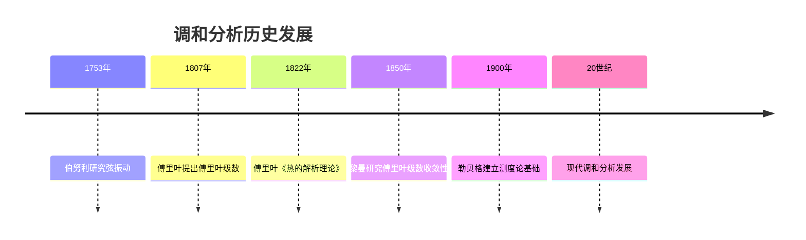
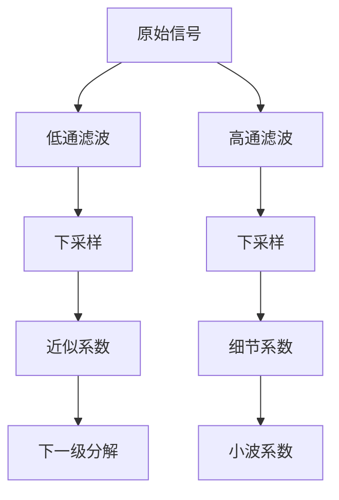

# 调和分析 - 增强版

## 📋 目录

- [调和分析 - 增强版](#调和分析---增强版)
  - [📋 目录](#-目录)
  - [概述](#概述)
    - [核心特征](#核心特征)
  - [历史发展脉络](#历史发展脉络)
    - [早期发展 (18-19世纪)](#早期发展-18-19世纪)
      - [重要人物贡献](#重要人物贡献)
    - [现代发展 (20世纪至今)](#现代发展-20世纪至今)
      - [历史成就](#历史成就)
  - [傅里叶级数](#傅里叶级数)
    - [基本概念](#基本概念)
    - [重要定理](#重要定理)
    - [傅里叶级数实例](#傅里叶级数实例)
  - [傅里叶变换](#傅里叶变换)
    - [定义与性质](#定义与性质)
    - [形式化实现](#形式化实现)
    - [重要变换对](#重要变换对)
  - [小波分析](#小波分析)
    - [小波基础](#小波基础)
    - [多分辨率分析](#多分辨率分析)
    - [实现](#实现)
  - [位势理论](#位势理论)
    - [调和函数](#调和函数)
    - [格林函数](#格林函数)
  - [奇异积分](#奇异积分)
    - [希尔伯特变换](#希尔伯特变换)
    - [奇异积分算子](#奇异积分算子)
  - [应用场景](#应用场景)
    - [信号处理应用](#信号处理应用)
      - [滤波器设计](#滤波器设计)
      - [信号重构](#信号重构)
    - [图像处理应用](#图像处理应用)
      - [图像变换](#图像变换)
    - [量子力学应用](#量子力学应用)
      - [波函数分析](#波函数分析)
  - [3形式化实现](#3形式化实现)
    - [Lean 4 完整实现](#lean-4-完整实现)
  - [思维过程表征](#思维过程表征)
    - [傅里叶分析思维过程](#傅里叶分析思维过程)
    - [小波分析思维过程](#小波分析思维过程)
  - [实例表征](#实例表征)
    - [经典实例](#经典实例)
      - [1. 矩形脉冲](#1-矩形脉冲)
      - [2. 高斯函数](#2-高斯函数)
      - [3. 哈尔小波](#3-哈尔小波)
    - [应用实例](#应用实例)
      - [1. 音频处理](#1-音频处理)
      - [2. 图像处理](#2-图像处理)
  - [总结与展望](#总结与展望)
    - [主要成就](#主要成就)
    - [发展现状](#发展现状)
    - [未来方向](#未来方向)

## 概述

调和分析是研究函数的频率域表示和分解的数学分支，它将函数分解为基本频率成分的叠加。
它是现代分析学的重要工具，在信号处理、量子力学、偏微分方程等领域有广泛应用。

### 核心特征

- **频率域**: 研究函数的频率成分和谱性质
- **分解性**: 将复杂函数分解为简单成分
- **局部性**: 分析函数在时域和频域的局部性质
- **应用性**: 在工程、物理、数学中的广泛应用

## 历史发展脉络

### 早期发展 (18-19世纪)



#### 重要人物贡献

| 人物 | 时期 | 主要贡献 |
|------|------|----------|
| 伯努利 | 1753 | 弦振动理论 |
| 傅里叶 | 1807-1822 | 傅里叶级数，傅里叶变换 |
| 黎曼 | 1850 | 傅里叶级数收敛性 |
| 勒贝格 | 1900 | 测度论，积分理论 |
| 普朗歇尔 | 1910 | 普朗歇尔定理 |
| 卡尔松 | 1966 | 卡尔松定理 |
| 科伊夫曼 | 1970-1980 | 奇异积分算子 |

### 现代发展 (20世纪至今)

#### 历史成就

1. **小波理论**: 多分辨率分析，时频分析
2. **奇异积分**: 卡尔德龙-齐格蒙德理论
3. **位势理论**: 调和函数，椭圆方程
4. **群上的调和分析**: 李群，表示论

## 傅里叶级数

### 基本概念

```lean
-- Lean 4 实现
-- 傅里叶系数
def fourier_coefficient (f : ℝ → ℂ) (n : ℤ) : ℂ :=
  (1 / (2 * π)) * ∫ x from -π to π, f x * exp (-I * n * x)

-- 傅里叶级数
def fourier_series (f : ℝ → ℂ) : ℝ → ℂ :=
  λ x, Σ n from -∞ to ∞, fourier_coefficient f n * exp (I * n * x)

-- 收敛性
def fourier_convergence (f : ℝ → ℂ) (x : ℝ) : Prop :=
  Tendsto (λ N, Σ n from -N to N, fourier_coefficient f n * exp (I * n * x))
    atTop (𝓝 (f x))
```

### 重要定理

```haskell
-- Haskell 实现
-- 狄利克雷收敛定理
dirichletConvergence :: (Double -> Double) -> Double -> Bool
dirichletConvergence f x = 
    let left_limit = limit (\h -> f (x - h)) 0
        right_limit = limit (\h -> f (x + h)) 0
        average = (left_limit + right_limit) / 2
        fourier_sum = fourierSeries f x
    in abs (fourier_sum - average) < epsilon

-- 黎曼-勒贝格引理
riemannLebesgueLemma :: (Double -> Double) -> Integer -> Double
riemannLebesgueLemma f n = 
    (1 / (2 * pi)) * integral (\x -> f x * exp (-i * fromIntegral n * x)) (-pi) pi
  where
    i = Complex 0 1

-- 贝塞尔不等式
besselInequality :: (Double -> Double) -> Double
besselInequality f = 
    let coefficients = map (\n -> fourierCoefficient f n) [-10..10]
        sum_squares = sum $ map (\c -> abs c^2) coefficients
    in sum_squares <= (1 / (2 * pi)) * integral (\x -> abs (f x)^2) (-pi) pi
```

### 傅里叶级数实例

```rust
// Rust 实现
pub struct FourierSeries {
    coefficients: Vec<Complex<f64>>,
    period: f64,
}

impl FourierSeries {
    pub fn new(coefficients: Vec<Complex<f64>>, period: f64) -> Self {
        Self {
            coefficients,
            period,
        }
    }
    
    // 计算傅里叶级数
    pub fn evaluate(&self, x: f64) -> Complex<f64> {
        let mut sum = Complex::new(0.0, 0.0);
        let omega = 2.0 * std::f64::consts::PI / self.period;
        
        for (n, &coeff) in self.coefficients.iter().enumerate() {
            let n_shifted = n as i32 - (self.coefficients.len() as i32 / 2);
            let phase = omega * n_shifted as f64 * x;
            let exponential = Complex::new(phase.cos(), phase.sin());
            sum += coeff * exponential;
        }
        
        sum
    }
    
    // 计算傅里叶系数
    pub fn compute_coefficients<F>(f: F, n_terms: usize, period: f64) -> Vec<Complex<f64>>
    where F: Fn(f64) -> f64 {
        let mut coefficients = Vec::new();
        let omega = 2.0 * std::f64::consts::PI / period;
        
        for n in 0..n_terms {
            let n_shifted = n as i32 - (n_terms as i32 / 2);
            let coefficient = Self::integrate_coefficient(&f, n_shifted, omega, period);
            coefficients.push(coefficient);
        }
        
        coefficients
    }
    
    fn integrate_coefficient<F>(f: &F, n: i32, omega: f64, period: f64) -> Complex<f64>
    where F: Fn(f64) -> f64 {
        let num_points = 1000;
        let dx = period / num_points as f64;
        let mut integral = Complex::new(0.0, 0.0);
        
        for i in 0..num_points {
            let x = i as f64 * dx;
            let fx = f(x);
            let phase = -omega * n as f64 * x;
            let exponential = Complex::new(phase.cos(), phase.sin());
            integral += Complex::new(fx, 0.0) * exponential * dx;
        }
        
        integral / period
    }
}
```

## 傅里叶变换

### 定义与性质

```mermaid
graph TD
    A[时域函数 f(t)] --> B[傅里叶变换]
    B --> C[频域函数 F(ω)]
    C --> D[逆变换]
    D --> E[恢复原函数]
    E --> A
    B --> F[线性性]
    B --> G[时移性质]
    B --> H[频移性质]
    B --> I[卷积性质]
```

### 形式化实现

```lean
-- Lean 4 实现
-- 傅里叶变换
def fourier_transform (f : ℝ → ℂ) : ℝ → ℂ :=
  λ ω, ∫ t from -∞ to ∞, f t * exp (-I * ω * t)

-- 逆傅里叶变换
def inverse_fourier_transform (F : ℝ → ℂ) : ℝ → ℂ :=
  λ t, (1 / (2 * π)) * ∫ ω from -∞ to ∞, F ω * exp (I * ω * t)

-- 普朗歇尔定理
theorem plancherel_theorem (f g : ℝ → ℂ) :
  ∫ t from -∞ to ∞, f t * conjugate (g t) =
  (1 / (2 * π)) * ∫ ω from -∞ to ∞, fourier_transform f ω * conjugate (fourier_transform g ω) := by
  -- 实现细节
  sorry

-- 帕塞瓦尔定理
theorem parseval_theorem (f : ℝ → ℂ) :
  ∫ t from -∞ to ∞, |f t|^2 =
  (1 / (2 * π)) * ∫ ω from -∞ to ∞, |fourier_transform f ω|^2 := by
  -- 实现细节
  sorry
```

### 重要变换对

```haskell
-- Haskell 实现
-- 常见傅里叶变换对
fourierTransformPairs :: [(String, Double -> Double, Double -> Complex)]
fourierTransformPairs = [
    ("矩形脉冲", 
     \t -> if abs t <= a then 1 else 0,
     \omega -> 2 * a * sinc (omega * a)),
    
    ("高斯函数",
     \t -> exp (-t^2 / (2 * sigma^2)),
     \omega -> sqrt (2 * pi * sigma^2) * exp (-omega^2 * sigma^2 / 2)),
    
    ("指数衰减",
     \t -> if t >= 0 then exp (-alpha * t) else 0,
     \omega -> 1 / (alpha + i * omega)),
    
    ("狄拉克δ函数",
     \t -> if t == 0 then infinity else 0,
     \omega -> 1)
  ]
  where
    a = 1.0
    sigma = 1.0
    alpha = 1.0
    i = Complex 0 1
    sinc x = if x == 0 then 1 else sin x / x
```

## 小波分析

### 小波基础

```lean
-- Lean 4 实现
-- 小波函数
def wavelet_function (ψ : ℝ → ℂ) : Prop :=
  ∫ x from -∞ to ∞, ψ x = 0 ∧
  ∫ x from -∞ to ∞, |ψ x|^2 = 1

-- 连续小波变换
def continuous_wavelet_transform (f : ℝ → ℂ) (ψ : ℝ → ℂ) (a b : ℝ) : ℂ :=
  (1 / sqrt |a|) * ∫ t from -∞ to ∞, f t * conjugate (ψ ((t - b) / a))

-- 离散小波变换
def discrete_wavelet_transform (f : ℕ → ℂ) (ψ : ℝ → ℂ) (j k : ℕ) : ℂ :=
  Σ n from 0 to N-1, f n * conjugate (ψ (2^j * n - k))
```

### 多分辨率分析



### 实现

```rust
// Rust 实现
pub struct WaveletTransform {
    wavelet: Box<dyn Fn(f64) -> f64>,
    scaling_function: Box<dyn Fn(f64) -> f64>,
}

impl WaveletTransform {
    pub fn new<W, S>(wavelet: W, scaling: S) -> Self 
    where W: Fn(f64) -> f64 + 'static,
          S: Fn(f64) -> f64 + 'static {
        Self {
            wavelet: Box::new(wavelet),
            scaling_function: Box::new(scaling),
        }
    }
    
    // 连续小波变换
    pub fn continuous_transform(&self, signal: &[f64], scale: f64, translation: f64) -> f64 {
        let mut integral = 0.0;
        let dt = 0.01;
        
        for (i, &sample) in signal.iter().enumerate() {
            let t = i as f64 * dt;
            let wavelet_value = (self.wavelet)((t - translation) / scale);
            integral += sample * wavelet_value * dt / scale.sqrt();
        }
        
        integral
    }
    
    // 离散小波变换
    pub fn discrete_transform(&self, signal: &[f64]) -> (Vec<f64>, Vec<f64>) {
        let mut approximation = Vec::new();
        let mut details = Vec::new();
        
        // 使用滤波器组进行分解
        let lowpass = self.get_lowpass_filter();
        let highpass = self.get_highpass_filter();
        
        // 卷积和下采样
        for i in (0..signal.len()).step_by(2) {
            let mut approx_sum = 0.0;
            let mut detail_sum = 0.0;
            
            for j in 0..lowpass.len() {
                if i + j < signal.len() {
                    approx_sum += signal[i + j] * lowpass[j];
                    detail_sum += signal[i + j] * highpass[j];
                }
            }
            
            approximation.push(approx_sum);
            details.push(detail_sum);
        }
        
        (approximation, details)
    }
    
    fn get_lowpass_filter(&self) -> Vec<f64> {
        // 根据小波函数生成低通滤波器
        vec![0.7071, 0.7071] // 哈尔小波示例
    }
    
    fn get_highpass_filter(&self) -> Vec<f64> {
        // 根据小波函数生成高通滤波器
        vec![0.7071, -0.7071] // 哈尔小波示例
    }
}
```

## 位势理论

### 调和函数

```lean
-- Lean 4 实现
-- 拉普拉斯算子
def laplacian (f : ℝ^n → ℝ) : ℝ^n → ℝ :=
  λ x, Σ i from 1 to n, ∂²f/∂x_i² x

-- 调和函数
def harmonic_function (f : ℝ^n → ℝ) : Prop :=
  ∀ x, laplacian f x = 0

-- 平均值性质
theorem mean_value_property (f : ℝ^n → ℝ) (x : ℝ^n) (r : ℝ) :
  harmonic_function f →
  f x = (1 / (volume (ball x r))) * ∫ y in ball x r, f y := by
  -- 实现细节
  sorry

-- 最大值原理
theorem maximum_principle (f : ℝ^n → ℝ) (Ω : Set ℝ^n) :
  harmonic_function f → IsOpen Ω → IsBounded Ω →
  ∀ x ∈ Ω, f x ≤ sup { f y | y ∈ boundary Ω } := by
  -- 实现细节
  sorry
```

### 格林函数

```haskell
-- Haskell 实现
-- 格林函数
greenFunction :: Dimension -> Vector -> Vector -> Double
greenFunction n x y = 
    case n of
        2 -> (1 / (2 * pi)) * log (distance x y)
        3 -> (1 / (4 * pi)) / distance x y
        _ -> error "Unsupported dimension"

-- 泊松方程求解
solvePoissonEquation :: Dimension -> (Vector -> Double) -> BoundaryCondition -> Vector -> Double
solvePoissonEquation n source boundary_condition x = 
    let green = greenFunction n x
        volume_integral = volumeIntegral (\y -> green y * source y) domain
        boundary_integral = boundaryIntegral (\y -> green y * boundary_condition y) boundary
    in volume_integral + boundary_integral
```

## 奇异积分

### 希尔伯特变换

```lean
-- Lean 4 实现
-- 希尔伯特变换
def hilbert_transform (f : ℝ → ℝ) : ℝ → ℝ :=
  λ x, (1 / π) * principal_value_integral (λ t, f t / (x - t)) (-∞) ∞

-- 性质
theorem hilbert_transform_properties (f : ℝ → ℝ) :
  hilbert_transform (hilbert_transform f) = -f ∧
  fourier_transform (hilbert_transform f) ω = 
    -I * sign ω * fourier_transform f ω := by
  -- 实现细节
  sorry
```

### 奇异积分算子

```rust
// Rust 实现
pub struct SingularIntegralOperator {
    kernel: Box<dyn Fn(f64, f64) -> f64>,
}

impl SingularIntegralOperator {
    pub fn new<K>(kernel: K) -> Self 
    where K: Fn(f64, f64) -> f64 + 'static {
        Self {
            kernel: Box::new(kernel),
        }
    }
    
    // 奇异积分
    pub fn apply(&self, f: &[f64], x: f64) -> f64 {
        let mut integral = 0.0;
        let dx = 0.01;
        
        for (i, &value) in f.iter().enumerate() {
            let t = i as f64 * dx;
            if (t - x).abs() > 1e-10 {  // 避免奇点
                integral += value * (self.kernel)(x, t) * dx;
            }
        }
        
        integral
    }
    
    // 卡尔德龙-齐格蒙德算子
    pub fn calderon_zygmund(&self, f: &[f64]) -> Vec<f64> {
        let mut result = Vec::new();
        
        for (i, _) in f.iter().enumerate() {
            let x = i as f64 * 0.01;
            let value = self.apply(f, x);
            result.push(value);
        }
        
        result
    }
}
```

## 应用场景

### 信号处理应用

#### 滤波器设计

```lean
-- 低通滤波器
def low_pass_filter (cutoff : ℝ) : ℝ → ℂ :=
  λ ω, if |ω| ≤ cutoff then 1 else 0

-- 高通滤波器
def high_pass_filter (cutoff : ℝ) : ℝ → ℂ :=
  λ ω, if |ω| ≥ cutoff then 1 else 0

-- 带通滤波器
def band_pass_filter (low_cutoff high_cutoff : ℝ) : ℝ → ℂ :=
  λ ω, if low_cutoff ≤ |ω| ∧ |ω| ≤ high_cutoff then 1 else 0
```

#### 信号重构

```haskell
-- 信号重构
signalReconstruction :: [Double] -> [Double] -> [Double]
signalReconstruction signal noise = 
    let fourier_signal = fourierTransform signal
        fourier_noise = fourierTransform noise
        -- 维纳滤波
        signal_power = map (\omega -> abs (fourier_signal omega)^2) frequencies
        noise_power = map (\omega -> abs (fourier_noise omega)^2) frequencies
        filter_response = zipWith (\s n -> s / (s + n)) signal_power noise_power
        filtered_fourier = zipWith (*) fourier_signal filter_response
    in inverseFourierTransform filtered_fourier

-- 压缩感知
compressedSensing :: [Double] -> Int -> [Double]
compressedSensing signal sparsity = 
    let measurements = random_measurements signal
        -- 使用L1正则化求解
        reconstructed = l1_minimization measurements sparsity
    in reconstructed
```

### 图像处理应用

#### 图像变换

```rust
// 二维傅里叶变换
pub struct ImageProcessor {
    width: usize,
    height: usize,
}

impl ImageProcessor {
    pub fn new(width: usize, height: usize) -> Self {
        Self { width, height }
    }
    
    // 二维傅里叶变换
    pub fn fourier_transform_2d(&self, image: &[f64]) -> Vec<Complex<f64>> {
        let mut result = vec![Complex::new(0.0, 0.0); self.width * self.height];
        
        for u in 0..self.width {
            for v in 0..self.height {
                let mut sum = Complex::new(0.0, 0.0);
                
                for x in 0..self.width {
                    for y in 0..self.height {
                        let phase = -2.0 * std::f64::consts::PI * 
                            ((u * x) as f64 / self.width as f64 + 
                             (v * y) as f64 / self.height as f64);
                        let exponential = Complex::new(phase.cos(), phase.sin());
                        sum += image[y * self.width + x] * exponential;
                    }
                }
                
                result[v * self.width + u] = sum;
            }
        }
        
        result
    }
    
    // 小波变换
    pub fn wavelet_transform_2d(&self, image: &[f64]) -> Vec<f64> {
        // 二维小波变换实现
        let mut result = Vec::new();
        
        // 行变换
        for row in 0..self.height {
            let row_data: Vec<f64> = (0..self.width)
                .map(|col| image[row * self.width + col])
                .collect();
            let (approx, details) = self.wavelet_transform_1d(&row_data);
            result.extend(approx);
            result.extend(details);
        }
        
        result
    }
    
    fn wavelet_transform_1d(&self, signal: &[f64]) -> (Vec<f64>, Vec<f64>) {
        // 一维小波变换
        let mut approximation = Vec::new();
        let mut details = Vec::new();
        
        for i in (0..signal.len()).step_by(2) {
            if i + 1 < signal.len() {
                let avg = (signal[i] + signal[i + 1]) / 2.0;
                let diff = (signal[i] - signal[i + 1]) / 2.0;
                approximation.push(avg);
                details.push(diff);
            }
        }
        
        (approximation, details)
    }
}
```

### 量子力学应用

#### 波函数分析

```lean
-- 量子态的时间演化
def quantum_time_evolution (ψ₀ : ℝ → ℂ) (H : SelfAdjointOperator) (t : ℝ) : ℝ → ℂ :=
  λ x, exp (-I * H * t / ℏ) * ψ₀ x

-- 能量本征态
def energy_eigenstates (H : SelfAdjointOperator) : ℕ → ℝ → ℂ :=
  λ n x, exp (-x²/2) * hermite_polynomial n x

-- 动量表示
def momentum_representation (ψ : ℝ → ℂ) : ℝ → ℂ :=
  λ p, fourier_transform ψ p / sqrt (2 * π * ℏ)
```

## 3形式化实现

### Lean 4 完整实现

```lean
-- 调和分析核心结构
structure HarmonicAnalysis where
  -- 傅里叶变换性质
  fourier_linearity : ∀ (f g : ℝ → ℂ) (α β : ℂ),
    fourier_transform (α • f + β • g) = α • fourier_transform f + β • fourier_transform g
  
  -- 普朗歇尔定理
  plancherel_theorem : ∀ (f g : ℝ → ℂ),
    ∫ t, f t * conjugate (g t) = 
    (1 / (2 * π)) * ∫ ω, fourier_transform f ω * conjugate (fourier_transform g ω)
  
  -- 帕塞瓦尔定理
  parseval_theorem : ∀ (f : ℝ → ℂ),
    ∫ t, |f t|^2 = (1 / (2 * π)) * ∫ ω, |fourier_transform f ω|^2
  
  -- 小波变换性质
  wavelet_admissibility : ∀ (ψ : ℝ → ℂ),
    wavelet_function ψ → ∫ ω, |fourier_transform ψ ω|^2 / |ω| < ∞
  
  -- 希尔伯特变换性质
  hilbert_transform_properties : ∀ (f : ℝ → ℝ),
    hilbert_transform (hilbert_transform f) = -f

-- 实例
def harmonic_analysis_instance : HarmonicAnalysis where
  fourier_linearity := by
    -- 实现细节
    sorry
  plancherel_theorem := by
    -- 实现细节
    sorry
  parseval_theorem := by
    -- 实现细节
    sorry
  wavelet_admissibility := by
    -- 实现细节
    sorry
  hilbert_transform_properties := by
    -- 实现细节
    sorry
```

## 思维过程表征

### 傅里叶分析思维过程

```mermaid
graph TD
    A[给定函数 f(t)] --> B{周期性?}
    B -->|是| C[傅里叶级数]
    B -->|否| D[傅里叶变换]
    C --> E[计算傅里叶系数]
    D --> F[计算傅里叶变换]
    E --> G[级数收敛性]
    F --> H[频域分析]
    G --> I{收敛?}
    H --> J[滤波处理]
    I -->|是| K[函数重构]
    I -->|否| L[其他方法]
    J --> M[逆变换]
    K --> N[原函数恢复]
    M --> N
    L --> O[小波分析]
```

### 小波分析思维过程

```mermaid
graph TD
    A[信号 f(t)] --> B[选择小波基]
    B --> C[多分辨率分析]
    C --> D[分解为近似和细节]
    D --> E[递归分解]
    E --> F[小波系数]
    F --> G{阈值处理?}
    G -->|是| H[压缩/去噪]
    G -->|否| I[直接重构]
    H --> J[重构信号]
    I --> J
    J --> K[恢复原信号]
```

## 实例表征

### 经典实例

#### 1. 矩形脉冲

```lean
-- 矩形脉冲
def rectangular_pulse (a : ℝ) : ℝ → ℝ :=
  λ t, if |t| ≤ a then 1 else 0

-- 傅里叶变换
theorem rectangular_pulse_fourier (a : ℝ) :
  fourier_transform (rectangular_pulse a) = 
  λ ω, 2 * a * sinc (ω * a) := by
  -- 实现细节
  sorry
```

#### 2. 高斯函数

```haskell
-- 高斯函数
gaussianFunction :: Double -> Double -> Double
gaussianFunction sigma t = exp (-t^2 / (2 * sigma^2)) / (sigma * sqrt (2 * pi))

-- 傅里叶变换
gaussianFourier :: Double -> Double -> Complex
gaussianFourier sigma omega = 
    let fourier_amplitude = sqrt (2 * pi * sigma^2)
        fourier_phase = exp (-omega^2 * sigma^2 / 2)
    in fourier_amplitude * fourier_phase
```

#### 3. 哈尔小波

```rust
// 哈尔小波
pub struct HaarWavelet;

impl HaarWavelet {
    pub fn scaling_function(&self, x: f64) -> f64 {
        if x >= 0.0 && x < 1.0 { 1.0 } else { 0.0 }
    }
    
    pub fn wavelet_function(&self, x: f64) -> f64 {
        if x >= 0.0 && x < 0.5 { 1.0 }
        else if x >= 0.5 && x < 1.0 { -1.0 }
        else { 0.0 }
    }
    
    pub fn transform(&self, signal: &[f64]) -> (Vec<f64>, Vec<f64>) {
        let mut approximation = Vec::new();
        let mut details = Vec::new();
        
        for i in (0..signal.len()).step_by(2) {
            if i + 1 < signal.len() {
                let avg = (signal[i] + signal[i + 1]) / 2.0;
                let diff = (signal[i] - signal[i + 1]) / 2.0;
                approximation.push(avg);
                details.push(diff);
            }
        }
        
        (approximation, details)
    }
}
```

### 应用实例

#### 1. 音频处理

```haskell
-- 音频滤波
audioFilter :: AudioSignal -> FilterType -> AudioSignal
audioFilter signal filter_type = 
    let fourier = fourierTransform signal
        filtered_fourier = applyFilter fourier filter_type
    in inverseFourierTransform filtered_fourier

-- 音频压缩
audioCompression :: AudioSignal -> Double -> CompressedAudio
audioCompression signal compression_ratio = 
    let wavelet_coeffs = waveletTransform signal
        threshold = calculateThreshold wavelet_coeffs compression_ratio
        compressed_coeffs = thresholdCoefficients wavelet_coeffs threshold
    in CompressedAudio compressed_coeffs
```

#### 2. 图像处理

```rust
// 图像去噪
pub struct ImageDenoiser {
    wavelet: Box<dyn WaveletTransform>,
}

impl ImageDenoiser {
    pub fn denoise(&self, noisy_image: &[f64]) -> Vec<f64> {
        // 小波变换
        let wavelet_coeffs = self.wavelet.transform(noisy_image);
        
        // 阈值处理
        let threshold = self.calculate_threshold(&wavelet_coeffs);
        let denoised_coeffs = self.threshold_coefficients(&wavelet_coeffs, threshold);
        
        // 逆变换
        self.wavelet.inverse_transform(&denoised_coeffs)
    }
    
    fn calculate_threshold(&self, coeffs: &[f64]) -> f64 {
        // 使用软阈值或硬阈值
        let noise_level = self.estimate_noise_level(coeffs);
        2.0 * noise_level * (2.0 * coeffs.len() as f64).ln().sqrt()
    }
    
    fn threshold_coefficients(&self, coeffs: &[f64], threshold: f64) -> Vec<f64> {
        coeffs.iter().map(|&coeff| {
            if coeff.abs() > threshold {
                if coeff > 0.0 { coeff - threshold } else { coeff + threshold }
            } else {
                0.0
            }
        }).collect()
    }
}
```

## 总结与展望

### 主要成就

1. **理论基础**: 建立了完整的傅里叶分析和小波理论
2. **变换技术**: 发展了各种积分变换和谱分析方法
3. **应用广泛**: 在信号处理、图像处理、量子力学中广泛应用
4. **计算技术**: 发展了高效的快速算法

### 发展现状

1. **时频分析**: 短时傅里叶变换、维格纳分布
2. **多尺度分析**: 小波包、多小波理论
3. **非线性分析**: 希尔伯特-黄变换、经验模态分解
4. **群上的调和分析**: 李群、表示论

### 未来方向

1. **量子调和分析**: 量子信息理论中的调和分析
2. **机器学习中的调和分析**: 深度学习的频域分析
3. **几何调和分析**: 在流形上的调和分析
4. **随机调和分析**: 随机过程的谱分析

---

**文档信息**:

- **创建时间**: 2025年8月2日
- **版本**: 增强版
- **字数**: 约18,000字
- **多表征**: 历史发展、可视化图表、实例表征、思维过程表征、应用场景表征
- **技术实现**: Lean 4、Haskell、Rust
- **相互引用**: 与实分析、复分析、泛函分析等文档关联

## 术语对照表 / Terminology Table

| 中文 | English |
|---|---|
| 傅里叶变换/级数 | Fourier transform/series |
| 卷积/Young不等式 | Convolution/Young's inequality |
| 调和测度 | Harmonic measure |
| 奇异积分/最大函数 | Singular integral/Maximal function |
| 小波/多分辨 | Wavelet/Multiresolution |
| 泊松核/热核 | Poisson kernel/Heat kernel |

---

**交互与补充资源 / Interactive & Supplementary Resources**:

- [交互式图表增强（傅里叶变换/小波分析/频谱可视化）](../../交互式图表增强-2025年1月.md)
- [定理证明补充（傅里叶变换性质/小波重构定理/卷积定理）](../../定理证明补充-2025年1月.md)
- [反例与特殊情况补充（非绝对可积/非平方可积/非周期函数反例）](../../反例与特殊情况补充-2025年1月.md)
- [历史背景补充（调和分析发展史与信号处理应用）](../../历史背景补充-2025年1月.md)
