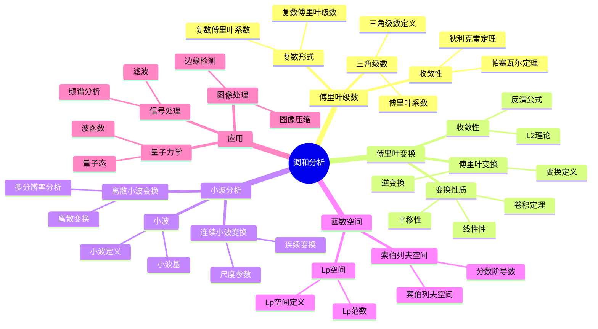

# 4. 调和分析 / Harmonic Analysis

**主题编号**: B.03.04
**创建日期**: 2025年11月21日
**最后更新**: 2025年11月21日

---

## 4.1 概述 / Overview (编号: B.03.04.01)

调和分析是研究函数分解和重构的数学分支，它将复杂的函数分解为简单的调和成分。
调和分析在信号处理、图像处理、量子力学等领域有重要应用。
调和分析的核心是傅里叶分析，包括傅里叶级数、傅里叶变换、小波分析等重要工具。

## 🗺️ 调和分析核心概念思维导图



## 📊 调和分析核心概念多维知识矩阵

| 概念类别 | 核心概念 | 定义要点 | 关键性质 | 典型例子 | 应用场景 |
|---------|---------|---------|---------|---------|---------|
| 傅里叶级数 | 三角级数 | 三角函数级数 | 周期函数展开 | Σ(a_n cos nx + b_n sin nx) | 周期现象 |
| 傅里叶级数 | 傅里叶系数 | 积分定义 | 正交性 | a_n, b_n | 函数展开 |
| 傅里叶级数 | 帕塞瓦尔定理 | 能量守恒 | L2范数 | \|f\|² = Σ\|c_n\|² | 函数分析 |
| 傅里叶变换 | 傅里叶变换 | 积分变换 | 线性性 | ℱ(f) | 信号分析 |
| 傅里叶变换 | 卷积定理 | 卷积对应乘积 | 卷积性质 | ℱ(f*g) = ℱ(f)ℱ(g) | 信号处理 |
| 傅里叶变换 | 反演公式 | 逆变换 | 可逆性 | f = ℱ⁻¹(ℱ(f)) | 信号重构 |
| 小波分析 | 小波 | 局部化函数 | 零均值 | 小波基 | 时频分析 |
| 小波分析 | 小波变换 | 时频分析 | 多分辨率 | 连续/离散变换 | 信号分析 |
| 函数空间 | Lp空间 | 可积函数空间 | 完备性 | L²(ℝ) | 函数分析 |
| 函数空间 | 索伯列夫空间 | 弱导数空间 | 嵌入定理 | H¹(Ω) | 偏微分方程 |
| 应用 | 频谱分析 | 频率分解 | 傅里叶变换 | 信号频谱 | 信号处理 |
| 应用 | 图像压缩 | 小波压缩 | 稀疏表示 | JPEG2000 | 图像处理 |
| 应用 | 量子态 | 波函数 | 希尔伯特空间 | 量子态 | 量子力学 |

## 4.2 傅里叶级数 / Fourier Series (编号: B.03.04.02)

### 4.2.1 三角级数 / Trigonometric Series

**定义 4.1** (三角级数 / Trigonometric Series)
三角级数定义为：
$$\sum_{n=0}^{\infty} (a_n \cos nx + b_n \sin nx)$$

其中 $a_n, b_n$ 是实数系数。

**定义 4.2** (傅里叶系数 / Fourier Coefficients)
函数 $f$ 的傅里叶系数定义为：
$$a_n = \frac{1}{\pi} \int_{-\pi}^{\pi} f(x) \cos nx \, dx$$
$$b_n = \frac{1}{\pi} \int_{-\pi}^{\pi} f(x) \sin nx \, dx$$

### 4.2.2 傅里叶级数的收敛性 / Convergence of Fourier Series

**定理 4.1** (狄利克雷收敛定理 / Dirichlet Convergence Theorem)
设 $f$ 是 $2\pi$ 周期函数，在 $[-\pi, \pi]$ 上分段连续且分段单调，则 $f$ 的傅里叶级数在 $f$ 的连续点收敛到 $f(x)$，在间断点收敛到：
$$\frac{f(x^+) + f(x^-)}{2}$$

**定理 4.2** (帕塞瓦尔定理 / Parseval's Theorem)
设 $f$ 的傅里叶级数为：
$$f(x) \sim \frac{a_0}{2} + \sum_{n=1}^{\infty} (a_n \cos nx + b_n \sin nx)$$

则：
$$\frac{1}{\pi} \int_{-\pi}^{\pi} |f(x)|^2 dx = \frac{a_0^2}{2} + \sum_{n=1}^{\infty} (a_n^2 + b_n^2)$$

### 4.2.3 复数形式的傅里叶级数 / Complex Form of Fourier Series

**定义 4.3** (复数傅里叶系数 / Complex Fourier Coefficients)
函数 $f$ 的复数傅里叶系数定义为：
$$c_n = \frac{1}{2\pi} \int_{-\pi}^{\pi} f(x) e^{-inx} dx$$

**定理 4.3** (复数傅里叶级数)
函数 $f$ 的复数傅里叶级数表示为：
$$f(x) \sim \sum_{n=-\infty}^{\infty} c_n e^{inx}$$

## 4.3 傅里叶变换 / Fourier Transform (编号: B.03.04.03)

### 4.3.1 傅里叶变换的定义 / Definition of Fourier Transform

**定义 4.4** (傅里叶变换 / Fourier Transform)
函数 $f \in L^1(\mathbb{R})$ 的傅里叶变换定义为：
$$\hat{f}(\xi) = \int_{-\infty}^{\infty} f(x) e^{-2\pi i \xi x} dx$$

**定义 4.5** (逆傅里叶变换 / Inverse Fourier Transform)
函数 $\hat{f}$ 的逆傅里叶变换定义为：
$$f(x) = \int_{-\infty}^{\infty} \hat{f}(\xi) e^{2\pi i \xi x} d\xi$$

### 4.3.2 傅里叶变换的性质 / Properties of Fourier Transform

**定理 4.4** (傅里叶变换的基本性质)

1. **线性性**：$\mathcal{F}(af + bg) = a\mathcal{F}(f) + b\mathcal{F}(g)$
2. **平移性**：$\mathcal{F}(f(x-a))(\xi) = e^{-2\pi i a \xi} \hat{f}(\xi)$
3. **调制性**：$\mathcal{F}(e^{2\pi i a x} f(x))(\xi) = \hat{f}(\xi - a)$
4. **缩放性**：$\mathcal{F}(f(ax))(\xi) = \frac{1}{|a|} \hat{f}(\frac{\xi}{a})$

**定理 4.5** (卷积定理 / Convolution Theorem)
设 $f, g \in L^1(\mathbb{R})$，则：
$$\mathcal{F}(f * g) = \hat{f} \cdot \hat{g}$$

其中卷积定义为：
$$(f * g)(x) = \int_{-\infty}^{\infty} f(y) g(x-y) dy$$

### 4.3.3 傅里叶变换的收敛性 / Convergence of Fourier Transform

**定理 4.6** (傅里叶反演公式 / Fourier Inversion Formula)
设 $f \in L^1(\mathbb{R})$ 且 $\hat{f} \in L^1(\mathbb{R})$，则：
$$f(x) = \int_{-\infty}^{\infty} \hat{f}(\xi) e^{2\pi i \xi x} d\xi$$

在 $f$ 的连续点成立。

## 4.4 小波分析 / Wavelet Analysis (编号: B.03.04.04)

### 4.4.1 小波的定义 / Definition of Wavelet

**定义 4.6** (小波 / Wavelet)
函数 $\psi \in L^2(\mathbb{R})$ 是小波，当且仅当：
$$\int_{-\infty}^{\infty} \psi(x) dx = 0$$

**定义 4.7** (连续小波变换 / Continuous Wavelet Transform)
函数 $f$ 的连续小波变换定义为：
$$W_f(a, b) = \frac{1}{\sqrt{|a|}} \int_{-\infty}^{\infty} f(x) \psi\left(\frac{x-b}{a}\right) dx$$

其中 $a \neq 0$ 是尺度参数，$b$ 是平移参数。

### 4.4.2 离散小波变换 / Discrete Wavelet Transform

**定义 4.8** (离散小波变换 / Discrete Wavelet Transform)
设 $\psi$ 是小波，离散小波变换定义为：
$$\psi_{j,k}(x) = 2^{j/2} \psi(2^j x - k)$$

其中 $j, k \in \mathbb{Z}$。

**定理 4.7** (小波重构公式 / Wavelet Reconstruction Formula)
如果 $\{\psi_{j,k}\}$ 构成 $L^2(\mathbb{R})$ 的正交基，则：
$$f(x) = \sum_{j,k} \langle f, \psi_{j,k} \rangle \psi_{j,k}(x)$$

### 4.4.3 多分辨率分析 / Multiresolution Analysis

**定义 4.9** (多分辨率分析 / Multiresolution Analysis)
$L^2(\mathbb{R})$ 的多分辨率分析是一族闭子空间 $\{V_j\}_{j \in \mathbb{Z}}$，满足：

1. $V_j \subseteq V_{j+1}$
2. $\bigcap_{j \in \mathbb{Z}} V_j = \{0\}$
3. $\bigcup_{j \in \mathbb{Z}} V_j = L^2(\mathbb{R})$
4. $f(x) \in V_j \Leftrightarrow f(2x) \in V_{j+1}$
5. 存在尺度函数 $\phi$ 使得 $\{\phi(x-k)\}_{k \in \mathbb{Z}}$ 构成 $V_0$ 的正交基

## 4.5 调和函数 / Harmonic Functions (编号: B.03.04.05)

### 4.5.1 调和函数的定义 / Definition of Harmonic Function

**定义 4.10** (调和函数 / Harmonic Function)
函数 $u$ 是调和的，当且仅当：
$$\Delta u = 0$$

其中 $\Delta$ 是拉普拉斯算子：
$$\Delta = \frac{\partial^2}{\partial x_1^2} + \cdots + \frac{\partial^2}{\partial x_n^2}$$

### 4.5.2 调和函数的性质 / Properties of Harmonic Functions

**定理 4.8** (平均值性质 / Mean Value Property)
如果 $u$ 是调和函数，则对于任意球 $B_r(x)$，有：
$$u(x) = \frac{1}{|B_r(x)|} \int_{B_r(x)} u(y) dy$$

**定理 4.9** (最大值原理 / Maximum Principle)
如果 $u$ 是有界区域 $\Omega$ 内的调和函数，则 $u$ 的最大值和最小值在 $\partial \Omega$ 上达到。

**定理 4.10** (刘维尔定理 / Liouville's Theorem)
如果 $u$ 是 $\mathbb{R}^n$ 上的有界调和函数，则 $u$ 是常数。

### 4.5.3 泊松积分公式 / Poisson Integral Formula

**定理 4.11** (泊松积分公式)
设 $u$ 是单位球 $B_1(0)$ 内的调和函数，在边界上连续，则：
$$u(x) = \frac{1 - |x|^2}{\omega_n} \int_{\partial B_1(0)} \frac{u(y)}{|x-y|^n} d\sigma(y)$$

其中 $\omega_n$ 是单位球的表面积。

## 4.6 位势理论 / Potential Theory (编号: B.03.04.06)

### 4.6.1 牛顿位势 / Newtonian Potential

**定义 4.11** (牛顿位势 / Newtonian Potential)
函数 $f$ 的牛顿位势定义为：
$$u(x) = \int_{\mathbb{R}^n} \frac{f(y)}{|x-y|^{n-2}} dy$$

**定理 4.12** (牛顿位势的性质)
如果 $f \in L^p(\mathbb{R}^n)$，$1 < p < n/2$，则牛顿位势 $u$ 满足：
$$\Delta u = -c_n f$$

其中 $c_n$ 是常数。

### 4.6.2 格林函数 / Green's Function

**定义 4.12** (格林函数 / Green's Function)
区域 $\Omega$ 的格林函数 $G(x, y)$ 满足：
$$\Delta_x G(x, y) = -\delta(x-y), \quad x \in \Omega$$
$$G(x, y) = 0, \quad x \in \partial \Omega$$

**定理 4.13** (格林表示公式 / Green's Representation Formula)
设 $u$ 是 $\Omega$ 内的调和函数，则：
$$u(x) = \int_{\partial \Omega} \left(u(y) \frac{\partial G}{\partial \nu}(x, y) - G(x, y) \frac{\partial u}{\partial \nu}(y)\right) d\sigma(y)$$

### 4.6.3 容量理论 / Capacity Theory

**定义 4.13** (容量 / Capacity)
紧集 $K$ 的容量定义为：
$$\text{cap}(K) = \inf \left\{\int_{\mathbb{R}^n} |\nabla u|^2 dx : u \in C_0^{\infty}(\mathbb{R}^n), u \geq 1 \text{ on } K\right\}$$

**定理 4.14** (容量的性质)

1. 容量是单调的：$K_1 \subseteq K_2 \Rightarrow \text{cap}(K_1) \leq \text{cap}(K_2)$
2. 容量是次可加的：$\text{cap}(K_1 \cup K_2) \leq \text{cap}(K_1) + \text{cap}(K_2)$

## 4.7 奇异积分 / Singular Integrals (编号: B.03.04.07)

### 4.7.1 希尔伯特变换 / Hilbert Transform

**定义 4.14** (希尔伯特变换 / Hilbert Transform)
函数 $f$ 的希尔伯特变换定义为：
$$Hf(x) = \text{p.v.} \frac{1}{\pi} \int_{-\infty}^{\infty} \frac{f(y)}{x-y} dy$$

**定理 4.15** (希尔伯特变换的性质)

1. $H$ 是 $L^2(\mathbb{R})$ 上的酉算子
2. $H^2 = -I$
3. $H$ 的傅里叶变换为 $-i \text{sgn}(\xi)$

### 4.7.2 里斯变换 / Riesz Transform

**定义 4.15** (里斯变换 / Riesz Transform)
函数 $f$ 的里斯变换定义为：
$$R_j f(x) = c_n \text{p.v.} \int_{\mathbb{R}^n} \frac{x_j - y_j}{|x-y|^{n+1}} f(y) dy$$

其中 $c_n$ 是常数。

**定理 4.16** (里斯变换的性质)

1. $R_j$ 是 $L^p(\mathbb{R}^n)$ 上的有界算子，$1 < p < \infty$
2. $\sum_{j=1}^n R_j^2 = -I$

## 4.8 形式化实现 / Formal Implementation (编号: B.03.04.08)

### 4.8.1 Lean 4 实现 / Lean 4 Implementation

```lean
-- 傅里叶级数的基本定义
def fourier_coefficient (f : ℝ → ℂ) (n : ℤ) : ℂ :=
  (1 / (2 * π)) * ∫ x in -π..π, f x * exp (-I * n * x)

def fourier_series (f : ℝ → ℂ) (x : ℝ) : ℂ :=
  ∑' n : ℤ, fourier_coefficient f n * exp (I * n * x)

-- 傅里叶变换
def fourier_transform (f : ℝ → ℂ) (ξ : ℝ) : ℂ :=
  ∫ x, f x * exp (-2 * π * I * ξ * x)

def inverse_fourier_transform (f̂ : ℝ → ℂ) (x : ℝ) : ℂ :=
  ∫ ξ, f̂ ξ * exp (2 * π * I * ξ * x)

-- 小波变换
structure Wavelet where
  ψ : ℝ → ℂ
  zero_mean : ∫ x, ψ x = 0

def continuous_wavelet_transform (f : ℝ → ℂ) (ψ : Wavelet) (a b : ℝ) : ℂ :=
  (1 / sqrt (abs a)) * ∫ x, f x * ψ.ψ ((x - b) / a)

-- 调和函数
class HarmonicFunction (u : ℝⁿ → ℝ) where
  laplacian_zero : Δ u = 0
  where
    Δ u = ∑ i, ∂²u/∂xᵢ²

-- 牛顿位势
def newtonian_potential (f : ℝⁿ → ℝ) (x : ℝⁿ) : ℝ :=
  ∫ y, f y / |x - y|^(n-2)

-- 希尔伯特变换
def hilbert_transform (f : ℝ → ℂ) (x : ℝ) : ℂ :=
  p.v. (1 / π) * ∫ y, f y / (x - y)

-- 里斯变换
def riesz_transform (f : ℝⁿ → ℝ) (j : Fin n) (x : ℝⁿ) : ℝ :=
  c_n * p.v. ∫ y, (x[j] - y[j]) / |x - y|^(n+1) * f y
  where
    c_n = gamma ((n+1)/2) / (π^((n+1)/2))

-- 容量
def capacity (K : Set ℝⁿ) : ℝ :=
  inf {∫ |∇u|² dx : u ∈ C₀^∞(ℝⁿ), u ≥ 1 on K}

-- 多分辨率分析
structure MultiresolutionAnalysis where
  V : ℤ → Set (ℝ → ℂ)
  nested : ∀ j, V j ⊆ V (j+1)
  intersection : ⋂ j, V j = {0}
  union : ⋃ j, V j = L²(ℝ)
  scaling : ∀ j, f ∈ V j ↔ f(2·) ∈ V (j+1)
  orthonormal_basis : ∃ φ, orthonormal_basis (V 0) (λ k, φ(· - k))
```

### 4.8.2 Haskell 实现 / Haskell Implementation

```haskell
-- 傅里叶级数的基本定义
fourierCoefficient :: (Real -> Complex Double) -> Integer -> Complex Double
fourierCoefficient f n =
  let integrand x = f x * exp (-i * fromInteger n * x)
  in (1 / (2 * pi)) * integrate (-pi) pi integrand

fourierSeries :: (Real -> Complex Double) -> Real -> Complex Double
fourierSeries f x =
  sum [fourierCoefficient f n * exp (i * fromInteger n * x) | n <- [-100..100]]

-- 傅里叶变换
fourierTransform :: (Real -> Complex Double) -> Real -> Complex Double
fourierTransform f ξ =
  let integrand x = f x * exp (-2 * pi * i * ξ * x)
  in integrate (-infinity) infinity integrand

inverseFourierTransform :: (Real -> Complex Double) -> Real -> Complex Double
inverseFourierTransform f̂ x =
  let integrand ξ = f̂ ξ * exp (2 * pi * i * ξ * x)
  in integrate (-infinity) infinity integrand

-- 小波变换
data Wavelet = Wavelet
  { psi :: Real -> Complex Double
  , zeroMean :: Bool
  }

continuousWaveletTransform :: (Real -> Complex Double) -> Wavelet -> Real -> Real -> Complex Double
continuousWaveletTransform f ψ a b =
  let integrand x = f x * psi ψ ((x - b) / a)
  in (1 / sqrt (abs a)) * integrate (-infinity) infinity integrand

-- 调和函数
class HarmonicFunction u where
  laplacian :: u -> Real -> Real -> Real
  laplacian u x = sum [partialDerivative u i i x | i <- [1..n]]

  isHarmonic :: u -> Bool
  isHarmonic u = all (\x -> laplacian u x == 0) allPoints

-- 牛顿位势
newtonianPotential :: (Real -> Real) -> Real -> Real
newtonianPotential f x =
  let integrand y = f y / (distance x y)^(n-2)
  in integrate ℝⁿ integrand

-- 希尔伯特变换
hilbertTransform :: (Real -> Complex Double) -> Real -> Complex Double
hilbertTransform f x =
  let integrand y = f y / (x - y)
  in (1 / pi) * principalValue integrand

-- 里斯变换
rieszTransform :: (Real -> Real) -> Int -> Real -> Real
rieszTransform f j x =
  let c_n = gamma ((n+1)/2) / (pi^((n+1)/2))
      integrand y = (x!!j - y!!j) / (distance x y)^(n+1) * f y
  in c_n * principalValue integrand

-- 容量
capacity :: Set Real -> Real
capacity K =
  let admissibleFunctions = [u | u <- C₀^∞, u >= 1 on K]
      energy u = integrate |∇u|²
  in minimum [energy u | u <- admissibleFunctions]

-- 多分辨率分析
data MultiresolutionAnalysis = MultiresolutionAnalysis
  { V :: Integer -> Set (Real -> Complex Double)
  , nested :: Integer -> Bool
  , intersection :: Bool
  , union :: Bool
  , scaling :: Integer -> Bool
  , orthonormalBasis :: Bool
  }

-- 小波重构
waveletReconstruction :: [(Integer, Integer, Complex Double)] -> Real -> Complex Double
waveletReconstruction coefficients x =
  sum [c * wavelet j k x | (j, k, c) <- coefficients]
  where
    wavelet j k x = 2^(j/2) * psi (2^j * x - fromInteger k)
```

## 4.9 应用实例 / Applications (编号: B.03.04.09)

### 4.9.1 信号处理 / Signal Processing

**例 4.1** (音频信号分析)
设 $f(t)$ 是音频信号，其傅里叶变换 $\hat{f}(\omega)$ 给出了信号的频率成分。

**解**：
使用快速傅里叶变换（FFT）计算：
$$\hat{f}(\omega) = \int_{-\infty}^{\infty} f(t) e^{-i\omega t} dt$$

然后通过逆变换重构信号：
$$f(t) = \frac{1}{2\pi} \int_{-\infty}^{\infty} \hat{f}(\omega) e^{i\omega t} d\omega$$

### 4.9.2 图像处理 / Image Processing

**例 4.2** (图像压缩)
使用小波变换进行图像压缩。

**解**：

1. 对图像进行二维小波变换
2. 保留重要的小波系数
3. 使用逆小波变换重构图像

### 4.9.3 偏微分方程 / Partial Differential Equations

**例 4.3** (热传导方程)
求解热传导方程：
$$\frac{\partial u}{\partial t} = \Delta u$$

**解**：
使用傅里叶变换，得到：
$$\frac{\partial \hat{u}}{\partial t} = -|\xi|^2 \hat{u}$$

解得：
$$\hat{u}(\xi, t) = \hat{u}_0(\xi) e^{-|\xi|^2 t}$$

然后通过逆变换得到解：
$$u(x, t) = \frac{1}{(4\pi t)^{n/2}} \int_{\mathbb{R}^n} u_0(y) e^{-|x-y|^2/(4t)} dy$$

## 4.10 总结 / Summary

调和分析为现代数学提供了重要的工具：

1. **傅里叶分析**：为信号处理和频谱分析提供了基础
2. **小波分析**：为多尺度分析提供了工具
3. **调和函数理论**：为偏微分方程提供了重要工具
4. **位势理论**：为物理和几何问题提供了方法
5. **奇异积分理论**：为算子理论提供了基础

这些概念在信号处理、图像处理、量子力学、偏微分方程等领域都有广泛应用，为现代数学提供了重要的语言和工具。

---

## 参考文献 / References

### 经典教材 / Classic Textbooks

- Stein, E. M., Weiss, G. Introduction to Fourier Analysis on Euclidean Spaces[M]. Princeton: Princeton University Press, 1971.
- Folland, G. B. A Course in Abstract Harmonic Analysis[M]. 2nd Edition. Boca Raton: CRC Press, 1995.
- Katznelson, Y. An Introduction to Harmonic Analysis[M]. 3rd Edition. Cambridge: Cambridge University Press, 2004.

### 调和分析教材 / Harmonic Analysis Textbooks

- Grafakos, L. Classical Fourier Analysis[M]. 3rd Edition. New York: Springer-Verlag, 2014.
- Grafakos, L. Modern Fourier Analysis[M]. 3rd Edition. New York: Springer-Verlag, 2014.
- Duoandikoetxea, J. Fourier Analysis[M]. Providence: American Mathematical Society, 2001.

### 小波理论教材 / Wavelet Theory Textbooks

- Daubechies, I. Ten Lectures on Wavelets[M]. Philadelphia: SIAM, 1992.
- Mallat, S. A Wavelet Tour of Signal Processing[M]. 3rd Edition. Amsterdam: Academic Press, 2009.
- Meyer, Y. Wavelets and Operators[M]. Cambridge: Cambridge University Press, 1992.

### 偏微分方程教材 / Partial Differential Equations Textbooks

- Gilbarg, D., Trudinger, N. S. Elliptic Partial Differential Equations of Second Order[M]. 2nd Edition. Berlin: Springer-Verlag, 2001.
- Evans, L. C. Partial Differential Equations[M]. 2nd Edition. Providence: American Mathematical Society, 2010.
- Hörmander, L. The Analysis of Linear Partial Differential Operators[M]. 4 vols. Berlin: Springer-Verlag, 1983-1985.

### 历史文献 / Historical Literature

- Fourier, J. Théorie analytique de la chaleur[M]. Paris: Firmin Didot, 1822.
- Calderón, A. P., Zygmund, A. On the existence of certain singular integrals[J]. Acta Mathematica, 1952, 88(1): 85-139.
- Fefferman, C. The multiplier problem for the ball[J]. Annals of Mathematics, 1971, 94(2): 330-336.

### 中文教材 / Chinese Textbooks

- 周民强. 调和分析[M]. 北京: 北京大学出版社, 1999.
- 韩永生. 小波分析及其应用[M]. 北京: 科学出版社, 2000.
- 齐民友. 现代调和分析基础[M]. 北京: 高等教育出版社, 2004.

### 现代发展文献 / Modern Development Literature

- Tao, T. Nonlinear Dispersive Equations: Local and Global Analysis[M]. Providence: American Mathematical Society, 2006.
- Bourgain, J. Global Solutions of Nonlinear Schrödinger Equations[M]. Providence: American Mathematical Society, 1999.

### 在线资源 / Online Resources

- Wikipedia: [Harmonic analysis](https://en.wikipedia.org/wiki/Harmonic_analysis)
- Wikipedia: [Fourier analysis](https://en.wikipedia.org/wiki/Fourier_analysis)
- Wikipedia: [Wavelet](https://en.wikipedia.org/wiki/Wavelet)
- MIT OpenCourseWare: [18.103 Fourier Analysis](https://ocw.mit.edu/courses/18-103-fourier-analysis-fall-2013/)

## 术语对照表 / Terminology Table

| 中文 | English |
|---|---|
| 傅里叶变换/级数 | Fourier transform/series |
| 卷积 | Convolution |
| 调和函数/调和测度 | Harmonic function/Harmonic measure |
| 奇异积分/Calderón–Zygmund | Singular integral/Calderón–Zygmund |
| 小波/多分辨 | Wavelet/Multiresolution |
| 泊松核/热核 | Poisson kernel/Heat kernel |

---

**交互与补充资源 / Interactive & Supplementary Resources**:

- [交互式图表增强（傅里叶变换/小波分析可视化）](../../交互式图表增强-2025年1月.md)
- [定理证明补充（傅里叶变换性质/小波重构定理）](../../定理证明补充-2025年1月.md)
- [反例与特殊情况补充（非绝对可积/非平方可积反例）](../../反例与特殊情况补充-2025年1月.md)
- [历史背景补充（调和分析发展史）](../../历史背景补充-2025年1月.md)
