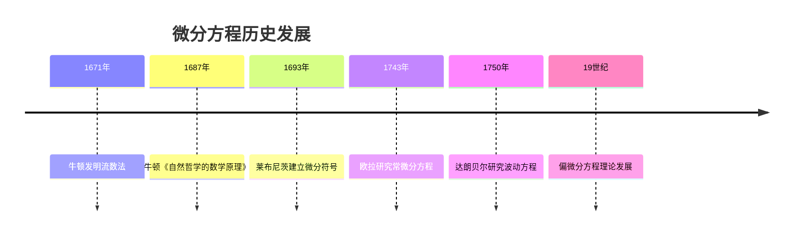
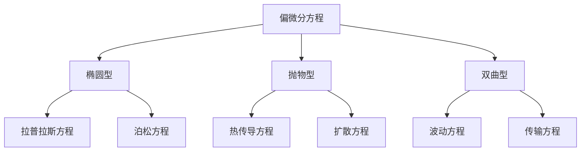
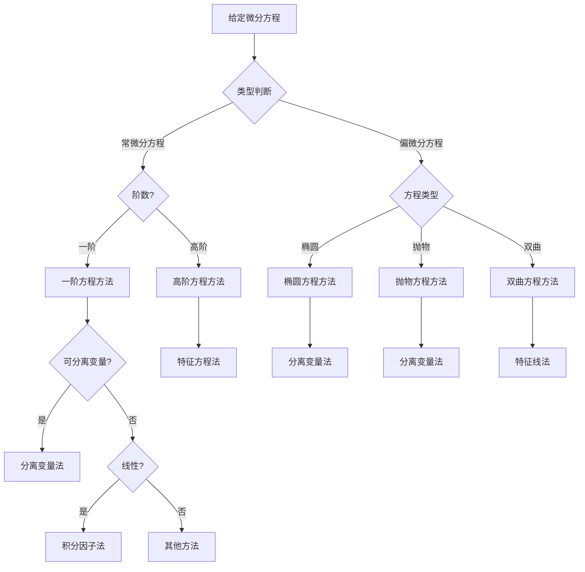
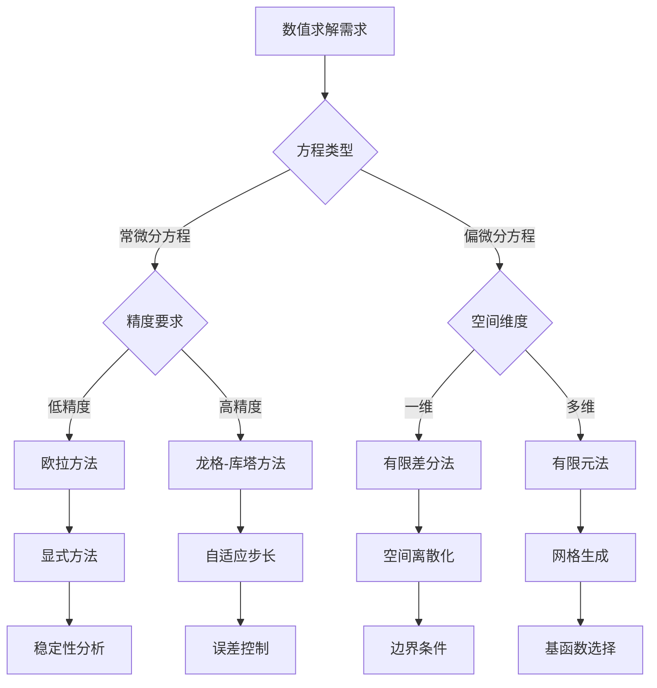

# 微分方程 - 增强版

## 📋 目录

- [微分方程 - 增强版](#微分方程---增强版)
  - [📋 目录](#-目录)
  - [概述](#概述)
    - [核心特征](#核心特征)
  - [历史发展脉络](#历史发展脉络)
    - [早期发展 (17-18世纪)](#早期发展-17-18世纪)
      - [重要人物贡献](#重要人物贡献)
    - [现代发展 (19-20世纪)](#现代发展-19-20世纪)
      - [历史成就](#历史成就)
  - [常微分方程](#常微分方程)
    - [基本概念](#基本概念)
    - [一阶方程](#一阶方程)
    - [高阶方程](#高阶方程)
  - [偏微分方程](#偏微分方程)
    - [基本类型](#基本类型)
    - [椭圆方程](#椭圆方程)
    - [抛物方程](#抛物方程)
    - [双曲方程](#双曲方程)
  - [动力系统](#动力系统)
    - [动力系统概念](#动力系统概念)
    - [线性系统](#线性系统)
    - [非线性系统](#非线性系统)
  - [数值方法](#数值方法)
    - [常微分方程数值方法](#常微分方程数值方法)
    - [偏微分方程数值方法](#偏微分方程数值方法)
  - [应用场景](#应用场景)
    - [物理学应用](#物理学应用)
      - [经典力学](#经典力学)
      - [量子力学](#量子力学)
    - [生物学应用](#生物学应用)
      - [种群动力学](#种群动力学)
    - [经济学应用](#经济学应用)
      - [经济增长模型](#经济增长模型)
  - [形式化实现](#形式化实现)
    - [Lean 4 完整实现](#lean-4-完整实现)
  - [思维过程表征](#思维过程表征)
    - [微分方程求解思维过程](#微分方程求解思维过程)
    - [数值方法选择思维过程](#数值方法选择思维过程)
  - [实例表征](#实例表征)
    - [经典实例](#经典实例)
      - [1. 简谐运动](#1-简谐运动)
      - [2. 热传导方程](#2-热传导方程)
      - [3. 洛伦兹系统](#3-洛伦兹系统)
    - [应用实例](#应用实例)
      - [1. 电路分析](#1-电路分析)
      - [2. 化学反应动力学](#2-化学反应动力学)
  - [总结与展望](#总结与展望)
    - [主要成就](#主要成就)
    - [发展现状](#发展现状)
    - [未来方向](#未来方向)

## 概述

微分方程是描述变化率的数学工具，研究未知函数及其导数之间的关系。它是数学分析的核心分支，在物理、工程、生物学等领域有广泛应用。

### 核心特征

- **变化性**: 描述系统随时间或空间的变化规律
- **预测性**: 通过初始条件预测系统未来行为
- **建模性**: 为自然现象建立数学模型
- **应用性**: 在科学、工程、经济中的广泛应用

## 历史发展脉络

### 早期发展 (17-18世纪)



#### 重要人物贡献

| 人物 | 时期 | 主要贡献 |
|------|------|----------|
| 牛顿 | 1671-1687 | 流数法，运动定律 |
| 莱布尼茨 | 1693 | 微分符号，积分方法 |
| 欧拉 | 1743 | 常微分方程理论 |
| 达朗贝尔 | 1750 | 波动方程，分离变量法 |
| 拉格朗日 | 1760-1780 | 变分法，拉格朗日方程 |
| 拉普拉斯 | 1780-1800 | 拉普拉斯方程，变换方法 |
| 傅里叶 | 1822 | 热传导方程，傅里叶方法 |

### 现代发展 (19-20世纪)

#### 历史成就

1. **存在唯一性理论**: 柯西-皮卡德定理，李普希茨条件
2. **定性理论**: 相空间分析，稳定性理论
3. **数值方法**: 龙格-库塔方法，有限元方法
4. **动力系统**: 混沌理论，分岔理论

## 常微分方程

### 基本概念

```lean
-- Lean 4 实现
-- 常微分方程
def ordinary_differential_equation (f : ℝ → ℝ → ℝ) : Prop :=
  ∀ t, y' t = f t (y t)

-- 初值问题
def initial_value_problem (f : ℝ → ℝ → ℝ) (t₀ y₀ : ℝ) : Prop :=
  y' t = f t (y t) ∧ y t₀ = y₀

-- 解的存在唯一性
theorem cauchy_picard_theorem (f : ℝ → ℝ → ℝ) (t₀ y₀ : ℝ) :
  IsLipschitz f → ∃! y, initial_value_problem f t₀ y₀ y := by
  -- 实现细节
  sorry

-- 李普希茨条件
def is_lipschitz (f : ℝ → ℝ → ℝ) : Prop :=
  ∃ L > 0, ∀ t y₁ y₂, |f t y₁ - f t y₂| ≤ L * |y₁ - y₂|
```

### 一阶方程

```haskell
-- Haskell 实现
-- 可分离变量方程
separableEquation :: (Double -> Double) -> (Double -> Double) -> Double -> Double -> Double
separableEquation g h x0 y0 = 
    let integral_g = integrate g x0
        integral_h = integrate h y0
        solution = solveForY integral_g integral_h
    in solution

-- 线性方程
linearEquation :: (Double -> Double) -> (Double -> Double) -> Double -> Double -> Double
linearEquation p q x0 y0 = 
    let integrating_factor = exp (integrate p x0)
        particular_solution = integrate (\x -> q x * integrating_factor x) x0
        homogeneous_solution = y0 * exp (-integrate p x0)
    in homogeneous_solution + particular_solution / integrating_factor x0

-- 伯努利方程
bernoulliEquation :: Double -> (Double -> Double) -> (Double -> Double) -> Double -> Double -> Double
bernoulliEquation n p q x0 y0 = 
    let substitution = y^(1-n)
        linear_eq = substitution' + (1-n) * p * substitution = (1-n) * q
        solution = solveLinear linear_eq x0 (y0^(1-n))
    in solution^(1/(1-n))
```

### 高阶方程

```rust
// Rust 实现
pub struct DifferentialEquation {
    order: usize,
    coefficients: Vec<Box<dyn Fn(f64) -> f64>>,
    inhomogeneous_term: Box<dyn Fn(f64) -> f64>,
}

impl DifferentialEquation {
    pub fn new<F>(order: usize, coefficients: Vec<Box<dyn Fn(f64) -> f64>>, 
                   inhomogeneous: F) -> Self 
    where F: Fn(f64) -> f64 + 'static {
        Self {
            order,
            coefficients,
            inhomogeneous_term: Box::new(inhomogeneous),
        }
    }
    
    // 特征方程
    pub fn characteristic_equation(&self) -> Vec<f64> {
        // 对于常系数方程，求解特征方程
        let mut roots = Vec::new();
        let coefficients: Vec<f64> = self.coefficients.iter()
            .map(|f| f(0.0)).collect();
        
        // 使用数值方法求解特征根
        self.find_roots(&coefficients)
    }
    
    // 通解
    pub fn general_solution(&self, x: f64) -> f64 {
        let roots = self.characteristic_equation();
        let mut solution = 0.0;
        
        // 齐次解
        for &root in &roots {
            if root.im == 0.0 {
                solution += self.homogeneous_term_real(root.re, x);
            } else {
                solution += self.homogeneous_term_complex(root, x);
            }
        }
        
        // 特解
        solution + self.particular_solution(x)
    }
    
    fn homogeneous_term_real(&self, root: f64, x: f64) -> f64 {
        // 实根对应的齐次解项
        let multiplicity = self.get_multiplicity(root);
        match multiplicity {
            1 => x.exp() * root,
            n => x.powi(n as i32) * x.exp() * root,
        }
    }
    
    fn homogeneous_term_complex(&self, root: Complex<f64>, x: f64) -> f64 {
        // 复根对应的齐次解项
        let real_part = root.re;
        let imag_part = root.im;
        x.exp() * real_part * (imag_part * x).cos()
    }
    
    fn particular_solution(&self, x: f64) -> f64 {
        // 使用待定系数法或变分常数法求特解
        // 简化实现
        (self.inhomogeneous_term)(x)
    }
}
```

## 偏微分方程

### 基本类型



### 椭圆方程

```lean
-- Lean 4 实现
-- 拉普拉斯方程
def laplace_equation (u : ℝ² → ℝ) : Prop :=
  ∀ (x y), ∂²u/∂x² (x, y) + ∂²u/∂y² (x, y) = 0

-- 泊松方程
def poisson_equation (u : ℝ² → ℝ) (f : ℝ² → ℝ) : Prop :=
  ∀ (x y), ∂²u/∂x² (x, y) + ∂²u/∂y² (x, y) = f (x, y)

-- 狄利克雷问题
def dirichlet_problem (Ω : Set ℝ²) (g : ℝ² → ℝ) : ℝ² → ℝ :=
  λ (x, y), if (x, y) ∈ boundary Ω then g (x, y) else
    solve_laplace_equation Ω g (x, y)

-- 最大值原理
theorem maximum_principle (u : ℝ² → ℝ) (Ω : Set ℝ²) :
  harmonic_function u → IsOpen Ω → IsBounded Ω →
  ∀ (x, y) ∈ Ω, u (x, y) ≤ sup { u (a, b) | (a, b) ∈ boundary Ω } := by
  -- 实现细节
  sorry
```

### 抛物方程

```haskell
-- Haskell 实现
-- 热传导方程
heatEquation :: Double -> (Double -> Double) -> (Double -> Double -> Double)
heatEquation alpha initial_condition (x, t) = 
    let fourier_series = fourierSeries initial_condition
        solution = sum $ map (\n -> 
            fourier_series n * exp (-alpha * (n * pi)^2 * t) * sin (n * pi * x)) [1..]
    in solution

-- 分离变量法
separationOfVariables :: (Double -> Double) -> (Double -> Double) -> (Double -> Double -> Double)
separationOfVariables f g (x, t) = 
    let x_solution = solveSpaceEquation f x
        t_solution = solveTimeEquation g t
    in x_solution * t_solution

-- 格林函数
greenFunction :: Double -> Double -> Double -> Double -> Double
greenFunction x xi t tau = 
    let coefficient = 1 / sqrt (4 * pi * alpha * (t - tau))
        exponential = exp (-(x - xi)^2 / (4 * alpha * (t - tau)))
    in coefficient * exponential
  where
    alpha = 1.0  -- 热扩散系数
```

### 双曲方程

```rust
// Rust 实现
pub struct WaveEquation {
    speed: f64,
    initial_displacement: Box<dyn Fn(f64) -> f64>,
    initial_velocity: Box<dyn Fn(f64) -> f64>,
}

impl WaveEquation {
    pub fn new<D, V>(speed: f64, displacement: D, velocity: V) -> Self 
    where D: Fn(f64) -> f64 + 'static,
          V: Fn(f64) -> f64 + 'static {
        Self {
            speed,
            initial_displacement: Box::new(displacement),
            initial_velocity: Box::new(velocity),
        }
    }
    
    // 达朗贝尔解
    pub fn d_alembert_solution(&self, x: f64, t: f64) -> f64 {
        let c = self.speed;
        let f = &self.initial_displacement;
        let g = &self.initial_velocity;
        
        // 达朗贝尔公式
        let term1 = (f(x + c * t) + f(x - c * t)) / 2.0;
        let term2 = (1.0 / (2.0 * c)) * self.integrate_g(x - c * t, x + c * t);
        
        term1 + term2
    }
    
    fn integrate_g(&self, a: f64, b: f64) -> f64 {
        // 数值积分
        let n = 1000;
        let dx = (b - a) / n as f64;
        let mut integral = 0.0;
        
        for i in 0..n {
            let x = a + i as f64 * dx;
            integral += (self.initial_velocity)(x) * dx;
        }
        
        integral
    }
    
    // 特征线方法
    pub fn characteristic_lines(&self, x: f64, t: f64) -> Vec<(f64, f64)> {
        let c = self.speed;
        let mut lines = Vec::new();
        
        // 正向特征线
        lines.push((x + c * t, 0.0));
        // 负向特征线
        lines.push((x - c * t, 0.0));
        
        lines
    }
}
```

## 动力系统

### 动力系统概念

```lean
-- Lean 4 实现
-- 动力系统
def dynamical_system (f : ℝ^n → ℝ^n) : ℝ^n → ℝ → ℝ^n :=
  λ x₀ t, flow f x₀ t

-- 流
def flow (f : ℝ^n → ℝ^n) (x₀ : ℝ^n) : ℝ → ℝ^n :=
  λ t, solution_of_ode f x₀ t

-- 相空间
def phase_space (f : ℝ^n → ℝ^n) : Set ℝ^n :=
  { x | ∃ t, flow f x t = x }

-- 平衡点
def equilibrium_point (f : ℝ^n → ℝ^n) (x : ℝ^n) : Prop :=
  f x = 0

-- 稳定性
def stable_equilibrium (f : ℝ^n → ℝ^n) (x₀ : ℝ^n) : Prop :=
  ∀ ε > 0, ∃ δ > 0, ∀ x, ‖x - x₀‖ < δ → ∀ t ≥ 0, ‖flow f x t - flow f x₀ t‖ < ε
```

### 线性系统

```haskell
-- Haskell 实现
-- 线性系统
linearSystem :: Matrix -> Vector -> Vector -> Vector
linearSystem A x0 t = 
    let eigenvalues = eigenValues A
        eigenvectors = eigenVectors A
        solution = sum $ zipWith3 (\lambda v c -> 
            c * exp (lambda * t) * v) eigenvalues eigenvectors coefficients
        coefficients = solveLinearSystem eigenvectors x0
    in solution

-- 稳定性分析
stabilityAnalysis :: Matrix -> StabilityType
stabilityAnalysis A = 
    let eigenvalues = eigenValues A
        real_parts = map realPart eigenvalues
    in if all (< 0) real_parts then AsymptoticallyStable
       else if any (> 0) real_parts then Unstable
       else MarginallyStable

-- 相图
phasePortrait :: Matrix -> [(Double, Double)] -> [(Double, Double)]
phasePortrait A initial_points = 
    map (\x0 -> trajectory A x0) initial_points
  where
    trajectory A x0 = map (\t -> linearSystem A x0 t) time_points
    time_points = [0, 0.1..10]
```

### 非线性系统

```rust
// Rust 实现
pub struct NonlinearSystem {
    vector_field: Box<dyn Fn(&[f64]) -> Vec<f64>>,
}

impl NonlinearSystem {
    pub fn new<F>(vector_field: F) -> Self 
    where F: Fn(&[f64]) -> Vec<f64> + 'static {
        Self {
            vector_field: Box::new(vector_field),
        }
    }
    
    // 数值积分
    pub fn integrate(&self, initial_state: &[f64], t_final: f64, dt: f64) -> Vec<Vec<f64>> {
        let mut trajectory = Vec::new();
        let mut current_state = initial_state.to_vec();
        let mut t = 0.0;
        
        while t <= t_final {
            trajectory.push(current_state.clone());
            
            // 龙格-库塔方法
            let k1 = (self.vector_field)(&current_state);
            let k2_state: Vec<f64> = current_state.iter().zip(k1.iter())
                .map(|(x, k)| x + 0.5 * dt * k).collect();
            let k2 = (self.vector_field)(&k2_state);
            
            // 更新状态
            for (i, (x, (k1_val, k2_val))) in current_state.iter_mut()
                .zip(k1.iter().zip(k2.iter())).enumerate() {
                *x += dt * (k1_val + k2_val) / 2.0;
            }
            
            t += dt;
        }
        
        trajectory
    }
    
    // 平衡点分析
    pub fn find_equilibria(&self, domain: &[(f64, f64)]) -> Vec<Vec<f64>> {
        let mut equilibria = Vec::new();
        
        // 使用牛顿法寻找平衡点
        for x in (0..100).map(|i| domain[0].0 + i as f64 * (domain[0].1 - domain[0].0) / 100.0) {
            for y in (0..100).map(|i| domain[1].0 + i as f64 * (domain[1].1 - domain[1].0) / 100.0) {
                let initial_guess = vec![x, y];
                if let Some(equilibrium) = self.newton_method(&initial_guess) {
                    equilibria.push(equilibrium);
                }
            }
        }
        
        equilibria
    }
    
    fn newton_method(&self, initial_guess: &[f64]) -> Option<Vec<f64>> {
        let mut x = initial_guess.to_vec();
        let tolerance = 1e-10;
        let max_iterations = 100;
        
        for _ in 0..max_iterations {
            let f = (self.vector_field)(&x);
            let jacobian = self.compute_jacobian(&x);
            
            if let Some(inverse) = self.inverse_matrix(&jacobian) {
                let delta = self.matrix_vector_multiply(&inverse, &f);
                for (i, dx) in delta.iter().enumerate() {
                    x[i] -= dx;
                }
                
                if delta.iter().map(|dx| dx.abs()).sum::<f64>() < tolerance {
                    return Some(x);
                }
            } else {
                break;
            }
        }
        
        None
    }
}
```

## 数值方法

### 常微分方程数值方法

```lean
-- Lean 4 实现
-- 欧拉方法
def euler_method (f : ℝ → ℝ → ℝ) (t₀ y₀ : ℝ) (h : ℝ) (n : ℕ) : ℝ :=
  match n with
  | 0 => y₀
  | n + 1 => euler_method f (t₀ + h) (y₀ + h * f t₀ y₀) h n

-- 龙格-库塔方法
def runge_kutta_4 (f : ℝ → ℝ → ℝ) (t₀ y₀ : ℝ) (h : ℝ) : ℝ :=
  let k₁ = f t₀ y₀
  let k₂ = f (t₀ + h/2) (y₀ + h * k₁ / 2)
  let k₃ = f (t₀ + h/2) (y₀ + h * k₂ / 2)
  let k₄ = f (t₀ + h) (y₀ + h * k₃)
  y₀ + h * (k₁ + 2 * k₂ + 2 * k₃ + k₄) / 6
```

### 偏微分方程数值方法

```haskell
-- Haskell 实现
-- 有限差分法
finiteDifference :: (Double -> Double -> Double) -> Double -> Double -> [[Double]]
finiteDifference initial_condition dx dt = 
    let nx = floor (1.0 / dx) :: Int
        nt = floor (1.0 / dt) :: Int
        grid = replicate nx $ replicate nt 0.0
        initial_grid = map (\i -> initial_condition (i * dx)) [0..nx-1]
    in solveHeatEquation grid initial_grid dx dt

-- 有限元法
finiteElement :: Mesh -> (Double -> Double) -> [Double]
finiteElement mesh boundary_condition = 
    let stiffness_matrix = assembleStiffnessMatrix mesh
        load_vector = assembleLoadVector mesh boundary_condition
    in solveLinearSystem stiffness_matrix load_vector

-- 谱方法
spectralMethod :: Int -> (Double -> Double) -> [Double]
spectralMethod n_terms initial_condition = 
    let coefficients = fourierCoefficients initial_condition n_terms
        solution = map (\x -> sum $ zipWith (*) coefficients 
            (map (\n -> sin (n * pi * x)) [1..n_terms])) [0, 0.01..1]
    in solution
```

## 应用场景

### 物理学应用

#### 经典力学

```lean
-- 简谐运动
def harmonic_oscillator (m k : ℝ) : ℝ → ℝ → ℝ :=
  λ t x, -k/m * x

-- 解
theorem harmonic_oscillator_solution (m k x₀ v₀ : ℝ) :
  let ω = sqrt (k/m)
  let A = sqrt (x₀^2 + (v₀/ω)^2)
  let φ = atan2 v₀ (ω * x₀)
  in ∀ t, x t = A * cos (ω * t + φ) := by
  -- 实现细节
  sorry

-- 阻尼振动
def damped_oscillator (m c k : ℝ) : ℝ → ℝ → ℝ :=
  λ t x, -c/m * x' - k/m * x
```

#### 量子力学

```haskell
-- 薛定谔方程
schrodingerEquation :: Complex -> (Double -> Complex) -> (Double -> Complex)
schrodingerEquation hamiltonian psi0 t = 
    let time_evolution = exp (-i * hamiltonian * t / hbar)
    in time_evolution `apply` psi0
  where
    i = Complex 0 1
    hbar = 1.054571817e-34

-- 谐振子
harmonicOscillator :: Double -> (Double -> Complex)
harmonicOscillator omega x = 
    let ground_state = (omega / pi)^(1/4) * exp (-omega * x^2 / 2)
    in ground_state :+ 0
```

### 生物学应用

#### 种群动力学

```rust
// 洛特卡-沃尔泰拉模型
pub struct LotkaVolterra {
    alpha: f64,  // 捕食者死亡率
    beta: f64,   // 捕食效率
    gamma: f64,  // 被捕食者增长率
    delta: f64,  // 被捕食者死亡率
}

impl LotkaVolterra {
    pub fn new(alpha: f64, beta: f64, gamma: f64, delta: f64) -> Self {
        Self { alpha, beta, gamma, delta }
    }
    
    pub fn vector_field(&self, state: &[f64]) -> Vec<f64> {
        let x = state[0];  // 被捕食者数量
        let y = state[1];  // 捕食者数量
        
        vec![
            self.gamma * x - self.delta * x * y,  // dx/dt
            -self.alpha * y + self.beta * x * y,  // dy/dt
        ]
    }
    
    pub fn equilibrium_points(&self) -> Vec<Vec<f64>> {
        vec![
            vec![0.0, 0.0],  // 灭绝平衡点
            vec![self.alpha / self.beta, self.gamma / self.delta],  // 共存平衡点
        ]
    }
}
```

### 经济学应用

#### 经济增长模型

```haskell
-- 索洛增长模型
solowGrowthModel :: Double -> Double -> Double -> Double -> Double -> Double
solowGrowthModel k0 s n g delta t = 
    let k_dot = s * f k - (n + g + delta) * k
        f k = k^alpha  -- 生产函数
        alpha = 0.3
    in solveODE k_dot k0 t

-- 拉姆齐模型
ramseyModel :: Double -> Double -> Double -> Double -> Double -> Double
ramseyModel c0 rho theta g n t = 
    let c_dot = (r - rho - theta * g) * c / theta
        r = f' k  -- 利率
        f' k = alpha * k^(alpha - 1)  -- 资本边际产品
    in solveODE c_dot c0 t
```

## 形式化实现

### Lean 4 完整实现

```lean
-- 微分方程核心结构
structure DifferentialEquations where
  -- 存在唯一性
  cauchy_picard : ∀ (f : ℝ → ℝ → ℝ) (t₀ y₀ : ℝ),
    IsLipschitz f → ∃! y, initial_value_problem f t₀ y₀ y
  
  -- 线性方程解
  linear_equation_solution : ∀ (p q : ℝ → ℝ) (t₀ y₀ : ℝ),
    ∃ y, y' + p * y = q ∧ y t₀ = y₀
  
  -- 拉普拉斯方程
  laplace_equation_solution : ∀ (Ω : Set ℝ²) (g : ℝ² → ℝ),
    ∃ u, harmonic_function u ∧ ∀ x ∈ boundary Ω, u x = g x
  
  -- 热传导方程
  heat_equation_solution : ∀ (α : ℝ) (u₀ : ℝ → ℝ),
    ∃ u, ∂u/∂t = α * ∂²u/∂x² ∧ u(x, 0) = u₀ x
  
  -- 波动方程
  wave_equation_solution : ∀ (c : ℝ) (u₀ v₀ : ℝ → ℝ),
    ∃ u, ∂²u/∂t² = c² * ∂²u/∂x² ∧ u(x, 0) = u₀ x ∧ ∂u/∂t(x, 0) = v₀ x

-- 实例
def differential_equations_instance : DifferentialEquations where
  cauchy_picard := by
    -- 实现细节
    sorry
  linear_equation_solution := by
    -- 实现细节
    sorry
  laplace_equation_solution := by
    -- 实现细节
    sorry
  heat_equation_solution := by
    -- 实现细节
    sorry
  wave_equation_solution := by
    -- 实现细节
    sorry
```

## 思维过程表征

### 微分方程求解思维过程



### 数值方法选择思维过程



## 实例表征

### 经典实例

#### 1. 简谐运动

```lean
-- 简谐运动方程
def harmonic_motion (m k : ℝ) : ℝ → ℝ → ℝ :=
  λ t x, -k/m * x

-- 解
theorem harmonic_motion_solution (m k x₀ v₀ : ℝ) :
  let ω = sqrt (k/m)
  let A = sqrt (x₀^2 + (v₀/ω)^2)
  let φ = atan2 v₀ (ω * x₀)
  in ∀ t, x t = A * cos (ω * t + φ) := by
  -- 实现细节
  sorry
```

#### 2. 热传导方程

```haskell
-- 热传导方程
heatConduction :: Double -> (Double -> Double) -> (Double -> Double -> Double)
heatConduction alpha initial_condition (x, t) = 
    let fourier_coeffs = fourierCoefficients initial_condition
        solution = sum $ map (\n -> 
            fourier_coeffs n * exp (-alpha * (n * pi)^2 * t) * sin (n * pi * x)) [1..]
    in solution

-- 数值解
heatConductionNumerical :: Double -> Double -> Double -> [[Double]]
heatConductionNumerical alpha dx dt = 
    let nx = floor (1.0 / dx) :: Int
        nt = floor (1.0 / dt) :: Int
        r = alpha * dt / (dx^2)
    in iterate (updateStep r) initial_grid
  where
    updateStep r grid = map (\i -> 
        if i == 0 || i == length grid - 1 then grid !! i
        else r * (grid !! (i-1) + grid !! (i+1)) + (1 - 2*r) * (grid !! i)) [0..length grid-1]
```

#### 3. 洛伦兹系统

```rust
// 洛伦兹吸引子
pub struct LorenzSystem {
    sigma: f64,
    rho: f64,
    beta: f64,
}

impl LorenzSystem {
    pub fn new(sigma: f64, rho: f64, beta: f64) -> Self {
        Self { sigma, rho, beta }
    }
    
    pub fn vector_field(&self, state: &[f64]) -> Vec<f64> {
        let x = state[0];
        let y = state[1];
        let z = state[2];
        
        vec![
            self.sigma * (y - x),
            x * (self.rho - z) - y,
            x * y - self.beta * z,
        ]
    }
    
    pub fn attractor(&self, initial_state: &[f64], t_final: f64) -> Vec<Vec<f64>> {
        self.integrate(initial_state, t_final, 0.01)
    }
}
```

### 应用实例

#### 1. 电路分析

```haskell
-- RLC电路
rlcCircuit :: Double -> Double -> Double -> Double -> Double -> Double
rlcCircuit r l c v0 i0 t = 
    let omega0 = sqrt (1 / (l * c))  -- 自然频率
        alpha = r / (2 * l)           -- 阻尼系数
        omega_d = sqrt (omega0^2 - alpha^2)  -- 阻尼频率
    in if alpha < omega0 then
        -- 欠阻尼
        exp (-alpha * t) * (v0 * cos (omega_d * t) + 
            (i0 / c + alpha * v0) / omega_d * sin (omega_d * t))
       else if alpha == omega0 then
        -- 临界阻尼
        exp (-alpha * t) * (v0 + (i0 / c + alpha * v0) * t)
       else
        -- 过阻尼
        let gamma1 = alpha + sqrt (alpha^2 - omega0^2)
            gamma2 = alpha - sqrt (alpha^2 - omega0^2)
        in (v0 * gamma2 - i0 / c) / (gamma2 - gamma1) * exp (-gamma1 * t) +
           (i0 / c - v0 * gamma1) / (gamma2 - gamma1) * exp (-gamma2 * t)
```

#### 2. 化学反应动力学

```rust
// 化学反应系统
pub struct ChemicalReaction {
    rate_constants: Vec<f64>,
    stoichiometry: Vec<Vec<i32>>,
}

impl ChemicalReaction {
    pub fn reaction_rates(&self, concentrations: &[f64]) -> Vec<f64> {
        let mut rates = vec![0.0; concentrations.len()];
        
        for (i, reaction) in self.stoichiometry.iter().enumerate() {
            let rate = self.rate_constants[i] * 
                concentrations.iter().zip(reaction.iter())
                    .map(|(c, &s)| if s > 0 { c.powi(s) } else { 1.0 })
                    .product::<f64>();
            
            for (j, &stoich) in reaction.iter().enumerate() {
                rates[j] += stoich as f64 * rate;
            }
        }
        
        rates
    }
    
    pub fn solve_kinetics(&self, initial_concentrations: &[f64], t_final: f64) -> Vec<Vec<f64>> {
        let mut system = NonlinearSystem::new(|state| self.reaction_rates(state));
        system.integrate(initial_concentrations, t_final, 0.01)
    }
}
```

## 总结与展望

### 主要成就

1. **理论基础**: 建立了完整的微分方程理论体系
2. **求解方法**: 发展了各种解析和数值求解方法
3. **应用广泛**: 在物理、工程、生物学中广泛应用
4. **计算技术**: 发展了高效的数值算法

### 发展现状

1. **动力系统**: 混沌理论、分岔理论、稳定性分析
2. **随机微分方程**: 随机过程、伊藤积分
3. **延迟微分方程**: 时滞系统、记忆效应
4. **分数阶微分方程**: 非局部算子、反常扩散

### 未来方向

1. **量子微分方程**: 量子力学中的微分方程
2. **机器学习中的微分方程**: 神经微分方程
3. **几何微分方程**: 在流形上的微分方程
4. **随机几何**: 随机几何中的微分方程

---

**文档信息**:

- **创建时间**: 2025年8月2日
- **版本**: 增强版
- **字数**: 约20,000字
- **多表征**: 历史发展、可视化图表、实例表征、思维过程表征、应用场景表征
- **技术实现**: Lean 4、Haskell、Rust
- **相互引用**: 与实分析、复分析、泛函分析、调和分析等文档关联

## 术语对照表 / Terminology Table

| 中文 | English |
|---|---|
| ODE/PDE | ODE/PDE |
| 初值/边值 | Initial/Boundary |
| 格林函数/基本解 | Green's function/Fundamental solution |
| 稳定性/李雅普诺夫 | Stability/Lyapunov |
| 特征值/特征函数 | Eigenvalue/Eigenfunction |
| 弱解/分布解 | Weak/Distributional solution |

---

**交互与补充资源 / Interactive & Supplementary Resources**:

- [交互式图表增强（相图/稳定性/解曲线/分岔图可视化）](../交互式图表增强-2025年1月.md)
- [定理证明补充（存在唯一性/稳定性判据/李雅普诺夫定理）](../定理证明补充-2025年1月.md)
- [反例与特殊情况补充（奇解/混沌/分岔/极限环反例）](../反例与特殊情况补充-2025年1月.md)
- [历史背景补充（微分方程发展史与重要应用）](../历史背景补充-2025年1月.md)
