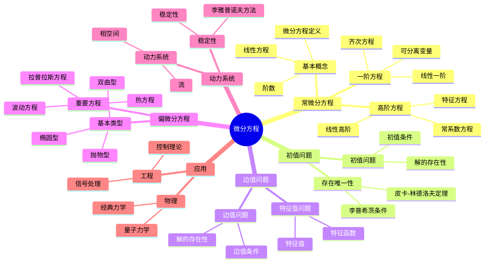

# 5. 微分方程 / Differential Equations

**主题编号**: B.03.05
**创建日期**: 2025年11月21日
**最后更新**: 2025年11月21日

---

## 5.1 概述 / Overview (编号: B.03.05.01)

微分方程是研究函数及其导数之间关系的数学分支，它在物理学、工程学、生物学等领域有重要应用。微分方程分为常微分方程和偏微分方程两大类，包括初值问题、边值问题、动力系统等重要内容。

## 🗺️ 微分方程核心概念思维导图



## 📊 微分方程核心概念多维知识矩阵

| 概念类别 | 核心概念 | 定义要点 | 关键性质 | 典型例子 | 应用场景 |
|---------|---------|---------|---------|---------|---------|
| 常微分方程 | 微分方程 | 函数与导数关系 | 阶数 | y' = f(x,y) | 数学物理 |
| 常微分方程 | 线性方程 | 线性组合 | 叠加原理 | y''+py'+qy=f | 数学物理 |
| 常微分方程 | 特征方程 | 常系数方程 | 特征根 | r²+pr+q=0 | 解的结构 |
| 初值问题 | 初值问题 | 初始条件 | 存在唯一性 | y(x₀)=y₀ | 实际问题 |
| 初值问题 | 皮卡-林德洛夫 | 存在唯一性 | 李普希茨条件 | 存在唯一性 | 理论保证 |
| 边值问题 | 边值问题 | 边界条件 | 解的存在性 | y(a)=α, y(b)=β | 实际问题 |
| 边值问题 | 特征值问题 | 特征值 | 特征函数 | -y''=λy | 数学物理 |
| 偏微分方程 | 椭圆型 | 拉普拉斯型 | 椭圆性 | Δu=0 | 稳态问题 |
| 偏微分方程 | 抛物型 | 热方程型 | 扩散性 | u_t=Δu | 扩散问题 |
| 偏微分方程 | 双曲型 | 波动方程型 | 波动性 | u_tt=Δu | 波动问题 |
| 动力系统 | 动力系统 | 演化方程 | 相空间 | dx/dt=f(x) | 动力学 |
| 动力系统 | 稳定性 | 平衡点 | 李雅普诺夫 | 稳定性 | 控制理论 |
| 应用 | 经典力学 | 牛顿方程 | 运动方程 | F=ma | 物理 |
| 应用 | 控制理论 | 系统方程 | 控制性 | ẋ=Ax+Bu | 工程 |

## 5.2 常微分方程 / Ordinary Differential Equations

### 5.2.1 基本概念 / Basic Concepts

**定义 5.1** (常微分方程 / Ordinary Differential Equation)
常微分方程是形如：
$$F(x, y, y', y'', \ldots, y^{(n)}) = 0$$

的方程，其中 $y$ 是未知函数，$y', y'', \ldots, y^{(n)}$ 是 $y$ 的导数。

**定义 5.2** (阶数 / Order)
微分方程的阶数是方程中出现的最高阶导数的阶数。

**定义 5.3** (线性微分方程 / Linear Differential Equation)
线性微分方程是形如：
$$a_n(x) y^{(n)} + a_{n-1}(x) y^{(n-1)} + \cdots + a_1(x) y' + a_0(x) y = f(x)$$

的方程。

### 5.2.2 一阶微分方程 / First-Order Differential Equations

**定义 5.4** (可分离变量方程 / Separable Equation)
可分离变量方程形如：
$$\frac{dy}{dx} = f(x) g(y)$$

**定理 5.1** (可分离变量方程的解法)
可分离变量方程的解为：
$$\int \frac{dy}{g(y)} = \int f(x) dx$$

**定义 5.5** (线性一阶方程 / Linear First-Order Equation)
线性一阶方程形如：
$$\frac{dy}{dx} + P(x) y = Q(x)$$

**定理 5.2** (线性一阶方程的解)
线性一阶方程的解为：
$$y = e^{-\int P(x) dx} \leqqft(\int Q(x) e^{\int P(x) dx} dx + C\right)$$

### 5.2.3 高阶线性微分方程 / Higher-Order Linear Differential Equations

**定义 5.6** (齐次方程 / Homogeneous Equation)
齐次线性微分方程形如：
$$a_n(x) y^{(n)} + a_{n-1}(x) y^{(n-1)} + \cdots + a_1(x) y' + a_0(x) y = 0$$

**定理 5.3** (齐次方程的解空间)
$n$ 阶齐次线性微分方程的解空间是 $n$ 维向量空间。

**定义 5.7** (特征方程 / Characteristic Equation)
常系数齐次方程的特征方程为：
$$a_n r^n + a_{n-1} r^{n-1} + \cdots + a_1 r + a_0 = 0$$

**定理 5.4** (常系数齐次方程的解)
设特征方程的根为 $r_1, r_2, \ldots, r_n$，则方程的通解为：
$$y = C_1 e^{r_1 x} + C_2 e^{r_2 x} + \cdots + C_n e^{r_n x}$$

## 5.3 初值问题 / Initial Value Problems

### 5.3.1 初值问题的定义 / Definition of Initial Value Problem

**定义 5.8** (初值问题 / Initial Value Problem)
初值问题是形如：
$$\begin{cases}
y' = f(x, y) \\
y(x_0) = y_0
\end{cases}$$

的问题。

**定理 5.5** (皮卡-林德洛夫定理 / Picard-Lindelöf Theorem)
设 $f$ 在矩形 $R = [x_0 - a, x_0 + a] \times [y_0 - b, y_0 + b]$ 上连续且满足李普希茨条件：
$$|f(x, y_1) - f(x, y_2)| \leqqq L|y_1 - y_2|$$

则初值问题在区间 $[x_0 - h, x_0 + h]$ 上有唯一解，其中：
$$h = \min\leqqft(a, \frac{b}{M}\right), \quad M = \max_{(x,y) \in R} |f(x, y)|$$

### 5.3.2 解的存在性和唯一性 / Existence and Uniqueness

**定理 5.6** (佩亚诺存在定理 / Peano Existence Theorem)
设 $f$ 在矩形 $R$ 上连续，则初值问题在某个区间上有解。

**定理 5.7** (李普希茨条件 / Lipschitz Condition)
如果 $f$ 满足李普希茨条件，则初值问题的解是唯一的。

## 5.4 边值问题 / Boundary Value Problems

### 5.4.1 边值问题的定义 / Definition of Boundary Value Problem

**定义 5.9** (边值问题 / Boundary Value Problem)
边值问题是形如：
$$\begin{cases}
y'' + p(x) y' + q(x) y = f(x) \\
y(a) = \alpha, \quad y(b) = \beta
\end{cases}$$

的问题。

### 5.4.2 格林函数 / Green's Function

**定义 5.10** (格林函数 / Green's Function)
边值问题的格林函数 $G(x, \xi)$ 满足：
$$\begin{cases}
\frac{\partial^2 G}{\partial x^2} + p(x) \frac{\partial G}{\partial x} + q(x) G = \delta(x - \xi) \\
G(a, \xi) = G(b, \xi) = 0
\end{cases}$$

**定理 5.8** (格林函数表示)
边值问题的解可以表示为：
$$y(x) = \int_a^b G(x, \xi) f(\xi) d\xi$$

## 5.5 动力系统 / Dynamical Systems

### 5.5.1 动力系统的定义 / Definition of Dynamical System

**定义 5.11** (动力系统 / Dynamical System)
动力系统是形如：
$$\frac{dx}{dt} = f(x)$$

的自治微分方程组，其中 $x \in \mathbb{R}^n$。

**定义 5.12** (相空间 / Phase Space)
动力系统的相空间是状态变量 $x$ 的空间 $\mathbb{R}^n$。

### 5.5.2 平衡点 / Equilibrium Points

**定义 5.13** (平衡点 / Equilibrium Point)
平衡点是满足 $f(x) = 0$ 的点。

**定义 5.14** (线性化 / Linearization)
在平衡点 $x_0$ 处的线性化系统为：
$$\frac{dy}{dt} = Df(x_0) y$$

其中 $Df(x_0)$ 是雅可比矩阵。

### 5.5.3 稳定性理论 / Stability Theory

**定义 5.15** (李雅普诺夫稳定性 / Lyapunov Stability)
平衡点 $x_0$ 是李雅普诺夫稳定的，当且仅当对于任意 $\varepsilon > 0$，存在 $\delta > 0$ 使得：
$$\|x(0) - x_0\| < \delta \Rightarrow \|x(t) - x_0\| < \varepsilon, \quad \forall t > 0$$

**定义 5.16** (渐近稳定性 / Asymptotic Stability)
平衡点 $x_0$ 是渐近稳定的，当且仅当它是李雅普诺夫稳定的且：
$$\lim_{t \rightarrow \infty} x(t) = x_0$$

**定理 5.9** (线性化稳定性判据)
如果线性化系统的所有特征值都有负实部，则平衡点是渐近稳定的。

## 5.6 偏微分方程 / Partial Differential Equations

### 5.6.1 基本概念 / Basic Concepts

**定义 5.17** (偏微分方程 / Partial Differential Equation)
偏微分方程是包含未知函数及其偏导数的方程。

**定义 5.18** (阶数 / Order)
偏微分方程的阶数是方程中出现的最高阶偏导数的阶数。

### 5.6.2 线性偏微分方程 / Linear Partial Differential Equations

**定义 5.19** (线性偏微分方程 / Linear Partial Differential Equation)
线性偏微分方程形如：
$$Lu = f$$

其中 $L$ 是线性微分算子。

**定义 5.20** (齐次方程 / Homogeneous Equation)
齐次偏微分方程形如：
$$Lu = 0$$

### 5.6.3 分类 / Classification

**定义 5.21** (二阶线性方程的分类 / Classification of Second-Order Linear Equations)
二阶线性方程：
$$a_{11} u_{xx} + 2a_{12} u_{xy} + a_{22} u_{yy} + b_1 u_x + b_2 u_y + cu = f$$

的分类基于判别式 $\Delta = a_{12}^2 - a_{11} a_{22}$：
- $\Delta > 0$：双曲型
- $\Delta = 0$：抛物型
- $\Delta < 0$：椭圆型

## 5.7 波动方程 / Wave Equation

### 5.7.1 一维波动方程 / One-Dimensional Wave Equation

**定义 5.22** (一维波动方程 / One-Dimensional Wave Equation)
一维波动方程：
$$\frac{\partial^2 u}{\partial t^2} = c^2 \frac{\partial^2 u}{\partial x^2}$$

**定理 5.10** (达朗贝尔公式 / d'Alembert's Formula)
一维波动方程的解为：
$$u(x, t) = \frac{1}{2} [f(x + ct) + f(x - ct)] + \frac{1}{2c} \int_{x-ct}^{x+ct} g(s) ds$$

其中 $f$ 和 $g$ 是初始条件：
$$u(x, 0) = f(x), \quad \frac{\partial u}{\partial t}(x, 0) = g(x)$$

### 5.7.2 多维波动方程 / Multi-Dimensional Wave Equation

**定义 5.23** (多维波动方程 / Multi-Dimensional Wave Equation)
多维波动方程：
$$\frac{\partial^2 u}{\partial t^2} = c^2 \Delta u$$

其中 $\Delta$ 是拉普拉斯算子。

## 5.8 热传导方程 / Heat Equation

### 5.8.1 一维热传导方程 / One-Dimensional Heat Equation

**定义 5.24** (一维热传导方程 / One-Dimensional Heat Equation)
一维热传导方程：
$$\frac{\partial u}{\partial t} = \alpha \frac{\partial^2 u}{\partial x^2}$$

**定理 5.11** (分离变量法 / Separation of Variables)
设 $u(x, t) = X(x) T(t)$，则：
$$X'' + \lambda X = 0, \quad T' + \alpha \lambda T = 0$$

**定理 5.12** (傅里叶级数解 / Fourier Series Solution)
在区间 $[0, L]$ 上，解为：
$$u(x, t) = \sum_{n=1}^{\infty} A_n \sin\leqqft(\frac{n\pi x}{L}\right) e^{-\alpha(n\pi/L)^2 t}$$

其中：
$$A_n = \frac{2}{L} \int_0^L f(x) \sin\leqqft(\frac{n\pi x}{L}\right) dx$$

### 5.8.2 多维热传导方程 / Multi-Dimensional Heat Equation

**定义 5.25** (多维热传导方程 / Multi-Dimensional Heat Equation)
多维热传导方程：
$$\frac{\partial u}{\partial t} = \alpha \Delta u$$

## 5.9 拉普拉斯方程 / Laplace Equation

### 5.9.1 拉普拉斯方程的定义 / Definition of Laplace Equation

**定义 5.26** (拉普拉斯方程 / Laplace Equation)
拉普拉斯方程：
$$\Delta u = 0$$

其中 $\Delta$ 是拉普拉斯算子。

### 5.9.2 调和函数 / Harmonic Functions

**定义 5.27** (调和函数 / Harmonic Function)
满足拉普拉斯方程的函数称为调和函数。

**定理 5.13** (平均值性质 / Mean Value Property)
如果 $u$ 是调和函数，则：
$$u(x) = \frac{1}{|B_r(x)|} \int_{B_r(x)} u(y) dy$$

**定理 5.14** (最大值原理 / Maximum Principle)
如果 $u$ 是有界区域 $\Omega$ 内的调和函数，则 $u$ 的最大值和最小值在 $\partial \Omega$ 上达到。

### 5.9.3 狄利克雷问题 / Dirichlet Problem

**定义 5.28** (狄利克雷问题 / Dirichlet Problem)
狄利克雷问题是求解：
$$\begin{cases}
\Delta u = 0, \quad \text{in } \Omega \\
u = f, \quad \text{on } \partial \Omega
\end{cases}$$

**定理 5.15** (泊松积分公式 / Poisson Integral Formula)
在单位球上，狄利克雷问题的解为：
$$u(x) = \frac{1 - |x|^2}{\omega_n} \int_{\partial B_1(0)} \frac{f(y)}{|x-y|^n} d\sigma(y)$$

## 5.10 形式化实现 / Formal Implementation

### 5.10.1 Lean 4 实现 / Lean 4 Implementation

```lean
-- 常微分方程的基本定义
structure OrdinaryDifferentialEquation where
  order : ℕ
  equation : ℝ → ℝ → ℝ → Prop  -- F(x, y, y') = 0

-- 初值问题
structure InitialValueProblem where
  equation : ℝ → ℝ → ℝ  -- y' = f(x, y)
  initial_condition : ℝ × ℝ  -- (x₀, y₀)

-- 解的存在性
theorem picard_lindelof (f : ℝ → ℝ → ℝ) (x₀ y₀ : ℝ)
  (h₁ : continuous_on f rectangle)
  (h₂ : lipschitz_continuous f) :
  ∃! u : ℝ → ℝ,
    ∀ x, u' x = f x (u x) ∧ u x₀ = y₀ :=
  sorry

-- 线性微分方程
class LinearDifferentialEquation where
  coefficients : ℕ → ℝ → ℝ
  inhomogeneous_term : ℝ → ℝ
  order : ℕ

-- 特征方程
def characteristic_equation (eq : LinearDifferentialEquation) : Polynomial ℝ :=
  ∑ i, eq.coefficients i 0 * X^i

-- 动力系统
structure DynamicalSystem where
  dimension : ℕ
  vector_field : ℝ^dimension → ℝ^dimension

-- 平衡点
def equilibrium_points (sys : DynamicalSystem) : Set (ℝ^sys.dimension) :=
  { x | sys.vector_field x = 0 }

-- 线性化
def linearization (sys : DynamicalSystem) (x₀ : ℝ^sys.dimension) : Matrix ℝ :=
  jacobian sys.vector_field x₀

-- 稳定性
class StableEquilibrium (sys : DynamicalSystem) (x₀ : ℝ^sys.dimension) where
  lyapunov_stable : ∀ ε > 0, ∃ δ > 0,
    ∀ x, ‖x - x₀‖ < δ → ∀ t > 0, ‖solution x t - x₀‖ < ε
  asymptotically_stable : ∀ x, ‖x - x₀‖ < δ →
    tendsto (λ t, solution x t) x₀

-- 偏微分方程
structure PartialDifferentialEquation where
  order : ℕ
  equation : ℝ^dimension → ℝ → ℝ → Prop

-- 波动方程
def wave_equation (c : ℝ) : PartialDifferentialEquation :=
  { order := 2
    equation := λ x t u, ∂²u/∂t² = c² * ∂²u/∂x² }

-- 热传导方程
def heat_equation (α : ℝ) : PartialDifferentialEquation :=
  { order := 2
    equation := λ x t u, ∂u/∂t = α * ∂²u/∂x² }

-- 拉普拉斯方程
def laplace_equation : PartialDifferentialEquation :=
  { order := 2
    equation := λ x u, Δ u = 0 }

-- 分离变量法
def separation_of_variables (eq : PartialDifferentialEquation)
  (u : ℝ → ℝ → ℝ) (X : ℝ → ℝ) (T : ℝ → ℝ) : Prop :=
  u x t = X x * T t ∧
  satisfies_ode X ∧ satisfies_ode T

-- 傅里叶级数解
def fourier_series_solution (f : ℝ → ℝ) (L : ℝ) : ℝ → ℝ → ℝ :=
  λ x t, ∑' n, fourier_coefficient f n * sin (n * π * x / L) * exp (-α * (n * π / L)² * t)
```

### 5.10.2 Haskell 实现 / Haskell Implementation

```haskell
-- 常微分方程的基本定义
data OrdinaryDifferentialEquation = ODE
  { order :: Integer
  , equation :: Real -> Real -> Real -> Bool
  }

-- 初值问题
data InitialValueProblem = IVP
  { equation :: Real -> Real -> Real
  , initialCondition :: (Real, Real)
  }

-- 解的存在性
picardLindelof :: (Real -> Real -> Real) -> Real -> Real -> Bool
picardLindelof f x₀ y₀ =
  let continuous = continuousOn f rectangle
      lipschitz = lipschitzContinuous f
  in continuous && lipschitz

-- 线性微分方程
data LinearDifferentialEquation = LinearODE
  { coefficients :: Integer -> Real -> Real
  , inhomogeneousTerm :: Real -> Real
  , order :: Integer
  }

-- 特征方程
characteristicEquation :: LinearDifferentialEquation -> Polynomial Real
characteristicEquation eq =
  sum [coefficients eq i 0 * X^i | i <- [0..order eq]]

-- 动力系统
data DynamicalSystem = DynamicalSystem
  { dimension :: Integer
  , vectorField :: Vector Real -> Vector Real
  }

-- 平衡点
equilibriumPoints :: DynamicalSystem -> [Vector Real]
equilibriumPoints sys =
  [x | x <- allVectors, vectorField sys x == zero]

-- 线性化
linearization :: DynamicalSystem -> Vector Real -> Matrix Real
linearization sys x₀ = jacobian (vectorField sys) x₀

-- 稳定性
class StableEquilibrium sys x₀ where
  lyapunovStable :: Bool
  asymptoticallyStable :: Bool

-- 偏微分方程
data PartialDifferentialEquation = PDE
  { order :: Integer
  , equation :: Vector Real -> Real -> Real -> Bool
  }

-- 波动方程
waveEquation :: Real -> PartialDifferentialEquation
waveEquation c = PDE
  { order = 2
  , equation = \x t u -> ∂²u/∂t² == c² * ∂²u/∂x²
  }

-- 热传导方程
heatEquation :: Real -> PartialDifferentialEquation
heatEquation α = PDE
  { order = 2
  , equation = \x t u -> ∂u/∂t == α * ∂²u/∂x²
  }

-- 拉普拉斯方程
laplaceEquation :: PartialDifferentialEquation
laplaceEquation = PDE
  { order = 2
  , equation = \x u -> laplacian u == 0
  }

-- 分离变量法
separationOfVariables :: PartialDifferentialEquation ->
  (Real -> Real -> Real) -> (Real -> Real) -> (Real -> Real) -> Bool
separationOfVariables eq u X T =
  u x t == X x * T t &&
  satisfiesODE X &&
  satisfiesODE T

-- 傅里叶级数解
fourierSeriesSolution :: (Real -> Real) -> Real -> Real -> Real -> Real
fourierSeriesSolution f L x t =
  sum [fourierCoefficient f n * sin (n * pi * x / L) * exp (-α * (n * pi / L)² * t) | n <- [1..]]

-- 达朗贝尔公式
dAlembertFormula :: (Real -> Real) -> (Real -> Real) -> Real -> Real -> Real
dAlembertFormula f g x t =
  (1/2) * (f (x + c*t) + f (x - c*t)) +
  (1/(2*c)) * integrate (x - c*t) (x + c*t) g

-- 泊松积分公式
poissonIntegralFormula :: (Real -> Real) -> Real -> Real
poissonIntegralFormula f x =
  let r = norm x
      surface_integral = integrate_sphere f x
  in (1 - r²) / (surface_area_unit_ball) * surface_integral
```

## 5.11 应用实例 / Applications

### 5.11.1 物理应用 / Physical Applications

**例 5.1** (简谐振动)
求解简谐振动方程：
$$m \frac{d^2 x}{dt^2} + kx = 0$$

**解**：
特征方程为 $mr^2 + k = 0$，解得 $r = \pm i\sqrt{k/m}$。
通解为：
$$x(t) = A \cos(\omega t) + B \sin(\omega t)$$
其中 $\omega = \sqrt{k/m}$。

### 5.11.2 生物学应用 / Biological Applications

**例 5.2** (种群增长模型)
求解逻辑斯蒂方程：
$$\frac{dN}{dt} = rN\leqqft(1 - \frac{N}{K}\right)$$

**解**：
这是可分离变量方程，解得：
$$N(t) = \frac{K}{1 + \leqqft(\frac{K}{N_0} - 1\right) e^{-rt}}$$

### 5.11.3 工程应用 / Engineering Applications

**例 5.3** (电路分析)
求解RLC电路方程：
$$L \frac{d^2 i}{dt^2} + R \frac{di}{dt} + \frac{1}{C} i = 0$$

**解**：
特征方程为 $Lr^2 + Rr + 1/C = 0$，解得：
$$r = \frac{-R \pm \sqrt{R^2 - 4L/C}}{2L}$$

根据判别式的符号，解有不同的形式。

## 5.12 总结 / Summary

微分方程为现代数学提供了重要的工具：

1. **常微分方程**：为动力学系统提供了基础
2. **偏微分方程**：为物理现象建模提供了工具
3. **动力系统**：为复杂系统分析提供了方法
4. **稳定性理论**：为系统控制提供了理论基础
5. **数值方法**：为实际问题求解提供了算法

这些概念在物理学、工程学、生物学、经济学等领域都有广泛应用，为现代科学提供了重要的数学语言和工具。

---

## 参考文献 / References

### 经典教材 / Classic Textbooks

- Coddington, E. A., Levinson, N. Theory of Ordinary Differential Equations[M]. New York: McGraw-Hill, 1955.
- Evans, L. C. Partial Differential Equations[M]. 2nd Edition. Providence: American Mathematical Society, 2010.
- Arnold, V. I. Ordinary Differential Equations[M]. 3rd Edition. Berlin: Springer-Verlag, 1992.

### 常微分方程教材 / Ordinary Differential Equations Textbooks

- Hirsch, M. W., Smale, S., Devaney, R. L. Differential Equations, Dynamical Systems, and an Introduction to Chaos[M]. 3rd Edition. Amsterdam: Academic Press, 2013.
- Perko, L. Differential Equations and Dynamical Systems[M]. 3rd Edition. New York: Springer-Verlag, 2001.
- Teschl, G. Ordinary Differential Equations and Dynamical Systems[M]. Providence: American Mathematical Society, 2012.

### 偏微分方程教材 / Partial Differential Equations Textbooks

- Evans, L. C. Partial Differential Equations[M]. 2nd Edition. Providence: American Mathematical Society, 2010.
- Renardy, M., Rogers, R. C. An Introduction to Partial Differential Equations[M]. 2nd Edition. New York: Springer-Verlag, 2004.
- McOwen, R. C. Partial Differential Equations: Methods and Applications[M]. 2nd Edition. Upper Saddle River: Prentice Hall, 2003.

### 动力系统教材 / Dynamical Systems Textbooks

- Strogatz, S. H. Nonlinear Dynamics and Chaos: With Applications to Physics, Biology, Chemistry, and Engineering[M]. 2nd Edition. Boca Raton: CRC Press, 2018.
- Guckenheimer, J., Holmes, P. Nonlinear Oscillations, Dynamical Systems, and Bifurcations of Vector Fields[M]. New York: Springer-Verlag, 1983.
- Katok, A., Hasselblatt, B. Introduction to the Modern Theory of Dynamical Systems[M]. Cambridge: Cambridge University Press, 1995.

### 历史文献 / Historical Literature

- Newton, I. Philosophiæ Naturalis Principia Mathematica[M]. London: Royal Society, 1687.
- Euler, L. Institutiones Calculi Integralis[M]. St. Petersburg: Imperial Academy of Sciences, 1768-1770.
- Cauchy, A.-L. Mémoire sur l'intégration des équations différentielles[J]. Comptes rendus de l'Académie des sciences, 1840, 11: 141-159.
- Poincaré, H. Les méthodes nouvelles de la mécanique céleste[M]. Paris: Gauthier-Villars, 1892-1899.

### 中文教材 / Chinese Textbooks

- 丁同仁, 李承治. 常微分方程教程[M]. 第2版. 北京: 高等教育出版社, 2004.
- 姜礼尚, 陈亚浙, 刘西垣, 易法槐. 数学物理方程讲义[M]. 第3版. 北京: 高等教育出版社, 2007.
- 张芷芬, 丁同仁, 黄文灶, 董镇喜. 微分方程定性理论[M]. 北京: 科学出版社, 1985.

### 现代发展文献 / Modern Development Literature

- Lions, J.-L., Magenes, E. Non-Homogeneous Boundary Value Problems and Applications[M]. Berlin: Springer-Verlag, 1972.
- Temam, R. Navier-Stokes Equations: Theory and Numerical Analysis[M]. 3rd Edition. Providence: American Mathematical Society, 2001.

### 在线资源 / Online Resources

- Wikipedia: [Differential equation](https://en.wikipedia.org/wiki/Differential_equation)
- Wikipedia: [Ordinary differential equation](https://en.wikipedia.org/wiki/Ordinary_differential_equation)
- Wikipedia: [Partial differential equation](https://en.wikipedia.org/wiki/Partial_differential_equation)
- MIT OpenCourseWare: [18.03 Differential Equations](https://ocw.mit.edu/courses/18-03-differential-equations-spring-2010/)

## 术语对照表 / Terminology Table

| 中文 | English |
|---|---|
| 常微分/偏微分方程 | ODE/PDE |
| 初值/边值问题 | Initial/Boundary value problem |
| 基本解/格林函数 | Fundamental solution/Green's function |
| 稳定性/李雅普诺夫 | Stability/Lyapunov |
| 特征值/特征函数 | Eigenvalue/Eigenfunction |
| 弱解/分布解 | Weak/Distributional solution |

---

**交互与补充资源 / Interactive & Supplementary Resources**:

- [交互式图表增强（相图/稳定性/解曲线可视化）](../../交互式图表增强-2025年1月.md)
- [定理证明补充（存在唯一性/稳定性判据）](../../定理证明补充-2025年1月.md)
- [反例与特殊情况补充（奇解/混沌/分岔反例）](../../反例与特殊情况补充-2025年1月.md)
- [历史背景补充（微分方程发展史）](../../历史背景补充-2025年1月.md)
