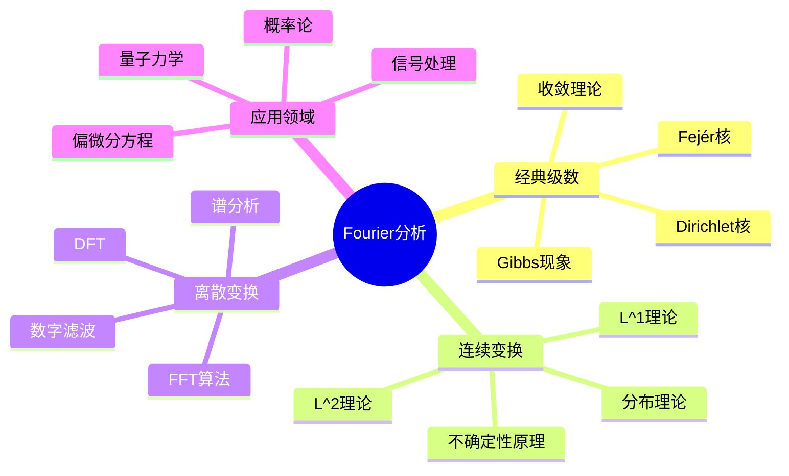

# Fourier分析完全指南

## 1. 概念定义

### 1.1 核心概念

**Fourier分析**是研究函数按三角函数系展开的理论，它将复杂的函数或信号分解为简单正弦波的叠加，揭示了时域与频域之间的深刻联系。

> **定义 1.1.1 (Fourier级数)**：设 $f$ 是以 $2\pi$ 为周期的可积函数，其Fourier级数为
> $$S[f](x) = \frac{a_0}{2} + \sum_{n=1}^{\infty}(a_n\cos nx + b_n\sin nx) = \sum_{n=-\infty}^{\infty}c_n e^{inx}$$
> 其中系数由Euler-Fourier公式给出：
> $$a_n = \frac{1}{\pi}\int_{-\pi}^{\pi}f(x)\cos nx\,dx, \quad b_n = \frac{1}{\pi}\int_{-\pi}^{\pi}f(x)\sin nx\,dx$$
> $$c_n = \frac{1}{2\pi}\int_{-\pi}^{\pi}f(x)e^{-inx}\,dx$$

> **定义 1.1.2 (Fourier变换)**：设 $f \in L^1(\mathbb{R})$，其Fourier变换定义为
> $$\hat{f}(\xi) = \mathcal{F}[f](\xi) = \int_{-\infty}^{\infty}f(x)e^{-2\pi i x\xi}\,dx$$
> 逆变换为
> $$f(x) = \mathcal{F}^{-1}[\hat{f}](x) = \int_{-\infty}^{\infty}\hat{f}(\xi)e^{2\pi i x\xi}\,d\xi$$

> **定义 1.1.3 (离散Fourier变换 DFT)**：对有限序列 $\{f_n\}_{n=0}^{N-1}$，DFT定义为
> $$\hat{f}_k = \sum_{n=0}^{N-1}f_n e^{-2\pi i kn/N}, \quad k = 0, 1, \ldots, N-1$$

### 1.2 概念分类

```
Fourier分析
├── 经典Fourier级数
│   ├── 点态收敛（Dirichlet核）
│   ├── 一致收敛（Dini条件）
│   ├── 均方收敛（Parseval等式）
│   └── 绝对收敛（Bernstein定理）
├── Fourier变换
│   ├── L^1理论（Riemann-Lebesgue引理）
│   ├── L^2理论（Plancherel定理）
│   └── 缓增分布理论
├── 离散Fourier变换
│   ├── DFT基本性质
│   ├── FFT算法（Cooley-Tukey）
│   └── 窗函数与谱泄漏
└── 分布理论视角
    ├── 缓增分布 $\mathcal{S}'$
    ├── Dirac delta的Fourier变换
    └── 卷积定理的推广
```

---

## 2. 定理证明

### 2.1 Riemann-Lebesgue引理

> **定理 2.1.1 (Riemann-Lebesgue)**：若 $f \in L^1(\mathbb{R})$，则 $\hat{f}(\xi) \to 0$ 当 $|\xi| \to \infty$。

**证明**：

**步骤1**：先证对特征函数成立。设 $f = \chi_{[a,b]}$，则
$$\hat{f}(\xi) = \int_a^b e^{-2\pi i x\xi}\,dx = \frac{e^{-2\pi i a\xi} - e^{-2\pi i b\xi}}{2\pi i \xi}$$
因此 $|\hat{f}(\xi)| \leq \frac{1}{\pi|\xi|} \to 0$。

**步骤2**：由线性性，对阶梯函数成立。

**步骤3**：阶梯函数在 $L^1$ 中稠密。对任意 $f \in L^1$，取阶梯函数列 $f_n \to f$，则
$$|\hat{f}(\xi)| \leq |\widehat{f-f_n}(\xi)| + |\hat{f}_n(\xi)| \leq \|f-f_n\|_{L^1} + |\hat{f}_n(\xi)|$$
先令 $|\xi| \to \infty$ 再令 $n \to \infty$ 即得结论。 $\square$

### 2.2 Plancherel定理

> **定理 2.2.1 (Plancherel)**：Fourier变换 $\mathcal{F}: L^2(\mathbb{R}) \to L^2(\mathbb{R})$ 是酉算子，即
> $$\|f\|_{L^2} = \|\hat{f}\|_{L^2}$$
> 或等价地
> $$\int_{-\infty}^{\infty}f(x)\overline{g(x)}\,dx = \int_{-\infty}^{\infty}\hat{f}(\xi)\overline{\hat{g}(\xi)}\,d\xi$$

**证明概要**：

**步骤1**：先证对Schwartz空间 $\mathcal{S}(\mathbb{R})$ 中的函数成立。利用Fubini定理：
$$\int\hat{f}(\xi)\overline{\hat{g}(\xi)}\,d\xi = \iint f(x)\overline{g(y)}\underbrace{\int e^{-2\pi i(x-y)\xi}\,d\xi}_{=\delta(x-y)}\,dxdy = \int f(x)\overline{g(x)}\,dx$$

**步骤2**：$\mathcal{S}(\mathbb{R})$ 在 $L^2(\mathbb{R})$ 中稠密，且Fourier变换是等距的，故可唯一延拓到 $L^2$。 $\square$

### 2.3 卷积定理

> **定理 2.3.1 (卷积定理)**：若 $f, g \in L^1(\mathbb{R})$，则
> $$\mathcal{F}[f * g] = \hat{f} \cdot \hat{g}$$
> $$\mathcal{F}[f \cdot g] = \hat{f} * \hat{g}$$

**证明**：对卷积直接计算：
\begin{align}
\widehat{f*g}(\xi) &= \int_{-\infty}^{\infty}\left(\int_{-\infty}^{\infty}f(y)g(x-y)\,dy\right)e^{-2\pi i x\xi}\,dx \\
&= \int_{-\infty}^{\infty}f(y)e^{-2\pi i y\xi}\left(\int_{-\infty}^{\infty}g(x-y)e^{-2\pi i(x-y)\xi}\,dx\right)dy \\
&= \hat{f}(\xi)\hat{g}(\xi)
\end{align}
其中Fubini定理的应用由 $f, g \in L^1$ 保证。 $\square$

### 2.4 Shannon采样定理

> **定理 2.4.1 (Shannon采样)**：设 $f \in L^2(\mathbb{R})$ 是带宽为 $B$ 的信号（即 $\text{supp}(\hat{f}) \subset [-B, B]$），则
> $$f(x) = \sum_{n=-\infty}^{\infty}f\left(\frac{n}{2B}\right)\text{sinc}\left(2Bx - n\right)$$
> 其中 $\text{sinc}(x) = \frac{\sin(\pi x)}{\pi x}$。

---

## 3. 推导过程

### 3.1 Fourier级数收敛性分析

**Dirichlet核的推导**：

部分和 $S_N(x) = \sum_{n=-N}^{N}c_n e^{inx}$ 可写成
\begin{align}
S_N(x) &= \sum_{n=-N}^{N}\left(\frac{1}{2\pi}\int_{-\pi}^{\pi}f(t)e^{-int}\,dt\right)e^{inx} \\
&= \frac{1}{2\pi}\int_{-\pi}^{\pi}f(t)\left(\sum_{n=-N}^{N}e^{in(x-t)}\right)dt \\
&= \frac{1}{2\pi}\int_{-\pi}^{\pi}f(t)D_N(x-t)\,dt = (f * D_N)(x)
\end{align}

其中 **Dirichlet核** $D_N(x) = \frac{\sin((N+\frac{1}{2})x)}{\sin(x/2)}$。

**收敛条件**：

| 条件 | 结果 | 关键工具 |
|------|------|----------|
| Dini条件 | 点态收敛 | Dirichlet核估计 |
| 有界变差 | 处处收敛 | Jordan判别法 |
| Lipschitz连续 | 一致收敛 | Dini-Lipschitz |
| $f \in L^2$ | 均方收敛 | Parseval等式 |

### 3.2 FFT算法推导

**Cooley-Tukey FFT算法**：

设 $N = 2^m$，将DFT分解为：
\begin{align}
\hat{f}_k &= \sum_{n=0}^{N-1}f_n \omega_N^{kn} \quad (\omega_N = e^{-2\pi i/N}) \\
&= \sum_{n=0}^{N/2-1}f_{2n}\omega_N^{k(2n)} + \sum_{n=0}^{N/2-1}f_{2n+1}\omega_N^{k(2n+1)} \\
&= \sum_{n=0}^{N/2-1}f_{2n}\omega_{N/2}^{kn} + \omega_N^k\sum_{n=0}^{N/2-1}f_{2n+1}\omega_{N/2}^{kn} \\
&= E_k + \omega_N^k O_k
\end{align}

**复杂度分析**：
- 直接DFT：$O(N^2)$
- FFT：$O(N\log N)$（对 $N = 10^6$，加速约5万倍）

---

## 4. 概念关系



### 4.1 知识网络

```
                    Fourier分析
                         |
      +------------------+------------------+
      |                  |                  |
  Fourier级数       Fourier变换         离散Fourier变换
      |                  |                  |
  Dirichlet核      Riemann-Lebesgue      FFT算法
  Parseval等式     Plancherel定理       数字信号处理
      |                  |                  |
      +------------------+------------------+
                         |
              分布理论与不确定性原理
                         |
         +---------------+---------------+
         |               |               |
     偏微分方程      信号处理        量子力学
     热方程求解      滤波器设计      波函数分析
     波动方程        谱估计          对易关系
```

---

## 5. 应用实例

### 5.1 信号处理：音频压缩（MP3）

MP3压缩的核心步骤：
1. **分帧**：将音频分成短时段（约20ms）
2. **加窗**：应用Hanning窗减少频谱泄漏
3. **MDCT**：改良离散余弦变换（Fourier变换的变体）
4. **心理声学模型**：去除人耳不敏感的频率成分
5. **量化与编码**：Huffman编码

**数学原理**：利用人耳的频率分辨率特性，在频域进行有损压缩。

### 5.2 偏微分方程：热方程求解

**热方程初值问题**：
$$\begin{cases}
u_t = \nu\Delta u, & x \in \mathbb{R}^n, t > 0 \\
u(x, 0) = f(x)
\end{cases}$$

**Fourier变换解法**：
1. 对方程做Fourier变换（空间变量）：
   $$\hat{u}_t(\xi, t) = -4\pi^2\nu|\xi|^2\hat{u}(\xi, t)$$

2. 解ODE得：
   $$\hat{u}(\xi, t) = \hat{f}(\xi)e^{-4\pi^2\nu|\xi|^2t}$$

3. 逆变换得到热核解：
   $$u(x, t) = (f * K_t)(x) = \int_{\mathbb{R}^n}f(y)\frac{1}{(4\pi\nu t)^{n/2}}e^{-\frac{|x-y|^2}{4\nu t}}dy$$

### 5.3 图像处理：JPEG压缩

**步骤**：
1. 将图像分块（8×8像素）
2. 对每个块做二维DCT
3. 量化（舍弃高频系数）
4. Zigzag扫描与熵编码

### 5.4 快速计算：循环卷积

利用DFT将 $O(N^2)$ 的卷积变为 $O(N\log N)$：
$$f * g = \mathcal{F}^{-1}[\mathcal{F}[f] \cdot \mathcal{F}[g]]$$

---

## 6. 参考文献与链接

### 6.1 经典文献

1. **Stein, E. M., & Shakarchi, R.** (2003). *Fourier Analysis: An Introduction*. Princeton University Press.
2. **Katznelson, Y.** (2004). *An Introduction to Harmonic Analysis* (3rd ed.). Cambridge University Press.
3. **Strichartz, R. S.** (1994). *A Guide to Distribution Theory and Fourier Transforms*. CRC Press.
4. **Briggs, W. L., & Henson, V. E.** (1995). *The DFT: An Owner's Manual for the Discrete Fourier Transform*. SIAM.

### 6.2 相关概念链接

| 概念 | 链接 |
|------|------|
| Hilbert空间 | [../01-基础数学/Hilbert空间理论](../01-基础数学/Hilbert空间理论.md) |
| Sobolev空间 | [../01-基础数学/Sobolev空间](../01-基础数学/Sobolev空间.md) |
| 卷积 | [../01-基础数学/卷积运算](../01-基础数学/卷积运算.md) |
| 热方程 | [../05-微分方程/热方程理论](../05-微分方程/热方程理论.md) |
| 波动方程 | [../05-微分方程/波动方程](../05-微分方程/波动方程.md) |
| 信号处理 | [../10-应用数学/信号处理基础](../10-应用数学/信号处理基础.md) |
| 不确定性原理 | [../08-数学物理/量子力学基础](../08-数学物理/量子力学基础.md) |

### 6.3 进阶学习路径

```
Fourier分析
    │
    ├──→ 调和分析 (Stein & Shakarchi Vol.2,3,4)
    │       ├── 实分析
    │       ├── 复分析
    │       └── 泛函分析
    │
    ├──→ 偏微分方程
    │       ├── 椭圆型方程
    │       ├── 抛物型方程
    │       └── 双曲型方程
    │
    └──→ 小波分析
            ├── 多分辨率分析
            └── 信号去噪
```

---

## 附录：常用Fourier变换对

| $f(x)$ | $\hat{f}(\xi)$ | 条件 |
|--------|----------------|------|
| $\chi_{[-a,a]}(x)$ | $\frac{\sin(2\pi a\xi)}{\pi\xi}$ | $a > 0$ |
| $e^{-\pi x^2}$ | $e^{-\pi\xi^2}$ | 高斯函数 |
| $e^{-a|x|}$ | $\frac{2a}{a^2 + 4\pi^2\xi^2}$ | $a > 0$ |
| $\delta(x)$ | $1$ | Dirac delta |
| $1$ | $\delta(\xi)$ | 常数函数 |
| $\text{sgn}(x)$ | $\frac{1}{\pi i \xi}$ | 符号函数 |
| $\frac{1}{x}$ | $-i\pi\text{sgn}(\xi)$ | 主值意义 |
| $\sin(2\pi a x)$ | $\frac{i}{2}[\delta(\xi+a) - \delta(\xi-a)]$ | 正弦函数 |
| $\cos(2\pi a x)$ | $\frac{1}{2}[\delta(\xi+a) + \delta(\xi-a)]$ | 余弦函数 |

---

*文档编号：20 | MSC2020分类：42-00 Fourier分析 | 创建日期：2026年4月*
