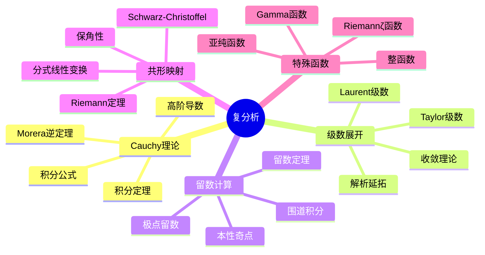

# 复分析核心定理详解

## 1. 概念定义

### 1.1 核心概念

**复分析**（又称复变函数论）研究复平面上全纯函数的性质。全纯函数具有良好的正则性，拥有丰富的结构，是数学中最重要的函数类之一。

> **定义 1.1.1 (全纯函数)**：设 $\Omega \subset \mathbb{C}$ 为开集，函数 $f: \Omega \to \mathbb{C}$ 在 $z_0 \in \Omega$ 处**全纯**（holomorphic），若极限
> $$f'(z_0) = \lim_{h \to 0}\frac{f(z_0 + h) - f(z_0)}{h}$$
> 存在（与 $h \to 0$ 的方向无关）。若 $f$ 在 $\Omega$ 内处处全纯，则称 $f$ 在 $\Omega$ 上全纯。

> **定义 1.1.2 (复积分)**：设 $\gamma: [a,b] \to \mathbb{C}$ 为分段光滑曲线，$f$ 在 $\gamma$ 的邻域内连续，则
> $$\int_{\gamma}f(z)\,dz = \int_a^b f(\gamma(t))\gamma'(t)\,dt$$

> **定义 1.1.3 (留数)**：设 $f$ 在 $z_0$ 处有孤立奇点，在 $z_0$ 的去心邻域内的Laurent展开为
> $$f(z) = \sum_{n=-\infty}^{\infty}a_n(z-z_0)^n$$
> 则 $f$ 在 $z_0$ 处的**留数**为 $\text{Res}(f, z_0) = a_{-1}$。

### 1.2 概念分类

```
复分析核心内容
├── Cauchy理论
│   ├── Cauchy积分定理
│   ├── Cauchy积分公式
│   ├── 高阶导数公式
│   └── Morera定理
├── 级数理论
│   ├── Taylor级数（全纯函数）
│   ├── Laurent级数（孤立奇点）
│   ├── 收敛半径与收敛圆
│   └── 解析延拓
├── 留数理论
│   ├── 留数计算法则
│   ├── 留数定理
│   ├── 围道积分技巧
│   └── 辐角原理
├── 共形映射
│   ├── 保角性
│   ├── 分式线性变换
│   ├── Riemann映射定理
│   └── Schwarz-Christoffel映射
└── 整函数与亚纯函数
    ├── Liouville定理
    ├── 最大模原理
    ├── Hadamard分解
    └── Mittag-Leffler定理
```

---

## 2. 定理证明

### 2.1 Cauchy积分定理

> **定理 2.1.1 (Cauchy积分定理)**：设 $\Omega \subset \mathbb{C}$ 为单连通区域，$f$ 在 $\Omega$ 上全纯，则对任意分段光滑闭曲线 $\gamma \subset \Omega$，有
> $$\oint_{\gamma}f(z)\,dz = 0$$

**证明**（基于Green定理）：

设 $f(z) = u(x,y) + iv(x,y)$，$z = x + iy$，则
$$\oint_{\gamma}f(z)\,dz = \oint_{\gamma}(u\,dx - v\,dy) + i\oint_{\gamma}(v\,dx + u\,dy)$$

由Green定理：
$$\oint_{\gamma}(u\,dx - v\,dy) = \iint_D\left(-\frac{\partial v}{\partial x} - \frac{\partial u}{\partial y}\right)dx\,dy$$
$$\oint_{\gamma}(v\,dx + u\,dy) = \iint_D\left(\frac{\partial u}{\partial x} - \frac{\partial v}{\partial y}\right)dx\,dy$$

由Cauchy-Riemann方程 $\frac{\partial u}{\partial x} = \frac{\partial v}{\partial y}$ 和 $\frac{\partial u}{\partial y} = -\frac{\partial v}{\partial x}$，两积分均为零。 $\square$

### 2.2 Cauchy积分公式

> **定理 2.2.1 (Cauchy积分公式)**：设 $\Omega$ 为单连通区域，$f$ 在 $\Omega$ 上全纯，$\gamma$ 为 $\Omega$ 内包围 $z_0$ 的正向简单闭曲线，则
> $$f(z_0) = \frac{1}{2\pi i}\oint_{\gamma}\frac{f(z)}{z-z_0}\,dz$$

**证明**：

以 $z_0$ 为中心，$\epsilon$ 为半径作小圆 $C_\epsilon$，由Cauchy积分定理的变形：
$$\oint_{\gamma}\frac{f(z)}{z-z_0}\,dz = \oint_{C_\epsilon}\frac{f(z)}{z-z_0}\,dz$$

在 $C_\epsilon$ 上，$z = z_0 + \epsilon e^{i\theta}$，$dz = i\epsilon e^{i\theta}d\theta$，故
$$\oint_{C_\epsilon}\frac{f(z)}{z-z_0}\,dz = \int_0^{2\pi}\frac{f(z_0 + \epsilon e^{i\theta})}{\epsilon e^{i\theta}}i\epsilon e^{i\theta}\,d\theta = i\int_0^{2\pi}f(z_0 + \epsilon e^{i\theta})\,d\theta$$

令 $\epsilon \to 0$，由连续性得 $i \cdot 2\pi f(z_0)$。 $\square$

### 2.3 留数定理

> **定理 2.3.1 (留数定理)**：设 $\Omega$ 为区域，$f$ 在 $\Omega$ 内除孤立奇点 $z_1, \ldots, z_n$ 外全纯，$\gamma$ 为包围这些奇点的正向简单闭曲线，则
> $$\oint_{\gamma}f(z)\,dz = 2\pi i \sum_{k=1}^{n}\text{Res}(f, z_k)$$

**证明**：

在每个奇点 $z_k$ 周围作小圆 $C_k$ 互不重叠，由多连通区域的Cauchy定理：
$$\oint_{\gamma}f(z)\,dz = \sum_{k=1}^{n}\oint_{C_k}f(z)\,dz$$

对 $C_k$ 应用Laurent展开：
$$\oint_{C_k}f(z)\,dz = \oint_{C_k}\sum_{n=-\infty}^{\infty}a_n(z-z_k)^n\,dz = 2\pi i \cdot a_{-1} = 2\pi i \cdot \text{Res}(f, z_k)$$

其中只有 $n = -1$ 项贡献非零积分。 $\square$

### 2.4 Liouville定理

> **定理 2.4.1 (Liouville)**：有界整函数必为常数。

**证明**：设 $|f(z)| \leq M$ 对所有 $z \in \mathbb{C}$ 成立。对任意 $z_0 \in \mathbb{C}$，由Cauchy积分公式的高阶形式：
$$f'(z_0) = \frac{1}{2\pi i}\oint_{|z-z_0|=R}\frac{f(z)}{(z-z_0)^2}\,dz$$

估计得：
$$|f'(z_0)| \leq \frac{1}{2\pi} \cdot \frac{M}{R^2} \cdot 2\pi R = \frac{M}{R} \to 0 \quad (R \to \infty)$$

故 $f'(z_0) = 0$，$f$ 为常数。 $\square$

### 2.5 Riemann映射定理

> **定理 2.5.1 (Riemann映射定理)**：设 $\Omega \subset \mathbb{C}$ 为单连通真子集，$z_0 \in \Omega$，则存在唯一的共形映射 $f: \Omega \to \mathbb{D}$（单位圆盘）满足 $f(z_0) = 0$ 且 $f'(z_0) > 0$。

---

## 3. 推导过程

### 3.1 Taylor级数展开

由Cauchy积分公式，对 $|z - z_0| < R$（$R$ 为到最近奇点的距离）：
\begin{align}
f(z) &= \frac{1}{2\pi i}\oint_{|\zeta-z_0|=R}\frac{f(\zeta)}{\zeta - z}\,d\zeta \\
&= \frac{1}{2\pi i}\oint_{|\zeta-z_0|=R}\frac{f(\zeta)}{(\zeta - z_0) - (z - z_0)}\,d\zeta \\
&= \frac{1}{2\pi i}\oint_{|\zeta-z_0|=R}\frac{f(\zeta)}{\zeta - z_0}\cdot\frac{1}{1 - \frac{z-z_0}{\zeta-z_0}}\,d\zeta \\
&= \frac{1}{2\pi i}\oint_{|\zeta-z_0|=R}\frac{f(\zeta)}{\zeta - z_0}\sum_{n=0}^{\infty}\left(\frac{z-z_0}{\zeta-z_0}\right)^n d\zeta \\
&= \sum_{n=0}^{\infty}\left(\frac{1}{2\pi i}\oint_{|\zeta-z_0|=R}\frac{f(\zeta)}{(\zeta-z_0)^{n+1}}d\zeta\right)(z-z_0)^n \\
&= \sum_{n=0}^{\infty}\frac{f^{(n)}(z_0)}{n!}(z-z_0)^n
\end{align}

### 3.2 Laurent级数与奇点分类

在环形区域 $r < |z - z_0| < R$ 内：
$$f(z) = \underbrace{\sum_{n=0}^{\infty}a_n(z-z_0)^n}_{\text{全纯部分}} + \underbrace{\sum_{n=1}^{\infty}\frac{b_n}{(z-z_0)^n}}_{\text{主要部分}}$$

| 主要部分 | 奇点类型 | 例子 |
|----------|----------|------|
| 无 | 可去奇点 | $\frac{\sin z}{z}$ 在 $z=0$ |
| 有限项 | 极点 | $\frac{1}{z^n}$ |
| 无限项 | 本性奇点 | $e^{1/z}$ 在 $z=0$ |

### 3.3 共形映射的保角性

若 $f$ 在 $z_0$ 处全纯且 $f'(z_0) \neq 0$，则 $f$ 在 $z_0$ 处**保角**（保持角度和定向）。

**证明**：设 $\gamma_1, \gamma_2$ 过 $z_0$，切向量分别为 $\gamma_1'(t_0), \gamma_2'(t_0)$，则
$$\arg(f\circ\gamma_j)'(t_0) = \arg f'(z_0) + \arg\gamma_j'(t_0)$$

两曲线的夹角差：
$$\arg(f\circ\gamma_1)' - \arg(f\circ\gamma_2)' = \arg\gamma_1' - \arg\gamma_2'$$

角度保持不变。 $\square$

---

## 4. 概念关系



### 4.1 核心定理关联图

```
                     全纯函数定义
                          │
          +---------------+---------------+
          │               │               │
    Cauchy-Riemann      可导性          解析性
          │               │               │
          +---------------+---------------+
                          │
                    Cauchy积分定理
                          │
           +--------------+--------------+
           │                             │
    Cauchy积分公式                 原函数存在性
           │                             │
    +------+------+                      │
    │             │                      │
Taylor展开    高阶导数公式          Morera定理
    │             │                      │
    +------+------+                      │
           │                             │
    最大模原理 <---------------------- 解析延拓
           │
    +------+------+
    │             │
Liouville定理  Schwarz引理
    │             │
    +------+------+
           │
    Riemann映射定理
```

---

## 5. 应用实例

### 5.1 实积分计算：Gauss积分

计算 $I = \int_{-\infty}^{\infty}e^{-x^2}\,dx = \sqrt{\pi}$

**复变方法**：考虑矩形围道上的积分 $\oint e^{-z^2}\,dz$，利用全纯函数的性质导出函数方程，最终求得 $I$。

### 5.2 Fresnel积分

$$\int_0^{\infty}\cos(x^2)\,dx = \int_0^{\infty}\sin(x^2)\,dx = \frac{1}{2}\sqrt{\frac{\pi}{2}}$$

**解法**：沿扇形围道（角度 $\pi/4$）积分 $e^{iz^2}$，利用Jordan引理。

### 5.3 有理函数积分

$$\int_0^{\infty}\frac{dx}{1+x^4} = \frac{\pi}{2\sqrt{2}}$$

**解法**：在上半平面围道积分，极点为 $e^{i\pi/4}$ 和 $e^{3i\pi/4}$，计算留数。

### 5.4 Fourier变换计算

$$\int_{-\infty}^{\infty}\frac{\cos x}{1+x^2}\,dx = \frac{\pi}{e}$$

**解法**：考虑 $\oint \frac{e^{iz}}{1+z^2}\,dz$，在上半平面极点 $z = i$ 处留数为 $\frac{e^{-1}}{2i}$。

### 5.5 级数求和

$$\sum_{n=1}^{\infty}\frac{1}{n^2} = \frac{\pi^2}{6}$$

**复变方法**：利用 $\pi\cot(\pi z)$ 的围道积分，其在整数点有留数为1的简单极点。

### 5.6 共形映射应用：流体力学

**问题**：绕圆柱的无旋流动。

**解法**：利用Joukowsky变换 $w = \frac{1}{2}(z + \frac{1}{z})$ 将圆外区域映射到翼型外部，将圆柱绕流问题转化为平板绕流。

---

## 6. 参考文献与链接

### 6.1 经典教材

1. **Ahlfors, L. V.** (1979). *Complex Analysis* (3rd ed.). McGraw-Hill.
2. **Stein, E. M., & Shakarchi, R.** (2003). *Complex Analysis*. Princeton University Press.
3. **Conway, J. B.** (1978). *Functions of One Complex Variable I* (2nd ed.). Springer.
4. **Rudin, W.** (1987). *Real and Complex Analysis* (3rd ed.). McGraw-Hill.

### 6.2 相关概念链接

| 概念 | 链接 |
|------|------|
| Fourier分析 | [../03-分析学/20-Fourier分析完全指南](../03-分析学/20-Fourier分析完全指南.md) |
| 调和函数 | [../03-分析学/调和函数理论](../03-分析学/调和函数理论.md) |
| 偏微分方程 | [../05-微分方程/偏微分方程基础](../05-微分方程/偏微分方程基础.md) |
| 代数基本定理 | [../02-代数学/代数基本定理](../02-代数学/代数基本定理.md) |
| Riemann曲面 | [../04-几何与拓扑/Riemann曲面](../04-几何与拓扑/Riemann曲面.md) |
| 特殊函数 | [../03-分析学/特殊函数理论](../03-分析学/特殊函数理论.md) |

### 6.3 进阶主题

```
复分析
    │
    ├──→ 多复变函数论
    │       ├── 全纯域
    │       └── $\bar{\partial}$-问题
    │
    ├──→ Riemann曲面
    │       ├── 代数曲线
    │       └── Abel定理
    │
    ├──→ 复几何
    │       ├── Kähler流形
    │       └── Hodge理论
    │
    └──→ 值分布理论
            ├── Nevanlinna理论
            └── 复动力系统
```

---

## 附录：常用公式速查

### Cauchy积分公式推广
$$f^{(n)}(z_0) = \frac{n!}{2\pi i}\oint_{\gamma}\frac{f(z)}{(z-z_0)^{n+1}}\,dz$$

### 留数计算公式

| 奇点类型 | 留数公式 |
|----------|----------|
| 简单极点 | $\text{Res}(f, z_0) = \lim_{z \to z_0}(z-z_0)f(z)$ |
| $m$阶极点 | $\text{Res}(f, z_0) = \frac{1}{(m-1)!}\lim_{z \to z_0}\frac{d^{m-1}}{dz^{m-1}}[(z-z_0)^m f(z)]$ |
| 一般情况 | $\text{Res}(f, z_0) = \frac{1}{2\pi i}\oint_{|z-z_0|=\epsilon}f(z)\,dz$ |

### 共形映射性质

分式线性变换（Möbius变换）：$w = \frac{az+b}{cz+d}$，$ad-bc \neq 0$
- 保圆性（直线视为过无穷远点的圆）
- 保对称性
- 由三对对应点唯一确定

---

*文档编号：21 | MSC2020分类：30-00 复分析 | 创建日期：2026年4月*
