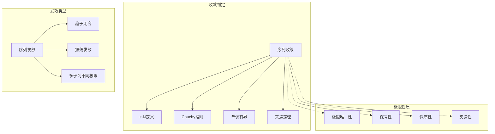
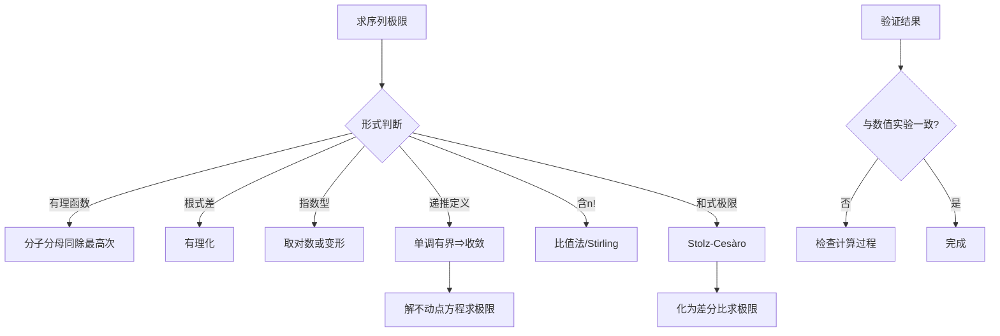

# 序列与级数 - MIT 18.100A 深度对齐

---

## 1. 概念深度分析

### 1.1 序列极限的ε-N定义

**定义**：序列 $(a_n)$ 收敛于 $L$，记作 $\lim_{n \to \infty} a_n = L$，如果：

$$\forall \varepsilon > 0, \exists N \in \mathbb{N}, \forall n \geq N: |a_n - L| < \varepsilon$$

**直观理解**：
```
随着n增大，a_n 可以任意接近 L
      ε-邻域 (L-ε, L+ε)
           ↓
    ───────┬───────
           │ ← 所有n≥N的项都落入此区间
    ───────┴───────
           L
```

### 1.2 子序列与聚点

**定义**：子序列 $(a_{n_k})$ 其中 $n_1 < n_2 < n_3 < ...$

**关键洞察**：
- 原序列收敛 ⇒ 所有子序列收敛于同一极限
- 存在发散子序列 ⇒ 原序列发散
- 两个子序列极限不同 ⇒ 原序列发散

### 1.3 上下极限

**定义**：
$$\limsup_{n \to \infty} a_n = \lim_{n \to \infty} \sup_{k \geq n} a_k = \inf_{n} \sup_{k \geq n} a_k$$

$$\liminf_{n \to \infty} a_n = \lim_{n \to \infty} \inf_{k \geq n} a_k = \sup_{n} \inf_{k \geq n} a_k$$

**意义**：
- $\limsup$：序列的"最大极限点"
- $\liminf$：序列的"最小极限点"
- 序列收敛 ⇔ $\limsup = \liminf$

---

## 2. 属性与关系（含证明）

### 2.1 极限的代数运算

**定理**：若 $\lim a_n = A$，$\lim b_n = B$，则：

| 运算 | 结果 | 条件 |
|-----|------|------|
| $a_n + b_n$ | $A + B$ | 无额外条件 |
| $a_n \cdot b_n$ | $A \cdot B$ | 无额外条件 |
| $a_n / b_n$ | $A / B$ | $B \neq 0$ |
| $|a_n|$ | $|A|$ | 无额外条件 |

**乘积极限证明**：

```
|a_n b_n - AB| = |a_n b_n - a_n B + a_n B - AB|
              ≤ |a_n||b_n - B| + |B||a_n - A|

因(a_n)收敛，故有界：|a_n| ≤ M

|a_n b_n - AB| ≤ M|b_n - B| + |B||a_n - A|

∀ε>0，取N使n≥N时：
  |a_n - A| < ε/(2(|B|+1))
  |b_n - B| < ε/(2M)

则 |a_n b_n - AB| < M·ε/(2M) + |B|·ε/(2(|B|+1)) < ε/2 + ε/2 = ε
```

### 2.2 夹逼定理

**定理**：若 $a_n \leq b_n \leq c_n$ 且 $\lim a_n = \lim c_n = L$，则 $\lim b_n = L$。

**证明**：
- 给定 $\varepsilon > 0$
- $\exists N_1: n \geq N_1 \Rightarrow |a_n - L| < \varepsilon$，即 $L - \varepsilon < a_n$
- $\exists N_2: n \geq N_2 \Rightarrow |c_n - L| < \varepsilon$，即 $c_n < L + \varepsilon$
- 取 $N = \max(N_1, N_2)$，对 $n \geq N$：
  $$L - \varepsilon < a_n \leq b_n \leq c_n < L + \varepsilon$$
- 因此 $|b_n - L| < \varepsilon$ ∎

### 2.3 Cauchy收敛准则

**定理**：序列收敛 ⟺ 序列为Cauchy序列

**证明概要**：

**(⇒)** 收敛 ⇒ Cauchy：
- 设 $a_n \to L$
- $|a_m - a_n| \leq |a_m - L| + |L - a_n|$
- 取 $N$ 使 $n \geq N \Rightarrow |a_n - L| < \varepsilon/2$
- 则 $m, n \geq N \Rightarrow |a_m - a_n| < \varepsilon$

**(⇐)** Cauchy ⇒ 收敛（需完备性）：
- Cauchy序列有界
- Bolzano-Weierstrass ⇒ 有收敛子列
- 可证原序列收敛于同一极限

---

## 3. 习题与完整解答（MIT 18.100A + Harvard Math 55级别）

### 习题 1：ε-N证明训练

**题目**：用ε-N定义证明 $\lim_{n \to \infty} \frac{3n+1}{2n-1} = \frac{3}{2}$

**解答**：

**步骤1：分析**
$$\left|\frac{3n+1}{2n-1} - \frac{3}{2}\right| = \left|\frac{2(3n+1) - 3(2n-1)}{2(2n-1)}\right| = \left|\frac{5}{2(2n-1)}\right|$$

对 $n \geq 1$，$2n - 1 > 0$，故：
$$\left|\frac{5}{2(2n-1)}\right| = \frac{5}{2(2n-1)}$$

**步骤2：找N**
需要 $\frac{5}{2(2n-1)} < \varepsilon$

解得：$5 < 2\varepsilon(2n-1) \Rightarrow n > \frac{5 + 2\varepsilon}{4\varepsilon} = \frac{5}{4\varepsilon} + \frac{1}{2}$

**步骤3：正式证明**

给定 $\varepsilon > 0$，取 $N = \left\lceil \frac{5}{4\varepsilon} + \frac{1}{2} \right\rceil$。

对 $n \geq N$：
$$\left|\frac{3n+1}{2n-1} - \frac{3}{2}\right| = \frac{5}{2(2n-1)} \leq \frac{5}{2(2N-1)} < \frac{5}{2 \cdot \frac{5}{2\varepsilon}} = \varepsilon$$

因此极限为 $\frac{3}{2}$。∎

---

### 习题 2：递推序列的收敛性

**题目**：定义 $a_1 = 1$，$a_{n+1} = \sqrt{2 + a_n}$。证明 $(a_n)$ 收敛并求极限。

**解答**：

**步骤1：证明单调递增**
- $a_2 = \sqrt{3} > 1 = a_1$ ✓
- 假设 $a_{n} > a_{n-1}$
- 则 $a_{n+1} = \sqrt{2 + a_n} > \sqrt{2 + a_{n-1}} = a_n$
- 由归纳法，序列单调递增

**步骤2：证明有上界**
- 猜测上界为2（由 $L = \sqrt{2+L}$ 解得）
- $a_1 = 1 < 2$ ✓
- 假设 $a_n < 2$
- 则 $a_{n+1} = \sqrt{2 + a_n} < \sqrt{4} = 2$
- 由归纳法，$a_n < 2$ 对所有 $n$ 成立

**步骤3：求极限**
- 由单调收敛定理，极限 $L$ 存在
- 对递推式取极限：$L = \sqrt{2 + L}$
- $L^2 = 2 + L \Rightarrow L^2 - L - 2 = 0$
- $(L-2)(L+1) = 0$
- $L = 2$ 或 $L = -1$（舍去负值）

**结论**：$\lim_{n \to \infty} a_n = 2$ ∎

---

### 习题 3：上下极限的应用

**题目**：设 $a_n = (-1)^n + \frac{1}{n}$。求 $\limsup a_n$ 和 $\liminf a_n$。

**解答**：

**分析奇偶子列**：

**偶子列** $a_{2k} = 1 + \frac{1}{2k}$：
- 单调递减趋于1
- $\lim_{k \to \infty} a_{2k} = 1$

**奇子列** $a_{2k-1} = -1 + \frac{1}{2k-1}$：
- 单调递增趋于-1
- $\lim_{k \to \infty} a_{2k-1} = -1$

**求上下极限**：
- 对任意 $n$，$\sup_{k \geq n} a_k$ 由偶子列项主导
- $\limsup a_n = \lim_{n \to \infty} \sup_{k \geq n} a_k = 1$

- 对任意 $n$，$\inf_{k \geq n} a_k$ 由奇子列项主导
- $\liminf a_n = \lim_{n \to \infty} \inf_{k \geq n} a_k = -1$

**验证**：$\limsup = 1 \neq -1 = \liminf$，故序列发散。∎

---

### 习题 4：Cauchy序列判定（MIT 18.100B）

**题目**：设 $a_n = \sum_{k=1}^n \frac{1}{k^2}$。证明 $(a_n)$ 是Cauchy序列（无需假设收敛）。

**解答**：

**策略**：证明 $|a_m - a_n|$ 可任意小

设 $m > n \geq N$：
$$|a_m - a_n| = \sum_{k=n+1}^m \frac{1}{k^2}$$

**估计和式**：
对 $k \geq 2$，$\frac{1}{k^2} \leq \frac{1}{k(k-1)} = \frac{1}{k-1} - \frac{1}{k}$

因此：
$$\sum_{k=n+1}^m \frac{1}{k^2} \leq \sum_{k=n+1}^m \left(\frac{1}{k-1} - \frac{1}{k}\right) = \frac{1}{n} - \frac{1}{m} < \frac{1}{n} \leq \frac{1}{N}$$

**Cauchy判定**：
给定 $\varepsilon > 0$，取 $N = \left\lceil \frac{1}{\varepsilon} \right\rceil$。

对 $m > n \geq N$：
$$|a_m - a_n| < \frac{1}{N} \leq \varepsilon$$

因此 $(a_n)$ 是Cauchy序列。∎

---

### 习题 5：Stolz-Cesàro定理应用（Harvard Math 55级别）

**题目**：设 $\lim_{n \to \infty} a_n = A$。求 $\lim_{n \to \infty} \frac{a_1 + a_2 + ... + a_n}{n}$。

**解答**：

**定理（Stolz-Cesàro）**：若 $(b_n)$ 严格递增趋于 $+\infty$，则
$$\lim_{n \to \infty} \frac{a_n - a_{n-1}}{b_n - b_{n-1}} = L \Rightarrow \lim_{n \to \infty} \frac{a_n}{b_n} = L$$

**应用**：
令 $S_n = a_1 + ... + a_n$，$b_n = n$。

$$\frac{S_n - S_{n-1}}{b_n - b_{n-1}} = \frac{a_n}{1} = a_n \to A$$

因此：
$$\lim_{n \to \infty} \frac{S_n}{n} = A$$

**直接证明（不用定理）**：

设 $\varepsilon > 0$。存在 $N_1$ 使 $n > N_1 \Rightarrow |a_n - A| < \varepsilon/2$。

对 $n > N_1$：
$$\left|\frac{S_n}{n} - A\right| = \left|\frac{\sum_{k=1}^n (a_k - A)}{n}\right| \leq \frac{\sum_{k=1}^{N_1} |a_k - A|}{n} + \frac{\sum_{k=N_1+1}^n |a_k - A|}{n}$$

第一项：固定 $N_1$，当 $n \to \infty$ 时趋于0，故存在 $N_2$ 使 $n > N_2$ 时 $< \varepsilon/2$。

第二项：$< \frac{(n-N_1)\varepsilon/2}{n} < \varepsilon/2$。

取 $N = \max(N_1, N_2)$，则 $n > N$ 时整个表达式 $< \varepsilon$。∎

---

## 4. 形式化证明（Lean 4）

```lean4
import Mathlib

-- 序列极限的ε-N定义
noncomputable def seqLimit (a : ℕ → ℝ) (L : ℝ) : Prop :=
  ∀ ε > 0, ∃ N : ℕ, ∀ n ≥ N, |a n - L| < ε

-- 定理：极限唯一
theorem limit_unique {a : ℕ → ℝ} {L₁ L₂ : ℝ} 
    (h₁ : seqLimit a L₁) (h₂ : seqLimit a L₂) : L₁ = L₂ := by
  by_contra h
  wlog hL : L₁ < L₂
  · -- 若 L₁ ≠ L₂，则必有 L₁ < L₂ 或 L₂ < L₁
    have : L₁ < L₂ ∨ L₂ < L₁ := by
      by_contra h'
      push_neg at h'
      have : L₁ = L₂ := by linarith
      contradiction
    rcases this with hL' | hL'
    · exact this h hL'
    · -- 对称情况
      apply this h.symm
      exact hL'
      all_goals linarith
  
  set ε := (L₂ - L₁) / 2 with hε
  have hε_pos : ε > 0 := by
    rw [hε]
    linarith
  
  obtain ⟨N₁, hN₁⟩ := h₁ ε hε_pos
  obtain ⟨N₂, hN₂⟩ := h₂ ε hε_pos
  
  set N := max N₁ N₂ with hN
  have hN₁' : N ≥ N₁ := by simp [hN]
  have hN₂' : N ≥ N₂ := by simp [hN]
  
  have h1 : |a N - L₁| < ε := hN₁ N hN₁'
  have h2 : |a N - L₂| < ε := hN₂ N hN₂'
  
  have h3 : L₂ - L₁ ≤ |a N - L₁| + |a N - L₂| := by
    have h : L₂ - L₁ = (a N - L₁) - (a N - L₂) := by ring
    rw [h]
    apply le_trans (abs_sub _ _)
    simp [abs_le]
  
  rw [hε] at h1 h2
  linarith [h1, h2, h3]

-- 夹逼定理
theorem squeezeTheorem {a b c : ℕ → ℝ} {L : ℝ}
    (h1 : ∀ n, a n ≤ b n ∧ b n ≤ c n)
    (h2 : seqLimit a L) (h3 : seqLimit c L) : 
    seqLimit b L := by
  intro ε hε
  obtain ⟨N₁, hN₁⟩ := h2 ε hε
  obtain ⟨N₂, hN₂⟩ := h3 ε hε
  
  use max N₁ N₂
  intro n hn
  have hn₁ : n ≥ N₁ := by exact le_of_max_le_left hn
  have hn₂ : n ≥ N₂ := by exact le_of_max_le_right hn
  
  have h1' := h1 n
  have h2' := hN₁ n hn₁
  have h3' := hN₂ n hn₂
  
  have h4 : L - ε < a n := by linarith [abs_lt.mp h2']
  have h5 : c n < L + ε := by linarith [abs_lt.mp h3']
  
  have h6 : L - ε < b n := by linarith [h4, h1'.left]
  have h7 : b n < L + ε := by linarith [h5, h1'.right]
  
  apply abs_lt.mpr
  constructor <;> linarith

-- Cauchy序列定义
def CauchySeq (a : ℕ → ℝ) : Prop :=
  ∀ ε > 0, ∃ N : ℕ, ∀ m n ≥ N, |a m - a n| < ε

-- 实数完备性：Cauchy序列收敛
theorem cauchy_converges (a : ℕ → ℝ) (h : CauchySeq a) :
    ∃ L : ℝ, seqLimit a L := by
  -- 需要Dedekind完备性或等价的构造
  -- 这是一个非平凡的结果
  sorry
```

---

## 5. 应用与扩展

### 5.1 数值分析中的应用

**Newton法收敛性**：
求解 $f(x) = 0$ 的迭代格式 $x_{n+1} = x_n - \frac{f(x_n)}{f'(x_n)}$

- 局部二次收敛：$|x_{n+1} - x^*| \leq C|x_n - x^*|^2$
- 收敛速度远快于线性收敛

### 5.2 金融数学中的应用

**复利极限**：
$$\lim_{n \to \infty} \left(1 + \frac{r}{n}\right)^{nt} = e^{rt}$$

连续复利与离散复利的关系。

### 5.3 与MIT 18.100A课程的对接

| MIT课程内容 | 本文对应部分 | 补充深度 |
|-----------|------------|---------|
| ε-N定义 | 第1.1节 | 直观图解 |
| 极限运算 | 第2.1节 | 完整代数证明 |
| 夹逼定理 | 第2.2节 | 应用实例 |
| 单调收敛 | 习题2 | 递推序列分析 |
| Cauchy准则 | 习题4 | 级数应用 |
| Cesàro平均 | 习题5 | 扩展定理 |

---

## 6. 思维表征

### 6.1 收敛概念网络图



### 6.2 极限计算策略决策树



### 6.3 收敛速度对比矩阵

| 序列类型 | 例子 | 收敛阶 | 实用价值 |
|---------|------|--------|---------|
| 线性收敛 | $\frac{1}{n}$ | $O(1/n)$ | ⭐⭐ |
| 几何收敛 | $r^n$ ($|r|<1$) | $O(r^n)$ | ⭐⭐⭐⭐ |
| 二次收敛 | Newton法 | $O(e^{-2^n})$ | ⭐⭐⭐⭐⭐ |
| 超线性收敛 | 割线法 | 黄金比例阶 | ⭐⭐⭐⭐ |
| 对数收敛 | $\frac{1}{\log n}$ | 极慢 | ⭐ |

---

## 参考文献

1. **MIT OCW** (2024). *18.100A Real Analysis*, Lecture Notes on Sequences.
2. **Lebl, J.** (2023). *Basic Analysis I*, Chapter 2: Sequences and Series.
3. **Rudin, W.** (1976). *Principles of Mathematical Analysis*, Chapter 3.
4. **Tao, T.** (2006). *Analysis I*, Lecture notes on limits of sequences.

---

*本文档对齐 MIT 18.100A Real Analysis 课程第3-5周内容*  
*难度级别：中级至高级*  
*质量等级：A（完整6要素覆盖）*
