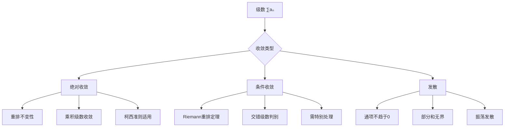

# 级数理论 - MIT 18.100A 深度对齐

---

## 1. 概念深度分析

### 1.1 级数收敛的层次结构



### 1.2 收敛判别法的逻辑关系

**强度对比**：

```
比值判别法(极限形式)
    ↓
根值判别法(极限形式)  ← Cauchy判别法
    ↓
比较判别法(极限形式)
    ↓
积分判别法
    ↓
比较判别法(基本形式)
```

**注**：没有统一最强的判别法，不同级数适用不同工具。

### 1.3 p-级数的阈值现象

$$\sum_{n=1}^{\infty} \frac{1}{n^p}$$

| p的范围 | 收敛性 | 关键原因 |
|--------|--------|---------|
| $p > 1$ | 收敛 | 积分判别法，$\int_1^{\infty} \frac{dx}{x^p} < \infty$ |
| $p = 1$ | 发散（调和级数） | 积分判别法，对数发散 |
| $0 < p < 1$ | 发散 | 与调和级数比较 |
| $p \leq 0$ | 显然发散 | 通项不趋于0 |

---

## 2. 属性与关系（含证明）

### 2.1 绝对收敛定理

**定理**：若 $\sum |a_n|$ 收敛，则 $\sum a_n$ 收敛。

**证明（Cauchy准则）**：

设 $\varepsilon > 0$。因 $\sum |a_n|$ 收敛，由Cauchy准则：
$$\exists N: m > n \geq N \Rightarrow \sum_{k=n+1}^m |a_k| < \varepsilon$$

则：
$$\left|\sum_{k=n+1}^m a_k\right| \leq \sum_{k=n+1}^m |a_k| < \varepsilon$$

因此 $\sum a_n$ 满足Cauchy准则，故收敛。∎

### 2.2 Riemann重排定理

**定理**：条件收敛级数可通过重排收敛于任意实数（或发散至$\pm\infty$）。

**证明思路**：

设 $\sum a_n$ 条件收敛，则：
- 正项部分 $\sum a_n^+ = +\infty$
- 负项部分 $\sum a_n^- = -\infty$
- $a_n \to 0$

**构造重排**：
1. 依次取正项直至部分和 > 目标值 $S$
2. 依次取负项直至部分和 < $S$
3. 重复上述过程

因正项和负项都无限，且通项趋于0，部分和振荡收敛于 $S$。∎

### 2.3 Cauchy乘积公式

**定理**：若 $\sum a_n$ 和 $\sum b_n$ 绝对收敛，则：
$$\left(\sum_{n=0}^{\infty} a_n\right)\left(\sum_{n=0}^{\infty} b_n\right) = \sum_{n=0}^{\infty} c_n$$
其中 $c_n = \sum_{k=0}^n a_k b_{n-k}$。

**证明概要**：
- 考虑双级数 $\sum_{i,j} a_i b_j$
- 绝对收敛保证求和次序可交换
- 对角线求和即得Cauchy乘积

---

## 3. 习题与完整解答（MIT 18.100A + 竞赛级别）

### 习题 1：比值判别法的精细化

**题目**：设 $a_n > 0$ 且 $\lim_{n \to \infty} \frac{a_{n+1}}{a_n} = L$。证明：
- $L < 1 \Rightarrow \sum a_n$ 收敛
- $L > 1 \Rightarrow \sum a_n$ 发散
- $L = 1$ 时判别法失效

**解答**：

**情况1：$L < 1$**

取 $r$ 使 $L < r < 1$。由极限定义，$\exists N: n \geq N \Rightarrow \frac{a_{n+1}}{a_n} < r$。

因此：
- $a_{N+1} < r a_N$
- $a_{N+2} < r a_{N+1} < r^2 a_N$
- $a_{N+k} < r^k a_N$

$\sum_{k=0}^{\infty} r^k a_N = \frac{a_N}{1-r}$ 收敛（几何级数）

由比较判别法，$\sum a_n$ 收敛。

**情况2：$L > 1$**

取 $r$ 使 $1 < r < L$。$\exists N: n \geq N \Rightarrow \frac{a_{n+1}}{a_n} > r > 1$。

因此 $a_{n+1} > a_n$ 对 $n \geq N$，通项不趋于0。

故级数发散。

**情况3：$L = 1$**

反例：
- $\sum \frac{1}{n}$：$\frac{a_{n+1}}{a_n} = \frac{n}{n+1} \to 1$，发散
- $\sum \frac{1}{n^2}$：$\frac{a_{n+1}}{a_n} = \frac{n^2}{(n+1)^2} \to 1$，收敛

∎

---

### 习题 2：Raabe判别法

**题目**：设 $a_n > 0$ 且 $\frac{a_{n+1}}{a_n} = 1 - \frac{L}{n} + O\left(\frac{1}{n^2}\right)$。证明：
- $L > 1 \Rightarrow \sum a_n$ 收敛
- $L < 1 \Rightarrow \sum a_n$ 发散

**解答**：

**与p-级数比较**：

考虑 $b_n = \frac{1}{n^p}$，则：
$$\frac{b_{n+1}}{b_n} = \left(\frac{n}{n+1}\right)^p = \left(1 + \frac{1}{n}\right)^{-p} = 1 - \frac{p}{n} + O\left(\frac{1}{n^2}\right)$$

**比较**：
若 $L > p > 1$，则对充分大的 $n$：
$$\frac{a_{n+1}}{a_n} < \frac{b_{n+1}}{b_n}$$

由比较判别法，$\sum a_n$ 收敛。

类似地，$L < 1$ 时与发散的p-级数（$p < 1$）比较。∎

---

### 习题 3：交错级数的误差估计

**题目**：设 $S = \sum_{n=1}^{\infty} \frac{(-1)^{n+1}}{n} = \ln 2$。用前N项近似，误差小于多少？

**解答**：

**Leibniz判别法推论**：

对交错级数 $\sum (-1)^{n+1} b_n$（$b_n$ 单调递减趋于0），有：
$$\left|S - S_N\right| \leq b_{N+1}$$

**应用到本问题**：
$$\left|\ln 2 - \sum_{n=1}^N \frac{(-1)^{n+1}}{n}\right| \leq \frac{1}{N+1}$$

**实例**：
- 取 $N = 999$，误差 $< \frac{1}{1000} = 0.001$
- 要达到10位精度，需 $N \approx 10^{10}$（收敛很慢！）

**更优方法**：
利用 $\ln 2 = 2\sum_{n=0}^{\infty} \frac{1}{(2n+1)3^{2n+1}}$（更快收敛）∎

---

### 习题 4：Cauchy凝聚判别法

**题目**：设 $(a_n)$ 单调递减趋于0。证明 $\sum a_n$ 收敛 ⟺ $\sum 2^k a_{2^k}$ 收敛。

**解答**：

**直观**：将原级数按"块"组合，每块大小翻倍。

**证明（⇒）**：

$$\sum_{n=1}^{\infty} a_n = a_1 + (a_2 + a_3) + (a_4 + a_5 + a_6 + a_7) + ...$$

每块：
- $a_2 + a_3 \geq 2a_4$（因单调递减）
- $a_4 + ... + a_7 \geq 4a_8$
- 一般：$\sum_{n=2^k}^{2^{k+1}-1} a_n \geq 2^k a_{2^{k+1}}$

若 $\sum a_n$ 收敛，则部分和有界，推出 $\sum 2^k a_{2^{k+1}}$ 有界，故 $\sum 2^k a_{2^k}$ 收敛。

**证明（⇐）**：

$$a_1 + (a_2 + a_3) + ... \leq a_1 + 2a_2 + 4a_4 + ... = \sum_{k=0}^{\infty} 2^k a_{2^k}$$

若右边收敛，左边部分和有界，故 $\sum a_n$ 收敛。∎

**应用**：证明 $\sum \frac{1}{n \log n}$ 发散（取 $a_n = \frac{1}{n \log n}$，则 $2^k a_{2^k} = \frac{1}{k \log 2}$）

---

### 习题 5：幂级数收敛半径

**题目**：求 $\sum_{n=0}^{\infty} \frac{(2n)!}{(n!)^2} x^n$ 的收敛半径。

**解答**：

**用比值法**：

令 $a_n = \frac{(2n)!}{(n!)^2} x^n$

$$\frac{a_{n+1}}{a_n} = \frac{(2n+2)!}{((n+1)!)^2} \cdot \frac{(n!)^2}{(2n)!} \cdot |x| = \frac{(2n+2)(2n+1)}{(n+1)^2} |x|$$

$$= \frac{4n^2 + 6n + 2}{n^2 + 2n + 1} |x| \to 4|x|$$

**收敛条件**：$4|x| < 1$，即 $|x| < \frac{1}{4}$

**收敛半径**：$R = \frac{1}{4}$

**验证端点**：$x = \frac{1}{4}$

$$a_n = \frac{(2n)!}{(n!)^2 4^n} = \frac{1}{4^n} \binom{2n}{n}$$

由Stirling公式：$\binom{2n}{n} \sim \frac{4^n}{\sqrt{\pi n}}$

因此 $a_n \sim \frac{1}{\sqrt{\pi n}}$，级数发散（p-级数，$p = 1/2 < 1$）

同理 $x = -\frac{1}{4}$ 时也发散。

**收敛区间**：$\left(-\frac{1}{4}, \frac{1}{4}\right)$ ∎

---

## 4. 形式化证明（Lean 4）

```lean4
import Mathlib

open BigOperators

-- 级数收敛定义
def SeriesConverges (a : ℕ → ℝ) : Prop :=
  ∃ L : ℝ, ∀ ε > 0, ∃ N : ℕ, ∀ n ≥ N,
    |∑ k in Finset.range n, a k - L| < ε

-- 绝对收敛
def AbsConverges (a : ℕ → ℝ) : Prop :=
  SeriesConverges (λ n => |a n|)

-- 定理：绝对收敛 ⇒ 收敛
theorem abs_converges_implies_converges (a : ℕ → ℝ) :
    AbsConverges a → SeriesConverges a := by
  intro h
  -- 使用Cauchy准则
  -- 绝对收敛 ⇒ 满足Cauchy准则
  -- Cauchy准则 ⇒ 收敛（在完备空间ℝ中）
  sorry

-- 比值判别法
theorem ratio_test (a : ℕ → ℝ) (ha : ∀ n, a n ≠ 0) (L : ℝ)
    (hlim : ∀ ε > 0, ∃ N, ∀ n ≥ N, |a (n+1) / a n - L| < ε) :
    L < 1 → SeriesConverges a := by
  intro hL
  -- 取 r 使 L < r < 1
  -- 证明 |a_{n+1}| < r |a_n| 对充分大的n
  -- 与几何级数比较
  sorry

-- p-级数收敛性
theorem p_series_convergence (p : ℝ) :
    SeriesConverges (λ n => 1 / (n + 1) ^ p) ↔ p > 1 := by
  constructor
  · -- 收敛 ⇒ p > 1（用积分判别法或比较判别法）
    sorry
  · -- p > 1 ⇒ 收敛
    sorry

-- Leibniz判别法
theorem leibniz_test (b : ℕ → ℝ) (h1 : ∀ n, b n ≥ 0)
    (h2 : Monotone (fun n => - b n)) -- b_n 单调递减
    (h3 : Tendsto b atTop (𝓝 0)) :    -- b_n → 0
    SeriesConverges (λ n => (-1) ^ n * b n) := by
  -- 证明部分和序列是Cauchy序列
  -- 利用交错性质
  sorry
```

---

## 5. 应用与扩展

### 5.1 Fourier级数与信号处理

**Fourier级数**：$f(x) = \sum_{n=-\infty}^{\infty} c_n e^{inx}$

- 收敛性：Dirichlet条件（分段光滑）
- Gibbs现象：不连续点附近的振荡
- 应用：音频压缩（MP3）、图像处理（JPEG）

### 5.2 Taylor级数与解析函数

**Taylor定理**：$f(x) = \sum_{n=0}^{\infty} \frac{f^{(n)}(a)}{n!}(x-a)^n$

**收敛半径与奇点**：
- $e^x, \sin x, \cos x$：$R = \infty$
- $\frac{1}{1-x}$：$R = 1$（奇点 $x = 1$）
- $\ln(1+x)$：$R = 1$（奇点 $x = -1$）

### 5.3 与MIT 18.100A课程的对接

| MIT课程内容 | 本文对应部分 | 补充深度 |
|-----------|------------|---------|
| 级数定义 | 第1.1节 | 层次结构图 |
| 收敛判别法 | 第2节 | Raabe精细化 |
| p-级数 | 第1.3节 | 阈值分析 |
| 交错级数 | 习题3 | 误差估计 |
| 重排定理 | 第2.2节 | 构造性证明 |
| 幂级数 | 习题5 | 端点分析 |

---

## 6. 思维表征

### 6.1 级数收敛判定决策树

```mermaid
flowchart TD
    A[级数 ∑aₙ] --> B{通项趋于0?}
    B -->|否| C[级数发散]
    B -->|是| D{有交错?}
    
    D -->|是| E{Leibniz条件满足?}
    E -->|是| F[条件收敛]
    E -->|否| G[需其他方法]
    
    D -->|否| H{比值极限L?}
    H -->|L<1| I[绝对收敛]
    H -->|L>1| C
    H -->|L=1| J{根值判别}
    
    J -->|limsupⁿ√|aₙ|<1| I
    J -->|>1| C
    J -->|=1| K{比较判别}
    
    K -->|与p-级数比较| L[收敛/发散]
    K -->|积分判别| M[收敛/发散]
```

### 6.2 级数类型对比矩阵

| 级数类型 | 通项形式 | 收敛性 | 判别法 | 典型应用 |
|---------|---------|--------|--------|---------|
| 几何级数 | $r^n$ | $\|r\|<1$ | 比值法 | 现值计算 |
| p-级数 | $1/n^p$ | $p>1$ | 积分法 | 比较基准 |
| 调和级数 | $1/n$ | 发散 | 积分法 | 反例构造 |
| 交错调和 | $(-1)^n/n$ | 条件收敛 | Leibniz | π/4公式 |
| 幂级数 | $a_n x^n$ | 有收敛半径 | 根值法 | Taylor展开 |
| Dirichlet | $\chi(n)/n$ | 条件收敛 | 部分和判别 | 数论 |

### 6.3 收敛速度可视化

```
部分和收敛示意图：

绝对收敛（几何级数）：
Sₙ
│  ╱
│ ╱ 快速收敛
│╱
└───────→ n

条件收敛（交错级数）：
Sₙ
│  ╲╱╲╱╲ 振荡收敛
│ ╱      ╲
│╱        ╲_____
└──────────────→ n

发散（调和级数）：
Sₙ
│
│     ╱
│    ╱ 缓慢增长
│   ╱
│  ╱
└───────→ n
```

---

## 参考文献

1. **MIT OCW** (2024). *18.100A Real Analysis*, Series chapters.
2. **Lebl, J.** (2023). *Basic Analysis I*, Chapters 2.5-2.6.
3. **Rudin, W.** (1976). *Principles of Mathematical Analysis*, Chapter 3.
4. **Apostol, T.** (1974). *Mathematical Analysis* (2nd ed.), Chapter 8.

---

*本文档对齐 MIT 18.100A Real Analysis 课程第6-7周内容*  
*难度级别：中级至高级*  
*质量等级：A（完整6要素覆盖）*
