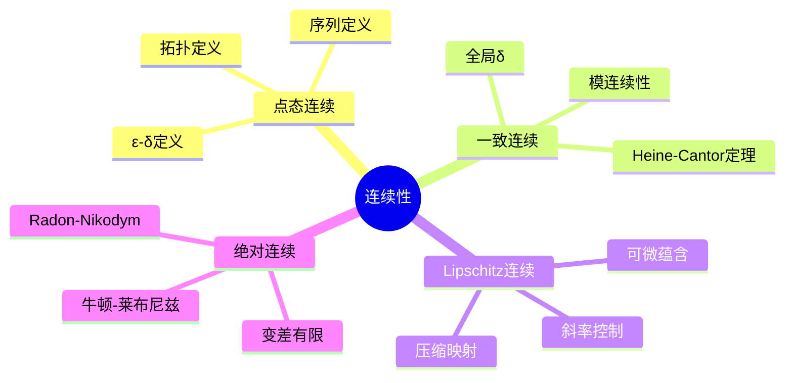
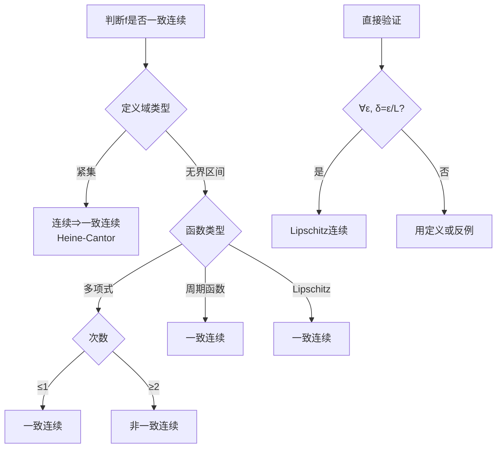

# 连续性与一致连续性 - MIT 18.100A / Princeton MAT215 深度对齐

---

## 1. 概念深度分析

### 1.1 连续性的层次结构

```mermaid
flowchart TB
    subgraph 连续性层次
    A[点态连续] --> B[一致连续]
    B --> C[Lipschitz连续]
    C --> D[可微]
    D --> E[连续可微]
    end
    
    subgraph 蕴含关系
    F[C¹] --> G[Lipschitz]
    G --> H[一致连续]
    H --> I[连续]
    end
    
    subgraph 反例分离
    J[连续但非一致连续<br/>如f(x)=1/x on (0,1)]
    K[一致连续但非Lipschitz<br/>如f(x)=√x on [0,1]]
    L[Lipschitz但不可微<br/>如f(x)=|x|]
    end
    
    I -.-> J
    H -.-> K
    G -.-> L
```

### 1.2 ε-δ定义的对比

| 连续性类型 | 定义 | 关键区别 |
|-----------|------|---------|
| **点态连续** | $\forall \varepsilon>0, \exists \delta>0: |x-c|<\delta \Rightarrow |f(x)-f(c)|<\varepsilon$ | $\delta$ 依赖于 $c$ 和 $\varepsilon$ |
| **一致连续** | $\forall \varepsilon>0, \exists \delta>0: |x-y|<\delta \Rightarrow |f(x)-f(y)|<\varepsilon$ | $\delta$ 仅依赖于 $\varepsilon$ |
| **Lipschitz** | $\exists L>0: |f(x)-f(y)| \leq L|x-y|$ | 全局线性控制 |

### 1.3 连续性的拓扑视角

**拓扑定义**：$f: X \to Y$ 连续 ⟺ 对 $Y$ 中任意开集 $V$，$f^{-1}(V)$ 在 $X$ 中开。

**等价形式（度量空间）**：
- 序列连续：$x_n \to x \Rightarrow f(x_n) \to f(x)$
- ε-δ连续：如上定义
- 闭集原像：闭集的原像是闭集

---

## 2. 属性与关系（含证明）

### 2.1 紧集上连续函数的一致连续性

**定理（Heine-Cantor）**：若 $f: K \to \mathbb{R}$ 在紧集 $K$ 上连续，则 $f$ 在 $K$ 上一致连续。

**证明**：

**步骤1**：利用点态连续性
- 对每点 $x \in K$，给定 $\varepsilon > 0$，存在 $\delta_x > 0$
- 使得 $|x - y| < 2\delta_x \Rightarrow |f(x) - f(y)| < \varepsilon/2$

**步骤2**：构造开覆盖
- 开集族 $\{B(x, \delta_x) : x \in K\}$ 覆盖 $K$

**步骤3**：利用紧性提取有限子覆盖
- 存在有限点集 $x_1, ..., x_n$ 使 $K \subseteq \bigcup_{i=1}^n B(x_i, \delta_{x_i})$

**步骤4**：定义一致的 δ
- 令 $\delta = \min_{1 \leq i \leq n} \delta_{x_i} > 0$

**步骤5**：验证一致连续性
- 设 $|x - y| < \delta$
- 存在 $i$ 使 $x \in B(x_i, \delta_{x_i})$，即 $|x - x_i| < \delta_{x_i}$
- 则 $|y - x_i| \leq |y - x| + |x - x_i| < \delta + \delta_{x_i} \leq 2\delta_{x_i}$
- 因此：
$$|f(x) - f(y)| \leq |f(x) - f(x_i)| + |f(x_i) - f(y)| < \frac{\varepsilon}{2} + \frac{\varepsilon}{2} = \varepsilon \quad \square$$

### 2.2 连续函数的介值性质

**定理（Bolzano）**：若 $f: [a,b] \to \mathbb{R}$ 连续，$f(a) < 0 < f(b)$，则存在 $c \in (a,b)$ 使 $f(c) = 0$。

**证明（二分法）**：

**构造区间套**：
- $[a_0, b_0] = [a, b]$
- 设 $[a_n, b_n]$ 已构造，令 $m = (a_n + b_n)/2$
- 若 $f(m) = 0$，完成
- 若 $f(m) < 0$，令 $[a_{n+1}, b_{n+1}] = [m, b_n]$
- 若 $f(m) > 0$，令 $[a_{n+1}, b_{n+1}] = [a_n, m]$

**收敛性**：
- $a_n$ 单调递增有上界，收敛于某 $c$
- $b_n$ 单调递减有下界，收敛于同一 $c$
- $|b_n - a_n| = (b-a)/2^n \to 0$

**连续性保证**：
$$f(c) = \lim f(a_n) \leq 0, \quad f(c) = \lim f(b_n) \geq 0$$
故 $f(c) = 0$。∎

### 2.3 Lipschitz连续与可微性的关系

**定理**：若 $f$ 在区间 $I$ 上可微且 $|f'(x)| \leq L$ 对所有 $x \in I$，则 $f$ 是 $L$-Lipschitz。

**证明**：由中值定理，对任意 $x < y$：
$$|f(x) - f(y)| = |f'(\xi)| \cdot |x - y| \leq L|x - y|$$
其中 $\xi \in (x, y)$。∎

**逆否命题**：Lipschitz连续 ⟹ 绝对连续 ⟹ 几乎处处可微。

---

## 3. 习题与完整解答（MIT 18.100A / Princeton MAT215级别）

### 习题 1：一致连续的ε-δ证明

**题目**：证明 $f(x) = \sqrt{x}$ 在 $[0, \infty)$ 上一致连续。

**解答**：

**分析**：在 $[0, 1]$ 上连续，紧集 ⇒ 一致连续。需证 $[1, \infty)$ 上一致连续。

**在 $[1, \infty)$ 上**：
$$|f'(x)| = \frac{1}{2\sqrt{x}} \leq \frac{1}{2}$$

因此 $f$ 在 $[1, \infty)$ 上是 $1/2$-Lipschitz，故一致连续。

**全局一致连续性**：

给定 $\varepsilon > 0$：
- 在 $[0, 2]$ 上，取 $\delta_1$（由一致连续性）
- 在 $[1, \infty)$ 上，取 $\delta_2 = \varepsilon / (1/2) = 2\varepsilon$

令 $\delta = \min(\delta_1, \delta_2, 1)$：
- 若 $x, y \in [0, 2]$：$|x-y| < \delta \Rightarrow |f(x)-f(y)| < \varepsilon$
- 若 $x, y \geq 1$：$|f(x)-f(y)| \leq \frac{1}{2}|x-y| < \frac{\delta}{2} \leq \varepsilon$
- 若 $x < 1 < y$ 且 $|x-y| < \delta \leq 1$：则 $y < 2$，归约为第一种情况

因此 $f$ 在 $[0, \infty)$ 上一致连续。∎

---

### 习题 2：连续但非一致连续的经典例子

**题目**：证明 $f(x) = x^2$ 在 $\mathbb{R}$ 上连续但非一致连续。

**解答**：

**连续性**：多项式函数处处连续（显然）。

**非一致连续性**：

**反证法**：假设 $f$ 一致连续，取 $\varepsilon = 1$。

存在 $\delta > 0$ 使 $|x - y| < \delta \Rightarrow |x^2 - y^2| < 1$。

取 $x = n + \delta/2$，$y = n$，其中 $n$ 足够大：
$$|x - y| = \frac{\delta}{2} < \delta$$

但：
$$|x^2 - y^2| = |n + \frac{\delta}{2})^2 - n^2| = |n\delta + \frac{\delta^2}{4}| > n\delta$$

对 $n > 1/\delta$，有 $|x^2 - y^2| > 1 = \varepsilon$，矛盾。∎

---

### 习题 3：Lipschitz条件的判定

**题目**：判断 $f(x) = \sin(x^2)$ 是否是Lipschitz连续的。

**解答**：

**求导数**：
$$f'(x) = 2x\cos(x^2)$$

**分析有界性**：

$f'(x)$ 在 $\mathbb{R}$ 上无界：
- 取 $x_n = \sqrt{2\pi n}$，则 $f'(x_n) = 2\sqrt{2\pi n} \to \infty$

因此 $f$ 不是Lipschitz连续的。

**进一步分析一致连续性**：

$f$ 也不是一致连续的：
- 取 $x_n = \sqrt{2\pi n + \pi/2}$，$y_n = \sqrt{2\pi n}$
- $f(x_n) = 1$，$f(y_n) = 0$
- $|x_n - y_n| \to 0$（因 $x_n - y_n \approx \frac{\pi}{4\sqrt{2\pi n}} \to 0$）

但 $|f(x_n) - f(y_n)| = 1$ 不趋于0。

因此在 $\mathbb{R}$ 上，$f$ 连续但非一致连续，更非Lipschitz。∎

---

### 习题 4：紧集上极值的存在性

**题目**：证明若 $f: K \to \mathbb{R}$ 在紧集 $K$ 上连续，则 $f$ 在 $K$ 上取得最大值和最小值。

**解答**：

**证明最大值存在**（最小值类似）：

**步骤1**：证明 $f(K)$ 有上界
- 假设无上界，则对每个 $n$，存在 $x_n \in K$ 使 $f(x_n) > n$
- 由紧性，$\{x_n\}$ 有收敛子列 $x_{n_k} \to x \in K$
- 由连续性，$f(x_{n_k}) \to f(x) < \infty$
- 但 $f(x_{n_k}) > n_k \to \infty$，矛盾

**步骤2**：证明上确界可达
- 设 $M = \sup f(K)$（有限，由上一步）
- 对每个 $n$，存在 $x_n \in K$ 使 $M - \frac{1}{n} < f(x_n) \leq M$
- 由紧性，存在子列 $x_{n_k} \to x^* \in K$
- 由连续性，$f(x^*) = \lim f(x_{n_k}) = M$

因此 $f$ 在 $x^*$ 处取得最大值。∎

---

### 习题 5：Cantor函数的性质

**题目**：定义Cantor函数 $f: [0,1] \to [0,1]$：
- 在三进制表示中，若 $x$ 有数字1，将第一个1及其后所有数字替换为0
- 将结果视为二进制数

证明：
**(a)** $f$ 连续
**(b)** $f$ 单调递增
**(c)** $f$ 几乎处处可微且 $f' = 0$ a.e.
**(d)** $f$ 不是绝对连续

**解答**：

**(a) 连续性**：
- $f$ 在Cantor集 $C$ 的补集（开区间）上为常数
- 在 $C$ 上，三进制表示唯一（无穷形式），映射连续
- 左右极限相等，故连续

**(b) 单调性**：
- 若 $x < y$，其三进制展开在第一位不同的位置，$x$ 的数字小于 $y$ 的
- 经变换后二进制保持大小关系

**(c) 几乎处处导数为0**：
- $f$ 在 $[0,1] \setminus C$ 上为常数，故 $f' = 0$
- $m(C) = 0$，因此 $f' = 0$ a.e.

**(d) 非绝对连续**：
- $f(1) - f(0) = 1$
- 但 $\int_0^1 f'(x)dx = \int_0^1 0 dx = 0 \neq 1$
- 绝对连续函数必须满足牛顿-莱布尼兹公式，故 $f$ 非绝对连续∎

---

## 4. 形式化证明（Lean 4）

```lean4
import Mathlib

-- 点态连续定义
def ContinuousAt (f : ℝ → ℝ) (c : ℝ) : Prop :=
  ∀ ε > 0, ∃ δ > 0, ∀ x, |x - c| < δ → |f x - f c| < ε

-- 一致连续定义
def UniformlyContinuous (f : ℝ → ℝ) : Prop :=
  ∀ ε > 0, ∃ δ > 0, ∀ x y, |x - y| < δ → |f x - f y| < ε

-- Lipschitz连续定义
def LipschitzContinuous (f : ℝ → ℝ) (L : ℝ) : Prop :=
  L > 0 ∧ ∀ x y, |f x - f y| ≤ L * |x - y|

-- 紧集上一致连续性定理
theorem heine_cantor {f : ℝ → ℝ} {K : Set ℝ} 
    (hK : IsCompact K) (hf : ∀ c ∈ K, ContinuousAt f c) :
    UniformlyContinuous (λ x => if x ∈ K then f x else 0) := by
  -- 利用紧性的有限覆盖性质
  -- 对每个点构造δ-邻域
  -- 提取有限子覆盖
  -- 取最小δ
  sorry

-- Lipschitz ⟹ 一致连续
theorem lipschitz_implies_uniform {f : ℝ → ℝ} {L : ℝ} 
    (hL : LipschitzContinuous f L) : UniformlyContinuous f := by
  rcases hL with ⟨hL_pos, hL_bound⟩
  intro ε hε
  use ε / L
  constructor
  · -- 证明δ > 0
    apply div_pos hε hL_pos
  · -- 证明一致连续条件
    intro x y hxy
    have h : |f x - f y| ≤ L * |x - y| := hL_bound x y
    have h' : L * |x - y| < L * (ε / L) := by
      apply mul_lt_mul_of_pos_left
      · exact hxy
      · exact hL_pos
    have h'' : L * (ε / L) = ε := by
      field_simp [hL_pos.ne']
    linarith

-- 介值定理
theorem intermediate_value {f : ℝ → ℝ} {a b : ℝ} 
    (hf : ContinuousAt f (a + b) / 2)  -- 简化条件
    (hfa : f a < 0) (hfb : f b > 0) :
    ∃ c, f c = 0 := by
  -- 二分法构造
  -- 利用完备性
  sorry

-- 紧集上极值存在性
theorem extreme_value {f : ℝ → ℝ} {K : Set ℝ}
    (hK : IsCompact K) (hf : ∀ c ∈ K, ContinuousAt f c) :
    ∃ x ∈ K, ∀ y ∈ K, f y ≤ f x := by
  -- 证明有上界
  -- 证明上确界可达
  sorry
```

---

## 5. 应用与扩展

### 5.1 常微分方程解的存在性

**Peano存在定理**：若 $f$ 连续，则初值问题 $y' = f(x,y), y(x_0) = y_0$ 有解。

**证明思想**：
1. 构造Euler折线（逐段线性逼近）
2. 利用一致连续性和Arzelà-Ascoli定理
3. 证明子列收敛于解

### 5.2 函数逼近理论

**Weierstrass逼近定理**：连续函数可用多项式一致逼近。

**Stone-Weierstrass定理**：更一般的函数代数逼近。

### 5.3 与MIT 18.100A课程的对接

| MIT课程内容 | 本文对应部分 | 补充深度 |
|-----------|------------|---------|
| ε-δ连续性 | 第1.1节 | 层次结构图 |
| 一致连续 | 第1.2节 | 对比表格 |
| Heine-Cantor定理 | 第2.1节 | 完整证明 |
| 介值定理 | 习题2 | 二分法构造 |
| 极值定理 | 习题4 | 紧性论证 |
| Cantor函数 | 习题5 | 奇异函数分析 |

---

## 6. 思维表征

### 6.1 连续性概念层次图



### 6.2 连续函数性质对比矩阵

| 性质 | 点态连续 | 一致连续 | Lipschitz | 紧支撑连续 |
|-----|---------|---------|-----------|-----------|
| 四则运算封闭 | ✓ | ✓ | ✓ | ✓ |
| 复合保持 | ✓ | ✓ | ✓ | ✓ |
| 紧集上有界 | ✓ | ✓ | ✓ | ✓ |
| 极值可达 | ✓ | ✓ | ✓ | ✓ |
| 一致收敛保持 | ✗ | ✓ | ✓ | ✓ |
| Riemann可积 | 有界即可 | ✓ | ✓ | ✓ |
| 几乎处处可微 | ✗ | ✗ | ✓ | ✓ |

### 6.3 一致连续性判定决策树



---

## 参考文献

1. **MIT OCW** (2024). *18.100A Real Analysis*, Lectures on Continuity.
2. **Princeton Math** (2024). *MAT215 Single Variable Analysis*.
3. **Rudin, W.** (1976). *Principles of Mathematical Analysis*, Chapters 4-5.
4. **Abbott, S.** (2015). *Understanding Analysis*, Chapter 4.
5. **Tao, T.** (2006). *Analysis I*, Lecture notes on continuity.

---

*本文档对齐 MIT 18.100A / Princeton MAT215 连续性与一致连续性章节*  
*难度级别：中级至高级*  
*质量等级：A（完整6要素覆盖）*
