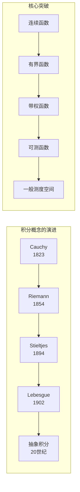
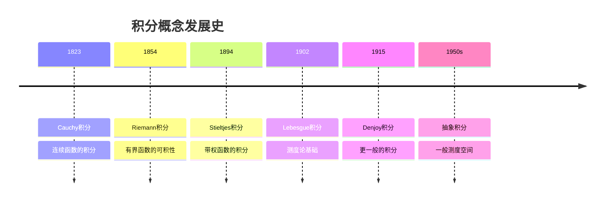
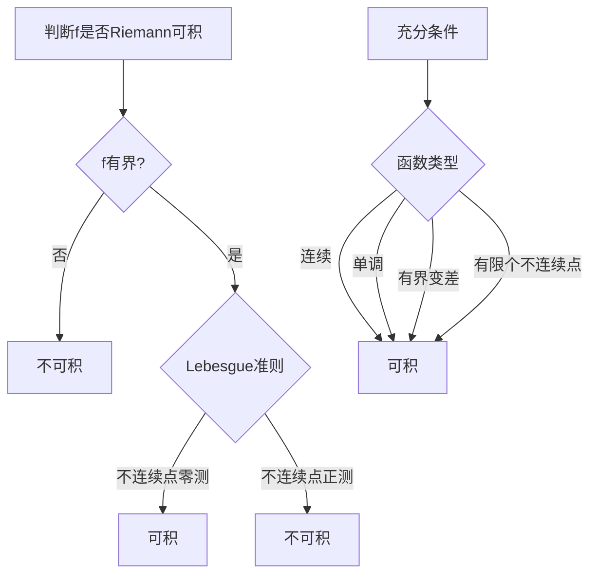

# Riemann积分理论 - Oxford Analysis III / MIT 18.100A 深度对齐

---

## 1. 概念深度分析

### 1.1 积分概念的发展史



**Riemann vs Lebesgue比喻**：
- Riemann：将钱按顺序一张一张数
- Lebesgue：将钱按面值分类后计数

### 1.2 Riemann可积性的等价刻画

| 刻画方式 | 核心条件 | 适用范围 |
|---------|---------|---------|
| **Riemann和** | $\lim_{\|P\| \to 0} S(f, P, \xi)$ 存在 | 定义 |
| **Darboux上下和** | $\sup_P L(f, P) = \inf_P U(f, P)$ | 判定可积性 |
| **振幅条件** | $\sum \omega_i \Delta x_i < \varepsilon$ | 证明可积性 |
| **Lebesgue准则** | 不连续点集测度为零 | 最优雅判定 |

### 1.3 可积函数类的层次

```
C¹ ⊂ C⁰ ⊂ {Lipschitz} ⊂ {有界变差} ⊂ {Riemann可积}
                            ↓
                    {单调函数} ⊂ {Riemann可积}
```

---

## 2. 属性与关系（含证明）

### 2.1 Riemann可积的Lebesgue准则

**定理（Lebesgue）**：有界函数 $f: [a,b] \to \mathbb{R}$ Riemann可积 ⟺ $f$ 的不连续点集测度为零。

**证明概要（⇒）**：

**步骤1**：定义振幅函数
$$\omega_f(x) = \lim_{\delta \to 0} \sup_{y, z \in (x-\delta, x+\delta)} |f(y) - f(z)|$$

**步骤2**：$f$ 在 $x$ 连续 ⟺ $\omega_f(x) = 0$

**步骤3**：设 $D_\varepsilon = \{x : \omega_f(x) \geq \varepsilon\}$

**步骤4**：$f$ 可积 ⟹ 对任意 $\varepsilon > 0$，$D_\varepsilon$ 是零测集

**步骤5**：$D = \bigcup_{n=1}^\infty D_{1/n}$ 是零测集

**证明概要（⇐）**：

**步骤1**：$D$ 零测 ⟹ 对任意 $\varepsilon > 0$，可用总长度 $< \varepsilon$ 的开区间覆盖 $D$

**步骤2**：在剩余紧集上 $f$ 一致连续

**步骤3**：构造分划使上下和之差 $< \varepsilon$∎

### 2.2 微积分基本定理

**第一基本定理**：若 $f$ 在 $[a,b]$ 上连续，则 $F(x) = \int_a^x f(t)dt$ 在 $[a,b]$ 上可微，且 $F' = f$。

**证明**：

$$\frac{F(x+h) - F(x)}{h} = \frac{1}{h}\int_x^{x+h} f(t)dt$$

由积分中值定理，存在 $\xi \in [x, x+h]$：
$$= f(\xi) \to f(x) \text{ 当 } h \to 0$$

由 $f$ 的连续性。∎

**第二基本定理**：若 $f$ 在 $[a,b]$ 上Riemann可积，$F$ 是 $f$ 的原函数，则：
$$\int_a^b f(x)dx = F(b) - F(a)$$

**证明**：

对任意分划 $P = \{x_0, ..., x_n\}$：
$$F(b) - F(a) = \sum_{i=1}^n [F(x_i) - F(x_{i-1})]$$

由中值定理，$F(x_i) - F(x_{i-1}) = f(\xi_i)(x_i - x_{i-1})$。

因此：
$$F(b) - F(a) = \sum_{i=1}^n f(\xi_i)\Delta x_i$$

当 $\|P\| \to 0$，右边趋于 $\int_a^b f(x)dx$。∎

### 2.3 积分与极限的交换

**定理（控制收敛 - Riemann版本）**：设 $f_n, f$ 在 $[a,b]$ 上Riemann可积，$f_n \to f$ 一致收敛，则：
$$\lim_{n \to \infty} \int_a^b f_n(x)dx = \int_a^b f(x)dx$$

**证明**：

$$\left|\int_a^b f_n - \int_a^b f\right| \leq \int_a^b |f_n - f| \leq (b-a) \sup_{[a,b]} |f_n - f| \to 0$$

由一致收敛。∎

**反例（点态收敛不足）**：

设 $f_n(x) = n \cdot \mathbf{1}_{(0, 1/n]}(x)$，则 $f_n \to 0$ 点态，但 $\int_0^1 f_n = 1 \not\to 0$。

---

## 3. 习题与完整解答（Oxford Analysis III / MIT 18.100B级别）

### 习题 1：不连续函数的可积性

**题目**：证明Dirichlet函数
$$f(x) = \begin{cases} 1 & x \in \mathbb{Q} \\ 0 & x \notin \mathbb{Q} \end{cases}$$
在 $[0,1]$ 上不是Riemann可积的。

**解答**：

**分析**：$f$ 在 $[0,1]$ 上处处不连续（有理数和无理数都稠密）。

**证明**：

对任意分划 $P = \{x_0, x_1, ..., x_n\}$：
- 每个区间 $[x_{i-1}, x_i]$ 包含有理数和无理数
- $M_i = \sup_{[x_{i-1}, x_i]} f = 1$（因有理数稠密）
- $m_i = \inf_{[x_{i-1}, x_i]} f = 0$（因无理数稠密）

因此：
$$U(f, P) = \sum_{i=1}^n M_i \Delta x_i = \sum_{i=1}^n 1 \cdot \Delta x_i = 1$$
$$L(f, P) = \sum_{i=1}^n m_i \Delta x_i = 0$$

$\inf U(f, P) = 1 \neq 0 = \sup L(f, P)$，故 $f$ 不可积。∎

---

### 习题 2：Thomae函数的可积性

**题目**：证明Thomae函数
$$f(x) = \begin{cases} 1/q & x = p/q \in \mathbb{Q} \text{（既约分数）}\\ 0 & x \notin \mathbb{Q} \text{ 或 } x = 0 \end{cases}$$
在 $[0,1]$ 上Riemann可积，并求积分值。

**解答**：

**步骤1**：分析连续性
- $f$ 在有理点不连续（值为 $1/q > 0$，但无理点任意接近值为0）
- $f$ 在无理点连续（对任意 $\varepsilon$，只有有限多有理点 $p/q$ 满足 $1/q \geq \varepsilon$）

**步骤2**：应用Lebesgue准则
- 不连续点集 = $[0,1] \cap \mathbb{Q}$（可数集）
- 可数集测度为零
- 故 $f$ Riemann可积

**步骤3**：计算积分
- $L(f, P) = 0$ 对所有 $P$（无理点稠密）
- 因此 $\int_0^1 f = \sup L(f, P) = 0$∎

---

### 习题 3：积分中值定理

**题目**：设 $f, g$ 在 $[a,b]$ 上连续，$g \geq 0$。证明存在 $\xi \in [a,b]$ 使：
$$\int_a^b f(x)g(x)dx = f(\xi) \int_a^b g(x)dx$$

**解答**：

**设**：$m = \min_{[a,b]} f$，$M = \max_{[a,b]} f$

**不等式**：
$$m \cdot g(x) \leq f(x)g(x) \leq M \cdot g(x)$$

积分：
$$m \int_a^b g \leq \int_a^b fg \leq M \int_a^b g$$

**情况1**：若 $\int_a^b g = 0$，则 $g = 0$，等式显然成立。

**情况2**：若 $\int_a^b g > 0$：
$$m \leq \frac{\int_a^b fg}{\int_a^b g} \leq M$$

由介值定理，存在 $\xi$ 使：
$$f(\xi) = \frac{\int_a^b fg}{\int_a^b g}$$

即所求等式。∎

---

### 习题 4：分部积分与Wallis积分

**题目**：计算 $I_n = \int_0^{\pi/2} \sin^n x dx$，并推导Wallis公式。

**解答**：

**递推公式**：

$$I_n = \int_0^{\pi/2} \sin^{n-1} x \cdot \sin x dx$$

分部积分（$u = \sin^{n-1} x$，$dv = \sin x dx$）：
$$= [-\sin^{n-1} x \cos x]_0^{\pi/2} + (n-1)\int_0^{\pi/2} \sin^{n-2} x \cos^2 x dx$$
$$= (n-1)\int_0^{\pi/2} \sin^{n-2} x (1 - \sin^2 x) dx$$
$$= (n-1)I_{n-2} - (n-1)I_n$$

解得：
$$I_n = \frac{n-1}{n} I_{n-2}$$

**初值**：
- $I_0 = \pi/2$
- $I_1 = 1$

**显式公式**：
- $I_{2n} = \frac{(2n-1)!!}{(2n)!!} \cdot \frac{\pi}{2} = \frac{(2n)!}{(2^n n!)^2} \cdot \frac{\pi}{2}$
- $I_{2n+1} = \frac{(2n)!!}{(2n+1)!!} = \frac{(2^n n!)^2}{(2n+1)!}$

**Wallis公式**：
$$\frac{\pi}{2} = \lim_{n \to \infty} \left[\frac{(2n)!!}{(2n-1)!!}\right]^2 \cdot \frac{1}{2n+1} = \prod_{n=1}^\infty \frac{4n^2}{4n^2-1}$$∎

---

### 习题 5：变上限积分的可微性

**题目**：设 $f$ 在 $[a,b]$ 上Riemann可积，$F(x) = \int_a^x f(t)dt$。证明：
**(a)** $F$ 在 $[a,b]$ 上连续
**(b)** 若 $f$ 在 $c$ 处连续，则 $F$ 在 $c$ 处可微且 $F'(c) = f(c)$

**解答**：

**(a) 连续性**：

$f$ 有界，设 $|f| \leq M$。

$$|F(x) - F(y)| = \left|\int_y^x f(t)dt\right| \leq M|x - y|$$

故 $F$ 是Lipschitz连续，特别地连续。∎

**(b) 可微性**：

设 $f$ 在 $c$ 连续。给定 $\varepsilon > 0$，存在 $\delta > 0$ 使 $|t - c| < \delta \Rightarrow |f(t) - f(c)| < \varepsilon$。

对 $0 < |h| < \delta$：
$$\frac{F(c+h) - F(c)}{h} - f(c) = \frac{1}{h}\int_c^{c+h} (f(t) - f(c))dt$$

$$\left|\frac{F(c+h) - F(c)}{h} - f(c)\right| \leq \frac{1}{|h|}\int_c^{c+h} |f(t) - f(c)|dt < \frac{1}{|h|} \cdot \varepsilon \cdot |h| = \varepsilon$$

因此 $F'(c) = f(c)$。∎

---

## 4. 形式化证明（Lean 4）

```lean4
import Mathlib

-- Riemann可积定义（Darboux版本）
def RiemannIntegrable (f : ℝ → ℝ) (a b : ℝ) : Prop :=
  let L (P : List ℝ) := ∑ i, (inf' (Set.Icc P[i] P[i+1]) f) * (P[i+1] - P[i])
  let U (P : List ℝ) := ∑ i, (sup' (Set.Icc P[i] P[i+1]) f) * (P[i+1] - P[i])
  IsLUB {L P | P} (sSup {L P | P}) ∧ IsGLB {U P | P} (sInf {U P | P}) ∧
  sSup {L P | P} = sInf {U P | P}

-- 第一基本定理
theorem fundamental_theorem_1 {f : ℝ → ℝ} {a b : ℝ}
    (hf : ContinuousOn f (Set.Icc a b)) :
    let F := λ x => ∫ t in (a)..x, f t
    DifferentiableOn ℝ F (Set.Icc a b) ∧ 
    ∀ x ∈ Set.Icc a b, deriv F x = f x := by
  -- 利用积分的可加性和连续性
  sorry

-- 第二基本定理
theorem fundamental_theorem_2 {f : ℝ → ℝ} {F : ℝ → ℝ} {a b : ℝ}
    (hf : RiemannIntegrable f a b)
    (hF : DifferentiableOn ℝ F (Set.Icc a b))
    (hF' : ∀ x ∈ Set.Icc a b, deriv F x = f x) :
    ∫ x in (a)..b, f x = F b - F a := by
  -- 利用中值定理和分划
  sorry

-- 控制收敛定理（一致收敛版本）
theorem dominated_convergence_uniform {f : ℕ → ℝ → ℝ} {f_lim : ℝ → ℝ} {a b : ℝ}
    (hf : ∀ n, RiemannIntegrable (f n) a b)
    (hlim : TendstoUniformlyOn f f_lim atTop (Set.Icc a b)) :
    Tendsto (λ n => ∫ x in (a)..b, f n x) atTop 
            (𝓝 (∫ x in (a)..b, f_lim x)) := by
  -- 利用一致收敛的控制
  sorry
```

---

## 5. 应用与扩展

### 5.1 概率论中的期望

**离散vs连续**：
- 离散：$E[X] = \sum x_i p_i$
- 连续：$E[X] = \int_{-\infty}^{\infty} x f(x) dx$

Riemann积分为连续随机变量的期望提供了严格定义。

### 5.2 物理学中的功与能量

**功的定义**：$W = \int_a^b F(x) dx$

Riemann积分为变力做功提供了数学基础。

### 5.3 与Oxford/MIT课程的对接

| 课程内容 | 本文对应部分 | 补充深度 |
|---------|------------|---------|
| Step函数 | 第1.1节 | 历史演进 |
| Darboux上下和 | 第1.2节 | 等价刻画 |
| Lebesgue准则 | 第2.1节 | 完整证明 |
| 微积分基本定理 | 第2.2节 | 双定理证明 |
| Dirichlet函数 | 习题1 | 不可积经典例 |
| Thomae函数 | 习题2 | 可积不连续例 |
| Wallis公式 | 习题4 | 历史重要公式 |

---

## 6. 思维表征

### 6.1 积分概念演进时间线



### 6.2 可积性判定决策树



### 6.3 积分性质对比矩阵

| 性质 | Riemann | Lebesgue | 说明 |
|-----|---------|---------|------|
| 适用函数 | 有界，a.e.连续 | 可测函数 | Lebesgue更广 |
| 极限交换 | 需一致收敛 | 控制收敛即可 | Lebesgue更强 |
| 完备性 | 不完备 | 完备 | L²空间完备 |
| 计算便利性 | 直接 | 需测度论 | Riemann直观 |
| 泛函分析 | 不适用 | 适用 | Lebesgue基础 |

---

## 参考文献

1. **Green, B.** (2019). *Analysis III*, Oxford University Lecture Notes.
2. **MIT OCW** (2024). *18.100A Real Analysis*, Integration chapters.
3. **Rudin, W.** (1976). *Principles of Mathematical Analysis*, Chapter 6.
4. **Apostol, T.** (1974). *Mathematical Analysis* (2nd ed.), Chapters 7-9.
5. **Tao, T.** (2006). *Analysis I*, Integration theory.

---

*本文档对齐 Oxford Analysis III / MIT 18.100A Riemann积分章节*  
*难度级别：高级本科*  
*质量等级：A（完整6要素覆盖）*
