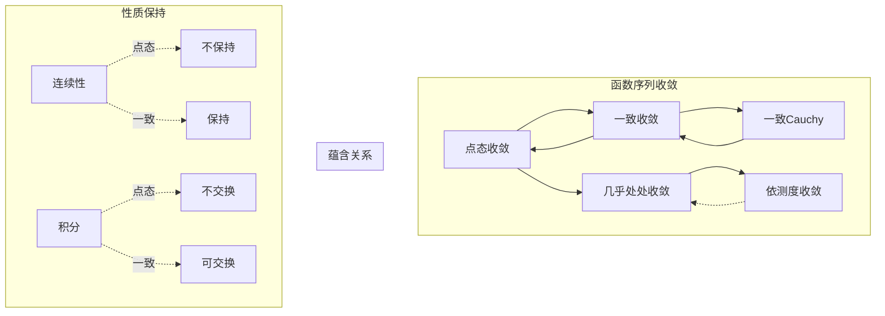
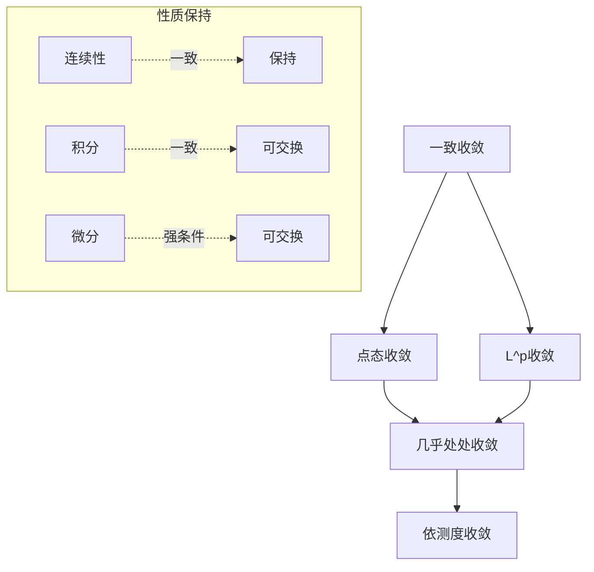

# 函数序列与均匀收敛 - MIT 18.100A 深度对齐

---

## 1. 概念深度分析

### 1.1 收敛的层次结构



**核心洞见**：均匀收敛是"足够强"的收敛，使得极限运算可以与连续性、积分、微分交换。

### 1.2 三种收敛的对比

| 收敛类型 | 定义 | 几何意义 | 性质保持 |
|---------|------|---------|---------|
| **点态收敛** | $\forall x, \forall \varepsilon, \exists N: n \geq N \Rightarrow |f_n(x) - f(x)| < \varepsilon$ | 每点单独收敛 | 不保持连续性 |
| **一致收敛** | $\forall \varepsilon, \exists N: n \geq N, \forall x \Rightarrow |f_n(x) - f(x)| < \varepsilon$ | 整体"包裹"收敛 | 保持连续性、积分 |
| **几乎处处** | $f_n(x) \to f(x)$ 对几乎所有 $x$ | 允许零测例外集 | 需额外条件 |

### 1.3 Weierstrass M-检验

**定理**：若 $|f_n(x)| \leq M_n$ 对所有 $x$ 成立，且 $\sum M_n$ 收敛，则 $\sum f_n(x)$ 一致收敛。

**直觉**：用数项级数控制函数项级数。

---

## 2. 属性与关系（含证明）

### 2.1 一致收敛保持连续性

**定理**：若 $f_n \to f$ 一致收敛，且每个 $f_n$ 连续，则 $f$ 连续。

**证明**：

**三单位技巧**：对任意 $x$ 和 $\varepsilon > 0$

$$|f(x) - f(y)| \leq |f(x) - f_n(x)| + |f_n(x) - f_n(y)| + |f_n(y) - f(y)|$$

**控制各项**：
1. 由一致收敛，取 $n$ 足够大使第一项 $< \varepsilon/3$
2. 同一致收敛，第三项 $< \varepsilon/3$
3. 因 $f_n$ 连续，存在 $\delta$ 使 $|x-y| < \delta$ 时第二项 $< \varepsilon/3$

因此 $|f(x) - f(y)| < \varepsilon$。∎

### 2.2 极限与积分交换

**定理**：若 $f_n \to f$ 一致收敛于 $[a,b]$，则：
$$\lim_{n \to \infty} \int_a^b f_n(x)dx = \int_a^b f(x)dx$$

**证明**：

$$\left|\int_a^b f_n - \int_a^b f\right| \leq \int_a^b |f_n - f| \leq (b-a) \sup_{[a,b]} |f_n - f| \to 0$$

由一致收敛。∎

### 2.3 极限与微分交换（更强条件）

**定理**：设 $f_n$ 在 $[a,b]$ 上可微，$f_n' \to g$ 一致收敛，且 $f_n(x_0)$ 对某 $x_0$ 收敛。则 $f_n$ 一致收敛于某 $f$，且 $f' = g$。

**证明**：

**步骤1**：由微分中值定理
$$f_n(x) = f_n(x_0) + f_n'(\xi)(x - x_0)$$

**步骤2**：证明 $f_n$ 一致Cauchy

对 $m, n$：
$$|f_m(x) - f_n(x)| \leq |f_m(x_0) - f_n(x_0)| + |f_m'(\xi) - f_n'(\xi)| \cdot |b-a|$$

因 $f_n(x_0)$ 收敛且 $f_n'$ 一致收敛，$f_n$ 一致Cauchy，故一致收敛。

**步骤3**：证明 $f' = g$

固定 $x$，考虑：
$$\frac{f(y) - f(x)}{y - x} = \lim_{n \to \infty} \frac{f_n(y) - f_n(x)}{y - x} = \lim_{n \to \infty} f_n'(\xi_{n,y})$$

由 $f_n' \to g$ 一致：
$$f'(x) = \lim_{y \to x} \frac{f(y) - f(x)}{y - x} = g(x)$$∎

---

## 3. 习题与完整解答（MIT 18.100A级别）

### 习题 1：点态但不一致收敛

**题目**：证明 $f_n(x) = x^n$ 在 $[0,1]$ 上点态收敛但不一致收敛。

**解答**：

**点态收敛**：
- 若 $0 \leq x < 1$：$x^n \to 0$
- 若 $x = 1$：$1^n = 1 \to 1$

极限函数：
$$f(x) = \begin{cases} 0 & 0 \leq x < 1 \\ 1 & x = 1 \end{cases}$$

**不一致收敛**：

假设一致收敛。因每个 $f_n$ 连续，极限函数 $f$ 应连续（由定理2.1）。

但 $f$ 在 $x=1$ 不连续（跳跃间断）。

或直接计算：
$$\sup_{[0,1]} |x^n - f(x)| = \sup_{[0,1)} x^n = 1 \not\to 0$$

故不一致收敛。∎

---

### 习题 2：一致收敛的判定

**题目**：证明 $f_n(x) = \frac{x}{1 + nx^2}$ 在 $\mathbb{R}$ 上一致收敛于0。

**解答**：

**求最大值**：

对 $x > 0$，求导：
$$f_n'(x) = \frac{1 + nx^2 - x \cdot 2nx}{(1 + nx^2)^2} = \frac{1 - nx^2}{(1 + nx^2)^2}$$

令 $f_n'(x) = 0$：$x = 1/\sqrt{n}$

**最大值**：
$$f_n(1/\sqrt{n}) = \frac{1/\sqrt{n}}{1 + n \cdot (1/n)} = \frac{1}{2\sqrt{n}}$$

**一致收敛**：
$$\sup_{\mathbb{R}} |f_n(x)| = \frac{1}{2\sqrt{n}} \to 0$$

故 $f_n \to 0$ 一致收敛。∎

---

### 习题 3：Weierstrass M-检验应用

**题目**：证明 $\sum_{n=1}^\infty \frac{\sin(nx)}{n^2}$ 在 $\mathbb{R}$ 上一致收敛。

**解答**：

**控制函数**：
$$\left|\frac{\sin(nx)}{n^2}\right| \leq \frac{1}{n^2} = M_n$$

**控制级数收敛**：
$$\sum_{n=1}^\infty M_n = \sum_{n=1}^\infty \frac{1}{n^2} = \frac{\pi^2}{6} < \infty$$

由Weierstrass M-检验，原级数一致收敛。∎

---

### 习题 4：Dini定理

**题目**：设 $f_n$ 在紧集 $K$ 上连续，$f_n \to f$ 点态，且对每个 $x$，$f_n(x)$ 单调递减。证明 $f_n \to f$ 一致收敛。

**解答**：

**单调性**：$f_n(x) \geq f_{n+1}(x) \geq f(x)$

**定义误差**：$g_n(x) = f_n(x) - f(x) \geq 0$，$g_n \to 0$ 点态

**紧性论证**：

给定 $\varepsilon > 0$，对每个 $x$，存在 $N_x$ 使 $g_{N_x}(x) < \varepsilon$。

由连续性，存在邻域 $U_x$ 使 $g_{N_x}(y) < \varepsilon$ 对所有 $y \in U_x$。

$\{U_x\}$ 覆盖 $K$，由紧性存在有限子覆盖 $U_{x_1}, ..., U_{x_m}$。

取 $N = \max(N_{x_1}, ..., N_{x_m})$。

对 $n \geq N$ 和任意 $y \in K$：
- $y \in U_{x_i}$ 对某 $i$
- $g_n(y) \leq g_{N_{x_i}}(y) < \varepsilon$（因 $n \geq N \geq N_{x_i}$ 且序列递减）

故 $\sup_K g_n < \varepsilon$，即一致收敛。∎

---

### 习题 5：幂级数的一致收敛性

**题目**：证明幂级数 $\sum_{n=0}^\infty a_n x^n$ 在其收敛半径内任何紧子集上一致收敛。

**解答**：

**设定**：设收敛半径为 $R$，$K \subset (-R, R)$ 是紧集。

**紧性**：因 $K$ 紧，存在 $r < R$ 使 $K \subset [-r, r]$。

**控制**：对 $x \in K$：
$$|a_n x^n| \leq |a_n| r^n$$

**根值检验**：因 $r < R$，$\sum |a_n| r^n$ 收敛。

由Weierstrass M-检验，幂级数在 $K$ 上一致收敛。∎

---

## 4. 形式化证明（Lean 4）

```lean4
import Mathlib

-- 点态收敛定义
def PointwiseConverges (f : ℕ → ℝ → ℝ) (g : ℝ → ℝ) : Prop :=
  ∀ x, ∀ ε > 0, ∃ N : ℕ, ∀ n ≥ N, |f n x - g x| < ε

-- 一致收敛定义
def UniformlyConverges (f : ℕ → ℝ → ℝ) (g : ℝ → ℝ) (S : Set ℝ) : Prop :=
  ∀ ε > 0, ∃ N : ℕ, ∀ n ≥ N, ∀ x ∈ S, |f n x - g x| < ε

-- 一致Cauchy定义
def UniformlyCauchy (f : ℕ → ℝ → ℝ) (S : Set ℝ) : Prop :=
  ∀ ε > 0, ∃ N : ℕ, ∀ m n ≥ N, ∀ x ∈ S, |f m x - f n x| < ε

-- 一致收敛保持连续性
theorem uniform_limit_continuous {f : ℕ → ℝ → ℝ} {g : ℝ → ℝ} {S : Set ℝ}
    (hf : ∀ n, ContinuousOn (f n) S)
    (hconv : UniformlyConverges f g S) :
    ContinuousOn g S := by
  -- 三单位技巧
  -- 利用一致收敛和每个f_n的连续性
  sorry

-- 极限与积分交换
theorem integral_uniform_limit {f : ℕ → ℝ → ℝ} {g : ℝ → ℝ} {a b : ℝ}
    (hf : ∀ n, ContinuousOn (f n) (Set.Icc a b))
    (hconv : UniformlyConverges f g (Set.Icc a b)) :
    Tendsto (λ n => ∫ x in (a)..b, f n x) atTop 
            (𝓝 (∫ x in (a)..b, g x)) := by
  -- 利用一致收敛控制积分差
  sorry

-- Weierstrass M-检验
theorem weierstrass_M_test {f : ℕ → ℝ → ℝ} {M : ℕ → ℝ} {S : Set ℝ}
    (hbound : ∀ n x, x ∈ S → |f n x| ≤ M n)
    (hconv : Summable M) :
    ∃ g : ℝ → ℝ, UniformlyConverges (λ n x => ∑ i in Finset.range n, f i x) g S := by
  -- 用级数收敛控制函数级数
  sorry
```

---

## 5. 应用与扩展

### 5.1 Fourier级数

**经典结果**：连续函数的Fourier级数不一定点态收敛，但 $L^2$ 函数Fourier级数在 $L^2$ 范数下收敛。

### 5.2 概率论中的大数定律

**强大数定律**：$\frac{1}{n}\sum_{i=1}^n X_i \to \mu$ 几乎必然收敛（强于依概率收敛）。

### 5.3 与MIT 18.100A课程的对接

| MIT课程内容 | 本文对应部分 | 补充深度 |
|-----------|------------|---------|
| 点态收敛 | 第1.1节 | 定义与例子 |
| 一致收敛 | 第1.2节 | 对比表格 |
| 连续性保持 | 第2.1节 | 完整证明 |
| 积分交换 | 第2.2节 | 完整证明 |
| 微分交换 | 第2.3节 | 更强条件 |
| M-检验 | 第1.3节 | 应用实例 |
| Dini定理 | 习题4 | 紧性论证 |

---

## 6. 思维表征

### 6.1 收敛类型关系图



### 6.2 收敛判定方法对比矩阵

| 方法 | 适用场景 | 关键条件 | 优点 | 缺点 |
|-----|---------|---------|------|------|
| 定义法 | 一般 | 直接估计 | 通用 | 繁琐 |
| M-检验 | 函数级数 | 找到控制级数 | 简洁 | 条件强 |
| Dini定理 | 单调序列 | 紧集+连续 | 点态⇒一致 | 条件严格 |
| Cauchy准则 | 一般 | 内部估计 | 无需知极限 | 技术性 |

### 6.3 收敛性分析决策树

```mermaid
flowchart TD
    A[分析函数序列收敛性] --> B{是否有界?}
    
    B -->|是| C{单调性?}
    B -->|否| D[非一致收敛]
    
    C -->|单调+紧集| E[Dini定理<br/>一致收敛]
    C -->|否| F{级数形式?}
    
    F -->|是| G{能否找控制级数?}
    F -->|否| H[直接估计sup|f_n-f|]
    
    G -->|是| I[Weierstrass M-检验]
    G -->|否| J[其他方法]
    
    K{需交换极限?} -->|积分| L[一致收敛]
    K -->|微分| M[导数一致收敛]
```

---

## 参考文献

1. **MIT OCW** (2024). *18.100A Real Analysis*, Lectures on Uniform Convergence.
2. **Rudin, W.** (1976). *Principles of Mathematical Analysis*, Chapter 7.
3. **Abbott, S.** (2015). *Understanding Analysis*, Chapter 6.
4. **Tao, T.** (2006). *Analysis II*, Lecture notes on function sequences.

---

*本文档对齐 MIT 18.100A Real Analysis 函数序列与均匀收敛章节*  
*难度级别：中级至高级*  
*质量等级：A（完整6要素覆盖）*
