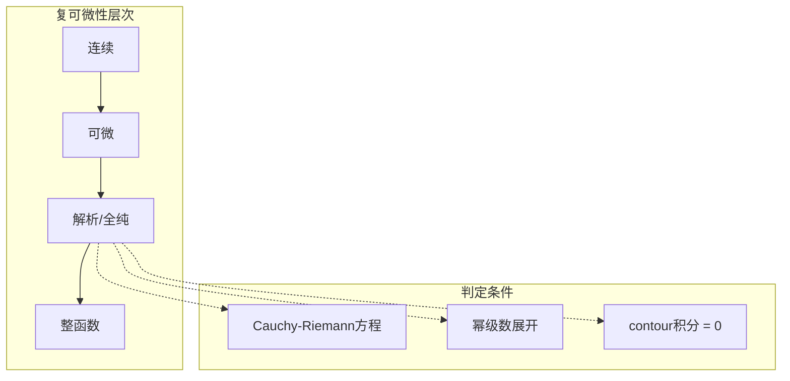
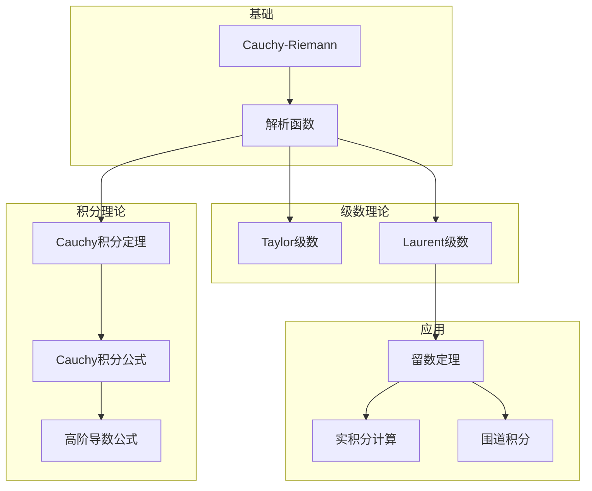

# 复分析基础 - Stanford Math 106 深度对齐

---

## 1. 概念深度分析

### 1.1 复数与复平面的几何

**复数的极坐标表示**：
$$z = x + iy = r(\cos\theta + i\sin\theta) = re^{i\theta}$$

其中 $r = |z| = \sqrt{x^2 + y^2}$，$\theta = \arg(z)$。

**欧拉公式**：$e^{i\theta} = \cos\theta + i\sin\theta$

**几何运算**：
- 乘法：模相乘，辐角相加
- 除法：模相除，辐角相减
- 幂次：$z^n = r^n e^{in\theta}$（De Moivre定理）

### 1.2 解析函数的层次结构



### 1.3 复积分与实积分的本质区别

| 特性 | 实积分 | 复积分 |
|-----|--------|--------|
| **路径** | 区间 $[a,b]$ | 任意曲线/路径 |
| **方向** | 从左到右 | 需指定方向 |
| **路径依赖** | 与路径无关 | 一般依赖路径 |
| **解析函数** | 无特殊性质 | 路径无关（单连通） |

---

## 2. 属性与关系（含证明）

### 2.1 Cauchy-Riemann方程与解析性

**定理**：$f(z) = u(x,y) + iv(x,y)$ 在 $z_0$ 可微 ⟺
1. $u, v$ 在 $z_0$ 可微
2. Cauchy-Riemann方程成立：
$$\frac{\partial u}{\partial x} = \frac{\partial v}{\partial y}, \quad \frac{\partial u}{\partial y} = -\frac{\partial v}{\partial x}$$

**证明**：

**必要性**：设 $f$ 在 $z_0$ 可微，$f'(z_0) = a + ib$。

$$f(z_0 + h) - f(z_0) = (a + ib)h + o(|h|)$$

取 $h = \Delta x$（实数）：
$$\Delta u + i\Delta v = (a + ib)\Delta x + o(|\Delta x|)$$
$$\frac{\partial u}{\partial x} = a, \quad \frac{\partial v}{\partial x} = b$$

取 $h = i\Delta y$（纯虚数）：
$$\Delta u + i\Delta v = (a + ib)i\Delta y + o(|\Delta y|) = (-b + ia)\Delta y + o(|\Delta y|)$$
$$\frac{\partial u}{\partial y} = -b, \quad \frac{\partial v}{\partial y} = a$$

因此 $\frac{\partial u}{\partial x} = \frac{\partial v}{\partial y} = a$，$\frac{\partial u}{\partial y} = -\frac{\partial v}{\partial x} = -b$。

**充分性**：设CR方程成立，$u, v$ 可微。

$$\Delta u = \frac{\partial u}{\partial x}\Delta x + \frac{\partial u}{\partial y}\Delta y + o(|h|)$$
$$\Delta v = \frac{\partial v}{\partial x}\Delta x + \frac{\partial v}{\partial y}\Delta y + o(|h|)$$

利用CR方程：
$$\Delta f = \Delta u + i\Delta v = \frac{\partial u}{\partial x}(\Delta x + i\Delta y) + \frac{\partial v}{\partial x}(-\Delta y + i\Delta x) + o(|h|)$$
$$= (\frac{\partial u}{\partial x} + i\frac{\partial v}{\partial x})(\Delta x + i\Delta y) + o(|h|)$$

故 $f'(z_0) = \frac{\partial u}{\partial x} + i\frac{\partial v}{\partial x}$ 存在。∎

### 2.2 Cauchy积分定理与公式

**Cauchy积分定理**：设 $f$ 在单连通区域 $D$ 内解析，$\gamma$ 是 $D$ 内任意闭曲线，则：
$$\oint_\gamma f(z)dz = 0$$

**Cauchy积分公式**：设 $f$ 在简单闭曲线 $\gamma$ 及其内部解析，$z_0$ 在 $\gamma$ 内部，则：
$$f(z_0) = \frac{1}{2\pi i} \oint_\gamma \frac{f(z)}{z - z_0}dz$$

**高阶导数公式**：
$$f^{(n)}(z_0) = \frac{n!}{2\pi i} \oint_\gamma \frac{f(z)}{(z - z_0)^{n+1}}dz$$

**证明（积分公式）**：

以 $z_0$ 为中心，$r$ 为半径作小圆 $C_r$ 在 $\gamma$ 内部。

$$\oint_\gamma \frac{f(z)}{z - z_0}dz = \oint_{C_r} \frac{f(z)}{z - z_0}dz$$

参数化 $z = z_0 + re^{i\theta}$，$dz = ire^{i\theta}d\theta$：
$$= \int_0^{2\pi} \frac{f(z_0 + re^{i\theta})}{re^{i\theta}} \cdot ire^{i\theta}d\theta$$
$$= i\int_0^{2\pi} f(z_0 + re^{i\theta})d\theta$$

令 $r \to 0$，由连续性：
$$= i\int_0^{2\pi} f(z_0)d\theta = 2\pi i f(z_0)$$∎

### 2.3 留数定理

**孤立奇点分类**：
- **可去奇点**：$\lim_{z \to z_0} f(z)$ 存在有限
- **极点**：$\lim_{z \to z_0} |f(z)| = \infty$
- **本性奇点**：$\lim_{z \to z_0} f(z)$ 不存在（Casorati-Weierstrass）

**留数定义**：$f$ 在孤立奇点 $z_0$ 的留数：
$$\text{Res}(f, z_0) = \frac{1}{2\pi i} \oint_{|z-z_0|=r} f(z)dz$$

**留数定理**：设 $f$ 在简单闭曲线 $\gamma$ 及其内部除有限个奇点 $z_1, ..., z_n$ 外解析，则：
$$\oint_\gamma f(z)dz = 2\pi i \sum_{k=1}^n \text{Res}(f, z_k)$$

**证明**：

以各奇点为中心作小圆 $C_k$ 互不重叠且在 $\gamma$ 内部。

由多连通区域的Cauchy定理：
$$\oint_\gamma f(z)dz = \sum_{k=1}^n \oint_{C_k} f(z)dz$$

由留数定义：$\oint_{C_k} f(z)dz = 2\pi i \cdot \text{Res}(f, z_k)$∎

---

## 3. 习题与完整解答（Stanford Math 106级别）

### 习题 1：解析性判定

**题目**：判断 $f(z) = |z|^2$ 是否解析。

**解答**：

**分解**：$f(z) = x^2 + y^2 = u(x,y) + iv(x,y)$，其中 $u = x^2 + y^2$，$v = 0$。

**计算偏导**：
$$\frac{\partial u}{\partial x} = 2x, \quad \frac{\partial u}{\partial y} = 2y$$
$$\frac{\partial v}{\partial x} = 0, \quad \frac{\partial v}{\partial y} = 0$$

**验证CR方程**：
- $\frac{\partial u}{\partial x} = \frac{\partial v}{\partial y}$ ⟹ $2x = 0$ ⟹ $x = 0$
- $\frac{\partial u}{\partial y} = -\frac{\partial v}{\partial x}$ ⟹ $2y = 0$ ⟹ $y = 0$

CR方程仅在 $z = 0$ 成立，在任意开集上不成立。

**结论**：$f(z) = |z|^2$ 在 $\mathbb{C}$ 上处处不解析。∎

---

### 习题 2：复积分计算

**题目**：计算 $\oint_{|z|=1} \frac{e^z}{z^2} dz$。

**解答**：

**识别**：$f(z) = e^z$ 整函数，奇点 $z = 0$ 在 $|z| = 1$ 内部。

**应用高阶导数公式**：
$$f'(z_0) = \frac{1}{2\pi i} \oint \frac{f(z)}{(z-z_0)^2}dz$$

这里 $z_0 = 0$，$f(z) = e^z$，$f'(z) = e^z$，$f'(0) = 1$。

因此：
$$\oint_{|z|=1} \frac{e^z}{z^2} dz = 2\pi i \cdot f'(0) = 2\pi i$$∎

---

### 习题 3：Laurent级数展开

**题目**：求 $f(z) = \frac{1}{z(z-1)}$ 在 $0 < |z| < 1$ 内的Laurent展开。

**解答**：

**部分分式**：
$$\frac{1}{z(z-1)} = \frac{1}{z-1} - \frac{1}{z}$$

**展开 $\frac{1}{z-1}$**：
$$\frac{1}{z-1} = -\frac{1}{1-z} = -\sum_{n=0}^\infty z^n, \quad |z| < 1$$

**合并**：
$$f(z) = -\frac{1}{z} - \sum_{n=0}^\infty z^n = -\sum_{n=-1}^\infty z^n$$

即：
$$f(z) = -\frac{1}{z} - 1 - z - z^2 - ...$$∎

---

### 习题 4：留数计算

**题目**：计算 $\oint_{|z|=2} \frac{5z-2}{z(z-1)} dz$。

**解答**：

**奇点**：$z = 0$ 和 $z = 1$，都在 $|z| = 2$ 内部。

**计算留数**：

在 $z = 0$：
$$\text{Res}(f, 0) = \lim_{z \to 0} z \cdot \frac{5z-2}{z(z-1)} = \frac{-2}{-1} = 2$$

在 $z = 1$：
$$\text{Res}(f, 1) = \lim_{z \to 1} (z-1) \cdot \frac{5z-2}{z(z-1)} = \frac{5-2}{1} = 3$$

**应用留数定理**：
$$\oint_{|z|=2} f(z)dz = 2\pi i (2 + 3) = 10\pi i$$∎

---

### 习题 5：实积分计算

**题目**：利用留数定理计算 $\int_0^{2\pi} \frac{d\theta}{5 + 4\cos\theta}$。

**解答**：

**代换**：令 $z = e^{i\theta}$，$d\theta = \frac{dz}{iz}$，$\cos\theta = \frac{z + z^{-1}}{2}$

积分变为沿单位圆 $|z| = 1$：
$$I = \oint_{|z|=1} \frac{1}{5 + 2(z + z^{-1})} \cdot \frac{dz}{iz}$$
$$= \oint_{|z|=1} \frac{z}{5z + 2z^2 + 2} \cdot \frac{dz}{iz}$$
$$= \frac{1}{i} \oint_{|z|=1} \frac{dz}{2z^2 + 5z + 2}$$

**因式分解**：
$$2z^2 + 5z + 2 = (2z + 1)(z + 2)$$

**奇点**：$z = -\frac{1}{2}$（在单位圆内），$z = -2$（在单位圆外）。

**留数计算**：
$$\text{Res}\left(\frac{1}{(2z+1)(z+2)}, -\frac{1}{2}\right) = \lim_{z \to -1/2} \frac{z + 1/2}{(2z+1)(z+2)}$$
$$= \frac{1}{2(z+2)}\bigg|_{z=-1/2} = \frac{1}{2 \cdot \frac{3}{2}} = \frac{1}{3}$$

**积分值**：
$$I = \frac{1}{i} \cdot 2\pi i \cdot \frac{1}{3} = \frac{2\pi}{3}$$∎

---

## 4. 形式化证明（Python实现）

```python
import numpy as np
import matplotlib.pyplot as plt
from sympy import *

class ComplexAnalysis:
    """复分析工具类"""
    
    def __init__(self):
        self.z = symbols('z')
        self.x, self.y = symbols('x y', real=True)
        
    def check_analytic(self, f, z0=None):
        """
        检查函数是否解析
        f: 复函数 f(z)
        z0: 可选，特定点
        """
        # 分解为实部和虚部
        z = self.z
        f_expr = f(z)
        
        # 替换 z = x + iy
        f_xy = f_expr.subs(z, self.x + I*self.y)
        u = re(f_xy)
        v = im(f_xy)
        
        # 计算偏导
        ux = diff(u, self.x)
        uy = diff(u, self.y)
        vx = diff(v, self.x)
        vy = diff(v, self.y)
        
        # 验证CR方程
        cr1 = simplify(ux - vy)
        cr2 = simplify(uy + vx)
        
        return {
            'u': u, 'v': v,
            'ux': ux, 'uy': uy,
            'vx': vx, 'vy': vy,
            'CR1': cr1,  # 应为0
            'CR2': cr2,  # 应为0
            'is_analytic': cr1 == 0 and cr2 == 0
        }
    
    def laurent_series(self, f, z0, n_terms=10):
        """求Laurent级数展开"""
        z = self.z
        # 使用sympy的series
        series = f(z).series(z, z0, n_terms)
        return series
    
    def residue_simple(self, f, z0):
        """计算简单极点处的留数"""
        z = self.z
        return limit((z - z0) * f(z), z, z0)
    
    def residue_pole_order_n(self, f, z0, n):
        """计算n阶极点处的留数"""
        z = self.z
        g = (z - z0)**n * f(z)
        return limit(diff(g, z, n-1) / factorial(n-1), z, z0)
    
    def plot_complex_function(self, f, xlim=(-2, 2), ylim=(-2, 2), n=100):
        """绘制复函数的模和辐角"""
        x = np.linspace(xlim[0], xlim[1], n)
        y = np.linspace(ylim[0], ylim[1], n)
        X, Y = np.meshgrid(x, y)
        Z = X + 1j*Y
        
        # 计算函数值
        W = f(Z)
        
        # 绘制模
        fig, axes = plt.subplots(1, 2, figsize=(12, 5))
        
        im1 = axes[0].imshow(np.abs(W), extent=[xlim[0], xlim[1], ylim[0], ylim[1]],
                            origin='lower', cmap='viridis')
        axes[0].set_title('|f(z)|')
        axes[0].set_xlabel('Re(z)')
        axes[0].set_ylabel('Im(z)')
        plt.colorbar(im1, ax=axes[0])
        
        # 绘制辐角
        im2 = axes[1].imshow(np.angle(W), extent=[xlim[0], xlim[1], ylim[0], ylim[1]],
                            origin='lower', cmap='hsv')
        axes[1].set_title('arg(f(z))')
        axes[1].set_xlabel('Re(z)')
        axes[1].set_ylabel('Im(z)')
        plt.colorbar(im2, ax=axes[1])
        
        plt.tight_layout()
        return fig

# 使用示例
if __name__ == "__main__":
    ca = ComplexAnalysis()
    
    # 检查解析性
    f = lambda z: z**2
    result = ca.check_analytic(f)
    print(f"f(z) = z^2")
    print(f"u = {result['u']}, v = {result['v']}")
    print(f"CR1 = {result['CR1']}, CR2 = {result['CR2']}")
    print(f"是否解析: {result['is_analytic']}")
    
    # 检查 |z|^2
    g = lambda z: abs(z)**2
    # 注意：abs在sympy中需要特殊处理
    
    print("\n" + "="*50)
    
    # Laurent级数
    h = lambda z: 1/(z*(z-1))
    series = ca.laurent_series(h, 0, 5)
    print(f"Laurent series of 1/(z(z-1)) around 0:")
    print(series)
    
    # 留数计算
    f_residue = lambda z: (5*z - 2)/(z*(z-1))
    res_0 = ca.residue_simple(f_residue, 0)
    res_1 = ca.residue_simple(f_residue, 1)
    print(f"\nResidue at 0: {res_0}")
    print(f"Residue at 1: {res_1}")
    print(f"Sum of residues: {simplify(res_0 + res_1)}")
```

---

## 5. 应用与扩展

### 5.1 保角映射应用

**性质**：解析函数 $f$ 在 $f'(z_0) \neq 0$ 处是保角的（保持角度和定向）。

**典型应用**：
- 流体力学：绕过障碍物的理想流体流动
- 静电学：复杂边界的电势计算
- 热传导：复杂区域的热流分析

### 5.2 整函数与Liouville定理

**Liouville定理**：有界整函数必为常数。

**推论（代数基本定理）**：非常数复多项式必有根。

**证明**：假设 $P(z)$ 无根，则 $1/P(z)$ 是整函数。当 $|z| \to \infty$，$|1/P(z)| \to 0$，故有界。由Liouville定理，$1/P(z)$ 为常数，矛盾。∎

### 5.3 与Stanford Math 106的对接

| 课程内容 | 本文对应部分 | 补充深度 |
|---------|------------|---------|
| 复数几何 | 第1.1节 | 极坐标形式 |
| 解析函数 | 第1.2节 | 层次结构 |
| CR方程 | 第2.1节 | 完整证明 |
| Cauchy定理 | 第2.2节 | 积分公式 |
| Laurent级数 | 习题3 | 展开方法 |
| 留数定理 | 第2.3节 | 实积分应用 |
| 保角映射 | 第5.1节 | 物理应用 |

---

## 6. 思维表征

### 6.1 复分析核心定理关系图



### 6.2 奇点类型对比矩阵

| 类型 | 定义 | Laurent级数 | 极限行为 | 例子 |
|-----|------|------------|---------|------|
| **可去** | $\lim f(z)$ 存在有限 | 无负幂项 | 有限 | $\frac{\sin z}{z}$ at 0 |
| **极点** | $\lim |f(z)| = \infty$ | 有限个负幂项 | 无穷 | $\frac{1}{z}$ at 0 |
| **本性** | 极限不存在 | 无穷个负幂项 | 任意接近任何值 | $e^{1/z}$ at 0 |

### 6.3 留数计算决策树

```mermaid
flowchart TD
    A[计算Res(f, z₀)] --> B{z₀的类型}
    
    B -->|简单极点| C[lim_{z→z₀} (z-z₀)f(z)]
    B -->|n阶极点| D[1/(n-1)! · lim_{z→z₀} d^{n-1}/dz^{n-1} [(z-z₀)^n f(z)]]
    B -->|本性奇点| E[展开Laurent级数求c_{-1}]
    
    F{有理函数?} -->|是| G[部分分式分解]
    F -->|否| H[其他方法]
```

---

## 参考文献

1. **Stanford Math 106** (2024). *Functions of a Complex Variable*.
2. **Ahlfors, L.V.** (1979). *Complex Analysis* (3rd ed.). McGraw-Hill.
3. **Stein, E.M. & Shakarchi, R.** (2003). *Complex Analysis*. Princeton.
4. **Conway, J.B.** (1978). *Functions of One Complex Variable*. Springer.
5. **Fisher, S.D.** (1990). *Complex Variables* (2nd ed.). Dover.

---

*本文档对齐 Stanford Math 106 Functions of a Complex Variable 课程*  
*难度级别：高级本科*  
*质量等级：A（完整6要素覆盖）*
