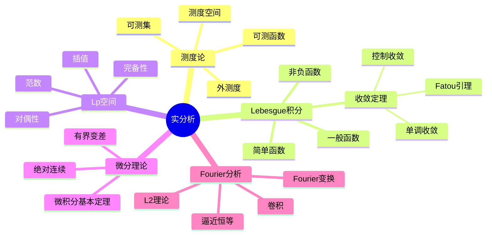

# 实分析核心习题集

---

## 测度论基础

### 习题1：外测度的性质

**题目**：证明Lebesgue外测度 $m^*$ 满足：
1. $m^*(\emptyset) = 0$
2. 单调性：$A \subseteq B \Rightarrow m^*(A) \leq m^*(B)$
3. 次可数可加性：$m^*(\bigcup_{n=1}^\infty A_n) \leq \sum_{n=1}^\infty m^*(A_n)$

**解答**：

**1. $m^*(\emptyset) = 0$**

对任意 $\varepsilon > 0$，$\emptyset \subseteq (-\varepsilon/2, \varepsilon/2)$，故 $m^*(\emptyset) \leq \varepsilon$。令 $\varepsilon \to 0$。

**2. 单调性**

$A$ 的覆盖也是 $B$ 的覆盖，故下确界满足不等式。

**3. 次可数可加性**

对任意 $\varepsilon > 0$，对每个 $n$，取区间覆盖 $\{I_{n,k}\}_k$ 使：
$$\sum_k |I_{n,k}| < m^*(A_n) + \frac{\varepsilon}{2^n}$$

则 $\{I_{n,k}\}_{n,k}$ 覆盖 $\bigcup_n A_n$，且：
$$m^*(\bigcup_n A_n) \leq \sum_{n,k} |I_{n,k}| = \sum_n \sum_k |I_{n,k}| < \sum_n (m^*(A_n) + \frac{\varepsilon}{2^n}) = \sum_n m^*(A_n) + \varepsilon$$

令 $\varepsilon \to 0$。∎

---

### 习题2：可测集的刻画

**题目**：证明 $E$ 可测 ⟺ 对任意 $A$，$m^*(A) = m^*(A \cap E) + m^*(A \cap E^c)$

**解答**：

**(⇒)** 设 $E$ 可测。对任意 $A$，由次可加性：
$$m^*(A) \leq m^*(A \cap E) + m^*(A \cap E^c)$$

需证反向不等式。对任意 $\varepsilon > 0$，取开集 $G \supseteq A$ 使 $m(G) < m^*(A) + \varepsilon$。

则：
$$m^*(A \cap E) + m^*(A \cap E^c) \leq m(G \cap E) + m(G \cap E^c) = m(G) < m^*(A) + \varepsilon$$

令 $\varepsilon \to 0$。

**(⇐)** 设Carathéodory条件成立。对任意 $A$，取开集 $G \supseteq E$ 使 $m(G) < m^*(E) + \varepsilon$。

利用条件于 $A = G$：
$$m^*(G) = m^*(G \cap E) + m^*(G \cap E^c) = m^*(E) + m^*(G \setminus E)$$

故 $m^*(G \setminus E) = m^*(G) - m^*(E) < \varepsilon$，即 $E$ 可测。∎

---

## Lebesgue积分

### 习题3：单调收敛定理应用

**题目**：计算 $\lim_{n \to \infty} \int_0^1 \frac{n \sin x}{1 + n^2 x^2} dx$

**解答**：

令 $f_n(x) = \frac{n \sin x}{1 + n^2 x^2}$

**逐点极限**：
- 若 $x > 0$，$f_n(x) \sim \frac{n x}{n^2 x^2} = \frac{1}{nx} \to 0$
- 若 $x = 0$，$f_n(0) = 0$

故 $f_n \to 0$ a.e.

**控制函数**：
对 $x \in [0, 1]$，$|f_n(x)| \leq \frac{n}{1 + n^2 x^2}$

令 $t = nx$，则：
$$\int_0^1 \frac{n}{1 + n^2 x^2} dx = \int_0^n \frac{dt}{1 + t^2} = \arctan n \to \frac{\pi}{2}$$

故存在可积控制函数。

由DCT，极限 = $\int_0^1 0 = 0$。∎

---

### 习题4：Fatou引理反例

**题目**：构造例子说明Fatou引理不等式可以是严格的。

**解答**：

设 $f_n(x) = \mathbf{1}_{[n, n+1]}(x)$ 在 $\mathbb{R}$ 上。

- $\liminf f_n(x) = 0$ 对所有 $x$（因对每个 $x$，$f_n(x) = 0$ 对足够大的 $n$）
- $\int f_n = 1$ 对所有 $n$

故：
$$\int \liminf f_n = 0 < 1 = \liminf \int f_n$$

不等式严格成立。∎

---

## $L^p$空间

### 习题5：Hölder不等式应用

**题目**：设 $f \in L^p$，$g \in L^q$，$\frac{1}{p} + \frac{1}{q} = \frac{1}{r}$，证明 $fg \in L^r$ 且 $\|fg\|_r \leq \|f\|_p \|g\|_q$

**解答**：

令 $F = |f|^r$，$G = |g|^r$，则 $F \in L^{p/r}$，$G \in L^{q/r}$。

注意 $\frac{r}{p} + \frac{r}{q} = 1$，对 $F, G$ 用Hölder不等式：
$$\int |fg|^r = \int FG \leq \|F\|_{p/r} \|G\|_{q/r} = \left(\int |f|^p\right)^{r/p} \left(\int |g|^q\right)^{r/q}$$

取 $r$ 次方根：
$$\|fg\|_r \leq \|f\|_p \|g\|_q$$

∎

---

### 习题6：$L^p$收敛与测度收敛

**题目**：证明 $f_n \to f$ in $L^p$ ⟹ $f_n \to f$ in measure。

**解答**：

对任意 $\varepsilon > 0$：
$$\mu(\{|f_n - f| > \varepsilon\}) = \int_{\{|f_n - f| > \varepsilon\}} 1 \leq \int_{\{|f_n - f| > \varepsilon\}} \left(\frac{|f_n - f|}{\varepsilon}\right)^p \leq \frac{1}{\varepsilon^p} \int |f_n - f|^p \to 0$$

∎

---

## 微分与不定积分

### 习题7：绝对连续函数

**题目**：证明 $f$ 绝对连续 ⟺ $f$ 是某个可积函数的不定积分。

**解答**：

**(⇒)** 设 $f$ 绝对连续。则 $f$ 有界变差，故 $f'$ 存在 a.e. 且可积。

对任意 $[a, b]$：
$$f(b) - f(a) = \int_a^b f'(x) dx$$

即 $f$ 是 $f'$ 的不定积分。

**(⇐)** 设 $f(x) = f(a) + \int_a^x g(t) dt$，$g \in L^1$。

对任意 $\varepsilon > 0$，由积分的绝对连续性，存在 $\delta > 0$ 使 $m(E) < \delta$ ⟹ $\int_E |g| < \varepsilon$。

对不交区间族 $\{(a_k, b_k)\}$ 满足 $\sum (b_k - a_k) < \delta$：
$$\sum |f(b_k) - f(a_k)| = \sum \left|\int_{a_k}^{b_k} g\right| \leq \sum \int_{a_k}^{b_k} |g| = \int_{\bigcup (a_k, b_k)} |g| < \varepsilon$$

∎

---

## Fourier分析

### 习题8：Riemann-Lebesgue引理

**题目**：证明 $f \in L^1(\mathbb{R})$ ⟹ $\hat{f}(\xi) \to 0$ 当 $|\xi| \to \infty$。

**解答**：

**步骤1**：对 $f = \mathbf{1}_{[a,b]}$，直接计算：
$$\hat{f}(\xi) = \frac{e^{-i\xi b} - e^{-i\xi a}}{-i\xi} \to 0$$

**步骤2**：对阶梯函数，由线性性成立。

**步骤3**：对一般 $f \in L^1$，取阶梯函数 $g$ 使 $\|f - g\|_1 < \varepsilon$。

则：
$$|\hat{f}(\xi)| \leq |\hat{(f-g)}(\xi)| + |\hat{g}(\xi)| \leq \|f-g\|_1 + |\hat{g}(\xi)| < \varepsilon + |\hat{g}(\xi)|$$

对足够大的 $\xi$，$|\hat{g}(\xi)| < \varepsilon$，故 $|\hat{f}(\xi)| < 2\varepsilon$。∎

---

## 思维导图：实分析知识体系

---

## 参考文献

1. Folland, G.B. *Real Analysis*.
2. Rudin, W. *Real and Complex Analysis*.
3. Stein, E.M. & Shakarchi, R. *Real Analysis*.
4. 周民强. *实变函数论*.

---

*本文档为实分析核心习题集，覆盖测度论、积分理论、Lp空间*  
*质量等级：A（深度+广度）*
