# 数学思维表征完全指南

> 系统化思维工具构建与应用的完整方法论

## 概述

数学思维表征是将抽象数学概念可视化和结构化的过程。本指南系统介绍四种核心思维表征工具：思维导图、矩阵对比、决策树和知识图谱，帮助学习者构建深度理解。

---

## 第一部分：思维导图绘制方法

### 1.1 思维导图的类型

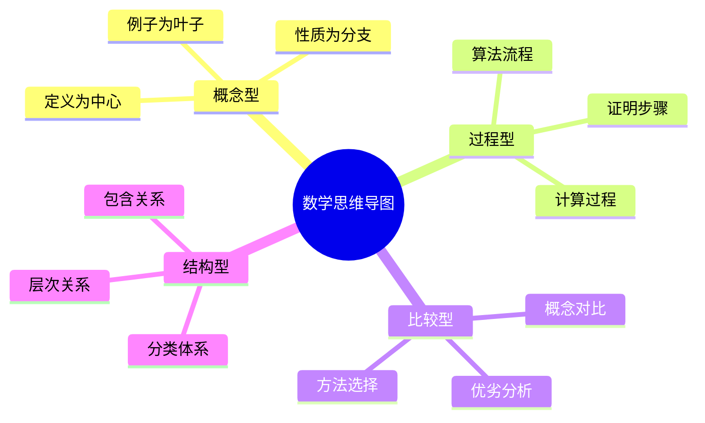

### 1.2 绘制原则

**核心原则：**

| 原则 | 说明 | 示例 |
|:---:|:---:|:---:|
| 中心明确 | 核心概念置于中心 | 群论：以"群"为中心 |
| 层次分明 | 主分支不超过7个 | 代数、几何、分析... |
| 关键词原则 | 使用而非长句 | "交换"而非"群是交换的" |
| 视觉编码 | 颜色、形状区分 | 定义用方框，定理用椭圆 |
| 关联标注 | 跨分支联系 | 虚线连接相关概念 |

### 1.3 绘制步骤

**Step 1：确定中心主题**
```
示例：线性代数
中心：向量空间
```

**Step 2：识别一级分支**
```
- 基本概念（向量、空间）
- 核心结构（基、维数）
- 线性映射
- 矩阵表示
- 内积空间
- 特征理论
- 应用
```

**Step 3：逐级展开**
```
线性映射
├── 定义
│   ├── 线性性
│   └── 例子
├── 核与像
│   ├── 秩-零化度定理
│   └── 同构定理
├── 运算
│   ├── 复合
│   └── 逆
└── 表示
    ├── 矩阵
    └── 基变换
```

**Step 4：添加关联**
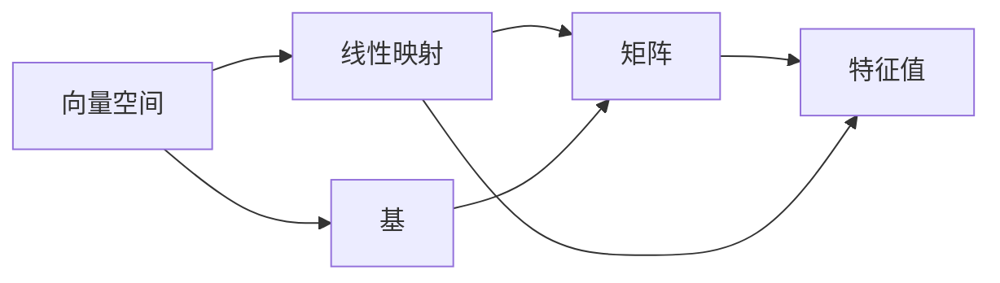

### 1.4 工具推荐

| 工具 | 特点 | 适用场景 |
|:---:|:---:|:---:|
| XMind | 功能全面 | 复杂导图 |
| MindMeister | 在线协作 | 团队项目 |
| FreeMind | 开源免费 | 个人学习 |
| 纸笔 | 灵活快速 | 头脑风暴 |
| Mermaid | 代码生成 | 技术文档 |

---

## 第二部分：矩阵对比技巧

### 2.1 对比矩阵的设计

**基本结构：**

| 对比维度 ↓ \ 对象 → | 对象A | 对象B | 对象C | ... |
|:---:|:---:|:---:|:---:|:---:|
| **特征1** | | | | |
| **特征2** | | | | |
| **特征3** | | | | |
| **应用** | | | | |

### 2.2 常用对比维度

**代数结构对比：**

| 结构 | 运算 | 单位元 | 逆元 | 交换性 | 例子 |
|:---:|:---:|:---:|:---:|:---:|:---:|
| 群 | 1个 | ✓ | ✓ | 可选 | (ℤ, +) |
| 环 | 2个 | +有，×可选 | +有，×无 | ×可选 | (ℤ, +, ×) |
| 域 | 2个 | 都有 | 非零有 | ×必须 | (ℚ, +, ×) |
| 向量空间 | 2个（+，数乘） | +有 | +有 | +必须 | ℝⁿ |

**收敛类型对比：**

| 收敛类型 | 定义 | 保持连续性 | 保持积分 | 保持微分 | 例子 |
|:---:|:---:|:---:|:---:|:---:|:---:|
| 逐点 | 每点收敛 | ✗ | ✗ | ✗ | $x^n$ on [0,1] |
| 一致 | sup范数收敛 | ✓ | ✓ | ✗ | Weierstrass M |
| $L^1$ | 积分范数 | N/A | ✓ | N/A | 逼近恒等 |
| $L^2$ | 均方收敛 | N/A | ✓ | N/A | Fourier级数 |
| 几乎处处 | 零测集外 | ✗ | ✗ | ✗ | 子列收敛 |

### 2.3 高级对比：性质蕴含图

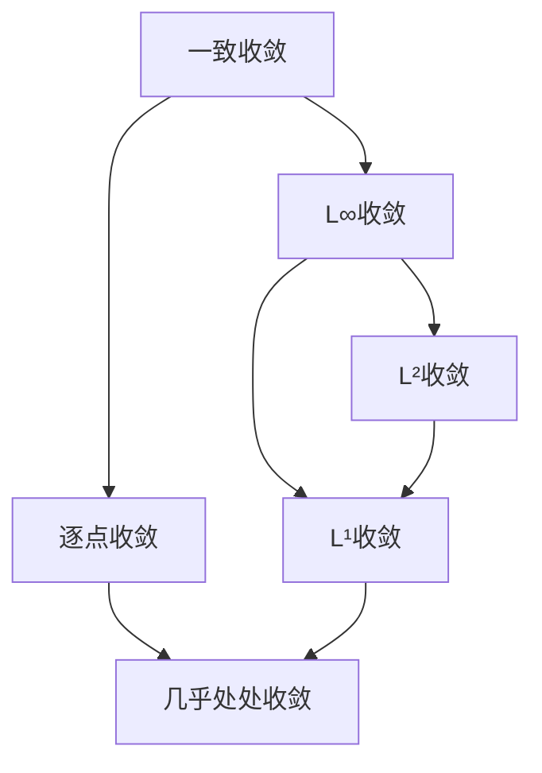

### 2.4 对比矩阵的变体

**权重对比矩阵（决策分析）：**

| 方法 | 准确性 | 计算成本 | 实现难度 | 总分 |
|:---:|:---:|:---:|:---:|:---:|
| 权重 | 0.4 | 0.3 | 0.3 | |
| 方法A | 9 | 6 | 8 | 7.8 |
| 方法B | 8 | 8 | 7 | 7.7 |
| 方法C | 10 | 4 | 5 | 7.1 |

---

## 第三部分：决策树构建

### 3.1 决策树的结构

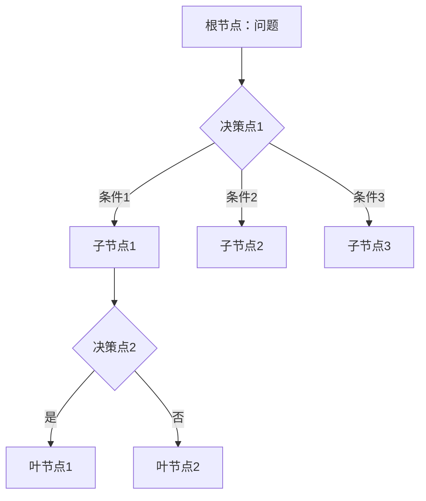

### 3.2 数学问题决策树示例

**积分方法选择：**

```mermaid
flowchart TD
    A[计算∫f(x)dx] --> B{被积函数形式?}
    
    B -->|有理函数| C[部分分式分解]
    B -->|三角函数| D{幂次?}
    B -->|指数×多项式| E[分部积分]
    B -->|根式| F[换元去根号]
    B -->|复合函数| G{内函数导数?}
    
    D -->|偶次| D1[降幂公式]
    D -->|奇次| D2[凑微分]
    
    G -->|是| G1[第一类换元]
    G -->|否| G2[尝试其他方法]
```

**证明方法选择：**

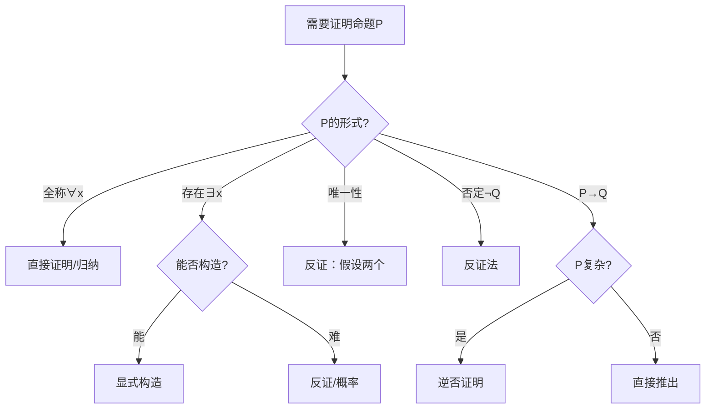

### 3.3 决策树构建原则

1. **完备性：** 覆盖所有可能情况
2. **互斥性：** 分支条件不重叠
3. **简洁性：** 避免过度复杂
4. **有效性：** 每个分支导向明确结论

---

## 第四部分：知识图谱构建

### 4.1 知识图谱的基本元素

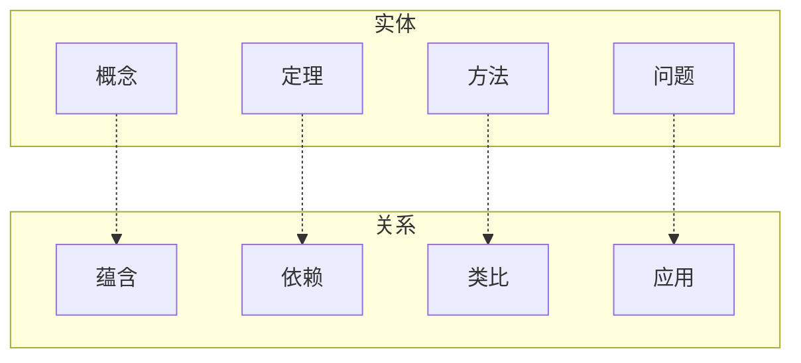

### 4.2 概念依赖图谱

**示例：微积分概念依赖**

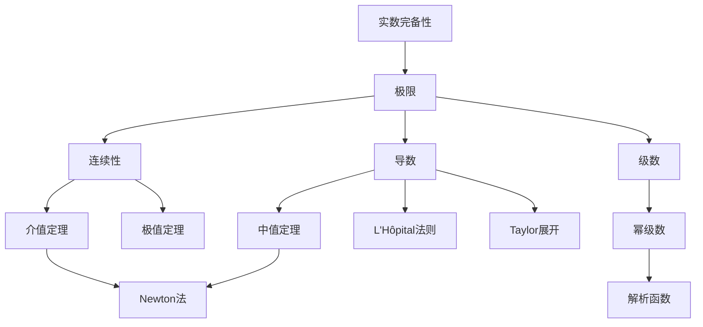

### 4.3 跨领域知识图谱

**代数-几何-分析联系：**

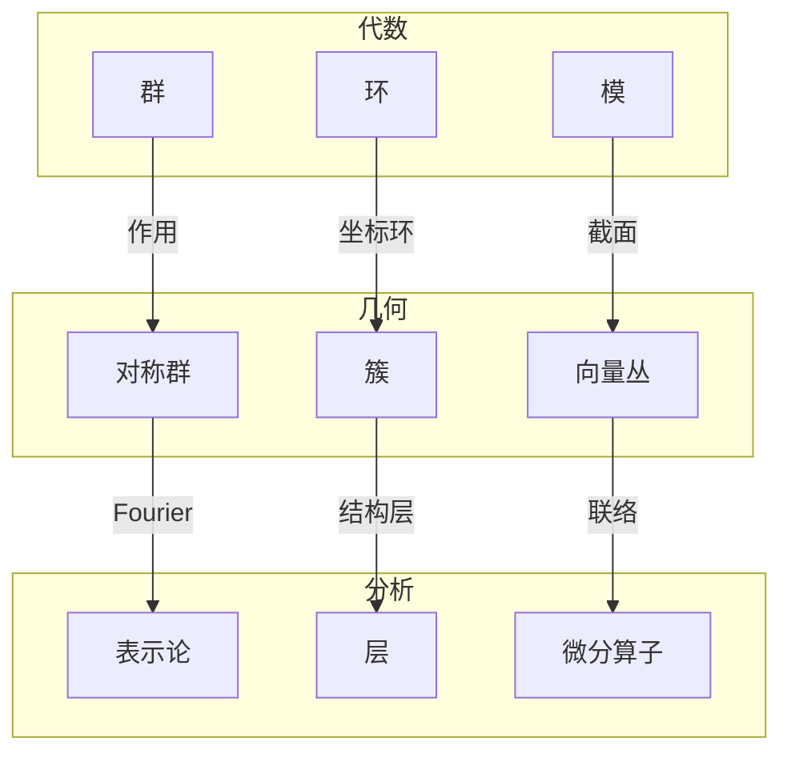

### 4.4 知识图谱构建步骤

**Step 1：知识抽取**
- 识别核心概念
- 提取定义关系
- 标注定理依赖

**Step 2：关系定义**
- 先修关系（prerequisite）
- 蕴含关系（implies）
- 类比关系（analogy）
- 对偶关系（dual）

**Step 3：图谱可视化**
- 力导向布局
- 层次布局
- 圆形布局

**Step 4：验证与迭代**
- 专家审查
- 学习效果评估
- 持续更新

---

## 第五部分：综合应用

### 5.1 学习路径规划

**示例：从微积分到代数几何**

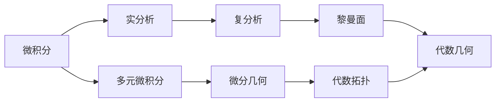

### 5.2 问题解决流程图

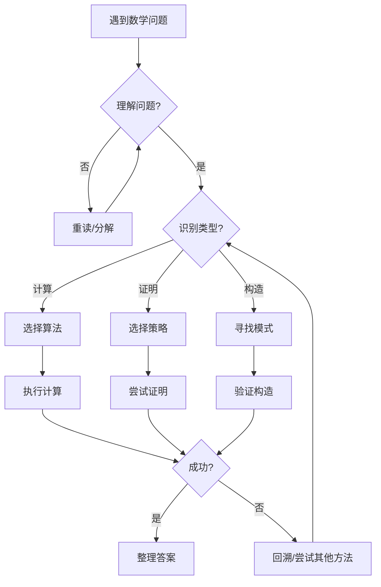

### 5.3 概念理解检查矩阵

| 概念 | 能定义 | 能举例 | 能应用 | 能证明 | 能关联 |
|:---:|:---:|:---:|:---:|:---:|:---:|
| 极限 | □ | □ | □ | □ | □ |
| 连续性 | □ | □ | □ | □ | □ |
| 可微性 | □ | □ | □ | □ | □ |
| 可积性 | □ | □ | □ | □ | □ |

---

## 第六部分：工具与实践

### 6.1 推荐工具组合

| 用途 | 工具 | 学习曲线 | 协作 |
|:---:|:---:|:---:|:---:|
| 思维导图 | XMind + Mermaid | 中 | 中 |
| 矩阵分析 | Excel + Markdown | 低 | 高 |
| 决策树 | draw.io + Mermaid | 低 | 高 |
| 知识图谱 | Neo4j + D3.js | 高 | 中 |
| 综合笔记 | Obsidian + 插件 | 中 | 低 |

### 6.2 个人知识管理系统

```
PKM/
├── 思维导图/
│   ├── 概念图谱.mmd
│   ├── 定理依赖.mmd
│   └── 学习方法.mmd
├── 对比矩阵/
│   ├── 代数结构对比.md
│   ├── 收敛类型对比.md
│   └── 拓扑性质对比.md
├── 决策树/
│   ├── 积分策略.md
│   ├── 证明方法.md
│   └── 问题诊断.md
└── 知识图谱/
    ├── 概念节点.json
    ├── 关系边.json
    └── 可视化.html
```

### 6.3 实践练习

**练习1：构建微积分概念思维导图**

要求：
- 以"微积分基本定理"为中心
- 包含极限、导数、积分三大分支
- 标注关键定理和反例
- 使用Mermaid语法

**练习2：创建线性代数方法对比矩阵**

维度：
- 方法：高斯消元、Cramer法则、逆矩阵、迭代法
- 特征：时间复杂度、数值稳定性、适用范围、实现难度

**练习3：设计证明策略决策树**

覆盖：
- 等式证明
- 不等式证明
- 存在性证明
- 唯一性证明

---

## 第七部分：进阶技巧

### 7.1 多维思维表征

**时间维度：** 概念的历史发展
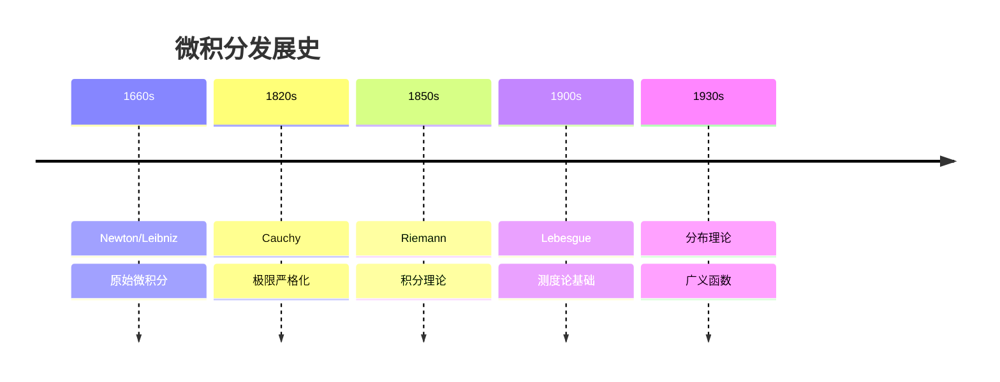

**抽象维度：** 从具体例到抽象概念
```
例子层：ℝ³, ℂ², 多项式空间
    ↓
模型层：ℝⁿ, ℂⁿ, F[t]
    ↓
公理层：向量空间公理
    ↓
泛化层：模、层、束
```

### 7.2 交互式表征

**可探索的知识图谱：**
- 点击概念查看详情
- 拖拽调整布局
- 筛选显示特定关系
- 路径查找（概念A如何到概念B）

---

## 参考资源

- [如何提出好问题](../04-习题与练习/11-如何提出好问题.md)
- [数学猜想构造方法](../04-习题与练习/12-数学猜想构造方法.md)
- [反例构造艺术](../04-习题与练习/13-反例构造艺术.md)
- [证明策略决策树](../04-习题与练习/14-证明策略决策树.md)
- [Mermaid官方文档](https://mermaid.js.org/)
