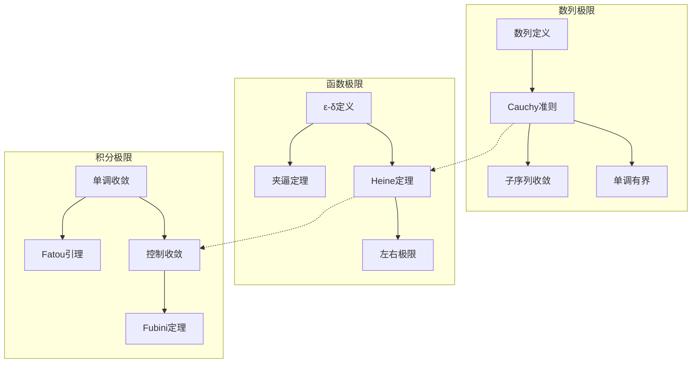
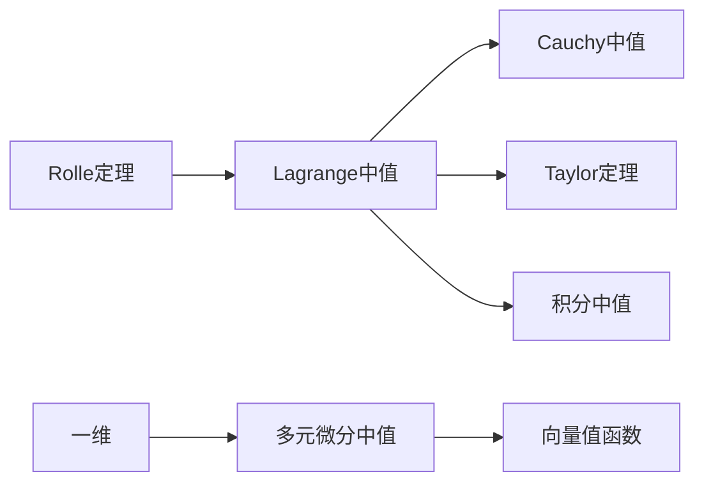
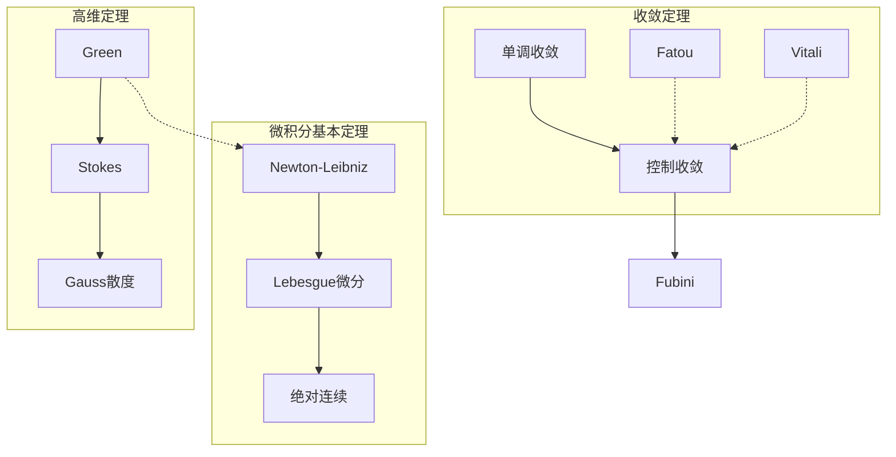
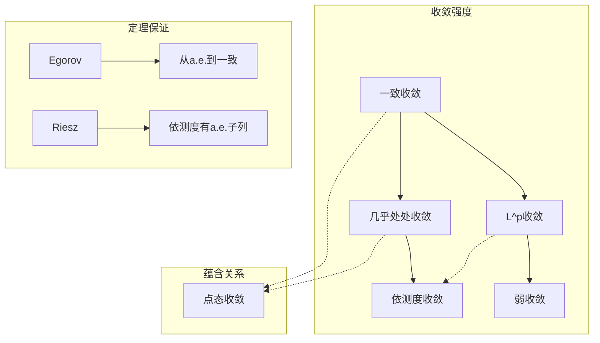
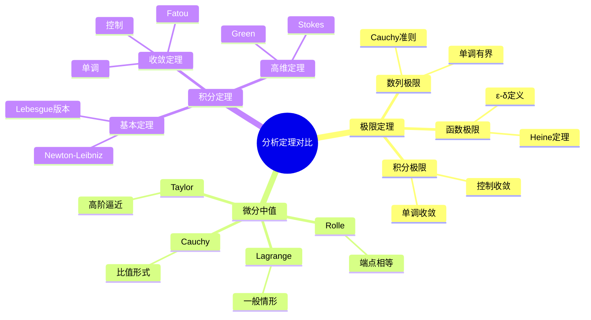

# 核心定理对比矩阵

> 本文档系统对比分析学中核心定理的异同，帮助理解定理间的联系与区别。

---

## 1. 极限定理对比

### 1.1 数列极限 vs 函数极限 vs 积分极限

| 对比维度 | 数列极限 | 函数极限 | 积分极限 |
|---------|---------|---------|---------|
| **基本形式** | $\lim_{n\to\infty} a_n = L$ | $\lim_{x\to a} f(x) = L$ | $\lim_{n\to\infty} \int f_n = \int \lim f_n$ |
| **收敛模式** | 离散收敛 | 连续收敛 | 测度收敛 |
| **核心定理** | Cauchy收敛准则 | Heine定理 | 控制收敛定理 |
| **等价条件** | 有界+单调 | 左右极限相等 | 控制函数存在 |
| **运算性质** | 和/差/积/商 | 复合函数极限 | 线性性保持 |
| **判断方法** | 夹逼定理、单调有界 | 夹逼定理、L'Hôpital | 单调收敛、控制收敛 |
| **反例特征** | 振荡、无界 | 振荡、跳跃 | 无控制函数 |

### 1.2 极限定理依赖关系图



---

## 2. 微分中值定理对比

### 2.1 中值定理对比矩阵

| 定理 | 条件 | 结论 | 几何意义 | 主要应用 |
|-----|------|------|---------|---------|
| **Rolle定理** | $f$连续，$[a,b]$可导，$f(a)=f(b)$ | $\exists c, f'(c)=0$ | 水平切线 | 零点存在性 |
| **Lagrange中值** | $f$连续，$[a,b]$可导 | $f'(c)=\frac{f(b)-f(a)}{b-a}$ | 平行于割线 | 估计、不等式 |
| **Cauchy中值** | $f,g$连续，$[a,b]$可导，$g'\neq 0$ | $\frac{f'(c)}{g'(c)}=\frac{f(b)-f(a)}{g(b)-g(a)}$ | 参数曲线切线 | L'Hôpital法则 |
| **Taylor定理** | $f$有$n+1$阶导数 | 多项式逼近+余项 | 局部逼近 | 近似计算、极值 |
| **积分中值** | $f$连续，$g$可积且不变号 | $\int_a^b fg = f(c)\int_a^b g$ | 平均值 | 积分估计 |

### 2.2 中值定理推广链条



### 2.3 不同维度对比

| 维度 | 一维 | 多元 | 向量值 |
|-----|------|------|-------|
| **Rolle推广** | 原形式 | 无直接推广 | 无直接推广 |
| **Lagrange推广** | 原形式 | 方向导数形式 | 范数估计形式 |
| **Cauchy推广** | 原形式 | 隐函数定理相关 | 微分同胚相关 |
| **Taylor推广** | 带Peano/Lagrange余项 | 多元Taylor展开 | 矩阵形式 |

---

## 3. 积分定理对比

### 3.1 微积分基本定理对比

| 定理 | 条件 | 结论 | 意义 | 应用场景 |
|-----|------|------|------|---------|
| **Newton-Leibniz** | $f$连续，$F'=f$ | $\int_a^b f = F(b)-F(a)$ | 微分积分互逆 | 初等计算 |
| **Lebesgue微分** | $f$局部可积 | $\frac{d}{dx}\int_a^x f = f$ a.e. | L积分的微分 | 实分析 |
| **绝对连续** | $f$绝对连续 | $\int_a^b f' = f(b)-f(a)$ | 完全刻画 | 变差函数 |
| **Green定理** | 光滑区域，光滑场 | 曲线积分=重积分 | 平面微积分基本定理 | 向量分析 |
| **Stokes定理** | 带边流形，微分形式 | $\int_M d\omega = \int_{\partial M} \omega$ | 高维推广 | 微分几何 |

### 3.2 积分收敛定理对比

| 定理 | 条件 | 结论 | 关键假设 | 适用范围 |
|-----|------|------|---------|---------|
| **单调收敛** | $f_n \uparrow f$，可测，非负 | $\int f_n \to \int f$ | 单调递增 | 非负函数 |
| **控制收敛** | $f_n \to f$，$|f_n|\leq g$，$g$可积 | $\int f_n \to \int f$ | 控制函数 | 一般可积函数 |
| **Fatou引理** | $f_n$非负可测 | $\int \liminf f_n \leq \liminf \int f_n$ | 非负性 | 下极限估计 |
| **Vitali收敛** | 一致可积+依测度收敛 | $\int f_n \to \int f$ | 一致可积 | 无控制函数情况 |
| **Fubini定理** | 可积函数（或绝对值可积） | 累次积分相等 | 可积性 | 重积分计算 |

### 3.3 积分定理层次结构



---

## 4. 收敛性判别法对比

### 4.1 级数收敛判别法

| 判别法 | 条件 | 结论 | 适用范围 | 备注 |
|-------|------|------|---------|------|
| **比较判别** | $0 \leq a_n \leq b_n$ | $\sum b_n$收敛⇒$\sum a_n$收敛 | 正项级数 | 需要比较级数 |
| **比值判别** | $\lim \frac{a_{n+1}}{a_n} = L$ | $L<1$收敛，$L>1$发散 | 正项级数 | 根值更强 |
| **根值判别** | $\lim \sqrt[n]{a_n} = L$ | $L<1$收敛，$L>1$发散 | 正项级数 | 最强判别法 |
| **积分判别** | $f$递减正函数 | $\sum f(n)$与$\int f$同敛散 | 正项级数 | 可估计和 |
| **交错级数** | $a_n$递减趋于0 | $\sum (-1)^n a_n$收敛 | 交错级数 | 条件收敛 |
| **绝对收敛** | $\sum |a_n|$收敛 | $\sum a_n$收敛 | 任意级数 | 最强收敛性 |
| **一致收敛** | Weierstrass M判别等 | 函数项级数一致收敛 | 函数级数 | 保持连续性 |

### 4.2 函数列收敛性对比

| 收敛类型 | 定义 | 保持性质 | 交换极限 | 应用场景 |
|---------|------|---------|---------|---------|
| **点态收敛** | $\forall x, \lim f_n(x) = f(x)$ | 几乎不保持 | 一般不交换 | 定义极限函数 |
| **一致收敛** | $\sup |f_n-f| \to 0$ | 保持连续性 | 可交换 | 连续函数逼近 |
| **几乎处处收敛** | $f_n \to f$ a.e. | 需额外条件 | 需控制条件 | 测度论 |
| **依测度收敛** | $\mu(|f_n-f|>\epsilon) \to 0$ | 不保持 | 需子列 | 概率论 |
| **L^p收敛** | $\int |f_n-f|^p \to 0$ | 保持范数 | 控制条件下 | 函数空间 |
| **弱收敛** | $\int f_n g \to \int f g$ | 保持有界性 | 特殊情形 | 泛函分析 |

### 4.3 收敛性关系图



---

## 5. 综合分析对比表

### 5.1 不同层次分析对比

| 层次 | 积分类型 | 收敛定理 | 微分定理 | 空间结构 |
|-----|---------|---------|---------|---------|
| **Riemann分析** | Riemann积分 | 一致收敛下交换 | 经典微分中值 | 连续函数空间 |
| **Lebesgue分析** | Lebesgue积分 | 控制收敛等 | Lebesgue微分 | L^p空间 |
| **Sobolev分析** | 弱导数 | 紧嵌入 | Sobolev嵌入 | W^{k,p}空间 |
| **分布理论** | 分布配对 | 弱收敛 | 分布导数 | 分布空间 |
| **抽象分析** | 向量值积分 | 强/弱收敛 | Gateaux/Fréchet | Banach空间 |

### 5.2 定理适用条件递进

```
Riemann积分条件
    ↓ 放宽条件
Lebesgue积分（可测+有界/可积）
    ↓ 弱化解
Sobolev空间（弱导数存在）
    ↓ 更一般化
分布理论（线性泛函）
```

---

## 6. 对比记忆技巧

### 6.1 核心口诀

**极限定理**：
```
数列离散函数连，积分极限需控制
单调非负可递增，一般情形找控制
```

**中值定理**：
```
Rolle端点值相等，Lagrange一般情形
Cauchy两函数比，Taylor多项式逼近
```

**积分定理**：
```
牛顿莱布尼兹计算用，Lebesgue微分实分析
Green平面Stokes高，Stokes统一最一般
```

### 6.2 对比思维导图



---

## 7. 常见错误对比

| 错误认知 | 正确理解 | 反例 |
|---------|---------|------|
| 点态收敛⇒一致收敛 | 需单调或紧集条件 | $x^n$在[0,1] |
| 可导⇒导数连续 | 导数可能有间断 | $x^2\sin(1/x)$ |
| 积分极限总可交换 | 需控制条件 | 特征函数逼近 |
| 中值点唯一 | 可能有多个 | 正弦函数 |
| Taylor级数总收敛到函数 | 需余项趋于0 | $e^{-1/x^2}$ |

---

> 💡 **使用建议**：本文档适合作为分析学学习的参考工具。建议在学习具体定理时，对照本文档理解定理在更大框架中的位置，并注意不同定理间的联系与区别。
