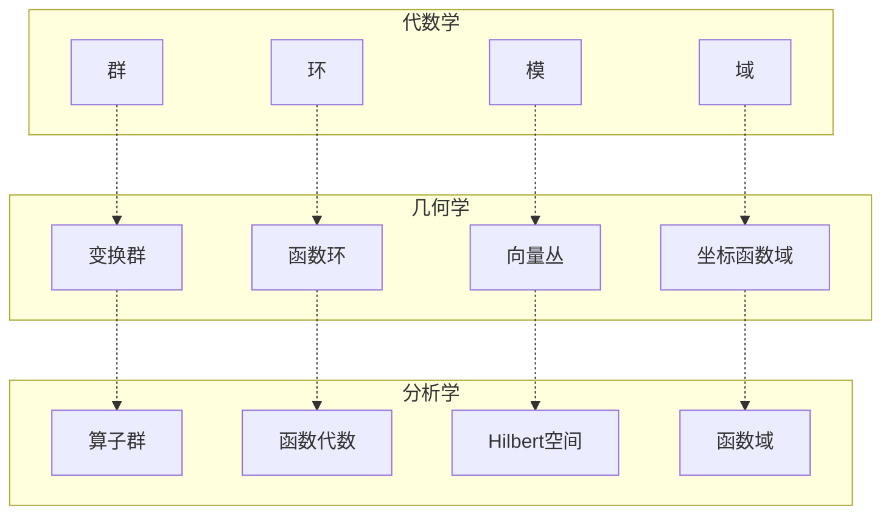
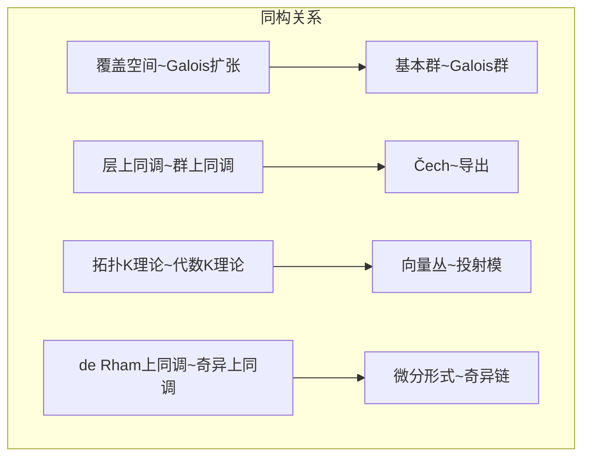
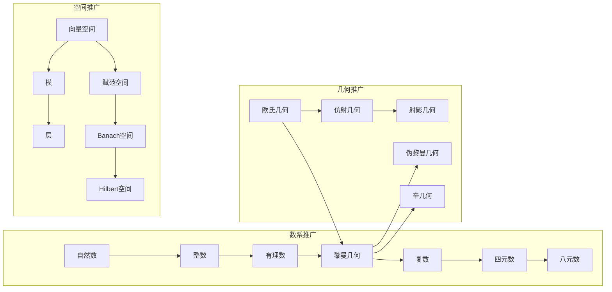
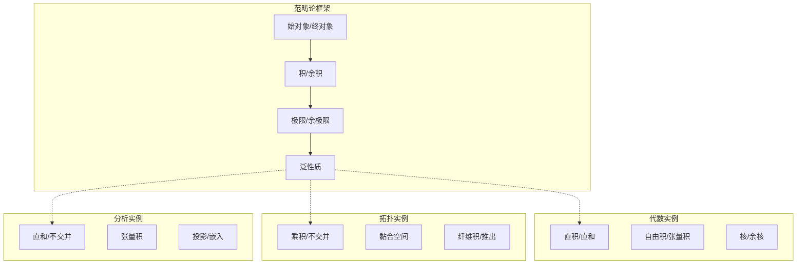
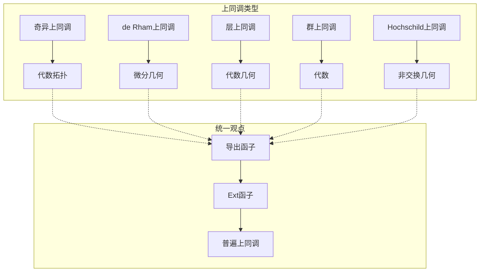
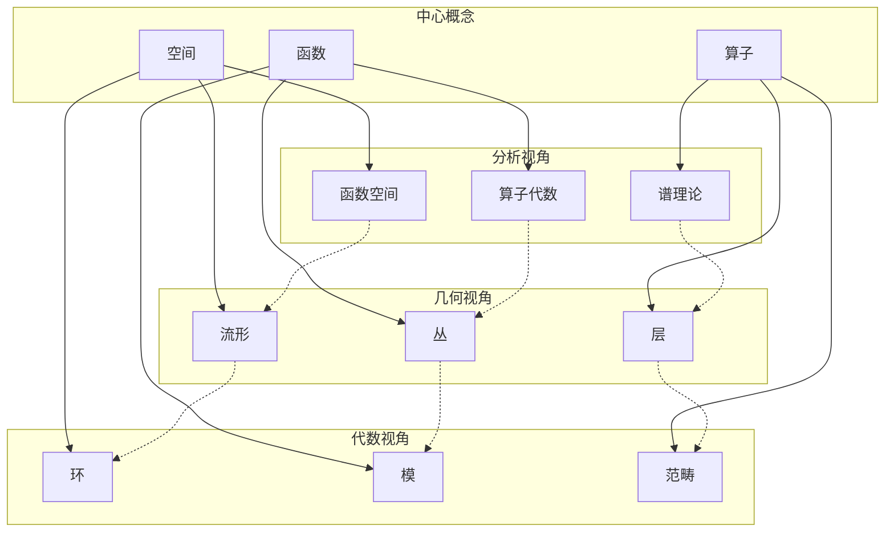
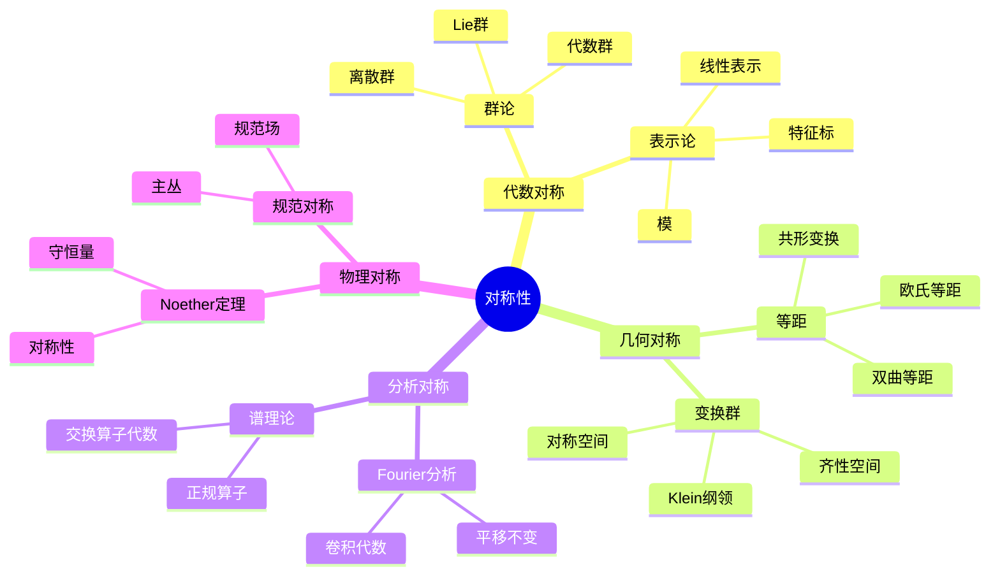

# 数学概念关系图谱

> 本文档构建数学核心概念间的映射关系，揭示同构、类比、推广与特例的深层联系。

---

## 1. 核心概念间的映射关系

### 1.1 代数学-几何学-分析学对应



### 1.2 不同层次结构对应表

| 代数结构 | 几何对象 | 分析对象 | 共同特征 |
|---------|---------|---------|---------|
| 群G | 对称群作用的集合 | 酉算子群 | 对称性 |
| 环R | 概形的结构层 | 函数代数 | 局部结构 |
| 模M | 向量丛的截面 | Banach空间向量 | 线性结构 |
| 域K | 代数簇的函数域 | 亚纯函数域 | 有理函数 |
| 代数A | 非交换空间 | 算子代数 | 非交换几何 |

---

## 2. 同构/类比关系

### 2.1 跨分支同构



### 2.2 经典类比对应

| 领域A | 概念A | 领域B | 概念B | 类比点 |
|-------|-------|-------|-------|-------|
| 数论 | 整数Z | 函数域 | F_q[t] | PID，算术相似 |
| 代数 | 多项式环 | 分析 | 全纯函数 | 唯一分解，零点理论 |
| 拓扑 | 覆叠空间 | 代数 | Galois扩张 | 提升↔扩张，群作用 |
| 几何 | 向量丛 | 代数 | 投射模 | 局部自由，整体性质 |
| 分析 | Fourier变换 | 数论 | Mellin变换 | 对偶性，函数方程 |
| 概率 | 期望 | 物理 | 系综平均 | 平均概念，遍历理论 |

### 2.3 对偶性对应表

| 原始概念 | 对偶概念 | 对偶理论 | 应用 |
|---------|---------|---------|------|
| 向量空间V | 对偶空间V* | 线性对偶 | 泛函分析 |
| 群G | 特征标群Ĝ | Pontryagin对偶 | 调和分析 |
| 代数A | 余代数A° | Hopf代数 | 量子群 |
| 概形X | 坐标环O(X) | Serre对偶 | 代数几何 |
| 复形C | 对偶复形C* | Verdier对偶 | 导出范畴 |
| 层F | 对偶层F^∨ | Grothendieck对偶 | 层上同调 |

---

## 3. 推广与特例关系

### 3.1 推广链条



### 3.2 积分理论推广链

| 层次 | 积分类型 | 被积对象 | 定义域 | 主要特点 |
|-----|---------|---------|-------|---------|
| 0 | Cauchy积分 | 连续函数 | 区间 | 原函数存在 |
| 1 | Riemann积分 | 几乎连续函数 | 区间 | 分割求和 |
| 2 | Lebesgue积分 | 可测函数 | 测度空间 | 绝对收敛 |
| 3 | 抽象Lebesgue | 向量值函数 | 抽象测度 | Bochner积分 |
| 4 | 分布配对 | 分布 | 试验函数 | 广义函数 |
| 5 | 非交换积分 | 算子 | von Neumann代数 | 迹的扩展 |

### 3.3 微分概念推广

```
经典微分（欧氏空间）
    ↓ 流形上
流形微分（切空间）
    ↓ 向量丛上
联络（协变导数）
    ↓ 代数上
Kähler微分（代数微分）
    ↓ 非交换上
非交换微分（微分分次代数）
```

---

## 4. 跨分支统一原理

### 4.1 范畴论视角的统一



### 4.2 变换理论的统一

| 领域 | 变换 | 核 | 不变性 | 对偶 |
|-----|------|-----|-------|------|
| 线性代数 | 线性变换 | 核空间 | 秩 | 转置 |
| Fourier分析 | Fourier变换 | δ函数 | L^2范数 | 逆变换 |
| Laplace变换 | Laplace变换 | 指数函数 | 卷积→乘积 | Bromwich积分 |
| Galois理论 | Galois群作用 | 不变子域 | 扩张次数 | Galois对应 |
| 表示论 | 群表示 | 表示核 | 特征标 | 对偶表示 |
| 几何 | 坐标变换 | 奇点 | 不变量 | 对偶空间 |

### 4.3 上同调理论的统一



---

## 5. 核心概念网络图

### 5.1 分析-几何-代数三角



### 5.2 对称性概念网络



---

## 6. 学习方法论映射

### 6.1 抽象层次递进

```
具体例子
    ↓ 发现模式
具体模式
    ↓ 形式化
抽象结构
    ↓ 公理化
公理系统
    ↓ 范畴化
范畴理论
    ↓ 高阶化
高阶范畴/∞-范畴
```

### 6.2 跨分支学习路径

| 起点 | 类比路径 | 终点 | 关键洞察 |
|-----|---------|------|---------|
| 线性代数 | 向量空间~流形截面 | 微分几何 | 局部线性化 |
| 复分析 | 全纯函数~代数函数 | 代数几何 | 几何观点 |
| 点集拓扑 | 连续映射~可测映射 | 测度论 | 收敛概念 |
| ODE | 解空间~纤维丛 | 微分几何 | 几何结构 |
| 群论 | 群作用~覆叠空间 | 代数拓扑 | Galois对应 |

---

## 7. 概念关系速查表

### 7.1 同一概念的不同名称

| 概念 | 代数名称 | 几何名称 | 分析名称 |
|-----|---------|---------|---------|
| 核 | ker(φ) | 纤维 | 零空间 |
| 像 | im(φ) | 像集 | 值域 |
| 直积 | A×B | 乘积空间 | 直和空间 |
| 张量积 | A⊗B | 丛的张量积 | Hilbert张量积 |
| 对偶 | Hom(M,R) | 余切丛 | 对偶空间 |
| 局部化 | S^{-1}R | 茎 | 局部环 |

### 7.2 同构定理对应

| 代数 | 几何 | 分析 |
|-----|------|------|
| 群同构基本定理 | 覆叠空间的单值群 | 谱定理（正规算子） |
| 模同构定理 | 向量丛的商构造 | Hilbert空间的正交分解 |
| 环同构定理 | 概形的结构层 | C*-代数的商 |

---

> 💡 **使用建议**：本文档适合作为高阶数学学习的概念地图。建议在深入学习具体分支时，时常回顾本文档，思考所学内容与整个数学大厦的关系。培养跨分支的思维方式有助于发现新的数学联系。
