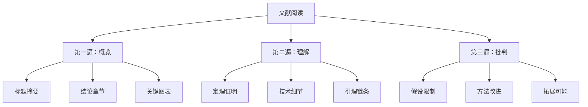
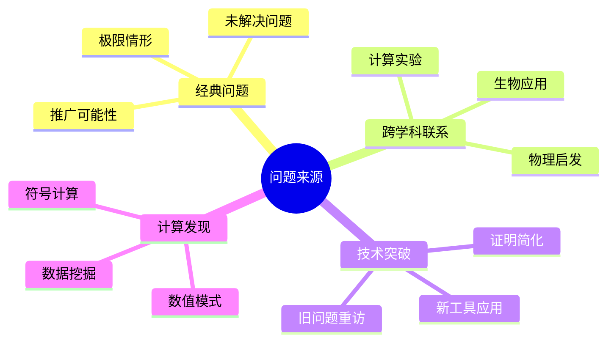
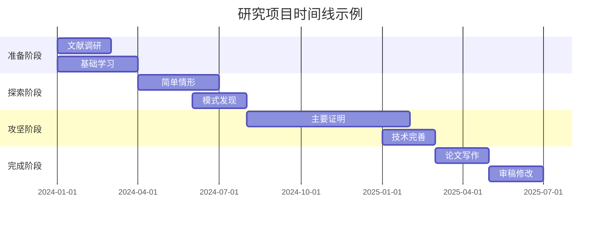
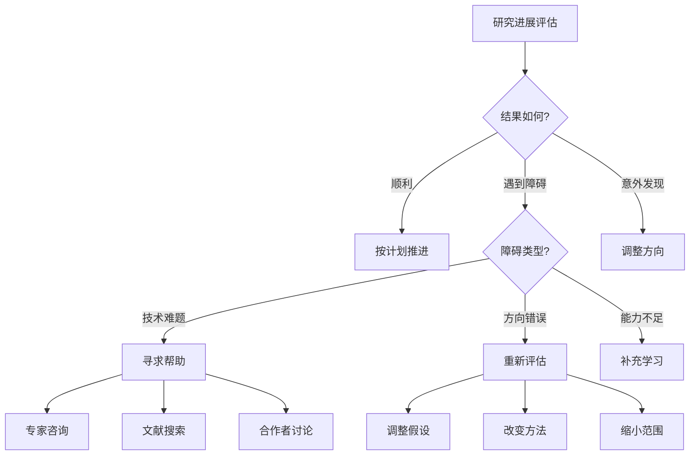
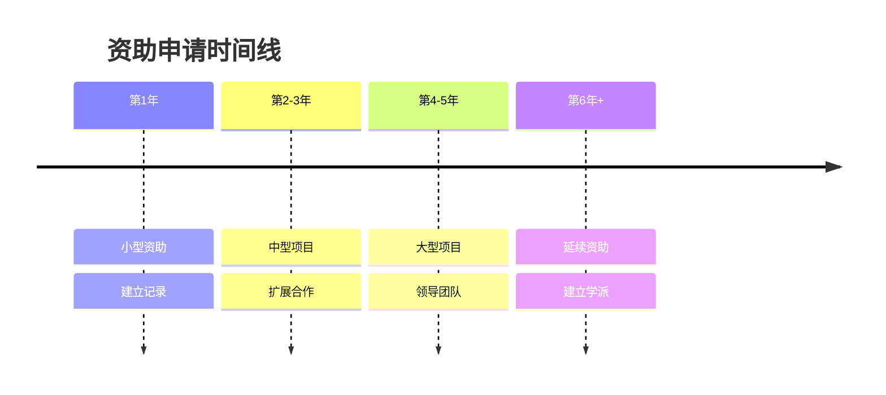

# 数学研究问题探索指南

## 概述

数学研究的核心在于提出和解决有价值的问题。本指南系统介绍数学研究问题的发现、评估和解决路径，帮助研究者建立有效的研究方法论。

---

## 第一部分：从文献中发现问题

### 1.1 文献阅读策略

#### 深度阅读法



**实践建议**：

| 阶段 | 时间 | 目标 | 产出 |
|------|------|------|------|
| 概览 | 15-30分钟 | 判断相关性 | 是否深入阅读 |
| 理解 | 2-4小时 | 掌握技术 | 笔记和摘要 |
| 批判 | 数天 | 发现机会 | 研究问题列表 |

#### 发现问题的切入点

**1. 假设放宽**
- 识别定理的条件
- 问：哪些条件是本质的？
- 例子：光滑性假设 → 连续性情形的推广

**2. 维度变化**
- 低维已知结果在高维的情况
- 高维方法在低维的优化
- 例子：4维光滑Poincaré猜想

**3. 边界情形**
- 最优常数的精确值
- 临界指数的行为
- 例子：Sobolev嵌入的临界指数

**4. 反例构造**
- 寻找条件间的独立性
- 证明某猜想的否定
- 例子：Weierstrass连续无处可微函数

---

### 1.2 问题来源地图



---

## 第二部分：问题评估框架

### 2.1 重要性评估

#### 评估维度

| 维度 | 问题 | 权重 |
|------|------|------|
| **理论深度** | 是否触及核心数学结构？ | ★★★★★ |
| **连接广度** | 是否连接多个领域？ | ★★★★☆ |
| **应用价值** | 是否有实际应用？ | ★★★☆☆ |
| **历史意义** | 是否解决经典问题？ | ★★★★★ |
| **技术影响** | 是否发展新技术？ | ★★★★☆ |

#### 问题重要性矩阵

```
重要性 \ 难度
        低    中    高    极高
理论高   ★    ★★   ★★★   ★★★★
理论中   ○    ★    ★★    ★★★
理论低   △    ○    ★     ★★

★ = 优先研究  ○ = 值得尝试  △ = 谨慎考虑
```

### 2.2 可行性评估

#### 技术准备度检查清单

**必备工具**：
- [ ] 掌握相关基础理论
- [ ] 熟悉标准技术方法
- [ ] 了解最新研究进展
- [ ] 具备计算/实验能力

**资源评估**：
- [ ] 所需时间投入
- [ ] 合作者网络
- [ ] 计算资源
- [ ] 文献获取渠道

#### 风险评估矩阵

| 风险类型 | 低风险 | 中风险 | 高风险 |
|----------|--------|--------|--------|
| 技术难度 | 已知方法 | 方法适配 | 新技术开发 |
| 时间投入 | <6个月 | 6个月-2年 | >2年 |
| 竞争强度 | 冷门方向 | 适度关注 | 热门领域 |
| 失败后果 | 学习经验 | 时间损失 | 职业影响 |

---

### 2.3 快速可行性测试

**2周测试法**：

1. **第1-3天**：深入文献调研
   - 找到3-5篇最相关的论文
   - 理解核心技术和障碍

2. **第4-7天**：简单尝试
   - 尝试最简单情形
   - 计算具体例子
   - 验证初步想法

3. **第8-10天**：障碍分析
   - 识别核心困难
   - 评估克服可能性
   - 寻找替代路径

4. **第11-14天**：决策
   - 决定是否深入研究
   - 制定初步计划
   - 或转向其他问题

---

## 第三部分：研究路径规划

### 3.1 研究路线图



### 3.2 里程碑设定

#### SMART原则应用

| 阶段 | 具体目标 | 可衡量 | 可实现 | 相关性 | 时限 |
|------|----------|--------|--------|--------|------|
| 准备 | 完成文献综述 | 50篇阅读 | 是 | 高 | 2月 |
| 探索 | 证明特殊情形 | 定理2个 | 是 | 高 | 3月 |
| 核心 | 完整证明 | 主定理 | 待定 | 高 | 6月 |
| 写作 | 论文发表 | 期刊投稿 | 是 | 高 | 3月 |

### 3.3 灵活调整策略

#### 决策树



---

## 第四部分：合作与交流策略

### 4.1 合作网络构建

#### 合作类型

| 类型 | 特点 | 优势 | 挑战 |
|------|------|------|------|
| **师生合作** | 导师指导 | 经验传承 | 自主性平衡 |
| **同行合作** | 平等协作 | 思维碰撞 | 分工协调 |
| **跨领域** | 学科交叉 | 创新视角 | 沟通成本 |
| **国际合作** | 全球网络 | 资源丰富 | 时差文化 |

#### 有效合作原则

**沟通准则**：
1. **定期会议**：每周至少一次进度同步
2. **文档共享**：使用版本控制（Git）
3. **明确分工**：书面记录责任分配
4. **冲突解决**：及时沟通，寻求妥协

### 4.2 学术交流策略

#### 会议参与层次


#### 报告准备清单

**内容准备**：
- [ ] 开场白：问题背景和动机（2分钟）
- [ ] 核心结果：1-2个主要定理（5分钟）
- [ ] 技术概览：证明思路（3分钟）
- [ ] 开放问题：未来方向（2分钟）
- [ ] 备用材料：详细计算（应对提问）

**演示技巧**：
- 每页幻灯片不超过3个要点
- 使用图表多于文字
- 预留问答时间（至少1/4时长）

### 4.3 网络建设

#### 学术社交网络

**线下活动**：
- 学术会议：每年至少2-3次
- 研讨会：定期参与本地讨论班
- 夏季学校：学习新技术，结识同行
- 研究访问：建立长期合作关系

**线上平台**：
- arXiv：跟踪最新预印本
- MathOverflow：问答与讨论
- ResearchGate：学术社交
- Twitter/Mastodon：快速信息交流

---

## 第五部分：研究工具箱

### 5.1 文献管理

#### 推荐工具

| 工具 | 特点 | 适用场景 |
|------|------|----------|
| Zotero | 免费开源 | 个人管理 |
| Mendeley | 社交功能 | 团队协作 |
| JabRef | LaTeX集成 | 技术用户 |
| Notion | 灵活组织 | 综合笔记 |

**标签系统**：
- `核心技术`：直接相关的论文
- `背景知识`：需要学习的基础
- `方法参考`：技术方法借鉴
- `竞争对手`：相关研究进展
- `待阅读`：发现的新文献

### 5.2 计算工具

#### 数学软件选择

| 领域 | 推荐工具 | 用途 |
|------|----------|------|
| 数值计算 | MATLAB, Julia | 数值实验 |
| 符号计算 | Mathematica, SageMath | 公式推导 |
| 代数计算 | Macaulay2, Singular | 代数几何 |
| 数论计算 | PARI/GP, SageMath | 数论问题 |
| 统计计算 | R, Python | 数据分析 |

### 5.3 写作工具

#### LaTeX工作流程

```
文献管理 → 笔记整理 → 草稿写作 → 版本控制 → 协作编辑 → 投稿
   ↑                                                    ↓
   └──────────────── 反馈修改 ← 同行评议 ← 审稿意见 ────┘
```

**推荐组合**：
- 编辑器：VS Code + LaTeX Workshop
- 版本控制：Git + GitHub
- 协作：Overleaf
- 引用管理：Zotero + Better BibTeX

---

## 第六部分：常见问题与对策

### 6.1 研究困境应对

| 困境 | 症状 | 对策 |
|------|------|------|
| **研究枯竭** | 长时间无进展 | 换小问题进行，或休息调整 |
| **完美主义** | 无休止改进 | 设定截止时间，接受"足够好" |
| **范围蔓延** | 问题越来越大 | 回归核心，删减次要内容 |
| **孤独感** | 缺乏反馈 | 主动寻求合作和讨论 |
| **焦虑** | 担心落后 | 专注自身节奏，减少比较 |

### 6.2 时间管理

#### 番茄工作法（改良版）

```
深度工作块（90分钟）
├── 准备阶段（5分钟）：回顾目标
├── 核心工作（70分钟）：专注研究
├── 整理阶段（10分钟）：记录进展
└── 休息（15分钟）：离开工作区

每天2-3个深度工作块
```

#### 能量管理

| 时间段 | 能量水平 | 适合任务 |
|--------|----------|----------|
| 早晨 | 高 | 创造性工作、证明核心部分 |
| 下午 | 中 | 计算验证、文献阅读 |
| 晚上 | 低 | 整理笔记、规划明日 |

---

## 第七部分：职业发展

### 7.1 研究品牌建立

#### 个人研究标识

**专业化建议**：
1. 选择1-2个核心领域深耕
2. 建立技术专长（"杀手锏"）
3. 持续产出形成连贯性
4. 参与领域标准制定

**能见度建设**：
- 维护个人学术主页
- 定期更新arXiv预印本
- 参与审稿工作
- 组织学术活动

### 7.2 资助申请

#### 申请策略



---

## 相关资源

### 推荐阅读

1. T. Tao, "Career Advice"
2. R. Hamming, "You and Your Research"
3. I. Stewart, "Letters to a Young Mathematician"
4. P. Halmos, "I Want to Be a Mathematician"

### 在线资源

- MathOverflow：mathoverflow.net
- arXiv：arxiv.org
- nLab：ncatlab.org
- Math Genealogy：mathgenealogy.org

---

## 总结

成功的数学研究需要：

1. **敏锐的问题嗅觉**：从文献、交流、计算中发现有价值的问题
2. **系统的评估能力**：理性分析重要性和可行性
3. **坚韧的执行力**：制定计划，克服障碍，灵活调整
4. **开放的合作心态**：建立网络，有效沟通，互利共赢

记住：伟大的数学成果往往来自于对"小问题"的执着追求和长期积累。

---

*本指南最后更新：2026年4月*
*适用对象：数学研究生、博士后和青年学者*
