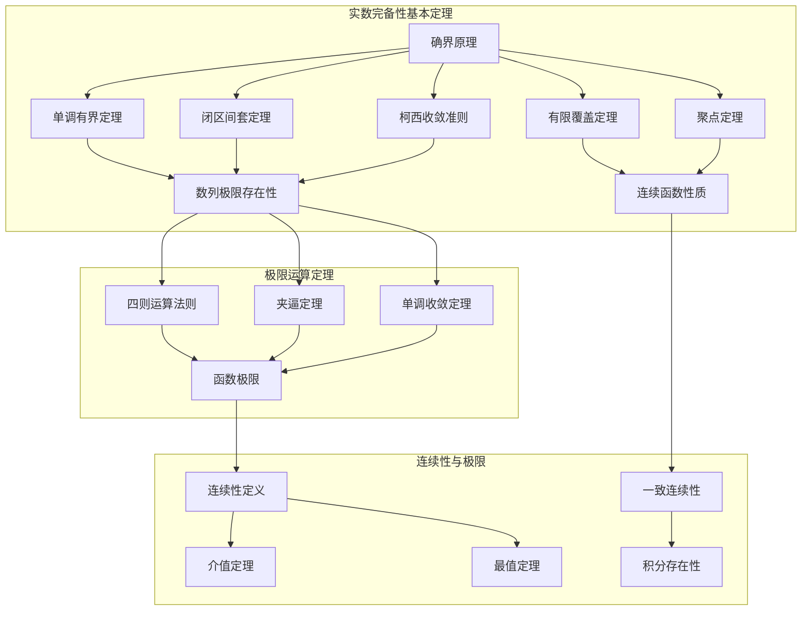
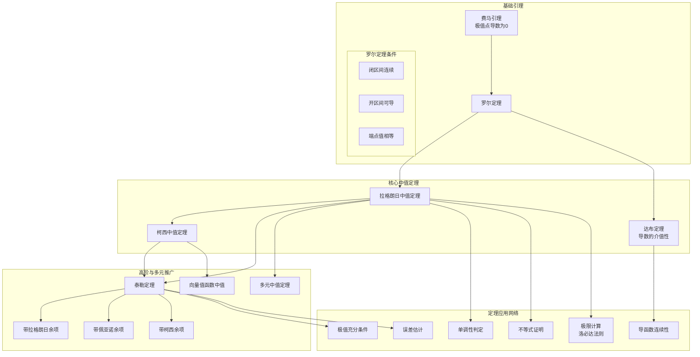
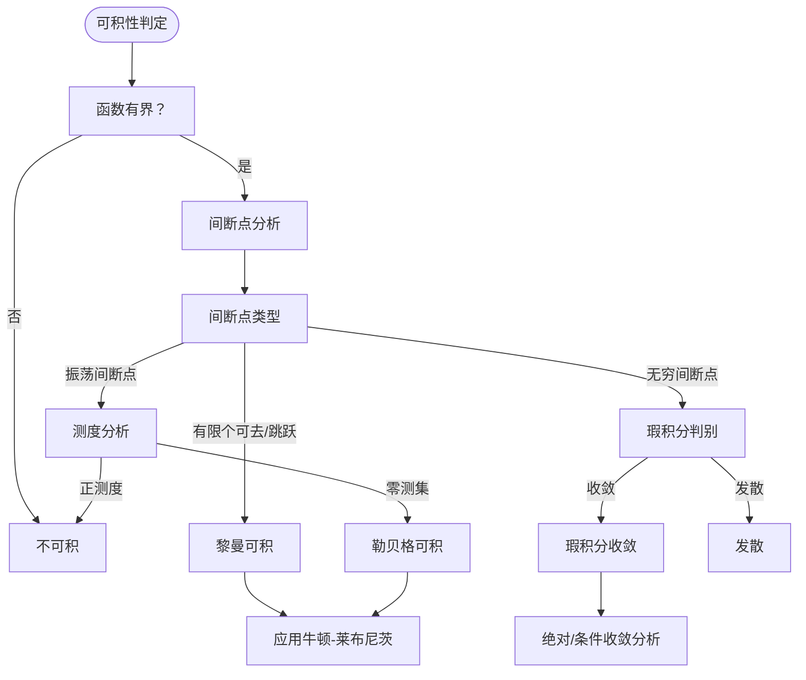
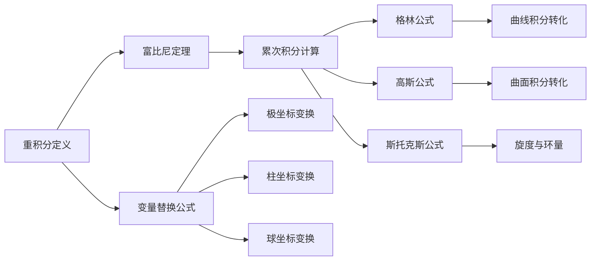
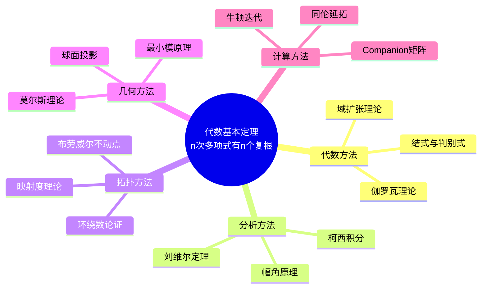
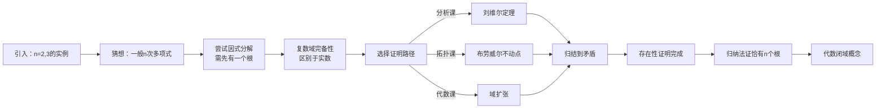

# 定理证明思维导图集

> 通过可视化方式呈现核心定理的证明路径、逻辑网络和多种证明方法对比

---

## 目录

1. [极限定理证明路径图](#1-极限定理证明路径图)
2. [微分中值定理证明网络](#2-微分中值定理证明网络)
3. [积分定理逻辑关系图](#3-积分定理逻辑关系图)
4. [代数基本定理多种证明对比](#4-代数基本定理多种证明对比)

---

## 1. 极限定理证明路径图

### 1.1 实数完备性定理体系



### 1.2 函数极限证明路径

```mermaid
flowchart LR
    A[ε-δ定义] --> B[直接证明法]
    A --> C[夹逼证明法]
    A --> D[单调有界法]
    
    B --> E[多项式极限]
    B --> F[有理函数极限]
    
    C --> G[重要极限1<br/>sinx/x→1]
    C --> H[重要极限2<br/>(1+1/x)^x→e]
    
    D --> I[指数函数极限]
    D --> J[对数函数极限]
    
    E --> K[连续性证明]
    F --> K
    G --> L[导数定义]
    H --> L
```

### 1.3 证明策略决策点

| 问题类型 | 首选方法 | 备选方法 | 关键工具 |
|---------|---------|---------|---------|
| 数列极限 | 单调有界 | 柯西准则 | 递推分析 |
| 函数极限 | ε-δ定义 | 归结原理 | 夹逼定理 |
| 无穷极限 | 定义转化 | 洛必达法则 | 泰勒展开 |
| 多元极限 | 路径检验 | 极坐标变换 | 夹逼定理 |

**实际应用示例**：证明 $\lim_{n\to\infty} (1 + \frac{1}{n})^n = e$

```
证明路径：
1. 单调性：用二项式展开比较 a_n 和 a_{n+1}
2. 有界性：放缩证明 a_n < 3
3. 由单调有界定理知极限存在
4. 定义此极限为 e
```

---

## 2. 微分中值定理证明网络

### 2.1 中值定理层次结构



### 2.2 证明技术路线图

```mermaid
flowchart TD
    Start([证明目标]) --> Type{定理类型}
    
    Type -->|罗尔定理| Rolle[Rolle条件检验]
    Type -->|拉格朗日| Lag[构造辅助函数<br/>φ(x)=f(x)-kx]
    Type -->|柯西| Cau[参数化方法]
    Type -->|泰勒| Tay[高阶展开]
    
    Rolle --> R1[验证三条件]
    R1 --> R2[应用费马引理]
    R2 --> R3[得出结论]
    
    Lag --> L1[确定斜率k]
    L1 --> L2[检验φ(x)满足罗尔条件]
    L2 --> L3[求导得结论]
    
    Cau --> C1[设参数曲线]
    C1 --> C2[应用罗尔定理推广]
    C2 --> C3[整理比例式]
    
    Tay --> T1[选择展开点]
    T1 --> T2[确定余项形式]
    T2 --> T3[估计误差界]
```

### 2.3 辅助函数构造方法

| 目标定理 | 辅助函数形式 | 构造思想 | 验证要点 |
|---------|------------|---------|---------|
| 拉格朗日 | $\varphi(x) = f(x) - \frac{f(b)-f(a)}{b-a}x$ | 线性校正 | 端点值相等 |
| 柯西 | $\varphi(x) = f(x) - \lambda g(x)$ | 参数消去 | 比例关系 |
| 积分中值 | $F(x) = \int_a^x f(t)dt$ | 原函数转化 | 连续性保持 |
| 泰勒展开 | $R_n(x) = f(x) - P_n(x)$ | 余项分析 | 高阶导数 |

**实际应用示例**：证明不等式 $e^x > 1 + x$ (x ≠ 0)

```
证明网络：
1. 设 f(x) = e^x - 1 - x
2. 由拉格朗日中值定理：f(x) = f'(ξ)·x = (e^ξ - 1)·x
3. 分析 ξ 位置：
   - x > 0 时，ξ > 0，e^ξ > 1，故 f(x) > 0
   - x < 0 时，ξ < 0，e^ξ < 1，但 x < 0，故 f(x) > 0
4. 综上，e^x > 1 + x 对所有 x ≠ 0 成立
```

---

## 3. 积分定理逻辑关系图

### 3.1 积分理论体系

```mermaid
graph TB
    subgraph 定义[积分定义体系]
        A[黎曼和定义] --> B[黎曼可积]
        C[达布上和下和] --> D[可积准则]<-->B
        E[零测集] --> F[勒贝格可积]
    end
    
    subgraph 基本性质[基本性质定理]
        B --> G[线性性质]
        B --> H[区间可加性]
        B --> I[保号性]
        B --> J[积分中值定理]
    end
    
    subgraph 微积分基本定理[微积分基本定理]
        K[第一部分<br/>微分与积分互逆] --> L[若F'=f，则∫f=F(b)-F(a)]
        B --> K
        J --> M[第二部分<br/>变上限积分]
        M --> N[(∫_a^x f)' = f(x)]
    end
    
    subgraph 计算工具[计算工具定理]
        L --> O[牛顿-莱布尼茨公式]
        O --> P[换元积分法]
        O --> Q[分部积分法]
        
        P --> R[三角换元]
        P --> S[根式换元]
        P --> T[倒代换]
    end
    
    subgraph 广义积分[广义积分理论]
        B --> U[无穷限积分]
        B --> V[瑕积分]
        U --> W[比较判别法]
        V --> W
        W --> X[绝对收敛]
        W --> Y[条件收敛]
    end
```

### 3.2 可积性判定流程



### 3.3 积分定理应用矩阵

| 定理/方法 | 适用场景 | 关键条件 | 典型应用 |
|----------|---------|---------|---------|
| 积分中值 | 估值/极限 | 连续性 | 积分极限计算 |
| 微积分基本定理 | 定积分计算 | 原函数存在 | 面积/体积计算 |
| 换元积分 | 复合函数积分 | 单调可导 | 三角有理式 |
| 分部积分 | 乘积函数积分 | u,v可导 | 递推公式 |
| 控制收敛 | 极限与积分交换 | 控制函数 | 含参积分 |

### 3.4 多重积分定理链



**实际应用示例**：计算 $\int_0^1 \frac{\ln(1+x)}{1+x^2} dx$

```
解题路径：
1. 直接积分困难，考虑参数化方法
2. 设 I(a) = ∫₀¹ ln(1+ax)/(1+x²) dx
3. 求导：I'(a) = ∫₀¹ x/[(1+ax)(1+x²)] dx
4. 分式分解后积分
5. 利用 I(0)=0, I(1)=所求
6. 最终结果：I(1) = (π/8)ln2
```

---

## 4. 代数基本定理多种证明对比

### 4.1 证明方法全景图



### 4.2 分析方法证明路径

```mermaid
graph TD
    subgraph Liouville[刘维尔定理路径]
        A[假设P(z)无零点] --> B[1/P(z)全纯]
        B --> C[有界整函数]
        C --> D[刘维尔定理: 必为常数]
        D --> E[矛盾！]
    end
    
    subgraph Cauchy[柯西积分路径]
        F[围道积分 ∮dz/P(z)] --> G[P无零点则积分=0]
        G --> H[充分大圆上积分≈2πi/n]
        H --> I[矛盾！]
    end
    
    subgraph Argument[幅角原理路径]
        J[零点个数 = 绕数变化] --> K[充分大圆上绕数为n]
        K --> L[故内部必有n个零点]
    end
```

### 4.3 证明方法对比矩阵

| 证明方法 | 核心工具 | 难度等级 | 教学价值 | 推广性 |
|---------|---------|---------|---------|-------|
| 刘维尔定理 | 复分析基础 | ⭐⭐⭐ | 展示解析函数刚性 | 整函数理论 |
| 幅角原理 | 围道积分 | ⭐⭐⭐⭐ | 几何直观强 | 零极点分布 |
| 拓扑度 | 布劳威尔度 | ⭐⭐⭐⭐⭐ | 揭示拓扑本质 | 多元推广 |
| 最小模 | 紧性论证 | ⭐⭐ | 最简洁优雅 | 极值原理 |
| 伽罗瓦 | 域论 | ⭐⭐⭐⭐⭐ | 代数视角 | 可解性理论 |
| 优化方法 | 梯度下降 | ⭐⭐⭐ | 计算视角 | 数值代数 |

### 4.4 教学过程设计图



**实际应用示例**：多项式 $P(z) = z^4 + 1$ 的因式分解

```
证明思路验证：
1. 由代数基本定理，z⁴+1=0 有4个复根
2. 显式求解：z = e^{i(π+2kπ)/4}, k=0,1,2,3
3. 即：z = (±1±i)/√2
4. 因式分解：z⁴+1 = (z²+√2z+1)(z²-√2z+1)
5. 验证：展开后确实等于z⁴+1

此例说明：
- 存在性保证因式分解可能
- 显式求解依赖具体形式
- 实数域上只能分解为二次式
```

---

## 相关概念链接

- [核心定理对比矩阵](17-核心定理对比矩阵.md) - 定理之间的性质对比
- [数学概念关系图谱](18-数学概念关系图谱.md) - 概念间的网络关系
- [数学研究问题探索指南](19-数学研究问题探索指南.md) - 定理探索方法论
- [数学思维表征完全指南](16-数学思维表征完全指南.md) - 思维可视化基础

---

## 总结

本思维导图集涵盖了：

1. **极限定理**：从实数完备性到极限运算的完整证明路径
2. **中值定理**：由费马引理到泰勒展开的层次化证明网络
3. **积分定理**：黎曼可积性到微积分基本定理的逻辑链条
4. **代数基本定理**：多视角证明方法的教学对比

通过这些可视化工具，学习者可以：
- 理解定理间的依赖关系和证明策略
- 掌握辅助函数构造的核心思想
- 建立多视角分析问题的能力
- 形成完整的数学证明思维框架
