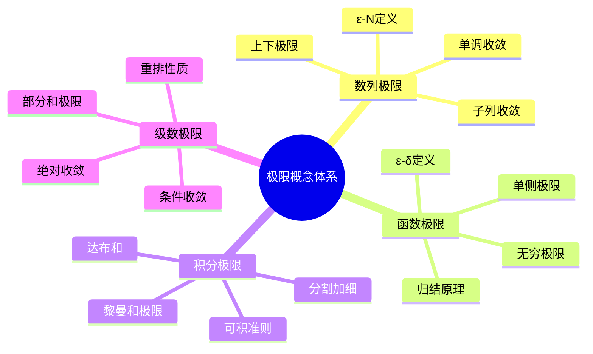
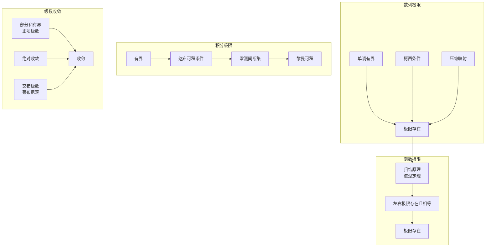
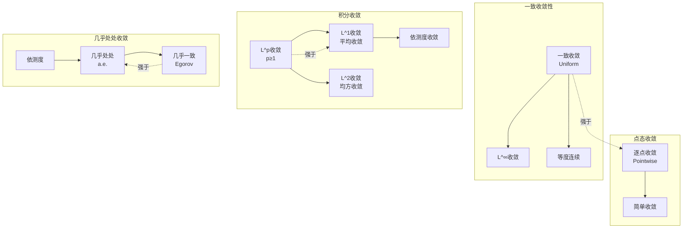
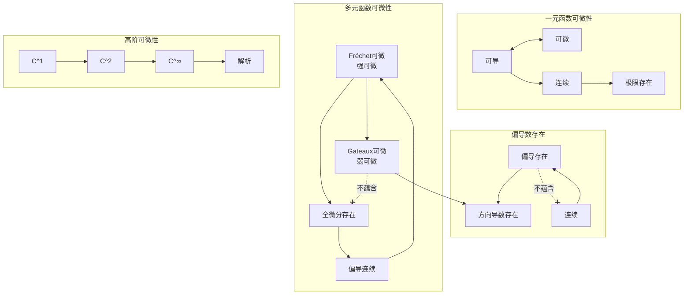
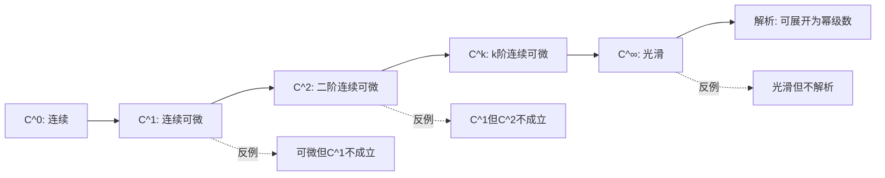
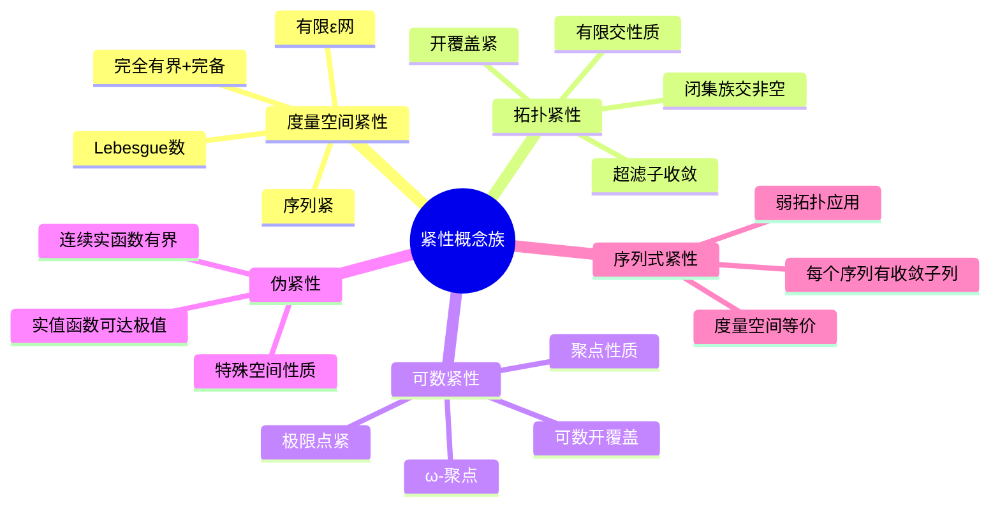
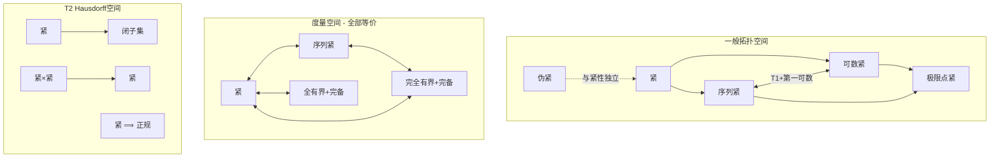
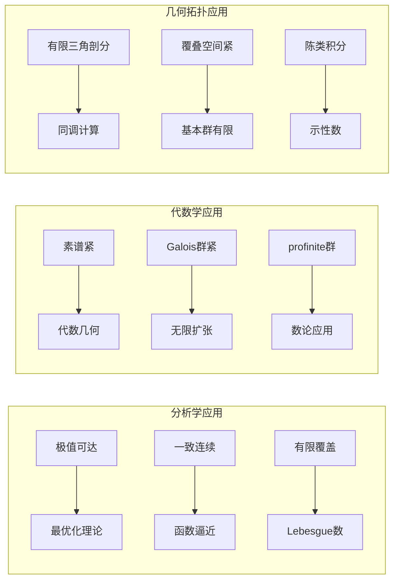
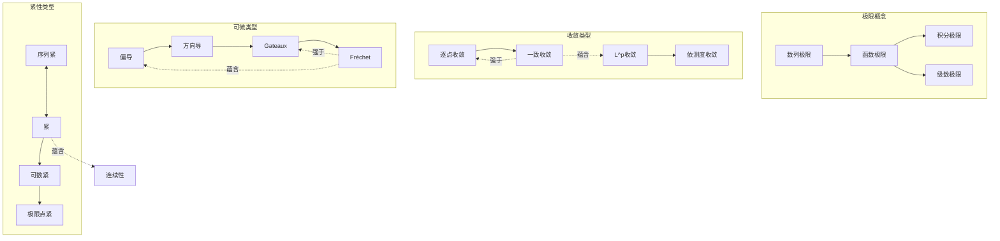

# 概念对比矩阵大全

> 通过系统化对比，深入理解数学概念的细微差别与内在联系

---

## 目录

1. [极限概念对比](#1-极限概念对比)
2. [收敛性对比](#2-收敛性对比)
3. [可微性对比](#3-可微性对比)
4. [紧性对比](#4-紧性对比)

---

## 1. 极限概念对比

### 1.1 极限类型总览图



### 1.2 极限定义对比矩阵

| 维度 | 数列极限 $\lim a_n = A$ | 函数极限 $\lim_{x\to x_0} f(x) = A$ | 积分和极限 | 级数和极限 |
|-----|------------------------|-----------------------------------|-----------|-----------|
| **自变量趋向** | $n \to \infty$ (离散) | $x \to x_0$ (连续) | 分割加细 $\|P\| \to 0$ | 项数 $n \to \infty$ |
| **核心定义** | $\forall \varepsilon > 0, \exists N$ | $\forall \varepsilon > 0, \exists \delta$ | 上和=下和 | 部分和收敛 |
| **关键不等式** | $n > N \Rightarrow |a_n - A| < \varepsilon$ | $0 < |x-x_0| < \delta \Rightarrow |f(x)-A| < \varepsilon$ | $U(P,f) - L(P,f) < \varepsilon$ | $|S_n - S| < \varepsilon$ |
| **唯一性** | ✓ 唯一 | ✓ 唯一 | ✓ 唯一 | ✓ 唯一 |
| **运算性质** | 四则运算、夹逼 | 四则运算、夹逼、复合 | 线性、区间可加 | 线性、绝对值不等式 |
| **子结构** | 子列 | 单侧/沿路径 | 子区间 | 子级数 |

### 1.3 极限存在性判定对比



### 1.4 极限计算方法对比

| 方法类型 | 数列极限 | 函数极限 | 积分极限 | 级数求和 |
|---------|---------|---------|---------|---------|
| **直接法** | 定义法、单调收敛 | ε-δ证明、洛必达 | 黎曼和直接计算 | 部分和公式 |
| **间接法** | 夹逼定理、Stolz | 泰勒展开、等价无穷小 | 控制收敛定理 | 比较判别、积分判别 |
| **特殊技巧** | 递推求极限 | 变量替换 | 换元、分部积分 | Abel变换、母函数 |
| **数值法** | 迭代法 | 逼近序列 | 数值积分 | 加速收敛 |

**实际应用示例**：对比计算以下四个极限

```
1. 数列：lim (1 + 1/n)^n = e          [单调有界法]
2. 函数：lim_{x→0} sinx/x = 1         [夹逼定理/几何法]
3. 积分：lim_{n→∞} Σ_{k=1}^n k²/n³ = 1/3  [黎曼和→∫x²dx]
4. 级数：Σ_{n=1}^∞ 1/n² = π²/6       [傅里叶级数法]

共同特征：都涉及"无限逼近"的核心思想
差异之处：自变量类型和收敛速度不同
```

---

## 2. 收敛性对比

### 2.1 收敛类型层次图



### 2.2 收敛性强度对比矩阵

| 收敛类型 | 定义 | 蕴含关系 | 反例存在 | 与积分交换 |
|---------|-----|---------|---------|-----------|
| **一致收敛** | $\sup|f_n - f| \to 0$ | ⟹ 逐点、L^∞ | 逐点不一致 | ✓ 可交换 |
| **逐点收敛** | $\forall x, f_n(x) \to f(x)$ | ⟹ 几乎处处 | 一致不逐点 | ✗ 不可交换 |
| **L^p收敛** | $\int|f_n - f|^p \to 0$ | ⟹ 依测度 | 点态不L^p | ✓ 与积分交换 |
| **L^1收敛** | $\int|f_n - f| \to 0$ | ⟹ 依测度 | a.e.不L^1 | ✓ 可交换 |
| **几乎处处** | $f_n \to f$ a.e. | ⟹ 依测度(有限测度) | L^p不a.e. | ✗ 控制条件下可 |
| **依测度** | $\mu(|f_n-f|>\varepsilon) \to 0$ | 最弱 | a.e.不依测度 | ✗ 不可交换 |

### 2.3 函数列收敛性判定流程

```mermaid
flowchart TD
    Start([函数列{f_n}]) --> Q1{检验一致收敛}
    
    Q1 -->|sup|n|f_n-f|→0| A[一致收敛]
    Q1 -->|否| Q2{检验L^p收敛}
    
    Q2 -->|∫|f_n-f|^p→0| B[L^p收敛]
    Q2 -->|否| Q3{检验几乎处处}
    
    Q3 -->|除去零测集| C[几乎处处收敛]
    Q3 -->|否| Q4{检验依测度}
    
    Q4 -->|μ→0| D[依测度收敛]
    Q4 -->|否| E[不收敛]
    
    A --> F[极限函数连续/可积/可微]
    B --> G[积分与极限可交换]
    C --> H[Egorov定理: 近一致收敛]
```

### 2.4 级数收敛性对比

| 判别法 | 适用范围 | 充分性 | 必要性 | 与绝对收敛关系 |
|-------|---------|-------|-------|--------------|
| **比较判别** | 正项级数 | 充分 | 否 | ⟹ 绝对收敛 |
| **比值判别** | 通项有阶乘/指数 | 充分 | 否 | ⟹ 绝对收敛 |
| **根值判别** | 通项有n次幂 | 充分 | 否 | ⟹ 绝对收敛 |
| **积分判别** | 正项递减 | 充要 | 充要 | ⟹ 绝对收敛 |
| **莱布尼茨** | 交错级数 | 充分 | 否 | 条件收敛 |
| **Abel判别** | 部分和有界×单调有界 | 充分 | 否 | 条件收敛 |

**实际应用示例**：分析 $f_n(x) = x^n$ 在 [0,1] 上的收敛性

```
收敛性分析：
1. 逐点收敛：f_n(x) → f(x) = {0, x∈[0,1); 1, x=1}
2. 不一致收敛：sup|f_n-f| = 1 不趋于0
3. L^1收敛：∫₀¹|x^n - 0|dx = 1/(n+1) → 0  ✓
4. L^2收敛：∫₀¹x^{2n}dx = 1/(2n+1) → 0  ✓
5. 几乎处处：除去x=1点外收敛于0，故a.e.收敛  ✓

结论：不同的收敛类型刻画了函数列收敛的不同方面
- 逐点/一致：关注每一点的性态
- L^p收敛：关注整体平均性态
```

---

## 3. 可微性对比

### 3.1 可微性层次结构



### 3.2 可微性对比矩阵

| 可微类型 | 定义公式 | 蕴含关系 | 方向依赖性 | 典型反例 |
|---------|---------|---------|-----------|---------|
| **偏导存在** | $\frac{\partial f}{\partial x_i}$ 存在 | ⟹ 沿坐标轴方向可导 | 仅坐标轴方向 | $f(x,y)=\frac{xy}{x^2+y^2}$ (原点) |
| **方向导数** | $D_v f = \lim_{t\to 0}\frac{f(x+tv)-f(x)}{t}$ | 各方向可导 | 所有方向 | $f(x,y)=\frac{x^2y}{x^4+y^2}$ |
| **Gateaux** | $\lim_{t\to 0}\frac{f(x+th)-f(x)}{t}$ 存在且对h线性 | ⟹ 所有方向导数 | 所有方向 | 连续但不可微 |
| **Fréchet** | $f(x+h) = f(x) + Ah + o(\|h\|)$ | ⟹ Gateaux + 连续 | 一致对所有方向 | 标准可微定义 |
| **连续可微** | 偏导数连续 ($C^1$) | ⟹ Fréchet | 全局性质 | 可微但偏导不连续 |

### 3.3 可微性判定决策树

```mermaid
flowchart TD
    Start([判定可微性]) --> Type{函数类型}
    
    Type -->|一元| OneD[导数定义]
    OneD --> OneD1[差商极限存在？]
    OneD1 -->|是| OneD2[可导/可微]
    OneD1 -->|否| OneD3[不可导]
    
    Type -->|多元| MultiD[偏导分析]
    MultiD --> MultiD1[所有偏导存在？]
    MultiD1 -->|否| MultiD2[不可微]
    MultiD1 -->|是| MultiD3[偏导连续？]
    
    MultiD3 -->|是| MultiD4[C^1类<br/>Fréchet可微]
    MultiD3 -->|否| MultiD5[全微分定义检验]
    
    MultiD5 --> MultiD6[余项=o]?]
    MultiD6 -->|是| MultiD7[Fréchet可微]
    MultiD6 -->|否| MultiD8[Gateaux?]
    
    MultiD8 -->|是| MultiD9[仅方向可导]
    MultiD8 -->|否| MultiD10[不可微]
```

### 3.4 微分概念对比

| 微分类型 | 数学表达 | 几何意义 | 应用场景 |
|---------|---------|---------|---------|
| **一元微分** | $df = f'(x)dx$ | 切线纵坐标增量 | 线性近似、误差估计 |
| **全微分** | $df = \sum \frac{\partial f}{\partial x_i}dx_i$ | 切平面高度变化 | 多元函数线性化 |
| **方向微分** | $D_vf = \nabla f \cdot v$ | 沿v方向的斜率 | 梯度下降、最速上升 |
| **Fréchet微分** | $Df(x)[h]$ | 最佳线性逼近 | 泛函分析、优化 |
| **Gateaux微分** | $\frac{d}{dt}f(x+th)\big|_{t=0}$ | 方向变分 | 变分法、控制论 |

### 3.5 高阶可微性对比



**实际应用示例**：分析函数在原点处的可微性

```
案例1：f(x,y) = √(x²+y²)  (原点)
- 偏导：沿x轴∂f/∂x = |x|/x 不存在
- 结论：不可微

案例2：f(x,y) = x²y/(x²+y²)  (原点定义为0)
- 偏导：∂f/∂x(0,0) = 0, ∂f/∂y(0,0) = 0
- 方向导数：所有方向存在且为0
- Gateaux微分：存在且为0
- Fréchet检验：f(h,k)/√(h²+k²) = h²k/(h²+k²)^{3/2}
  沿k=h路径→1/(2√2) ≠ 0，故不可微

案例3：f(x,y) = (x²+y²)sin(1/√(x²+y²))  (原点为0)
- 偏导：在原点存在但不连续
- 全微分检验：余项满足o(ρ)
- 结论：可微但非C^1
```

---

## 4. 紧性对比

### 4.1 紧性概念全景



### 4.2 紧性类型对比矩阵

| 紧性类型 | 定义 | 蕴含关系 | 度量空间 | 拓扑空间 | 典型空间 |
|---------|-----|---------|---------|---------|---------|
| **紧 (Compact)** | 任意开覆盖有有限子覆盖 | 最强 | ⟺ 序列紧 | ⟹ 可数紧 | [0,1], 球面 $S^n$ |
| **序列紧** | 任意序列有收敛子列 | ⟹ 可数紧 | ⟺ 紧 | 一般不等价 | 度量空间通用 |
| **可数紧** | 可数开覆盖有有限子覆盖 | ⟹ 极限点紧 | ⟹ 序列紧 | ⟺ 极限点紧 | 第一可数空间 |
| **极限点紧** | 无限子集有极限点 | 最弱 | ⟺ 序列紧 | ⟸ 可数紧 | 离散空间不满足 |
| **伪紧** | 连续实函数有界 | 独立 | ⟸ 紧 | 一般独立 | 非紧但有界函数 |

### 4.3 紧性蕴含关系图



### 4.4 紧性判定方法对比

| 空间类型 | 紧性判定 | 序列紧判定 | 关键工具 |
|---------|---------|-----------|---------|
| **R^n子集** | 有界闭集 (Heine-Borel) | 有界序列有收敛子列 | Bolzano-Weierstrass |
| **度量空间** | 完全有界+完备 | 完全有界+完备 | ε-网论证 |
| **函数空间** | Arzelà-Ascoli | 等度连续+一致有界 | 一致收敛子列 |
| **弱拓扑** | Banach-Alaoglu | Eberlein-Šmulian | 弱紧 ⟺ 弱序列紧 |
| **谱空间** | 紧 ⟺ 有单位元的交换C*代数 | Gelfand表示 | 极大理想空间 |

### 4.5 紧性应用对比



### 4.6 紧化方法对比

| 紧化方法 | 空间要求 | 紧化结果 | 边界性质 | 万有性 |
|---------|---------|---------|---------|-------|
| **单点紧化** | 局部紧Hausdorff | 添加∞点 | 单点边界 | 最小紧化 |
| **Stone-Čech** | 完全正则空间 | βX | 大边界 | 最大紧化 |
| **端点紧化** | 局部紧 | 端点添加 | 反映端点结构 | 特殊应用 |
| **球面紧化** | R^n | S^n (球极投影) | 单点 | 共形不变 |
| **Martin紧化** | 位势论 | Martin边界 | 极小调和函数 | 概率论应用 |

**实际应用示例**：对比分析不同空间的紧性

```
空间1：X = (0,1) 开区间
- 度量空间：是
- 紧性：非紧（无界并非闭）
- 序列紧：非序列紧（取a_n=1/n无收敛子列在X中）
- 单点紧化：同胚于圆周S^1

空间2：X = [0,1] 闭区间
- 紧性：紧（Heine-Borel）
- 序列紧：任意序列有收敛子列
- 应用：连续函数必有最大最小值

空间3：X = l^2 单位球 B = {x: ||x|| ≤ 1}
- 范数拓扑：非紧（Riesz引理：无穷维单位球非紧）
- 弱拓扑：紧（Banach-Alaoglu定理）
- 序列紧：弱拓扑下序列紧

空间4：X = C[0,1] 连续函数空间
- 一致拓扑：非紧
- 子集紧性：Arzela-Ascoli定理刻画
  （等度连续+一致有界 ⟺ 相对紧）
```

---

## 综合对比总结

### 概念迁移关系图



---

## 相关概念链接

- [定理证明思维导图集](20-定理证明思维导图集.md) - 核心定理的证明路径
- [数学概念关系图谱](18-数学概念关系图谱.md) - 更广泛的数学概念网络
- [数学研究问题探索指南](19-数学研究问题探索指南.md) - 利用对比分析进行研究
- [数学思维表征完全指南](16-数学思维表征完全指南.md) - 思维可视化方法

---

## 学习建议

1. **对比记忆**：利用矩阵对比把握概念差异
2. **反例驱动**：对每个蕴含关系寻找反例
3. **层次理解**：从弱到强构建概念层级
4. **应用导向**：在具体问题中体会不同概念的适用场景
