# 数学知识结构图谱

> 构建数学知识的全景视图，理解概念间的层级关系、定理依赖与跨分支联系

---

## 目录

1. [核心概念层级图](#1-核心概念层级图)
2. [定理依赖关系图](#2-定理依赖关系图)
3. [跨分支类比图](#3-跨分支类比图)
4. [历史发展脉络图](#4-历史发展脉络图)

---

## 1. 核心概念层级图

### 1.1 数学基础层级体系

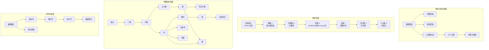

### 1.2 代数学概念层级

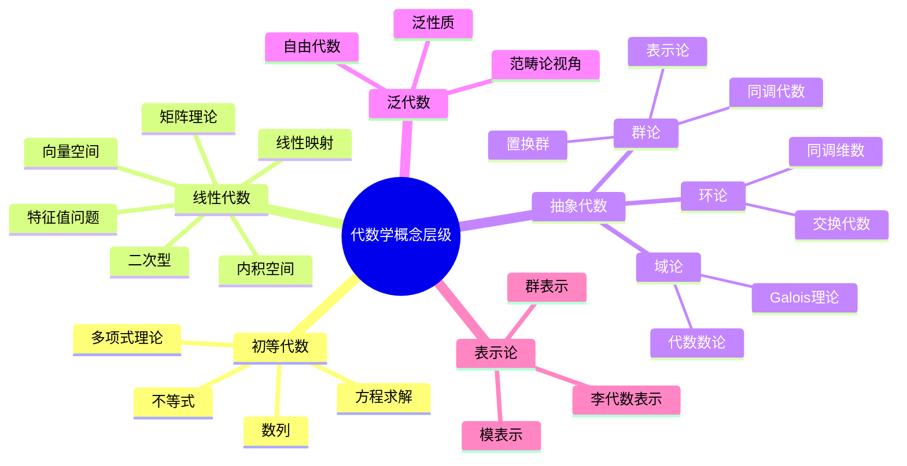

### 1.3 分析学概念层级

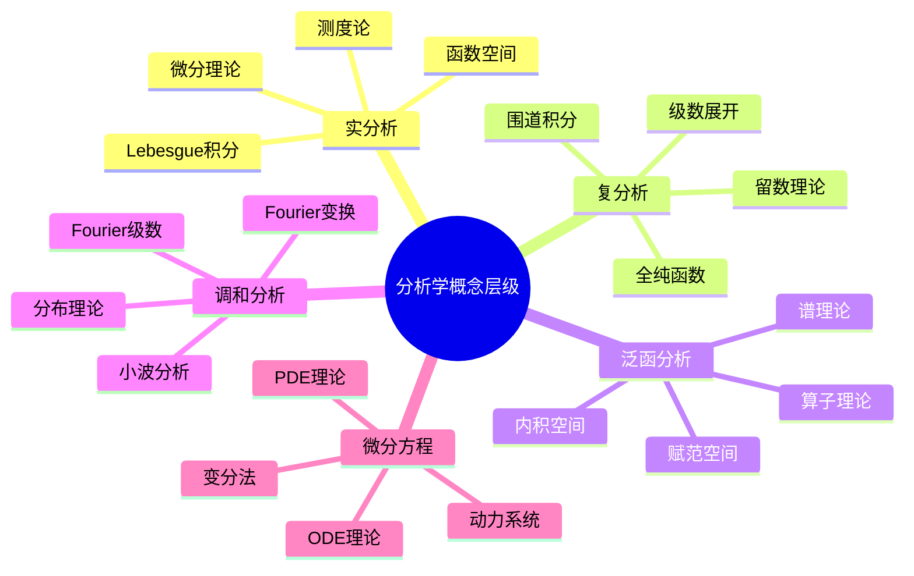

### 1.4 几何拓扑层级

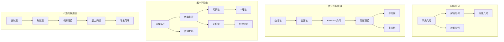

### 1.5 概念深度层级表

| 领域 | 入门级 | 基础级 | 进阶级 | 研究级 |
|-----|-------|-------|-------|-------|
| **代数** | 线性方程组 | 向量空间/矩阵 | 模论/同调代数 | 导出代数几何 |
| **分析** | 微积分运算 | 实分析/复分析 | 泛函分析/PDE | 微局部分析 |
| **几何** | 解析几何 | 微分几何 | Riemann几何 | 非交换几何 |
| **拓扑** | 直观拓扑 | 点集拓扑 | 代数拓扑 | 同伦型理论 |
| **数论** | 整除性 | 代数数论 | 算术几何 | Langlands纲领 |

---

## 2. 定理依赖关系图

### 2.1 分析学定理依赖链

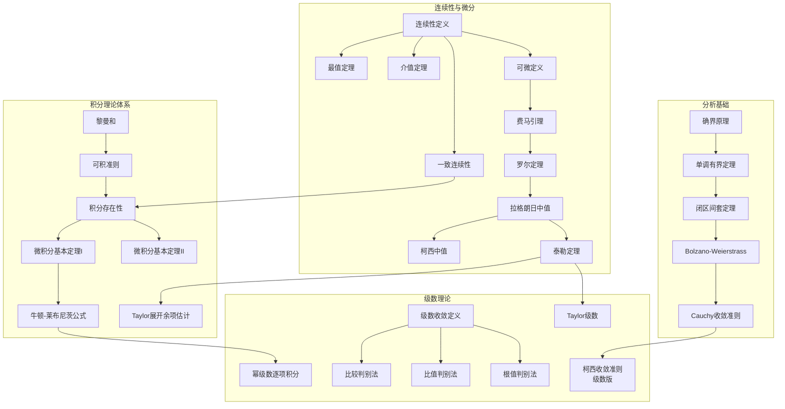

### 2.2 代数学定理依赖网络

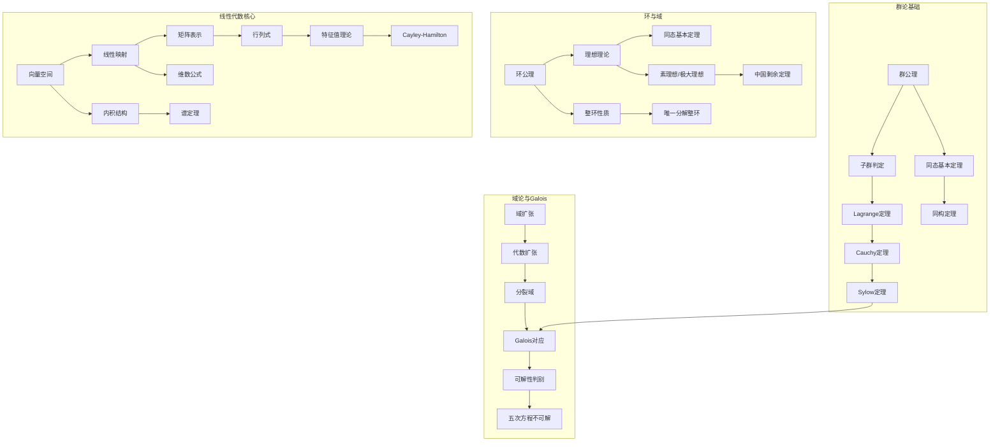

### 2.3 几何拓扑定理依赖

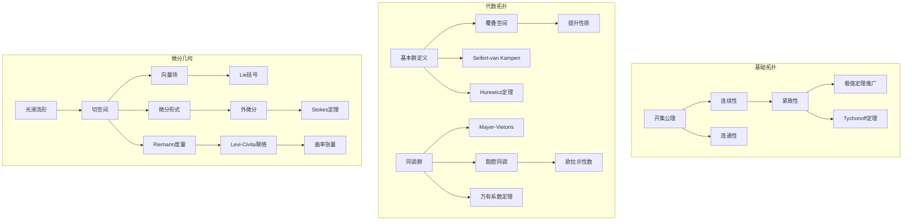

### 2.4 定理依赖分析表

| 核心定理 | 直接依赖 | 间接依赖 | 应用场景 | 现代推广 |
|---------|---------|---------|---------|---------|
| **微积分基本定理** | 连续性、可积性 | 实数完备性 | 定积分计算 | Lebesgue微分定理 |
| **Lagrange中值** | Rolle定理、连续性 | 实数性质 | 不等式证明 | 向量值函数中值 |
| **同态基本定理** | 正规子群/理想定义 | 群/环公理 | 结构分类 | 范畴论视角 |
| **谱定理** | 内积、自伴算子 | 特征值理论 | 对角化 | 无界算子谱理论 |
| **Stokes定理** | 外微分、流形定向 | 光滑结构 | 积分计算 |  currents理论 |
| **Galois对应** | 分裂域、自同构 | 域扩张理论 | 方程可解性 | 伽罗瓦上同调 |

---

## 3. 跨分支类比图

### 3.1 三大分支深层类比

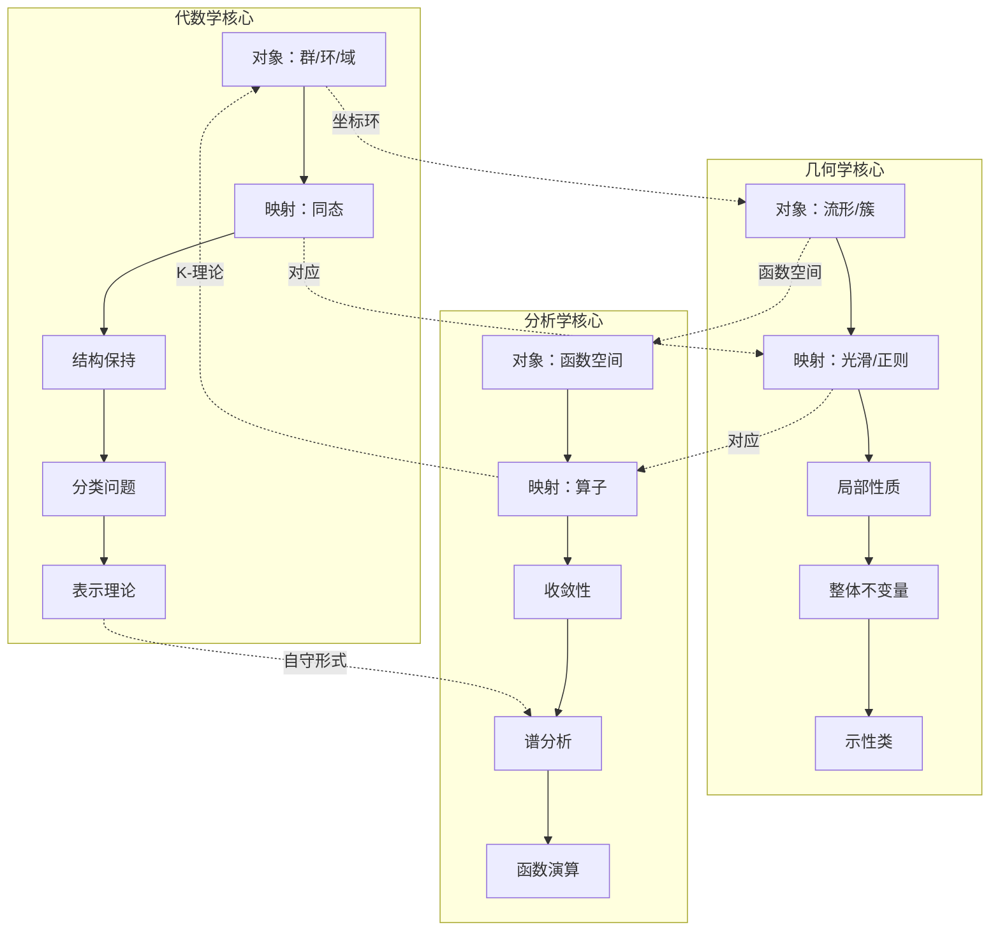

### 3.2 范畴论统一视角

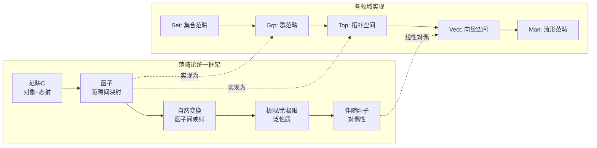

### 3.3 跨分支概念对照表

| 概念/操作 | 代数学表达 | 几何学表达 | 分析学表达 | 拓扑学表达 |
|----------|-----------|-----------|-----------|-----------|
| **基本对象** | 群、环、模 | 流形、簇、丛 | 函数、算子、分布 | 空间、覆叠、层 |
| **结构映射** | 同态、同构 | 微分同胚、等距 | 连续/有界/紧算子 | 同胚、同伦等价 |
| **局部性质** | 局部化 | 切空间/芽 | 可微性/解析性 | 局部同调 |
| **整体不变量** | 不变量、示性类 | 亏格、陈类 | 指标、谱 | 同调群、同伦群 |
| **分类工具** | 表示论、K-理论 | 模空间 | 指标定理 | 配边理论 |
| **对偶概念** | 线性对偶、Pontryagin对偶 | 庞加莱对偶 | 分布/函数对偶 | Alexander对偶 |

### 3.4 三大定理的跨分支对应

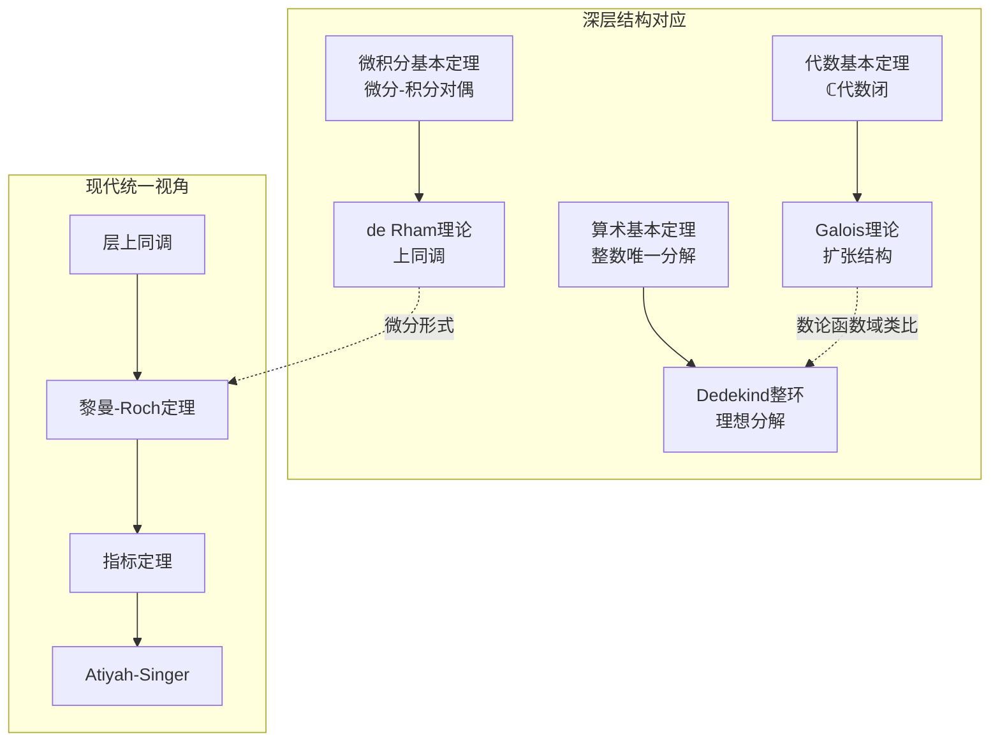

### 3.5 分析问题代数化趋势

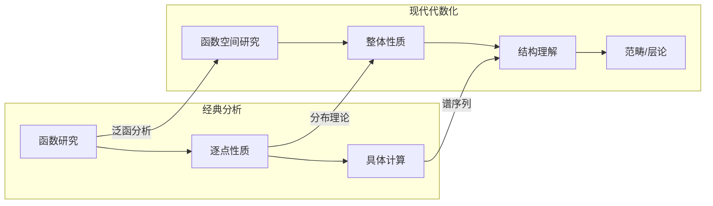

**实际应用示例**：Dirichlet问题的跨分支视图

```
问题：在区域Ω上求Δu=0，边界u|∂Ω=f

分析视角：
- 存在性：Perron方法（上调和函数）
- 正则性：椭圆正则性理论
- 唯一性：极值原理

几何视角：
- 调和函数：能量极小（变分）
- 几何解释：平均性质、Dirichlet原理
- 整体结构：边界与内部的对应

代数视角：
- 层论：调和函数层上同调
- 代数几何：复流形上的Δ=∂∂̄
- 同调：de Rham上同调类

拓扑视角：
- 边界拓扑决定解空间
- 指标：Δ的Fredholm指标
- 示性类： obstruction理论
```

---

## 4. 历史发展脉络图

### 4.1 数学史时间线

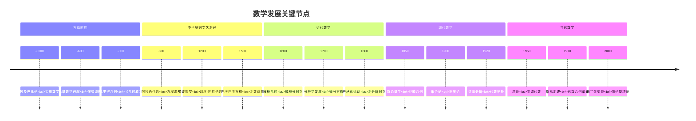

### 4.2 分支形成关系图

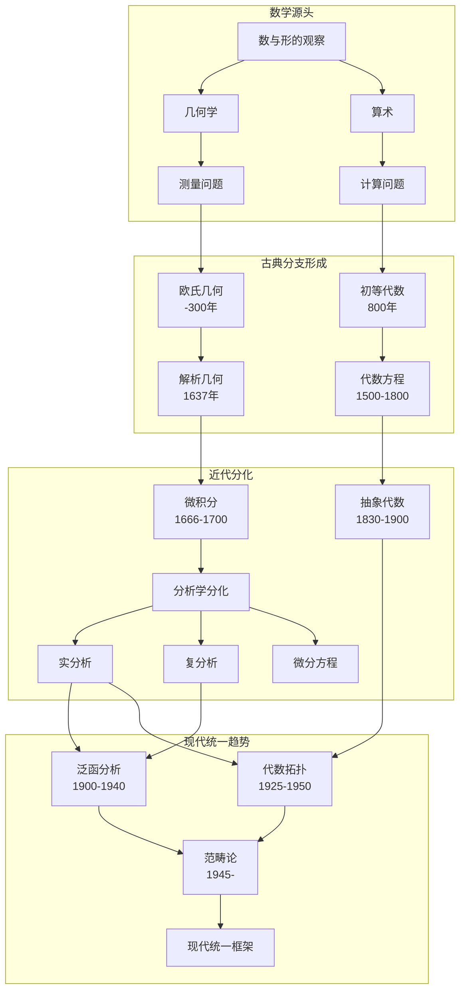

### 4.3 重大数学革命对照

| 时期 | 数学革命 | 核心突破 | 代表成果 | 影响范围 |
|-----|---------|---------|---------|---------|
| **公元前** | 公理化革命 | 演绎证明 | 欧几里得《几何原本》 | 全部数学 |
| **17世纪** | 分析革命 | 无限小方法 | 微积分创立 | 自然科学 |
| **19世纪** | 严格化革命 | ε-δ语言 | 分析严格化 | 分析学 |
| **19世纪** | 抽象化革命 | 公理化结构 | 群、域、向量空间 | 代数学 |
| **20世纪** | 集合论革命 | 数学基础 | ZFC公理系统 | 全部数学 |
| **20世纪** | 结构主义革命 | 范畴论 | 泛性质观点 | 数学统一 |
| **当代** | 计算革命 | 算法与证明 | 计算机辅助证明 | 数学实践 |

### 4.4 中国数学贡献脉络

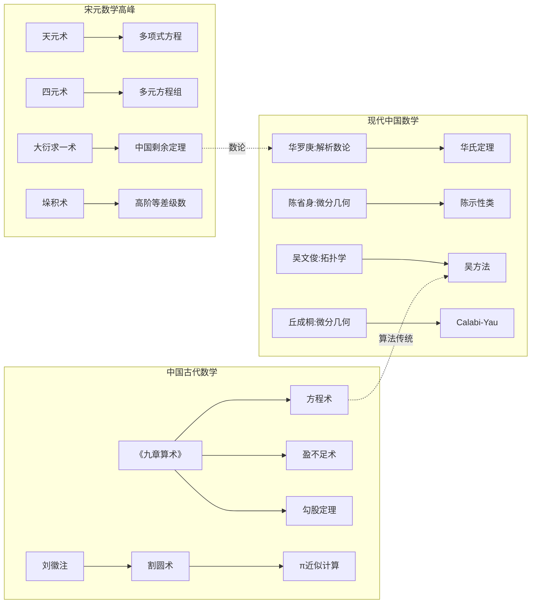

### 4.5 数学统一趋势

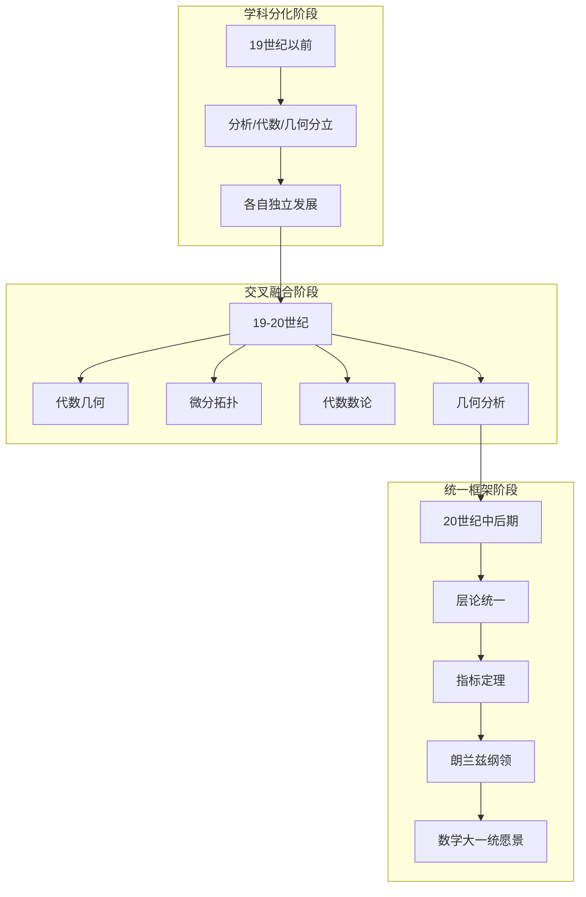

---

## 知识结构整合图

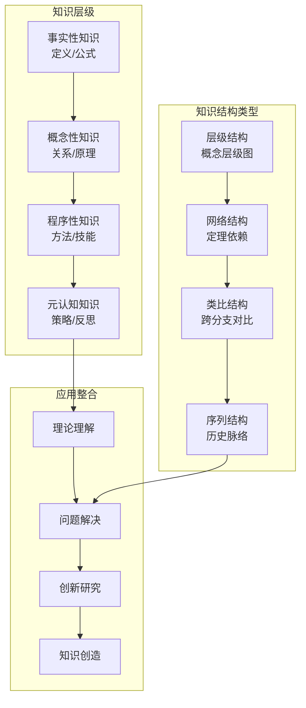

---

## 相关概念链接

- [数学思维表征完全指南](16-数学思维表征完全指南.md) - 思维可视化基础方法
- [定理证明思维导图集](20-定理证明思维导图集.md) - 具体定理的证明路径
- [概念对比矩阵大全](21-概念对比矩阵大全.md) - 相似概念的详细对比
- [数学研究问题探索指南](19-数学研究问题探索指南.md) - 基于结构图谱的研究方法

---

## 学习路径建议

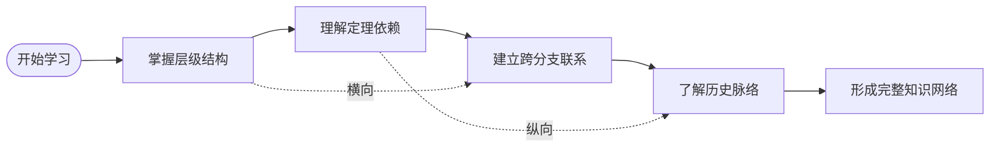

1. **从层级入手**：先理解各领域概念的基础到高级层次
2. **追踪依赖链**：理解定理证明的逻辑链条
3. **寻找类比**：在不同分支间发现相似结构
4. **历史视角**：了解概念发展的历史必然性
5. **综合运用**：在具体问题中调用跨领域知识
