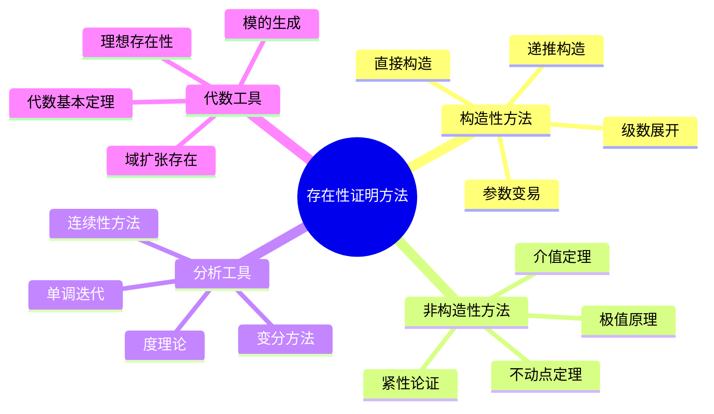
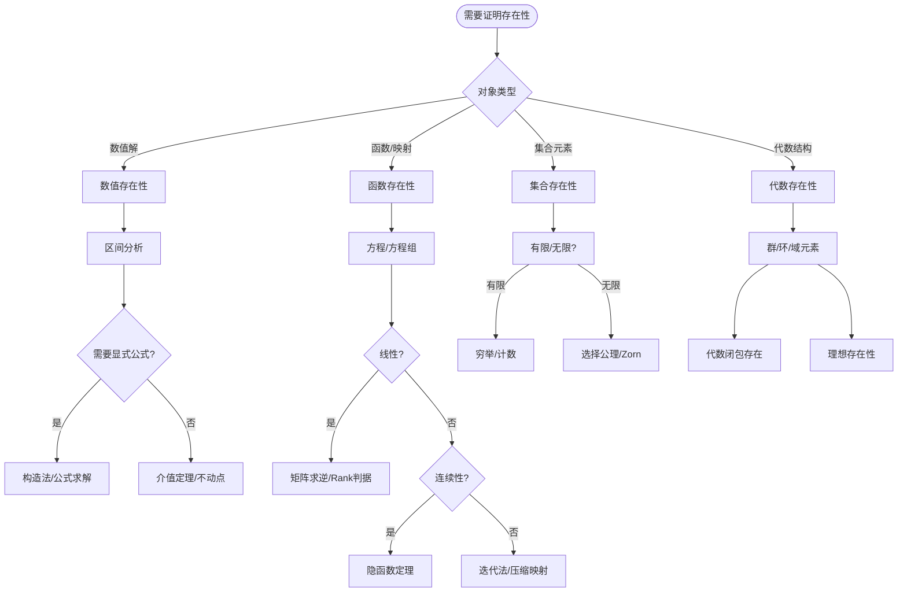
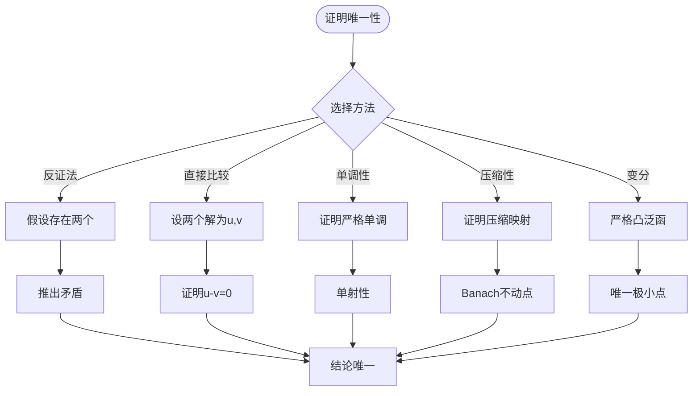
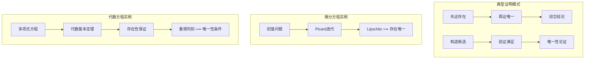
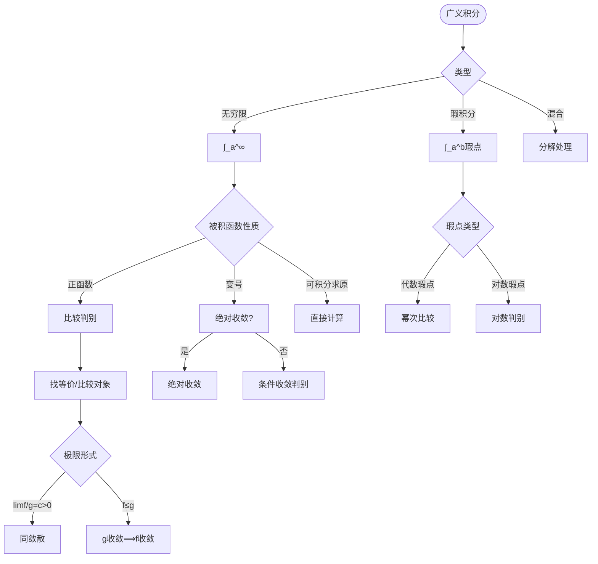
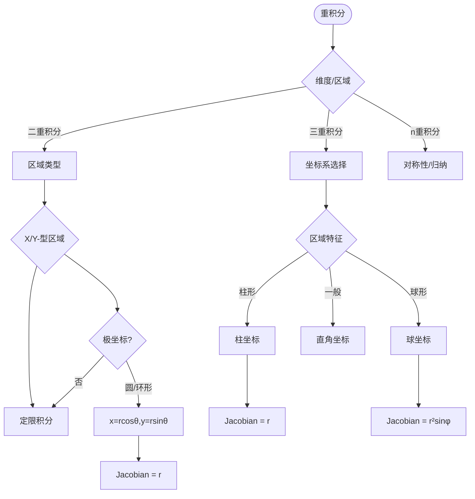
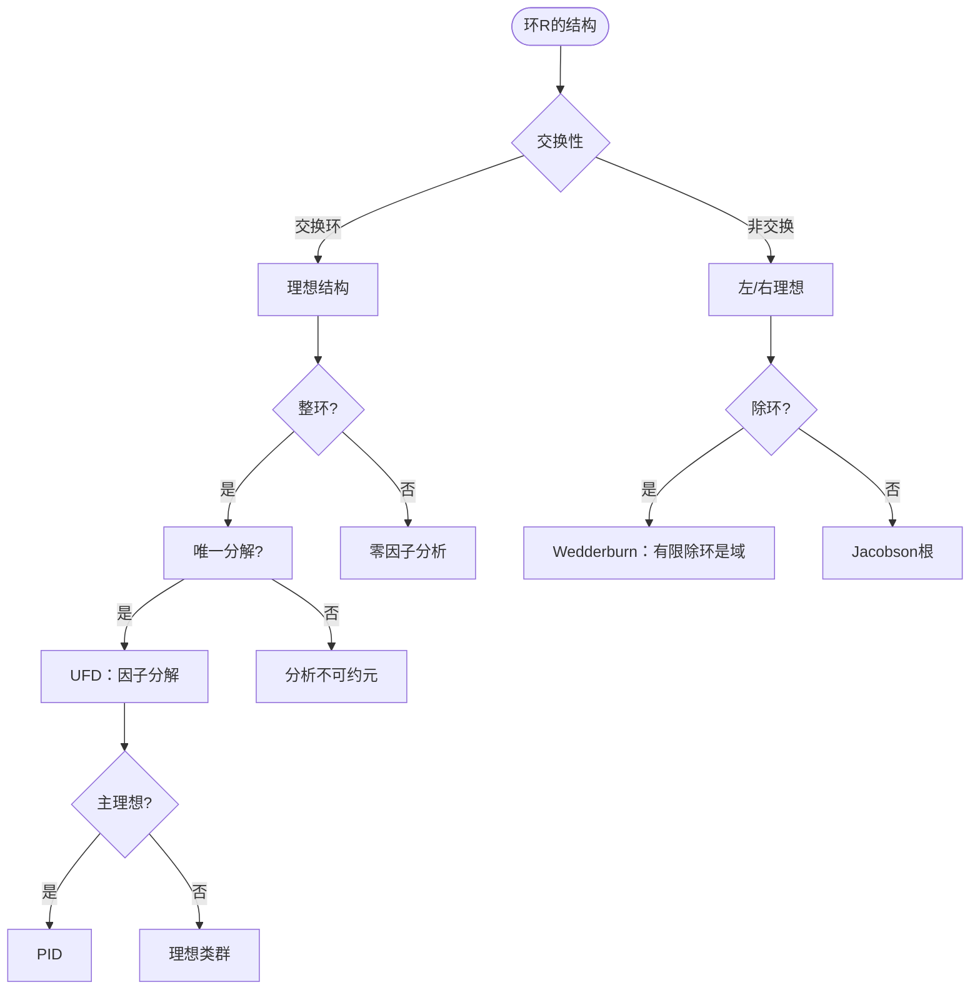
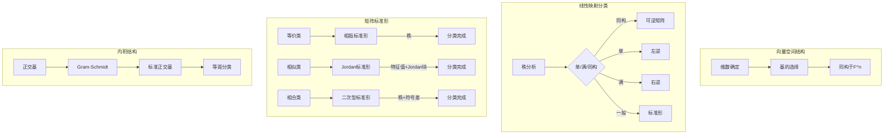
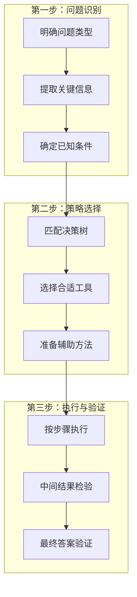

# 问题求解决策树集

> 系统化的问题求解策略，为常见数学问题类型提供决策路径和解决方案

---

## 目录

1. [证明存在性vs唯一性决策树](#1-证明存在性vs唯一性决策树)
2. [收敛性判别决策树](#2-收敛性判别决策树)
3. [积分技巧选择决策树](#3-积分技巧选择决策树)
4. [代数结构分类决策树](#4-代数结构分类决策树)

---

## 1. 证明存在性vs唯一性决策树

### 1.1 存在性证明方法总览



### 1.2 存在性证明决策流程



### 1.3 唯一性证明策略



### 1.4 存在唯一性综合决策表

| 问题类型 | 存在性工具 | 唯一性工具 | 典型场景 |
|---------|-----------|-----------|---------|
| **方程根** | 介值定理、Brouwer度 | 严格单调、压缩映射 | 超越方程 |
| **ODE解** | Peano存在、Carathéodory | Lipschitz条件 | 初值问题 |
| **PDE解** | Galerkin方法、不动点 | 能量估计、极值原理 | 边值问题 |
| **优化解** | Weierstrass极值 | 严格凸性 | 变分问题 |
| **不动点** | Brouwer、Schauder | 压缩条件 | 迭代算法 |
| **代数元** | 分裂域存在 | 极小多项式唯一 | 域扩张 |

### 1.5 存在性与唯一性组合策略



**实际应用示例**：证明方程 $e^x + x = 0$ 存在唯一实根

```
决策路径：
1. 设 f(x) = e^x + x
2. 存在性：
   - f(-1) = e^{-1} - 1 < 0
   - f(0) = 1 > 0
   - f连续 ⟹ 由介值定理存在根
3. 唯一性：
   - f'(x) = e^x + 1 > 0 对所有x
   - f严格单调递增 ⟹ 至多一个根
4. 结论：恰有一个实根，位于(-1,0)
```

---

## 2. 收敛性判别决策树

### 2.1 数列收敛判别流程

```mermaid
flowchart TD
    Start([数列{a_n}]) --> Q1{类型判断}
    
    Q1 -->|显式公式| T1[直接求极限]
    Q1 -->|递推定义| T2[递推分析]
    Q1 -->|和式/积分| T3[积分判别]
    
    T2 --> T4{单调?}
    T4 -->|是| T5[单调有界定理]
    T4 -->|否| T6[Cauchy条件]
    T4 -->|压缩| T7[压缩映射原理]
    
    T5 --> T8[证明有界]
    T5 --> T9[证明单调]
    T8 --> T10[极限存在]
    T9 --> T10
    
    T6 --> T11[|a_m-a_n|→0?]
    T11 -->|是| T10
    T11 -->|否| T12[发散]
    
    T7 --> T13[证明压缩系数<1]
    T13 --> T10
```

### 2.2 级数收敛判别决策树

```mermaid
flowchart TD
    Start([级数Σa_n]) --> Q1{类型判断}
    
    Q1 -->|正项级数| P1[正项判别]
    Q1 -->|交错级数| A1[Leibniz判别]
    Q1 -->|任意项| G1[绝对/条件]
    
    P1 --> P2{通项特征}
    P2 -->|有理/指数| P3[比值/根值]
    P2 -->|可积分| P4[积分判别]
    P2 -->|比较对象明| P5[比较判别]
    
    P3 --> P6[lim|a_{n+1}/a_n|]
    P6 -->|L<1| P7[收敛]
    P6 -->|L>1| P8[发散]
    P6 -->|L=1| P9[失效，换方法]
    
    A1 --> A2{|a_n|递减?}
    A2 -->|是| A3{a_n→0?}
    A2 -->|否| A4[换方法]
    A3 -->|是| A5[收敛]
    A3 -->|否| A6[发散]
    
    G1 --> G2{Σ|a_n|收敛?}
    G2 -->|是| G3[绝对收敛]
    G2 -->|否| G4{原级数收敛?}
    G4 -->|是| G5[条件收敛]
    G4 -->|否| G6[发散]
```

### 2.3 函数列收敛判别

```mermaid
flowchart TD
    Start([函数列f_n→f]) --> Q1{收敛类型}
    
    Q1 -->|逐点收敛| P1[逐点极限计算]
    Q1 -->|一致收敛| U1[一致范数检验]
    Q1 -->|L^p收敛| L1[积分检验]
    
    P1 --> P2[∀x,limf_n(x)=f(x)]
    P2 --> P3{需一致?}
    P3 -->|是| P4[计算sup|f_n-f|]
    P3 -->|否| P5[完成]
    
    U1 --> U2{sup|f_n-f|→0?}
    U2 -->|是| U3[一致收敛]
    U2 -->|否| U4[不一致收敛]
    
    L1 --> L2[∫|f_n-f|^p→0?]
    L2 -->|是| L3[L^p收敛]
    L2 -->|否| L4[不L^p收敛]
    
    U3 --> U5[极限函数连续性]
    U3 --> U6[积分极限交换]
    U3 --> U7[微分极限交换]
```

### 2.4 积分收敛判别



### 2.5 收敛性判别速查表

| 对象类型 | 首选方法 | 备选方法 | 关键不等式 |
|---------|---------|---------|-----------|
| **正项级数** | 比较判别 | 比值/根值 | $a_n \leq b_n$ |
| **交错级数** | Leibniz | Abel/Dirichlet | $|a_n| \downarrow 0$ |
| **幂级数** | 根值法求R | 比值法求R | Cauchy-Hadamard |
| **函数列一致** | sup范数 | Dini定理 | M-判别法 |
| **广义积分** | 比较判别 | 绝对收敛 | p-积分标准 |
| **含参积分** | Weierstrass | Abel/Dirichlet | 控制收敛 |
| **迭代序列** | 单调有界 | 压缩映射 | $|x_{n+1}-x_n|$ |

**实际应用示例**：判别 $\sum_{n=1}^{\infty} \frac{n^2+1}{n^3+2} \sin n$ 的收敛性

```
决策路径：
1. 通项变号，考虑绝对收敛
2. 估计：|a_n| ≤ (n²+1)/(n³+2) ~ 1/n
3. Σ1/n发散，不能直接得结论
4. 更精细估计：(n²+1)/(n³+2) = O(1/n)
5. 尝试Dirichlet判别：
   - Σsin n 部分和有界
   - (n²+1)/(n³+2) 单调趋于0
6. 结论：级数收敛（条件收敛）
```

---

## 3. 积分技巧选择决策树

### 3.1 不定积分策略选择

```mermaid
flowchart TD
    Start([求∫f(x)dx]) --> Q1{函数类型}
    
    Q1 -->|有理函数| R1[有理函数分解]
    Q1 -->|三角函数| T1[三角换元]
    Q1 -->|根式| S1[根式换元]
    Q1 -->|指数对数| E1[分部积分]
    Q1 -->|复合函数| C1[换元/凑微分]
    Q1 -->|乘积| P1[分部积分]
    
    R1 --> R2[部分分式分解]
    R2 --> R3[A/(x-a) + (Bx+C)/(x²+px+q)]
    R3 --> R4[逐项积分]
    
    T1 --> T2[万能代换t=tan(x/2)]
    T1 --> T3[特殊换元]
    T3 --> T4[sin²+cos²=1]
    
    S1 --> S2{根式类型}
    S2 -->|√(a²-x²)| S3[x=asinθ]
    S2 -->|√(x²+a²)| S4[x=atanθ/x=asht]
    S2 -->|√(x²-a²)| S5[x=asecθ/x=acht]
    S2 -->|ⁿ√(ax+b)| S6[t=ⁿ√(ax+b)]
    
    E1 --> E2[∫x^n·e^xdx]
    E2 --> E3[表格法分部积分]
    
    P1 --> P2{选择u,v原则}
    P2 -->|对反幂三指| P3[LIATE原则]
    P3 --> P4[udv = uv - ∫vdu]
```

### 3.2 定积分特殊技巧

```mermaid
flowchart TD
    Start([求∫_a^b f(x)dx]) --> Q1{特征分析}
    
    Q1 -->|对称区间| S1[奇偶性化简]
    Q1 -->|周期函数| P1[周期化简]
    Q1 -->|含参积分| V1[含参技巧]
    Q1 -->|特殊形式| Sp1[特殊公式]
    
    S1 --> S2[-a,a]区间
    S2 --> S3[f奇 ⟹ 积分=0]
    S2 --> S4[f偶 ⟹ 2∫_0^a]
    
    P1 --> P2[利用f(x+T)=f(x)]
    P2 --> P3[化到基本周期]
    
    V1 --> V2{参数位置}
    V2 -->|上限| V3[变上限求导]
    V2 -->|被积函数| V4[积分号下求导]
    V4 --> V5[交换顺序]
    
    Sp1 --> Sp2{形式识别}
    Sp2 -->|∫_0^{π/2}ln(sinx)| Sp3[Fourier级数]
    Sp2 -->|∫_0^∞e^{-x²}| Sp4[极坐标/Γ函数]
    Sp2 -->|∫_0^{2π}R(cos,sin)| Sp5[复变/万能代换]
```

### 3.3 多重积分策略



### 3.4 积分技巧选择矩阵

| 被积函数特征 | 推荐方法 | 具体步骤 | 注意事项 |
|------------|---------|---------|---------|
| **有理函数** | 部分分式 | 分解→逐项积分 | 注意重因子 |
| **R(sinx,cosx)** | 万能代换 | t=tan(x/2) | 可能复杂，先化简 |
| **√(二次式)** | 三角/双曲代换 | 配方后换元 | 注意象限 |
| **x^n·e^x** | 分部积分 | 表格法 | 多次应用 |
| **lnx, arctanx** | 分部积分 | 设u=反/对 | dv易求 |
| **对称区间** | 奇偶性 | 先判断再计算 | 0点有瑕点需小心 |
| **e^{ax}sin(bx)** | 分部积分两次 | 解方程 | 循环出现 |

### 3.5 曲线曲面积分

```mermaid
graph TB
    subgraph 曲线积分[曲线积分]
        A1[第一类∫f ds] --> A2[参数化]
        A2 --> A3[ds=|r'(t)|dt]
        
        B1[第二类∫Pdx+Qdy] --> B2{闭曲线?}
        B2 -->|是| B3[Green公式]
        B2 -->|否| B4[与路径无关?]
        B4 -->|是| B5[找原函数]
        B4 -->|否| B6[参数化计算]
    end
    
    subgraph 曲面积分[曲面积分]
        C1[第一类∬f dS] --> C2[曲面参数化]
        C2 --> C3[dS=|r_u×r_v|dudv]
        
        D1[第二类∬Pdydz+...] --> D2{闭曲面?}
        D2 -->|是| D3[Gauss公式]
        D2 -->|否| D4[投影计算]
    end
```

**实际应用示例**：计算 $I = \int_0^{\pi/2} \frac{\sin x}{\sin x + \cos x} dx$

```
决策路径：
1. 被积函数复杂，尝试对称技巧
2. 设 I = ∫_0^{π/2} sinx/(sinx+cosx) dx
3. 令 x = π/2 - t，得：
   I = ∫_0^{π/2} cost/(sint+cost) dt
4. 两式相加：
   2I = ∫_0^{π/2} (sinx+cosx)/(sinx+cosx) dx = π/2
5. 故 I = π/4

技巧总结：区间再现公式 ∫_a^b f(x)dx = ∫_a^b f(a+b-x)dx
```

---

## 4. 代数结构分类决策树

### 4.1 群结构分类流程

```mermaid
flowchart TD
    Start([群G的分类]) --> Q1{有限/无限}
    
    Q1 -->|有限群| F1[阶数分析]
    Q1 -->|无限群| I1[生成方式]
    
    F1 --> F2{|G|=p素数}
    F2 -->|是| F3[循环群 Z_p]
    F2 -->|否| F4{|G|=p²}
    F4 -->|是| F5[交换群：Z_{p²}或Z_p×Z_p]
    F4 -->|否| F6[Sylow分析]
    
    F6 --> F7[找Sylow子群]
    F7 --> F8[半直积结构]
    F8 --> F9[确定同构类]
    
    I1 --> I2{交换?}
    I2 -->|是| I3[自由Abel群分解]
    I2 -->|否| I4[自由群/表现]
    I4 --> I5[关系分析]
    I5 --> I6[正规形式]
```

### 4.2 环结构分类



### 4.3 域扩张结构

```mermaid
flowchart TD
    Start([域扩张E/F]) --> Q1{扩张类型}
    
    Q1 -->|单扩张| S1[本原元?]
    Q1 -->|有限扩张| F1[次数分析]
    Q1 -->|代数扩张| A1[代数元集合]
    Q1 -->|超越扩张| T1[超越基]
    
    S1 --> S2[α代数?]
    S2 -->|是| S3[单代数F(α)]
    S2 -->|否| S4[单超越F(α)≅F(x)]
    
    F1 --> F2{次数|}
    F2 -->|素数| F3[无中间域]
    F2 -->|合数| F4[找中间域]
    
    A1 --> A5{分裂域?}
    A5 -->|是| A6[Galois群]
    A6 --> A7[对应子群-中间域]
    
    T1 --> T2[超越次数]
    T2 --> T3[纯超越扩张]
```

### 4.4 线性代数结构分类



### 4.5 结构分类速查表

| 结构类型 | 完全不变量 | 分类定理 | 计算方法 |
|---------|-----------|---------|---------|
| **有限Abel群** | 不变因子/初等因子 | 结构定理 | Smith标准形 |
| **有限单群** | 无真正规子群 | 分类完成 | 系列识别 |
| **有限域** | 元素个数 $p^n$ | 唯一存在 | Galois群循环 |
| **矩阵相似** | Jordan标准形 | Jordan定理 | 特征值+特征向量 |
| **双线性型** | 秩+符号差 | Sylvester惯性 | 配方法 |
| **Lie代数** | Cartan矩阵 | Killing型 | 根系统 |

**实际应用示例**：分类所有8阶群

```
决策路径：
1. 8 = 2³，考虑Abel和非Abel
2. Abel群（不变因子分解）：
   - Z₈
   - Z₄×Z₂
   - Z₂×Z₂×Z₂
   共3个
3. 非Abel群：
   - Sylow 2-子群分析
   - D₄（二面体群）
   - Q₈（四元数群）
   共2个
4. 结论：8阶群恰有5个同构类
```

---

## 综合决策框架



---

## 相关概念链接

- [数学思维表征完全指南](16-数学思维表征完全指南.md) - 问题求解的一般方法论
- [数学研究问题探索指南](19-数学研究问题探索指南.md) - 从问题求解到研究探索
- [定理证明思维导图集](20-定理证明思维导图集.md) - 具体定理的证明路径
- [概念对比矩阵大全](21-概念对比矩阵大全.md) - 关键概念的性质对比

---

## 使用建议

1. **从上到下**：按照决策树的分支逐步分析
2. **灵活变通**：决策树提供的是典型路径，具体问题可能需要组合多种方法
3. **积累模式**：将成功解决的问题模式化，丰富决策树的叶子节点
4. **反向验证**：得出答案后，尝试用不同路径验证结果
