# 自测与诊断工具

> 系统化评估数学学习效果，精准定位薄弱环节，智能推荐学习路径

---

## 目录

1. [知识点掌握度自测](#1-知识点掌握度自测)
2. [学习路径推荐算法](#2-学习路径推荐算法)
3. [薄弱环节诊断](#3-薄弱环节诊断)

---

## 1. 知识点掌握度自测

### 1.1 自测框架设计

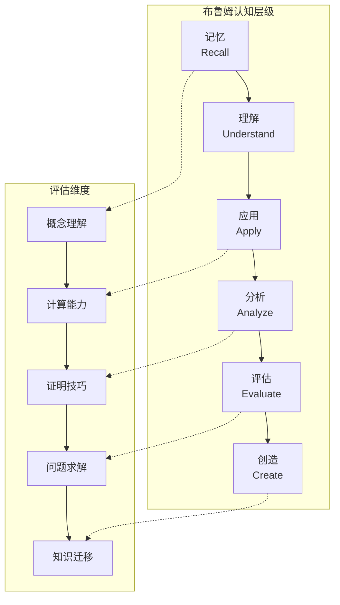

### 1.2 分析学自测题库

#### 极限与连续性自测

| 难度 | 题目类型 | 自测问题 | 掌握标准 | 对应层级 |
|-----|---------|---------|---------|---------|
| ⭐ | 概念理解 | 用ε-δ语言写出 $\lim_{x\to a}f(x)=L$ 的定义 | 准确写出定义 | 记忆/理解 |
| ⭐⭐ | 计算应用 | 用定义证明 $\lim_{x\to 2}(3x+1)=7$ | 完成完整证明 | 应用 |
| ⭐⭐⭐ | 分析证明 | 证明：若 $f$ 在 $[a,b]$ 连续且 $f(a)f(b)<0$，则存在零点 | 应用介值定理 | 分析 |
| ⭐⭐⭐⭐ | 综合评估 | 构造一个在无理点连续、有理点不连续的函数 | 构造并验证 | 评估/创造 |

#### 微分学自测

| 难度 | 题目类型 | 自测问题 | 掌握标准 | 对应层级 |
|-----|---------|---------|---------|---------|
| ⭐ | 计算 | 求 $f(x)=x^x$ 的导数 | 正确使用对数微分法 | 应用 |
| ⭐⭐ | 理解 | 解释中值定理的几何意义 | 准确描述切线与割线关系 | 理解 |
| ⭐⭐⭐ | 证明 | 用中值定理证明 $|\sin x - \sin y| \leq |x-y|$ | 完整推导 | 分析 |
| ⭐⭐⭐⭐ | 创造 | 寻找使Rolle定理条件减弱但仍成立的充分条件 | 提出并验证新条件 | 创造 |

#### 积分学自测

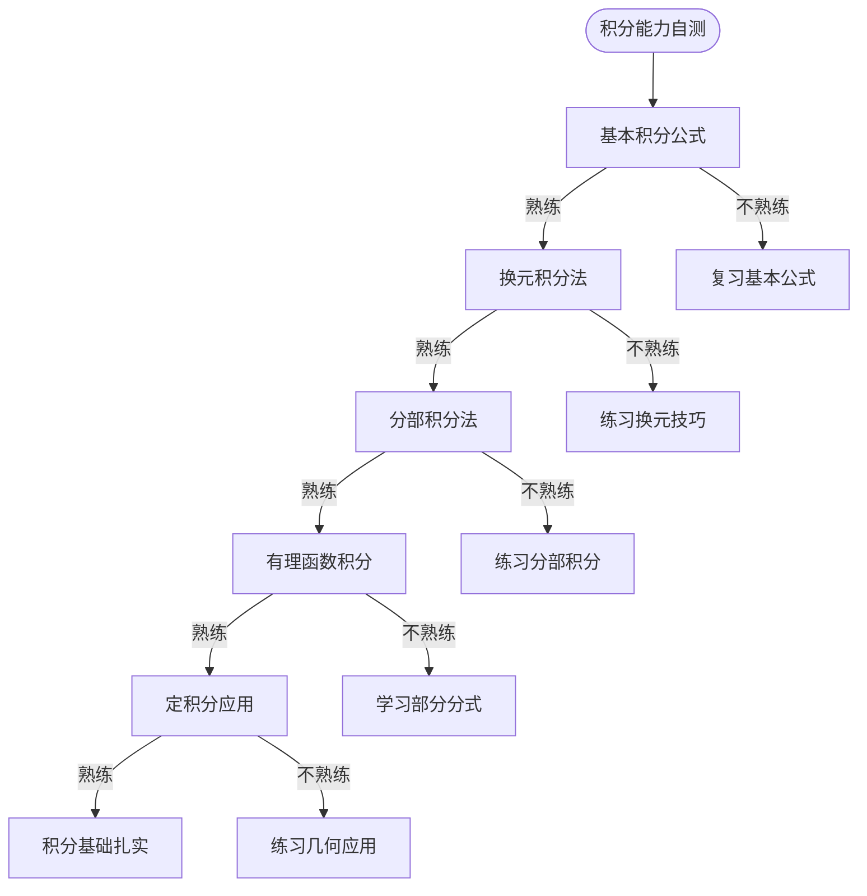

### 1.3 代数学自测题库

#### 线性代数自测矩阵

| 知识模块 | 基础题(⭐) | 进阶题(⭐⭐⭐) | 挑战题(⭐⭐⭐⭐⭐) |
|---------|----------|------------|--------------|
| **矩阵运算** | 计算矩阵乘法 | 证明 $(AB)^{-1}=B^{-1}A^{-1}$ | 推导分块矩阵求逆公式 |
| **行列式** | 计算3阶行列式 | 用行列式性质证明范德蒙德行列式 | 研究行列式组合恒等式 |
| **线性方程组** | 用高斯消元求解 | 讨论含参方程组的解 | 设计大规模稀疏系统算法 |
| **特征值** | 求2×2矩阵特征值 | 证明实对称矩阵特征值实 | 估计特征值分布范围 |
| **二次型** | 将二次型化为标准形 | 证明惯性定律 | 研究不定二次型的几何 |

#### 抽象代数自测

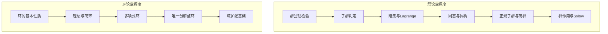

### 1.4 自测评分标准

| 掌握等级 | 得分范围 | 表现特征 | 建议行动 |
|---------|---------|---------|---------|
| **初学** | 0-40% | 概念模糊，计算错误多 | 重新学习基础概念 |
| **了解** | 41-60% | 理解基本，应用有困难 | 加强练习，巩固应用 |
| **掌握** | 61-80% | 能独立完成常规问题 | 挑战难题，深化理解 |
| **精通** | 81-95% | 灵活运用，能讲解他人 | 探索拓展，研究创新 |
| **专家** | 96-100% | 深刻洞察，能创造知识 | 参与研究，指导他人 |

---

## 2. 学习路径推荐算法

### 2.1 个性化学习路径框架

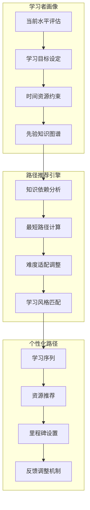

### 2.2 知识依赖图谱

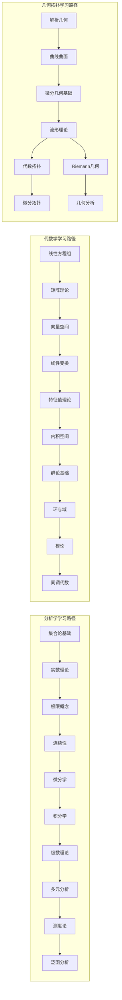

### 2.3 自适应学习算法

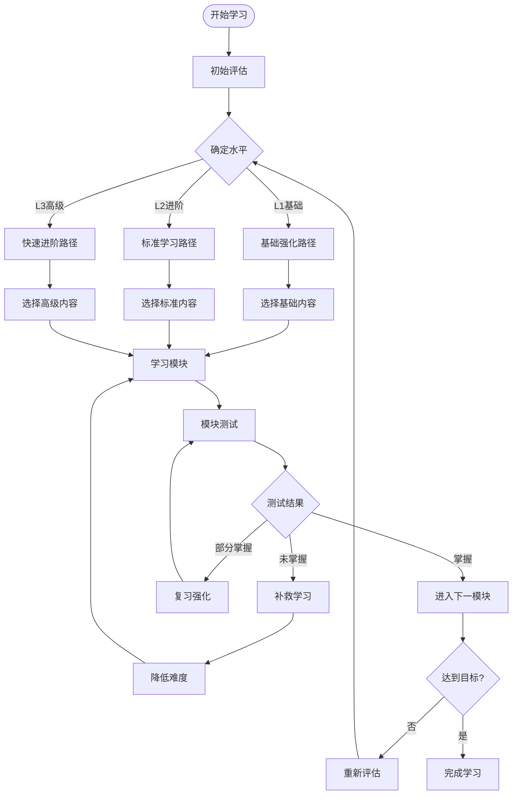

### 2.4 路径推荐示例

#### 场景1：分析学速成路径

```
学习者背景：物理专业，需快速掌握分析学基础
时间约束：8周
推荐路径：

周1-2: 极限与连续性（重点：ε-δ语言、基本定理）
  └─ 跳过：构造性实数理论细节
  └─ 重点：定理的应用场景

周3-4: 微分学（重点：计算技巧、中值定理应用）
  └─ 跳过：病态函数精细分析
  └─ 重点：物理应用（极值、曲率）

周5-6: 积分学（重点：计算、应用）
  └─ 精简：可积性深层理论
  └─ 强化：曲线曲面积分（场论需要）

周7-8: 级数与初步泛函（重点：幂级数、收敛判别）
  └─ 目标：能读懂物理文献中的数学
```

#### 场景2：代数学系统路径

```
学习者背景：数学专业，系统学习抽象代数
时间约束：16周
推荐路径：

阶段1（周1-4）：线性代数深化
  ├─ 向量空间结构
  ├─ 线性映射与同构定理
  ├─ 特征值与Jordan标准形
  └─ 内积空间与谱定理

阶段2（周5-8）：群论基础
  ├─ 群公理与例子
  ├─ 子群与陪集
  ├─ 同态与同构
  ├─ 群作用与Sylow定理
  └─ 有限生成交换群结构

阶段3（周9-12）：环与域
  ├─ 环的基本理论
  ├─ 理想与商环
  ├─ 多项式环与UFD
  ├─ 域扩张基础
  └─ Galois理论简介

阶段4（周13-16）：高级专题
  ├─ 模论初步
  ├─ 同调代数入门
  └─ 范畴论视角
```

### 2.5 学习路径推荐表

| 目标 | 起点 | 推荐路径 | 预计时长 | 关键里程碑 |
|-----|-----|---------|---------|-----------|
| **考研数学** | 本科基础 | 高数→线代→概率 | 6-12月 | 真题模拟120分+ |
| **竞赛数学** | 扎实基础 | 专题突破→综合训练 | 1-2年 | 省一/国奖 |
| **科研入门** | 研究生水平 | 专业方向深化 | 2-3年 | 独立发表论文 |
| **工程师** | 高中数学 | 应用导向学习 | 3-6月 | 解决实际问题 |
| **教师资质** | 本科毕业 | 教学法+内容深化 | 1年 | 教师资格证+教学能力 |

---

## 3. 薄弱环节诊断

### 3.1 诊断框架

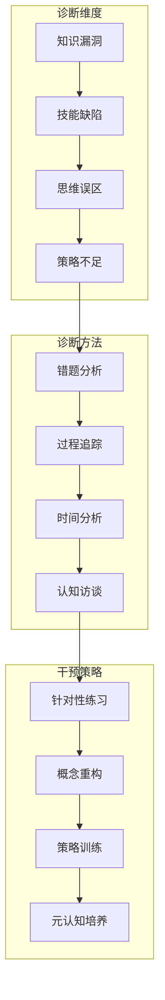

### 3.2 常见薄弱环节诊断表

#### 分析学常见薄弱点

| 症状 | 可能原因 | 诊断方法 | 干预措施 |
|-----|---------|---------|---------|
| ε-δ证明无从下手 | 量化逻辑不熟练 | 逻辑转换测试 | 专门训练逻辑表达 |
| 积分计算错误多 | 基本公式不牢 | 限时公式测试 | 建立公式卡片 |
| 级数判别选择困难 | 判别法理解不深 | 对比分类测试 | 制作决策树 |
| 一致收敛概念模糊 | 量词嵌套理解弱 | 反例构造测试 | 分析经典反例 |
| 多元函数混乱 | 几何直观缺乏 | 图形识别测试 | 加强可视化训练 |

#### 代数学常见薄弱点

| 症状 | 可能原因 | 诊断方法 | 干预措施 |
|-----|---------|---------|---------|
| 抽象概念难以理解 | 具体例子积累少 | 例子联想测试 | 丰富例子库 |
| 证明思路不清晰 | 逻辑链条训练少 | 证明补全测试 | 分析典型证明 |
| 计算Jordan标准形出错 | 算法步骤不熟练 | 步骤分解测试 | 流程图训练 |
| 同态核像混淆 | 概念区分不清 | 概念辨析测试 | 对比矩阵练习 |
| 商结构理解困难 | 等价类直觉弱 | 具体构造测试 | 从Z/nZ入手 |

### 3.3 诊断流程图

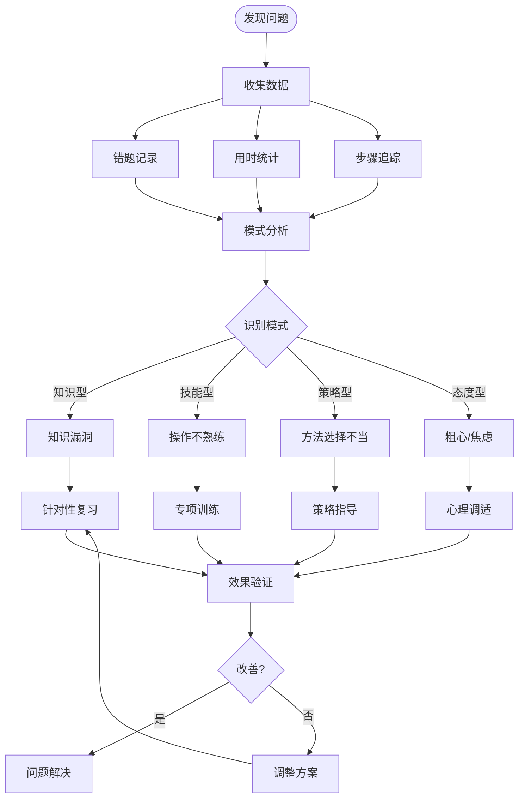

### 3.4 个性化诊断报告模板

```markdown
# 数学学习诊断报告

## 基本信息
- 诊断日期：2026年X月X日
- 诊断范围：_______
- 测试时长：_______

## 整体表现
- 综合得分：___/100
- 掌握等级：_______
- 主要优势：_______
- 主要薄弱：_______

## 分项诊断

### 1. 概念理解
- 得分率：___%
- 薄弱概念：
  * _____________（建议：_______）
  * _____________（建议：_______）

### 2. 计算能力
- 得分率：___%
- 常见错误类型：
  * _____________
  * _____________
- 建议强化：_______

### 3. 证明能力
- 得分率：___%
- 薄弱环节：
  * 证明思路（是/否）
  * 逻辑表达（是/否）
  * 技巧运用（是/否）

### 4. 问题解决
- 得分率：___%
- 问题类型分析：_______

## 改进建议

### 短期目标（1-2周）
1. _______
2. _______

### 中期目标（1-2月）
1. _______
2. _______

### 长期目标（学期）
1. _______

## 推荐资源
- 教材章节：_______
- 练习题集：_______
- 在线资源：_______
```

### 3.5 智能诊断系统架构

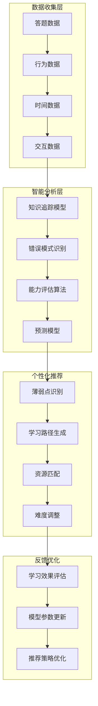

---

## 综合诊断工具

### 学习健康度仪表盘

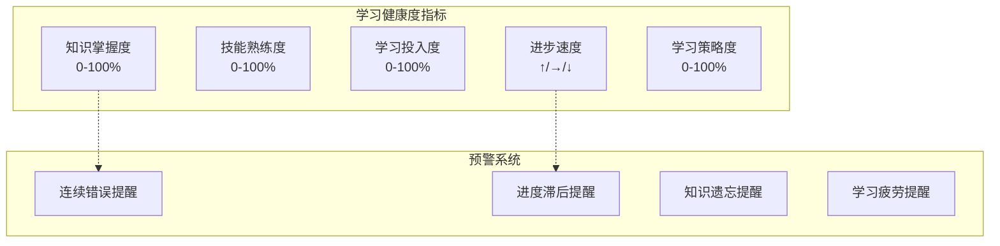

---

## 相关概念链接

- [数学思维表征完全指南](16-数学思维表征完全指南.md) - 学习策略与思维工具
- [数学研究问题探索指南](19-数学研究问题探索指南.md) - 从学习到研究的进阶
- [概念对比矩阵大全](21-概念对比矩阵大全.md) - 用于自测的知识对比
- [问题求解决策树集](23-问题求解决策树集.md) - 提升问题解决能力的工具

---

## 使用指南

1. **定期自测**：建议每章/每周进行一次自测
2. **诚实评估**：不要查看答案后再作答
3. **记录过程**：不仅记录结果，更要记录思考过程
4. **追踪进步**：对比多次自测结果，观察进步曲线
5. **主动求助**：对于持续薄弱环节，及时寻求帮助

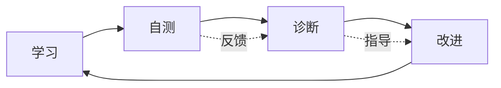
