# 数学学习方法论大全

> 本文档汇集数学学习的有效方法论，包括费曼学习法、间隔重复技巧、主动回忆策略、问题驱动学习和个性化学习路径设计。

---

## 🧠 学习方法论总览

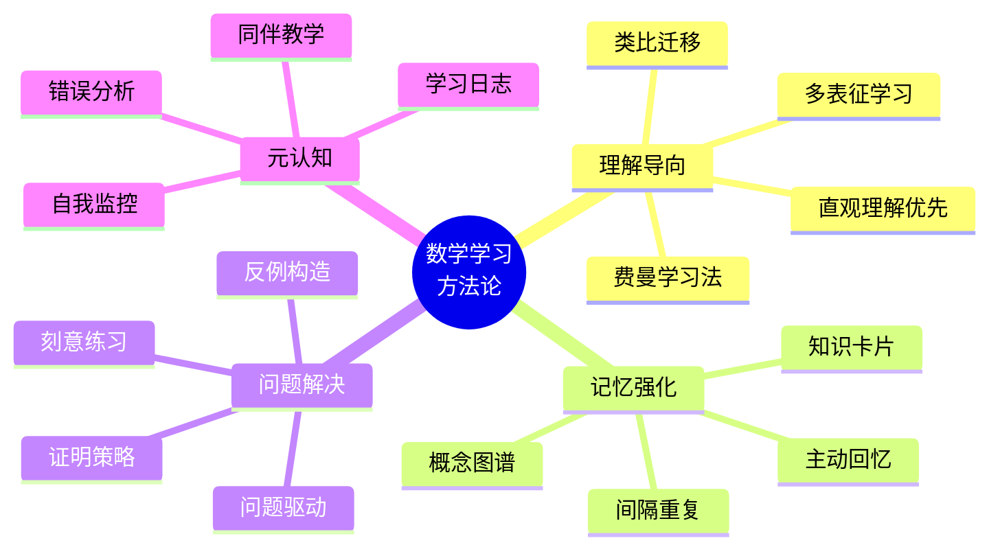

---

## 1️⃣ 费曼学习法应用

### 1.1 费曼技巧四步法

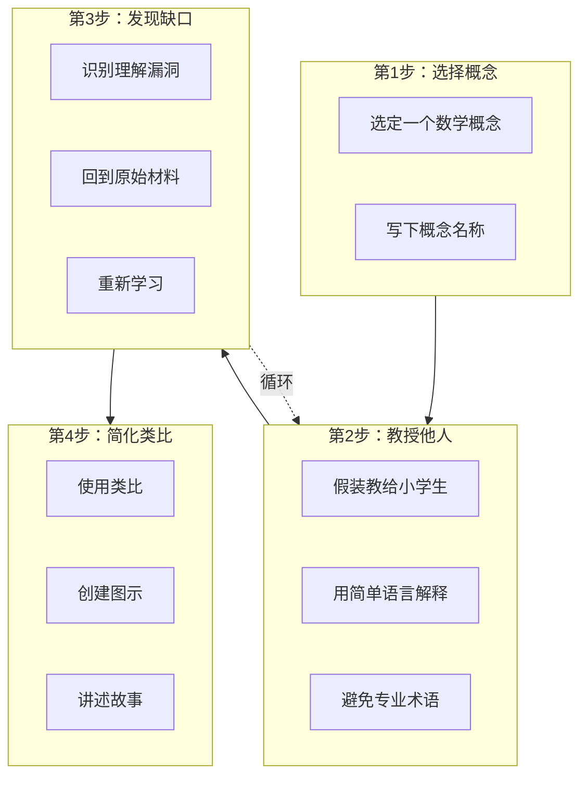

### 1.2 数学中的费曼技巧实践

**示例：解释"连续性"**

| 层次 | 解释方式 | 适用对象 |
|------|----------|----------|
| 专业定义 | ∀ε>0, ∃δ>0, 当\|x-a\|<δ时，\|f(x)-f(a)\|<ε | 数学专业学生 |
| 通俗解释 | "一笔画"不断开的曲线 | 高中生 |
| 类比解释 | "温度变化是连续的，电梯楼层变化是离散的" | 初学者 |
| 图形解释 | 画图展示"没有洞" "没有跳跃" | 视觉学习者 |

### 1.3 费曼技巧在FormalMath中的应用

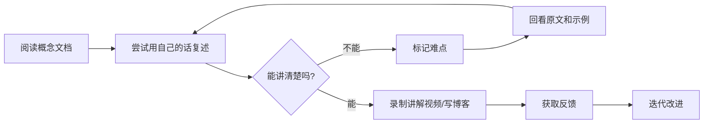

**推荐实践清单**

- [ ] 每天选择一个概念进行"费曼讲解"
- [ ] 使用 [核心概念理解三问](../00-核心概念理解三问/) 辅助深度理解
- [ ] 在 [学习社区] 分享你的解释
- [ ] 录制5分钟概念讲解视频

---

## 2️⃣ 间隔重复技巧

### 2.1 间隔重复原理

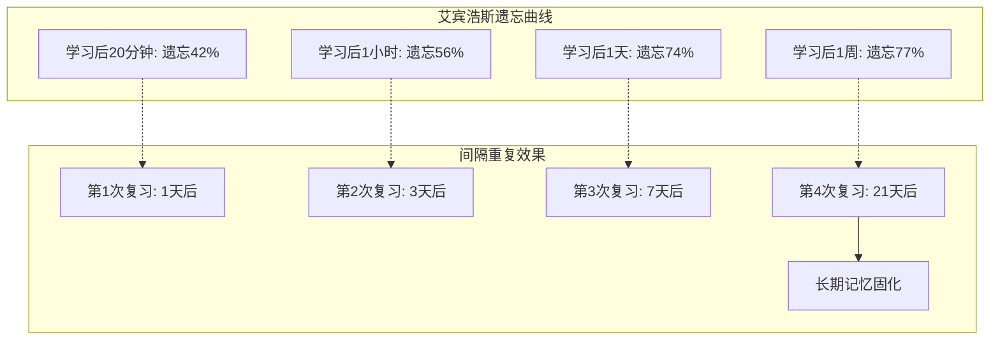

### 2.2 数学知识间隔重复计划

| 复习轮次 | 时间间隔 | 复习内容 | 复习方式 |
|----------|----------|----------|----------|
| 第1轮 | 学习后1天 | 定理陈述 | 闭卷默写 |
| 第2轮 | 学习后3天 | 证明关键步骤 | 主动回忆 |
| 第3轮 | 学习后7天 | 应用例题 | 独立解答 |
| 第4轮 | 学习后14天 | 与其他概念联系 | 绘制概念图 |
| 第5轮 | 学习后30天 | 综合测试 | 限时练习 |

### 2.3 Anki卡片制作指南

**正面卡片示例：**

```
什么是群的定义？
需要满足哪四条公理？
```

**背面卡片示例：**

```
群 (G, ·) 是一个集合 G 配备二元运算 ·，满足：

1. 封闭性: ∀a,b∈G, a·b∈G
2. 结合律: ∀a,b,c∈G, (a·b)·c = a·(b·c)
3. 单位元: ∃e∈G, ∀a∈G, e·a = a·e = a
4. 逆元: ∀a∈G, ∃a⁻¹∈G, a·a⁻¹ = e

例子: (ℤ, +), (ℚ\{0}, ×)
```

**卡片类型建议：**

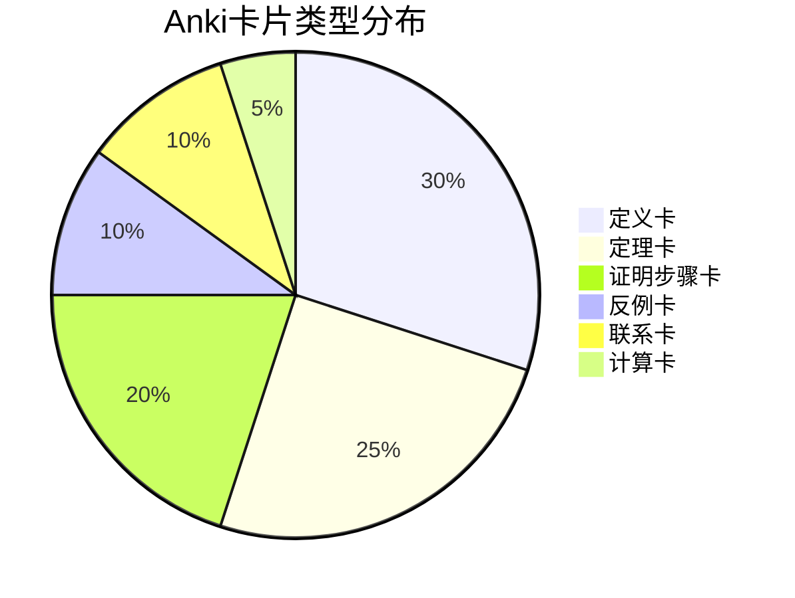

---

## 3️⃣ 主动回忆策略

### 3.1 主动回忆 vs 被动阅读

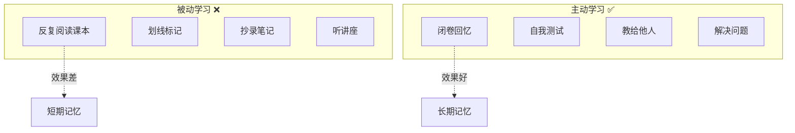

**效率对比表**

| 学习方法 | 记忆保持率(1周后) | 推荐指数 |
|----------|-------------------|----------|
| 听讲 | 5% | ⭐ |
| 阅读 | 10% | ⭐⭐ |
| 视听结合 | 20% | ⭐⭐⭐ |
| 演示/展示 | 30% | ⭐⭐⭐ |
| 小组讨论 | 50% | ⭐⭐⭐⭐ |
| 实践练习 | 75% | ⭐⭐⭐⭐⭐ |
| 教给他人/立即应用 | 90% | ⭐⭐⭐⭐⭐ |

### 3.2 主动回忆实施步骤

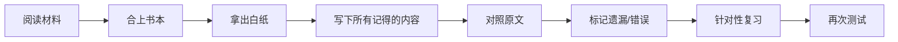

### 3.3 数学专用主动回忆技巧

**定理回忆练习：**

1. **陈述测试**：不看课本，写出定理的精确陈述
2. **条件测试**：定理的前提条件是什么？缺一不可吗？
3. **证明框架**：回忆证明的主要步骤和关键思路
4. **反例构造**：如果去掉某个条件，结论还成立吗？
5. **应用联想**：能想到哪些应用这个定理的例子？

**证明主动回忆模板：**

```
定理名称：___________

陈述：
_________________________________
_________________________________

证明步骤（关键词）：
1. _______________
2. _______________
3. _______________

关键技巧：___________
容易出错点：___________
```

---

## 4️⃣ 问题驱动学习

### 4.1 问题驱动学习框架

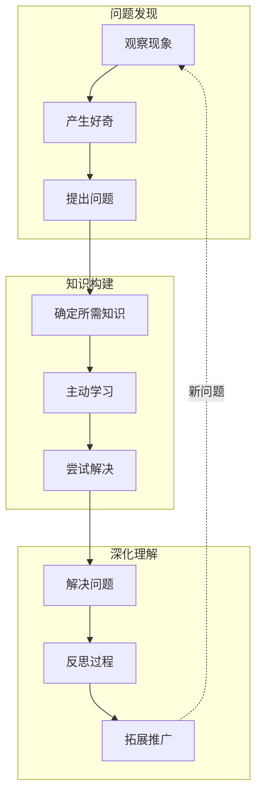

### 4.2 问题分类与解决策略

| 问题类型 | 特征 | 解决策略 | 示例 |
|----------|------|----------|------|
| **计算型** | 有明确算法 | 练习熟练度 | 求积分、矩阵运算 |
| **证明型** | 需逻辑推理 | 策略选择树 | 同构定理证明 |
| **构造型** | 需创造对象 | 从简单到复杂 | 构造反例 |
| **探索型** | 开放性问题 | 猜想-验证 | 研究性问题 |
| **应用型** | 联系实际 | 建模转化 | 优化问题 |

### 4.3 FormalMath问题资源

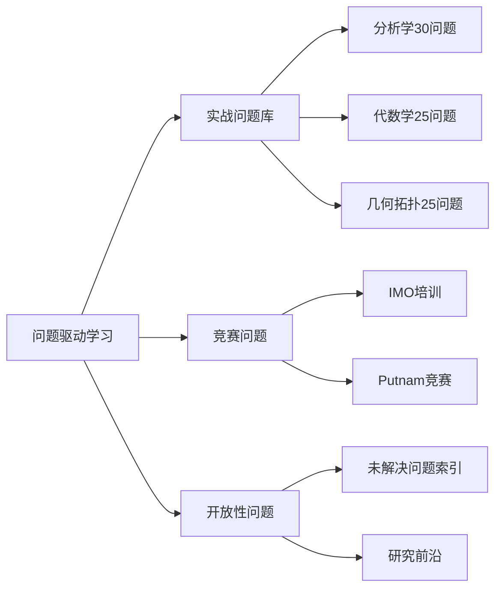

**推荐问题解决路径：**

1. 从 [实战问题分类索引](../00-实战问题解决/00-实战问题分类索引.md) 选择适合难度
2. 使用 [决策推理图](../00-决策推理图/) 确定解决策略
3. 参考 [工作示例库](../00-工作示例库/) 学习标准解法
4. 在 [核心概念理解三问](../00-核心概念理解三问/) 深化相关概念

---

## 5️⃣ 个性化学习路径设计

### 5.1 学习者类型诊断

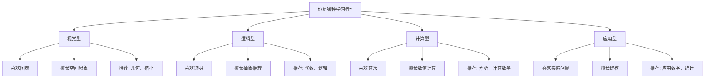

### 5.2 个性化路径模板

**路径A：纯数学研究导向**

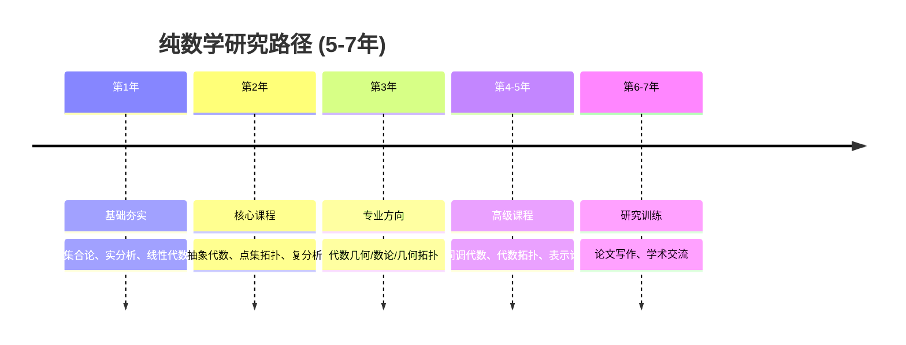

**路径B：应用数学工程导向**

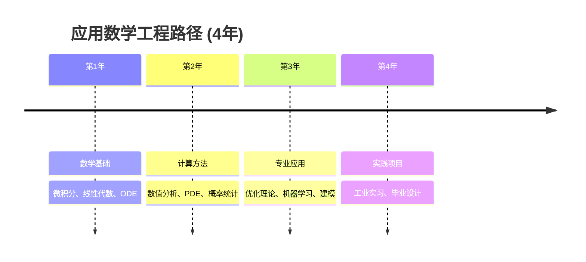

**路径C：数学教育导向**

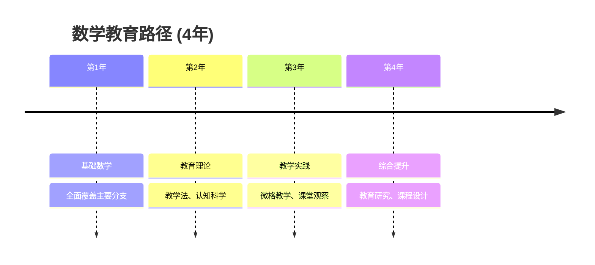

### 5.3 学习进度自评工具

**周度自评表：**

| 维度 | 目标 | 实际完成 | 差距分析 | 改进措施 |
|------|------|----------|----------|----------|
| 新内容学习 | 2-3个概念 | ___ | ___ | ___ |
| 定理证明 | 3-5个 | ___ | ___ | ___ |
| 问题解决 | 10-15题 | ___ | ___ | ___ |
| 复习巩固 | 间隔复习 | ___ | ___ | ___ |
| 深度理解 | 1个费曼讲解 | ___ | ___ | ___ |

**月度评估：**

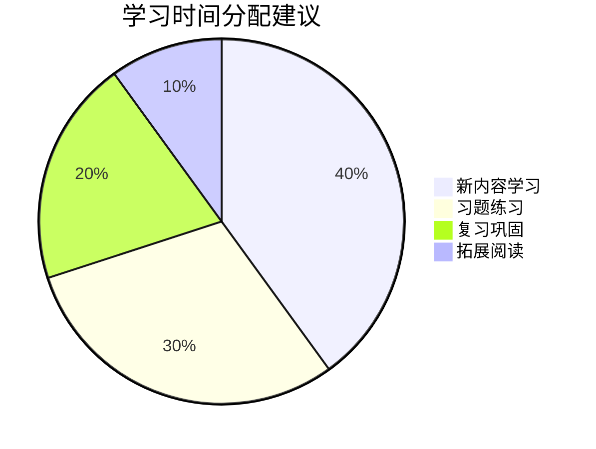

---

## 6️⃣ 元认知与自我监控

### 6.1 学习日志模板

```markdown
## 学习日志 - [日期]

### 今日学习内容
- 概念：___________
- 定理：___________
- 问题：___________

### 理解程度自评 (1-5)
- 概念理解：___
- 证明掌握：___
- 应用能力：___

### 困难与解决
- 遇到的困难：___________
- 解决方法：___________
- 需要进一步学习：___________

### 明日计划
- 复习内容：___________
- 新学内容：___________
- 练习题目：___________
```

### 6.2 错误分析与改进

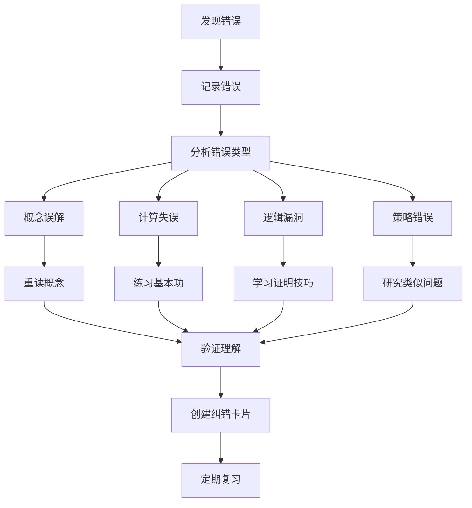

---

## 📚 推荐学习工具

| 工具类型 | 推荐工具 | 用途 | 链接 |
|----------|----------|------|------|
| 间隔重复 | Anki | 记忆数学定义 | ankiweb.net |
| 笔记管理 | Notion/Obsidian | 构建知识库 | - |
| 可视化 | GeoGebra | 几何可视化 | geogebra.org |
| 计算验证 | SageMath | 符号计算 | sagemath.org |
| 文献管理 | Zotero | 论文管理 | zotero.org |
| 思维导图 | XMind | 概念关系图 | xmind.net |

---

## 🎯 30天学习计划示例

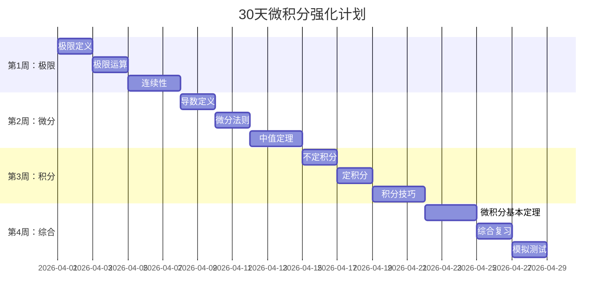

---

> **核心理念**：数学学习不是被动接受，而是主动建构。通过理解原理、间隔复习、主动回忆和问题驱动，你可以高效掌握数学知识。

---

*本文档提供数学学习的系统方法论 | FormalMath 项目组 | 2026-04*
