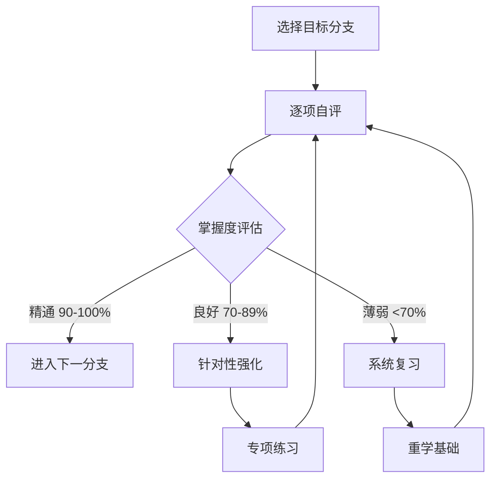
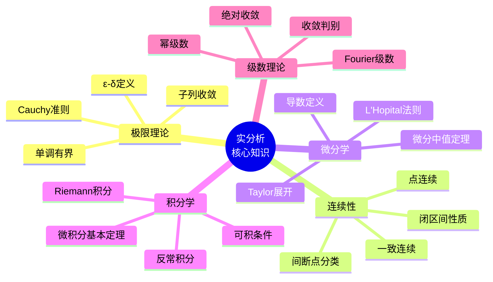
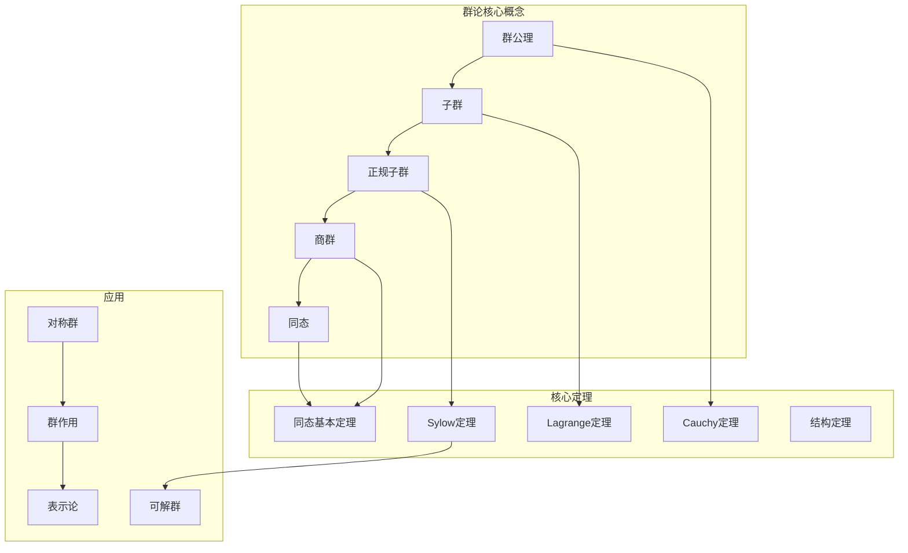
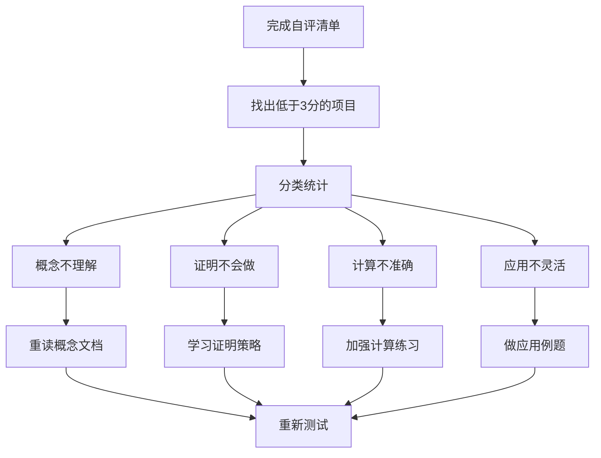

# 数学知识掌握度检验清单

> 本文档提供各数学分支核心知识点的检验清单、掌握度自评表、薄弱环节诊断工具和进阶建议。

---

## 📋 检验清单使用指南



**评分标准：**
- ⭐⭐⭐⭐⭐ (5分)：完全掌握，能独立证明和应用
- ⭐⭐⭐⭐ (4分)：基本掌握，偶有疏漏
- ⭐⭐⭐ (3分)：理解概念，证明需参考
- ⭐⭐ (2分)：有印象，需要复习
- ⭐ (1分)：几乎不了解

---

## 1️⃣ 基础数学检验清单

### 1.1 集合论基础

| # | 知识点 | 自评 | 验证问题 |
|---|--------|------|----------|
| 1.1 | 集合的表示与运算 | ⭐⭐⭐⭐⭐ | 证明 De Morgan 定律 |
| 1.2 | 映射的分类（单射/满射/双射） | ⭐⭐⭐⭐⭐ | 构造一个双射 f: ℕ → ℤ |
| 1.3 | 等价关系与划分 | ⭐⭐⭐⭐⭐ | 证明等价类构成划分 |
| 1.4 | 偏序与全序 | ⭐⭐⭐⭐⭐ | 画出幂集 P({1,2,3}) 的偏序图 |
| 1.5 | 基数概念（可数/不可数） | ⭐⭐⭐⭐⭐ | 证明 ℝ 不可数 |
| 1.6 | ZFC公理系统 | ⭐⭐⭐⭐⭐ | 选择公理的等价形式 |

**基础数学掌握度：___/30**

### 1.2 数理逻辑

| # | 知识点 | 自评 | 验证问题 |
|---|--------|------|----------|
| 2.1 | 命题逻辑（真值表） | ⭐⭐⭐⭐⭐ | 构造 (p→q)∧(q→r)→(p→r) 的真值表 |
| 2.2 | 量词逻辑（∀, ∃） | ⭐⭐⭐⭐⭐ | 否定 ∀ε>0, ∃δ>0, P(ε,δ) |
| 2.3 | 证明方法（直接/反证/归纳） | ⭐⭐⭐⭐⭐ | 用归纳法证明 Σk³ = (Σk)² |
| 2.4 | 完备性定理 | ⭐⭐⭐⭐⭐ | 解释语义完备与语法完备 |
| 2.5 | Gödel不完备定理 | ⭐⭐⭐⭐⭐ | 简述证明思路 |

**逻辑学掌握度：___/25**

---

## 2️⃣ 分析学检验清单

### 2.1 实分析



| # | 知识点 | 自评 | 验证标准 |
|---|--------|------|----------|
| 3.1 | 实数完备性（七大等价命题） | ⭐⭐⭐⭐⭐ | 证明确界原理⇒单调有界原理 |
| 3.2 | 极限的ε-δ定义 | ⭐⭐⭐⭐⭐ | 用定义证明 lim(x→0) sinx/x = 1 |
| 3.3 | 连续性及一致连续性 | ⭐⭐⭐⭐⭐ | 证明 sin(x²) 不一致连续 |
| 3.4 | 微分中值定理（三个） | ⭐⭐⭐⭐⭐ | 用Cauchy中值定理证明L'Hopital |
| 3.5 | Taylor定理及余项估计 | ⭐⭐⭐⭐⭐ | 估计e的近似误差 |
| 3.6 | Riemann可积条件 | ⭐⭐⭐⭐⭐ | 证明Dirichlet函数不可积 |
| 3.7 | 微积分基本定理 | ⭐⭐⭐⭐⭐ | 完整证明两个形式 |
| 3.8 | 数项级数收敛判别 | ⭐⭐⭐⭐⭐ | 比较各种判别法的适用范围 |
| 3.9 | 幂级数收敛半径 | ⭐⭐⭐⭐⭐ | 计算Σ(n!)x^n的收敛半径 |
| 3.10 | Fourier级数收敛性 | ⭐⭐⭐⭐⭐ | 证明Parseval等式 |

**实分析掌握度：___/50**

### 2.2 复分析

| # | 知识点 | 自评 | 验证标准 |
|---|--------|------|----------|
| 4.1 | 全纯函数定义 | ⭐⭐⭐⭐⭐ | 证明f(z)=z̄不满足Cauchy-Riemann |
| 4.2 | Cauchy积分定理 | ⭐⭐⭐⭐⭐ | 计算∮_{|z|=1} e^z/z dz |
| 4.3 | Cauchy积分公式 | ⭐⭐⭐⭐⭐ | 推导高阶导数公式 |
| 4.4 | 留数定理 | ⭐⭐⭐⭐⭐ | 计算∫_{-∞}^{∞} dx/(1+x⁴) |
| 4.5 | Laurent展开 | ⭐⭐⭐⭐⭐ | 求f(z)=1/(z(z-1))的展开 |
| 4.6 | 共形映射 | ⭐⭐⭐⭐⭐ | 上半平面→单位圆的映射 |

**复分析掌握度：___/30**

### 2.3 泛函分析

| # | 知识点 | 自评 | 验证标准 |
|---|--------|------|----------|
| 5.1 | 度量空间与完备化 | ⭐⭐⭐⭐⭐ | 构造ℚ的完备化 |
| 5.2 | Banach空间 | ⭐⭐⭐⭐⭐ | 证明C[0,1]是Banach空间 |
| 5.3 | Hilbert空间 | ⭐⭐⭐⭐⭐ | 证明Riesz表示定理 |
| 5.4 | 有界线性算子 | ⭐⭐⭐⭐⭐ | 计算积分算子的范数 |
| 5.5 | Hahn-Banach定理 | ⭐⭐⭐⭐⭐ | 应用延拓线性泛函 |
| 5.6 | 开映射定理 | ⭐⭐⭐⭐⭐ | 证明逆算子有界 |
| 5.7 | 一致有界原理 | ⭐⭐⭐⭐⭐ | 解释共鸣现象 |
| 5.8 | 谱理论基础 | ⭐⭐⭐⭐⭐ | 计算紧算子的谱 |

**泛函分析掌握度：___/40**

---

## 3️⃣ 代数学检验清单

### 3.1 群论



| # | 知识点 | 自评 | 验证标准 |
|---|--------|------|----------|
| 6.1 | 群的定义与基本例子 | ⭐⭐⭐⭐⭐ | 验证GL(n,ℝ)是群 |
| 6.2 | 子群与生成子群 | ⭐⭐⭐⭐⭐ | 求Z₁₂的所有子群 |
| 6.3 | Lagrange定理 | ⭐⭐⭐⭐⭐ | 完整证明并给应用 |
| 6.4 | 正规子群与商群 | ⭐⭐⭐⭐⭐ | 证明Aₙ ◁ Sₙ |
| 6.5 | 同态与同构基本定理 | ⭐⭐⭐⭐⭐ | 证明第一同构定理 |
| 6.6 | 群作用与轨道 | ⭐⭐⭐⭐⭐ | 用轨道计数公式 |
| 6.7 | Sylow定理 | ⭐⭐⭐⭐⭐ | 求阶为56群的Sylow子群 |
| 6.8 | 有限生成交换群结构 | ⭐⭐⭐⭐⭐ | 分类阶为100的交换群 |
| 6.9 | 可解群与合成列 | ⭐⭐⭐⭐⭐ | 证明S₄可解 |
| 6.10 | 自由群与表现 | ⭐⭐⭐⭐⭐ | 写出Dihedral群的表现 |

**群论掌握度：___/50**

### 3.2 环与域

| # | 知识点 | 自评 | 验证标准 |
|---|--------|------|----------|
| 7.1 | 环的定义与例子 | ⭐⭐⭐⭐⭐ | 验证Z[√-5]是环 |
| 7.2 | 理想与商环 | ⭐⭐⭐⭐⭐ | 证明Z/nZ是域⇔n素 |
| 7.3 | 素理想与极大理想 | ⭐⭐⭐⭐⭐ | 求Z[x]的素理想 |
| 7.4 | 唯一分解整环 | ⭐⭐⭐⭐⭐ | 证明Z[√-5]不是UFD |
| 7.5 | 主理想整环与Euclid整环 | ⭐⭐⭐⭐⭐ | 证明Z[i]是Euclid整环 |
| 7.6 | 域扩张 | ⭐⭐⭐⭐⭐ | 求Q(∛2)在Q上的次数 |
| 7.7 | 代数元与超越元 | ⭐⭐⭐⭐⭐ | 证明e是超越元（了解思路）|
| 7.8 | 分裂域与正规扩张 | ⭐⭐⭐⭐⭐ | 构造x³-2的分裂域 |
| 7.9 | Galois基本定理 | ⭐⭐⭐⭐⭐ | 建立对应并解释 |
| 7.10 | 有限域结构 | ⭐⭐⭐⭐⭐ | 证明F_{pⁿ}存在唯一性 |

**环与域掌握度：___/50**

### 3.3 线性代数

| # | 知识点 | 自评 | 验证标准 |
|---|--------|------|----------|
| 8.1 | 向量空间公理 | ⭐⭐⭐⭐⭐ | 验证多项式空间是向量空间 |
| 8.2 | 线性无关与基 | ⭐⭐⭐⭐⭐ | 证明基的等价刻画 |
| 8.3 | 维数定理 | ⭐⭐⭐⭐⭐ | 证明dim(U+W)+dim(U∩W)=... |
| 8.4 | 线性变换与矩阵 | ⭐⭐⭐⭐⭐ | 基变换下的矩阵关系 |
| 8.5 | 特征值与特征向量 | ⭐⭐⭐⭐⭐ | 证明特征多项式是相似不变量 |
| 8.6 | 对角化与Jordan标准形 | ⭐⭐⭐⭐⭐ | 判断矩阵是否可对角化 |
| 8.7 | 内积空间 | ⭐⭐⭐⭐⭐ | 证明Cauchy-Schwarz不等式 |
| 8.8 | 正交投影与最小二乘 | ⭐⭐⭐⭐⭐ | 推导正规方程 |
| 8.9 | 谱定理 | ⭐⭐⭐⭐⭐ | 证明Hermite矩阵可对角化 |
| 8.10 | 双线性型与二次型 | ⭐⭐⭐⭐⭐ | 化二次型为标准形 |

**线性代数掌握度：___/50**

---

## 4️⃣ 几何拓扑检验清单

### 4.1 拓扑学基础

| # | 知识点 | 自评 | 验证标准 |
|---|--------|------|----------|
| 9.1 | 拓扑空间定义 | ⭐⭐⭐⭐⭐ | 验证余有限拓扑 |
| 9.2 | 基与子基 | ⭐⭐⭐⭐⭐ | 构造乘积拓扑的基 |
| 9.3 | 闭包、内部、边界 | ⭐⭐⭐⭐⭐ | 证明Ā是包含A的最小闭集 |
| 9.4 | 连续映射 | ⭐⭐⭐⭐⭐ | 证明同胚是等价关系 |
| 9.5 | 连通性 | ⭐⭐⭐⭐⭐ | 证明连通空间的连续像是连通的 |
| 9.6 | 紧致性 | ⭐⭐⭐⭐⭐ | 证明[0,1]紧致（Heine-Borel）|
| 9.7 | 分离公理 | ⭐⭐⭐⭐⭐ | 构造T₂但非T₃的空间 |
| 9.8 | 商空间 | ⭐⭐⭐⭐⭐ | 说明S¹ = [0,1]/~ |
| 9.9 | Urysohn引理 | ⭐⭐⭐⭐⭐ | 应用构造连续函数 |
| 9.10 | Tychonoff定理 | ⭐⭐⭐⭐⭐ | 理解证明思路（选择公理）|

**拓扑学掌握度：___/50**

### 4.2 代数拓扑

| # | 知识点 | 自评 | 验证标准 |
|---|--------|------|----------|
| 10.1 | 同伦与形变收缩 | ⭐⭐⭐⭐⭐ | 证明Rⁿ可缩 |
| 10.2 | 基本群 | ⭐⭐⭐⭐⭐ | 计算S¹的基本群 |
| 10.3 | van Kampen定理 | ⭐⭐⭐⭐⭐ | 计算T²的基本群 |
| 10.4 | 覆盖空间 | ⭐⭐⭐⭐⭐ | 建立覆盖与基本群的关系 |
| 10.5 | 奇异同调 | ⭐⭐⭐⭐⭐ | 计算Hₙ(Dⁿ, Sⁿ⁻¹) |
| 10.6 | 正合列与Mayer-Vietoris | ⭐⭐⭐⭐⭐ | 计算Sⁿ的同调群 |
| 10.7 | 上同调环 | ⭐⭐⭐⭐⭐ | 计算T²的上同调环 |
| 10.8 | Poincaré对偶 | ⭐⭐⭐⭐⭐ | 陈述并解释意义 |
| 10.9 | 度理论 | ⭐⭐⭐⭐⭐ | 证明Brouwer不动点定理 |
| 10.10 | 胞腔同调 | ⭐⭐⭐⭐⭐ | 计算CPⁿ的同调 |

**代数拓扑掌握度：___/50**

### 4.3 微分几何

| # | 知识点 | 自评 | 验证标准 |
|---|--------|------|----------|
| 11.1 | 光滑流形定义 | ⭐⭐⭐⭐⭐ | 验证Sⁿ是光滑流形 |
| 11.2 | 切空间与切丛 | ⭐⭐⭐⭐⭐ | 计算TₚSⁿ的具体表示 |
| 11.3 | 向量场与流 | ⭐⭐⭐⭐⭐ | 求解简单ODE的流 |
| 11.4 | 张量场与微分形式 | ⭐⭐⭐⭐⭐ | 证明Cartan魔法公式 |
| 11.5 | Riemann度量 | ⭐⭐⭐⭐⭐ | 写出Poincaré度量 |
| 11.6 | 联络与平行移动 | ⭐⭐⭐⭐⭐ | 理解Levi-Civita联络 |
| 11.7 | 曲率张量 | ⭐⭐⭐⭐⭐ | 计算S²的截面曲率 |
| 11.8 | 测地线 | ⭐⭐⭐⭐⭐ | 推导测地线方程 |
| 11.9 | Gauss-Bonnet定理 | ⭐⭐⭐⭐⭐ | 应用到多面体 |
| 11.10 | de Rham定理 | ⭐⭐⭐⭐⭐ | 理解同构映射 |

**微分几何掌握度：___/50**

---

## 5️⃣ 数论与离散数学

### 5.1 数论基础

| # | 知识点 | 自评 | 验证标准 |
|---|--------|------|----------|
| 12.1 | 整除与同余 | ⭐⭐⭐⭐⭐ | 用孙子定理解同余方程组 |
| 12.2 | 欧几里得算法 | ⭐⭐⭐⭐⭐ | 证明并分析复杂度 |
| 12.3 | 算术基本定理 | ⭐⭐⭐⭐⭐ | 唯一性证明 |
| 12.4 | 欧拉函数与定理 | ⭐⭐⭐⭐⭐ | 证明RSA原理 |
| 12.5 | 原根与离散对数 | ⭐⭐⭐⭐⭐ | 求模17的原根 |
| 12.6 | 二次互反律 | ⭐⭐⭐⭐⭐ | 陈述并应用 |
| 12.7 | 素数分布 | ⭐⭐⭐⭐⭐ | 了解素数定理 |
| 12.8 | 丢番图方程 | ⭐⭐⭐⭐⭐ | 解x²+y²=z² |

**数论掌握度：___/40**

---

## 📊 综合掌握度评估

### 总分计算

| 分支 | 满分 | 得分 | 百分比 |
|------|------|------|--------|
| 基础数学 | 55 | ___ | ___% |
| 实分析 | 50 | ___ | ___% |
| 复分析 | 30 | ___ | ___% |
| 泛函分析 | 40 | ___ | ___% |
| 群论 | 50 | ___ | ___% |
| 环与域 | 50 | ___ | ___% |
| 线性代数 | 50 | ___ | ___% |
| 拓扑学 | 50 | ___ | ___% |
| 代数拓扑 | 50 | ___ | ___% |
| 微分几何 | 50 | ___ | ___% |
| 数论 | 40 | ___ | ___% |
| **总计** | **515** | ___ | ___% |

### 能力雷达图（可视化概念）

```
                    基础数学
                       5
                       |
                       |
    数论  5 -----------|------------ 5  分析学
          |            |            |
          |            |            |
          |            |            |
    代数  5 -----------|------------ 5  几何
          |            |            |
          |            |            |
          |            |            |
    拓扑  5 -----------|------------ 5  应用
                       |
                       |
                       5
                  计算能力
```

---

## 🔍 薄弱环节诊断

### 诊断流程



### 常见薄弱点与对策

| 薄弱症状 | 可能原因 | 改进建议 | 推荐资源 |
|----------|----------|----------|----------|
| 定义记不清 | 被动学习 | 使用Anki间隔重复 | [核心概念索引](../../concept/00-核心概念总索引.md) |
| 证明没思路 | 缺乏策略 | 学习证明决策树 | [证明策略决策树](../00-决策推理图/05-证明方法选择决策树.md) |
| 计算常出错 | 练习不足 | 增加刻意练习 | [计算示例库](../00-工作示例库/03-分析学/) |
| 概念联系弱 | 孤立学习 | 绘制概念图 | [概念关联图谱](../00-概念关联图谱/) |
| 不会应用 | 理解不深 | 问题驱动学习 | [实战问题解决](../00-实战问题解决/) |

---

## 🚀 进阶建议

### 按掌握度的进阶路径

**初级（总分<200）**
- 重点夯实基础数学和线性代数
- 使用 [新手入门指南](../00-指南与FAQ/用户指南/02-新手入门指南.md)
- 完成 [基础数学工作示例](../00-工作示例库/01-基础数学/)

**中级（200-350）**
- 选择1-2个分支深入学习
- 使用 [个性化学习路径推荐](../00-全局学习路径/02-个性化学习路径推荐.md)
- 开始阅读 [定理依赖网络](../00-全局定理依赖网络/)

**高级（350-450）**
- 探索跨学科联系
- 研究 [未解决问题](../00-未解决问题/)
- 尝试 [前沿研究层内容](../00-知识层次体系/L4-前沿研究层/)

**专家级（>450）**
- 参与研究项目
- 撰写论文或博客
- 指导其他学习者

### 30天提升计划模板

```markdown
## 30天提升计划

### 目标薄弱分支：___________
### 当前掌握度：____%
### 目标掌握度：____%

### 第1周：概念回顾
- [ ] 重读核心概念文档
- [ ] 制作概念卡片（Anki）
- [ ] 完成5个基础示例

### 第2周：定理证明
- [ ] 独立证明核心定理
- [ ] 对比标准证明
- [ ] 总结证明技巧

### 第3周：问题解决
- [ ] 完成20道练习题
- [ ] 分析错题原因
- [ ] 建立解题日志

### 第4周：综合应用
- [ ] 完成综合测试
- [ ] 写一篇学习总结
- [ ] 教给他人（费曼技巧）

### 评估日期：___________
```

---

## 📚 检验工具资源

| 工具 | 用途 | 位置 |
|------|------|------|
| 自测题库 | 按分支测试 | [实战问题分类索引](../00-实战问题解决/00-实战问题分类索引.md) |
| 概念测试 | 快速检验理解 | [核心概念理解三问](../00-核心概念理解三问/) |
| 证明练习 | 检验证明能力 | [全局定理依赖网络](../00-全局定理依赖网络/) |
| 计算练习 | 检验计算能力 | [计算示例合集](../00-合并内容/工作示例-合集/02-计算示例合集.md) |

---

> **使用建议**：建议每完成一个学习阶段就进行一次自评，动态调整学习计划。掌握度检验不是目的，发现和弥补知识漏洞才是关键。

---

*本文档帮助您评估数学知识掌握程度 | FormalMath 项目组 | 2026-04*
