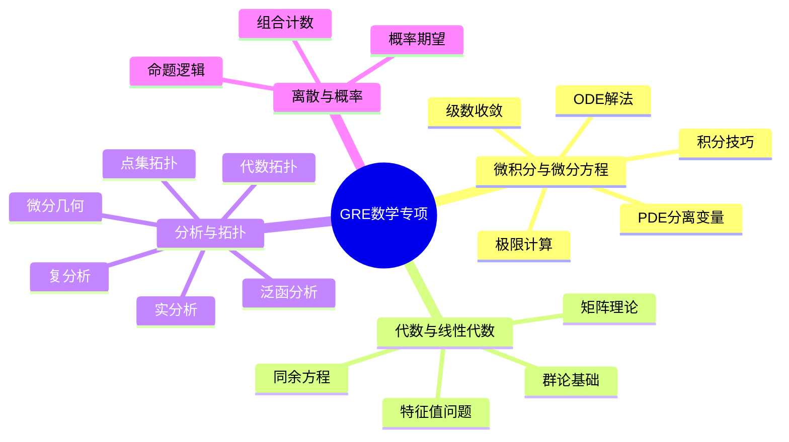

# GRE数学专项习题集

> 面向研究生入学考试（GRE Mathematics Subject Test）的专项训练

## 概述

GRE数学专项考试涵盖大学本科数学的核心内容，包括：
- 微积分（50%）
- 代数（25%）
- 其他主题（25%）：离散数学、实分析、微分方程等

本习题集精选15道代表性题目，难度分级从⭐⭐⭐到⭐⭐⭐⭐⭐。

---

## 题目

### 题目 1 ⭐⭐⭐
**领域：** 微积分 | **主题：** 极限与连续性

**问题：** 计算极限
$$\lim_{x \to 0} \frac{\sin(x) - x + \frac{x^3}{6}}{x^5}$$

**关键思路点拨：**
- 提示1：直接代入得到0/0不定型，考虑泰勒展开
- 提示2：sin(x)的泰勒展开到足够高阶
- 提示3：展开到x⁵项即可

**完整解答：**

使用sin(x)的泰勒展开：
$$\sin(x) = x - \frac{x^3}{6} + \frac{x^5}{120} - \frac{x^7}{5040} + O(x^9)$$

代入分子：
$$\sin(x) - x + \frac{x^3}{6} = \frac{x^5}{120} - \frac{x^7}{5040} + O(x^9)$$

因此：
$$\lim_{x \to 0} \frac{\frac{x^5}{120} + O(x^7)}{x^5} = \frac{1}{120}$$

**答案：** $\boxed{\dfrac{1}{120}}$

**相关概念：** [泰勒展开](../03-分析学/泰勒级数.md) | [洛必达法则](../03-分析学/洛必达法则.md)

---

### 题目 2 ⭐⭐⭐⭐
**领域：** 线性代数 | **主题：** 特征值与对角化

**问题：** 设$A$是$n \times n$实矩阵，满足$A^2 = A$（幂等矩阵）。证明$A$可对角化，并求其特征值。

**关键思路点拨：**
- 提示1：幂等矩阵的特征值满足$\lambda^2 = \lambda$
- 提示2：考虑极小多项式
- 提示3：利用$\mathbb{R}^n = \ker(A) \oplus \text{im}(A)$

**完整解答：**

**步骤1：确定特征值**

设$\lambda$是$A$的特征值，$v$是对应特征向量：
$$Av = \lambda v$$

由$A^2 = A$：
$$A^2v = Av \Rightarrow \lambda^2 v = \lambda v \Rightarrow \lambda(\lambda - 1) = 0$$

所以$\lambda \in \{0, 1\}$。

**步骤2：证明可对角化**

对于任意$v \in \mathbb{R}^n$：
$$v = (v - Av) + Av$$

其中：
- $A(v - Av) = Av - A^2v = Av - Av = 0$，所以$v - Av \in \ker(A)$
- $Av \in \text{im}(A)$

因此$\mathbb{R}^n = \ker(A) + \text{im}(A)$。

若$v \in \ker(A) \cap \text{im}(A)$，则$Av = 0$且$v = Aw$对某个$w$。于是：
$$0 = Av = A^2w = Aw = v$$

所以$\ker(A) \cap \text{im}(A) = \{0\}$，即$\mathbb{R}^n = \ker(A) \oplus \text{im}(A)$。

**步骤3：构造对角化基**

取$\ker(A)$的一组基（特征值0的特征向量）和$\text{im}(A)$的一组基（特征值1的特征向量），它们的并构成$\mathbb{R}^n$的一组基，$A$在此基下的矩阵为对角矩阵。

**答案：** 特征值为$0$和$1$，$A$可对角化。

**相关概念：** [幂等矩阵](../02-代数结构/矩阵代数.md) | [特征值分解](../02-代数结构/特征值与特征向量.md)

---

### 题目 3 ⭐⭐⭐⭐
**领域：** 复分析 | **主题：** 留数定理

**问题：** 计算积分
$$\oint_{|z|=2} \frac{e^z}{z^2(z-1)} dz$$

**关键思路点拨：**
- 提示1：确定奇点及其在积分路径内的位置
- 提示2：奇点$z=0$是二阶极点，$z=1$是单极点
- 提示3：分别计算各奇点处的留数

**完整解答：**

**步骤1：分析奇点**

被积函数$f(z) = \frac{e^z}{z^2(z-1)}$的奇点：
- $z = 0$：二阶极点（在$|z|=2$内）
- $z = 1$：单极点（在$|z|=2$内）

**步骤2：计算$z=1$处的留数**

$$\text{Res}(f, 1) = \lim_{z \to 1} (z-1)f(z) = \lim_{z \to 1} \frac{e^z}{z^2} = e$$

**步骤3：计算$z=0$处的留数**

对于二阶极点：
$$\text{Res}(f, 0) = \lim_{z \to 0} \frac{d}{dz}\left(z^2 f(z)\right) = \lim_{z \to 0} \frac{d}{dz}\left(\frac{e^z}{z-1}\right)$$

$$= \lim_{z \to 0} \frac{e^z(z-1) - e^z}{(z-1)^2} = \lim_{z \to 0} \frac{e^z(z-2)}{(z-1)^2} = -2$$

**步骤4：应用留数定理**

$$\oint_{|z|=2} f(z) dz = 2\pi i \cdot [\text{Res}(f, 0) + \text{Res}(f, 1)] = 2\pi i(-2 + e)$$

**答案：** $\boxed{2\pi i(e - 2)}$

**相关概念：** [留数定理](../03-分析学/复变函数积分.md) | [孤立奇点](../03-分析学/解析函数.md)

---

### 题目 4 ⭐⭐⭐
**领域：** 微分方程 | **主题：** 常微分方程

**问题：** 求解初值问题：
$$y'' + 4y = \sin(2t), \quad y(0) = 0, \quad y'(0) = 0$$

**关键思路点拨：**
- 提示1：注意右侧$\sin(2t)$与齐次解共振
- 提示2：设特解形式为$y_p = t(A\cos(2t) + B\sin(2t))$
- 提示3：代入确定系数

**完整解答：**

**步骤1：齐次解**

特征方程：$r^2 + 4 = 0$，得$r = \pm 2i$

$$y_h = C_1\cos(2t) + C_2\sin(2t)$$

**步骤2：特解**

由于$\sin(2t)$是齐次解的一部分，设：
$$y_p = t(A\cos(2t) + B\sin(2t))$$

求导：
$$y_p' = A\cos(2t) + B\sin(2t) + t(-2A\sin(2t) + 2B\cos(2t))$$
$$y_p'' = -4A\sin(2t) + 4B\cos(2t) + t(-4A\cos(2t) - 4B\sin(2t))$$

代入方程：
$$y_p'' + 4y_p = -4A\sin(2t) + 4B\cos(2t) = \sin(2t)$$

比较系数：$A = -\frac{1}{4}$，$B = 0$

所以：
$$y_p = -\frac{t\cos(2t)}{4}$$

**步骤3：通解与初值**

$$y = C_1\cos(2t) + C_2\sin(2t) - \frac{t\cos(2t)}{4}$$

由$y(0) = 0$：$C_1 = 0$

由$y'(0) = 0$：$y' = 2C_2\cos(2t) - \frac{\cos(2t)}{4} + \frac{t\sin(2t)}{2}$

$y'(0) = 2C_2 - \frac{1}{4} = 0$，所以$C_2 = \frac{1}{8}$

**答案：** $\boxed{y = \dfrac{\sin(2t)}{8} - \dfrac{t\cos(2t)}{4}}$

**相关概念：** [二阶线性ODE](../05-ODE/二阶线性微分方程.md) | [待定系数法](../05-ODE/常微分方程解法.md)

---

### 题目 5 ⭐⭐⭐⭐
**领域：** 抽象代数 | **主题：** 群论

**问题：** 设$G$是有限群，$|G| = p^2$其中$p$是素数。证明$G$是阿贝尔群。

**关键思路点拨：**
- 提示1：应用类方程
- 提示2：中心$Z(G)$的阶必须是$p$或$p^2$
- 提示3：若$|Z(G)| = p^2$，则$G$是阿贝尔群

**完整解答：**

**步骤1：应用类方程**

$$|G| = |Z(G)| + \sum_{i} [G : C_G(g_i)]$$

其中$g_i$是非中心共轭类的代表元。

**步骤2：分析中心的大小**

由于$|G| = p^2$，由拉格朗日定理，$|Z(G)| \in \{1, p, p^2\}$。

**步骤3：证明$|Z(G)| > 1$**

对于类方程中的每一项$[G : C_G(g_i)]$：
- 由于$g_i \notin Z(G)$，所以$C_G(g_i) \neq G$
- $[G : C_G(g_i)]$整除$|G| = p^2$
- 所以$[G : C_G(g_i)] \in \{p, p^2\}$

特别地，$[G : C_G(g_i)] \equiv 0 \pmod{p}$。

由类方程模$p$：
$$|G| \equiv |Z(G)| \pmod{p}$$
$$0 \equiv |Z(G)| \pmod{p}$$

所以$p \mid |Z(G)|$，即$|Z(G)| \geq p$。

**步骤4：证明$G$是阿贝尔群**

**情况1：** 若$|Z(G)| = p^2$，则$G = Z(G)$，$G$是阿贝尔群。

**情况2：** 若$|Z(G)| = p$，考虑商群$G/Z(G)$，其阶为$p$，是循环群。

设$G/Z(G) = \langle aZ(G) \rangle$。对任意$x, y \in G$，存在整数$m, n$使得：
$$x \in a^m Z(G), \quad y \in a^n Z(G)$$

所以$x = a^m z_1$，$y = a^n z_2$对某个$z_1, z_2 \in Z(G)$。

于是：
$$xy = a^m z_1 a^n z_2 = a^{m+n} z_1 z_2 = a^n z_2 a^m z_1 = yx$$

所以$G$是阿贝尔群，这与$|Z(G)| = p < p^2$矛盾。

因此$|Z(G)| = p^2$，$G$是阿贝尔群。

**答案：** $G$是阿贝尔群。

**相关概念：** [群的中心](../02-代数结构/群论基础.md) | [类方程](../02-代数结构/群作用.md)

---

### 题目 6 ⭐⭐⭐
**领域：** 拓扑学 | **主题：** 点集拓扑

**问题：** 设$X$是拓扑空间，$A \subseteq X$。证明：$A$是开集当且仅当$A$中每一点都是内点。

**关键思路点拨：**
- 提示1：回顾内点的定义
- 提示2：利用开集的定义（任意并）
- 提示3：双向证明

**完整解答：**

**（⇒）设$A$是开集，证明每一点都是内点**

对任意$x \in A$，由于$A$是开集且$x \in A$，取$U = A$即为$x$的邻域且$U \subseteq A$。

所以$x$是$A$的内点。

**（⇐）设$A$中每一点都是内点，证明$A$是开集**

对每个$x \in A$，存在开集$U_x$使得$x \in U_x \subseteq A$。

于是：
$$A = \bigcup_{x \in A} U_x$$

由于任意开集的并仍是开集，$A$是开集。

**答案：** 得证。

**相关概念：** [开集](../04-几何与拓扑/拓扑空间.md) | [内点](../04-几何与拓扑/点集拓扑.md)

---

### 题目 7 ⭐⭐⭐⭐⭐
**领域：** 实分析 | **主题：** 一致收敛

**问题：** 设$f_n(x) = \frac{x}{1 + nx^2}$在$[0, 1]$上。证明：
1. $f_n$点态收敛于0
2. $f_n$在$[0, 1]$上一致收敛于0
3. 求$\lim_{n \to \infty} \int_0^1 f_n(x) dx$

**关键思路点拨：**
- 提示1：对固定$x$，直接计算极限
- 提示2：求$f_n$的最大值以证一致收敛
- 提示3：利用一致收敛交换极限与积分

**完整解答：**

**（1）点态收敛**

对固定$x \in [0, 1]$：
$$\lim_{n \to \infty} f_n(x) = \lim_{n \to \infty} \frac{x}{1 + nx^2} = 0$$

所以$f_n \to 0$点态收敛。

**（2）一致收敛**

求$f_n$的最大值。对$x > 0$：
$$f_n'(x) = \frac{1 + nx^2 - x \cdot 2nx}{(1 + nx^2)^2} = \frac{1 - nx^2}{(1 + nx^2)^2}$$

令$f_n'(x) = 0$，得$x = \frac{1}{\sqrt{n}}$。

最大值：
$$f_n\left(\frac{1}{\sqrt{n}}\right) = \frac{\frac{1}{\sqrt{n}}}{1 + n \cdot \frac{1}{n}} = \frac{1}{2\sqrt{n}} \to 0$$

由于$\sup_{x \in [0,1]} |f_n(x) - 0| = \frac{1}{2\sqrt{n}} \to 0$，所以一致收敛。

**（3）积分极限**

由一致收敛性：
$$\lim_{n \to \infty} \int_0^1 f_n(x) dx = \int_0^1 \lim_{n \to \infty} f_n(x) dx = \int_0^1 0 \, dx = 0$$

直接计算验证：
$$\int_0^1 \frac{x}{1 + nx^2} dx = \frac{1}{2n} \ln(1 + nx^2)\Big|_0^1 = \frac{\ln(1+n)}{2n} \to 0$$

**答案：**
1. 点态收敛于0
2. 一致收敛于0
3. $\boxed{0}$

**相关概念：** [一致收敛](../03-分析学/函数序列与级数.md) | [积分与极限交换](../03-分析学/勒贝格积分.md)

---

### 题目 8 ⭐⭐⭐⭐
**领域：** 离散数学 | **主题：** 组合计数

**问题：** 从$n$对夫妇中选出$k$人（$k \leq n$），要求没有两人是夫妻，有多少种选法？

**关键思路点拨：**
- 提示1：从$k$对夫妇中各选1人
- 提示2：先选夫妇对，再从每对中选1人
- 提示3：使用容斥原理或直接计数

**完整解答：**

**方法1：直接计数**

**步骤1：** 从$n$对夫妇中选出$k$对，有$\binom{n}{k}$种方法。

**步骤2：** 从这$k$对中，每对选1人（丈夫或妻子），有$2^k$种方法。

由乘法原理，总数为：
$$\binom{n}{k} \cdot 2^k$$

**方法2：容斥原理验证**

从$2n$人中选$k$人，减去至少有一对夫妻被选中的情况。

设$A_i$表示第$i$对夫妻都被选中，则：

$$\left|\bigcup_{i=1}^n A_i\right| = \sum_{i} |A_i| - \sum_{i<j} |A_i \cap A_j| + \cdots$$

其中$|A_{i_1} \cap \cdots \cap A_{i_m}| = \binom{2n-2m}{k-2m}$

由容斥原理：
$$\binom{2n}{k} - \binom{n}{1}\binom{2n-2}{k-2} + \binom{n}{2}\binom{2n-4}{k-4} - \cdots$$

可以验证这与$\binom{n}{k}2^k$相等。

**答案：** $\boxed{\dbinom{n}{k} \cdot 2^k}$

**相关概念：** [组合计数](../09-组合数学与离散数学/组合数学基础.md) | [容斥原理](../09-组合数学与离散数学/容斥原理.md)

---

### 题目 9 ⭐⭐⭐⭐
**领域：** 概率论 | **主题：** 期望与方差

**问题：** 设$X_1, X_2, \ldots, X_n$是独立同分布的随机变量，$E[X_i] = \mu$，$\text{Var}(X_i) = \sigma^2$。定义样本方差：
$$S^2 = \frac{1}{n-1}\sum_{i=1}^n (X_i - \bar{X})^2$$
其中$\bar{X} = \frac{1}{n}\sum_{i=1}^n X_i$。证明$E[S^2] = \sigma^2$。

**关键思路点拨：**
- 提示1：展开$(X_i - \bar{X})^2 = X_i^2 - 2X_i\bar{X} + \bar{X}^2$
- 提示2：计算$E[\bar{X}^2]$和$E[X_i\bar{X}]$
- 提示3：利用$\text{Var}(X) = E[X^2] - (E[X])^2$

**完整解答：**

**步骤1：展开平方项**

$$(X_i - \bar{X})^2 = X_i^2 - 2X_i\bar{X} + \bar{X}^2$$

**步骤2：计算期望**

$$E\left[\sum_{i=1}^n (X_i - \bar{X})^2\right] = \sum_{i=1}^n E[X_i^2] - 2E\left[\bar{X}\sum_{i=1}^n X_i\right] + nE[\bar{X}^2]$$

由于$\sum_{i=1}^n X_i = n\bar{X}$：
$$= \sum_{i=1}^n E[X_i^2] - 2nE[\bar{X}^2] + nE[\bar{X}^2]$$
$$= \sum_{i=1}^n E[X_i^2] - nE[\bar{X}^2]$$

**步骤3：计算各项**

由于$E[X_i^2] = \sigma^2 + \mu^2$：
$$\sum_{i=1}^n E[X_i^2] = n(\sigma^2 + \mu^2)$$

计算$E[\bar{X}^2]$：
$$\text{Var}(\bar{X}) = \frac{\sigma^2}{n}, \quad E[\bar{X}] = \mu$$

所以：
$$E[\bar{X}^2] = \text{Var}(\bar{X}) + (E[\bar{X}])^2 = \frac{\sigma^2}{n} + \mu^2$$

**步骤4：合并结果**

$$E\left[\sum_{i=1}^n (X_i - \bar{X})^2\right] = n(\sigma^2 + \mu^2) - n\left(\frac{\sigma^2}{n} + \mu^2\right)$$
$$= n\sigma^2 + n\mu^2 - \sigma^2 - n\mu^2$$
$$= (n-1)\sigma^2$$

因此：
$$E[S^2] = \frac{1}{n-1} \cdot (n-1)\sigma^2 = \sigma^2$$

**答案：** $\boxed{E[S^2] = \sigma^2}$

**相关概念：** [样本方差](../06-概率论与统计/统计推断.md) | [无偏估计](../06-概率论与统计/估计理论.md)

---

### 题目 10 ⭐⭐⭐⭐⭐
**领域：** 微分几何 | **主题：** 曲线论

**问题：** 设$\gamma(t) = (\cos t, \sin t, t)$是圆柱螺线。计算：
1. 曲率$\kappa(t)$
2. 挠率$\tau(t)$
3. Frenet标架$\{T, N, B\}$

**关键思路点拨：**
- 提示1：先计算$\gamma'(t)$和$\gamma''(t)$
- 提示2：利用公式$\kappa = \frac{|\gamma' \times \gamma''|}{|\gamma'|^3}$
- 提示3：挠率$\tau = \frac{(\gamma' \times \gamma'') \cdot \gamma'''}{|\gamma' \times \gamma''|^2}$

**完整解答：**

**步骤1：计算各阶导数**

$$\gamma'(t) = (-\sin t, \cos t, 1)$$
$$\gamma''(t) = (-\cos t, -\sin t, 0)$$
$$\gamma'''(t) = (\sin t, -\cos t, 0)$$

**步骤2：计算切向量**

$$|\gamma'(t)| = \sqrt{\sin^2 t + \cos^2 t + 1} = \sqrt{2}$$

$$T = \frac{\gamma'}{|\gamma'|} = \frac{1}{\sqrt{2}}(-\sin t, \cos t, 1)$$

**步骤3：计算曲率**

$$\gamma' \times \gamma'' = \begin{vmatrix} i & j & k \\ -\sin t & \cos t & 1 \\ -\cos t & -\sin t & 0 \end{vmatrix}$$

$$= (\sin t, -\cos t, \sin^2 t + \cos^2 t) = (\sin t, -\cos t, 1)$$

$$|\gamma' \times \gamma''| = \sqrt{\sin^2 t + \cos^2 t + 1} = \sqrt{2}$$

$$\kappa = \frac{|\gamma' \times \gamma''|}{|\gamma'|^3} = \frac{\sqrt{2}}{(\sqrt{2})^3} = \frac{1}{2}$$

**步骤4：计算Frenet标架**

**主法向量：**
$$N = \frac{T'}{|T'|}$$

$$T' = \frac{1}{\sqrt{2}}(-\cos t, -\sin t, 0)$$
$$|T'| = \frac{1}{\sqrt{2}}$$

$$N = (-\cos t, -\sin t, 0)$$

**副法向量：**
$$B = T \times N = \frac{1}{\sqrt{2}}\begin{vmatrix} i & j & k \\ -\sin t & \cos t & 1 \\ -\cos t & -\sin t & 0 \end{vmatrix}$$

$$= \frac{1}{\sqrt{2}}(\sin t, -\cos t, 1)$$

**步骤5：计算挠率**

$$(\gamma' \times \gamma'') \cdot \gamma''' = (\sin t, -\cos t, 1) \cdot (\sin t, -\cos t, 0) = \sin^2 t + \cos^2 t = 1$$

$$\tau = \frac{(\gamma' \times \gamma'') \cdot \gamma'''}{|\gamma' \times \gamma''|^2} = \frac{1}{2}$$

**答案：**
- 曲率：$\boxed{\kappa = \dfrac{1}{2}}$
- 挠率：$\boxed{\tau = \dfrac{1}{2}}$
- Frenet标架：$T = \frac{1}{\sqrt{2}}(-\sin t, \cos t, 1)$，$N = (-\cos t, -\sin t, 0)$，$B = \frac{1}{\sqrt{2}}(\sin t, -\cos t, 1)$

**相关概念：** [Frenet公式](../04-几何与拓扑/曲线论.md) | [曲率与挠率](../04-几何与拓扑/微分几何基础.md)

---

### 题目 11 ⭐⭐⭐
**领域：** 数理逻辑 | **主题：** 命题逻辑

**问题：** 证明：$(p \to q) \to ((q \to r) \to (p \to r))$是永真式。

**关键思路点拨：**
- 提示1：使用真值表
- 提示2：或使用等价变换
- 提示3：利用$p \to q \equiv \neg p \lor q$

**完整解答：**

**方法1：等价变换**

$$(p \to q) \to ((q \to r) \to (p \to r))$$
$$\equiv \neg(p \to q) \lor ((q \to r) \to (p \to r))$$
$$\equiv \neg(\neg p \lor q) \lor (\neg(q \to r) \lor (p \to r))$$
$$\equiv (p \land \neg q) \lor (\neg(\neg q \lor r) \lor (\neg p \lor r))$$
$$\equiv (p \land \neg q) \lor ((q \land \neg r) \lor \neg p \lor r)$$

对于任意赋值：
- 若$p$为假，则$(p \land \neg q)$为假，但$\neg p$为真，整个式子为真
- 若$p$为真且$q$为真，则：
  - 若$r$为真，$r$为真，整个式子为真
  - 若$r$为假，$q \land \neg r$为真，整个式子为真
- 若$p$为真且$q$为假，则$p \land \neg q$为真，整个式子为真

所以是永真式。

**方法2：自然演绎证明**

1. 假设$p \to q$（前提）
2. 假设$q \to r$（前提）
3. 假设$p$（前提）
4. 由1,3得$q$（假言推理）
5. 由2,4得$r$（假言推理）
6. 由3-5得$p \to r$（条件证明）
7. 由2-6得$(q \to r) \to (p \to r)$（条件证明）
8. 由1-7得$(p \to q) \to ((q \to r) \to (p \to r))$（条件证明）

**答案：** 永真式得证。

**相关概念：** [命题逻辑](../07-数理逻辑/命题逻辑.md) | [永真式](../07-数理逻辑/逻辑演算.md)

---

### 题目 12 ⭐⭐⭐⭐
**领域：** 数论 | **主题：** 同余方程

**问题：** 求解同余方程组：
$$\begin{cases} x \equiv 2 \pmod{3} \\ x \equiv 3 \pmod{5} \\ x \equiv 2 \pmod{7} \end{cases}$$

**关键思路点拨：**
- 提示1：应用中国剩余定理
- 提示2：由于模数两两互素，解存在且唯一（模105）
- 提示3：逐步求解或使用公式

**完整解答：**

**步骤1：验证条件**

$3, 5, 7$两两互素，$M = 3 \times 5 \times 7 = 105$。

**步骤2：计算各$M_i$和$y_i$**

- $M_1 = \frac{105}{3} = 35$，求$y_1$使$35y_1 \equiv 1 \pmod{3}$
  - $35 \equiv 2 \pmod{3}$，所以$2y_1 \equiv 1 \pmod{3}$
  - $y_1 = 2$（因为$2 \times 2 = 4 \equiv 1$）

- $M_2 = \frac{105}{5} = 21$，求$y_2$使$21y_2 \equiv 1 \pmod{5}$
  - $21 \equiv 1 \pmod{5}$，所以$y_2 = 1$

- $M_3 = \frac{105}{7} = 15$，求$y_3$使$15y_3 \equiv 1 \pmod{7}$
  - $15 \equiv 1 \pmod{7}$，所以$y_3 = 1$

**步骤3：计算解**

$$x = a_1M_1y_1 + a_2M_2y_2 + a_3M_3y_3$$
$$= 2 \times 35 \times 2 + 3 \times 21 \times 1 + 2 \times 15 \times 1$$
$$= 140 + 63 + 30 = 233$$

$$x \equiv 233 \equiv 23 \pmod{105}$$

**验证：**
- $23 = 7 \times 3 + 2 \equiv 2 \pmod{3}$ ✓
- $23 = 4 \times 5 + 3 \equiv 3 \pmod{5}$ ✓
- $23 = 3 \times 7 + 2 \equiv 2 \pmod{7}$ ✓

**答案：** $\boxed{x \equiv 23 \pmod{105}}$

**相关概念：** [中国剩余定理](../05-数论/同余理论.md) | [同余方程](../05-数论/模运算.md)

---

### 题目 13 ⭐⭐⭐⭐
**领域：** 泛函分析 | **主题：** Hilbert空间

**问题：** 设$H$是Hilbert空间，$M$是$H$的闭子空间。证明$H = M \oplus M^\perp$。

**关键思路点拨：**
- 提示1：证明$M \cap M^\perp = \{0\}$
- 提示2：证明$H = M + M^\perp$
- 提示3：利用投影定理

**完整解答：**

**步骤1：证明$M \cap M^\perp = \{0\}$**

若$x \in M \cap M^\perp$，则：
- $x \in M$
- $x \in M^\perp$，即对所有$y \in M$，$\langle x, y \rangle = 0$

特别地，取$y = x$：
$$\langle x, x \rangle = \|x\|^2 = 0$$

所以$x = 0$。

**步骤2：证明$M + M^\perp$是闭的**

设$\{x_n + y_n\}$是$M + M^\perp$中的序列，收敛于$z \in H$，其中$x_n \in M$，$y_n \in M^\perp$。

由于$M$和$M^\perp$正交：
$$\|x_n + y_n - (x_m + y_m)\|^2 = \|x_n - x_m\|^2 + \|y_n - y_m\|^2$$

所以$\{x_n\}$和$\{y_n\}$都是Cauchy列。

由于$M$和$M^\perp$都是闭的，$x_n \to x \in M$，$y_n \to y \in M^\perp$。

所以$z = x + y \in M + M^\perp$，即$M + M^\perp$是闭的。

**步骤3：证明$(M + M^\perp)^\perp = \{0\}$**

若$z \in (M + M^\perp)^\perp$，则：
- 对所有$x \in M$，$\langle z, x \rangle = 0$，所以$z \in M^\perp$
- 对所有$y \in M^\perp$，$\langle z, y \rangle = 0$

由于$z \in M^\perp$，取$y = z$得$\|z\|^2 = 0$，所以$z = 0$。

因此$M + M^\perp = H$。

**答案：** 正交分解定理得证。

**相关概念：** [Hilbert空间](../03-分析学/泛函分析.md) | [正交补](../02-代数结构/内积空间.md)

---

### 题目 14 ⭐⭐⭐⭐⭐
**领域：** 偏微分方程 | **主题：** 分离变量法

**问题：** 求解热方程初边值问题：
$$\begin{cases} u_t = u_{xx}, & 0 < x < \pi, t > 0 \\ u(0, t) = u(\pi, t) = 0, & t > 0 \\ u(x, 0) = \sin(3x), & 0 \leq x \leq \pi \end{cases}$$

**关键思路点拨：**
- 提示1：设$u(x,t) = X(x)T(t)$分离变量
- 提示2：求解特征值问题$X'' + \lambda X = 0$
- 提示3：利用初始条件确定系数

**完整解答：**

**步骤1：分离变量**

设$u(x,t) = X(x)T(t)$，代入方程：
$$X(x)T'(t) = X''(x)T(t)$$
$$\frac{T'(t)}{T(t)} = \frac{X''(x)}{X(x)} = -\lambda$$

**步骤2：求解空间方程**

$$X'' + \lambda X = 0, \quad X(0) = X(\pi) = 0$$

**情况1：** $\lambda < 0$，设$\lambda = -\mu^2$

$$X = Ae^{\mu x} + Be^{-\mu x}$$

由边界条件：
$$A + B = 0, \quad Ae^{\mu\pi} + Be^{-\mu\pi} = 0$$

得$A = B = 0$，只有平凡解。

**情况2：** $\lambda = 0$

$$X = Ax + B$$

由边界条件得$A = B = 0$，只有平凡解。

**情况3：** $\lambda > 0$，设$\lambda = \mu^2$

$$X = A\cos(\mu x) + B\sin(\mu x)$$

由$X(0) = 0$：$A = 0$

由$X(\pi) = 0$：$B\sin(\mu\pi) = 0$，所以$\mu = n$，$n = 1, 2, 3, \ldots$

特征值：$\lambda_n = n^2$，特征函数：$X_n(x) = \sin(nx)$

**步骤3：求解时间方程**

$$T_n'(t) = -n^2 T_n(t) \Rightarrow T_n(t) = C_n e^{-n^2 t}$$

**步骤4：叠加与初始条件**

$$u(x,t) = \sum_{n=1}^{\infty} C_n e^{-n^2 t} \sin(nx)$$

由$u(x, 0) = \sin(3x)$：
$$\sum_{n=1}^{\infty} C_n \sin(nx) = \sin(3x)$$

所以$C_3 = 1$，其他$C_n = 0$。

**答案：** $\boxed{u(x,t) = e^{-9t}\sin(3x)}$

**相关概念：** [分离变量法](../05-ODE/偏微分方程.md) | [热方程](../05-ODE/抛物型方程.md)

---

### 题目 15 ⭐⭐⭐⭐⭐
**领域：** 代数拓扑 | **主题：** 基本群

**问题：** 计算圆$S^1$的基本群$\pi_1(S^1, 1)$。

**关键思路点拨：**
- 提示1：使用覆叠空间理论
- 提示2：考虑万有覆叠$p: \mathbb{R} \to S^1$，$p(t) = e^{2\pi i t}$
- 提示3：纤维$p^{-1}(1) = \mathbb{Z}$

**完整解答：**

**步骤1：构造覆叠映射**

定义$p: \mathbb{R} \to S^1$，$p(t) = e^{2\pi i t}$。

这是一个覆叠映射，纤维$p^{-1}(1) = \mathbb{Z}$。

**步骤2：道路提升性质**

对任意基于$1$的回路$\gamma: [0,1] \to S^1$，存在唯一的提升$\tilde{\gamma}: [0,1] \to \mathbb{R}$满足：
- $\tilde{\gamma}(0) = 0$
- $p \circ \tilde{\gamma} = \gamma$

**步骤3：定义同态**

定义$\phi: \pi_1(S^1, 1) \to \mathbb{Z}$：
$$\phi([\gamma]) = \tilde{\gamma}(1) \in \mathbb{Z}$$

这是良定义的，因为道路同伦的回路有道路同伦的提升。

**步骤4：证明$\phi$是同态**

设$\gamma_1, \gamma_2$是两个回路，$\tilde{\gamma}_1, \tilde{\gamma}_2$是提升。

$\gamma_1 * \gamma_2$的提升：
$$\widetilde{\gamma_1 * \gamma_2}(t) = \begin{cases} \tilde{\gamma}_1(2t) & 0 \leq t \leq \frac{1}{2} \\ \tilde{\gamma}_2(2t-1) + \tilde{\gamma}_1(1) & \frac{1}{2} \leq t \leq 1 \end{cases}$$

所以：
$$\phi([\gamma_1] * [\gamma_2]) = \widetilde{\gamma_1 * \gamma_2}(1) = \tilde{\gamma}_2(1) + \tilde{\gamma}_1(1) = \phi([\gamma_1]) + \phi([\gamma_2])$$

**步骤5：证明$\phi$是双射**

**满射：** 对$n \in \mathbb{Z}$，设$\gamma_n(t) = e^{2\pi i n t}$，则$\tilde{\gamma}_n(t) = nt$，$\phi([\gamma_n]) = n$。

**单射：** 若$\phi([\gamma]) = 0$，则$\tilde{\gamma}(1) = 0 = \tilde{\gamma}(0)$，所以$\tilde{\gamma}$是$\mathbb{R}$中的回路。

由于$\mathbb{R}$单连通，$\tilde{\gamma}$道路同伦于常值道路，所以$\gamma = p \circ \tilde{\gamma}$道路同伦于常值道路。

**答案：** $\boxed{\pi_1(S^1, 1) \cong \mathbb{Z}}$

**相关概念：** [基本群](../04-几何与拓扑/代数拓扑.md) | [覆叠空间](../04-几何与拓扑/覆叠空间.md)

---

## 问题分类思维导图

---

## 备考建议

1. **时间分配：** 考试共170分钟，每题约2分钟
2. **优先顺序：** 先做熟悉领域，难题标记后回头
3. **快速检验：** 选择题可用特殊值法验证
4. **公式记忆：** 重点掌握常用积分、级数展开
5. **模拟训练：** 定期做全真模拟，训练答题节奏

---

## 相关资源

- [Calculus](../03-分析学/微积分.md)
- [Linear Algebra](../02-代数结构/线性代数.md)
- [Complex Analysis](../03-分析学/复分析.md)
- [Abstract Algebra](../02-代数结构/抽象代数.md)
- [Topology](../04-几何与拓扑/拓扑学.md)
- [Probability](../06-概率论与统计/概率论基础.md)
